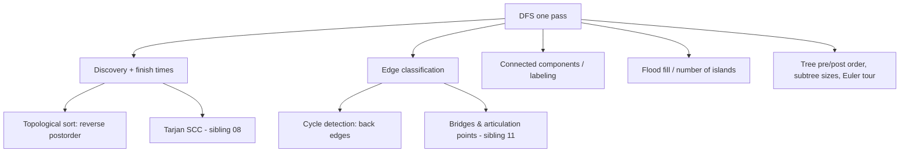

# Depth-First Search — Middle Level

> **Focus:** Discovery/finish times and the parenthesis structure they create, the four edge classes and what they mean in directed vs undirected graphs, and how DFS composes into cycle detection, topological sort, and component labeling.

---

## Table of Contents

1. [Introduction](#introduction)
2. [Deeper Concepts](#deeper-concepts)
3. [Comparison with Alternatives](#comparison-with-alternatives)
4. [Advanced Patterns](#advanced-patterns)
5. [Graph and Tree Applications](#graph-and-tree-applications)
6. [Algorithmic Integration](#algorithmic-integration)
7. [Code Examples](#code-examples)
8. [Error Handling](#error-handling)
9. [Performance Analysis](#performance-analysis)
10. [Best Practices](#best-practices)
11. [Visual Animation](#visual-animation)
12. [Summary](#summary)

---

## Introduction

At junior level DFS is "go deep, mark visited, backtrack." At middle level you start asking the questions that turn a traversal into an *algorithm*:

- What extra bookkeeping does DFS produce for free, and why is it useful?
- When DFS walks an edge, what *kind* of edge is it — and what does that tell me?
- Why does reversing the postorder of a DAG give a topological order?
- Why is undirected cycle detection a "parent check" but directed cycle detection a "color check"?
- When should I reach for BFS instead?

The key realization: a DFS is not just a visiting sequence, it is a *timestamped tree* layered on top of the graph. The timestamps (discovery and finish) and the classification of every non-tree edge are what make Tarjan-style algorithms possible.

---

## Deeper Concepts

### Discovery and finish times

Run a global clock that ticks every time we enter or leave a vertex. Stamp `disc[u]` when DFS first reaches `u`, and `fin[u]` when DFS leaves `u` for good:

```
time = 0
dfs(u):
    disc[u] = ++time
    color[u] = GRAY
    for v in adj[u]:
        if color[v] == WHITE:
            dfs(v)
    color[u] = BLACK
    fin[u] = ++time
```

This gives every vertex an **interval** `[disc[u], fin[u]]`. The three colors mark the lifecycle:

- **WHITE** — not yet discovered.
- **GRAY** — discovered, still on the recursion stack (we are inside its interval).
- **BLACK** — finished, interval closed.

### The Parenthesis Theorem

The intervals `[disc[u], fin[u]]` are **properly nested**, like balanced parentheses. For any two vertices `u` and `v`, exactly one of these holds:

1. The intervals are **disjoint** — neither is an ancestor of the other in the DFS tree.
2. `[disc[u], fin[u]]` **contains** `[disc[v], fin[v]]` — `u` is an ancestor of `v`.
3. `[disc[v], fin[v]]` contains `[disc[u], fin[u]]` — `v` is an ancestor of `u`.

They never partially overlap. This is the structural backbone of DFS and is proved formally in `professional.md`. It is what lets you answer "is `u` an ancestor of `v`?" in `O(1)` after one DFS: check whether `disc[u] < disc[v] < fin[v] < fin[u]`.

### Edge classification

When DFS at `u` looks at edge `(u, v)`, the edge falls into exactly one of four classes, decided by `v`'s color:

| `v`'s color when edge `(u,v)` is examined | Class | Meaning |
|---|---|---|
| WHITE | **Tree edge** | We discover `v` via this edge; it joins the DFS tree. |
| GRAY | **Back edge** | `v` is an ancestor still on the stack → this edge closes a cycle. |
| BLACK, `disc[u] < disc[v]` | **Forward edge** | `v` is a descendant already finished (reached another way). |
| BLACK, `disc[u] > disc[v]` | **Cross edge** | `v` is in an earlier-finished subtree, not an ancestor or descendant. |

What changes between graph types:

- **Undirected graphs** have only **tree edges and back edges**. Forward and cross edges cannot occur, because the first time DFS sees an undirected edge it will always be a tree or back edge (the other direction is the same edge). The only subtlety: the edge back to your immediate parent is a back edge *in form* but must be excluded from cycle detection.
- **Directed graphs** can have all four classes. A directed graph has a cycle **if and only if** DFS finds at least one **back edge** (an edge into a gray vertex).

### Why postorder reverse = topological order

In a DAG, consider any edge `u → v`. When DFS explores it, `v` is either WHITE (so `v` finishes before `u`) or BLACK (so `v` already finished, again before `u`). It can never be GRAY — that would be a back edge, i.e. a cycle, which a DAG forbids. Therefore **`fin[u] > fin[v]` for every edge `u → v`**. Sorting vertices by *decreasing* finish time puts every vertex before all vertices it points to — a valid topological order. This is the entire basis of DFS-based topological sort (sibling `07-topological-sort`).

---

## Comparison with Alternatives

### DFS vs BFS

| Attribute | DFS | BFS |
|-----------|-----|-----|
| Data structure | Stack (or recursion) | Queue |
| Exploration order | Deep first, one branch fully | Level by level, nearest first |
| Time | `O(V + E)` | `O(V + E)` |
| Space (worst case) | `O(V)` — current path / stack | `O(V)` — a whole level can be in the queue |
| Shortest path (unweighted) | **No** | **Yes** — first time a vertex is reached is via a shortest path |
| Discovery/finish times | **Yes** — enables topo sort, SCC, bridges | No natural finish-time notion |
| Cycle detection | Natural (back edges) | Possible but less direct |
| Topological sort | Natural (reverse postorder) | Possible via Kahn's algorithm (indegrees) |
| Connected components | Yes | Yes |
| Memory shape on wide graphs | Light (only the path) | Heavy (a wide level) |
| Memory shape on deep graphs | Heavy (deep stack) | Light |
| Typical use | Structure/ordering problems | Distance/shortest-path problems |

**Choose DFS when:** you need ordering (topo sort), structural decomposition (SCC, bridges, articulation points), cycle detection, or you are exploring/backtracking a search space.

**Choose BFS when:** you need shortest paths in unweighted graphs, level-order processing, or you want to bound memory on a graph that is deep but narrow.

---

## Advanced Patterns

### Pattern: Directed cycle detection with colors

A directed graph has a cycle iff DFS ever finds an edge into a GRAY vertex.

```
WHITE = not seen, GRAY = on stack, BLACK = done

dfs(u):
    color[u] = GRAY
    for v in adj[u]:
        if color[v] == GRAY:   return CYCLE      # back edge
        if color[v] == WHITE and dfs(v): return CYCLE
    color[u] = BLACK
    return NO_CYCLE
```

### Pattern: Undirected cycle detection with the parent rule

In an undirected graph, a cycle exists iff DFS reaches an already-visited vertex that is **not** the parent it came from.

```
dfs(u, parent):
    visited[u] = true
    for v in adj[u]:
        if not visited[v]:
            if dfs(v, u): return CYCLE
        elif v != parent:                        # back edge, not the parent
            return CYCLE
    return NO_CYCLE
```

A subtle case: parallel edges between `u` and `v` *do* form a cycle even though `v` is the parent. If your graph can have multi-edges, track edge ids rather than parent vertex.

### Pattern: Topological sort via postorder

```
order = []
dfs(u):
    visited[u] = true
    for v in adj[u]:
        if not visited[v]: dfs(v)
    order.append(u)        # postorder

topo = reversed(order)     # valid order for a DAG
```

If the graph has a cycle, no valid topological order exists — combine this with the color-based cycle check and bail out.

### Pattern: Component labeling

Assign each vertex a component id in one full DFS sweep.

```
comp = [-1] * n
cid = 0
for s in range(n):
    if comp[s] == -1:
        # DFS/iterative flood from s, labeling every reached vertex cid
        cid += 1
```

---

## Graph and Tree Applications



On a **tree**, DFS needs no visited set beyond skipping the parent (a tree has no cycles). DFS on a tree yields:

- **Preorder / postorder** traversals.
- **Subtree sizes** (computed in postorder: `size[u] = 1 + sum(size[child])`).
- An **Euler tour** that flattens the tree into an array for range queries — the launching point for LCA and Heavy-Light Decomposition (siblings `13-lca`, `14-heavy-light-decomposition`).

---

## Algorithmic Integration

DFS is the foundation for several heavier graph algorithms; you will meet each as a sibling topic:

- **Strongly Connected Components (sibling `08-tarjan-scc`).** Tarjan's algorithm runs a single DFS and tracks, for each vertex, the lowest discovery time reachable via back/cross edges (`low-link`). When a vertex's low-link equals its own discovery time, the current stack segment is one SCC. Kosaraju's alternative uses two DFS passes (one on the graph, one on its transpose, ordered by finish times). Both rely entirely on DFS timestamps.

- **Bridges and articulation points (sibling `11-articulation-points-bridges`).** Using the same `low-link` idea, an edge `(u, v)` is a **bridge** if no back edge from `v`'s subtree reaches `u` or above (`low[v] > disc[u]`). A vertex is an **articulation point** if removing it disconnects the graph — detectable from `low` values and the root's child count. This is one DFS.

- **Topological sort (sibling `07-topological-sort`).** As shown above, reverse postorder of a DAG.

The common thread: these are not separate traversals bolted together; they are *the same DFS* with extra `O(1)` bookkeeping per vertex and per edge, preserving the `O(V + E)` bound.

---

## Code Examples

### Directed cycle detection with three colors

#### Go

```go
package main

import "fmt"

const (
	white = 0
	gray  = 1
	black = 2
)

func hasCycle(adj [][]int) bool {
	color := make([]int, len(adj))
	var dfs func(u int) bool
	dfs = func(u int) bool {
		color[u] = gray
		for _, v := range adj[u] {
			if color[v] == gray {
				return true // back edge -> cycle
			}
			if color[v] == white && dfs(v) {
				return true
			}
		}
		color[u] = black
		return false
	}
	for u := range adj {
		if color[u] == white && dfs(u) {
			return true
		}
	}
	return false
}

func main() {
	acyclic := [][]int{{1, 2}, {3}, {3}, {4}, {}}
	cyclic := [][]int{{1}, {2}, {0}} // 0->1->2->0
	fmt.Println(hasCycle(acyclic))   // false
	fmt.Println(hasCycle(cyclic))    // true
}
```

#### Java

```java
import java.util.*;

public class DirectedCycle {
    static final int WHITE = 0, GRAY = 1, BLACK = 2;
    static int[] color;
    static List<List<Integer>> adj;

    static boolean dfs(int u) {
        color[u] = GRAY;
        for (int v : adj.get(u)) {
            if (color[v] == GRAY) return true;            // back edge
            if (color[v] == WHITE && dfs(v)) return true;
        }
        color[u] = BLACK;
        return false;
    }

    static boolean hasCycle(List<List<Integer>> g) {
        adj = g;
        color = new int[g.size()];
        for (int u = 0; u < g.size(); u++) {
            if (color[u] == WHITE && dfs(u)) return true;
        }
        return false;
    }

    public static void main(String[] args) {
        var acyclic = List.of(List.of(1, 2), List.of(3), List.of(3), List.of(4), List.of());
        var cyclic = List.of(List.of(1), List.of(2), List.of(0));
        System.out.println(hasCycle(acyclic)); // false
        System.out.println(hasCycle(cyclic));  // true
    }
}
```

#### Python

```python
WHITE, GRAY, BLACK = 0, 1, 2


def has_cycle(adj):
    color = [WHITE] * len(adj)

    def dfs(u):
        color[u] = GRAY
        for v in adj[u]:
            if color[v] == GRAY:           # back edge -> cycle
                return True
            if color[v] == WHITE and dfs(v):
                return True
        color[u] = BLACK
        return False

    return any(color[u] == WHITE and dfs(u) for u in range(len(adj)))


if __name__ == "__main__":
    acyclic = [[1, 2], [3], [3], [4], []]
    cyclic = [[1], [2], [0]]   # 0 -> 1 -> 2 -> 0
    print(has_cycle(acyclic))  # False
    print(has_cycle(cyclic))   # True
```

---

### Iterative DFS that emits postorder (and a topo order)

A common interview ask: produce postorder *without recursion*. Use a stack of `(vertex, child_index)` frames so you can do work when a vertex's children are exhausted.

#### Go

```go
package main

import "fmt"

func topoSort(adj [][]int) []int {
	n := len(adj)
	visited := make([]bool, n)
	post := []int{}
	type frame struct{ u, i int }
	for s := 0; s < n; s++ {
		if visited[s] {
			continue
		}
		stack := []frame{{s, 0}}
		visited[s] = true
		for len(stack) > 0 {
			top := &stack[len(stack)-1]
			if top.i < len(adj[top.u]) {
				v := adj[top.u][top.i]
				top.i++
				if !visited[v] {
					visited[v] = true
					stack = append(stack, frame{v, 0})
				}
			} else {
				post = append(post, top.u) // finish
				stack = stack[:len(stack)-1]
			}
		}
	}
	// reverse postorder = topological order
	for i, j := 0, len(post)-1; i < j; i, j = i+1, j-1 {
		post[i], post[j] = post[j], post[i]
	}
	return post
}

func main() {
	adj := [][]int{{1, 2}, {3}, {3}, {4}, {}}
	fmt.Println(topoSort(adj)) // a valid order, e.g. [0 2 1 3 4]
}
```

#### Java

```java
import java.util.*;

public class IterativeTopo {
    public static List<Integer> topoSort(List<List<Integer>> adj) {
        int n = adj.size();
        boolean[] visited = new boolean[n];
        List<Integer> post = new ArrayList<>();
        for (int s = 0; s < n; s++) {
            if (visited[s]) continue;
            Deque<int[]> stack = new ArrayDeque<>(); // {vertex, childIndex}
            stack.push(new int[]{s, 0});
            visited[s] = true;
            while (!stack.isEmpty()) {
                int[] top = stack.peek();
                List<Integer> nb = adj.get(top[0]);
                if (top[1] < nb.size()) {
                    int v = nb.get(top[1]++);
                    if (!visited[v]) {
                        visited[v] = true;
                        stack.push(new int[]{v, 0});
                    }
                } else {
                    post.add(top[0]);   // finish
                    stack.pop();
                }
            }
        }
        Collections.reverse(post);
        return post;
    }

    public static void main(String[] args) {
        var adj = List.of(List.of(1, 2), List.of(3), List.of(3), List.of(4), List.of());
        System.out.println(topoSort(adj));
    }
}
```

#### Python

```python
def topo_sort(adj):
    n = len(adj)
    visited = [False] * n
    post = []
    for s in range(n):
        if visited[s]:
            continue
        stack = [(s, 0)]          # (vertex, child index)
        visited[s] = True
        while stack:
            u, i = stack[-1]
            if i < len(adj[u]):
                stack[-1] = (u, i + 1)
                v = adj[u][i]
                if not visited[v]:
                    visited[v] = True
                    stack.append((v, 0))
            else:
                post.append(u)    # finish
                stack.pop()
    return post[::-1]             # reverse postorder = topo order


if __name__ == "__main__":
    adj = [[1, 2], [3], [3], [4], []]
    print(topo_sort(adj))
```

---

## Error Handling

| Scenario | What goes wrong | Correct approach |
|----------|----------------|------------------|
| Reporting a cycle in a DAG | Counted the parent back-edge (undirected) or didn't reset color (directed). | Use the parent rule (undirected) or three colors and finish-marking (directed). |
| Topo sort on a cyclic graph | Output is meaningless. | Run cycle detection first; report "no valid order" if a back edge exists. |
| Stack overflow on iterative postorder | Pushed children before checking visited, blowing the stack on dense graphs. | Mark visited when pushing a child, and use the `(vertex, index)` frame pattern. |
| `low-link` off by one | Mixed up `disc` and `fin`, or used `<` vs `<=`. | Keep a single global clock; test on a known bridge/SCC example. |
| Wrong edge class | Compared discovery times incorrectly for forward vs cross. | Forward: `disc[u] < disc[v]`; cross: `disc[u] > disc[v]`, both with `v` BLACK. |

---

## Performance Analysis

DFS is `O(V + E)` regardless of the bookkeeping above — timestamps, colors, and edge classification are all `O(1)` per vertex/edge.

| Input | Vertices | Edges | DFS time | Notes |
|-------|----------|-------|----------|-------|
| Sparse graph | 10⁶ | ~2·10⁶ | ~tens of ms | List-based, linear. |
| Dense graph (matrix) | 10⁴ | ~10⁸ | seconds | Matrix scan is `O(V²)`; use a list if possible. |
| Deep chain (recursive) | 10⁵ | 10⁵ | crash | Recursion overflow — must use iterative. |
| Deep chain (iterative) | 10⁶ | 10⁶ | ~tens of ms | Explicit stack, no overflow. |

The recursive form has a hidden constant: each call pushes a stack frame (~tens of bytes). For 10⁶-deep recursion that is tens of MB of call stack — well past the default limit in every language. The iterative form moves that onto the heap where it is bounded only by available memory.

#### Python — recursion limit demonstration

```python
import sys


def chain(n):
    return [[i + 1] if i + 1 < n else [] for i in range(n)]


def recursive_dfs(adj, u, visited):
    visited[u] = True
    for v in adj[u]:
        if not visited[v]:
            recursive_dfs(adj, v, visited)


if __name__ == "__main__":
    adj = chain(50_000)
    try:
        recursive_dfs(adj, 0, [False] * len(adj))
        print("recursive ok")
    except RecursionError:
        print("RecursionError: chain too deep for the call stack")
    # The iterative version from junior.md handles this with no trouble.
```

---

## Best Practices

- **Use a single global clock** for discovery/finish times; do not try to derive them after the fact.
- **Pick the right cycle check** for the graph type: parent rule (undirected), color rule (directed).
- **Run cycle detection before topological sort** — a topo order only exists for a DAG.
- **Prefer iterative DFS** when input depth is unbounded or untrusted; keep the recursive form for readability on small, shallow graphs.
- **Reuse the same DFS** for low-link based algorithms rather than writing a fresh traversal per problem — it keeps the `O(V + E)` guarantee and reduces bugs.

---

## Visual Animation

> See [`animation.html`](./animation.html) for an interactive view.
>
> The middle-level animation highlights:
> - White / gray / black coloring as vertices move through their lifecycle.
> - Discovery and finish timestamps appearing on each vertex.
> - Each traversed edge labeled tree / back / forward / cross as it is classified.
> - The current recursion path (gray vertices) shown as the live stack.

---

## Summary

A DFS is a timestamped spanning tree laid over the graph. Discovery/finish intervals nest like parentheses, and every non-tree edge classifies as back, forward, or cross — with undirected graphs limited to tree and back edges. From this single pass you get cycle detection (back edges; parent rule undirected, color rule directed), topological sort (reverse postorder of a DAG), and component labeling — and the same machinery, augmented with `low-link` values, powers the heavier SCC and bridge/articulation algorithms in the sibling topics. The engineering watch-points are choosing the correct cycle rule for your graph type and using the iterative form to avoid stack overflow.
