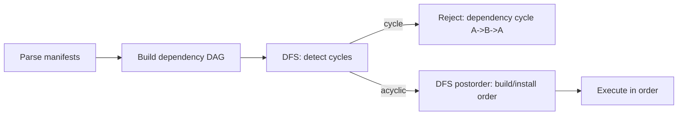
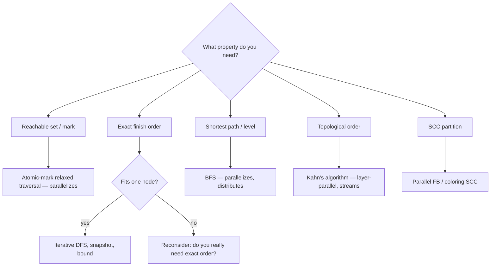

# Depth-First Search — Senior Level

> DFS is trivial on a single machine and treacherous at scale: it is inherently sequential, it recurses to depths bounded by the longest path, and the moment your graph stops fitting in RAM, the "just recurse" instinct becomes a production outage. This file is about where DFS sits in a real system and what breaks when it does.

## Table of Contents
1. [Introduction](#1-introduction)
2. [System Design with DFS](#2-system-design-with-dfs)
3. [Distributed and Large-Graph DFS](#3-distributed-and-large-graph-dfs)
4. [Concurrency](#4-concurrency)
5. [Comparison at Scale](#5-comparison-at-scale)
6. [Architecture Patterns](#6-architecture-patterns)
7. [Code Examples](#7-code-examples)
8. [Observability](#8-observability)
9. [Failure Modes](#9-failure-modes)
10. [Capacity Planning](#10-capacity-planning)
11. [Worked Sizing Example](#11-worked-sizing-example)
12. [Summary](#12-summary)

---

## 1. Introduction

At senior level the question is not "how does backtracking work" but "where does a DFS live in my system, and what happens when the graph is bigger than one machine, deeper than the call stack, or being mutated while I traverse it?".

DFS has three properties that shape every senior-level decision:

1. **It is inherently sequential.** The order of discovery and finish depends on having explored a vertex *before* moving on. Unlike a map-reduce over independent records, you cannot trivially shard a DFS and stitch the pieces back together — the ordering is the value.
2. **Its recursion depth equals the longest path it walks.** On a chain of a million dependency edges, a naive recursive DFS needs a million stack frames. That is an outage, not a slow query.
3. **It assumes a static graph.** Add or remove an edge mid-traversal and your discovery/finish invariants quietly rot.

The interesting decisions are therefore: convert recursion to an explicit stack, decide whether the graph even fits in memory, choose between DFS and a more parallelizable traversal, and snapshot the graph so the structure does not change underneath you.

A useful framing for interviews and design reviews: a junior engineer asks "how do I write DFS"; a mid-level engineer asks "iterative or recursive, directed or undirected"; a senior engineer asks "is DFS even the right primitive, what property do I actually need, and what happens to this traversal under a live, mutating, larger-than-RAM, possibly-adversarial graph." The rest of this document is the senior conversation: it spends almost no time on the algorithm itself (the foundations and professional files cover that) and all of its time on where DFS meets a real system's constraints.

---

## 2. System Design with DFS

DFS shows up far more often than people realize, usually disguised:

### 2.1 Dependency resolution

Package managers (npm, Cargo, Maven), build systems (Bazel, Make), and CI pipelines all model work as a directed graph and need a **topological order** plus **cycle detection** — both DFS jobs.



The cycle-detection step is the one users feel: "circular dependency detected" comes straight out of a back edge into a gray vertex. The error message that names the actual cycle path is what separates a good tool from a frustrating one — and producing it means keeping the current DFS stack so you can slice out the cycle when you hit the back edge.

The **build/install order** is the DFS *postorder* (finish order): a node is emitted only after all its dependencies have finished, so reversing the finish order gives a sequence in which every dependency precedes its dependent. This is why `go build`, Bazel's analysis phase, and Maven's reactor all conceptually do "reverse-postorder over the dependency DAG." Two production refinements matter:

- **Determinism.** Two valid topological orders can differ; teams pin a tie-break (alphabetical, declaration order) so a clean build is byte-for-byte reproducible and caches hit. Without it, the same DAG produces different build orders on different machines and your remote cache thrashes.
- **Incremental rebuild.** Only the subgraph reachable from changed files needs rebuilding. That reachable set is itself a DFS from the changed nodes over the *reverse* dependency graph ("who depends on me?"). Bazel calls this the affected-targets computation.

### 2.1.1 Cycle reporting is a product feature, not a debug aid

Compare two real error messages:

```text
ERROR: dependency cycle detected
ERROR: dependency cycle: auth-service -> billing-service -> notifications -> auth-service
```

The second turns a 30-minute investigation into a 30-second fix. Producing it requires nothing exotic — keep the `parent[]` array and the current GRAY stack, and when the back edge `(u → g)` fires, walk `parent` from `u` back to `g` and reverse. The cost is `O(cycle length)` and it only runs on the (rare) failure path, so there is no reason not to do it.

### 2.2 Deadlock detection

A **wait-for graph** has an edge `T1 → T2` when transaction `T1` is waiting on a lock held by `T2`. A cycle in this graph is a deadlock. Database engines (and lock managers generally) run periodic DFS cycle detection over the wait-for graph, then pick a victim transaction to abort and break the cycle. This is directed cycle detection on a small, fast-changing graph — so it runs frequently and must snapshot consistently.

**Victim selection** is where the DFS output becomes a policy decision. Having found a cycle `T3 → T7 → T9 → T3`, the engine aborts *one* transaction to break it. Real engines (InnoDB, PostgreSQL) choose the victim to minimize rollback cost — typically the transaction that has done the least work (fewest rows modified, youngest, fewest locks held). The DFS gives the candidate set (the cycle members); the cost model picks among them. A naive "abort whoever closed the cycle" is correct but causes the cheapest transaction to repeatedly win the lock race and the same expensive one to keep dying — a livelock of aborts.

**Detection cadence** is a tuning knob. Running cycle detection on every lock-wait is `O(V + E)` per wait and can dominate under contention; running it on a fixed timer (PostgreSQL's `deadlock_timeout`, default 1 s) trades detection latency for throughput. The DFS itself is cheap; the question is how often to pay for it, and the answer is "only after a wait has lasted longer than the time a legitimate lock is plausibly held."

### 2.3 Other common DFS-backed features

- **Garbage collection** — mark-and-sweep does a DFS/BFS from roots; the recursive form is replaced by an explicit mark stack precisely because object graphs are deep.
- **Reachability / impact analysis** — "what depends on this service?" is a DFS over a service graph.
- **Spanning structure** — DFS trees are used in network design and in finding bridges/articulation points (sibling `11-articulation-points-bridges`) for resilience analysis.

---

## 3. Distributed and Large-Graph DFS

This is the section where DFS gets uncomfortable.

### 3.1 DFS is hard to parallelize — and that is fundamental

BFS parallelizes beautifully: each level is a set of independent vertices you can expand in parallel (this is the basis of Pregel-style "think like a vertex" systems and of GPU graph traversal). DFS does **not** have this structure. The next vertex DFS visits depends on the *entire history* of the traversal — it is the deepest unexplored neighbour of the most recently active vertex. You cannot know it without having done the work up to that point.

Formally, lexicographically-first DFS (the order you get by always taking the lowest-numbered neighbour) is **P-complete** (Reif, 1985): it is among the hardest problems in P to parallelize, and is conjectured to have no efficient (NC) parallel algorithm. The practical consequence: there is no clean "distribute the DFS across 100 machines" recipe the way there is for BFS or for embarrassingly-parallel map jobs.

The intuition behind the hardness is worth internalizing for design reviews: in BFS, "what is the set of vertices at distance `k`?" depends only on the distance-`(k−1)` set, so each level is a parallel breadth-expansion you can compute as a sparse matrix-vector product. In DFS, "what is the next vertex?" depends on the *entire ordered history* of which neighbour you chose at every ancestor — there is no level structure to parallelize across, and no way to compute the answer for the deep part of the tree without first resolving the shallow part. The dependency chain is as long as the path itself.

### 3.1.1 What "parallel DFS" actually means in practice

When a paper or library claims "parallel DFS," it is almost always one of:

- **Parallel-over-roots / per-component.** If the graph is a forest of many components, run an independent DFS per component on different cores. Embarrassingly parallel, but does nothing for a single giant component (the usual case for real graphs, which have one dominant component).
- **A different traversal that yields a DFS *tree* but not the DFS *order*.** Aggarwal–Anderson's randomized-NC undirected DFS tree is real, but the tree it produces is not the one a recursive DFS would produce, and it does not give you discovery/finish times. Fine if you only need *a* spanning tree; useless if your algorithm depends on exact timestamps.
- **Speculative / work-stealing DFS with a relaxed order.** Several threads pop from a shared stack and CAS the visited bit; you get a depth-first-*ish* traversal that is correct for reachability but whose order is non-deterministic. Good for "mark everything reachable" (GC, taint analysis); wrong for anything that reads finish order.

The senior judgment call: name the *property* the downstream code consumes (reachability set? a spanning tree? exact finish order? SCC partition?) and only then decide whether any parallel variant is admissible. "We parallelized DFS" with no statement of which property survived is a red flag in a design doc.

### 3.2 What people actually do at scale

Since you usually do not need the *exact* DFS order, you reformulate:

- **Reformulate to BFS.** If you only need reachability, components, or shortest paths, use BFS — it shards across machines (Pregel, Giraph, GraphX). Most "we need DFS at scale" requirements are really "we need reachability/ordering at scale," which BFS or its variants handle.
- **Topological sort via Kahn's algorithm.** Instead of DFS postorder, repeatedly peel off indegree-zero vertices. This is more parallelizable (process all indegree-zero vertices of a "layer" together) and streams nicely over an external graph.
- **SCC via parallel algorithms.** The Forward-Backward (FB) algorithm and coloring-based SCC algorithms replace Tarjan's sequential DFS with parallel reachability queries, trading optimal work for parallelism.
- **External-memory / streaming DFS.** When the graph exceeds RAM but fits on disk, semi-external DFS keeps the visited bitset in memory (`V` bits) and streams edges. True external DFS is notoriously hard; in practice teams avoid it by switching algorithms.

### 3.3 Single-machine but bigger than the call stack

The common, non-distributed scaling problem: the graph fits in RAM, but a recursive DFS would recurse too deep. The fix is always the same — an **explicit stack on the heap**. The heap is bounded by gigabytes, not by the few megabytes of thread stack. Every production DFS over untrusted or deep input should be iterative for this reason.

---

## 4. Concurrency

### 4.1 The visited set is shared mutable state

If you try to run multiple DFS workers over one graph sharing a `visited` array, you have a classic data race: two workers can read `visited[v] == false`, both mark it, and both expand it. Mitigations:

- **Atomic test-and-set** on the visited bit. The first worker to CAS `false → true` "owns" `v`; others skip it. This gives correctness but not a clean DFS order (you get a *parallel* traversal that is no longer depth-first).
- **Partition by component.** If the graph splits into many independent connected components, hand each worker a disjoint set of components — no shared state on the hot path, only on the "which components are left" queue.

### 4.2 Traversing a mutating graph

If the graph can change during traversal (a live dependency graph, a wait-for graph), you must traverse a **consistent snapshot**:

- **Copy-on-write / immutable snapshot.** Take a versioned, immutable view of the adjacency structure and DFS that. Writers create a new version; your traversal keeps seeing the old one.
- **Read lock for the duration.** Simpler but blocks writers — only acceptable if the DFS is fast and infrequent (e.g. periodic deadlock detection).
- **Epoch/MVCC.** Tag edges with validity intervals and only follow edges live as of your start epoch.

### 4.3 Concurrency does not make DFS faster

Worth stating plainly: because of §3.1, throwing threads at a single DFS rarely speeds it up and usually corrupts the order. Concurrency around DFS is about *isolation from writers* and *covering independent components*, not about parallelizing one traversal.

### 4.4 The cost of each snapshot strategy

Choosing among the §4.2 options is a latency-vs-memory-vs-staleness trade:

| Strategy | Write cost | Read (DFS) cost | Staleness | When |
|---|---|---|---|---|
| Copy-on-write snapshot | `O(V+E)` to clone on first write after a read epoch | Reads a frozen, fast, contiguous view | Bounded by snapshot age | Frequent reads, infrequent writes; the resolver case. |
| Read lock for duration | Cheap | Blocks all writers while DFS runs | Zero (fully fresh) | Fast, infrequent DFS (periodic deadlock check). |
| Epoch / MVCC edges | Cheap (append a version) | Filters edges by epoch — slightly slower per edge | Zero at chosen epoch | Hot write path that cannot tolerate blocking. |

The deadlock detector picks the read lock because the DFS is sub-millisecond and runs on a timer — blocking writers briefly is acceptable. The dependency resolver picks copy-on-write because reads (builds) vastly outnumber writes (manifest edits) and a build must not block an unrelated edit. Picking the wrong one shows up as either write-path latency spikes (over-locking) or stale build plans (over-stale snapshots).

---

## 5. Comparison at Scale

| Approach | Order guarantee | Parallelizable | Memory | When |
| --- | --- | --- | --- | --- |
| Recursive DFS | Exact pre/post order | No | `O(V)` call stack — overflow risk | Small, shallow, single-thread. |
| Iterative DFS (explicit stack) | Exact pre/post order | No | `O(V)` heap stack | Default for deep or untrusted input. |
| BFS | Level / shortest path | Yes (per level) | `O(V)` queue — a wide level | Reachability, shortest path, distributed. |
| Kahn's topo sort | Topological | Partially (per layer) | `O(V)` indegree array | DAG ordering, streaming, parallel layers. |
| Parallel SCC (FB / coloring) | SCC partition | Yes | `O(V + E)` | Huge graphs where Tarjan's DFS is too sequential. |
| Pregel / vertex-centric | BFS-like | Yes (cluster) | Distributed | Graphs that do not fit on one machine. |

The senior takeaway: if a requirement says "DFS at scale," push back and ask what property is actually needed. Exact DFS order is rarely it; reachability, ordering, or component structure usually is — and those have parallel-friendly alternatives.

A useful mental decision tree for the design review:



The only branch that lands on "single-node iterative DFS" is *exact finish order that fits one node*. Every other property has a more scalable home. That is the whole senior argument in one diagram.

---

## 6. Architecture Patterns

### 6.1 Recursion-to-iteration conversion (the reliability pattern)

Convert every production DFS to an explicit stack. To preserve postorder semantics, push frames carrying a child-iterator index, and emit the finish hook when the iterator is exhausted (see §7). This single change removes the most common DFS-related outage class.

### 6.2 Cycle reporting, not just detection

For dependency and deadlock systems, "there is a cycle" is useless; "the cycle is `A → B → C → A`" is actionable. Keep the current DFS stack; when you hit a back edge into gray vertex `g`, slice the stack from `g` to the top — that is the cycle.

### 6.3 Snapshot-and-traverse

Front the live graph with an immutable snapshot. DFS the snapshot; writers mutate a fresh version. This decouples traversal correctness from write traffic and is how lock managers and GC implementations avoid traversing a moving target.

### 6.4 Bound the work

A DFS over an adversarial or unbounded graph (a crawler, a user-supplied dependency file) needs a depth/visited cap and a timeout, so a pathological input cannot wedge a worker.

### 6.5 Fuse passes into one traversal

A frequent waste is running DFS three times — once for cycle detection, once for topological order, once for component counting — when a single pass can emit all three. One DFS naturally produces: back-edge detection (cycle), finish order (reverse-postorder topo sort), and forest-root count (components, undirected). Fusing them turns `3·(V+E)` into `(V+E)` and, just as importantly, guarantees all three answers come from the *same* graph snapshot, eliminating a class of "the cycle check passed but the topo sort disagreed" inconsistencies that arise when each pass sees a slightly different mutation of a live graph.

### 6.6 Choose the traversal by the property, then commit

The recurring senior pattern across §3 and §4: do not start from "we use DFS." Start from the property the downstream consumer needs — reachable set, spanning tree, exact finish order, SCC partition, shortest path — and let that select the algorithm. Shortest path → BFS. Ordering at cluster scale → Kahn. Exact finish times on one box → iterative DFS. Reachability under heavy parallelism → atomic-mark relaxed traversal. Committing to "DFS" before naming the property is how teams end up needing the one thing (exact order at scale) that provably does not parallelize.

---

## 7. Code Examples

### 7.1 Go — iterative DFS with postorder finish hook and cycle path extraction

```go
package main

import "fmt"

// DetectCycle returns (true, path) if the directed graph has a cycle,
// where path is the actual cycle vertices. Iterative, so it is safe on
// deep graphs that would overflow a recursive call stack.
func DetectCycle(adj [][]int) (bool, []int) {
	const white, gray, black = 0, 1, 2
	n := len(adj)
	color := make([]int, n)
	parent := make([]int, n)
	for i := range parent {
		parent[i] = -1
	}

	type frame struct{ u, i int }
	for s := 0; s < n; s++ {
		if color[s] != white {
			continue
		}
		stack := []frame{{s, 0}}
		color[s] = gray
		for len(stack) > 0 {
			top := &stack[len(stack)-1]
			if top.i < len(adj[top.u]) {
				v := adj[top.u][top.i]
				top.i++
				switch color[v] {
				case white:
					parent[v] = top.u
					color[v] = gray
					stack = append(stack, frame{v, 0})
				case gray:
					// back edge -> reconstruct cycle v ... top.u v
					cycle := []int{v}
					for x := top.u; x != v && x != -1; x = parent[x] {
						cycle = append(cycle, x)
					}
					// reverse to read top-down
					for i, j := 0, len(cycle)-1; i < j; i, j = i+1, j-1 {
						cycle[i], cycle[j] = cycle[j], cycle[i]
					}
					return true, append(cycle, v)
				}
			} else {
				color[top.u] = black // finish
				stack = stack[:len(stack)-1]
			}
		}
	}
	return false, nil
}

func main() {
	g := [][]int{{1}, {2}, {3}, {1}} // 1->2->3->1 is a cycle
	ok, path := DetectCycle(g)
	fmt.Println(ok, path) // true [1 2 3 1]
}
```

### 7.2 Java — snapshot-and-traverse for a live wait-for graph

```java
import java.util.*;
import java.util.concurrent.atomic.AtomicReference;

/** Periodic deadlock detector over an immutable snapshot of a wait-for graph. */
public final class DeadlockDetector {
    // Immutable snapshot: adjacency as arrays. Writers publish a new one atomically.
    private final AtomicReference<int[][]> snapshot = new AtomicReference<>(new int[0][]);

    public void publish(int[][] waitFor) {
        // Defensive copy so the published snapshot cannot be mutated.
        int[][] copy = new int[waitFor.length][];
        for (int i = 0; i < waitFor.length; i++) copy[i] = waitFor[i].clone();
        snapshot.set(copy);
    }

    /** Returns a deadlock cycle, or empty if none. Iterative DFS on the snapshot. */
    public List<Integer> findDeadlock() {
        int[][] adj = snapshot.get();
        int n = adj.length;
        int[] color = new int[n];          // 0 white, 1 gray, 2 black
        int[] parent = new int[n];
        Arrays.fill(parent, -1);
        for (int s = 0; s < n; s++) {
            if (color[s] != 0) continue;
            Deque<int[]> stack = new ArrayDeque<>();
            stack.push(new int[]{s, 0});
            color[s] = 1;
            while (!stack.isEmpty()) {
                int[] top = stack.peek();
                int u = top[0];
                if (top[1] < adj[u].length) {
                    int v = adj[u][top[1]++];
                    if (color[v] == 0) {
                        parent[v] = u; color[v] = 1;
                        stack.push(new int[]{v, 0});
                    } else if (color[v] == 1) {
                        LinkedList<Integer> cycle = new LinkedList<>();
                        cycle.addFirst(v);
                        for (int x = u; x != v && x != -1; x = parent[x]) cycle.addFirst(x);
                        cycle.addLast(v);
                        return cycle;
                    }
                } else {
                    color[u] = 2;
                    stack.pop();
                }
            }
        }
        return List.of();
    }
}
```

### 7.3 Python — bounded DFS for an untrusted/crawler graph

```python
import time
from typing import Callable, Iterable, Optional


def bounded_dfs(
    start: int,
    neighbours: Callable[[int], Iterable[int]],
    *,
    max_depth: int = 10_000,
    max_nodes: int = 1_000_000,
    deadline_s: Optional[float] = None,
) -> set[int]:
    """Iterative DFS with hard caps so a hostile or unbounded graph cannot wedge a worker."""
    visited: set[int] = set()
    stack: list[tuple[int, int]] = [(start, 0)]  # (vertex, depth)
    end = None if deadline_s is None else time.monotonic() + deadline_s
    while stack:
        if end is not None and time.monotonic() > end:
            raise TimeoutError("DFS exceeded deadline")
        if len(visited) > max_nodes:
            raise RuntimeError("DFS exceeded node budget")
        u, depth = stack.pop()
        if u in visited or depth > max_depth:
            continue
        visited.add(u)
        for v in neighbours(u):
            if v not in visited:
                stack.append((v, depth + 1))
    return visited


if __name__ == "__main__":
    g = {0: [1, 2], 1: [2], 2: [0], 3: []}  # has a cycle 0->2->0; caps keep it safe
    print(bounded_dfs(0, lambda u: g.get(u, []), max_depth=100))
```

### 7.4 Go — parallel reachability mark with atomic visited (relaxed order)

When you only need the *reachable set* (mark-and-sweep GC, taint/impact analysis) and not the DFS order, you can run several workers off a shared stack and let an atomic test-and-set arbitrate ownership. This is the only "parallel DFS" that is both correct and useful — and it explicitly abandons the depth-first *order*.

```go
package reach

import (
	"sync"
	"sync/atomic"
)

// Reachable marks every vertex reachable from start using N workers.
// Order is NOT depth-first; only the reached SET is guaranteed correct.
func Reachable(adj [][]int, start, workers int) []uint32 {
	n := len(adj)
	visited := make([]uint32, n) // 0 = unvisited, 1 = owned (CAS arbitrated)

	var mu sync.Mutex
	stack := []int{start}
	atomic.StoreUint32(&visited[start], 1)

	var wg sync.WaitGroup
	var active int64 // number of in-flight items, to know when truly done

	pop := func() (int, bool) {
		mu.Lock()
		defer mu.Unlock()
		if len(stack) == 0 {
			return 0, false
		}
		v := stack[len(stack)-1]
		stack = stack[:len(stack)-1]
		return v, true
	}

	for w := 0; w < workers; w++ {
		wg.Add(1)
		go func() {
			defer wg.Done()
			for {
				u, ok := pop()
				if !ok {
					if atomic.LoadInt64(&active) == 0 {
						return // stack empty and nothing in flight
					}
					continue // spin briefly; another worker may push
				}
				atomic.AddInt64(&active, 1)
				for _, v := range adj[u] {
					// First worker to flip 0->1 owns v; others skip.
					if atomic.CompareAndSwapUint32(&visited[v], 0, 1) {
						mu.Lock()
						stack = append(stack, v)
						mu.Unlock()
					}
				}
				atomic.AddInt64(&active, -1)
			}
		}()
	}
	wg.Wait()
	return visited
}
```

The single shared mutex on the stack is the bottleneck; production versions use per-worker deques with work-stealing (the same pattern as the Go runtime scheduler). The load-bearing correctness primitive is the `CompareAndSwap`: exactly one worker transitions each vertex `0 → 1`, so no vertex is expanded twice and there is no double-counting — at the cost of any meaningful traversal order.

Notes for review:
- The first three examples are **iterative** — no recursion-depth ceiling.
- The Go and Java versions keep `parent[]` so they can report the *actual* cycle, not just a boolean.
- The Python version adds depth, node, and time budgets — mandatory for crawler-style DFS over input you do not control.
- The fourth (parallel) example is correct *only* for the reachable-set property; it deliberately gives up DFS order, which is the recurring senior trade-off (§3.1.1).

---

## 8. Observability

A DFS in production should not be a black box. Wire these signals:

| Metric | Type | Why |
| --- | --- | --- |
| `dfs_duration_seconds` | histogram | Detect graphs that blew up in size or got pathological. |
| `dfs_max_stack_depth` | gauge | Early warning before a recursive DFS would overflow. |
| `dfs_visited_nodes` | counter | Confirms the traversal covered what you expected. |
| `dfs_cycles_detected_total` | counter | For dependency/deadlock systems — a spike means trouble. |
| `dfs_graph_snapshot_age_seconds` | gauge | How stale is the snapshot you are traversing? |
| `dfs_budget_exceeded_total` | counter | Times a depth/node/time cap fired — points at hostile input. |

For dependency and deadlock systems, **log the cycle path** every time one is detected, with the vertex labels. That single log line is often the entire incident postmortem.

Tracing: tag the span with `graph_vertices`, `graph_edges`, `traversal=dfs`, and `max_depth_reached` so a slow traversal can be correlated with an unusually large or deep graph.

### 8.1 The depth gauge is your overflow early-warning

`dfs_max_stack_depth` deserves special emphasis because it is the *leading* indicator of the number-one DFS outage. Recursion does not degrade gracefully: it works at depth 100,000 and segfaults at depth 130,000 with no warning in between. An explicit-stack DFS that exports its current stack length as a gauge lets you alert at, say, 70% of your configured cap *before* anything breaks, turning a hard crash into a paging event with time to react. Pair it with `dfs_budget_exceeded_total` so you can tell "legitimately large graph" from "adversarial input hitting the cap."

### 8.2 Distinguishing slow from stuck

A DFS that has been running for 10 seconds is ambiguous: huge graph, or wedged on a mutating structure / lock? Export `dfs_visited_nodes` as a *rate*, not just a total. A healthy traversal shows monotonically rising visited count; a wedged one flatlines. The rate-of-progress signal separates "scale problem, add capacity" from "liveness bug, page someone."

---

## 9. Failure Modes

### 9.1 Stack overflow from deep recursion

The signature DFS outage. A recursive DFS on a chain or skewed graph recurses to the longest-path length. Default thread stacks (≈1–8 MB) hold only tens of thousands of frames. Mitigation: **always use iterative DFS** in production; if you must recurse, raise the stack size deliberately and bound depth.

The trap is that it is invisible in testing: your test fixtures are small and shallow, the recursive code is simpler and passes review, and it ships. Then a customer uploads a 500,000-node linear dependency chain — or an attacker crafts one deliberately — and the worker dies with `StackOverflowError` / SIGSEGV. The crash often takes the *whole process* down (a SIGSEGV is not catchable; a JVM `StackOverflowError` is catchable but may leave locks held). The language matters: Go grows goroutine stacks dynamically and tolerates far deeper recursion than C/C++ or a default JVM thread, but even Go has a `maxstacksize` limit (~1 GB) and will `fatal error: goroutine stack exceeds` past it. The portable rule stands: convert to an explicit heap stack and the failure mode becomes a catchable `OutOfMemory` at a vastly higher ceiling, or — better — a clean budget-exceeded rejection (§7.3).

### 9.2 Traversing a mutating graph

An edge added or removed mid-DFS corrupts discovery/finish invariants — you may revisit, skip, or report phantom cycles. Mitigation: snapshot (copy-on-write or read lock) for the duration of the traversal.

### 9.3 Visited-set race in a parallel attempt

Sharing the visited array across threads without atomics causes double-expansion and lost work. Mitigation: atomic test-and-set on the visited bit, or partition by component so there is no shared hot state.

### 9.4 Unbounded traversal on hostile input

A crawler or a user-uploaded dependency graph can be enormous or maliciously deep. Without caps, one request wedges a worker indefinitely. Mitigation: depth, node, and time budgets (see §7.3).

### 9.5 Memory blow-up

The visited set is `O(V)` and the explicit stack is `O(V)` worst case; for a 10⁹-vertex graph that is gigabytes just in bookkeeping. Mitigation: bitset for visited (1 bit/vertex), and consider whether the graph belongs in an external/streaming engine instead.

### 9.6 Wrong cycle semantics

Using the directed color rule on an undirected graph (or vice versa) yields false positives/negatives. Mitigation: be explicit about graph type and unit-test both a known cyclic and acyclic instance. The classic undirected bug: the tree edge `u → v` and its reverse `v → u` are the *same* edge, so when DFS at `v` examines the edge back to its still-GRAY parent `u`, a naive directed-style check reports a "cycle." The fix is to skip the parent edge (track `parent[v]` and ignore `u` once), which is exactly the one extra bit of state undirected DFS needs beyond `visited`.

### 9.7 Re-entrant or recursive callback explosion

If the DFS invokes a user callback per vertex (a "visitor"), and that callback itself enqueues work or triggers another traversal, you can get unbounded fan-out or re-entrancy on the visited set. Mitigation: make the callback side-effect-free with respect to the graph being traversed, or run it on a queue processed *after* the traversal completes rather than inline. This is the graph-traversal analogue of "do not mutate a collection while iterating it."

---

## 10. Capacity Planning

### 10.1 Memory

- **Visited bitset:** `V / 8` bytes. 10⁹ vertices → ~125 MB. Use a packed bitset, not a `bool[]` (which is 1 byte/vertex → 1 GB).
- **Explicit stack:** up to `O(V)` entries worst case; size a frame at ~16–32 bytes. A 10⁸-deep worst case is gigabytes — but typical depth (longest path) is far smaller; size for your graph's diameter, not `V`.
- **Adjacency storage:** `O(V + E)`. For 10⁹ edges in CSR format (~8 bytes/edge), ~8 GB — this is usually the dominant term, and the reason the graph may not fit on one node.

### 10.2 Time

- DFS is `O(V + E)`. On a single modern core, plan for roughly 10–50 million edges traversed per second for a cache-unfriendly pointer-chasing traversal, faster with a CSR layout. A 10⁸-edge graph is a few seconds; a 10⁹-edge graph is tens of seconds to minutes — at which point batching, caching the result, or switching to a distributed engine becomes the question.

### 10.3 When to leave the single node

Move off in-memory single-machine DFS when any of:

- The graph (CSR + visited + stack) does not fit in RAM.
- You need the traversal to keep up with a high write rate on a live graph.
- The requirement is really reachability/ordering at cluster scale — switch to BFS/Pregel/Kahn, which parallelize.

Until then, an iterative, snapshotted, budget-bounded DFS on one box is the right answer and handles graphs into the hundreds of millions of edges.

---

## 11. Worked Sizing Example

Concrete numbers make the capacity rules above actionable. Suppose you operate the dependency resolver for a monorepo CI system and must decide whether a single resolver node suffices.

**Inputs.**
- `V = 2,000,000` build targets, `E = 20,000,000` dependency edges (average out-degree 10).
- A push triggers cycle detection plus a topological build order.
- SLO: produce the build plan in under 1 second at p99.

**Memory budget.**

```text
CSR adjacency: row offsets V*4B = 8 MB
               edge array  E*4B = 80 MB
visited/color: V bytes (one color byte) = 2 MB   (or V/4 with 2-bit packing = 0.5 MB)
parent[]:      V*4B = 8 MB
explicit stack: bounded by longest path; budget for graph diameter, say 50k * 8B = 0.4 MB
----------------------------------------------------------------
total ≈ 98 MB
```

Comfortably one node — the adjacency dominates, as predicted, and `V`-sized bookkeeping is negligible at this scale. A `bool[]`-per-vertex color array would still only be 2 MB; the packing optimization matters at `10⁹`, not here.

**Time budget.** At 20 M edges and a realistic 30 M edges/sec for a CSR-layout cache-friendly traversal:

```text
20,000,000 edges / 30,000,000 edges/sec ≈ 0.67 s
```

That is *one* traversal. Cycle detection and the topological postorder can be fused into a single DFS (detect back edges and emit finish order in the same pass), so you pay ~0.67 s once, not twice. That fits the 1 s SLO with little headroom — meaning a pointer-linked adjacency (which would run 2–5× slower due to cache misses) would *blow* the SLO. The layout choice is the difference between meeting and missing the target, even though the algorithm is identical.

**Conclusion.** A single node is correct here, *provided* (1) the adjacency is stored in CSR not linked lists, (2) cycle detection and topo order share one DFS pass, and (3) the DFS is iterative so a pathological 2-million-deep chain (a fully linear dependency graph) does not overflow the stack. If `V` grew to `10⁹`, the adjacency alone (~8 GB) would push you to a graph engine and you would reformulate to Kahn's algorithm for the parallelism.

---

## 12. Summary

- DFS is sequential by nature (lexicographic DFS is P-complete); do not expect to parallelize a single traversal. When you need scale, you almost always need reachability/ordering, not exact DFS order — reach for BFS, Kahn's topo sort, or parallel SCC instead.
- The number-one production failure is stack overflow from deep recursion. Convert every production DFS to an explicit heap stack.
- Traverse an immutable snapshot of any live graph (dependency graphs, wait-for graphs) so the structure cannot change underneath you.
- For dependency and deadlock systems, report the actual cycle path, not just a boolean — keep the DFS stack so you can slice it out at the back edge.
- Bound depth, nodes, and time on any DFS over untrusted input.
- Plan memory for a packed visited bitset, a stack sized to graph diameter, and CSR adjacency — the adjacency usually dominates and decides whether you stay single-node.
- Instrument duration, max depth, visited count, and cycles detected; the depth gauge is your early warning before an overflow, and visited-count *rate* distinguishes a slow traversal from a wedged one.
- Fuse cycle detection, topological order, and component counting into a single pass — it is `(V+E)` instead of `3·(V+E)` and guarantees all answers come from one snapshot.
- Choose the snapshot strategy by the read/write ratio: copy-on-write for read-heavy resolvers, a short read lock for fast periodic deadlock checks, MVCC/epoch edges for hot write paths that cannot block.
- Pick the algorithm from the *property* the consumer needs, not from the word "DFS"; only "exact finish order that fits one node" actually lands on single-node iterative DFS — everything else (reachability, shortest path, ordering at scale, SCC) has a more parallelizable home.

References to study further: Tarjan's linear graph algorithms, Reif's P-completeness of lexicographic DFS, the Forward-Backward parallel SCC algorithm, Pregel/Giraph vertex-centric traversal, and mark-and-sweep GC's explicit mark stack.
