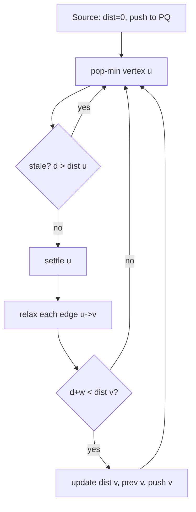

# Dijkstra's Algorithm — Junior Level

> **One-line summary:** Dijkstra's algorithm finds the shortest path from one source vertex to every other vertex in a graph with **non-negative** edge weights. It greedily "settles" the closest unsettled vertex, relaxing its outgoing edges, and with a binary-heap priority queue runs in `O((V + E) log V)`.

---

## Table of Contents

1. [Introduction](#introduction)
2. [Prerequisites](#prerequisites)
3. [Glossary](#glossary)
4. [Core Concepts](#core-concepts)
5. [Big-O Summary](#big-o-summary)
6. [Real-World Analogies](#real-world-analogies)
7. [Pros & Cons](#pros--cons)
8. [Step-by-Step Walkthrough](#step-by-step-walkthrough)
9. [Code Examples](#code-examples)
10. [Coding Patterns](#coding-patterns)
11. [Error Handling](#error-handling)
12. [Performance Tips](#performance-tips)
13. [Best Practices](#best-practices)
14. [Edge Cases & Pitfalls](#edge-cases--pitfalls)
15. [Common Mistakes](#common-mistakes)
16. [Cheat Sheet](#cheat-sheet)
17. [Visual Animation](#visual-animation)
18. [Summary](#summary)
19. [Further Reading](#further-reading)

---

## Introduction

**Dijkstra's algorithm** answers a question you ask every day without thinking: *"What is the cheapest way to get from here to everywhere else?"* The "cost" can be road distance, travel time, money, network latency, or any quantity that adds up along a path and is never negative.

It was published by **Edsger W. Dijkstra in 1959** in a three-page paper, and it remains the workhorse of GPS routing, internet routing protocols (OSPF), game pathfinding, and countless optimization problems. Dijkstra reportedly designed it in about twenty minutes, in his head, at a café — without pencil or paper.

The idea is a single, beautiful greedy rule:

> Of all the vertices whose shortest distance you do **not** yet know for certain, take the one with the smallest *tentative* distance. That tentative distance is now **final**. Then look at its neighbors and see whether going through it gives them a cheaper route.

That "take the closest unsettled vertex" step is exactly what a **priority queue** (a binary heap) is built for. Pull the minimum, lock it in, push improved neighbor distances back. Repeat until the queue empties.

The one rule you must never break: **edge weights must be non-negative.** The moment a negative edge exists, the greedy "once settled, always settled" guarantee collapses, and you need a different algorithm (the sibling topic *05-bellman-ford*). We will see exactly why later.

A useful mental anchor: **Dijkstra is weighted breadth-first search.** Plain BFS explores in waves of equal step-count because every edge costs 1. Replace the FIFO queue with a min-priority-queue keyed on accumulated weight, and BFS becomes Dijkstra.

---

## Prerequisites

Before reading this file you should be comfortable with:

- **Graphs** — vertices, edges, directed vs undirected, weighted edges. (See sibling topic *01-representation*.)
- **Adjacency lists** — storing a graph as `adj[u] = [(v, w), ...]`.
- **Breadth-first search** — Dijkstra generalizes it. (Sibling topic *02-bfs*.)
- **Priority queues / binary heaps** — `push`, `pop-min`, `peek` in `O(log n)`. (See topic *10-heaps/01-binary-heap*.)
- **Big-O notation** — `O(log n)`, `O(V + E)`, `O(V²)`.
- **Arrays and maps** — for distance and predecessor tables.

Optional but helpful:

- Familiarity with at least one standard priority-queue API (`heapq`, `PriorityQueue`, `container/heap`).
- A rough sense of "sparse" (`E ≈ V`) vs "dense" (`E ≈ V²`) graphs — it decides which implementation to pick.

---

## Glossary

| Term | Meaning |
|------|---------|
| **Single-source shortest path (SSSP)** | The shortest distance from one fixed source to every other vertex. |
| **Edge weight / cost** | The non-negative number attached to an edge `(u, v)`. |
| **Tentative distance** | The best distance to a vertex found *so far*; may still improve. |
| **Final / settled distance** | A tentative distance that is now proven optimal and will never change. |
| **Settled set** | The set of vertices whose shortest distance is finalized. |
| **Relaxation** | Trying edge `(u, v)`: if `dist[u] + w(u,v) < dist[v]`, lower `dist[v]`. |
| **Priority queue (PQ)** | A min-heap that always hands back the smallest tentative distance. |
| **Predecessor / parent array** | `prev[v]` = the vertex you came from on the best path to `v`; used to rebuild the actual path. |
| **Source** | The starting vertex `s`, with `dist[s] = 0`. |
| **Infinity (`∞`)** | The initial distance to every vertex except the source ("not reached yet"). |
| **Stale entry** | An old `(dist, v)` pair in the heap that a later, better one has superseded. |
| **Settled check** | The `if d > dist[u]: continue` guard that skips stale heap pops. |

---

## Core Concepts

### 1. Relaxation — the one operation that matters

The entire algorithm is built on a single update called **relaxation**. Given an edge `u → v` with weight `w`:

```
if dist[u] + w < dist[v]:
    dist[v] = dist[u] + w
    prev[v] = u            # remember how we got here (for path reconstruction)
```

"Relax" means: *we found a route to `v` that goes through `u` and is cheaper than anything we knew, so improve `v`'s estimate.* Initially every `dist[v] = ∞` except `dist[source] = 0`. The algorithm relaxes edges until no improvement is possible.

### 2. The settled set and the greedy choice

Dijkstra partitions vertices into **settled** (distance final) and **unsettled**. The greedy invariant is:

> The unsettled vertex with the smallest tentative distance already has its **final** distance.

Why is this true? Because all edge weights are non-negative, no path through *other* unsettled vertices (each at least as far away) could ever reach this vertex more cheaply. So we can safely lock it in, move it to the settled set, and relax its outgoing edges. This is the heart of the correctness argument (proven formally in `professional.md`).

### 3. The priority queue drives everything

"Pick the smallest tentative distance" is precisely a `pop-min`. So:

```
pq = min-priority-queue of (distance, vertex)
push (0, source)
while pq not empty:
    (d, u) = pop-min(pq)
    if u already settled: skip          # stale entry
    settle u
    for each edge (u, v, w):
        if d + w < dist[v]:
            dist[v] = d + w
            push (dist[v], v)
```

### 4. Two ways to manage the queue

There are two common heap strategies. They produce the same answer; they differ in bookkeeping.

- **Lazy deletion (the easy one):** never update existing heap entries. When you improve `dist[v]`, just `push` a fresh `(dist[v], v)`. Old entries become **stale**; you skip them on pop with a settled check. Simple, slightly more memory (`O(E)` entries), and what most people write.
- **Eager / decrease-key:** keep one entry per vertex and lower its key in place with `decreaseKey`. Smaller heap (`O(V)`), needs an *indexed* heap that tracks each vertex's position. More code, marginally faster on dense graphs.

Junior level: **use lazy deletion.** It is correct, short, and idiomatic in all three languages.

### 5. Two ways to find the minimum

The "pick the closest unsettled vertex" step can be done two ways, which gives two complexities:

- **Binary heap:** `O((V + E) log V)` — best for **sparse** graphs (`E` close to `V`). This is the default.
- **Plain array scan:** `O(V²)` — scan all vertices each round to find the minimum. Better for **dense** graphs (`E` close to `V²`), where `V²` beats `E log V`.

There is also the theoretical **Fibonacci heap** giving `O(E + V log V)` (see topic *10-heaps/03-fibonacci-heap*), but its constants make it rarely worth it in practice.

---

## Big-O Summary

| Variant | Time | Space | Best for |
|---------|------|-------|----------|
| Binary heap, lazy deletion | **O((V + E) log V)** | O(V + E) | Sparse graphs (the default). |
| Binary heap, decrease-key | **O((V + E) log V)** | O(V + E) | Slightly fewer heap ops; needs indexed heap. |
| Array / linear scan | **O(V²)** | O(V) | Dense graphs (`E ≈ V²`). |
| Fibonacci heap | **O(E + V log V)** | O(V + E) | Theoretical optimum; rarely faster in practice. |
| Single `relax` | **O(1)** | — | The inner operation. |
| Path reconstruction | **O(path length)** ≤ O(V) | O(V) | Walk the `prev[]` array backward. |

> `V` = number of vertices, `E` = number of edges. `log V` and `log E` are interchangeable in the bound because `E ≤ V²`, so `log E ≤ 2 log V`.

---

## Real-World Analogies

| Concept | Analogy |
|---------|---------|
| The whole algorithm | A GPS app computing the fastest route to every reachable place from your house. |
| Settling the closest vertex | A ripple spreading out from a stone dropped in a pond: the wavefront always reaches the *nearest* dry ground next, and once wet, a spot stays wet. |
| Relaxation | A travel-deals website: "Flying via Istanbul is cheaper than your current best, so update your saved price for Tokyo." |
| Tentative vs final distance | A price quote that can still drop until you actually book it; once booked (settled), it is locked. |
| Non-negative weights | Real travel time: every leg of a trip *adds* time. You can never take a flight that gives you back two hours of your life. |
| Why negatives break it | A "magic shortcut that refunds time" would let a far-away detour suddenly become cheaper *after* you thought you were done — your locked-in answers would be wrong. |
| Predecessor array | Breadcrumbs you drop so you can retrace the actual cheapest road, not just know its length. |

Where the analogy breaks: a real pond ripple has continuous geometry; Dijkstra works on discrete vertices and only ever looks one edge ahead at a time.

---

## Pros & Cons

| Pros | Cons |
|------|------|
| Optimal shortest paths with a simple greedy rule. | Fails on **negative edge weights** — use Bellman-Ford instead. |
| `O((V + E) log V)` is fast enough for huge sparse graphs (road networks). | Computes paths to *all* vertices even if you only need one target. |
| Reuses an off-the-shelf priority queue — little custom code. | Heap version needs a settled check or stale entries corrupt the result. |
| Gives you the full shortest-path *tree* via `prev[]`, not just distances. | Not great for repeated point-to-point queries on a static graph (use precomputed indexes like contraction hierarchies — see `senior.md`). |
| Generalizes BFS naturally; easy to remember. | Integer path sums can **overflow** if you start `dist` at a huge sentinel. |
| `O(V²)` array variant is trivially simple for dense graphs. | Does not directly support "shortest path that visits set S" or other constrained variants. |

**When to use:** GPS/road routing, network routing (OSPF, IS-IS), single-source costs on any non-negative weighted graph, as the engine inside A* with `h = 0` (sibling *09-a-star*), uniform-cost search.

**When NOT to use:** graphs with negative edges (Bellman-Ford), all-pairs on dense graphs (Floyd-Warshall, sibling *06-floyd-warshall*), unweighted graphs (plain BFS is simpler and faster).

---

## Step-by-Step Walkthrough

Consider this small directed graph. Source = `A`.

```
        A
      4/  \1
      B    C
     /|    |
   2/ |5   |3
   /  |    |
  D   |    E
   \  |   /
   1\ | /7
      F
```

Edges (directed): `A→B (4)`, `A→C (1)`, `C→E (3)`, `B→D (2)`, `B→F (5)`, `D→F (1)`, `E→F (7)`.

Initialize: `dist = {A:0, B:∞, C:∞, D:∞, E:∞, F:∞}`, PQ = `[(0, A)]`.

```
Pop (0, A). Settle A.  Relax A→B: 0+4=4 < ∞  -> dist[B]=4, push (4,B)
                       Relax A→C: 0+1=1 < ∞  -> dist[C]=1, push (1,C)
   dist = {A:0, B:4, C:1, ...}        PQ = [(1,C),(4,B)]

Pop (1, C). Settle C.  Relax C→E: 1+3=4 < ∞  -> dist[E]=4, push (4,E)
   dist = {A:0, B:4, C:1, E:4, ...}   PQ = [(4,B),(4,E)]

Pop (4, B). Settle B.  Relax B→D: 4+2=6 < ∞  -> dist[D]=6, push (6,D)
                       Relax B→F: 4+5=9 < ∞  -> dist[F]=9, push (9,F)
   dist = {A:0,B:4,C:1,D:6,E:4,F:9}   PQ = [(4,E),(6,D),(9,F)]

Pop (4, E). Settle E.  Relax E→F: 4+7=11, NOT < 9  -> no change
   PQ = [(6,D),(9,F)]

Pop (6, D). Settle D.  Relax D→F: 6+1=7 < 9  -> dist[F]=7, push (7,F)
   dist[F]=7                          PQ = [(7,F),(9,F)]   # (9,F) is now STALE

Pop (7, F). Settle F.  No outgoing edges.
   PQ = [(9,F)]

Pop (9, F). F already settled (7 < 9) -> stale, skip.   PQ = []  Done.
```

Final distances: `A:0, C:1, B:4, E:4, D:6, F:7`.

Notice the **stale entry** `(9, F)`: we pushed `F` with distance 9 from `B`, then found a cheaper route through `D` and pushed `(7, F)`. The settled check `9 > dist[F]=7` discards the old one. That is the lazy-deletion pattern in action.

Path to `F`: follow `prev[]` backward — `F ← D ← B ← A`, i.e. `A → B → D → F`, total cost 7.

---

## Code Examples

### Example: Dijkstra with a binary heap (lazy deletion) + path reconstruction

#### Go

```go
package main

import (
	"container/heap"
	"fmt"
)

// Edge is a directed weighted edge.
type Edge struct {
	To, W int
}

// pqItem is a (distance, vertex) entry in the priority queue.
type pqItem struct {
	dist, node int
}

type minPQ []pqItem

func (p minPQ) Len() int            { return len(p) }
func (p minPQ) Less(i, j int) bool  { return p[i].dist < p[j].dist }
func (p minPQ) Swap(i, j int)       { p[i], p[j] = p[j], p[i] }
func (p *minPQ) Push(x any)         { *p = append(*p, x.(pqItem)) }
func (p *minPQ) Pop() any {
	old := *p
	n := len(old)
	it := old[n-1]
	*p = old[:n-1]
	return it
}

const INF = int(1e18) // large but far from int64 overflow

// Dijkstra returns shortest distances from src and a predecessor array.
func Dijkstra(adj [][]Edge, src int) (dist, prev []int) {
	n := len(adj)
	dist = make([]int, n)
	prev = make([]int, n)
	for i := range dist {
		dist[i] = INF
		prev[i] = -1
	}
	dist[src] = 0

	pq := &minPQ{{0, src}}
	for pq.Len() > 0 {
		cur := heap.Pop(pq).(pqItem)
		if cur.dist > dist[cur.node] {
			continue // stale entry — already settled with a smaller distance
		}
		for _, e := range adj[cur.node] {
			nd := cur.dist + e.W
			if nd < dist[e.To] {
				dist[e.To] = nd
				prev[e.To] = cur.node
				heap.Push(pq, pqItem{nd, e.To})
			}
		}
	}
	return dist, prev
}

// pathTo rebuilds the vertex path src..target from prev[].
func pathTo(prev []int, target int) []int {
	var path []int
	for at := target; at != -1; at = prev[at] {
		path = append([]int{at}, path...)
	}
	return path
}

func main() {
	// A=0 B=1 C=2 D=3 E=4 F=5
	adj := make([][]Edge, 6)
	adj[0] = []Edge{{1, 4}, {2, 1}}
	adj[2] = []Edge{{4, 3}}
	adj[1] = []Edge{{3, 2}, {5, 5}}
	adj[3] = []Edge{{5, 1}}
	adj[4] = []Edge{{5, 7}}

	dist, prev := Dijkstra(adj, 0)
	fmt.Println("dist:", dist)        // [0 4 1 6 4 7]
	fmt.Println("path to F:", pathTo(prev, 5)) // [0 1 3 5] = A B D F
}
```

#### Java

```java
import java.util.*;

public class Dijkstra {
    static final long INF = Long.MAX_VALUE / 4;

    // adj[u] = list of {to, weight}
    static long[] dijkstra(List<int[]>[] adj, int src, int[] prev) {
        int n = adj.length;
        long[] dist = new long[n];
        Arrays.fill(dist, INF);
        Arrays.fill(prev, -1);
        dist[src] = 0;

        // PQ entries are {dist, vertex}; order by dist.
        PriorityQueue<long[]> pq =
                new PriorityQueue<>((a, b) -> Long.compare(a[0], b[0]));
        pq.add(new long[]{0, src});

        while (!pq.isEmpty()) {
            long[] cur = pq.poll();
            long d = cur[0];
            int u = (int) cur[1];
            if (d > dist[u]) continue; // stale entry
            for (int[] e : adj[u]) {
                int v = e[0], w = e[1];
                long nd = d + w;
                if (nd < dist[v]) {
                    dist[v] = nd;
                    prev[v] = u;
                    pq.add(new long[]{nd, v});
                }
            }
        }
        return dist;
    }

    static List<Integer> pathTo(int[] prev, int target) {
        LinkedList<Integer> path = new LinkedList<>();
        for (int at = target; at != -1; at = prev[at]) path.addFirst(at);
        return path;
    }

    public static void main(String[] args) {
        int n = 6; // A=0 B=1 C=2 D=3 E=4 F=5
        List<int[]>[] adj = new List[n];
        for (int i = 0; i < n; i++) adj[i] = new ArrayList<>();
        adj[0].add(new int[]{1, 4}); adj[0].add(new int[]{2, 1});
        adj[2].add(new int[]{4, 3});
        adj[1].add(new int[]{3, 2}); adj[1].add(new int[]{5, 5});
        adj[3].add(new int[]{5, 1});
        adj[4].add(new int[]{5, 7});

        int[] prev = new int[n];
        long[] dist = dijkstra(adj, 0, prev);
        System.out.println(Arrays.toString(dist)); // [0, 4, 1, 6, 4, 7]
        System.out.println(pathTo(prev, 5));        // [0, 1, 3, 5]
    }
}
```

#### Python

```python
import heapq

INF = float("inf")


def dijkstra(adj, src):
    """adj[u] = list of (v, w). Returns (dist, prev)."""
    n = len(adj)
    dist = [INF] * n
    prev = [-1] * n
    dist[src] = 0
    pq = [(0, src)]  # (distance, vertex)

    while pq:
        d, u = heapq.heappop(pq)
        if d > dist[u]:
            continue  # stale entry — already settled
        for v, w in adj[u]:
            nd = d + w
            if nd < dist[v]:
                dist[v] = nd
                prev[v] = u
                heapq.heappush(pq, (nd, v))
    return dist, prev


def path_to(prev, target):
    path = []
    at = target
    while at != -1:
        path.append(at)
        at = prev[at]
    return path[::-1]


if __name__ == "__main__":
    # A=0 B=1 C=2 D=3 E=4 F=5
    adj = [[] for _ in range(6)]
    adj[0] = [(1, 4), (2, 1)]
    adj[2] = [(4, 3)]
    adj[1] = [(3, 2), (5, 5)]
    adj[3] = [(5, 1)]
    adj[4] = [(5, 7)]

    dist, prev = dijkstra(adj, 0)
    print("dist:", dist)              # [0, 4, 1, 6, 4, 7]
    print("path to F:", path_to(prev, 5))  # [0, 1, 3, 5]
```

**What it does:** computes shortest distances from `A` to every vertex and reconstructs the path to `F`.
**Run:** `go run main.go` | `javac Dijkstra.java && java Dijkstra` | `python dijkstra.py`

---

## Coding Patterns

### Pattern 1: The settled-check guard (lazy deletion)

**Intent:** avoid `decreaseKey` by pushing duplicates and discarding stale pops.

```python
d, u = heapq.heappop(pq)
if d > dist[u]:
    continue        # this entry is out of date; the real dist[u] is smaller
```

This single line is the most important idiom in heap-based Dijkstra. Without it, you reprocess vertices and silently waste time (or, with extra "visited" logic done wrong, produce wrong answers).

### Pattern 2: Dijkstra on a grid

**Intent:** weighted shortest path through a 2-D grid (cells have entry costs or moves have weights).

```python
import heapq

def grid_dijkstra(grid, start, goal):
    R, C = len(grid), len(grid[0])
    dist = [[float("inf")] * C for _ in range(R)]
    sr, sc = start
    dist[sr][sc] = grid[sr][sc]
    pq = [(grid[sr][sc], sr, sc)]
    while pq:
        d, r, c = heapq.heappop(pq)
        if d > dist[r][c]:
            continue
        if (r, c) == goal:
            return d
        for dr, dc in ((1,0),(-1,0),(0,1),(0,-1)):
            nr, nc = r + dr, c + dc
            if 0 <= nr < R and 0 <= nc < C:
                nd = d + grid[nr][nc]
                if nd < dist[nr][nc]:
                    dist[nr][nc] = nd
                    heapq.heappush(pq, (nd, nr, nc))
    return float("inf")
```

The vertex is `(row, col)`; edges are the four neighbors. Same algorithm, no explicit adjacency list.

### Pattern 3: 0-1 BFS shortcut

**Intent:** if all weights are 0 or 1, you can replace the heap with a *deque* (push 0-weight edges to the front, 1-weight to the back) and get `O(V + E)`. This is the sibling topic *22-zero-one-bfs* — mentioned so you know Dijkstra is overkill there.



---

## Error Handling

| Error | Cause | Fix |
|-------|-------|-----|
| Wrong (too-small) distances | Graph has a negative edge weight. | Detect negatives up front; switch to Bellman-Ford (*05-bellman-ford*). |
| Reprocessing the same vertex forever-ish | Missing the settled check. | Add `if d > dist[u]: continue` right after pop. |
| `dist[v]` stays `∞` for reachable `v` | Source set wrong, or edges stored in wrong direction. | Verify `dist[src] = 0` and that adjacency direction matches the problem. |
| Integer overflow on `dist[u] + w` | `∞` sentinel too close to the integer max. | Use a sentinel like `1e18` (fits int64) and never relax from an `∞` node — the settled check already prevents that. |
| `KeyError` / index out of range | Vertex ids not contiguous, or `adj` shorter than `V`. | Size `dist`/`prev`/`adj` to `V`; map labels to `0..V-1`. |
| Path reconstruction loops | `prev` not initialized to `-1`, or a cycle in `prev`. | Initialize `prev[*] = -1`; correct relaxation cannot create a `prev` cycle. |

---

## Performance Tips

- **Pick the right variant.** Sparse graph → binary heap `O((V+E) log V)`. Dense graph (`E ≈ V²`) → array scan `O(V²)`.
- **Stop early if you only need one target.** Break the loop the moment you pop the goal vertex — its distance is already final.
- **Use the standard library heap** (`heapq`, `container/heap`, `PriorityQueue`) — it is native code and avoids interpreter overhead.
- **Store edges as flat arrays / structs**, not maps, for cache locality on large graphs.
- **Avoid a separate `visited` set** in the lazy version; the `d > dist[u]` check already does the job and is cheaper.
- **Reserve capacity** for the heap and adjacency lists when `V` and `E` are known up front.

---

## Best Practices

- Always write the settled check `if d > dist[u]: continue` immediately after popping — make it muscle memory.
- Keep `dist` and `prev` as plain arrays indexed by vertex id; map external labels to integers once at the boundary.
- Initialize distances to a sentinel that is large but safe for addition (`1e18` for int64), and `prev` to `-1`.
- Document whether your graph is directed or undirected; for undirected graphs add **both** `(u,v,w)` and `(v,u,w)`.
- Test against a brute-force `O(V²)` Dijkstra (or Floyd-Warshall on tiny graphs) on random inputs.
- Reject or flag negative weights explicitly rather than letting Dijkstra return silently wrong answers.

---

## Edge Cases & Pitfalls

- **Disconnected vertices** — they correctly stay at `∞`. Decide how you report unreachable targets (`INF`, `-1`, or an exception).
- **Self-loops** (`u→u` with `w ≥ 0`) — harmless; relaxation never improves `dist[u]` from itself.
- **Parallel edges** (two edges `u→v`) — fine; the cheaper one wins via normal relaxation.
- **Zero-weight edges** — perfectly valid for Dijkstra (non-negative includes zero). Just means two vertices can be equidistant.
- **Single vertex / source only** — returns `dist[src]=0` and everything else `∞`.
- **Very large weights** — guard the running sum against overflow; prefer 64-bit accumulators.
- **Negative edges** — the silent killer. Dijkstra may settle a vertex too early and never fix it. Always check.

---

## Common Mistakes

1. **Forgetting the settled check** — leads to reprocessing and, combined with a buggy `visited` flag, wrong results.
2. **Using Dijkstra on negative weights** — it compiles, runs, and lies. Use Bellman-Ford.
3. **Marking a vertex visited at push time instead of pop time** — a later, cheaper push then gets ignored. Settle only on **pop**.
4. **Comparing `dist[u] + w` after `dist[u]` is `∞`** — `∞ + w` can overflow integer math; the settled check prevents popping `∞` nodes, so never relax from one.
5. **Forgetting both directions on undirected graphs** — you get a directed graph by accident and miss paths.
6. **Returning only distances when the task wants the path** — keep `prev[]` and reconstruct.
7. **Re-pushing without comparing** — pushing every neighbor unconditionally bloats the heap; only push when `nd < dist[v]`.

---

## Cheat Sheet

| Step | What to do |
|------|------------|
| Init | `dist[*]=∞`, `dist[src]=0`, `prev[*]=-1`, push `(0, src)`. |
| Pop | Take min `(d, u)` from PQ. |
| Guard | `if d > dist[u]: continue` (skip stale). |
| Relax | For each `(u,v,w)`: if `d+w < dist[v]` → update `dist[v]`, `prev[v]=u`, push `(dist[v], v)`. |
| Done | PQ empty ⇒ all `dist` final. |
| Path | Walk `prev[]` from target back to source, reverse. |

Complexity:

```
binary heap : O((V + E) log V)   # sparse, default
array scan  : O(V^2)             # dense
Fibonacci   : O(E + V log V)     # theoretical
```

Hard rule: **weights must be ≥ 0.**

---

## Visual Animation

> See [`animation.html`](./animation.html) for an interactive visual animation of Dijkstra's algorithm.
>
> The animation demonstrates:
> - The weighted graph with tentative distances on each vertex
> - The priority queue contents updating as you Step
> - The settled set growing one vertex at a time
> - The current relaxation edge highlighted
> - Step / Run / Reset controls and a chosen source

---

## Summary

Dijkstra's algorithm is the canonical answer to single-source shortest paths on a non-negative weighted graph. It repeatedly settles the closest unsettled vertex — a greedy choice that is correct precisely *because* no edge is negative — and relaxes that vertex's edges. A binary-heap priority queue makes "find the closest unsettled vertex" cheap, giving `O((V + E) log V)`; a plain array scan gives `O(V²)` and wins on dense graphs. Master three things and you own this algorithm: **relaxation**, the **settled check** for lazy heaps, and the **predecessor array** for path reconstruction.

---

## Further Reading

- Dijkstra, E. W. (1959). *A note on two problems in connexion with graphs.* Numerische Mathematik 1:269–271 — the original three-page paper.
- *Introduction to Algorithms* (CLRS), Chapter 24 — "Single-Source Shortest Paths."
- *Algorithms* (Sedgewick & Wayne), Section 4.4 — "Shortest Paths" with indexed PQ.
- cp-algorithms.com — "Dijkstra (sparse)" and "Dijkstra (dense)."
- Go `container/heap`, Java `PriorityQueue`, Python `heapq` documentation.
- Sibling topics: *05-bellman-ford* (negative edges), *09-a-star* (Dijkstra + heuristic), *10-mst-kruskal-prim* (Prim is structurally similar).
