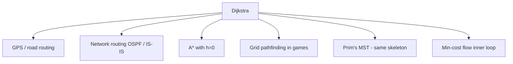

# Dijkstra's Algorithm — Middle Level

> **Focus:** Why the greedy choice is correct, lazy vs eager heap management, when Dijkstra is the right tool versus BFS / Bellman-Ford / A*, and the advanced patterns (path reconstruction, k-shortest, multi-criteria, grid) you meet in real problems.

---

## Table of Contents

1. [Introduction](#introduction)
2. [Deeper Concepts](#deeper-concepts)
3. [Comparison with Alternatives](#comparison-with-alternatives)
4. [Advanced Patterns](#advanced-patterns)
5. [Graph and Tree Applications](#graph-and-tree-applications)
6. [Algorithmic Integration](#algorithmic-integration)
7. [Code Examples](#code-examples)
8. [Error Handling](#error-handling)
9. [Performance Analysis](#performance-analysis)
10. [Best Practices](#best-practices)
11. [Visual Animation](#visual-animation)
12. [Summary](#summary)

---

## Introduction

At junior level Dijkstra is "push, pop, relax, skip stale." At middle level you start asking the *engineering* questions:

- *Why* is settling the closest unsettled vertex provably correct, and what exactly does non-negativity buy you?
- When should you pay for an indexed heap with `decreaseKey` instead of the lazy stale-skip pattern?
- How do you reconstruct not just one shortest path but the second-shortest, or the *k* shortest?
- When does Dijkstra lose to BFS, 0-1 BFS, A*, or Bellman-Ford?
- How do you handle "shortest path that also minimizes the number of stops," i.e. multi-criteria?

These distinctions decide whether your routing query returns in 5 ms or times out.

---

## Deeper Concepts

### The settled invariant

The correctness of Dijkstra rests on one invariant:

> **When a vertex `u` is popped from the priority queue (and is not stale), `dist[u]` equals the true shortest-path distance from the source.**

Sketch of why (full proof in `professional.md`): suppose `u` is popped with tentative `dist[u]`, but the true shortest distance `δ(u)` is smaller. The true shortest path leaves the settled set at some edge `(x, y)` where `x` is settled and `y` is not. Then

```
δ(u) = δ(y) + (rest of path) ≥ δ(y) = dist[y]   (since rest is non-negative)
```

But `dist[y] ≥ dist[u]` because `u` was chosen as the minimum in the queue. Combining: `δ(u) ≥ dist[u]`, contradicting `δ(u) < dist[u]`. The crucial step `(rest of path) ≥ 0` is **exactly where non-negativity is used.** A negative edge would let the "rest of the path" be negative, breaking the chain.

### Lazy deletion vs eager decrease-key

Both produce identical answers. They differ in how the heap tracks improved distances.

**Lazy (duplicate + skip):**
- On improving `dist[v]`, just `push (dist[v], v)`.
- The heap holds up to `O(E)` entries (one per relaxation that improved something).
- On pop, skip if `d > dist[u]`.
- No per-vertex position bookkeeping. Simplest, idiomatic, and usually fastest in practice on sparse graphs.

**Eager (indexed heap + decreaseKey):**
- Keep exactly one entry per vertex; lower its key in place.
- Heap holds at most `O(V)` entries.
- Needs an *indexed* heap that maps vertex → heap position, updated on every swap (see *10-heaps/01-binary-heap*, middle level).
- Fewer heap elements; marginally better on dense graphs, more code, more cache traffic for the index map.

Asymptotically both are `O((V + E) log V)`. The lazy version is `O(E log E) = O(E log V)` because `log E ≤ 2 log V`.

### Why the stale entry exists and is safe

When `v` is relaxed twice (e.g. via `B` then via `D` for a smaller distance), both `(9, v)` and `(7, v)` sit in the heap. The smaller pops first, settles `v` correctly, and writes `dist[v]=7`. When `(9, v)` later pops, `9 > dist[v]=7` so we skip it. The stale entry can never settle a vertex with the wrong value because the *minimum* always pops first.

### Path reconstruction and the shortest-path tree

The `prev[]` array forms a **shortest-path tree** rooted at the source: every vertex points to its predecessor on a shortest path. Walking `prev[]` from any target back to the source yields one shortest path. If you need *all* shortest paths (when ties exist), store a list of predecessors instead of a single one, or count paths with a DAG-DP over the shortest-path DAG.

---

## Comparison with Alternatives

| Algorithm | Edge weights | Time | Use when |
|-----------|--------------|------|----------|
| **BFS** | unweighted (all = 1) | `O(V + E)` | Fewest edges; Dijkstra reduces to this. |
| **0-1 BFS** | only 0 or 1 | `O(V + E)` | Weights in {0,1}; deque instead of heap. |
| **Dijkstra (heap)** | non-negative | `O((V + E) log V)` | General non-negative weights, sparse graph. |
| **Dijkstra (array)** | non-negative | `O(V²)` | Non-negative weights, dense graph. |
| **Bellman-Ford** | any (incl. negative) | `O(V · E)` | Negative edges; detects negative cycles. (*05-bellman-ford*) |
| **A\*** | non-negative + admissible heuristic | `O((V + E) log V)`, fewer expansions | Single target with a good heuristic. (*09-a-star*) |
| **Floyd-Warshall** | any (incl. negative, no neg cycle) | `O(V³)` | All-pairs on small/dense graphs. (*06-floyd-warshall*) |
| **Johnson** | any | `O(V·E + V² log V)` | All-pairs on sparse graphs with negatives. |

**Choose Dijkstra when:** weights are non-negative and you need single-source distances. It is the default.

**Choose A\* when:** you have one target and an admissible, consistent heuristic (e.g. straight-line distance). With `h = 0`, A* *is* Dijkstra — that is the precise relationship.

**Choose Bellman-Ford when:** any edge can be negative, or you must detect negative cycles. Dijkstra is simply wrong here.

**Choose BFS / 0-1 BFS when:** weights are uniform or binary — the heap's `log V` factor is pure overhead.

---

## Advanced Patterns

### Pattern: Path reconstruction

Keep `prev[v]` updated alongside every successful relaxation; walk it backward from the target. (Shown in the Code Examples below.) Cost: `O(path length)`.

### Pattern: k-shortest paths (preview)

To find the *k* shortest paths (allowing repeated vertices), run a modified Dijkstra where each vertex may be popped up to *k* times, tracking a `count[v]` of how many times it has been settled. Stop expanding a vertex after its *k*-th pop.

```python
import heapq

def k_shortest(adj, src, dst, k):
    count = {}
    pq = [(0, src)]
    results = []
    while pq and count.get(dst, 0) < k:
        d, u = heapq.heappop(pq)
        count[u] = count.get(u, 0) + 1
        if u == dst:
            results.append(d)
        if count[u] > k:
            continue
        for v, w in adj[u]:
            heapq.heappush(pq, (d + w, v))
    return results
```

This is the seed of Yen's and Eppstein's algorithms; full treatment belongs elsewhere, but the structure is "Dijkstra without a single settled set."

### Pattern: Multi-criteria (lexicographic) shortest path

"Minimize cost; break ties by fewest stops." Make the heap key a **tuple** and relax on it lexicographically:

```python
# state key = (total_cost, total_stops)
heapq.heappush(pq, ((cost + w, stops + 1), v))
```

Because tuples compare lexicographically, the heap settles by cost first, stops second. The settled check compares the full tuple. This generalizes to *constrained* shortest paths like "cheapest flight within K stops" (an interview classic).

### Pattern: Grid Dijkstra

Treat each cell `(r, c)` as a vertex; neighbors are the 4 (or 8) adjacent cells; the edge weight is the entry cost of the target cell (or a per-move cost). No explicit adjacency list — generate neighbors on the fly. This powers "swim in rising water," "path with minimum effort," and similar problems.

### Pattern: Maximize a product (path with max probability)

Some problems multiply weights (probabilities) instead of adding. Use a **max-heap** on the product and relax with `>`:

```python
# maximize product of edge probabilities
if d * p > prob[v]:
    prob[v] = d * p
    heapq.heappush(pq, (-prob[v], v))  # negate for max-heap via heapq
```

Dijkstra's greedy choice still holds because probabilities are in `[0, 1]` — multiplying never *increases* the value, the analogue of "non-negative."

---

## Graph and Tree Applications



### Prim's MST shares the skeleton

Prim's minimum spanning tree algorithm (*10-mst-kruskal-prim*) is structurally Dijkstra with one change: instead of relaxing with `dist[u] + w` (path cost), it relaxes with just `w` (edge cost), because an MST cares about the cheapest edge crossing the cut, not the accumulated path. Same priority queue, same stale-skip pattern.

### Min-cost max-flow

The successive-shortest-paths algorithm for min-cost flow (*18-min-cost-max-flow*) repeatedly runs Dijkstra (with Johnson-style potentials to handle the negative residual edges) to find the cheapest augmenting path. Dijkstra is the inner engine.

---

## Algorithmic Integration

Dijkstra composes with dynamic programming when a "state" is richer than just a vertex. The state graph is implicit; Dijkstra explores it in cost order.

A canonical example: **cheapest flight within at most K stops.** The state is `(city, stops_used)`. We want the minimum cost to reach `dst` with `stops_used ≤ K`. Because adding a flight only increases cost (non-negative), Dijkstra over the expanded state space is valid.

#### Go

```go
package main

import (
	"container/heap"
	"fmt"
)

type flightItem struct {
	cost, city, stops int
}
type fpq []flightItem

func (p fpq) Len() int           { return len(p) }
func (p fpq) Less(i, j int) bool { return p[i].cost < p[j].cost }
func (p fpq) Swap(i, j int)      { p[i], p[j] = p[j], p[i] }
func (p *fpq) Push(x any)        { *p = append(*p, x.(flightItem)) }
func (p *fpq) Pop() any {
	old := *p
	n := len(old)
	it := old[n-1]
	*p = old[:n-1]
	return it
}

func cheapestFlights(n int, flights [][]int, src, dst, K int) int {
	adj := make([][][2]int, n)
	for _, f := range flights {
		adj[f[0]] = append(adj[f[0]], [2]int{f[1], f[2]})
	}
	// best[city] = fewest stops seen at a cost we already dequeued
	pq := &fpq{{0, src, 0}}
	for pq.Len() > 0 {
		cur := heap.Pop(pq).(flightItem)
		if cur.city == dst {
			return cur.cost
		}
		if cur.stops > K {
			continue
		}
		for _, e := range adj[cur.city] {
			heap.Push(pq, flightItem{cur.cost + e[1], e[0], cur.stops + 1})
		}
	}
	return -1
}

func main() {
	flights := [][]int{{0, 1, 100}, {1, 2, 100}, {0, 2, 500}}
	fmt.Println(cheapestFlights(3, flights, 0, 2, 1)) // 200
	fmt.Println(cheapestFlights(3, flights, 0, 2, 0)) // 500
}
```

#### Java

```java
import java.util.*;

public class CheapestFlights {
    public int findCheapestPrice(int n, int[][] flights, int src, int dst, int K) {
        List<int[]>[] adj = new List[n];
        for (int i = 0; i < n; i++) adj[i] = new ArrayList<>();
        for (int[] f : flights) adj[f[0]].add(new int[]{f[1], f[2]});

        // {cost, city, stops}
        PriorityQueue<int[]> pq = new PriorityQueue<>((a, b) -> a[0] - b[0]);
        pq.add(new int[]{0, src, 0});
        while (!pq.isEmpty()) {
            int[] cur = pq.poll();
            int cost = cur[0], city = cur[1], stops = cur[2];
            if (city == dst) return cost;
            if (stops > K) continue;
            for (int[] e : adj[city]) {
                pq.add(new int[]{cost + e[1], e[0], stops + 1});
            }
        }
        return -1;
    }

    public static void main(String[] args) {
        int[][] flights = {{0, 1, 100}, {1, 2, 100}, {0, 2, 500}};
        CheapestFlights cf = new CheapestFlights();
        System.out.println(cf.findCheapestPrice(3, flights, 0, 2, 1)); // 200
        System.out.println(cf.findCheapestPrice(3, flights, 0, 2, 0)); // 500
    }
}
```

#### Python

```python
import heapq


def cheapest_flights(n, flights, src, dst, K):
    adj = [[] for _ in range(n)]
    for u, v, w in flights:
        adj[u].append((v, w))
    pq = [(0, src, 0)]  # (cost, city, stops)
    while pq:
        cost, city, stops = heapq.heappop(pq)
        if city == dst:
            return cost
        if stops > K:
            continue
        for v, w in adj[city]:
            heapq.heappush(pq, (cost + w, v, stops + 1))
    return -1


if __name__ == "__main__":
    flights = [(0, 1, 100), (1, 2, 100), (0, 2, 500)]
    print(cheapest_flights(3, flights, 0, 2, 1))  # 200
    print(cheapest_flights(3, flights, 0, 2, 0))  # 500
```

Because the first time we pop `dst` it is the cheapest path satisfying the stop constraint (cost ordering), we can return immediately. (A pure-DP Bellman-Ford-style relaxation bounded to `K+1` rounds is the alternative when stops dominate; both are common answers.)

---

## Code Examples

### Eager Dijkstra with an indexed heap (decrease-key) + path reconstruction

This is the variant you reach for when you want one heap entry per vertex.

#### Go

```go
package main

import "fmt"

const INF = int(1e18)

// IndexedHeap: min-heap keyed by dist, with pos[vertex] -> heap slot.
type IndexedHeap struct {
	nodes []int   // nodes[i] = vertex at slot i
	pos   []int   // pos[v] = slot of v, or -1
	key   []int   // key[v] = current tentative distance
}

func NewIndexedHeap(n int) *IndexedHeap {
	pos := make([]int, n)
	key := make([]int, n)
	for i := range pos {
		pos[i] = -1
		key[i] = INF
	}
	return &IndexedHeap{pos: pos, key: key}
}

func (h *IndexedHeap) Empty() bool      { return len(h.nodes) == 0 }
func (h *IndexedHeap) Contains(v int) bool { return h.pos[v] != -1 }

func (h *IndexedHeap) Push(v, k int) {
	h.key[v] = k
	h.nodes = append(h.nodes, v)
	h.pos[v] = len(h.nodes) - 1
	h.siftUp(len(h.nodes) - 1)
}

func (h *IndexedHeap) DecreaseKey(v, k int) {
	if k >= h.key[v] {
		return
	}
	h.key[v] = k
	h.siftUp(h.pos[v])
}

func (h *IndexedHeap) Pop() int {
	top := h.nodes[0]
	last := len(h.nodes) - 1
	h.swap(0, last)
	h.nodes = h.nodes[:last]
	h.pos[top] = -1
	if last > 0 {
		h.siftDown(0)
	}
	return top
}

func (h *IndexedHeap) siftUp(i int) {
	for i > 0 {
		p := (i - 1) / 2
		if h.key[h.nodes[p]] <= h.key[h.nodes[i]] {
			return
		}
		h.swap(p, i)
		i = p
	}
}

func (h *IndexedHeap) siftDown(i int) {
	n := len(h.nodes)
	for {
		l, r, m := 2*i+1, 2*i+2, i
		if l < n && h.key[h.nodes[l]] < h.key[h.nodes[m]] {
			m = l
		}
		if r < n && h.key[h.nodes[r]] < h.key[h.nodes[m]] {
			m = r
		}
		if m == i {
			return
		}
		h.swap(i, m)
		i = m
	}
}

func (h *IndexedHeap) swap(a, b int) {
	h.nodes[a], h.nodes[b] = h.nodes[b], h.nodes[a]
	h.pos[h.nodes[a]] = a
	h.pos[h.nodes[b]] = b
}

type Edge struct{ To, W int }

func Dijkstra(adj [][]Edge, src int) (dist, prev []int) {
	n := len(adj)
	dist = make([]int, n)
	prev = make([]int, n)
	for i := range dist {
		dist[i] = INF
		prev[i] = -1
	}
	dist[src] = 0
	h := NewIndexedHeap(n)
	h.Push(src, 0)
	for !h.Empty() {
		u := h.Pop()
		for _, e := range adj[u] {
			nd := dist[u] + e.W
			if nd < dist[e.To] {
				dist[e.To] = nd
				prev[e.To] = u
				if h.Contains(e.To) {
					h.DecreaseKey(e.To, nd)
				} else {
					h.Push(e.To, nd)
				}
			}
		}
	}
	return dist, prev
}

func main() {
	adj := make([][]Edge, 5)
	adj[0] = []Edge{{1, 2}, {2, 5}}
	adj[1] = []Edge{{2, 1}, {3, 7}}
	adj[2] = []Edge{{3, 3}, {4, 8}}
	adj[3] = []Edge{{4, 2}}
	dist, _ := Dijkstra(adj, 0)
	fmt.Println(dist) // [0 2 3 6 8]
}
```

#### Java

```java
import java.util.*;

public class DijkstraIndexed {
    static final long INF = Long.MAX_VALUE / 4;

    // Indexed binary min-heap on vertex distances.
    static final class IndexedHeap {
        int[] nodes; int[] pos; long[] key; int size;
        IndexedHeap(int n) {
            nodes = new int[n]; pos = new int[n]; key = new long[n];
            Arrays.fill(pos, -1); Arrays.fill(key, INF); size = 0;
        }
        boolean isEmpty() { return size == 0; }
        boolean contains(int v) { return pos[v] != -1; }
        void push(int v, long k) {
            key[v] = k; nodes[size] = v; pos[v] = size; siftUp(size++); }
        void decreaseKey(int v, long k) {
            if (k >= key[v]) return; key[v] = k; siftUp(pos[v]); }
        int pop() {
            int top = nodes[0];
            swap(0, --size); pos[top] = -1;
            if (size > 0) siftDown(0);
            return top;
        }
        void siftUp(int i) {
            while (i > 0) {
                int p = (i - 1) / 2;
                if (key[nodes[p]] <= key[nodes[i]]) return;
                swap(p, i); i = p;
            }
        }
        void siftDown(int i) {
            while (true) {
                int l = 2*i+1, r = 2*i+2, m = i;
                if (l < size && key[nodes[l]] < key[nodes[m]]) m = l;
                if (r < size && key[nodes[r]] < key[nodes[m]]) m = r;
                if (m == i) return;
                swap(i, m); i = m;
            }
        }
        void swap(int a, int b) {
            int t = nodes[a]; nodes[a] = nodes[b]; nodes[b] = t;
            pos[nodes[a]] = a; pos[nodes[b]] = b;
        }
    }

    static long[] dijkstra(List<int[]>[] adj, int src, int[] prev) {
        int n = adj.length;
        long[] dist = new long[n];
        Arrays.fill(dist, INF); Arrays.fill(prev, -1);
        dist[src] = 0;
        IndexedHeap h = new IndexedHeap(n);
        h.push(src, 0);
        while (!h.isEmpty()) {
            int u = h.pop();
            for (int[] e : adj[u]) {
                int v = e[0], w = e[1];
                long nd = dist[u] + w;
                if (nd < dist[v]) {
                    dist[v] = nd; prev[v] = u;
                    if (h.contains(v)) h.decreaseKey(v, nd);
                    else h.push(v, nd);
                }
            }
        }
        return dist;
    }

    public static void main(String[] args) {
        int n = 5;
        List<int[]>[] adj = new List[n];
        for (int i = 0; i < n; i++) adj[i] = new ArrayList<>();
        adj[0].add(new int[]{1, 2}); adj[0].add(new int[]{2, 5});
        adj[1].add(new int[]{2, 1}); adj[1].add(new int[]{3, 7});
        adj[2].add(new int[]{3, 3}); adj[2].add(new int[]{4, 8});
        adj[3].add(new int[]{4, 2});
        int[] prev = new int[n];
        System.out.println(Arrays.toString(dijkstra(adj, 0, prev))); // [0, 2, 3, 6, 8]
    }
}
```

#### Python

```python
# Eager Dijkstra with an indexed heap built on heapq-style sift logic.
INF = float("inf")


class IndexedHeap:
    def __init__(self, n):
        self.nodes = []
        self.pos = [-1] * n
        self.key = [INF] * n

    def empty(self):
        return not self.nodes

    def contains(self, v):
        return self.pos[v] != -1

    def push(self, v, k):
        self.key[v] = k
        self.nodes.append(v)
        self.pos[v] = len(self.nodes) - 1
        self._sift_up(len(self.nodes) - 1)

    def decrease_key(self, v, k):
        if k >= self.key[v]:
            return
        self.key[v] = k
        self._sift_up(self.pos[v])

    def pop(self):
        top = self.nodes[0]
        last = len(self.nodes) - 1
        self._swap(0, last)
        self.nodes.pop()
        self.pos[top] = -1
        if self.nodes:
            self._sift_down(0)
        return top

    def _sift_up(self, i):
        while i > 0:
            p = (i - 1) // 2
            if self.key[self.nodes[p]] <= self.key[self.nodes[i]]:
                return
            self._swap(p, i)
            i = p

    def _sift_down(self, i):
        n = len(self.nodes)
        while True:
            l, r, m = 2 * i + 1, 2 * i + 2, i
            if l < n and self.key[self.nodes[l]] < self.key[self.nodes[m]]:
                m = l
            if r < n and self.key[self.nodes[r]] < self.key[self.nodes[m]]:
                m = r
            if m == i:
                return
            self._swap(i, m)
            i = m

    def _swap(self, a, b):
        self.nodes[a], self.nodes[b] = self.nodes[b], self.nodes[a]
        self.pos[self.nodes[a]] = a
        self.pos[self.nodes[b]] = b


def dijkstra(adj, src):
    n = len(adj)
    dist = [INF] * n
    prev = [-1] * n
    dist[src] = 0
    h = IndexedHeap(n)
    h.push(src, 0)
    while not h.empty():
        u = h.pop()
        for v, w in adj[u]:
            nd = dist[u] + w
            if nd < dist[v]:
                dist[v] = nd
                prev[v] = u
                if h.contains(v):
                    h.decrease_key(v, nd)
                else:
                    h.push(v, nd)
    return dist, prev


if __name__ == "__main__":
    adj = [[(1, 2), (2, 5)], [(2, 1), (3, 7)], [(3, 3), (4, 8)], [(4, 2)], []]
    print(dijkstra(adj, 0)[0])  # [0, 2, 3, 6, 8]
```

---

## Error Handling

| Scenario | What goes wrong | Correct approach |
|----------|-----------------|------------------|
| Negative edge slips in | Vertex settled too early; result silently wrong. | Validate `w ≥ 0` on load; otherwise route to Bellman-Ford. |
| Decrease-key called with a larger key | Heap invariant breaks; wrong settle order. | Guard `if k >= key[v]: return` (shown above). |
| Stale entries never skipped (lazy) | Quadratic blowup and possible wrong "visited" logic. | Keep the `d > dist[u]: continue` guard. |
| Overflow on `dist[u] + w` | Wraps to a negative, corrupts comparisons. | Use 64-bit, sentinel `≈ 1e18`, never relax from `∞`. |
| `prev` cycle during reconstruction | Bug in relaxation (updating `prev` without lowering `dist`). | Only set `prev[v]` when you actually lower `dist[v]`. |
| Mixed directed/undirected | Missing reverse edges. | Add both directions for undirected graphs. |

---

## Performance Analysis

| Heap variant | Push | Pop-min | Decrease-key | Total Dijkstra | Notes |
|--------------|------|---------|--------------|----------------|-------|
| Binary heap (lazy) | O(log E) | O(log E) | n/a (re-push) | **O((V+E) log V)** | Default; up to `E` entries. |
| Binary heap (eager) | O(log V) | O(log V) | O(log V) | **O((V+E) log V)** | `V` entries; needs index map. |
| d-ary heap (d=4) | O(log_d V) | O(d log_d V) | O(log_d V) | O((V·d + E) log_d V) | Fewer levels; good when decrease-key dominates (dense). |
| Array / linear scan | O(1) | O(V) | O(1) | **O(V²)** | Best for dense `E ≈ V²`. |
| Fibonacci heap | O(1) | O(log V) am. | O(1) am. | **O(E + V log V)** | Theoretical optimum; large constants. (*10-heaps/03-fibonacci-heap*) |

Rule of thumb on real hardware: for sparse road-network-like graphs, the **lazy binary heap** beats everything simpler to write, and beats the Fibonacci heap because of cache effects and pointer overhead. The array variant only wins when `E` approaches `V²`.

```python
# Quick empirical sketch (Python): lazy vs sorting-based baseline.
import heapq, random, timeit

def make_graph(n, m):
    adj = [[] for _ in range(n)]
    for _ in range(m):
        u, v = random.randrange(n), random.randrange(n)
        adj[u].append((v, random.randint(1, 100)))
    return adj

g = make_graph(20000, 100000)

def run():
    INF = float("inf"); dist = [INF]*len(g); dist[0]=0; pq=[(0,0)]
    while pq:
        d,u = heapq.heappop(pq)
        if d>dist[u]: continue
        for v,w in g[u]:
            nd=d+w
            if nd<dist[v]:
                dist[v]=nd; heapq.heappush(pq,(nd,v))

print(timeit.timeit(run, number=3))
```

---

## Best Practices

- **Default to the lazy binary heap.** Reach for the indexed/eager version only after profiling shows the heap is the bottleneck.
- **Match the variant to graph density** — `O(V²)` array scan genuinely wins on dense graphs.
- **Reconstruct paths with `prev[]`**, not by re-running per target.
- **Use tuple keys** for multi-criteria; let lexicographic comparison do the work.
- **Stop early** when only one target matters; the first non-stale pop of the target is final.
- **Validate non-negativity** at the graph boundary; never trust input weights blindly.

---

## Visual Animation

> See [`animation.html`](./animation.html) for an interactive view.
>
> The middle-level relevant features:
> - Watch the priority queue accumulate duplicate (stale) entries in lazy mode.
> - The settled set is highlighted distinctly from the frontier.
> - The current relaxation edge flashes, and improved distances update live.

---

## Summary

Dijkstra is correct because settling the closest unsettled vertex can never be beaten by a route through farther, still-unsettled vertices — a guarantee that holds *only* for non-negative weights. The lazy stale-skip heap is the pragmatic default; the eager indexed heap trades code for a smaller heap. Path reconstruction rides on a predecessor array, multi-criteria problems ride on tuple keys, and the same skeleton powers Prim's MST and min-cost flow. Knowing exactly when Dijkstra loses — negatives (Bellman-Ford), uniform weights (BFS), single target with a heuristic (A*) — is what separates middle-level from junior understanding.
