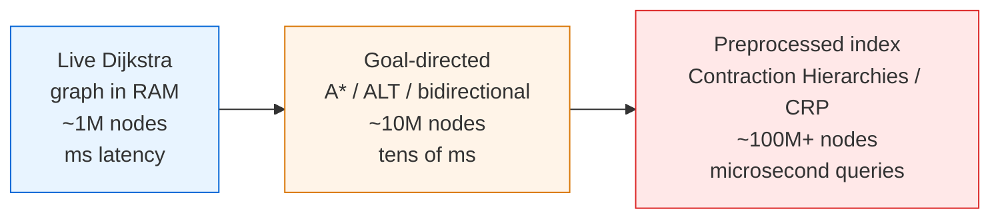

# Dijkstra's Algorithm — Senior Level

> Textbook Dijkstra answers "shortest path" in milliseconds on a graph that fits in RAM. A continental road network has ~50M nodes and ~125M edges, and users expect sub-100ms routing under load. At that scale the algorithm itself is not the product — the preprocessing index, the query pruning, the memory layout, and the failure handling are.

## Table of Contents
1. [Introduction](#1-introduction)
2. [System Design — Routing Engines and Map Services](#2-system-design--routing-engines-and-map-services)
3. [Distributed and Large-Graph Techniques](#3-distributed-and-large-graph-techniques)
4. [Contraction Hierarchies — A Worked Example](#4-contraction-hierarchies--a-worked-example)
5. [ALT — Landmark Heuristic Math](#5-alt--landmark-heuristic-math)
6. [Concurrency — Parallel Shortest Paths](#6-concurrency--parallel-shortest-paths)
7. [Parallel Δ-Stepping — Code Sketch](#7-parallel-δ-stepping--code-sketch)
8. [Comparison at Scale](#8-comparison-at-scale)
9. [Architecture Patterns](#9-architecture-patterns)
10. [Code Examples — Bidirectional Dijkstra](#10-code-examples--bidirectional-dijkstra)
11. [Observability](#11-observability)
12. [Failure Modes](#12-failure-modes)
13. [Capacity Planning](#13-capacity-planning)
14. [Summary](#14-summary)

---

## 1. Introduction

At senior level the question shifts from "how does relaxation work" to "where does shortest-path computation sit in my system, and what breaks when it does?" Plain Dijkstra has three properties that drive every architectural decision:

- **It explores in all directions.** For a single source-to-target query it expands a disk of radius `δ(s,t)` around the source — potentially millions of nodes — even though the answer touches a few hundred.
- **It is single-source.** Answering "route from A to B" with vanilla Dijkstra wastes work computing distances to everywhere.
- **It is memory-bandwidth bound at scale.** The inner loop is random-access into adjacency and distance arrays; on a 100M-edge graph, cache misses, not comparisons, dominate.

The senior-level toolkit responds to each: **goal-directed search** (A*, ALT) to stop exploring away from the target; **bidirectional search** to halve the explored disk; **preprocessing indexes** (contraction hierarchies) to answer queries in microseconds; **graph partitioning** for graphs that exceed one machine; and **parallel Δ-stepping** when one query must use many cores.

This document covers the five questions a senior owns:

1. Which routing architecture (live Dijkstra, ALT, contraction hierarchies, partitioned) fits this graph and query mix?
2. How do you make a single query use multiple cores without losing correctness?
3. How do you serve a 100M-edge graph that does not fit comfortably in one box?
4. How do you observe and alarm on routing quality and latency?
5. How do you plan capacity for QPS, memory, and preprocessing cost?

---

## 2. System Design — Routing Engines and Map Services

### 2.1 Three tiers of shortest-path service



| Tier | When right | When wrong |
| --- | --- | --- |
| Live Dijkstra | Graph fits in RAM, weights change every query (live traffic), few queries. | High QPS point-to-point — you recompute the same disks repeatedly. |
| Goal-directed (A*/ALT/bidirectional) | Single target, decent heuristic or precomputed landmarks, moderate QPS. | Metric changes (turn restrictions, traffic) invalidate the heuristic/landmarks. |
| Preprocessed index (CH, CRP, Hub Labels) | Static or slowly-changing graph, very high QPS, sub-millisecond SLA. | Frequent topology changes force expensive re-preprocessing. |

The most common mistake is jumping to contraction hierarchies for a graph that changes every minute (live traffic). The customizable variant **CRP (Customizable Route Planning)** exists precisely to separate the expensive topology preprocessing from cheap metric customization.

### 2.2 What goal-direction buys

Plain Dijkstra from `s` to `t` settles every node closer to `s` than `t` is — a full disk. **Bidirectional** Dijkstra runs two searches (forward from `s`, backward from `t` on the reversed graph) and meets in the middle, exploring roughly two half-radius disks: about `2 · (1/2)^{d}` of the area in `d` dimensions — a large constant-factor win. **A\*** with a good heuristic deforms the disk toward the target. **ALT** (A*, Landmarks, Triangle inequality) precomputes distances to a handful of landmarks and uses the triangle inequality as an admissible heuristic — pure Dijkstra mechanics with a smarter key.

---

## 3. Distributed and Large-Graph Techniques

### 3.1 Contraction hierarchies (CH)

CH preprocesses the graph by repeatedly "contracting" the least important node, adding **shortcut** edges that preserve shortest-path distances. A query then runs a bidirectional Dijkstra that only ever relaxes edges going to *more important* nodes. On continental road networks this turns a multi-second Dijkstra into a sub-millisecond query, at the cost of minutes of preprocessing and ~2x edge storage. CH is the backbone of OSRM and many production routers.

### 3.2 ALT and landmark selection

Pick ~16 landmarks (often by avoid/farthest heuristics), precompute distance to/from each for every node. The heuristic `h(v) = max_L |d(v,L) − d(t,L)|` is admissible and consistent by the triangle inequality. ALT needs no graph rewriting, so it tolerates metric changes better than CH, but its speedups are smaller (5–30x vs CH's 1000x+).

### 3.3 Graph partitioning for graphs beyond one machine

When the graph exceeds a single box, partition it (METIS, KaHIP) into regions, store boundary distance tables, and route hierarchically: intra-region with local Dijkstra, inter-region over the much smaller boundary graph. This is the idea behind CRP's multi-level overlay. The hard part is minimizing the **cut** so boundary tables stay small.

### 3.4 Bidirectional Dijkstra — the workhorse building block

Even without CH, bidirectional search is the first optimization for point-to-point. Two frontiers, forward and backward; stop when the sum of the two minimum keys exceeds the best meeting distance found so far. Correctness requires care in the stopping condition (Section 10).

---

## 4. Contraction Hierarchies — A Worked Example

CH is the highest-leverage preprocessing technique a senior must understand deeply, because it is the engine inside OSRM and many production routers and its failure modes (stale shortcuts, witness-search blowup) are operational, not academic. The idea: assign every node an **importance rank**, then contract nodes from least to most important. Contracting node `v` removes it and, for every pair of remaining neighbors `(u, w)` whose shortest path used to go through `v`, inserts a **shortcut** edge `u→w` of weight `d(u,v)+d(v,w)` — but *only* if no other path of equal-or-less weight exists (the **witness path**). A query then runs a bidirectional Dijkstra that relaxes only **upward** edges (to higher-ranked nodes), so each search climbs the hierarchy and the two meet at the highest common node.

### 4.1 Contraction, step by step

Consider this small undirected graph; importance order (chosen here for illustration) is `D < E < B < C < A`, lowest first.

```text
        2        2
   A -------- B -------- C
   |          |          |
 1 |        3 |          | 1
   |          |          |
   D -------- E ---------+
        4         (E-C = 4)

Edges: A-B=2, B-C=2, A-D=1, B-E=3, C-E=4, D-E=4
```

**Contract D (rank 0).** Neighbors of `D` are `{A, E}`. The path `A-D-E` has weight `1+4=5`. Is there a witness — an `A→E` path not through `D` of weight `≤ 5`? Yes: `A-B-E = 2+3 = 5`. Since a witness of equal weight exists, **no shortcut is needed**. `D` is removed.

**Contract E (rank 1).** Remaining neighbors of `E` are `{B, C}` (`D` already gone). Path `B-E-C = 3+4 = 7`. Witness `B-C = 2 ≤ 7` exists, so **no shortcut**. `E` removed.

**Contract B (rank 2).** Neighbors `{A, C}`. Path `A-B-C = 2+2 = 4`. Witness: is there an `A→C` path among higher-ranked nodes `{A, C}` only? Direct `A-C` does not exist; no witness `≤ 4`. **Add shortcut `A-C = 4`** (tagged: expands to `A-B-C`). `B` removed.

Remaining graph after contraction: `A`, `C`, with the original `A-C`? none, plus shortcut `A-C = 4`. The hierarchy stores every original edge plus this one shortcut.

### 4.2 Query on the hierarchy

Query `D → C`. Forward search from `D` relaxes only edges to higher-rank nodes:

```text
forward (from D, upward only):  D -> A (1),  D -> E (4)
   from A: A -> B (2)? B is higher than A? rank(B)=2 < rank(A)=4, NO (not upward)
   actual upward from A: A -> C via shortcut (4)  => d_f[C] = 1 + 4 = 5
backward (from C, upward only): C -> ... C is highest, only downward exists; backward
   relaxes upward in the reverse graph, i.e. toward higher ranks from C — none higher.
```

The forward search reaches `C` at distance `5` (`D→A` then shortcut `A→C`). Unpacking the shortcut `A-C` yields `A-B-C`, so the real path is `D-A-B-C = 1+2+2 = 5`. Cross-check with plain Dijkstra: `D-A-B-C = 5`, `D-E-C = 4+4 = 8`, `D-E-B-C = 4+3+2 = 9` — yes, `5` is optimal.

### 4.3 The two operational hazards

1. **Witness-search cost.** Deciding whether a shortcut is needed requires a local Dijkstra (the witness search) bounded by a hop limit. Choosing node order (the contraction priority — edge difference, deleted neighbors, search space depth) badly causes a **shortcut explosion**: a poor order can add `O(V²)` shortcuts and blow preprocessing from minutes to hours. Production CH uses a lazy priority queue of nodes keyed by a linear combination of these terms, re-evaluated as neighbors are contracted.

2. **Staleness.** A shortcut encodes a shortest path under the metric at preprocessing time. Change one edge weight (traffic) and an unknown set of shortcuts becomes wrong. Plain CH must re-preprocess; this is exactly the gap CRP closes by separating the (rarely-changing) contraction order from a (cheap, per-metric) customization phase that only recomputes shortcut *weights*, not the hierarchy *structure*.

---

## 5. ALT — Landmark Heuristic Math

ALT (A*, Landmarks, Triangle inequality) is the technique to reach for when the metric changes too often for CH but a one-off bidirectional Dijkstra is too slow. It needs no graph rewriting, so a metric change only invalidates the precomputed landmark distances, which are cheap to recompute relative to a full contraction.

### 5.1 Deriving the admissible, consistent heuristic

Pick a small set `L` of landmarks (typically 8–16). For each landmark `ℓ`, precompute `d(v, ℓ)` and `d(ℓ, v)` for all `v` via two Dijkstra runs (one on the graph, one on the reverse). For a target `t`, the triangle inequality on shortest-path distances gives, for any landmark `ℓ`:

```text
d(v, t) ≥ d(ℓ, t) − d(ℓ, v)      (landmark "behind" v)
d(v, t) ≥ d(v, ℓ) − d(t, ℓ)      (landmark "ahead of" t)
```

Both right-hand sides are valid lower bounds on the remaining distance `d(v,t)`. Taking the max over all landmarks and both forms yields the heuristic

```text
h(v) = max_{ℓ ∈ L} max( d(ℓ,t) − d(ℓ,v),  d(v,ℓ) − d(t,ℓ) ).
```

- **Admissible** (`h(v) ≤ d(v,t)`): each term is a lower bound by the triangle inequality, and the max of lower bounds is a lower bound. A* with an admissible heuristic returns optimal paths.
- **Consistent** (`h(u) ≤ w(u,v) + h(v)`): each term is a difference of fixed landmark distances offset by `d(·,v)`, and shifting `v→u` along an edge changes `d(ℓ,v)` by at most `w(u,v)`; the max preserves this. Consistency means A* never re-opens a closed node — it behaves like Dijkstra on the reduced costs `w'(u,v) = w(u,v) − h(u) + h(v) ≥ 0`.

### 5.2 Landmark selection and the speedup/quality trade

The heuristic is only as good as its landmarks. Random selection is weak; the standard heuristics are **farthest** (greedily add the node maximizing distance to the current set) and **avoid** (place landmarks in regions the current set covers poorly). Good landmarks sit "past" the natural targets — corners of the map for road networks. More landmarks tighten `h` (fewer nodes settled) but cost `O(|L|·V)` memory and slow the per-node `h` evaluation (a max over `2|L|` terms). Production ALT runs 8–16 landmarks: enough for a 5–30× speedup over plain bidirectional Dijkstra without the memory of a full distance table. Unlike CH, ALT's reduced costs `w'` stay non-negative under *any* metric as long as the landmark tables are recomputed, which is why it degrades gracefully under live traffic.

---

## 6. Concurrency — Parallel Shortest Paths

### 6.1 Why naive parallel Dijkstra is hard

Dijkstra is inherently sequential: each `pop-min` depends on all prior relaxations. You cannot trivially settle two vertices at once because the second might be relaxed by the first. Lock-around-the-heap serializes everything and loses.

### 6.2 Δ-stepping

**Δ-stepping** (Meyer & Sanders) relaxes the strict "settle exactly the global minimum" rule. It buckets tentative distances into ranges of width `Δ`. All vertices in the current bucket can be processed in parallel because their relaxations stay within or below the bucket. Light edges (`w ≤ Δ`) are relaxed first (they may re-add to the current bucket); heavy edges (`w > Δ`) are deferred. Choosing `Δ` trades parallelism (large `Δ` = more concurrency, more redundant work) against work efficiency (small `Δ` = closer to sequential Dijkstra).

- `Δ = ∞` ⇒ effectively Bellman-Ford (maximum parallelism, maximum work).
- `Δ = min edge weight` ⇒ effectively Dijkstra (minimum work, little parallelism).

Δ-stepping is the standard parallel SSSP algorithm; Graph500-style benchmarks and libraries (Galois, GAP) implement it.

### 6.3 Practical concurrency

- **Per-query parallelism:** use Δ-stepping or parallel BFS-like frontiers for one huge query.
- **Per-request parallelism:** far simpler and usually enough — run independent queries on independent cores with a read-only shared graph. The graph is immutable during queries, so no locking is needed.

For a routing *service*, per-request parallelism on an immutable graph snapshot is the pragmatic default; reserve Δ-stepping for batch analytics over one enormous graph.

---

## 7. Parallel Δ-Stepping — Code Sketch

The structure below shows the bucket loop that makes Δ-stepping parallelizable. The phases within a bucket are the unit of parallelism: all *light* relaxations of the current bucket can run concurrently because every resulting tentative distance stays within or below the bucket, so re-insertions land in the same or an already-processed bucket and no settled value is ever lowered. We give a single-threaded reference (correct, easy to test) and note exactly where a thread pool slots in.

```go
package main

import "fmt"

type Edge struct{ To, W int }

// DeltaStepping returns SSSP distances. The two inner loops over the bucket's
// request set are the parallel kernels: in production each is a parallel-for
// over disjoint vertices with atomic-min relaxation into dist[].
func DeltaStepping(g [][]Edge, s, delta int) []int {
	n := len(g)
	dist := make([]int, n)
	for i := range dist {
		dist[i] = 1 << 30
	}
	buckets := map[int]map[int]bool{} // bucket index -> set of vertices
	relax := func(v, d int) {
		if d < dist[v] {
			if dist[v] != 1<<30 {
				delete(buckets[dist[v]/delta], v) // remove from old bucket
			}
			dist[v] = d
			b := d / delta
			if buckets[b] == nil {
				buckets[b] = map[int]bool{}
			}
			buckets[b][v] = true // atomic-min + bucket move in the parallel version
		}
	}
	relax(s, 0)
	for i := 0; len(buckets) > 0; i++ {
		cur, ok := buckets[i]
		if !ok {
			continue // empty bucket index; higher buckets remain
		}
		var settled []int
		for len(cur) > 0 { // light-edge phase: may re-add into bucket i
			var req [][2]int
			for v := range cur {
				settled = append(settled, v)
				for _, e := range g[v] {
					if e.W <= delta {
						req = append(req, [2]int{e.To, dist[v] + e.W})
					}
				}
			}
			buckets[i] = map[int]bool{}
			cur = buckets[i]
			for _, r := range req { // PARALLEL-FOR in production
				relax(r[0], r[1])
			}
		}
		for _, v := range settled { // heavy-edge phase, once bucket is stable
			for _, e := range g[v] {
				if e.W > delta {
					relax(e.To, dist[v]+e.W) // PARALLEL-FOR in production
				}
			}
		}
		delete(buckets, i)
	}
	return dist
}

func main() {
	g := make([][]Edge, 6)
	add := func(u, v, w int) { g[u] = append(g[u], Edge{v, w}) }
	add(0, 1, 4); add(0, 2, 1); add(2, 1, 1)
	add(1, 3, 1); add(2, 4, 5); add(3, 5, 3); add(4, 5, 1)
	fmt.Println(DeltaStepping(g, 0, 3)) // [0 2 1 3 6 6]
}
```

```java
import java.util.*;

public class DeltaStepping {
    public static int[] run(List<int[]>[] g, int s, int delta) {
        int n = g.length, INF = 1 << 30;
        int[] dist = new int[n];
        Arrays.fill(dist, INF);
        TreeMap<Integer, Set<Integer>> buckets = new TreeMap<>();
        relax(dist, buckets, delta, s, 0);
        while (!buckets.isEmpty()) {
            int i = buckets.firstKey();
            Set<Integer> cur = buckets.get(i);
            List<Integer> settled = new ArrayList<>();
            while (!cur.isEmpty()) {                  // light phase
                List<int[]> req = new ArrayList<>();
                for (int v : cur) {
                    settled.add(v);
                    for (int[] e : g[v])
                        if (e[1] <= delta) req.add(new int[]{e[0], dist[v] + e[1]});
                }
                buckets.put(i, new HashSet<>());
                cur = buckets.get(i);
                for (int[] r : req) relax(dist, buckets, delta, r[0], r[1]); // PARALLEL
            }
            for (int v : settled)                     // heavy phase
                for (int[] e : g[v])
                    if (e[1] > delta) relax(dist, buckets, delta, e[0], dist[v] + e[1]);
            buckets.remove(i);
        }
        return dist;
    }

    static void relax(int[] dist, TreeMap<Integer, Set<Integer>> b, int delta, int v, int d) {
        if (d < dist[v]) {
            if (dist[v] != (1 << 30)) b.get(dist[v] / delta).remove(v);
            dist[v] = d;
            b.computeIfAbsent(d / delta, k -> new HashSet<>()).add(v);
        }
    }

    public static void main(String[] args) {
        int n = 6;
        List<int[]>[] g = new List[n];
        for (int i = 0; i < n; i++) g[i] = new ArrayList<>();
        int[][] es = {{0,1,4},{0,2,1},{2,1,1},{1,3,1},{2,4,5},{3,5,3},{4,5,1}};
        for (int[] e : es) g[e[0]].add(new int[]{e[1], e[2]});
        System.out.println(Arrays.toString(run(g, 0, 3))); // [0, 2, 1, 3, 6, 6]
    }
}
```

```python
from collections import defaultdict

INF = 1 << 30


def delta_stepping(g, s, delta):
    n = len(g)
    dist = [INF] * n
    buckets = defaultdict(set)

    def relax(v, d):
        if d < dist[v]:
            if dist[v] != INF:
                buckets[dist[v] // delta].discard(v)
            dist[v] = d
            buckets[d // delta].add(v)

    relax(s, 0)
    while buckets:
        i = min(buckets)
        settled = []
        while buckets[i]:                         # light phase
            req = []
            for v in list(buckets[i]):
                settled.append(v)
                for to, w in g[v]:
                    if w <= delta:
                        req.append((to, dist[v] + w))
            buckets[i] = set()
            for to, nd in req:                    # PARALLEL-FOR in production
                relax(to, nd)
        for v in settled:                         # heavy phase
            for to, w in g[v]:
                if w > delta:
                    relax(to, dist[v] + w)
        buckets.pop(i, None)
    return dist


if __name__ == "__main__":
    n = 6
    g = [[] for _ in range(n)]
    for u, v, w in [(0,1,4),(0,2,1),(2,1,1),(1,3,1),(2,4,5),(3,5,3),(4,5,1)]:
        g[u].append((v, w))
    print(delta_stepping(g, 0, 3))  # [0, 2, 1, 3, 6, 6]
```

To parallelize: replace the two `relax` loops with a parallel-for over the request set, and make the `dist[v] = d` update an **atomic compare-and-min** so concurrent relaxations of the same target do not lose updates. The bucket itself becomes a concurrent set (or per-thread local buckets merged at the phase boundary). The `Δ` knob: too small starves the parallel-for (few vertices per bucket, near-sequential); too large floods it with redundant re-relaxations (Bellman-Ford regime). The sweet spot for road networks is roughly `Δ ≈ max-edge-weight / average-degree`.

---

## 8. Comparison at Scale

| Approach | Preprocessing | Query time (continental) | Memory overhead | Handles metric change |
| --- | --- | --- | --- | --- |
| Plain Dijkstra | none | seconds | none | trivially (always live) |
| Bidirectional Dijkstra | none | ~1/2 of plain | none | trivially |
| A* (Euclidean) | none | faster, graph-dependent | none | yes |
| ALT | minutes (landmarks) | 5–30x faster | O(landmarks · V) | tolerant |
| Contraction Hierarchies | minutes | microseconds (1000x+) | ~2x edges | poorly — needs re-preprocess |
| CRP (customizable) | hours (topology) + seconds (metric) | sub-millisecond | multi-level overlay | yes — cheap customization |
| Hub Labeling | hours, large | nanoseconds | very large (10s of GB) | poorly |

The decision tree: **static graph + high QPS** ⇒ CH or hub labels. **Frequently changing metric (traffic)** ⇒ CRP or ALT. **One-off or live-weight queries** ⇒ bidirectional Dijkstra / A*.

---

## 9. Architecture Patterns

### 12.1 Snapshot-and-swap for live weights

Traffic updates the metric continuously. Recomputing per query is wasteful; mutating the live graph mid-query is a correctness hazard. Pattern: build an immutable graph snapshot, serve all in-flight queries from it, and atomically swap in a new snapshot every N seconds.

```
        +-------------+      +--------------+
update->| metric edit |----->| build new    |
traffic |  staging    |      | snapshot     |
        +-------------+      +------+-------+
                                    | atomic pointer swap
                                    v
                            +---------------+
              queries ----> | active        |
                            | snapshot (RO) |
                            +---------------+
```

Old snapshots are reference-counted and freed when their last query drains.

### 12.2 Tiered cache of hot routes

Common origin-destination pairs (city centers, airports) repeat constantly. Cache full paths keyed by `(s, t, metric_version)`. A modest LRU absorbs a large fraction of production traffic, turning the median query into a hash lookup.

### 12.3 Query budgeting and anytime routing

Bound each query by explored-node count or wall-clock. If the budget is hit, return the best path found so far (anytime behavior) or fall back to a coarser tier. This caps tail latency at the cost of occasional sub-optimality on pathological queries.

---

## 10. Code Examples — Bidirectional Dijkstra

Bidirectional Dijkstra is the highest-value senior building block: no preprocessing, roughly halves explored nodes, and is the substrate CH queries run on.

```go
package main

import (
	"container/heap"
	"fmt"
)

const INF = int(1 << 62)

type Edge struct{ To, W int }
type item struct{ d, v int }
type pq []item

func (p pq) Len() int            { return len(p) }
func (p pq) Less(i, j int) bool  { return p[i].d < p[j].d }
func (p pq) Swap(i, j int)       { p[i], p[j] = p[j], p[i] }
func (p *pq) Push(x any)         { *p = append(*p, x.(item)) }
func (p *pq) Pop() any           { o := *p; n := len(o); it := o[n-1]; *p = o[:n-1]; return it }

// BidirectionalDijkstra returns the shortest distance s->t, or INF.
// fwd is the graph; bwd is the reverse graph (edge v->u for each u->v).
func BidirectionalDijkstra(fwd, bwd [][]Edge, s, t int) int {
	n := len(fwd)
	df := make([]int, n)
	db := make([]int, n)
	for i := range df {
		df[i], db[i] = INF, INF
	}
	df[s], db[t] = 0, 0
	doneF := make([]bool, n)
	doneB := make([]bool, n)
	pf := &pq{{0, s}}
	pb := &pq{{0, t}}
	best := INF

	// One step of one direction. Returns false when its queue is exhausted.
	step := func(p *pq, dist, other []int, done, otherDone []bool, g [][]Edge) bool {
		if p.Len() == 0 {
			return false
		}
		cur := heap.Pop(p).(item)
		if cur.d > dist[cur.v] {
			return true // stale
		}
		done[cur.v] = true
		for _, e := range g[cur.v] {
			nd := cur.d + e.W
			if nd < dist[e.To] {
				dist[e.To] = nd
				heap.Push(p, item{nd, e.To})
			}
			// Update best meeting distance if the other side has reached e.To.
			if other[e.To] != INF && dist[e.To]+other[e.To] < best {
				best = dist[e.To] + other[e.To]
			}
		}
		return true
	}

	for pf.Len() > 0 || pb.Len() > 0 {
		// Stopping condition: when the two frontier minima sum to >= best,
		// no shorter meeting path can remain.
		minF, minB := INF, INF
		if pf.Len() > 0 {
			minF = (*pf)[0].d
		}
		if pb.Len() > 0 {
			minB = (*pb)[0].d
		}
		if minF == INF && minB == INF {
			break
		}
		if minF != INF && minF+minB2(minB) >= best {
			break
		}
		// Advance the smaller frontier (balances the two searches).
		if minF <= minB {
			step(pf, df, db, doneF, doneB, fwd)
		} else {
			step(pb, db, df, doneB, doneF, bwd)
		}
	}
	return best
}

func minB2(x int) int {
	if x == INF {
		return 0
	}
	return x
}

func main() {
	n := 6
	fwd := make([][]Edge, n)
	bwd := make([][]Edge, n)
	add := func(u, v, w int) {
		fwd[u] = append(fwd[u], Edge{v, w})
		bwd[v] = append(bwd[v], Edge{u, w})
	}
	add(0, 1, 4); add(0, 2, 1); add(2, 1, 1)
	add(1, 3, 1); add(2, 4, 5); add(3, 5, 3); add(4, 5, 1)
	fmt.Println(BidirectionalDijkstra(fwd, bwd, 0, 5)) // 6 : 0->2->1->3->5
}
```

```java
import java.util.*;

public class BiDijkstra {
    static final long INF = Long.MAX_VALUE / 4;

    static long solve(List<long[]>[] fwd, List<long[]>[] bwd, int s, int t) {
        int n = fwd.length;
        long[] df = new long[n], db = new long[n];
        Arrays.fill(df, INF); Arrays.fill(db, INF);
        df[s] = 0; db[t] = 0;
        PriorityQueue<long[]> pf = new PriorityQueue<>((a, b) -> Long.compare(a[0], b[0]));
        PriorityQueue<long[]> pb = new PriorityQueue<>((a, b) -> Long.compare(a[0], b[0]));
        pf.add(new long[]{0, s}); pb.add(new long[]{0, t});
        long best = INF;

        while (!pf.isEmpty() || !pb.isEmpty()) {
            long minF = pf.isEmpty() ? INF : pf.peek()[0];
            long minB = pb.isEmpty() ? INF : pb.peek()[0];
            if (minF == INF && minB == INF) break;
            if (minF != INF && minB != INF && minF + minB >= best) break;
            if (minF <= minB) best = step(pf, df, db, fwd, best);
            else best = step(pb, db, df, bwd, best);
        }
        return best;
    }

    static long step(PriorityQueue<long[]> p, long[] dist, long[] other,
                     List<long[]>[] g, long best) {
        long[] cur = p.poll();
        long d = cur[0]; int u = (int) cur[1];
        if (d > dist[u]) return best;
        for (long[] e : g[u]) {
            int v = (int) e[0]; long w = e[1], nd = d + w;
            if (nd < dist[v]) { dist[v] = nd; p.add(new long[]{nd, v}); }
            if (other[v] != INF && dist[v] + other[v] < best) best = dist[v] + other[v];
        }
        return best;
    }

    public static void main(String[] args) {
        int n = 6;
        List<long[]>[] fwd = new List[n], bwd = new List[n];
        for (int i = 0; i < n; i++) { fwd[i] = new ArrayList<>(); bwd[i] = new ArrayList<>(); }
        int[][] es = {{0,1,4},{0,2,1},{2,1,1},{1,3,1},{2,4,5},{3,5,3},{4,5,1}};
        for (int[] e : es) { fwd[e[0]].add(new long[]{e[1], e[2]}); bwd[e[1]].add(new long[]{e[0], e[2]}); }
        System.out.println(solve(fwd, bwd, 0, 5)); // 6
    }
}
```

```python
import heapq

INF = float("inf")


def bidirectional_dijkstra(fwd, bwd, s, t):
    n = len(fwd)
    df = [INF] * n
    db = [INF] * n
    df[s] = 0
    db[t] = 0
    pf = [(0, s)]
    pb = [(0, t)]
    best = INF

    def step(p, dist, other, g, best):
        d, u = heapq.heappop(p)
        if d > dist[u]:
            return best
        for v, w in g[u]:
            nd = d + w
            if nd < dist[v]:
                dist[v] = nd
                heapq.heappush(p, (nd, v))
            if other[v] != INF and dist[v] + other[v] < best:
                best = dist[v] + other[v]
        return best

    while pf or pb:
        min_f = pf[0][0] if pf else INF
        min_b = pb[0][0] if pb else INF
        if min_f == INF and min_b == INF:
            break
        if min_f != INF and min_b != INF and min_f + min_b >= best:
            break
        if min_f <= min_b:
            best = step(pf, df, db, fwd, best)
        else:
            best = step(pb, db, df, bwd, best)
    return best


if __name__ == "__main__":
    n = 6
    fwd = [[] for _ in range(n)]
    bwd = [[] for _ in range(n)]
    for u, v, w in [(0,1,4),(0,2,1),(2,1,1),(1,3,1),(2,4,5),(3,5,3),(4,5,1)]:
        fwd[u].append((v, w))
        bwd[v].append((u, w))
    print(bidirectional_dijkstra(fwd, bwd, 0, 5))  # 6
```

The stopping condition `minF + minB >= best` is the subtle part: stop only when no remaining frontier pair can beat the best meeting found so far. Stopping at "first node settled by both" is a classic *wrong* bidirectional implementation.

---

## 11. Observability

A routing engine is invisible until a user gets a bad route. Wire these from day one.

| Metric | Type | Why |
| --- | --- | --- |
| `route_query_latency_seconds` | histogram | The SLO that users feel; watch P99/P999. |
| `route_nodes_settled` | histogram | Search effort per query; spikes signal pruning failure. |
| `route_queue_max_size` | histogram | Heap memory pressure per query. |
| `route_unreachable_total` | counter | Spikes mean graph corruption or a partition cut. |
| `route_cache_hit_ratio` | gauge | Hot-route cache effectiveness. |
| `snapshot_age_seconds` | gauge | How stale is the metric (traffic) data. |
| `preprocess_duration_seconds` | gauge | CH/CRP rebuild time vs the change rate. |
| `route_fallback_total` | counter | How often a query budget triggered a fallback tier. |

The most useful pair is `route_nodes_settled` vs `route_query_latency`: a latency spike with normal settled-count is GC or contention; a settled-count spike is a pathological graph region or a broken heuristic.

Trace tags per query: `origin_region`, `dest_region`, `metric_version`, `tier_used`, `nodes_settled`.

---

## 12. Failure Modes

### 12.1 Negative weights leaking in
A bad data import (e.g. an elevation-adjusted "downhill saves energy" metric) introduces a negative edge. Dijkstra silently returns wrong distances. Mitigation: validate `w ≥ 0` at ingestion; reject or clamp; alarm on any negative.

### 12.2 Integer overflow on path sums
Continental distances in meters times a penalty multiplier can exceed 32-bit. Sums wrap negative, corrupting comparisons. Mitigation: 64-bit accumulators, sentinel `INF` well below `MAX/2`, and never add to `INF`.

### 12.3 Disconnected target after a graph edit
A bridge closure partitions the graph; queries across the cut spin to exhaustion. Mitigation: precompute connected components; short-circuit cross-component queries with "unreachable."

### 12.4 Heuristic inadmissibility (A*/ALT)
A heuristic that overestimates (e.g. Euclidean distance with a wrong unit scale, or stale landmark tables after a metric change) makes A* return non-optimal paths. Mitigation: assert `h ≤ true_remaining` on a validation set; recompute landmarks on metric change.

### 12.5 Stale CH/CRP after topology change
A road is added but the contraction hierarchy was not rebuilt; queries route around a road that now exists. Mitigation: version the index; gate queries on `index_version == graph_version`; rebuild or use CRP's cheap customization.

### 12.6 Memory blowup from lazy heap entries
On a pathological dense graph the lazy heap grows to `O(E)`; a 125M-edge graph can blow the heap. Mitigation: switch to the eager indexed heap or the `O(V²)` array variant for dense subgraphs; bound queue size and fall back.

### 12.7 Tail-latency from one giant query
A query crossing the whole continent settles tens of millions of nodes and pins a core. Mitigation: budget by settled count; use bidirectional/CH; isolate long queries on a separate pool so they do not starve the median.

---

## 13. Capacity Planning

### 13.1 Memory for the graph
A compressed-sparse-row (CSR) graph stores `V` offsets and `E` (target, weight) pairs. For 50M nodes, 125M edges, 8 bytes per edge entry: `125M · 8 ≈ 1 GB` edges + `50M · 8 ≈ 0.4 GB` offsets + `50M · 8` distance array per concurrent query. CH roughly doubles edge storage (shortcuts). Plan ~3–4 GB resident for the index plus per-query distance arrays.

### 13.2 Per-query working set
Each in-flight query needs its own `dist` array (`V · 8` bytes ≈ 0.4 GB for 50M nodes) unless you use a "dirty list" reset (touch-and-restore only the settled nodes, typically thousands). **Always use dirty-list reset** at scale — full `O(V)` reinitialization per query is the silent killer; it makes every query `O(V)` regardless of how few nodes it settles. With dirty-list reset the per-query memory traffic drops from `Θ(V)` (0.4 GB scanned) to `Θ(settled)` (a few thousand entries, kilobytes), which is also the difference between an `L3`-resident hot loop and a full DRAM sweep per query.

### 13.3 Throughput
- Live bidirectional Dijkstra, continental: ~10–100 queries/sec/core (settles 100k–1M nodes each).
- ALT: ~hundreds/sec/core.
- Contraction hierarchies: tens of thousands/sec/core (microsecond queries).
- Hub labeling: ~millions/sec/core (just label intersections).

### 13.4 Concurrency from Little's Law
For a target throughput `λ` (QPS) and mean service time `S` (seconds/query), the average number of queries in flight is `L = λ · S` (Little's Law). Each in-flight query holds a `dist` working set, so peak memory for query state is `L · (dirty-list footprint)`, and the minimum core count to keep up (ignoring queueing) is `⌈λ · S⌉`. Example: `λ = 5000` QPS, CH service time `S = 50 µs` ⇒ `L = 5000 · 50e-6 = 0.25` queries in flight on average — a single core suffices for raw compute, and the dirty-list state is negligible. Contrast live bidirectional Dijkstra at `S = 50 ms`: `L = 5000 · 0.05 = 250` concurrent queries, needing ~250 cores and 250 dirty-list working sets simultaneously. This `200×` service-time gap is the entire argument for preprocessing.

### 13.5 Preprocessing cost budget
CH preprocessing is roughly `O(V · (witness-search cost))`, in practice minutes on a continental graph on one machine and `~2×` the edge memory. The capacity question is **change rate vs. rebuild time**: if traffic changes faster than CH can rebuild, CH is the wrong tier. CRP splits this — a one-time `O(hours)` topology phase plus a `O(seconds)` per-metric customization that only recomputes shortcut weights, so it absorbs minute-scale traffic updates that would otherwise force a full CH rebuild.

### 13.6 Sizing example
Target: 5,000 routing QPS on a static continental graph, P99 < 50 ms. Live Dijkstra cannot hit this (too slow per query, ~250 cores by 13.4). CH at ~20k queries/sec/core needs ~1 core for raw compute plus headroom — say 4 cores, 8 GB, one box with replicas for HA. Preprocessing: rebuild CH nightly (~minutes) or use CRP for hourly traffic customization.

### 13.7 When to leave the single node
Partition the graph across machines when: the graph + index exceeds one box's RAM, preprocessing time exceeds the change interval, or you need regional failure isolation. Until then, a replicated single-node CH service is simpler and faster.

---

## 14. Summary

- Plain Dijkstra explores a full disk; senior-level routing is about **not exploring** what you do not need: bidirectional search, A*/ALT goal direction, and preprocessing indexes (CH, CRP, hub labels).
- Match the technique to the **change rate**: static graphs ⇒ CH/hub labels; live traffic ⇒ CRP/ALT; one-off ⇒ bidirectional Dijkstra.
- Dijkstra is sequential; **Δ-stepping** is the standard way to parallelize one query, but **per-request parallelism on an immutable snapshot** is the pragmatic default for a service.
- At scale the bottleneck is memory bandwidth and per-query `dist` reset, not comparisons — use CSR layout and dirty-list resets.
- Instrument `nodes_settled` alongside latency; the two together localize whether a slowdown is the graph or the runtime.
- Guard against negative weights, overflow, disconnection, inadmissible heuristics, and stale indexes — each is a real production incident, not a textbook footnote.

References to study further: OSRM and Contraction Hierarchies (Geisberger et al.), Customizable Route Planning (Delling et al., Microsoft), ALT (Goldberg & Harrelson), Δ-stepping (Meyer & Sanders), Hub Labeling (Abraham et al.), the GAP and Galois parallel-graph benchmarks.
