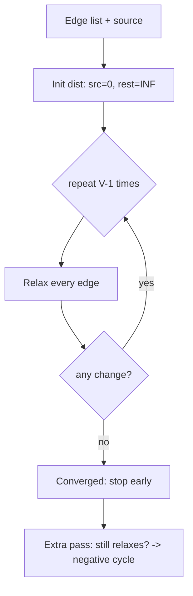

# Bellman-Ford Algorithm — Junior Level

> **One-line summary:** Bellman-Ford computes single-source shortest paths in a weighted graph that may contain **negative edge weights**. It relaxes all `E` edges `V-1` times in `O(VE)`, and a single extra relaxation round detects (and lets you locate) a **negative cycle**.

---

## Table of Contents

1. [Introduction](#introduction)
2. [Prerequisites](#prerequisites)
3. [Glossary](#glossary)
4. [Core Concepts](#core-concepts)
5. [Big-O Summary](#big-o-summary)
6. [Real-World Analogies](#real-world-analogies)
7. [Pros & Cons](#pros--cons)
8. [Step-by-Step Walkthrough](#step-by-step-walkthrough)
9. [Code Examples](#code-examples)
10. [Coding Patterns](#coding-patterns)
11. [Error Handling](#error-handling)
12. [Performance Tips](#performance-tips)
13. [Best Practices](#best-practices)
14. [Edge Cases & Pitfalls](#edge-cases--pitfalls)
15. [Common Mistakes](#common-mistakes)
16. [Cheat Sheet](#cheat-sheet)
17. [Visual Animation](#visual-animation)
18. [Summary](#summary)
19. [Further Reading](#further-reading)

---

## Introduction

The **Bellman-Ford algorithm** answers a deceptively simple question: *what is the cheapest way to get from one starting vertex to every other vertex in a weighted graph?* That is the **single-source shortest path (SSSP)** problem.

You may already know **Dijkstra's algorithm** for the same problem. Dijkstra is faster — but it has one hard requirement: **every edge weight must be non-negative**. The moment a single edge can be negative, Dijkstra's greedy "settle the closest vertex and never revisit it" logic breaks. Bellman-Ford is the algorithm you reach for when negative weights are on the table.

The algorithm was published independently by **Richard Bellman (1958)** and **Lester Ford Jr. (1956)** (with **Edward Moore** contributing the queue-based variant, so it is sometimes called *Bellman-Ford-Moore*). Its central idea is one tiny operation repeated patiently:

1. **Relaxation** — for an edge `u → v` with weight `w`, if `dist[u] + w < dist[v]`, then we found a cheaper route to `v`, so set `dist[v] = dist[u] + w`.
2. **Repeat `V-1` times** — relaxing *all* edges once propagates correct distances one "hop" further. After `V-1` full passes, every shortest path (which uses at most `V-1` edges) is correct.
3. **One more pass = a detector** — if a `V`-th pass *still* improves some distance, a shortest path of unbounded negativity exists: there is a **negative cycle** reachable from the source.

That is the whole algorithm. It is slower than Dijkstra (`O(VE)` vs `O(E log V)`), but it is strictly more powerful: it handles negatives, and it is the *only* one of the two that can tell you "your graph has a negative cycle." That second property makes it the engine behind **currency-arbitrage detection** and **difference-constraint solving**, two applications we will return to throughout this file.

---

## Prerequisites

Before reading this file you should be comfortable with:

- **Graphs** — vertices, edges, directed vs undirected, weighted edges.
- **An edge list or adjacency list** — Bellman-Ford works most naturally on a flat list of edges `(u, v, w)`.
- **Arrays and indexing** — `dist[]` and `pred[]` are plain arrays indexed by vertex id.
- **Loops** — the core is two nested loops: "repeat `V-1` times { for each edge … }".
- **Big-O notation** — `O(VE)`, `O(V+E)`.
- **The idea of infinity as a sentinel** — unreached vertices start at `+∞`.

Optional but helpful:

- A look at **Dijkstra's algorithm** (sibling topic `04-dijkstra`) — Bellman-Ford is best understood as "the algorithm that does what Dijkstra cannot."
- Familiarity with **BFS** for unweighted shortest paths — relaxation generalizes BFS's "distance + 1."

---

## Glossary

| Term | Meaning |
|------|---------|
| **Single-source shortest path (SSSP)** | Shortest distance from one source vertex to every other vertex. |
| **Edge weight** | Cost of traversing an edge; in Bellman-Ford it **may be negative**. |
| **Relaxation** | The update `if dist[u] + w < dist[v] then dist[v] = dist[u] + w`. |
| **`dist[v]`** | Best known distance from source to `v` so far; starts at `+∞` (0 for the source). |
| **`pred[v]` (predecessor / parent)** | The vertex just before `v` on the current best path; used to reconstruct paths. |
| **Round / pass / iteration** | One sweep that relaxes **every** edge once. |
| **Negative cycle** | A cycle whose edge weights sum to a negative number. Looping it lowers cost without bound. |
| **Reachable** | A vertex is reachable if some path from the source leads to it (its `dist` is finite). |
| **Convergence** | The state where a full pass changes no distance — shortest paths are final. |
| **SPFA** | *Shortest Path Faster Algorithm* — a queue-based Bellman-Ford that only re-relaxes "active" vertices. |
| **DAG** | Directed Acyclic Graph — a graph with no cycles; shortest paths there are linear-time. |

---

## Core Concepts

### 1. Edge Relaxation

Relaxation is the atom of the algorithm. Given a directed edge `u → v` with weight `w`:

```
relax(u, v, w):
    if dist[u] != INF and dist[u] + w < dist[v]:
        dist[v] = dist[u] + w
        pred[v] = u
```

The guard `dist[u] != INF` matters: if `u` has not been reached yet, `dist[u]` is `+∞` and you must **not** add `w` to it (it would either stay infinite or, with a real "large number" sentinel, **overflow** — see Pitfalls).

Relaxing an edge can only ever *lower* a distance, never raise it. So distances march monotonically downward toward their true values.

### 2. Why `V-1` Rounds

A shortest path in a graph with `V` vertices visits at most `V` vertices, so it uses at most `V-1` edges (any more would repeat a vertex, i.e. contain a cycle, and removing a non-negative cycle never hurts).

**Key fact:** after round `k`, every vertex whose shortest path uses **at most `k` edges** has its final, correct `dist`. One full pass over all edges guarantees that *if* `dist[u]` was already correct, then `dist[v]` becomes correct for any edge `u → v` on a shortest path. So distances "spread" one edge per round. After `V-1` rounds, all shortest paths (≤ `V-1` edges) are settled.

```
              round 1            round 2            round 3
source → a    a settled         b settled          c settled
       (1 edge)           (2 edges)          (3 edges)
```

### 3. Negative-Cycle Detection

After `V-1` rounds, if the graph has **no** negative cycle reachable from the source, no edge can be relaxed any further — the distances are final.

So we run **one extra round** (the `V`-th). If *any* edge `u → v` still satisfies `dist[u] + w < dist[v]`, that improvement could not have come from a longer simple path (those are already done). It can only come from a cycle that keeps lowering the cost: a **negative cycle**. Detecting one is a one-line check; *locating* the actual cycle takes a little more work (follow `pred` pointers — shown in [`middle.md`](./middle.md)).

### 4. Why Dijkstra Fails With Negatives

Dijkstra picks the unvisited vertex with the smallest `dist`, declares it "settled," and never touches it again. That greedy commitment is correct only if no future path can be cheaper — which holds when all weights are `≥ 0`. With a negative edge, a vertex you already settled might later be reachable more cheaply through a negative edge you have not explored yet. Dijkstra never revisits it, so it returns a wrong answer. Bellman-Ford makes no "settled forever" claim: it keeps relaxing every edge, so a late discount still propagates.

### 5. Early Termination

If during some round **no** edge is relaxed, the distances have converged — you can stop immediately, even before round `V-1`. On easy graphs this turns the worst-case `O(VE)` into something far cheaper. It is a one-flag optimization (`changed = false` at the top of each round) and you should always include it.

---

## Big-O Summary

| Aspect | Cost | Notes |
|--------|------|-------|
| Time (standard) | **O(V · E)** | `V-1` rounds, each relaxing all `E` edges. |
| Time (with early stop) | O(k · E), `k ≤ V` | `k` = number of rounds until convergence. |
| Negative-cycle detection | O(E) extra | One more pass after the `V-1` rounds. |
| DAG special case (topological order) | **O(V + E)** | Linear; relax in topo order, one pass. |
| Space | **O(V + E)** | `dist[]`, `pred[]` (`O(V)`) + the edge list (`O(E)`). |
| Path reconstruction | O(V) | Walk `pred[]` from target back to source. |

For comparison: Dijkstra with a binary heap is `O((V + E) log V)` but **cannot** handle negative weights. On dense graphs (`E ≈ V²`) Bellman-Ford is `O(V³)`.

---

## Real-World Analogies

| Concept | Analogy |
|---------|---------|
| Negative edges | **Currency exchange.** Take the negative logarithm of each exchange rate as the edge weight. A path's total weight is the negative log of the product of rates, so the *shortest* path is the *best* sequence of conversions. |
| Negative cycle | **Arbitrage.** A cycle of trades — USD → EUR → JPY → USD — that ends with more money than you started. In weight terms, the cycle sums to a negative number, and Bellman-Ford flags it. |
| Relaxing all edges each round | A rumor spreading through a town: each day everyone tells all their neighbors the cheapest deal they have heard. After enough days, everyone knows the truly cheapest deal. |
| `V-1` rounds | The rumor can travel at most one extra person per day, and the longest "rumor chain" without repeating a person is `V-1` hops. |
| The extra detection round | If on a "quiet" day someone *still* hears a cheaper deal, there must be a loop of trades that keeps getting cheaper forever — too good to be true, i.e. arbitrage. |

Where the analogy breaks: rumors do not overflow to negative infinity, but a real negative cycle in a computer keeps subtracting until your integer wraps around. The algorithm stops that by detecting the cycle instead of looping it.

---

## Pros & Cons

| Pros | Cons |
|------|------|
| Handles **negative edge weights** (Dijkstra cannot). | `O(VE)` — slower than Dijkstra's `O(E log V)` on graphs with no negatives. |
| **Detects negative cycles** — uniquely useful for arbitrage and constraint feasibility. | Naive version always does `V-1` full passes unless you add early termination. |
| Dead simple: ~15 lines, just an edge list and two arrays. | Sensitive to `INF` overflow when relaxing from unreachable vertices. |
| Works on any edge representation; no priority queue needed. | Not the right tool when all weights are non-negative — use Dijkstra. |
| Naturally **distributed** — each vertex only needs its neighbors' distances (basis of RIP routing). | The SPFA speed-up has an `O(VE)` worst case that adversarial graphs can trigger. |
| The inner engine of **Johnson's all-pairs** algorithm and **min-cost max-flow**. | Reconstructing a *located* negative cycle takes extra bookkeeping. |

**When to use:** any edge weight can be negative; you must detect negative cycles; currency arbitrage; difference-constraint systems; distance-vector routing; as a subroutine inside Johnson's or min-cost-flow.

**When NOT to use:** all weights `≥ 0` (use Dijkstra); the graph is a DAG (use topological-order relaxation, `O(V+E)`); the graph is unweighted (use BFS).

---

## Step-by-Step Walkthrough

Consider this directed graph with a **negative edge** `B → C = -2`. Source is `A` (vertex 0). Vertices: `A=0, B=1, C=2, D=3`.

```
Edges:
  A → B : 4
  A → C : 5
  B → C : -2
  C → D : 3
  B → D : 6
```

Initialize: `dist = [0, ∞, ∞, ∞]`, source `A = 0`.

**Round 1** (relax all edges in listed order):

```
A→B (4):  dist[B] = 0 + 4 = 4        dist = [0, 4, ∞, ∞]
A→C (5):  dist[C] = 0 + 5 = 5        dist = [0, 4, 5, ∞]
B→C (-2): 4 + (-2) = 2 < 5  → update dist[C] = 2   dist = [0, 4, 2, ∞]
C→D (3):  2 + 3 = 5                  dist = [0, 4, 2, 5]
B→D (6):  4 + 6 = 10 ≥ 5  → no change
```

Notice the greedy mistake Dijkstra would make: it would settle `C` at 5 via `A→C` and never reconsider it. Bellman-Ford *did* reconsider and found the cheaper `A→B→C = 2`.

**Round 2** (relax all edges again):

```
A→B (4):  no change
A→C (5):  no change (2 < 5)
B→C (-2): 4 + (-2) = 2, equal → no change
C→D (3):  2 + 3 = 5, equal → no change
B→D (6):  no change
```

No edge changed → **converged**. With early termination we stop here. Final:

```
dist = [0, 4, 2, 5]
A→A = 0,  A→B = 4,  A→C = 2 (via B),  A→D = 5 (via B,C)
```

**Detection round** (only to illustrate): we would run one more pass; since nothing relaxes, **no negative cycle**. If instead we had added an edge `C → B = -3`, then `B`, `C`, `D` would keep dropping every round and the `V`-th pass would still relax — flagging the negative cycle `B → C → B` (weight `-2 + -3 = -5`).

---

## Code Examples

### Example: Bellman-Ford with negative-cycle detection

The functions return the distance array, plus a boolean for "negative cycle reachable from source."

#### Go

```go
package main

import "fmt"

const INF = int(1e18)

type Edge struct {
	From, To, W int
}

// BellmanFord returns dist[] and whether a negative cycle is reachable from src.
func BellmanFord(n int, edges []Edge, src int) ([]int, bool) {
	dist := make([]int, n)
	for i := range dist {
		dist[i] = INF
	}
	dist[src] = 0

	// V-1 rounds, with early termination.
	for round := 0; round < n-1; round++ {
		changed := false
		for _, e := range edges {
			if dist[e.From] != INF && dist[e.From]+e.W < dist[e.To] {
				dist[e.To] = dist[e.From] + e.W
				changed = true
			}
		}
		if !changed {
			break // converged early
		}
	}

	// One extra pass: any relaxation means a negative cycle.
	negCycle := false
	for _, e := range edges {
		if dist[e.From] != INF && dist[e.From]+e.W < dist[e.To] {
			negCycle = true
			break
		}
	}
	return dist, negCycle
}

func main() {
	edges := []Edge{
		{0, 1, 4}, {0, 2, 5}, {1, 2, -2}, {2, 3, 3}, {1, 3, 6},
	}
	dist, neg := BellmanFord(4, edges, 0)
	fmt.Println("negative cycle:", neg)
	for v, d := range dist {
		if d == INF {
			fmt.Printf("A->%d = INF\n", v)
		} else {
			fmt.Printf("A->%d = %d\n", v, d)
		}
	}
	// A->0=0  A->1=4  A->2=2  A->3=5   negative cycle: false
}
```

#### Java

```java
import java.util.*;

public class BellmanFord {
    static final long INF = Long.MAX_VALUE / 4; // headroom to avoid overflow

    record Edge(int from, int to, long w) {}

    // Returns dist[]; negCycle[0] is set true if a negative cycle is reachable.
    static long[] bellmanFord(int n, List<Edge> edges, int src, boolean[] negCycle) {
        long[] dist = new long[n];
        Arrays.fill(dist, INF);
        dist[src] = 0;

        for (int round = 0; round < n - 1; round++) {
            boolean changed = false;
            for (Edge e : edges) {
                if (dist[e.from()] != INF && dist[e.from()] + e.w() < dist[e.to()]) {
                    dist[e.to()] = dist[e.from()] + e.w();
                    changed = true;
                }
            }
            if (!changed) break; // converged early
        }

        negCycle[0] = false;
        for (Edge e : edges) {
            if (dist[e.from()] != INF && dist[e.from()] + e.w() < dist[e.to()]) {
                negCycle[0] = true;
                break;
            }
        }
        return dist;
    }

    public static void main(String[] args) {
        List<Edge> edges = List.of(
            new Edge(0, 1, 4), new Edge(0, 2, 5), new Edge(1, 2, -2),
            new Edge(2, 3, 3), new Edge(1, 3, 6));
        boolean[] neg = new boolean[1];
        long[] dist = bellmanFord(4, edges, 0, neg);
        System.out.println("negative cycle: " + neg[0]);
        for (int v = 0; v < dist.length; v++) {
            System.out.printf("A->%d = %s%n", v, dist[v] == INF ? "INF" : dist[v]);
        }
    }
}
```

#### Python

```python
INF = float("inf")


def bellman_ford(n, edges, src):
    """edges: list of (u, v, w). Returns (dist, has_negative_cycle)."""
    dist = [INF] * n
    dist[src] = 0

    for _ in range(n - 1):
        changed = False
        for u, v, w in edges:
            if dist[u] != INF and dist[u] + w < dist[v]:
                dist[v] = dist[u] + w
                changed = True
        if not changed:
            break  # converged early

    neg_cycle = False
    for u, v, w in edges:
        if dist[u] != INF and dist[u] + w < dist[v]:
            neg_cycle = True
            break
    return dist, neg_cycle


if __name__ == "__main__":
    edges = [(0, 1, 4), (0, 2, 5), (1, 2, -2), (2, 3, 3), (1, 3, 6)]
    dist, neg = bellman_ford(4, edges, 0)
    print("negative cycle:", neg)
    for v, d in enumerate(dist):
        print(f"A->{v} =", "INF" if d == INF else d)
```

**What it does:** builds the example graph, computes shortest paths from `A`, and reports no negative cycle.
**Run:** `go run main.go` | `javac BellmanFord.java && java BellmanFord` | `python bellman_ford.py`

---

## Coding Patterns

### Pattern 1: Reconstruct the Path with `pred[]`

**Intent:** know not just the distance but the actual route. Keep a `pred[]` array; set `pred[v] = u` whenever you relax `u → v`. Then walk backward from the target.

```python
def reconstruct(pred, src, target):
    path = []
    v = target
    while v != -1:
        path.append(v)
        if v == src:
            break
        v = pred[v]
    path.reverse()
    return path if path and path[0] == src else None
```

### Pattern 2: Early Termination Flag

**Intent:** stop as soon as a round makes no change. Always include the `changed` flag shown in the code above — it costs one boolean and can be the difference between `O(VE)` and `O(E)`.

### Pattern 3: Currency Arbitrage via `-log(rate)`

**Intent:** detect a profitable trading cycle. Build an edge `u → v` with weight `-log(rate[u][v])`. A product of rates `> 1` around a cycle corresponds to a **negative** sum of weights — exactly a negative cycle Bellman-Ford detects.

```python
import math

def has_arbitrage(rates):           # rates[i][j] = units of j per unit of i
    n = len(rates)
    edges = [(i, j, -math.log(rates[i][j]))
             for i in range(n) for j in range(n) if i != j]
    dist = [0.0] * n                # all sources at once: 0 everywhere
    for _ in range(n - 1):
        for u, v, w in edges:
            if dist[u] + w < dist[v] - 1e-12:
                dist[v] = dist[u] + w
    for u, v, w in edges:           # detection pass
        if dist[u] + w < dist[v] - 1e-12:
            return True
    return False
```



---

## Error Handling

| Error | Cause | Fix |
|-------|-------|-----|
| Wrong distances, some hugely negative | Relaxed from an unreachable vertex (`dist[u] == INF`) | Guard every relaxation with `dist[u] != INF`. |
| Integer overflow / wraparound | Adding `w` to a large `INF` sentinel | Use a sentinel with headroom (`MAX/4`), or skip when `dist[u]==INF`. |
| "Negative cycle" reported but there is none | Floating-point rounding in arbitrage edges | Compare with an epsilon: `dist[u]+w < dist[v] - 1e-12`. |
| Misses a real negative cycle | Cycle not reachable from the source | Add a virtual super-source with 0-weight edges to all vertices, or init all `dist` to 0. |
| Off-by-one: too few/many rounds | Looping `V` times or `V-2` times | Exactly `V-1` relaxation rounds, then `1` detection round. |
| Path reconstruction loops forever | `pred` forms a cycle (negative cycle present) | Detect the cycle first; only reconstruct paths when `negCycle` is false. |

---

## Performance Tips

- **Always add early termination.** The `changed` flag is free and often huge.
- **Use a flat edge list**, not a fancy structure — the inner loop should be a tight scan over `(u, v, w)` triples.
- **Order edges by BFS layer from the source** when you can; distances then propagate in fewer rounds.
- **Prefer SPFA** (queue of "active" vertices, see [`middle.md`](./middle.md)) on sparse graphs — it skips edges whose source did not change.
- **Use 64-bit integers** for distances when weights are large; the sum of `V-1` edges can be big.
- **If the graph is a DAG**, skip Bellman-Ford entirely and relax in topological order (`O(V+E)`) — forward-reference sibling `07-topological-sort`.

---

## Best Practices

- Write a brute-force baseline (e.g. Floyd-Warshall on a tiny graph, or "try all simple paths") and cross-check on random small graphs.
- Decide and **document** whether you detect negative cycles *reachable from the source* or *anywhere* in the graph; they are different and people confuse them.
- Keep `pred[]` updated during relaxation so path reconstruction is free.
- Use a named `INF` constant with headroom, never a bare `0x7FFFFFFF` that overflows on the first addition.
- Separate the two phases clearly in code: `V-1` relaxation rounds, then `1` detection round.

---

## Edge Cases & Pitfalls

- **Unreachable vertices** — must stay `INF`; never relax through them. This is the single most common bug.
- **Source with no outgoing edges** — `dist[src]=0`, everyone else `INF`; the algorithm still terminates correctly.
- **Self-loops** — an edge `v → v` with negative weight *is* a negative cycle of length 1; the detection pass catches it.
- **Zero-weight cycle** — not a negative cycle; it never relaxes after convergence, so it is correctly ignored.
- **Negative cycle not reachable from the source** — standard Bellman-Ford will **not** flag it; use a super-source if you must detect any cycle.
- **Single vertex** — `V-1 = 0` rounds; `dist=[0]`; trivially correct.
- **Parallel edges** — fine; relaxation simply keeps the cheapest.

---

## Common Mistakes

1. **Forgetting the `dist[u] != INF` guard** — leads to overflow and bogus huge-negative distances.
2. **Running `V` relaxation rounds instead of `V-1`** — harmless to correctness but blurs the line with detection; or running `V-2` and missing the last layer.
3. **Using a small `INF`** like `Integer.MAX_VALUE` and then doing `INF + w`, which overflows to a negative number that looks like a great path.
4. **Confusing "negative cycle anywhere" with "reachable from source."** Plain Bellman-Ford only sees what the source can reach.
5. **Reconstructing a path when a negative cycle exists** — `pred` may loop; guard with the detection result.
6. **Treating equal-cost updates as changes** — use strict `<`, not `<=`, or the algorithm never converges and early termination never fires.

---

## Cheat Sheet

| Item | Value |
|------|-------|
| Problem | Single-source shortest paths with possible negative weights |
| Time | `O(V·E)` (worst), `O(k·E)` with early stop |
| Space | `O(V + E)` |
| Relaxation rounds | `V - 1` |
| Detection rounds | `1` more (relaxes ⇒ negative cycle) |
| DAG special case | topological order, `O(V + E)` |
| Beats Dijkstra when | edges can be negative / need cycle detection |

```
init:    dist[src]=0, others=INF
relax:   if dist[u]!=INF and dist[u]+w<dist[v]: dist[v]=dist[u]+w; pred[v]=u
repeat:  V-1 rounds (stop early if a round makes no change)
detect:  one more round; any relaxation => negative cycle
```

---

## Visual Animation

> See [`animation.html`](./animation.html) for an interactive visualization of Bellman-Ford.
>
> The animation demonstrates:
> - The edge list and the `dist[]` array side by side
> - Each round relaxing every edge, with the active edge highlighted
> - Distances dropping as cheaper paths are discovered
> - The early-termination flag firing when a round changes nothing
> - A negative-cycle graph where distances never stabilize and the cycle is flagged
> - Step / Run / Reset controls

---

## Summary

Bellman-Ford is the shortest-path algorithm you use when edge weights can be negative. Its whole machinery is one operation — **relaxation** — applied to **every edge**, **`V-1` times**, after which one extra pass acts as a **negative-cycle detector**. It is slower than Dijkstra but strictly more capable, and its simplicity (an edge list and two arrays) makes it the natural inner engine for currency-arbitrage detection, difference-constraint solving, distance-vector routing, and larger algorithms like Johnson's and min-cost flow. Master relaxation and the `V-1` reasoning, and you have mastered the algorithm.

---

## Further Reading

- *Introduction to Algorithms* (CLRS), Chapter 24 — "Single-Source Shortest Paths," §24.1 Bellman-Ford.
- Bellman, R. (1958). "On a Routing Problem," *Quarterly of Applied Mathematics*.
- Ford, L. R. (1956). "Network Flow Theory," RAND report.
- cp-algorithms.com — "Bellman-Ford" and "Finding a negative cycle in the graph."
- Sedgewick & Wayne, *Algorithms* (4th ed.) — Bellman-Ford and arbitrage detection.
- Sibling topic `04-dijkstra` — the non-negative-weight counterpart.
