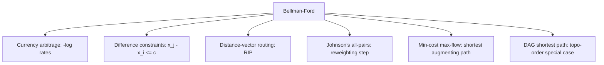

# Bellman-Ford Algorithm — Middle Level

> **Focus:** *why* `V-1` rounds are exactly right, how to extract (not just detect) a negative cycle, the SPFA queue optimization, and how Bellman-Ford composes with DAG relaxation, Johnson's all-pairs, and difference-constraint systems.

---

## Table of Contents

1. [Introduction](#introduction)
2. [Deeper Concepts](#deeper-concepts)
3. [Comparison with Alternatives](#comparison-with-alternatives)
4. [Advanced Patterns](#advanced-patterns)
5. [Graph and Tree Applications](#graph-and-tree-applications)
6. [Algorithmic Integration](#algorithmic-integration)
7. [Code Examples](#code-examples)
8. [Error Handling](#error-handling)
9. [Performance Analysis](#performance-analysis)
10. [Best Practices](#best-practices)
11. [Visual Animation](#visual-animation)
12. [Summary](#summary)

---

## Introduction

At junior level Bellman-Ford is "relax all edges `V-1` times, then check once more." At middle level you start asking the questions that decide whether your code is correct and fast:

- *Why* is `V-1` the exact count — not `V`, not `log V`?
- How do I turn "a negative cycle exists" into "here are its vertices"?
- The naive version re-relaxes edges whose source did not change — can I avoid that? (SPFA.)
- When is the DAG special case applicable, and why is it linear?
- Where does Bellman-Ford sit inside bigger machinery — Johnson's, min-cost flow, scheduling under constraints?

These are not academic. The difference between a textbook `O(VE)` loop and an SPFA with a clean negative-cycle extractor is the difference between a solution that times out and one that solves a real routing or arbitrage problem.

---

## Deeper Concepts

### Why exactly `V-1` rounds suffice

**Claim.** After `k` rounds of relaxing *all* edges, `dist[v]` equals the length of the shortest path from `src` to `v` that uses **at most `k` edges**.

**Proof by induction on `k`.**

- *Base (`k = 0`).* Before any relaxation, `dist[src] = 0` (the empty path, 0 edges) and `dist[v] = ∞` for `v ≠ src` (no 0-edge path exists). True.
- *Step.* Assume after round `k`, `dist[v]` is the best path using `≤ k` edges. Consider any shortest path to `v` using `≤ k+1` edges; let its last edge be `u → v`. Its prefix to `u` uses `≤ k` edges, so by hypothesis `dist[u]` was correct *before* round `k+1`. During round `k+1` we relax `u → v`, so `dist[v] ≤ dist[u] + w(u,v)` = the path's length. Relaxation never overshoots, so `dist[v]` becomes exactly the `≤ k+1`-edge optimum. ∎

If there is **no negative cycle**, every shortest path is *simple* (no repeated vertices), hence uses at most `V-1` edges. So after `V-1` rounds, all `dist[v]` are final. That is the tight bound: a path that needs exactly `V-1` edges (a Hamiltonian-like chain) would not be finalized until round `V-1`.

### The negative-cycle math

If a path could be made arbitrarily short, it must traverse a cycle whose total weight is negative — go around it again and the cost drops again. Formally, the shortest-path value to a vertex on such a cycle is `-∞`. Bellman-Ford cannot represent `-∞`, so instead it *detects* the situation: after `V-1` rounds a graph with no reachable negative cycle is fully converged, so **any** further relaxation in round `V` is a certificate of a negative cycle.

**Locating the cycle.** When round `V` relaxes edge `u → v`, vertex `v` lies on or downstream of a negative cycle. Follow `pred` pointers `V` times starting from `v` — this is guaranteed to land you *inside* the cycle (because you stepped back more times than the longest simple path). From that vertex, walk `pred` until you return to it; that closed walk is the negative cycle.

### Why early termination is correct

Relaxation is monotone (distances only decrease) and bounded below (by the true shortest-path values, when no negative cycle exists). If a full round changes nothing, no edge `u → v` has `dist[u] + w < dist[v]`, which is exactly the fixpoint condition: all distances are final. So stopping is safe — and you can stop at round `k < V-1`.

---

## Comparison with Alternatives

| Attribute | Bellman-Ford | Dijkstra | DAG relax (topo order) | Floyd-Warshall |
|-----------|--------------|----------|------------------------|----------------|
| Problem | SSSP | SSSP | SSSP | All-pairs |
| Negative weights | **Yes** | No | **Yes** | **Yes** |
| Negative cycle | **Detects** | n/a | n/a (DAG has none) | **Detects** (negative diagonal) |
| Requires | edge list | non-neg weights + PQ | acyclic + topo sort | adjacency matrix |
| Time | `O(VE)` | `O(E log V)` | `O(V + E)` | `O(V³)` |
| Space | `O(V+E)` | `O(V+E)` | `O(V+E)` | `O(V²)` |
| Best when | negatives, sparse | non-neg, sparse | acyclic | dense, all-pairs |

**Choose Bellman-Ford when:** edges may be negative, the graph has cycles, and you need single-source distances or cycle detection.

**Choose Dijkstra when:** all weights `≥ 0` — it is asymptotically faster.

**Choose DAG relaxation when:** the graph is acyclic — one topological pass beats `V-1` rounds (see `07-topological-sort`).

**Choose Floyd-Warshall when:** you need *all-pairs* distances on a small/dense graph and `V³` is acceptable.

---

## Advanced Patterns

### Pattern: SPFA (Shortest Path Faster Algorithm)

Naive Bellman-Ford re-relaxes every edge each round, even edges whose source `dist` did not change — wasted work. **SPFA** (Moore's queue variant, popularized under this name in competitive programming) keeps a queue of "active" vertices whose distance just improved. Only their outgoing edges are relaxed. A vertex is enqueued at most once at a time (track an `inQueue` flag).

On random/sparse graphs SPFA is dramatically faster — often close to `O(E)`. **Caveat:** its worst case is still `O(VE)`, and adversarial graphs (grid-like, specific negative structures) reliably hit it. Never rely on SPFA for guaranteed performance; relying on it has cost contestants and engineers real failures.

**Negative-cycle detection in SPFA:** count how many times each vertex is dequeued (relaxed-from). If any vertex is processed `≥ V` times, a negative cycle is reachable.

### Pattern: Negative-Cycle Extraction

Detection answers yes/no; extraction returns the actual vertices. After `V-1` rounds, do one more pass; if edge `u → v` relaxes, set `x = v`, step `pred` `V` times to guarantee landing on the cycle, then collect the cycle by following `pred` until repetition.

### Pattern: Difference Constraints

A system of constraints of the form `x_j - x_i ≤ c` can be solved with Bellman-Ford. Model each constraint as an edge `i → j` with weight `c`. Add a super-source `s` with 0-weight edges to all variables. Run Bellman-Ford from `s`: `x_i = dist[i]` is a feasible assignment. If a negative cycle exists, the system is **infeasible**. This is how schedulers and timing-analysis tools check feasibility — covered more in [`senior.md`](./senior.md) and [`professional.md`](./professional.md).

### Pattern: Early Stop + Round Counter

Combine the `changed` flag with a round counter; if you ever reach round `V` and still changed, you have a negative cycle without a separate detection pass.

---

## Graph and Tree Applications



### Arbitrage detection (worked)

Build a complete digraph over currencies with edge weight `w(i→j) = -log(rate[i][j])`. A cycle with product of rates `> 1` becomes a sum of weights `< 0`. Initialize all `dist = 0` (so every currency is a potential start), run `V-1` rounds, then one detection round. Any relaxation ⇒ arbitrage exists; extract the cycle to print the trade sequence.

### Johnson's all-pairs preview

Johnson's algorithm computes all-pairs shortest paths on a sparse graph with negative edges in `O(VE + V·E log V)`. The trick: add a super-source, run **Bellman-Ford** once to get a potential `h[v]`, reweight every edge to `w'(u,v) = w(u,v) + h[u] - h[v]` (now all `≥ 0`), then run **Dijkstra** from each vertex. Bellman-Ford is the negative-handling front end; Dijkstra is the fast back end. (See sibling `18` for min-cost flow, which reuses this reweighting idea.)

---

## Algorithmic Integration

- **Min-cost max-flow** uses Bellman-Ford (or SPFA) to find a shortest-cost augmenting path when residual edges can have negative cost; Johnson-style potentials then switch to Dijkstra for speed. Forward-reference sibling `18-min-cost-max-flow`.
- **Constraint scheduling** (PERT/CPM with deadlines, register allocation timing) reduces to difference constraints solved by Bellman-Ford.
- **Distance-vector routing** (RIP) is essentially distributed Bellman-Ford running continuously across routers — see [`senior.md`](./senior.md).

---

## Code Examples

### SPFA with negative-cycle detection and cycle extraction

#### Go

```go
package main

import "fmt"

const INF = int(1e18)

type Edge struct{ To, W int }

// SPFA returns dist[], and (negCycleVertex, true) if a negative cycle is reachable.
func SPFA(n int, adj [][]Edge, src int) ([]int, int, bool) {
	dist := make([]int, n)
	pred := make([]int, n)
	cnt := make([]int, n) // times each vertex was relaxed-into
	inQ := make([]bool, n)
	for i := range dist {
		dist[i] = INF
		pred[i] = -1
	}
	dist[src] = 0

	queue := []int{src}
	inQ[src] = true
	for len(queue) > 0 {
		u := queue[0]
		queue = queue[1:]
		inQ[u] = false
		for _, e := range adj[u] {
			if dist[u]+e.W < dist[e.To] {
				dist[e.To] = dist[u] + e.W
				pred[e.To] = u
				cnt[e.To]++
				if cnt[e.To] >= n { // relaxed n times => negative cycle
					return dist, e.To, true
				}
				if !inQ[e.To] {
					queue = append(queue, e.To)
					inQ[e.To] = true
				}
			}
		}
	}
	return dist, -1, false
}

func main() {
	adj := make([][]Edge, 4)
	adj[0] = []Edge{{1, 4}, {2, 5}}
	adj[1] = []Edge{{2, -2}, {3, 6}}
	adj[2] = []Edge{{3, 3}}
	dist, _, neg := SPFA(4, adj, 0)
	fmt.Println("negCycle:", neg, "dist:", dist) // dist: [0 4 2 5]
}
```

#### Java

```java
import java.util.*;

public class Spfa {
    static final long INF = Long.MAX_VALUE / 4;

    record E(int to, long w) {}

    // Returns dist[]; sets cycleVertex[0] >= 0 if a negative cycle is reachable.
    static long[] spfa(int n, List<E>[] adj, int src, int[] cycleVertex) {
        long[] dist = new long[n];
        int[] pred = new int[n], cnt = new int[n];
        boolean[] inQ = new boolean[n];
        Arrays.fill(dist, INF);
        Arrays.fill(pred, -1);
        dist[src] = 0;

        Deque<Integer> q = new ArrayDeque<>();
        q.add(src);
        inQ[src] = true;
        cycleVertex[0] = -1;

        while (!q.isEmpty()) {
            int u = q.poll();
            inQ[u] = false;
            for (E e : adj[u]) {
                if (dist[u] + e.w() < dist[e.to()]) {
                    dist[e.to()] = dist[u] + e.w();
                    pred[e.to()] = u;
                    if (++cnt[e.to()] >= n) { cycleVertex[0] = e.to(); return dist; }
                    if (!inQ[e.to()]) { q.add(e.to()); inQ[e.to()] = true; }
                }
            }
        }
        return dist;
    }

    public static void main(String[] args) {
        int n = 4;
        List<E>[] adj = new List[n];
        for (int i = 0; i < n; i++) adj[i] = new ArrayList<>();
        adj[0].add(new E(1, 4)); adj[0].add(new E(2, 5));
        adj[1].add(new E(2, -2)); adj[1].add(new E(3, 6));
        adj[2].add(new E(3, 3));
        int[] cyc = new int[1];
        long[] dist = spfa(n, adj, 0, cyc);
        System.out.println("negCycle: " + (cyc[0] >= 0) + " dist: " + Arrays.toString(dist));
    }
}
```

#### Python

```python
from collections import deque

INF = float("inf")


def spfa(n, adj, src):
    """adj[u] = list of (v, w). Returns (dist, pred, neg_cycle_vertex_or_-1)."""
    dist = [INF] * n
    pred = [-1] * n
    cnt = [0] * n
    in_q = [False] * n
    dist[src] = 0
    q = deque([src])
    in_q[src] = True

    while q:
        u = q.popleft()
        in_q[u] = False
        for v, w in adj[u]:
            if dist[u] + w < dist[v]:
                dist[v] = dist[u] + w
                pred[v] = u
                cnt[v] += 1
                if cnt[v] >= n:          # relaxed n times => negative cycle
                    return dist, pred, v
                if not in_q[v]:
                    q.append(v)
                    in_q[v] = True
    return dist, pred, -1


if __name__ == "__main__":
    adj = {0: [(1, 4), (2, 5)], 1: [(2, -2), (3, 6)], 2: [(3, 3)], 3: []}
    dist, pred, cyc = spfa(4, adj, 0)
    print("negCycle:", cyc != -1, "dist:", dist)  # dist: [0, 4, 2, 5]
```

### Negative-cycle extraction (classic Bellman-Ford)

#### Go

```go
// FindNegativeCycle returns the cycle vertices in order, or nil if none.
func FindNegativeCycle(n int, edges []Edge2) []int {
	dist := make([]int, n)
	pred := make([]int, n)
	for i := range pred {
		pred[i] = -1
	}
	var x int = -1
	for i := 0; i < n; i++ {
		x = -1
		for _, e := range edges {
			if dist[e.From]+e.W < dist[e.To] {
				dist[e.To] = dist[e.From] + e.W
				pred[e.To] = e.From
				x = e.To
			}
		}
	}
	if x == -1 {
		return nil // no negative cycle
	}
	for i := 0; i < n; i++ { // step back n times to land inside the cycle
		x = pred[x]
	}
	cycle := []int{x}
	for v := pred[x]; v != x; v = pred[v] {
		cycle = append(cycle, v)
	}
	cycle = append(cycle, x)
	// reverse for forward order
	for i, j := 0, len(cycle)-1; i < j; i, j = i+1, j-1 {
		cycle[i], cycle[j] = cycle[j], cycle[i]
	}
	return cycle
}

type Edge2 struct{ From, To, W int }
```

#### Java

```java
static List<Integer> findNegativeCycle(int n, int[][] edges) {
    long[] dist = new long[n];
    int[] pred = new int[n];
    Arrays.fill(pred, -1);
    int x = -1;
    for (int i = 0; i < n; i++) {
        x = -1;
        for (int[] e : edges) { // e = {from, to, w}; init dist=0 to find any cycle
            if (dist[e[0]] + e[2] < dist[e[1]]) {
                dist[e[1]] = dist[e[0]] + e[2];
                pred[e[1]] = e[0];
                x = e[1];
            }
        }
    }
    if (x == -1) return null;
    for (int i = 0; i < n; i++) x = pred[x]; // ensure x is on the cycle
    List<Integer> cycle = new ArrayList<>();
    int v = x;
    do { cycle.add(v); v = pred[v]; } while (v != x);
    cycle.add(x);
    Collections.reverse(cycle);
    return cycle;
}
```

#### Python

```python
def find_negative_cycle(n, edges):
    """edges: list of (u, v, w). dist starts at 0 to catch any reachable cycle."""
    dist = [0] * n
    pred = [-1] * n
    x = -1
    for _ in range(n):
        x = -1
        for u, v, w in edges:
            if dist[u] + w < dist[v]:
                dist[v] = dist[u] + w
                pred[v] = u
                x = v
    if x == -1:
        return None
    for _ in range(n):       # walk back n times to guarantee landing on the cycle
        x = pred[x]
    cycle = [x]
    v = pred[x]
    while v != x:
        cycle.append(v)
        v = pred[v]
    cycle.append(x)
    cycle.reverse()
    return cycle
```

---

## Error Handling

| Scenario | What goes wrong | Correct approach |
|----------|----------------|------------------|
| Cycle extraction returns a partial path, not a cycle | Did not step back `n` times before collecting | Step `pred` exactly `n` times so `x` is guaranteed inside the cycle. |
| SPFA never terminates | Negative cycle, no relaxation cap | Track per-vertex relax count; bail at `≥ V`. |
| Float arbitrage false positives | `-log` rounding | Compare with epsilon; or use rational/scaled-integer rates. |
| Difference system wrongly "infeasible" | Forgot super-source edges | Add `s → v` weight 0 for every variable `v`. |
| Distances overflow | Big `INF` + edge weight | Use `INF = MAX/4` and the `dist[u]!=INF` guard. |

---

## Performance Analysis

| Graph type | Naive Bellman-Ford | SPFA (typical) | SPFA (worst) |
|------------|--------------------|----------------|--------------|
| Sparse random, no neg cycle | `O(VE)` but early-stops fast | ≈ `O(E)`–`O(kE)`, small `k` | `O(VE)` |
| Dense (`E≈V²`) | `O(V³)` | often near `O(E)` | `O(V³)` |
| Adversarial (lattice/zigzag) | `O(VE)` | `O(VE)` (hits worst case) | `O(VE)` |
| DAG | use topo relax instead | n/a | n/a |

The practical lesson: SPFA wins on average but is **not** a guaranteed speedup. For worst-case guarantees, plain `O(VE)` Bellman-Ford with early termination is the safe default; for non-negative weights, switch to Dijkstra entirely.

#### Python (quick empirical check)

```python
import random, time

def make_graph(n, m):
    return [(random.randrange(n), random.randrange(n), random.randint(-5, 20))
            for _ in range(m)]

def bf(n, edges, src):
    dist = [float("inf")] * n; dist[src] = 0
    for _ in range(n - 1):
        changed = False
        for u, v, w in edges:
            if dist[u] != float("inf") and dist[u] + w < dist[v]:
                dist[v] = dist[u] + w; changed = True
        if not changed: break
    return dist

n, m = 2000, 8000
edges = make_graph(n, m)
t = time.time(); bf(n, edges, 0); print("BF:", round((time.time()-t)*1000, 1), "ms")
```

Typical result: early termination converges in far fewer than `V-1` rounds on random graphs, so wall-clock is a small multiple of `E`, not `V·E`.

---

## Best Practices

- **Default to plain Bellman-Ford with early termination** for correctness-critical code; reach for SPFA only when you have measured the need and accept the worst case.
- **Separate detection from extraction** — most code only needs the boolean; extract the cycle only when you must report it.
- **For arbitrage/floats**, prefer scaled integers or an explicit epsilon; never compare floats with bare `<`.
- **Use a super-source** when you need negative cycles *anywhere*, not just reachable from a given source.
- **When the graph is acyclic**, do not use Bellman-Ford at all — topological relaxation is linear.

---

## Visual Animation

> See [`animation.html`](./animation.html) for an interactive view.
>
> The middle-level animation highlights:
> - Per-round relaxation with the active edge and the changed `dist` cell flashing
> - The early-termination flag firing
> - A negative-cycle graph where the detection round still relaxes, with the cycle traced via `pred`

---

## Summary

Bellman-Ford's `V-1` rounds are exactly the longest possible simple-path length, which the induction makes precise: after `k` rounds you have all shortest paths of `≤ k` edges. One extra round is a negative-cycle certificate, and following `pred` `V` steps lets you *extract* the cycle, not just detect it. SPFA is the queue optimization that skips unchanged sources — fast on average, `O(VE)` in the worst case. Bellman-Ford composes outward: the DAG case collapses to a linear topological pass, and the algorithm is the negative-weight front end of Johnson's all-pairs and min-cost max-flow. The next files take this into distributed routing (RIP), formal proofs, and near-linear research frontiers.
