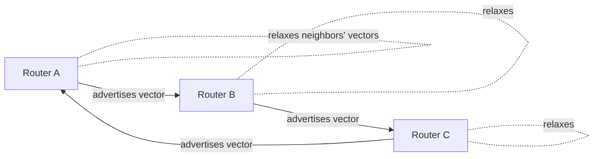

# Bellman-Ford Algorithm — Senior Level

> Bellman-Ford is unusual among textbook algorithms: it is **naturally distributed**. Each vertex needs only its neighbors' current distance estimates to make progress. That is exactly how distance-vector routing protocols (RIP, early IGRP) work — and it is also why their most famous failure, the **count-to-infinity problem**, is a distributed manifestation of Bellman-Ford's relaxation dynamics.

## Table of Contents
1. [Introduction](#1-introduction)
2. [System Design: Distance-Vector Routing](#2-system-design-distance-vector-routing)
3. [Distributed Bellman-Ford](#3-distributed-bellman-ford)
4. [Count-to-Infinity — Worked Trace](#4-count-to-infinity--worked-trace)
5. [Concurrency](#5-concurrency)
6. [Comparison at Scale](#6-comparison-at-scale)
7. [Architecture Patterns](#7-architecture-patterns)
8. [Code Examples](#8-code-examples)
9. [Observability](#9-observability)
10. [Failure Modes](#10-failure-modes)
11. [Capacity Planning](#11-capacity-planning)
12. [Operational Runbook](#12-operational-runbook)
13. [Summary](#13-summary)

---

## 1. Introduction

At senior level the question is not "how does relaxation work" but "where does Bellman-Ford live in a real system, and what breaks when it does." Two things make Bellman-Ford architecturally interesting:

1. **It is decentralizable.** Unlike Dijkstra (which needs a global priority queue and a global view), Bellman-Ford's relaxation is *local*: `dist[v] = min over in-edges (u→v) of dist[u] + w`. A node can compute this knowing only its neighbors. This is the theoretical basis of the **distance-vector** family of routing protocols.

2. **Its failure modes are the system's failure modes.** The negative-cycle problem, the slow-convergence problem, and the SPFA worst case all show up in production as routing loops, count-to-infinity, and CPU spikes.

This document treats Bellman-Ford as infrastructure: routing protocols, the distributed convergence story, concurrency, and the operational signals you wire up before it bites you.

---

## 2. System Design: Distance-Vector Routing

### 2.1 The mapping

In a distance-vector routing protocol (RIP being the canonical example):

- **Vertices** = routers.
- **Edges** = links, with a metric (hop count in RIP, capped at 15).
- **`dist[v]`** = a router's best known cost to reach destination `v`.
- **`pred[v]`** = the next hop (which neighbor to forward to).

Each router periodically tells its neighbors its entire distance vector ("I can reach X at cost 3, Y at cost 5"). A neighbor relaxes: "if I can reach you at cost 1 and you reach X at cost 3, I can reach X at cost 4." That is a Bellman-Ford relaxation, executed across the network, forever, asynchronously.



### 2.2 Why distance-vector at all

| Property | Distance-vector (Bellman-Ford) | Link-state (Dijkstra, OSPF) |
|----------|--------------------------------|------------------------------|
| Knowledge each node needs | only direct neighbors | full topology (flooded) |
| Message size | one vector per neighbor | full LSA database |
| Convergence | slower, can loop | faster, loop-free per-computation |
| CPU/memory per node | low | higher |
| Classic failure | count-to-infinity | flooding storms, large LSDB |

Distance-vector trades convergence speed and loop-freedom for simplicity and low per-node state. For small, slow-changing networks (RIP's design point), that was the right trade in the 1980s. Modern large networks use link-state (OSPF, IS-IS) or path-vector (BGP) precisely because Bellman-Ford's convergence weaknesses do not scale.

---

## 3. Distributed Bellman-Ford

### 3.1 Asynchronous relaxation

The distributed version drops the synchronized "rounds." Each node, whenever it receives an updated vector from a neighbor, recomputes its own and, if anything changed, advertises again. This **asynchronous Bellman-Ford** still converges to correct shortest paths if weights are non-negative and stable — but convergence time is bounded by the network diameter times the update interval, not by a neat `V-1`.

The correctness argument carries over from the synchronous proof through one key property: **relaxation is monotone and order-independent for the final value.** No matter the interleaving of message arrivals, each `dist[v]` only ever decreases and is bounded below by the true shortest-path value (when weights are non-negative and there is no negative cycle). A stale or delayed vector can only *postpone* an improvement, never produce a value below the optimum. So as long as messages are eventually delivered and topology eventually stops changing, every node converges to `δ(s, v)`. This is the same monotonicity that licenses the lock-free parallel batch version in [Section 5](#5-concurrency) — distributed asynchrony and shared-memory data races are two faces of the same tolerance for stale reads.

The catch is what happens *before* topology stabilizes: with a link removal the "bounded below by the true value" guarantee temporarily breaks, because the true value just jumped up while estimates are still anchored to the vanished path. That gap is exactly where count-to-infinity lives (next section).

### 3.2 The count-to-infinity problem

This is the defining failure of distributed Bellman-Ford. Suppose A—B—C is a line and the link to a destination D (attached at A) goes down.

- A now believes D is unreachable, but B still advertises "I can reach D at cost 2" (its stale route through A).
- A relaxes against B: "B reaches D at 2, so I reach D at 3 (via B)." But B's route *went through A* — a loop.
- A advertises 3, B updates to 4, A to 5, ... the metric **counts up to infinity**, one increment per exchange, until it hits RIP's cap of 16 ("unreachable").

The root cause: a node cannot tell that a neighbor's advertised route actually passes back through itself. In graph terms, the asynchronous relaxation is chasing a path that no longer exists, slowly.

### 3.3 Mitigations

| Technique | Idea | Limit |
|-----------|------|-------|
| **Max metric (16 = ∞)** | Cap the count so it terminates. | Slow; small network diameter only. |
| **Split horizon** | Do not advertise a route back to the neighbor you learned it from. | Breaks some multi-path loops, not all. |
| **Split horizon with poison reverse** | Advertise such routes with metric ∞ explicitly. | Larger messages; still imperfect for loops > 2 hops. |
| **Triggered updates** | Advertise immediately on change, not just on the timer. | Speeds convergence; can cause update bursts. |
| **Hold-down timers** | Ignore "better" news about a recently-down route for a while. | Adds latency to legitimate recovery. |

These are all engineering patches over Bellman-Ford's inability to see global structure locally. They are why distance-vector survives in RIP but lost to link-state and path-vector at scale.

---

## 4. Count-to-Infinity — Worked Trace

It is worth tracing count-to-infinity concretely, because the failure is subtle and the mitigations only make sense once you have seen the loop form.

### 4.1 Topology

A three-router line, with destination `D` directly attached to `A` at cost 1:

```text
   D
   | 1
   A ---- B ---- C
     1      1
```

### 4.2 Steady state (before the failure)

Each router has converged to the correct cost-to-`D` and next hop:

| Router | cost to D | next hop |
|--------|-----------|----------|
| A      | 1         | (direct) |
| B      | 2         | A        |
| C      | 3         | B        |

### 4.3 The link A–D fails

`A` detects `D` is gone and sets its cost to ∞. But `B` has not heard yet — its table still says "I reach D at cost 2 (via A)." Now the exchange begins. Without any mitigation the metrics crawl upward, each exchange adding the link cost:

```text
event                                 A.cost(D)   B.cost(D)   C.cost(D)
--------------------------------------------------------------------
link A-D down, A updates                  inf         2           3
A hears B's stale "2", relaxes via B        3         2           3
B hears A's "3", relaxes via A              3         4           3
A hears B's "4"                             5         4           3
B hears A's "5"                             5         6           5
...                                         ...       ...         ...
(continues until metric reaches 16 = inf)
```

`A` trusts `B`'s advertisement because nothing in a bare distance vector reveals that `B`'s route to `D` *goes back through `A`*. The two routers feed each other an ever-worsening estimate of a path that no longer exists — a two-node routing loop. Packets for `D` ping-pong A↔B until TTL expires. Convergence takes ~`(metric_cap − 2)` exchanges; RIP caps the metric at 16 precisely so this terminates in bounded time on a small network.

### 4.4 How each mitigation breaks the trace

- **Split horizon:** `B` never advertises `D` back to `A` (it learned the route from `A`). So when `A`'s link fails, `A` hears nothing reassuring from `B`, declares `D` unreachable, and the count never starts on this two-node loop. Note: split horizon alone does **not** cure loops involving three or more routers.
- **Poison reverse:** `B` advertises `D` back to `A` *with metric ∞*, explicitly saying "do not route to D through me." This is more robust than silence (it actively overrides any stale state) at the cost of larger advertisements.
- **Triggered updates:** `A` advertises the failure immediately rather than waiting for its 30-second timer, shrinking the window in which neighbors hold stale routes.
- **Hold-down:** after `A` declares `D` down, it ignores any "I can reach D" news for a hold-down interval, refusing to be fooled by in-flight stale vectors — at the cost of delaying legitimate recovery.

The Python simulation in [Section 8.3](#83-python--asynchronous-distributed-simulation-showing-count-to-infinity) reproduces both the climbing-metric and the split-horizon-converges behaviors.

---

## 5. Concurrency

### 5.1 Parallelizing the synchronous version

The batch `O(VE)` algorithm parallelizes cleanly within a round: relaxing all edges is a set of `min` updates into `dist[]`. Across a round, edges are independent reads of `dist[u]` and writes to `dist[v]`; the writes are `min`-reductions and can be done with atomic compare-and-swap (CAS) loops or per-thread local minima merged at round end. Rounds themselves are a barrier — you cannot start round `k+1` until round `k`'s writes are visible.

```
for round in 1..V-1:
    parallel for each edge (u,v,w):
        atomically: dist[v] = min(dist[v], dist[u] + w)   // CAS loop
    barrier
    if no change this round: break
```

This is GPU-friendly: edges map to threads, `dist` lives in global memory, and the `min` is an `atomicMin`. It is the basis of GPU SSSP implementations for graphs with negative weights.

### 5.2 The cost of correctness

Within a round you may read a `dist[u]` that another thread is concurrently lowering. That is fine — Bellman-Ford is **monotone**: reading a slightly stale (larger) `dist[u]` only delays an improvement to a later round, never produces a wrong final answer. This tolerance for stale reads is exactly what makes the *asynchronous distributed* version (Section 3) work at all.

### 5.3 SPFA and concurrency

SPFA's queue is a contention point. A concurrent SPFA shards the active-vertex queue per worker with work stealing, but the `inQueue` flags and per-vertex relax counts need atomic updates. In practice the batch CAS version above is easier to make correct than a concurrent SPFA.

---

## 6. Comparison at Scale

| Approach | Per-node knowledge | Convergence | Negative weights | Loop behavior | Used in |
|----------|--------------------|-------------|-------------------|---------------|---------|
| Distance-vector (Bellman-Ford) | neighbors only | slow, count-to-∞ | n/a (metrics ≥ 0) | can loop transiently | RIP, RIPng |
| Path-vector | neighbors + full AS path | medium | n/a | loop-free (path check) | BGP |
| Link-state (Dijkstra) | full topology | fast | no | loop-free per SPF | OSPF, IS-IS |
| Batch Bellman-Ford | global (single machine) | `V-1` rounds | yes + detection | n/a (terminates) | offline analysis, arbitrage, MCMF |

At internet scale, BGP (path-vector) keeps Bellman-Ford's decentralization but kills the count-to-infinity problem by carrying the **entire AS path** in each advertisement: a router rejects any route that already contains its own AS number. That single change — explicit path instead of just a metric — is what makes a Bellman-Ford-flavored protocol viable across hundreds of thousands of networks.

---

## 7. Architecture Patterns

### 7.1 Offline batch analyzer

For arbitrage detection, constraint feasibility, or graph audits, Bellman-Ford runs as a **batch job**: load the edge list, run `V-1` rounds plus detection, emit distances and any negative cycle. This is embarrassingly simple to operate (no state, deterministic, restartable) and is the most common production use of the *centralized* algorithm.

```
        +-----------+      +----------------+      +-----------+
edges ->| load into |----->| V-1 rounds +   |----->| dist[] +  |
        | edge list |      | detection pass |      | cycle?    |
        +-----------+      +----------------+      +-----------+
```

### 7.2 Reweighting front end (Johnson's / MCMF)

As a *subroutine*, Bellman-Ford computes potentials `h[v]` once, the rest of the system runs Dijkstra. Architecturally it is a one-shot preprocessing stage whose only job is to absorb negativity. Forward-reference sibling `18-min-cost-max-flow`.

### 7.3 Distributed routing daemon

In a router, Bellman-Ford is a long-running daemon: receive neighbor vectors, relax, advertise on change or timer, apply split-horizon/poison-reverse, age out stale routes. State is the distance vector plus timers per route.

---

## 8. Code Examples

### 8.1 Go — parallel batch Bellman-Ford with atomic min

```go
package main

import (
	"fmt"
	"sync"
	"sync/atomic"
)

const INF = int64(1) << 60

type Edge struct{ From, To int; W int64 }

// ParallelBellmanFord relaxes edges concurrently within each round.
func ParallelBellmanFord(n int, edges []Edge, src, workers int) ([]int64, bool) {
	dist := make([]int64, n)
	for i := range dist {
		dist[i] = INF
	}
	dist[src] = 0

	relaxChunk := func(chunk []Edge, changed *int32) {
		for _, e := range chunk {
			du := atomic.LoadInt64(&dist[e.From])
			if du == INF {
				continue
			}
			nd := du + e.W
			for {
				old := atomic.LoadInt64(&dist[e.To])
				if nd >= old {
					break
				}
				if atomic.CompareAndSwapInt64(&dist[e.To], old, nd) {
					atomic.StoreInt32(changed, 1)
					break
				}
			}
		}
	}

	split := func() [][]Edge {
		out := make([][]Edge, workers)
		size := (len(edges) + workers - 1) / workers
		for i := 0; i < workers; i++ {
			lo := i * size
			if lo > len(edges) {
				lo = len(edges)
			}
			hi := lo + size
			if hi > len(edges) {
				hi = len(edges)
			}
			out[i] = edges[lo:hi]
		}
		return out
	}()

	for round := 0; round < n-1; round++ {
		var changed int32
		var wg sync.WaitGroup
		for _, chunk := range split {
			wg.Add(1)
			go func(c []Edge) { defer wg.Done(); relaxChunk(c, &changed) }(chunk)
		}
		wg.Wait()
		if changed == 0 {
			break
		}
	}

	neg := false
	for _, e := range edges {
		if dist[e.From] != INF && dist[e.From]+e.W < dist[e.To] {
			neg = true
			break
		}
	}
	return dist, neg
}

func main() {
	edges := []Edge{{0, 1, 4}, {0, 2, 5}, {1, 2, -2}, {2, 3, 3}}
	dist, neg := ParallelBellmanFord(4, edges, 0, 4)
	fmt.Println(dist, "neg:", neg)
}
```

### 8.2 Java — distributed-style node with split horizon (simulation)

```java
import java.util.*;

// Simulates one router's distance-vector table with split horizon + poison reverse.
public class DvNode {
    static final int INF = 16; // RIP "infinity"
    final int id;
    final Map<Integer, Integer> linkCost = new HashMap<>(); // neighbor -> link metric
    final Map<Integer, Integer> dist = new HashMap<>();       // dest -> best cost
    final Map<Integer, Integer> nextHop = new HashMap<>();    // dest -> neighbor

    DvNode(int id) { this.id = id; dist.put(id, 0); nextHop.put(id, id); }

    // Relax this node against neighbor's advertised vector (Bellman-Ford step).
    boolean onVector(int neighbor, Map<Integer, Integer> vec) {
        boolean changed = false;
        int linkw = linkCost.getOrDefault(neighbor, INF);
        for (var e : vec.entrySet()) {
            int dest = e.getKey();
            int cost = Math.min(INF, e.getValue() + linkw);
            int cur = dist.getOrDefault(dest, INF);
            if (cost < cur) {
                dist.put(dest, cost);
                nextHop.put(dest, neighbor);
                changed = true;
            }
        }
        return changed;
    }

    // Build the vector to advertise to a specific neighbor (split horizon / poison reverse).
    Map<Integer, Integer> advertiseTo(int neighbor) {
        Map<Integer, Integer> vec = new HashMap<>();
        for (var e : dist.entrySet()) {
            int dest = e.getKey();
            if (nextHop.getOrDefault(dest, id) == neighbor) {
                vec.put(dest, INF); // poison reverse: tell the source it's unreachable via me
            } else {
                vec.put(dest, e.getValue());
            }
        }
        return vec;
    }

    public static void main(String[] args) {
        DvNode b = new DvNode(1);
        b.linkCost.put(0, 1);
        b.onVector(0, Map.of(2, 3, 3, 2)); // A advertises reach to 2@3, 3@2
        System.out.println("B dist: " + b.dist);       // {1=0, 2=4, 3=3}
        System.out.println("B->A vec: " + b.advertiseTo(0)); // routes via A poisoned to 16
    }
}
```

### 8.3 Python — asynchronous distributed simulation showing count-to-infinity

```python
INF = 16  # RIP infinity


class Node:
    def __init__(self, nid):
        self.id = nid
        self.links = {}                  # neighbor -> cost
        self.dist = {nid: 0}             # dest -> cost
        self.next_hop = {nid: nid}

    def relax(self, neighbor, vec, split_horizon=False):
        changed = False
        lw = self.links.get(neighbor, INF)
        for dest, c in vec.items():
            if split_horizon and self.next_hop.get(dest) == neighbor:
                continue
            cost = min(INF, c + lw)
            if cost < self.dist.get(dest, INF):
                self.dist[dest] = cost
                self.next_hop[dest] = neighbor
                changed = True
        return changed


def simulate(split_horizon):
    # Line A(0) - B(1) - C(2); destination D(3) attached to A.
    a, b, c = Node(0), Node(1), Node(2)
    a.links, b.links, c.links = {1: 1, 3: 1}, {0: 1, 2: 1}, {1: 1}
    a.dist[3], a.next_hop[3] = 1, 3   # A directly reaches D at 1
    # converge
    for _ in range(20):
        b.relax(0, a.dist, split_horizon)
        c.relax(1, b.dist, split_horizon)
    # link A-D fails
    a.dist[3], a.next_hop[3] = INF, None
    counts = []
    for _ in range(20):
        a.relax(1, b.dist, split_horizon)   # A now (wrongly) trusts B's stale route
        b.relax(0, a.dist, split_horizon)
        counts.append(a.dist.get(3, INF))
    return counts


print("no split horizon:", simulate(False)[:8])     # counts upward: 3,5,7,...
print("split horizon:   ", simulate(True)[:8])       # converges to INF fast
```

---

## 9. Observability

When Bellman-Ford runs as infrastructure (routing daemon or batch job), wire these signals:

| Metric | Type | Why |
|--------|------|-----|
| `bf_rounds_to_converge` | gauge | If it climbs toward `V-1`, the graph is hard or churning. |
| `bf_relaxations_total` | counter | Work done; spikes reveal recomputation storms. |
| `bf_negative_cycle_detected` | counter | The whole point for arbitrage/constraint use. |
| `route_metric_per_dest` | gauge | A metric climbing monotonically = count-to-infinity. |
| `route_flaps_total` | counter | Oscillating next-hop = instability. |
| `advertisement_rate` | counter | Triggered-update bursts. |
| `time_to_converge_seconds` | histogram | The key routing SLO. |

The single most useful routing signal is a **monotonically increasing metric for a destination** — that is count-to-infinity in progress, visible long before the cap is hit.

---

## 10. Failure Modes

### 10.1 Count-to-infinity (distributed)

Covered in Sections 3.2 and 4. Mitigated, never fully cured, by split horizon, poison reverse, hold-down, and a low metric cap. The structural fix is to stop using pure distance-vector (move to path-vector/link-state).

### 10.2 SPFA worst case

SPFA's average-case speed tempts engineers into using it as a drop-in Bellman-Ford. Adversarial inputs (specific negative-weight lattices, certain grid graphs) force `O(VE)` and can spike a service's CPU. Contest judges and real systems have both been bitten. **Mitigation:** cap relaxations per vertex; fall back to deterministic `O(VE)` Bellman-Ford; or, if weights are non-negative, use Dijkstra and avoid the question entirely.

### 10.3 Negative cycle in a "should-be-positive" graph

If a metric is supposed to be non-negative but a bug introduces a negative edge, distances diverge to `-∞`. In a batch job this surfaces as the detection pass firing; in a streaming/online system it can corrupt every downstream distance. **Mitigation:** validate edge weights at ingestion; assert non-negativity where the domain requires it.

### 10.4 Overflow on the `INF` sentinel

Relaxing from an unreachable node with a too-small `INF` wraps to a negative number that masquerades as a great path, poisoning the whole result. **Mitigation:** `INF = MAX/4` plus the `dist[u] != INF` guard, enforced in code review.

### 10.5 Non-termination under churn

A distributed deployment whose topology changes faster than it converges never settles ("route flapping"). **Mitigation:** hold-down timers, dampening, and rate-limiting advertisements.

---

## 11. Capacity Planning

### 11.1 Single-machine batch

- Work is `Θ(rounds × E)`. With early termination, `rounds` is typically small on real graphs.
- Memory: `dist[]` + `pred[]` = `Θ(V)`; edge list = `Θ(E)`. For `V = 10⁷`, `E = 10⁸`, 8-byte entries: ~0.9 GB for edges, ~0.16 GB for arrays.
- Throughput: relaxation is a memory-bound scan; expect ~10⁸–10⁹ relaxations/sec on one core, cache-bound. A `V-1`-round worst case on `E = 10⁶`, `V = 10⁴` is `10¹⁰` relaxations — seconds to tens of seconds. Add early stop and SPFA-style activity tracking to cut this dramatically when the graph allows.

### 11.2 Distributed routing

- Per node: state = `Θ(destinations)`; messages = one vector per neighbor per interval.
- Convergence time ≈ network diameter × update interval (worst case much higher under count-to-infinity, up to `metric_cap` increments).
- RIP's 30-second timer and 16-hop cap deliberately bound a small network; it does not scale past ~15 hops by design.

### 11.3 When to leave Bellman-Ford

- All weights non-negative and you need speed → Dijkstra.
- Acyclic graph → topological relaxation (`O(V+E)`).
- Internet-scale routing → BGP (path-vector) or OSPF/IS-IS (link-state).
- All-pairs on a dense graph → Floyd-Warshall or Johnson's (which still uses Bellman-Ford once).

---

## 12. Operational Runbook

A compact decision guide for when Bellman-Ford-flavored systems misbehave in production.

### 12.1 Symptom → likely cause → action

| Symptom | Likely cause | First action |
|---------|--------------|--------------|
| A destination's metric climbs steadily, never settles | Count-to-infinity loop | Confirm split-horizon/poison-reverse enabled; check for a 3+ hop loop topology; consider hold-down. |
| Routing daemon CPU pinned, churn high | Triggered-update storm or flapping link | Rate-limit advertisements; add dampening; find the flapping interface. |
| Batch analyzer suddenly returns "negative cycle" on data that should be acyclic-positive | Bad edge weight at ingestion (sign bug, bad units) | Validate/assert non-negativity at load; log the extracted cycle's edges to find the offender. |
| Batch job runs orders of magnitude slower than usual | SPFA hit a worst-case input, or early-stop disabled | Switch to deterministic Yen/early-stop Bellman-Ford; cap per-vertex relaxations. |
| Distances contain large negative garbage near unreachable nodes | `INF` overflow on relaxation | Use `INF = MAX/4` and guard `dist[u] != INF` before relaxing. |
| All-pairs job using Johnson's reports failure on a graph with no negative cycle | Potential pass (Bellman-Ford) misconfigured super-source | Ensure super-source has a 0-weight edge to *every* vertex. |

### 12.2 Pre-deploy checklist

- Decide up front: deterministic Bellman-Ford (predictable `O(VE)`) or SPFA (fast average, risky tail). For anything user-facing or adversarial, prefer deterministic with early stop.
- Enforce edge-weight invariants at the trust boundary (sign, range, units).
- Wire the [observability](#9-observability) metrics — especially monotone per-destination metric and rounds-to-converge — before the first incident, not after.
- For distributed deployments, enable split horizon with poison reverse, triggered updates, and a sane metric cap; tune timers to the network diameter.
- Load-test with an adversarial graph (zigzag/lattice) so the worst case is a known number, not a surprise.

### 12.3 Capacity rule of thumb

Budget `rounds × E` relaxations at roughly `10⁸`–`10⁹` per core-second (memory-latency bound on `dist[]`). With early termination, `rounds ≈ hop-diameter + 1`, which on real graphs is small — so size for the typical case but alarm on `rounds → V−1`, the signal that the graph has gone pathological or is churning.

---

## 13. Summary

- Bellman-Ford's relaxation is **local**, which makes it the only major SSSP algorithm that distributes naturally — the foundation of distance-vector routing (RIP).
- That same locality causes **count-to-infinity**: nodes chase routes that loop back through themselves, and the metric crawls upward one exchange at a time. Split horizon, poison reverse, hold-down, and a low metric cap mitigate but do not cure it; path-vector (BGP) and link-state (OSPF) are the scalable answers.
- The batch algorithm parallelizes cleanly because relaxation is **monotone**: stale reads only delay, never corrupt. This enables GPU/multi-core implementations via `atomicMin`.
- **SPFA is a trap at scale** — fast on average, `O(VE)` on adversarial inputs. Cap relaxations and prefer deterministic Bellman-Ford or Dijkstra when guarantees matter.
- Operationally, watch a destination's metric for monotone growth (count-to-infinity), rounds-to-converge, and the negative-cycle detector.
- As a subroutine, Bellman-Ford is the negative-weight front end (Johnson's, MCMF); as a daemon, it is a routing protocol; as a batch job, it is an arbitrage/constraint analyzer. Same relaxation, three very different operational profiles.
