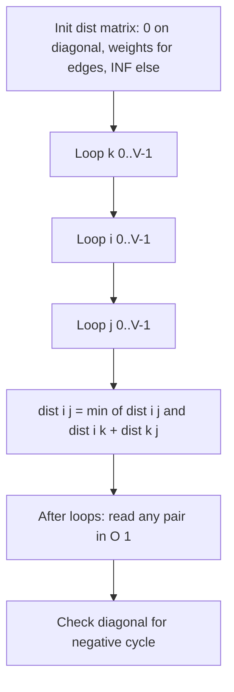

# Floyd-Warshall Algorithm — Junior Level

> **One-line summary:** Floyd-Warshall computes the shortest path between **every pair** of vertices in a weighted graph using a three-line dynamic-programming triple loop in `O(V³)` time and `O(V²)` space, handling negative edges and detecting negative cycles.

---

## Table of Contents

1. [Introduction](#introduction)
2. [Prerequisites](#prerequisites)
3. [Glossary](#glossary)
4. [Core Concepts](#core-concepts)
5. [Big-O Summary](#big-o-summary)
6. [Real-World Analogies](#real-world-analogies)
7. [Pros & Cons](#pros--cons)
8. [Step-by-Step Walkthrough](#step-by-step-walkthrough)
9. [Code Examples](#code-examples)
10. [Coding Patterns](#coding-patterns)
11. [Error Handling](#error-handling)
12. [Performance Tips](#performance-tips)
13. [Best Practices](#best-practices)
14. [Edge Cases & Pitfalls](#edge-cases--pitfalls)
15. [Common Mistakes](#common-mistakes)
16. [Cheat Sheet](#cheat-sheet)
17. [Visual Animation](#visual-animation)
18. [Summary](#summary)
19. [Further Reading](#further-reading)

---

## Introduction

The **Floyd-Warshall algorithm** solves the *all-pairs shortest path* (APSP) problem: given a weighted directed graph, it finds the shortest distance from **every** vertex to **every other** vertex. Where Dijkstra answers "how far is everything from *this one* source?", Floyd-Warshall answers "how far is everything from *everything*?" — and it does so in a single, astonishingly compact algorithm.

The algorithm was published independently by **Robert Floyd (1962)**, building on **Stephen Warshall's (1962)** work on transitive closure, and **Bernard Roy (1959)** earlier still. Its central idea is one of the cleanest examples of dynamic programming you will ever meet:

> Consider paths that are only allowed to pass *through* the first `k` vertices as intermediate stops. Grow `k` from 0 up to `V`. At each step, ask: "Does routing through vertex `k` give me a shorter trip from `i` to `j` than what I already had?"

That single question, asked for every pair `(i, j)` and every intermediate `k`, is the entire algorithm. It is literally three nested loops:

```
for k in 0..V:
    for i in 0..V:
        for j in 0..V:
            dist[i][j] = min(dist[i][j], dist[i][k] + dist[k][j])
```

The beauty is that you operate directly on a `V × V` distance matrix, you never build an explicit graph traversal, and the code handles **negative edge weights** for free (something Dijkstra cannot do). It even **detects negative cycles**: if any vertex ends up with a negative distance to itself, a negative cycle exists.

The cost is `O(V³)` time — fine for dense graphs with a few hundred vertices, a poor choice for sparse graphs with thousands. Knowing *when* to reach for it is as important as knowing *how* it works.

---

## Prerequisites

Before reading this file you should be comfortable with:

- **2D arrays / matrices** — the algorithm lives in a `dist[i][j]` grid.
- **Nested loops** — three of them, and their *order matters*.
- **Graphs basics** — vertices, directed/undirected edges, edge weights (see sibling topic `01-representation`).
- **The idea of "shortest path"** — a path minimizing the sum of edge weights.
- **Big-O notation** — `O(V³)`, `O(V²)`.
- **Infinity as a sentinel** — representing "no known path yet" with a large value.

Optional but helpful:

- Brief exposure to **single-source shortest path** (`04-dijkstra`, `05-bellman-ford`).
- Familiarity with **dynamic programming** — overlapping subproblems and optimal substructure.

---

## Glossary

| Term | Meaning |
|------|---------|
| **All-pairs shortest path (APSP)** | The shortest distance between every ordered pair of vertices `(i, j)`. |
| **Distance matrix `dist`** | A `V × V` grid where `dist[i][j]` holds the best known shortest distance from `i` to `j`. |
| **Intermediate vertex** | A vertex a path is allowed to pass *through* (not an endpoint). |
| **`dp[k][i][j]`** | Shortest `i→j` distance using only vertices `{0,…,k-1}` as intermediates. |
| **Relaxation** | The update `dist[i][j] = min(dist[i][j], dist[i][k] + dist[k][j])`. |
| **INF (infinity)** | A sentinel marking "no path known yet." Must be large but guarded against overflow. |
| **Transitive closure** | The boolean version: is `j` *reachable* from `i` at all? (Warshall's algorithm.) |
| **Negative cycle** | A cycle whose edge weights sum to a negative value — makes "shortest path" undefined. |
| **Path reconstruction** | Recovering the actual sequence of vertices, via a `next` or `predecessor` matrix. |
| **Dense graph** | A graph with many edges (close to `V²`); Floyd-Warshall's sweet spot. |
| **Sparse graph** | A graph with few edges (close to `V`); prefer running Dijkstra `V` times instead. |

---

## Core Concepts

### 1. The Distance Matrix

Floyd-Warshall stores everything in one `V × V` matrix called `dist`. Initialize it like this:

```
dist[i][i] = 0                 // zero cost to stay put
dist[i][j] = weight(i, j)      // if there is a direct edge i→j
dist[i][j] = INF               // otherwise (no known path yet)
```

By the time the algorithm finishes, `dist[i][j]` holds the true shortest distance from `i` to `j`.

### 2. The Intermediate-Vertex Idea (the DP)

Define a subproblem indexed by `k`:

> `dp[k][i][j]` = the length of the shortest path from `i` to `j` that is **only allowed to use vertices `{0, 1, …, k-1}` as intermediate stops.**

When `k = 0`, no intermediates are allowed, so `dp[0][i][j]` is just the direct edge (or INF). When `k = V`, every vertex is allowed, so `dp[V][i][j]` is the true answer.

The recurrence grows `k` by one each step. To compute `dp[k+1]`, consider the shortest `i→j` path allowed to use vertex `k`. Either:

- It **does not** use `k`: the answer is `dp[k][i][j]` (unchanged), or
- It **does** use `k`: the path goes `i → … → k → … → j`, costing `dp[k][i][k] + dp[k][k][j]`.

Take the smaller:

```
dp[k+1][i][j] = min( dp[k][i][j],  dp[k][i][k] + dp[k][k][j] )
```

### 3. The In-Place O(V²) Optimization

The 3D `dp[k][i][j]` table is wasteful — we only ever need the previous `k` layer. It turns out you can **drop the `k` dimension entirely** and update a single 2D `dist` matrix in place:

```
for k in 0..V:
    for i in 0..V:
        for j in 0..V:
            if dist[i][k] + dist[k][j] < dist[i][j]:
                dist[i][j] = dist[i][k] + dist[k][j]
```

Why is overwriting safe? Because when processing layer `k`, the row `dist[k][*]` and column `dist[*][k]` are not changed by this layer's updates (`dist[k][j]` only improves via `dist[k][k] + dist[k][j]`, and `dist[k][k]` is 0 for graphs without negative cycles). The full proof lives in `professional.md`, but the practical takeaway is: **one matrix, no third dimension.**

### 4. The Loop Order — `k` Must Be Outermost

This is the single most important rule. The `k` loop **must** be the outermost loop:

```
for k:            // ← OUTERMOST, no exceptions
    for i:
        for j:
            relax
```

If you nest them in any other order (e.g. `i` outside `k`), you compute garbage, because you would be using updated distances before the intermediate set is correct. Memorize: **k, then i, then j.**

### 5. Negative Cycles

Floyd-Warshall handles negative *edges* perfectly. If the graph has a **negative cycle**, "shortest path" is undefined (you could loop forever and keep shrinking the cost). After running the algorithm, check the diagonal:

```
if dist[i][i] < 0 for any i:  → a negative cycle exists
```

A vertex with a negative distance to *itself* means there is a negative-weight loop reachable from it.

---

## Big-O Summary

| Aspect | Complexity | Notes |
|--------|------------|-------|
| Time | **O(V³)** | Three nested loops, each running `V` times. |
| Space (in-place) | **O(V²)** | One distance matrix. |
| Space (with path reconstruction) | **O(V²)** | One extra `next` (or `pred`) matrix. |
| Space (naive 3D DP) | O(V³) | Wasteful; always optimize to 2D. |
| Negative edges | Supported | Unlike Dijkstra. |
| Negative cycle detection | O(V) post-check | Scan the diagonal for `dist[i][i] < 0`. |
| Query a single pair after running | **O(1)** | Just read `dist[i][j]`. |

Compare: running Dijkstra `V` times is `O(V · E log V)`, which beats `O(V³)` on **sparse** graphs but loses on **dense** ones (and Dijkstra cannot handle negative edges).

---

## Real-World Analogies

| Concept | Analogy |
|---------|---------|
| All-pairs distance matrix | The mileage chart printed on the back of an old road atlas — every city's distance to every other city, in one grid. |
| Intermediate vertex `k` | A flight-connections table where you ask, "If I'm allowed to connect through hub city `k`, can I get from A to B cheaper than my current best route?" |
| Growing `k` from 0 to V | Slowly unlocking more and more allowed layover airports, recomputing the cheapest itineraries each time you add one. |
| Relaxation step | "Is flying A → hub → B cheaper than the direct A → B fare I already found?" |
| Transitive closure | A "can I even reach city B from city A by *any* sequence of flights?" reachability table, ignoring price. |
| Negative cycle | A bizarre frequent-flyer loop that *pays you* every time you fly it — making "the cheapest trip" meaningless. |

Where the analogy breaks: real flight networks are sparse, so airlines would run Dijkstra per source, not Floyd-Warshall. The mileage-chart analogy is best when nearly every city connects to nearly every other.

---

## Pros & Cons

| Pros | Cons |
|------|------|
| Computes **all pairs** in one pass. | `O(V³)` is too slow for large `V` (thousands+). |
| Handles **negative edge weights**. | Cannot handle negative *cycles* (but detects them). |
| **Detects negative cycles** via the diagonal. | `O(V²)` memory — a million-vertex graph needs a trillion cells. |
| Tiny code — three lines of core logic. | Wasteful on **sparse** graphs vs `V × Dijkstra` or Johnson's. |
| `O(1)` queries after the single precomputation. | Recomputing on graph changes means re-running from scratch. |
| Same template solves transitive closure, min-max paths, counting. | No early termination; always does the full `V³` work. |

**When to use:** dense graphs, small `V` (≤ ~400–500), you need *every* pair, the graph has negative edges, or you want the simplest possible APSP code.

**When NOT to use:** sparse graphs (use `V × Dijkstra` or Johnson's algorithm), very large `V`, or when you only need shortest paths from one source (use `04-dijkstra` or `05-bellman-ford`).

---

## Step-by-Step Walkthrough

Take a 4-vertex directed graph (vertices `0, 1, 2, 3`):

```
edges:  0→1 (3),  0→3 (7),  1→0 (8),  1→2 (2),
        2→0 (5),  2→3 (1),  3→0 (2)
```

**Initial matrix** (`INF` shown as `∞`, diagonal is 0):

```
        j=0   j=1   j=2   j=3
i=0  [   0     3     ∞     7  ]
i=1  [   8     0     2     ∞  ]
i=2  [   5     ∞     0     1  ]
i=3  [   2     ∞     ∞     0  ]
```

**k = 0** (allow paths through vertex 0). Look for `i → 0 → j` improvements:

- `dist[1][3] = min(∞, dist[1][0]+dist[0][3]) = min(∞, 8+7) = 15`
- `dist[2][1] = min(∞, dist[2][0]+dist[0][1]) = min(∞, 5+3) = 8`
- `dist[3][1] = min(∞, dist[3][0]+dist[0][1]) = min(∞, 2+3) = 5`
- `dist[3][3] = min(0, dist[3][0]+dist[0][3]) = min(0, 2+7) = 0`

```
        j=0   j=1   j=2   j=3
i=0  [   0     3     ∞     7  ]
i=1  [   8     0     2    15  ]
i=2  [   5     8     0     1  ]
i=3  [   2     5     ∞     0  ]
```

**k = 1** (now also allow vertex 1):

- `dist[0][2] = min(∞, dist[0][1]+dist[1][2]) = min(∞, 3+2) = 5`
- `dist[2][2]`, `dist[3][2]` improve via 1→2:
  - `dist[2][2] = min(0, dist[2][1]+dist[1][2]) = min(0, 8+2) = 0` (no change)
  - `dist[3][2] = min(∞, dist[3][1]+dist[1][2]) = min(∞, 5+2) = 7`

```
        j=0   j=1   j=2   j=3
i=0  [   0     3     5     7  ]
i=1  [   8     0     2    15  ]
i=2  [   5     8     0     1  ]
i=3  [   2     5     7     0  ]
```

**k = 2** (also allow vertex 2):

- `dist[0][3] = min(7, dist[0][2]+dist[2][3]) = min(7, 5+1) = 6`
- `dist[1][0] = min(8, dist[1][2]+dist[2][0]) = min(8, 2+5) = 7`
- `dist[1][3] = min(15, dist[1][2]+dist[2][3]) = min(15, 2+1) = 3`

```
        j=0   j=1   j=2   j=3
i=0  [   0     3     5     6  ]
i=1  [   7     0     2     3  ]
i=2  [   5     8     0     1  ]
i=3  [   2     5     7     0  ]
```

**k = 3** (allow all vertices). Relaxing through 3:

- `dist[1][0] = min(7, dist[1][3]+dist[3][0]) = min(7, 3+2) = 5`
- `dist[1][1] = min(0, dist[1][3]+dist[3][1]) = min(0, 3+5) = 0` (no change)
- `dist[2][1] = min(8, dist[2][3]+dist[3][1]) = min(8, 1+5) = 6`
- `dist[0][0] = min(0, dist[0][3]+dist[3][0]) = min(0, 6+2) = 0` (no change)

**Final matrix** — every cell is the true shortest distance:

```
        j=0   j=1   j=2   j=3
i=0  [   0     3     5     6  ]
i=1  [   5     0     2     3  ]
i=2  [   5     6     0     1  ]
i=3  [   2     5     7     0  ]
```

No diagonal entry is negative, so there is no negative cycle.

---

## Code Examples

### Example: Floyd-Warshall with Path Reconstruction

We compute the distance matrix **and** a `next` matrix so we can rebuild the actual path.

#### Go

```go
package main

import (
	"fmt"
	"math"
)

const INF = math.MaxInt64 / 4 // guard: never let INF+INF overflow

// floydWarshall returns dist and next matrices.
// next[i][j] = the first vertex to step to when going from i to j.
func floydWarshall(n int, edges [][3]int) ([][]int, [][]int) {
	dist := make([][]int, n)
	next := make([][]int, n)
	for i := 0; i < n; i++ {
		dist[i] = make([]int, n)
		next[i] = make([]int, n)
		for j := 0; j < n; j++ {
			if i == j {
				dist[i][j] = 0
			} else {
				dist[i][j] = INF
			}
			next[i][j] = -1
		}
	}
	for _, e := range edges {
		u, v, w := e[0], e[1], e[2]
		dist[u][v] = w
		next[u][v] = v
	}

	for k := 0; k < n; k++ {
		for i := 0; i < n; i++ {
			for j := 0; j < n; j++ {
				// guard against using an unreachable intermediate
				if dist[i][k] < INF && dist[k][j] < INF &&
					dist[i][k]+dist[k][j] < dist[i][j] {
					dist[i][j] = dist[i][k] + dist[k][j]
					next[i][j] = next[i][k]
				}
			}
		}
	}
	return dist, next
}

// path reconstructs i→j using the next matrix.
func path(next [][]int, i, j int) []int {
	if next[i][j] == -1 {
		return nil // unreachable
	}
	p := []int{i}
	for i != j {
		i = next[i][j]
		p = append(p, i)
	}
	return p
}

func main() {
	edges := [][3]int{
		{0, 1, 3}, {0, 3, 7}, {1, 0, 8}, {1, 2, 2},
		{2, 0, 5}, {2, 3, 1}, {3, 0, 2},
	}
	dist, next := floydWarshall(4, edges)
	fmt.Println("dist[1][3] =", dist[1][3]) // 3
	fmt.Println("path 1->3  =", path(next, 1, 3)) // [1 2 3]
}
```

#### Java

```java
import java.util.ArrayList;
import java.util.List;

public class FloydWarshall {
    static final int INF = Integer.MAX_VALUE / 4; // overflow guard

    static int[][] dist;
    static int[][] next;

    static void run(int n, int[][] edges) {
        dist = new int[n][n];
        next = new int[n][n];
        for (int i = 0; i < n; i++) {
            for (int j = 0; j < n; j++) {
                dist[i][j] = (i == j) ? 0 : INF;
                next[i][j] = -1;
            }
        }
        for (int[] e : edges) {
            dist[e[0]][e[1]] = e[2];
            next[e[0]][e[1]] = e[1];
        }
        for (int k = 0; k < n; k++) {
            for (int i = 0; i < n; i++) {
                for (int j = 0; j < n; j++) {
                    if (dist[i][k] < INF && dist[k][j] < INF
                            && dist[i][k] + dist[k][j] < dist[i][j]) {
                        dist[i][j] = dist[i][k] + dist[k][j];
                        next[i][j] = next[i][k];
                    }
                }
            }
        }
    }

    static List<Integer> path(int i, int j) {
        List<Integer> p = new ArrayList<>();
        if (next[i][j] == -1) return p; // unreachable
        p.add(i);
        while (i != j) {
            i = next[i][j];
            p.add(i);
        }
        return p;
    }

    public static void main(String[] args) {
        int[][] edges = {
            {0, 1, 3}, {0, 3, 7}, {1, 0, 8}, {1, 2, 2},
            {2, 0, 5}, {2, 3, 1}, {3, 0, 2}
        };
        run(4, edges);
        System.out.println("dist[1][3] = " + dist[1][3]); // 3
        System.out.println("path 1->3  = " + path(1, 3)); // [1, 2, 3]
    }
}
```

#### Python

```python
INF = float("inf")


def floyd_warshall(n, edges):
    dist = [[0 if i == j else INF for j in range(n)] for i in range(n)]
    nxt = [[None] * n for _ in range(n)]
    for u, v, w in edges:
        dist[u][v] = w
        nxt[u][v] = v

    for k in range(n):
        for i in range(n):
            # small speed-up: skip a whole row if i->k is unreachable
            if dist[i][k] == INF:
                continue
            for j in range(n):
                if dist[i][k] + dist[k][j] < dist[i][j]:
                    dist[i][j] = dist[i][k] + dist[k][j]
                    nxt[i][j] = nxt[i][k]
    return dist, nxt


def path(nxt, i, j):
    if nxt[i][j] is None:
        return []  # unreachable
    p = [i]
    while i != j:
        i = nxt[i][j]
        p.append(i)
    return p


if __name__ == "__main__":
    edges = [
        (0, 1, 3), (0, 3, 7), (1, 0, 8), (1, 2, 2),
        (2, 0, 5), (2, 3, 1), (3, 0, 2),
    ]
    dist, nxt = floyd_warshall(4, edges)
    print("dist[1][3] =", dist[1][3])  # 3
    print("path 1->3  =", path(nxt, 1, 3))  # [1, 2, 3]
```

**What it does:** builds the all-pairs distance matrix and a `next` matrix, then reconstructs the path `1 → 2 → 3` of cost 3.
**Run:** `go run main.go` | `javac FloydWarshall.java && java FloydWarshall` | `python fw.py`

---

## Coding Patterns

### Pattern 1: Plain All-Pairs Distances

**Intent:** You just need the distance matrix, no paths.

```python
for k in range(n):
    for i in range(n):
        for j in range(n):
            if dist[i][k] + dist[k][j] < dist[i][j]:
                dist[i][j] = dist[i][k] + dist[k][j]
```

### Pattern 2: Transitive Closure (Reachability)

**Intent:** Boolean "can `i` reach `j`?" Replace `min`/`+` with `OR`/`AND`:

```python
for k in range(n):
    for i in range(n):
        for j in range(n):
            reach[i][j] = reach[i][j] or (reach[i][k] and reach[k][j])
```

This is **Warshall's algorithm** — same triple loop, boolean semiring.

### Pattern 3: Negative Cycle Detection

**Intent:** After running, scan the diagonal.

```python
has_negative_cycle = any(dist[i][i] < 0 for i in range(n))
```



---

## Error Handling

| Error | Cause | Fix |
|-------|-------|-----|
| Integer overflow on `dist[i][k] + dist[k][j]` | Adding two `INF` sentinels (e.g. `MaxInt + MaxInt` wraps negative). | Use `INF = MaxInt / 4`, or guard with `if dist[i][k] < INF && dist[k][j] < INF`. |
| Wrong answers, all garbage | Loop order is not `k, i, j`. | Put `k` outermost. Always. |
| Negative cycle silently produces nonsense | Forgot to check the diagonal afterward. | After the loops, scan `dist[i][i] < 0`. |
| `IndexError` building the matrix | `V` mismatched with the largest vertex id. | Size the matrix to `max(vertex_id) + 1` or the declared `V`. |
| Path reconstruction loops forever | A negative cycle corrupts the `next` matrix. | Detect cycles first; refuse to reconstruct if one exists. |

---

## Performance Tips

- **Use a flat 1D array** instead of a 2D nested array for the matrix; index as `dist[i*n + j]`. This improves cache locality and can be 2–3× faster.
- **Hoist `dist[i][k]` into a local** inside the `i` loop — it is constant across `j`.
- **Skip the row** when `dist[i][k] == INF`: nothing through `k` can improve row `i`.
- **Avoid the overflow guard inside the hottest loop** by using a moderate `INF` that cannot overflow; the guard branch hurts the branch predictor.
- **Bitset the inner loop for transitive closure** — pack `reach[i]` as a bitset and OR whole rows at once for a ~64× speedup.

---

## Best Practices

- Always initialize the diagonal to `0` and self-loops carefully (`min(0, self-edge weight)`).
- Pick `INF` as a value comfortably below half your integer max so `INF + INF` never overflows.
- Keep a separate `next` (or `pred`) matrix if you ever need the actual path, not just its cost.
- Document your loop order in a comment — future readers must not "tidy" it into the wrong order.
- For sparse graphs, write a brief comment explaining why you did *not* use Floyd-Warshall (and point to Dijkstra/Johnson's).

---

## Edge Cases & Pitfalls

- **Loop order** — the `k` loop must be outermost. This is *the* classic Floyd-Warshall bug.
- **INF overflow** — `INF + INF` wrapping to a negative number can create phantom shortest paths. Guard or use a small INF.
- **Self-loops with negative weight** — `dist[i][i]` could go negative immediately; that *is* a (length-1) negative cycle.
- **Disconnected graph** — unreachable pairs stay `INF`. Don't treat `INF` as a real distance.
- **Undirected graphs** — add both `(u,v)` and `(v,u)` with the same weight. A single negative undirected edge is automatically a negative cycle.
- **Parallel edges** — keep only the minimum weight when initializing `dist[u][v]`.

---

## Common Mistakes

1. **Wrong loop nesting** — putting `i` or `j` outside `k`. Produces wrong distances on most inputs.
2. **Forgetting the overflow guard** — `INF` (as `MaxInt`) plus a weight overflows and looks "shorter."
3. **Not detecting negative cycles** — reporting distances that are meaningless because a negative loop exists.
4. **Treating it as single-source** — running the whole `O(V³)` algorithm when you only needed one source's distances.
5. **Using it on a huge sparse graph** — `O(V³)` and `O(V²)` memory explode; Dijkstra-per-source or Johnson's is far better.
6. **Mutating the wrong cell during reconstruction** — set `next[i][j] = next[i][k]` (not `= k`) when you relax.

---

## Cheat Sheet

| Item | Value |
|------|-------|
| Time | O(V³) |
| Space | O(V²) |
| Negative edges | Yes |
| Negative cycles | Detect via `dist[i][i] < 0`; cannot solve |
| Query after run | O(1) |
| Loop order | **`k` outer, then `i`, then `j`** |

Core relaxation:

```
dist[i][j] = min(dist[i][j], dist[i][k] + dist[k][j])
```

Initialization:

```
dist[i][i] = 0
dist[i][j] = w(i,j) if edge exists, else INF
```

Variants (same triple loop, different operators):

| Variant | Combine | Accumulate |
|---------|---------|------------|
| Shortest path | `min` | `+` |
| Transitive closure | `OR` | `AND` |
| Widest / bottleneck path | `max` | `min` |
| Counting paths | `+` | `×` |

---

## Visual Animation

> See [`animation.html`](./animation.html) for an interactive visual animation of the Floyd-Warshall algorithm.
>
> The animation demonstrates:
> - The `dist` matrix evolving as `k` sweeps from `0` to `V-1`
> - The current `k` row and column highlighted
> - The cell `dist[i][j]` being relaxed via `dist[i][k] + dist[k][j]`
> - The graph drawn alongside the matrix
> - Step / Run / Reset controls

---

## Summary

Floyd-Warshall is the simplest correct way to compute *all-pairs* shortest paths. Its engine is one dynamic-programming recurrence — "is routing through vertex `k` cheaper?" — applied in a three-line triple loop with `k` on the outside. It runs in `O(V³)` time and `O(V²)` space, handles negative edges, and detects negative cycles via a negative diagonal. Use it for dense graphs and small `V`; reach for Dijkstra-per-source or Johnson's on sparse graphs. Master the loop order and the overflow guard, and you have mastered the algorithm.

---

## Further Reading

- *Introduction to Algorithms* (CLRS), Chapter 25 — "All-Pairs Shortest Paths" — the canonical treatment.
- Robert W. Floyd, *Algorithm 97: Shortest Path*, CACM 5(6):345, 1962.
- Stephen Warshall, *A Theorem on Boolean Matrices*, JACM 9(1):11–12, 1962.
- cp-algorithms.com — "Floyd-Warshall algorithm" and "Number of paths of fixed length."
- Sibling topics: `04-dijkstra`, `05-bellman-ford` (single-source), `01-representation`.
- visualgo.net — "Single-Source / All-Pairs Shortest Paths" interactive visualization.
