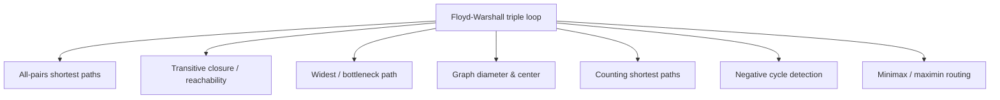

# Floyd-Warshall Algorithm — Middle Level

> **Focus:** Why the DP is correct, why `k` is outermost, why in-place updates are safe, and how the same triple loop generalizes to closure, bottleneck paths, and path counting.

---

## Table of Contents

1. [Introduction](#introduction)
2. [Deeper Concepts](#deeper-concepts)
3. [Comparison with Alternatives](#comparison-with-alternatives)
4. [Advanced Patterns](#advanced-patterns)
5. [Graph and Tree Applications](#graph-and-tree-applications)
6. [Algorithmic Integration](#algorithmic-integration)
7. [Code Examples](#code-examples)
8. [Error Handling](#error-handling)
9. [Performance Analysis](#performance-analysis)
10. [Best Practices](#best-practices)
11. [Visual Animation](#visual-animation)
12. [Summary](#summary)

---

## Introduction

At junior level Floyd-Warshall is "three loops that fill a distance matrix." At middle level you start asking the *engineering* questions:

- *Why* does the `dp[k][i][j]` recurrence give the correct shortest path?
- *Why* must `k` be the outermost loop, and what breaks if it is not?
- *Why* is it safe to overwrite the same 2D matrix in place instead of keeping two layers?
- *When* does running Dijkstra `V` times or Johnson's algorithm beat `O(V³)`?
- *How* does the identical triple loop solve transitive closure, bottleneck (widest) paths, and path counting?

These distinctions decide whether you reach for a 12-line algorithm that runs in 40 ms or accidentally ship one that returns wrong answers or times out.

---

## Deeper Concepts

### The DP derivation

Number the vertices `0, 1, …, V-1`. Define:

```
dp[k][i][j] = length of the shortest path from i to j
              whose intermediate vertices all lie in {0, 1, …, k-1}
```

**Base case (`k = 0`):** no intermediate vertices allowed, so the only paths are direct edges.

```
dp[0][i][j] = w(i, j)   if edge i→j exists
            = 0          if i == j
            = ∞          otherwise
```

**Recurrence:** to compute `dp[k+1]`, consider the shortest `i→j` path allowed to use vertices `{0,…,k}`. Vertex `k` is either on that path or not:

- **Not on the path** → its cost is `dp[k][i][j]` (the answer without `k`).
- **On the path** → because the path is shortest, it visits `k` exactly once, splitting into `i ⇝ k` and `k ⇝ j`, each using only `{0,…,k-1}` as intermediates. Cost: `dp[k][i][k] + dp[k][k][j]`.

```
dp[k+1][i][j] = min( dp[k][i][j],  dp[k][i][k] + dp[k][k][j] )
```

**Answer:** `dp[V][i][j]` allows all vertices as intermediates → the true shortest distance.

**Optimal substructure** holds because a shortest path's sub-paths are themselves shortest. **Overlapping subproblems** hold because each `dp[k][i][k]` and `dp[k][k][j]` feeds many `(i, j)` updates. That is exactly what makes this a dynamic program rather than brute force over all paths.

### Why `k` is the outermost loop

The recurrence reads `dp[k+1]` from `dp[k]`. When we collapse the `k` dimension to update `dist` in place, the relaxation `dist[i][j] = min(dist[i][j], dist[i][k] + dist[k][j])` must run for **all** `(i, j)` pairs *before* `k` advances. The `k` loop being outermost guarantees that: for a fixed `k`, every pair is relaxed through `k`, then `k` increments.

If you put `i` (or `j`) outside `k`, you would finish all `k` values for one row before touching the next row — meaning later rows would relax through intermediates whose own distances had already been "finalized" inconsistently. The result is simply **wrong distances**, not merely slower. There is no valid reordering of the three loops other than `k`-outermost (the inner two, `i` and `j`, *can* be swapped freely).

### Why in-place overwrite is correct

The concern: when processing layer `k`, the relaxation uses `dist[i][k]` and `dist[k][j]`, but those cells might themselves get overwritten during this same `k` iteration. Is that a problem?

No. Consider `dist[i][k]` during the `k` layer. Its only possible update this layer would be:

```
dist[i][k] = min(dist[i][k], dist[i][k] + dist[k][k])
```

For a graph **without negative cycles**, `dist[k][k] = 0`, so `dist[i][k] + dist[k][k] = dist[i][k]` — no change. Symmetrically `dist[k][j]` is unchanged during layer `k`. Therefore the `k`-th row and `k`-th column are **read-only** during layer `k`, and reading possibly-already-updated values for *other* cells is harmless because those updates only ever *decrease* distances toward the correct `dp[k+1]` value. The formal monotonicity argument is in `professional.md`. Practical upshot: **one matrix is enough; no double buffering.**

### Recurrence cost

```
T(V) = V layers × V² relaxations × O(1) each = Θ(V³)
```

There is no early exit; the work is fixed at `V³` regardless of the graph's density. Space is `Θ(V²)` for the matrix (plus another `Θ(V²)` if you track `next`/`pred`).

---

## Comparison with Alternatives

| Attribute | Floyd-Warshall | V × Dijkstra (binary heap) | Johnson's | Bellman-Ford (per source) |
|-----------|----------------|----------------------------|-----------|---------------------------|
| Problem solved | All-pairs | All-pairs (run V times) | All-pairs | Single-source |
| Time | `O(V³)` | `O(V·E log V)` | `O(V·E log V + V·E)` | `O(V·E)` |
| Negative edges | **Yes** | No | **Yes** (via reweighting) | **Yes** |
| Negative cycles | **Detects** | n/a | **Detects** | **Detects** |
| Best on | Dense, small V | Sparse, non-negative | Sparse + negatives | Single source + negatives |
| Code size | Tiny (3 loops) | Medium | Large (Bellman-Ford + reweight + V Dijkstras) | Small |
| Memory | `O(V²)` | `O(V²)` output | `O(V²)` output | `O(V)` per run |

**Rules of thumb:**

- **Dense graph (`E ≈ V²`), small `V` (≤ ~400):** Floyd-Warshall. `V³` ≈ `V·E`, and the constant factor and simplicity win.
- **Sparse graph (`E ≈ V`), non-negative weights:** run Dijkstra from each vertex → `O(V·E log V)`, far better than `V³`.
- **Sparse graph with negative edges (no negative cycle):** **Johnson's algorithm** — one Bellman-Ford pass computes a potential `h(v)` that reweights all edges to be non-negative, then run Dijkstra `V` times on the reweighted graph. See `04-dijkstra` and `05-bellman-ford`.
- **You only need one source:** never use Floyd-Warshall; use `04-dijkstra` (non-negative) or `05-bellman-ford` (negatives).

Johnson's is the "best of both worlds" for sparse graphs with negative edges, but it is much more code. Floyd-Warshall trades that complexity for three lines.

---

## Advanced Patterns

The triple loop is really an algorithm over a **closed semiring**: pick an "extend" operator `⊗` and a "combine" operator `⊕`, and the same structure solves a whole family of problems.

### Pattern: Transitive Closure (Warshall)

Replace `(min, +)` with `(OR, AND)`. `reach[i][j]` is true iff `j` is reachable from `i`.

```
for k:
  for i:
    for j:
      reach[i][j] = reach[i][j] OR (reach[i][k] AND reach[k][j])
```

This is **Warshall's original 1962 algorithm** — historically it predates the shortest-path version and is where the family gets half its name. The structure rewards a key optimization: hoist the `reach[i][k]` test out of the `j` loop, because if `i` cannot reach `k`, routing `i→k→j` is impossible for *every* `j`, so the whole inner loop can be skipped:

```
for k:
  for i:
    if reach[i][k]:                 # only then can k help any j
      for j:
        reach[i][j] |= reach[k][j]
```

Even better, pack each row into machine words (a bitset): the inner `for j` collapses to a single `reach[i] |= reach[k]` word-OR covering 64 columns at a time, turning the constant factor from `n` down to `n/64`. For reachability on graphs with `n` in the low thousands this is the difference between milliseconds and a noticeable pause — and it is *only* available because the Boolean semiring's combine step (`OR`) maps directly onto a hardware bitwise op. The `(min, +)` shortest-path version cannot be bit-packed this way because `min` and `+` are not bitwise.

### Pattern: Widest / Bottleneck Path (Maximin)

The *bottleneck* of a path is its minimum edge capacity; the *widest path* maximizes that bottleneck. Use `(max, min)`:

```
for k:
  for i:
    for j:
      width[i][j] = max(width[i][j], min(width[i][k], width[k][j]))
```

This answers "what is the maximum-capacity route from `i` to `j`?" — useful in network bandwidth and the Maximum-Capacity-Path problem. The dual (minimax: minimize the maximum edge) swaps the operators to `(min, max)`.

Why does swapping the operators *still produce correct answers*? The intermediate-set induction from the shortest-path derivation goes through unchanged: the widest `i→j` path with intermediates in `{0,…,k}` either avoids `k` (width `width[i][j]`) or routes through it (width `min(width[i][k], width[k][j])`, since a path is only as wide as its narrowest of the two halves), and we take the `max` of the two options. The `(max, min)` pair plays the role `(min, +)` played for distances — this is the closed-semiring generality made concrete (see `professional.md`). Worked example on a small capacity graph `0→1 (cap 4)`, `1→2 (cap 5)`, `2→3 (cap 6)`, `0→3 (cap 2)`: the widest `0→3` route is `0→1→2→3` with bottleneck `min(4,5,6) = 4`, beating the direct edge of capacity `2`. The minimax dual is exactly how you find the route that minimizes the worst (largest) edge — used for "minimize the maximum latency hop" routing and for the minimum-spanning-tree bottleneck property.

### Pattern: Counting Paths / Number of Shortest Paths

To **count** the number of shortest paths, keep a `cnt[i][j]` matrix alongside `dist`:

- When `dist[i][k] + dist[k][j] < dist[i][j]`: set `dist` and `cnt[i][j] = cnt[i][k] * cnt[k][j]`.
- When `dist[i][k] + dist[k][j] == dist[i][j]`: add `cnt[i][j] += cnt[i][k] * cnt[k][j]`.

For *all* paths (not shortest) in a DAG-reachability sense, use `(+, ×)` on a boolean/integer adjacency to count walks — but beware cycles make counts infinite.

The multiply-then-add rule for shortest-path counts is worth internalizing with a tiny example. Suppose there are two equally-short ways to get from `i` to `k` (`cnt[i][k] = 2`) and three from `k` to `j` (`cnt[k][j] = 3`), and routing through `k` ties the current best `dist[i][j]`. Then there are `2 × 3 = 6` new shortest paths to add (`cnt[i][j] += 6`) — every way of reaching `k` combines with every way of leaving it. If routing through `k` *beats* the old best, the previous count is obsolete and we *replace* it (`cnt[i][j] = 6`) rather than add. Getting the strict-`<` (replace) versus `==` (accumulate) distinction right is the entire subtlety; a common bug is using `<=` and double-counting. Counts grow exponentially, so take everything modulo a prime like `1e9+7`.

### Pattern: Negative-Cycle Detection and Affected Pairs

After running, `dist[i][i] < 0` flags vertices on a negative cycle. To mark **every pair whose shortest path is undefined** (passes through a negative cycle), do a second pass: `dist[i][j] = -INF` if there exists `t` with `dist[i][t] < INF`, `dist[t][t] < 0`, and `dist[t][j] < INF`.

The intuition for the second pass: a negative cycle means you can loop arbitrarily many times to drive the cost to `-∞`. So *any* pair `(i, j)` where you can reach a negative-cycle vertex `t` from `i`, and reach `j` from `t`, has an undefined (`-∞`) shortest path — you would detour into the cycle, spin to `-∞`, then continue to `j`. Pairs that cannot route through any negative-cycle vertex keep their finite distances. This distinction matters: naively reporting `dist[i][i] < 0` as "the graph has a negative cycle" is correct, but blindly trusting the *finite* entries without the second pass can hand back wrong (too-large) distances for pairs that should be `-∞`. For arbitrage detection in currency graphs (weights `= -log(rate)`), the mere existence of any `dist[i][i] < 0` is the signal that a profitable loop exists; the affected-pairs pass tells you which conversions are unboundedly profitable.

---

## Graph and Tree Applications



- **Graph diameter** — `max over all i,j of dist[i][j]` after running once. (Ignore `∞` entries, or the diameter is "infinite" because the graph is disconnected.) This is a one-liner over the finished matrix and is why Floyd-Warshall is the go-to for diameter on small dense graphs: you already paid for all pairs, so the diameter, radius, and center fall out for free.
- **Graph center / radius** — the **eccentricity** of vertex `i` is `ecc(i) = max_j dist[i][j]` (its distance to the farthest reachable vertex). The **radius** is `min_i ecc(i)`, and a **center** is any vertex achieving it. The center is the optimal place to put a facility that minimizes worst-case distance to any node — a classic application of the all-pairs matrix.
- **Reachability for small DAGs / dependency graphs** — Warshall's closure.
- **Routing tables** — precompute once, answer "next hop" queries in `O(1)` via the `next` matrix.
- **Detecting arbitrage** — a negative cycle in `-log(exchange_rate)` weights means a profitable currency loop.

---

## Algorithmic Integration

Floyd-Warshall often appears as a **preprocessing step** feeding a larger algorithm:

- **Metric TSP heuristics** require an all-pairs shortest-path metric over the input points — Floyd-Warshall builds it when `V` is small.
- **Small-graph DP over subsets** (e.g. Steiner tree on few terminals) uses the all-pairs matrix as the "edge cost" between key vertices.
- **Min-plus matrix multiplication** — Floyd-Warshall *is* repeated min-plus closure; the `dist[i][k]+dist[k][j]` step is the `(min, +)` analogue of a multiply-add. Recognizing this connects it to the broader theory of semiring closures and to faster (sub-cubic) APSP research (see `professional.md`).

```python
# Floyd-Warshall as the closure of a min-plus adjacency matrix
def min_plus_closure(W):
    n = len(W)
    D = [row[:] for row in W]
    for k in range(n):
        for i in range(n):
            for j in range(n):
                if D[i][k] + D[k][j] < D[i][j]:
                    D[i][j] = D[i][k] + D[k][j]
    return D
```

---

## Code Examples

### Transitive Closure + Widest (Bottleneck) Path

#### Go

```go
package main

import "fmt"

// transitiveClosure: reach[i][j] = can i reach j (incl. via intermediates).
func transitiveClosure(adj [][]bool) [][]bool {
	n := len(adj)
	reach := make([][]bool, n)
	for i := range reach {
		reach[i] = make([]bool, n)
		copy(reach[i], adj[i])
		reach[i][i] = true
	}
	for k := 0; k < n; k++ {
		for i := 0; i < n; i++ {
			if !reach[i][k] {
				continue
			}
			for j := 0; j < n; j++ {
				if reach[k][j] {
					reach[i][j] = true
				}
			}
		}
	}
	return reach
}

// widestPath: maximize the minimum edge capacity along i→j.
func widestPath(cap [][]int) [][]int {
	n := len(cap)
	const NEG = -1 // 0 means "no capacity / unreachable"
	w := make([][]int, n)
	for i := range w {
		w[i] = make([]int, n)
		copy(w[i], cap[i])
	}
	for k := 0; k < n; k++ {
		for i := 0; i < n; i++ {
			for j := 0; j < n; j++ {
				through := min(w[i][k], w[k][j])
				if through > w[i][j] {
					w[i][j] = through
				}
			}
		}
	}
	_ = NEG
	return w
}

func min(a, b int) int {
	if a < b {
		return a
	}
	return b
}

func main() {
	adj := [][]bool{
		{false, true, false, false},
		{false, false, true, false},
		{false, false, false, true},
		{false, false, false, false},
	}
	r := transitiveClosure(adj)
	fmt.Println("0 reaches 3?", r[0][3]) // true

	cap := [][]int{
		{0, 4, 0, 2},
		{0, 0, 5, 0},
		{0, 0, 0, 6},
		{0, 0, 0, 0},
	}
	w := widestPath(cap)
	fmt.Println("widest 0->3 =", w[0][3]) // 4 (0->1->2->3 bottleneck = min(4,5,6)=4)
}
```

#### Java

```java
public class ClosureAndWidest {

    static boolean[][] transitiveClosure(boolean[][] adj) {
        int n = adj.length;
        boolean[][] reach = new boolean[n][n];
        for (int i = 0; i < n; i++) {
            reach[i] = adj[i].clone();
            reach[i][i] = true;
        }
        for (int k = 0; k < n; k++) {
            for (int i = 0; i < n; i++) {
                if (!reach[i][k]) continue;
                for (int j = 0; j < n; j++) {
                    if (reach[k][j]) reach[i][j] = true;
                }
            }
        }
        return reach;
    }

    static int[][] widestPath(int[][] cap) {
        int n = cap.length;
        int[][] w = new int[n][n];
        for (int i = 0; i < n; i++) w[i] = cap[i].clone();
        for (int k = 0; k < n; k++) {
            for (int i = 0; i < n; i++) {
                for (int j = 0; j < n; j++) {
                    int through = Math.min(w[i][k], w[k][j]);
                    if (through > w[i][j]) w[i][j] = through;
                }
            }
        }
        return w;
    }

    public static void main(String[] args) {
        boolean[][] adj = {
            {false, true, false, false},
            {false, false, true, false},
            {false, false, false, true},
            {false, false, false, false}
        };
        System.out.println("0 reaches 3? " + transitiveClosure(adj)[0][3]); // true

        int[][] cap = {
            {0, 4, 0, 2},
            {0, 0, 5, 0},
            {0, 0, 0, 6},
            {0, 0, 0, 0}
        };
        System.out.println("widest 0->3 = " + widestPath(cap)[0][3]); // 4
    }
}
```

#### Python

```python
def transitive_closure(adj):
    n = len(adj)
    reach = [row[:] for row in adj]
    for i in range(n):
        reach[i][i] = True
    for k in range(n):
        for i in range(n):
            if not reach[i][k]:
                continue
            row_k = reach[k]
            row_i = reach[i]
            for j in range(n):
                if row_k[j]:
                    row_i[j] = True
    return reach


def widest_path(cap):
    n = len(cap)
    w = [row[:] for row in cap]
    for k in range(n):
        for i in range(n):
            for j in range(n):
                through = min(w[i][k], w[k][j])
                if through > w[i][j]:
                    w[i][j] = through
    return w


if __name__ == "__main__":
    adj = [
        [False, True, False, False],
        [False, False, True, False],
        [False, False, False, True],
        [False, False, False, False],
    ]
    print("0 reaches 3?", transitive_closure(adj)[0][3])  # True

    cap = [
        [0, 4, 0, 2],
        [0, 0, 5, 0],
        [0, 0, 0, 6],
        [0, 0, 0, 0],
    ]
    print("widest 0->3 =", widest_path(cap)[0][3])  # 4
```

**What it does:** computes reachability (boolean closure) and the widest/bottleneck path capacity matrix using the same triple-loop skeleton with different operators.

### Counting Shortest Paths (Python)

To make the `<` (replace) vs `==` (accumulate) rule concrete, here is the count-augmented loop:

```python
def count_shortest_paths(W, MOD=10**9 + 7):
    """W: n x n weight matrix, float('inf') for no edge, 0 on diagonal.
    Returns (dist, cnt): shortest distances and the number of shortest paths."""
    n = len(W)
    dist = [row[:] for row in W]
    cnt = [[1 if (W[i][j] != float("inf")) else 0 for j in range(n)]
           for i in range(n)]
    for i in range(n):
        cnt[i][i] = 1
    for k in range(n):
        for i in range(n):
            dik = dist[i][k]
            if dik == float("inf"):
                continue
            for j in range(n):
                through = dik + dist[k][j]
                if through < dist[i][j]:          # strictly better: replace
                    dist[i][j] = through
                    cnt[i][j] = (cnt[i][k] * cnt[k][j]) % MOD
                elif through == dist[i][j] and through != float("inf"):
                    cnt[i][j] = (cnt[i][j] + cnt[i][k] * cnt[k][j]) % MOD
    return dist, cnt
```

The only difference from the plain distance loop is the parallel `cnt` matrix and the strict/equal branch — the same skeleton, the same `k`-outermost requirement.

---

## Error Handling

| Scenario | What goes wrong | Correct approach |
|----------|----------------|------------------|
| `INF + INF` overflow | Phantom "short" paths appear via two unreachable hops. | Guard `dist[i][k] < INF && dist[k][j] < INF`, or use `INF = MAX/4`. |
| Negative cycle, then path reconstruction | `next` matrix points into the cycle; reconstruction loops forever. | Detect cycles (`dist[i][i] < 0`) before reconstructing; refuse if present. |
| Widest path with `0 = unreachable` | `min(0, x) = 0` is fine, but `max` initialization must start at the true capacity, not `INF`. | Initialize `w[i][j]` to the direct capacity (`0` if none), not infinity. |
| Counting paths overflows | Path counts grow exponentially. | Use modular arithmetic (`mod 1e9+7`) or big integers. |
| Loop reorder by a "helpful" refactor | Wrong distances slip through tests if test graphs are too symmetric. | Add an asymmetric, negative-edge test that fails on any wrong order. |

---

## Performance Analysis

| V | Relaxations (`V³`) | Approx. time (compiled, 1D matrix) |
|---|--------------------|------------------------------------|
| 100 | 10⁶ | < 1 ms |
| 200 | 8 × 10⁶ | ~5 ms |
| 500 | 1.25 × 10⁸ | ~80 ms |
| 1000 | 10⁹ | ~1 s |
| 2000 | 8 × 10⁹ | ~8–12 s (usually too slow) |

The inner loop is branch-light and extremely cache-friendly when the matrix is a contiguous 1D array (`dist[i*n+j]`). Hoisting `dik = dist[i*n+k]` out of the `j` loop and skipping rows where `dik == INF` both help measurably.

```python
import time, random

def bench(n):
    INF = float("inf")
    d = [[0 if i == j else (random.randint(1, 9) if random.random() < 0.5 else INF)
          for j in range(n)] for i in range(n)]
    t = time.perf_counter()
    for k in range(n):
        dk = d[k]
        for i in range(n):
            dik = d[i][k]
            if dik == INF:
                continue
            di = d[i]
            for j in range(n):
                v = dik + dk[j]
                if v < di[j]:
                    di[j] = v
    return time.perf_counter() - t

for n in (100, 200, 400):
    print(n, f"{bench(n):.3f}s")
```

Pure Python is ~50–100× slower than Go/Java here; for large `V` push the inner loop into NumPy (`np.minimum(D, D[:,k,None] + D[None,k,:])`) or a compiled language.

---

## Best Practices

- **Memorize the loop order** and comment it: `k` outermost, always.
- **Use a 1D flat matrix** for speed and cache locality in hot code.
- **Guard overflow** explicitly or pick `INF = MAX/4`.
- **Always pair a `next`/`pred` matrix** if paths (not just costs) are needed.
- **Check density first:** if `E ≪ V²`, prefer `V × Dijkstra` or Johnson's.
- **Detect negative cycles** before trusting or reconstructing any path.
- **Match the semiring to the problem, not the code.** Reaching for shortest-path code and post-processing is a smell; if you need reachability, bottleneck, or counts, swap the operators directly — it is the same loop, correct by the same induction, and usually faster (bitset closure, no overflow guards).
- **Initialize the base matrix carefully.** The diagonal is `0` for distances, `true` for closure, and the vertex's own capacity (often `+∞` or "unlimited") for widest path. A wrong base case silently corrupts every derived entry. Make the initialization a named helper, not inline magic.
- **Prefer `int` sentinels over floating `inf`** in compiled code: `INF = MAX/4` keeps arithmetic branch-light and avoids the `inf + inf` and `inf - inf` traps, while still being recognizably "unreachable" in output.

### When NOT to reach for Floyd-Warshall

Even at middle level the instinct to use the three-loop hammer should be checked. If you only ever query a handful of source-destination pairs, computing the full `V²` matrix is wasteful — a couple of Dijkstra runs answer the actual question in a fraction of the time and memory. If the graph is a tree or a DAG, simpler linear-time methods (LCA-based distances, DAG relaxation in topological order) beat `V³`. And if `V` is genuinely large and the graph sparse, the `V³` term is a trap that passes small tests and times out in production. Floyd-Warshall earns its keep specifically when you need *most or all* pairs, the graph is *dense or small*, and *negative edges* may be present — outside that envelope, prefer a targeted single-source algorithm.

---

## Visual Animation

> See [`animation.html`](./animation.html) for an interactive view.
>
> The middle-level animation highlights:
> - The current intermediate `k` (its row and column locked as read-only).
> - The specific relaxation `dist[i][j] = min(dist[i][j], dist[i][k] + dist[k][j])`.
> - How the matrix monotonically decreases as `k` advances.

---

## Summary

Floyd-Warshall is dynamic programming over an expanding set of allowed intermediate vertices: `dp[k+1][i][j] = min(dp[k][i][j], dp[k][i][k] + dp[k][k][j])`. Collapsing the `k` dimension yields an in-place `O(V²)`-space, `O(V³)`-time algorithm whose correctness hinges on `k` being the outermost loop and on the `k`-th row/column staying read-only within each layer. The same triple loop, with different semiring operators, solves transitive closure (`OR/AND`), widest paths (`max/min`), and path counting (`+/×`). Choose it for dense graphs with small `V`; reach for Dijkstra-per-source or Johnson's on sparse graphs — and always detect negative cycles before trusting the result.
