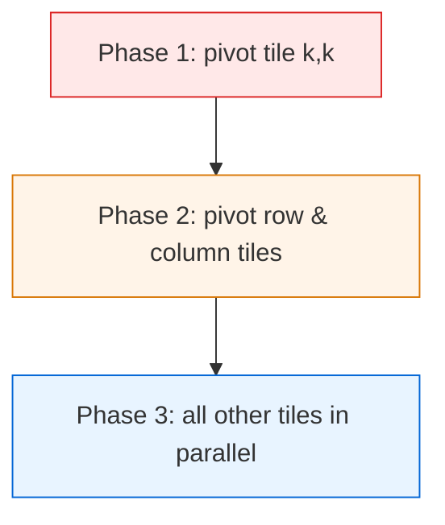

# Floyd-Warshall Algorithm — Senior Level

> Floyd-Warshall is rarely the bottleneck on a 200-vertex graph — but the moment you make a precomputed distance matrix the backbone of a routing service, every property (cubic time, quadratic memory, full recomputation on change, no streaming) becomes a capacity-planning and operational concern.

## Table of Contents
1. [Introduction](#1-introduction)
2. [System Design with Precomputed Distance Matrices](#2-system-design-with-precomputed-distance-matrices)
3. [Distributed and Blocked Floyd-Warshall](#3-distributed-and-blocked-floyd-warshall)
4. [Concurrency](#4-concurrency)
5. [Comparison at Scale](#5-comparison-at-scale)
6. [Architecture Patterns](#6-architecture-patterns)
7. [Code Examples](#7-code-examples)
8. [Observability](#8-observability)
9. [Failure Modes](#9-failure-modes)
10. [Capacity Planning](#10-capacity-planning)
11. [Summary](#11-summary)

---

## 1. Introduction

At the senior level the question is no longer "how does the triple loop work" but "where does an all-pairs distance matrix belong in my system, and what breaks when it does?" Floyd-Warshall produces a dense `V × V` artifact in `O(V³)` time. That description alone tells you three things:

- It is an **offline, batch** computation, not an online/streaming one.
- Its output is **`O(V²)` memory** — a hard wall as `V` grows.
- Any graph change forces a **full recompute** unless you engineer incrementality.

The interesting senior decisions are therefore architectural:

1. Should distances be precomputed (Floyd-Warshall) or computed on demand (per-query Dijkstra)?
2. How do you fit and serve a `V²` matrix that may not fit in one machine's RAM?
3. How do you exploit cache blocking and parallelism to make `V³` tolerable?
4. How do you keep the matrix fresh when edges change?
5. How do you observe and bound a batch job that scales cubically?

---

## 2. System Design with Precomputed Distance Matrices

### 2.1 Precompute vs on-demand

```mermaid
flowchart LR
    A[On-demand<br/>Dijkstra per query<br/>O(E log V) each<br/>always fresh] --> B[Precomputed matrix<br/>Floyd-Warshall O(V^3) batch<br/>O(1) queries<br/>stale on change]
    B --> C[Hierarchical / CH<br/>contraction hierarchies<br/>fast queries + updates<br/>road-network scale]
    style A fill:#e8f4ff,stroke:#0366d6
    style B fill:#fff4e8,stroke:#d97706
    style C fill:#ffe8e8,stroke:#dc2626
```

| Approach | When right | When wrong |
| --- | --- | --- |
| On-demand Dijkstra | Few queries, graph changes often, sparse, no negatives. | Millions of pairwise queries per second; cost dominates. |
| Precomputed Floyd-Warshall matrix | Dense graph, small/medium `V`, many `O(1)` queries, static graph. | `V` in the thousands+, or edges change frequently. |
| Hierarchical (Contraction Hierarchies, hub labels) | Road networks, `V` in millions, query + update both matter. | Small graphs where the engineering overhead is not worth it. |

The most expensive mistake is precomputing a `V²` matrix for a graph that mutates every few seconds: you pay `V³` repeatedly and serve stale data between rebuilds.

### 2.2 What the matrix actually buys you

A precomputed matrix turns every shortest-path query into a single array read — `O(1)`, lock-free, trivially cacheable, trivially shardable by row. For a read-heavy workload over a static small graph (store-locator distances, game-map pathing tables, a service-mesh latency matrix of a few hundred nodes), that is unbeatable. The cost is the cubic build and the quadratic footprint.

---

## 3. Distributed and Blocked Floyd-Warshall

### 3.1 Cache-blocked (tiled) Floyd-Warshall

Naive Floyd-Warshall streams the whole `V × V` matrix `V` times — `V³` memory traffic with poor reuse once `V²` exceeds cache. The **blocked** variant partitions the matrix into `B × B` tiles and processes one "pivot round" per block of `k` values, in three dependency phases:

1. **Pivot block** `(kk, kk)` — self-contained Floyd-Warshall on the diagonal tile.
2. **Pivot row & column** blocks — depend only on the pivot block.
3. **Remaining** blocks — depend on the corresponding row and column pivot blocks.

Each tile fits in cache, so data is reused `B` times before eviction. This is the standard high-performance layout and the basis of GPU implementations.



### 3.2 GPU Floyd-Warshall

On a GPU the blocked algorithm maps naturally: phase 3 launches one thread block per matrix tile, each doing `B³` min-plus updates from shared memory. Reported speedups over a single CPU core are 30–100× for `V` in the low thousands. The min-plus inner op is FMA-like but uses `min` instead of `+` for accumulation, so it does not use the FMA pipeline — memory bandwidth and occupancy dominate.

### 3.3 Distributed (multi-node)

For `V` too large for one machine's `V²` RAM, partition the matrix by **row blocks** across nodes. Each `k`-round requires broadcasting the pivot **row** `k` and pivot **column** `k` to all nodes before they update their local blocks. Communication is `O(V²)` per round × `V` rounds = `O(V³)` total bytes moved — usually the bottleneck. In practice, distributed Floyd-Warshall is only worth it for the narrow band of `V` that is too big for one node but small enough that `V³` finishes in reasonable wall-clock time.

---

## 4. Concurrency

### 4.1 Parallelizing the `i, j` loops for fixed `k`

For a fixed `k`, all `(i, j)` relaxations are **independent**: they read row `k` and column `k` (read-only that layer) and write disjoint cells. So the inner double loop parallelizes trivially across cores or threads. The only synchronization needed is a **barrier between consecutive `k` values** — you must finish layer `k` before starting layer `k+1`.

```
for k in 0..V:
    parallel for i in 0..V:        // safe: disjoint writes, read-only k row/col
        for j in 0..V:
            relax(i, j, k)
    barrier()                      // all threads finish layer k before k+1
```

This gives near-linear speedup up to memory-bandwidth saturation. The barrier cost is negligible (`V` barriers total).

### 4.2 What you cannot parallelize

You cannot parallelize across `k` — the layers are strictly sequential (`dp[k+1]` depends on `dp[k]`). Attempts to pipeline `k` and `k+1` require careful tiling (the blocked algorithm's phase ordering is exactly this dependency made explicit).

### 4.3 Serving concurrency

Once built, the matrix is immutable and read-only, so any number of reader threads query it lock-free. Rebuilds use a **read-copy-update** pattern: build a new matrix off to the side, then atomically swap a pointer. Readers never block; they see either the old or new matrix, never a torn one.

---

## 5. Comparison at Scale

| Structure / approach | Build | Query | Update | Memory | When |
| --- | --- | --- | --- | --- | --- |
| Floyd-Warshall matrix | `O(V³)` | `O(1)` | `O(V³)` full rebuild | `O(V²)` | Dense, small V, static, read-heavy. |
| Floyd-Warshall (incremental edge decrease) | — | `O(1)` | `O(V²)` per decreased edge | `O(V²)` | Static topology, weights only drop. |
| V × Dijkstra (lazy, cached) | per-source on demand | `O(E log V)` first, then `O(1)` cached | invalidate cache | `O(V²)` if fully cached | Sparse, partial query set. |
| Contraction Hierarchies | `O(V log V)`-ish preprocess | `O(log V)`-ish | re-preprocess region | `O(V + shortcuts)` | Road networks, millions of vertices. |
| Hub labeling | heavy preprocess | `O(label size)` | rebuild | large | Static road networks, fastest queries. |

Floyd-Warshall wins decisively only in the dense-and-small regime. Above a few thousand vertices the cubic build and quadratic memory push you to hierarchical methods.

---

## 6. Architecture Patterns

### 6.1 Precompute-and-serve

```
        +------------------+        +-------------+        +-----------+
edges ->| FW batch job     |------->| dist matrix |------->| query API |
        | (nightly / on    |  swap  | (immutable, |  O(1)  | reads     |
        |  topology change)|        |  sharded)   |        +-----------+
        +------------------+        +-------------+
```

Trigger the batch on a schedule or on a topology-change event. Serve from the immutable artifact. Version the matrix so clients can detect staleness.

### 6.2 Incremental edge-weight decrease

If an edge weight only ever **decreases** (e.g. a link gets faster), you do not need a full rebuild. A single edge `(u, v)` dropping to weight `w` can be folded in `O(V²)`:

```
if w < dist[u][v]:
    dist[u][v] = w
    for i in 0..V:
        for j in 0..V:
            dist[i][j] = min(dist[i][j], dist[i][u] + w + dist[v][j])
```

This is the standard incremental-APSP trick for decreases. Increases are harder (potentially `O(V³)`), so most systems treat increases as a full rebuild trigger.

### 6.3 Tiered freshness

Serve the precomputed matrix for the common case and fall back to an on-demand Dijkstra for vertices touched by very recent edge changes (a "dirty set"). This bounds staleness without paying for a full rebuild on every change.

---

## 7. Code Examples

### 7.1 Go — blocked (tiled) Floyd-Warshall, parallel phase 3

```go
package main

import (
	"runtime"
	"sync"
)

const INF = 1 << 30

// blockedFW runs tiled Floyd-Warshall on a flat n*n matrix with tile size b.
// n must be a multiple of b for clarity (pad otherwise).
func blockedFW(dist []int, n, b int) {
	at := func(i, j int) int { return i*n + j }

	// relax a destination tile (di,dj) using pivot tiles via k in [kk, kk+b)
	relaxTile := func(di, dj, kk int) {
		for k := kk; k < kk+b; k++ {
			for i := di; i < di+b; i++ {
				dik := dist[at(i, k)]
				if dik >= INF {
					continue
				}
				row := i * n
				for j := dj; j < dj+b; j++ {
					if v := dik + dist[at(k, j)]; v < dist[row+j] {
						dist[row+j] = v
					}
				}
			}
		}
	}

	blocks := n / b
	for bk := 0; bk < blocks; bk++ {
		kk := bk * b
		// Phase 1: pivot diagonal tile
		relaxTile(kk, kk, kk)
		// Phase 2: pivot row and column tiles
		for bj := 0; bj < blocks; bj++ {
			if bj == bk {
				continue
			}
			relaxTile(kk, bj*b, kk)   // pivot row
			relaxTile(bj*b, kk, kk)   // pivot column
		}
		// Phase 3: all remaining tiles, in parallel
		var wg sync.WaitGroup
		sem := make(chan struct{}, runtime.NumCPU())
		for bi := 0; bi < blocks; bi++ {
			if bi == bk {
				continue
			}
			for bj := 0; bj < blocks; bj++ {
				if bj == bk {
					continue
				}
				wg.Add(1)
				sem <- struct{}{}
				go func(bi, bj int) {
					defer wg.Done()
					defer func() { <-sem }()
					relaxTile(bi*b, bj*b, kk)
				}(bi, bj)
			}
		}
		wg.Wait()
	}
}

func main() {
	// caller pads n to a multiple of b, initializes dist with INF / 0 diagonal.
	_ = blockedFW
}
```

### 7.2 Java — parallel `i`-loop with a barrier per `k`

```java
import java.util.concurrent.*;

public final class ParallelFloydWarshall {
    static final int INF = 1 << 30;

    static void run(int[] dist, int n) throws InterruptedException {
        int threads = Runtime.getRuntime().availableProcessors();
        ExecutorService pool = Executors.newFixedThreadPool(threads);
        try {
            for (int k = 0; k < n; k++) {
                final int kk = k;
                CountDownLatch latch = new CountDownLatch(threads);
                int chunk = (n + threads - 1) / threads;
                for (int t = 0; t < threads; t++) {
                    final int lo = t * chunk;
                    final int hi = Math.min(n, lo + chunk);
                    pool.execute(() -> {
                        for (int i = lo; i < hi; i++) {
                            int dik = dist[i * n + kk];
                            if (dik >= INF) { continue; }
                            int row = i * n, krow = kk * n;
                            for (int j = 0; j < n; j++) {
                                int v = dik + dist[krow + j];
                                if (v < dist[row + j]) dist[row + j] = v;
                            }
                        }
                        latch.countDown();
                    });
                }
                latch.await(); // barrier: finish layer k before k+1
            }
        } finally {
            pool.shutdown();
        }
    }

    public static void main(String[] args) { /* caller fills dist */ }
}
```

### 7.3 Python — NumPy-vectorized layers (the practical "fast" Python)

```python
import numpy as np


def floyd_warshall_np(dist: np.ndarray) -> np.ndarray:
    """dist: (n, n) float matrix, np.inf for no edge, 0 on the diagonal.
    Vectorizes the inner i,j double loop with broadcasting; loops only over k."""
    n = dist.shape[0]
    d = dist.copy()
    for k in range(n):
        # d[:, k, None] is column k (n x 1); d[None, k, :] is row k (1 x n)
        np.minimum(d, d[:, k, None] + d[None, k, :], out=d)
    return d


if __name__ == "__main__":
    INF = np.inf
    g = np.array([
        [0,   3,   INF, 7],
        [8,   0,   2,   INF],
        [5,   INF, 0,   1],
        [2,   INF, INF, 0],
    ], dtype=float)
    print(floyd_warshall_np(g))
    # negative cycle check: np.any(np.diag(result) < 0)
```

The NumPy version pushes the `O(V²)` inner work into C, leaving only a `V`-length Python loop — typically 100–1000× faster than triple-nested pure Python for large `V`.

---

## 8. Observability

A batch matrix build is invisible until it overruns its window or serves stale data. Wire these from day one.

| Metric | Type | Why |
| --- | --- | --- |
| `fw_build_duration_seconds` | histogram | Cubic growth surfaces here first; alert if it trends up. |
| `fw_vertex_count` | gauge | The driver of `V³`/`V²`; track it relative to your budget. |
| `fw_matrix_bytes` | gauge | Memory footprint; alert before it crosses node RAM. |
| `fw_negative_cycle_detected` | gauge (0/1) | Negative cycle in input → results undefined. |
| `fw_matrix_age_seconds` | gauge | Staleness since last successful build. |
| `fw_query_total` / `fw_query_errors_total` | counters | Read traffic and out-of-range queries. |
| `fw_rebuild_trigger_total{reason}` | counter | Schedule vs topology-change vs manual. |

The most useful single signal is `fw_matrix_age_seconds` versus your staleness SLO — it catches a wedged or failing rebuild even while queries keep succeeding against an old matrix.

Log on each build: `V`, `E`, build time, whether a negative cycle was found, and the matrix version hash so clients can correlate answers to a specific build.

---

## 9. Failure Modes

### 9.1 Negative cycle in input
A negative cycle makes shortest paths undefined. Detect it (`dist[i][i] < 0`), refuse to publish the matrix, alert, and keep serving the last good version. Never silently serve a matrix with negative-diagonal entries.

### 9.2 Integer overflow
`INF + INF` overflowing to a negative number fabricates impossibly short paths and can even mimic a negative cycle. Standardize on `INF = MAX/4` (or a domain-specific large constant) across the codebase, and add an invariant test.

### 9.3 Memory blow-up
`O(V²)` is a cliff. At `V = 50,000`, an `int64` matrix is 20 GB. A vertex count that creeps up over months silently moves you from "fits in RAM" to OOM. Alert on `fw_matrix_bytes` well below node capacity.

### 9.4 Stale results after a topology change
If the rebuild trigger misses an edge change, queries return paths that no longer exist. Mitigate with a "dirty set" fallback to on-demand computation and a hard cap on `fw_matrix_age_seconds`.

### 9.5 Build overruns its window
`V` grows, `V³` blows past the nightly window, and builds start overlapping. Mitigations: cap `V` via graph contraction, move to blocked/parallel/GPU builds, or switch to a hierarchical method.

### 9.6 Torn reads during swap
Readers observing a half-written matrix during a rebuild return garbage. Use read-copy-update: build a fresh matrix, then swap an immutable pointer atomically.

---

## 10. Capacity Planning

### 10.1 Memory wall
- `int32` matrix: `4 · V²` bytes. `V = 10,000` → 400 MB. `V = 30,000` → 3.6 GB.
- `int64` matrix: double that. Add a second matrix for `next`/`pred` if you reconstruct paths → ×2.
- Practical single-node ceiling for a comfortable `int32` matrix + `next`: **`V ≈ 30,000–40,000`** before you fight the allocator and the OS page cache.

### 10.2 Time wall
- Compiled, single core, 1D matrix: ~`10⁹` relaxations/sec → `V = 1000` in ~1 s, `V = 2000` in ~8 s, `V = 4000` in ~64 s.
- Parallel over `C` cores: near-linear until memory-bandwidth bound, typically `4–8×` on a server.
- GPU: another `10–50×` on top for `V` in the low thousands.

### 10.3 Sizing example
A service-mesh latency matrix over `V = 800` nodes, rebuilt every 5 minutes on topology change. `V³ ≈ 5 × 10⁸` → ~0.5 s single core; `V² · 4 B ≈ 2.6 MB` matrix — trivial. Floyd-Warshall is overwhelmingly the right call: tiny code, sub-second build, microsecond queries.

### 10.4 When to leave Floyd-Warshall
Move to `V × Dijkstra`, Johnson's, or a hierarchical method when any holds:
- `V` exceeds a few thousand and the build no longer fits your window.
- The graph is sparse (`E ≪ V²`) — `V·E log V` ≪ `V³`.
- The matrix no longer fits in node RAM.
- Edges change faster than you can rebuild.

---

## 11. Summary

- Floyd-Warshall is an **offline batch** producer of a `V²` artifact in `O(V³)` time; treat it as a build step, not an online service.
- The matrix gives `O(1)`, lock-free, shardable queries — ideal for dense, small, static, read-heavy graphs.
- Use **cache blocking** to make `V³` cache-friendly, parallelize the `(i, j)` loops within each `k` (barrier between `k` values), and push to GPU for the low-thousands `V` regime.
- Serve with **read-copy-update** so rebuilds never tear reads; **version** the matrix for staleness tracking.
- Handle **incremental edge decreases** in `O(V²)` instead of a full rebuild; treat increases and topology changes as rebuild triggers.
- Watch the **memory wall** (`O(V²)`) and the **time wall** (`O(V³)`); both push you to hierarchical methods (Contraction Hierarchies, hub labeling) above a few thousand vertices.
- **Never publish a matrix with a negative diagonal** — detect the negative cycle, alert, and keep the last good version.

References to study further: blocked/tiled Floyd-Warshall (Venkataraman et al.), GPU APSP implementations, Contraction Hierarchies (Geisberger et al.), hub labeling (Abraham et al.), and Johnson's algorithm for the sparse-with-negatives case (see `04-dijkstra`, `05-bellman-ford`).
