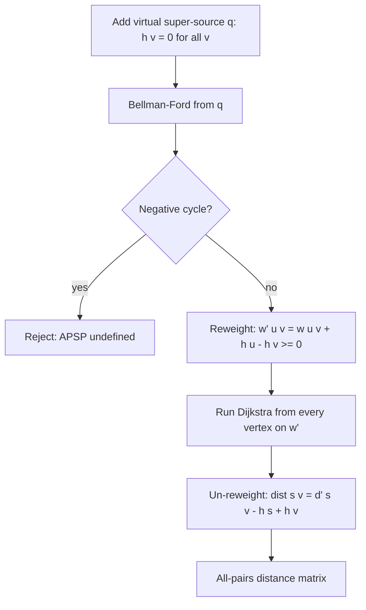

# Johnson's Algorithm — Junior Level

> **One-line summary:** Johnson's algorithm computes the shortest path between **every pair** of vertices on a **sparse** graph that may have **negative edge weights**, by first running Bellman-Ford from a virtual super-source to compute *potentials* `h(v)`, then *reweighting* every edge to be non-negative so that Dijkstra can be run from every vertex — total time `O(V·E·log V)`, which beats Floyd-Warshall's `O(V³)` on sparse graphs.

---

## Table of Contents

1. [Introduction](#introduction)
2. [Prerequisites](#prerequisites)
3. [Glossary](#glossary)
4. [Core Concepts](#core-concepts)
5. [Big-O Summary](#big-o-summary)
6. [Real-World Analogies](#real-world-analogies)
7. [Pros & Cons](#pros--cons)
8. [Step-by-Step Walkthrough](#step-by-step-walkthrough)
9. [Code Examples](#code-examples)
10. [Coding Patterns](#coding-patterns)
11. [Error Handling](#error-handling)
12. [Performance Tips](#performance-tips)
13. [Best Practices](#best-practices)
14. [Edge Cases & Pitfalls](#edge-cases--pitfalls)
15. [Common Mistakes](#common-mistakes)
16. [Cheat Sheet](#cheat-sheet)
17. [Visual Animation](#visual-animation)
18. [Summary](#summary)
19. [Further Reading](#further-reading)

---

## Introduction

**Johnson's algorithm** solves the *all-pairs shortest path* (APSP) problem — the shortest distance from **every** vertex to **every other** vertex — but it is designed for a specific situation that the simpler Floyd-Warshall algorithm handles poorly:

> a **sparse** graph (few edges) that **may contain negative edge weights** (but no negative cycle).

You already know two single-source shortest-path tools:

- **Dijkstra** is fast (`O(E log V)` with a binary heap) and great for sparse graphs — but it **breaks on negative edges**. Its greedy "settle the nearest vertex and never revisit" logic assumes no edge can later reduce a finalized distance, which negative edges violate.
- **Bellman-Ford** handles negative edges (`O(V·E)`) and detects negative cycles — but it is slower, and running it from every vertex costs `O(V²·E)`, which is awful.

Johnson's clever insight is to **combine** them. It runs Bellman-Ford **once** to produce a set of numbers — one per vertex — called *potentials* `h(v)`. These potentials are used to **reweight** every edge with the formula:

```
w'(u, v) = w(u, v) + h(u) - h(v)
```

This transformation has two magical properties:

1. **Every reweighted edge `w'(u, v)` is non-negative.** (So Dijkstra becomes legal.)
2. **Shortest paths are preserved.** The *route* that was shortest under the original weights is still shortest under the new weights — only the numbers change in a predictable, reversible way.

With all-non-negative weights, you run **Dijkstra from every vertex** (cheap on sparse graphs), then **un-reweight** each computed distance back to the true value. Total cost:

```
O(V·E)  (one Bellman-Ford)  +  V × O(E log V)  (V Dijkstras)  =  O(V·E·log V)
```

On a sparse graph (`E ≈ V`), that is roughly `O(V² log V)` — dramatically faster than Floyd-Warshall's `O(V³)`. Johnson's is "the best of both worlds": Bellman-Ford's tolerance for negatives plus Dijkstra's speed.

---

## Prerequisites

Before reading this file you should be comfortable with:

- **Graph basics** — vertices, directed edges, edge weights (see `01-representation`).
- **Dijkstra's algorithm** — single-source shortest path on **non-negative** weights using a min-heap (`04-dijkstra`).
- **Bellman-Ford** — single-source shortest path that **tolerates negative edges** and **detects negative cycles** (`05-bellman-ford`).
- **The idea of "shortest path"** — a path minimizing the sum of edge weights.
- **Big-O notation** — `O(V·E log V)`, `O(V³)`, `O(V·E)`.
- **Priority queue / binary heap** — Dijkstra's engine.

Optional but helpful:

- Floyd-Warshall (`06-floyd-warshall`) — the alternative APSP algorithm Johnson's competes with.
- The notion of "infinity as a sentinel" for unreachable vertices.

---

## Glossary

| Term | Meaning |
|------|---------|
| **All-pairs shortest path (APSP)** | The shortest distance between every ordered pair `(u, v)`. |
| **Sparse graph** | A graph with few edges (`E ≈ V`); Johnson's sweet spot. |
| **Dense graph** | A graph with many edges (`E ≈ V²`); Floyd-Warshall is usually better here. |
| **Potential `h(v)`** | A number assigned to each vertex `v`, computed by Bellman-Ford from a super-source. |
| **Super-source `q`** | A virtual extra vertex connected to *every* real vertex with a weight-0 edge. |
| **Reweighting** | Replacing each weight `w(u,v)` with `w'(u,v) = w(u,v) + h(u) - h(v)`. |
| **Reweighted weight `w'`** | The transformed, guaranteed-non-negative edge weight. |
| **Negative edge** | An edge with weight `< 0`. Allowed (no negative cycle). |
| **Negative cycle** | A cycle whose total weight is negative — makes shortest paths undefined; Johnson's detects and rejects it. |
| **Relaxation** | The core update step in both Bellman-Ford and Dijkstra. |
| **Bellman-Ford** | Single-source SP that handles negatives, used here for the potential pass. |
| **Dijkstra** | Fast single-source SP for non-negative weights, run once per vertex. |

---

## Core Concepts

### 1. The Problem Johnson's Solves

You want all-pairs shortest paths, and:

- Your graph is **sparse** (so Floyd-Warshall's `O(V³)` is wasteful).
- Your graph **has negative edges** (so you cannot just run Dijkstra from every vertex).

If you had **no** negative edges, the answer would be trivial: run Dijkstra `V` times, `O(V·E log V)`. The negative edges are the only obstacle. Johnson's removes that obstacle.

### 2. The Super-Source and Bellman-Ford Pass

Add a **virtual vertex** `q` (the super-source) and connect it to *every* real vertex with a **weight-0 edge**: `q → v` with weight 0 for all `v`. Crucially, `q` has **no incoming edges**, so adding it cannot create a new cycle and cannot change any shortest path among the real vertices.

Now run **Bellman-Ford from `q`**. Define:

```
h(v) = shortest distance from q to v   (the "potential" of v)
```

Because `q → v` is a direct weight-0 edge, `h(v) ≤ 0` for every reachable `v` (the path `q → v` costs 0, and negative edges may make it even smaller). If Bellman-Ford detects a **negative cycle** during this pass, Johnson's **stops** — APSP is undefined.

### 3. The Reweighting Formula

For every edge `(u, v)` with original weight `w(u, v)`, define the new weight:

```
w'(u, v) = w(u, v) + h(u) - h(v)
```

**Claim 1 — non-negativity.** Bellman-Ford guarantees the *triangle inequality* for the shortest-distance function: `h(v) ≤ h(u) + w(u, v)` for every edge. Rearranging gives `w(u, v) + h(u) - h(v) ≥ 0`, i.e. `w'(u, v) ≥ 0`. Every reweighted edge is non-negative — exactly what Dijkstra needs.

**Claim 2 — shortest paths preserved.** Consider any path `p = v₀ → v₁ → … → vₖ`. Its reweighted length is:

```
w'(p) = Σ w'(vᵢ, vᵢ₊₁)
      = Σ (w(vᵢ, vᵢ₊₁) + h(vᵢ) - h(vᵢ₊₁))
      = w(p) + h(v₀) - h(vₖ)        ← the middle terms telescope and cancel!
```

The `h` terms in the middle telescope away, leaving only `h(v₀) - h(vₖ)`, which depends **only on the endpoints**, not on the route taken. So *every* path from `v₀` to `vₖ` shifts by the **same** constant — meaning the *ordering* of paths by length is unchanged. The shortest path stays the shortest path.

### 4. Run Dijkstra From Every Vertex, Then Un-Reweight

With non-negative `w'`, run **Dijkstra from each vertex `s`** to get reweighted distances `δ'(s, v)`. Recover the true distance by inverting the shift:

```
δ(s, v) = δ'(s, v) - h(s) + h(v)
```

(This is just the telescoping formula solved for `w(p)`: `w(p) = w'(p) - h(v₀) + h(vₖ)`.)

Do this for all `V` sources and you have the full all-pairs distance matrix.

### 5. The Whole Pipeline

```
1. Add super-source q with 0-weight edges q→v for all v.
2. Bellman-Ford from q  →  potentials h(v)   (reject if negative cycle).
3. Reweight: w'(u,v) = w(u,v) + h(u) - h(v)  ≥ 0.
4. For each vertex s: Dijkstra on w'  →  δ'(s, ·).
5. Un-reweight: δ(s,v) = δ'(s,v) - h(s) + h(v).
```

---

## Big-O Summary

| Aspect | Complexity | Notes |
|--------|------------|-------|
| Bellman-Ford (potential pass) | **O(V·E)** | Run once from the super-source. |
| Reweighting all edges | **O(E)** | One sweep over the edge list. |
| `V` × Dijkstra (binary heap) | **O(V·E·log V)** | The dominant term. |
| Un-reweighting distances | **O(V²)** | One subtraction per pair. |
| **Total time** | **O(V·E·log V)** | Beats `O(V³)` when sparse. |
| Total time (Fibonacci heap) | O(V² log V + V·E) | Theoretical best for Dijkstra. |
| Space | **O(V²)** | The output distance matrix (plus `O(V + E)` graph). |
| Negative edges | Supported | The whole point. |
| Negative cycle | Detected (Bellman-Ford) | Algorithm rejects the input. |

Compare: Floyd-Warshall is `O(V³)` regardless of density. On a **sparse** graph (`E = O(V)`), Johnson's is `O(V² log V)` — far better. On a **dense** graph (`E = O(V²)`), Johnson's becomes `O(V³ log V)` — *worse* than Floyd-Warshall by a log factor, plus far more code.

---

## Real-World Analogies

| Concept | Analogy |
|---------|---------|
| Potential `h(v)` | An **altitude** assigned to each city. Going downhill (negative edge) gets a "credit," going uphill costs extra — but the reweighting cancels the altitude difference so distances stay fair. |
| Reweighting | Re-pricing every flight so no fare is negative (airlines hate paying you to fly), while keeping the *cheapest itinerary* between any two cities unchanged. |
| Super-source `q` | A neutral "headquarters" with a free (0-cost) road to every city, used only to measure each city's baseline altitude `h(v)`. |
| Telescoping cancellation | A toll system where entering a city *charges* `h(u)` and leaving *refunds* `h(v)`; over a whole trip the intermediate charges and refunds cancel, so only the start and end altitudes matter. |
| Running Dijkstra `V` times | Once all fares are non-negative, you can use the fast GPS (Dijkstra) from each city instead of the slow but negative-tolerant planner (Bellman-Ford). |

Where the analogy breaks: altitudes here are *computed* (by Bellman-Ford), not physical, and they can be any real number — the only requirement is that they satisfy the triangle inequality so reweighted edges stay non-negative.

---

## Pros & Cons

| Pros | Cons |
|------|------|
| Handles **negative edges** on sparse graphs. | More code than Floyd-Warshall (Bellman-Ford + reweight + `V` Dijkstras). |
| `O(V·E·log V)` — **fast on sparse graphs**. | On **dense** graphs it loses to Floyd-Warshall (`O(V³ log V)` vs `O(V³)`). |
| Detects negative cycles (via Bellman-Ford). | Needs a correct Dijkstra **and** a correct Bellman-Ford. |
| Reuses two algorithms you already know. | Reweighting/un-reweighting is an easy place to introduce bugs. |
| Each Dijkstra is independent → easy to parallelize. | `O(V²)` output memory, like all APSP methods. |

**When to use:** sparse graph, negative edges (no negative cycle), you need *all* pairs.

**When NOT to use:** dense graphs (use Floyd-Warshall), non-negative weights (just run `V`× Dijkstra directly — no reweighting needed), or single-source only (use plain Dijkstra/Bellman-Ford).

---

## Step-by-Step Walkthrough

Take a small directed graph with a **negative edge**:

```
vertices: 0, 1, 2, 3
edges:  0→1 (-2),  1→2 (-1),  2→3 (2),  0→3 (10),  3→1 (4)
```

**Step 1 — Add super-source `q` (call it vertex 4).** Add `4→0, 4→1, 4→2, 4→3`, each weight 0.

**Step 2 — Bellman-Ford from `q`** gives potentials `h(v)` = shortest distance from `q`:

```
h(0) = 0          (q→0 directly, cost 0)
h(1) = -2         (q→0→1 = 0 + (-2))
h(2) = -3         (q→0→1→2 = 0 + (-2) + (-1))
h(3) = -1         (q→0→1→2→3 = -3 + 2 = -1)
```

No negative cycle is found, so we proceed.

**Step 3 — Reweight** each edge with `w'(u,v) = w(u,v) + h(u) - h(v)`:

```
0→1:  -2 + h(0) - h(1) =  -2 + 0  - (-2) =  0   ✓ ≥ 0
1→2:  -1 + h(1) - h(2) =  -1 + (-2) - (-3) =  0   ✓ ≥ 0
2→3:   2 + h(2) - h(3) =   2 + (-3) - (-1) =  0   ✓ ≥ 0
0→3:  10 + h(0) - h(3) =  10 + 0  - (-1) = 11   ✓ ≥ 0
3→1:   4 + h(3) - h(1) =   4 + (-1) - (-2) =  5   ✓ ≥ 0
```

Every `w'` is non-negative — Dijkstra is now legal.

**Step 4 — Dijkstra from vertex 0** on the reweighted graph gives `δ'(0, ·)`:

```
δ'(0,0) = 0
δ'(0,1) = 0     (0→1, w'=0)
δ'(0,2) = 0     (0→1→2, w'=0+0)
δ'(0,3) = 0     (0→1→2→3, w'=0+0+0)
```

**Step 5 — Un-reweight** with `δ(0,v) = δ'(0,v) - h(0) + h(v)`:

```
δ(0,0) = 0 - 0 + 0   = 0
δ(0,1) = 0 - 0 + (-2) = -2     (path 0→1, true cost -2) ✓
δ(0,2) = 0 - 0 + (-3) = -3     (path 0→1→2, true cost -3) ✓
δ(0,3) = 0 - 0 + (-1) = -1     (path 0→1→2→3, true cost -1, beats direct 0→3 = 10) ✓
```

Repeat steps 4–5 from every vertex to fill the whole matrix. Notice the reweighted Dijkstra found the *route* `0→1→2→3` (correct!), and un-reweighting recovered its true negative cost.

---

## Code Examples

### Example: Full Johnson's Algorithm

We implement the entire pipeline: Bellman-Ford for potentials, reweighting, then Dijkstra from each vertex, then un-reweighting.

#### Go

```go
package main

import (
	"container/heap"
	"fmt"
	"math"
)

type Edge struct{ to, w int }

// item for Dijkstra's priority queue
type item struct{ node, dist int }
type pq []item

func (p pq) Len() int            { return len(p) }
func (p pq) Less(a, b int) bool  { return p[a].dist < p[b].dist }
func (p pq) Swap(a, b int)       { p[a], p[b] = p[b], p[a] }
func (p *pq) Push(x interface{}) { *p = append(*p, x.(item)) }
func (p *pq) Pop() interface{} {
	old := *p
	n := len(old)
	it := old[n-1]
	*p = old[:n-1]
	return it
}

const INF = math.MaxInt64 / 4

// johnson returns the all-pairs distance matrix, or (nil, false) if a negative cycle exists.
func johnson(n int, edges [][3]int) ([][]int, bool) {
	// adjacency list of the real graph
	adj := make([][]Edge, n)
	for _, e := range edges {
		adj[e[0]] = append(adj[e[0]], Edge{e[1], e[2]})
	}

	// --- Step 1 & 2: Bellman-Ford from a virtual super-source q ---
	// h[v] starts at 0 (q->v has weight 0), then relax all real edges V times.
	h := make([]int, n)
	for i := 0; i < n+1; i++ {
		changed := false
		for u := 0; u < n; u++ {
			for _, e := range adj[u] {
				if h[u]+e.w < h[e.to] {
					h[e.to] = h[u] + e.w
					changed = true
					if i == n { // still improving on the (V+1)-th pass => negative cycle
						return nil, false
					}
				}
			}
		}
		if !changed {
			break
		}
	}

	// --- Step 3: reweight edges so every w' >= 0 ---
	radj := make([][]Edge, n)
	for u := 0; u < n; u++ {
		for _, e := range adj[u] {
			radj[u] = append(radj[u], Edge{e.to, e.w + h[u] - h[e.to]})
		}
	}

	// --- Step 4 & 5: Dijkstra from every source, then un-reweight ---
	dist := make([][]int, n)
	for s := 0; s < n; s++ {
		dist[s] = dijkstra(n, radj, s)
		for v := 0; v < n; v++ {
			if dist[s][v] < INF {
				dist[s][v] = dist[s][v] - h[s] + h[v] // recover true distance
			}
		}
	}
	return dist, true
}

func dijkstra(n int, radj [][]Edge, src int) []int {
	d := make([]int, n)
	for i := range d {
		d[i] = INF
	}
	d[src] = 0
	q := &pq{{src, 0}}
	for q.Len() > 0 {
		it := heap.Pop(q).(item)
		if it.dist > d[it.node] {
			continue
		}
		for _, e := range radj[it.node] {
			if d[it.node]+e.w < d[e.to] {
				d[e.to] = d[it.node] + e.w
				heap.Push(q, item{e.to, d[e.to]})
			}
		}
	}
	return d
}

func main() {
	edges := [][3]int{
		{0, 1, -2}, {1, 2, -1}, {2, 3, 2}, {0, 3, 10}, {3, 1, 4},
	}
	dist, ok := johnson(4, edges)
	fmt.Println("no negative cycle:", ok)
	fmt.Println("dist[0]:", dist[0]) // [0 -2 -3 -1]
}
```

#### Java

```java
import java.util.*;

public class Johnson {
    static final int INF = Integer.MAX_VALUE / 4;

    static int[][] johnson(int n, int[][] edges) {
        List<int[]>[] adj = new List[n];
        for (int i = 0; i < n; i++) adj[i] = new ArrayList<>();
        for (int[] e : edges) adj[e[0]].add(new int[]{e[1], e[2]});

        // Step 1 & 2: Bellman-Ford from super-source q (h starts at 0 for all).
        int[] h = new int[n];
        for (int it = 0; it <= n; it++) {
            boolean changed = false;
            for (int u = 0; u < n; u++)
                for (int[] e : adj[u])
                    if (h[u] + e[1] < h[e[0]]) {
                        h[e[0]] = h[u] + e[1];
                        changed = true;
                        if (it == n) return null; // negative cycle
                    }
            if (!changed) break;
        }

        // Step 3: reweight.
        List<int[]>[] radj = new List[n];
        for (int u = 0; u < n; u++) {
            radj[u] = new ArrayList<>();
            for (int[] e : adj[u])
                radj[u].add(new int[]{e[0], e[1] + h[u] - h[e[0]]});
        }

        // Step 4 & 5: Dijkstra per source, then un-reweight.
        int[][] dist = new int[n][];
        for (int s = 0; s < n; s++) {
            dist[s] = dijkstra(n, radj, s);
            for (int v = 0; v < n; v++)
                if (dist[s][v] < INF)
                    dist[s][v] = dist[s][v] - h[s] + h[v];
        }
        return dist;
    }

    static int[] dijkstra(int n, List<int[]>[] radj, int src) {
        int[] d = new int[n];
        Arrays.fill(d, INF);
        d[src] = 0;
        PriorityQueue<int[]> pq = new PriorityQueue<>((a, b) -> a[1] - b[1]);
        pq.add(new int[]{src, 0});
        while (!pq.isEmpty()) {
            int[] cur = pq.poll();
            if (cur[1] > d[cur[0]]) continue;
            for (int[] e : radj[cur[0]])
                if (d[cur[0]] + e[1] < d[e[0]]) {
                    d[e[0]] = d[cur[0]] + e[1];
                    pq.add(new int[]{e[0], d[e[0]]});
                }
        }
        return d;
    }

    public static void main(String[] args) {
        int[][] edges = {{0, 1, -2}, {1, 2, -1}, {2, 3, 2}, {0, 3, 10}, {3, 1, 4}};
        int[][] dist = johnson(4, edges);
        System.out.println(Arrays.toString(dist[0])); // [0, -2, -3, -1]
    }
}
```

#### Python

```python
import heapq


def johnson(n, edges):
    INF = float("inf")
    adj = [[] for _ in range(n)]
    for u, v, w in edges:
        adj[u].append((v, w))

    # Step 1 & 2: Bellman-Ford from super-source q (h starts at 0).
    h = [0] * n
    for it in range(n + 1):
        changed = False
        for u in range(n):
            for v, w in adj[u]:
                if h[u] + w < h[v]:
                    h[v] = h[u] + w
                    changed = True
                    if it == n:          # still improving => negative cycle
                        return None
        if not changed:
            break

    # Step 3: reweight so every w' >= 0.
    radj = [[(v, w + h[u] - h[v]) for v, w in adj[u]] for u in range(n)]

    # Step 4 & 5: Dijkstra per source, then un-reweight.
    dist = []
    for s in range(n):
        d = dijkstra(n, radj, s)
        dist.append([d[v] - h[s] + h[v] if d[v] < INF else INF for v in range(n)])
    return dist


def dijkstra(n, radj, src):
    INF = float("inf")
    d = [INF] * n
    d[src] = 0
    pq = [(0, src)]
    while pq:
        du, u = heapq.heappop(pq)
        if du > d[u]:
            continue
        for v, w in radj[u]:
            if du + w < d[v]:
                d[v] = du + w
                heapq.heappush(pq, (d[v], v))
    return d


if __name__ == "__main__":
    edges = [(0, 1, -2), (1, 2, -1), (2, 3, 2), (0, 3, 10), (3, 1, 4)]
    dist = johnson(4, edges)
    print(dist[0])  # [0, -2, -3, -1]
```

**What it does:** runs the full Johnson pipeline and prints the shortest distances from vertex 0: `[0, -2, -3, -1]`, recovering the correct negative distances despite using Dijkstra internally.
**Run:** `go run main.go` | `javac Johnson.java && java Johnson` | `python johnson.py`

---

## Coding Patterns

### Pattern 1: The Super-Source Without Extra Edges

**Intent:** You do not actually need to materialize the super-source `q` and its `V` edges. Just initialize `h[v] = 0` for all `v` and run Bellman-Ford. Initializing every potential to 0 is *equivalent* to having a 0-weight edge from `q` to each vertex.

```python
h = [0] * n           # same as: dist from q with q->v weight 0 for all v
# then relax all real edges V times (standard Bellman-Ford)
```

### Pattern 2: Skip Reweighting if All Weights Are Non-Negative

**Intent:** If the graph has no negative edges, skip Bellman-Ford and reweighting entirely — just run `V`× Dijkstra. Johnson's only earns its keep when negatives are present.

```python
if all(w >= 0 for _, _, w in edges):
    return [dijkstra(n, adj, s) for s in range(n)]   # no reweighting needed
```

### Pattern 3: Detect Negative Cycle Early

**Intent:** Run the Bellman-Ford pass for one extra (the `V`-th) iteration; any relaxation that still improves a distance signals a negative cycle. Reject the input before wasting time on `V` Dijkstras.



---

## Error Handling

| Error | Cause | Fix |
|-------|-------|-----|
| Wrong (too-large) distances | Forgot to un-reweight, returning `δ'` instead of `δ`. | Apply `δ(s,v) = δ'(s,v) - h(s) + h(v)` to every finite distance. |
| Negative `w'` slips through | Bellman-Ford did not converge (too few iterations). | Run exactly `V-1` relaxation passes (plus one detection pass). |
| Crash on negative cycle | Ran Dijkstra anyway on a graph with a negative cycle. | Detect in Bellman-Ford first; reject the input. |
| Integer overflow | Adding `INF + w` or un-reweighting an `INF` distance. | Use `INF = MAX/4` and only un-reweight **finite** distances. |
| Dijkstra returns negatives | A reweighted edge was actually negative (bug in `h`). | Assert `w'(u,v) ≥ 0` for every edge after reweighting. |

---

## Performance Tips

- **Don't build the super-source explicitly.** Initialize `h[v] = 0` and relax real edges only — saves `V` fake edges and is provably equivalent.
- **Use a binary heap** (`container/heap`, `PriorityQueue`, `heapq`) for each Dijkstra — that is what gives the `log V` factor.
- **Reuse one adjacency list.** Reweight in place or store `w'` once; don't recompute it per source.
- **Parallelize the `V` Dijkstras.** They are completely independent (read-only reweighted graph), so they fan out across cores trivially.
- **Skip Johnson's overhead on non-negative graphs** — just run `V`× Dijkstra directly.
- **Only un-reweight finite distances** — guard against touching `INF`.

---

## Best Practices

- Initialize potentials to `0` (the implicit super-source) rather than building fake edges.
- Always run the negative-cycle detection pass; never assume the input is clean.
- After reweighting, assert every `w'(u, v) ≥ 0` in tests — it catches potential bugs immediately.
- Keep the reweighting and un-reweighting symmetric and in clearly-named helper functions.
- Document that the result is `O(V²)` memory; for huge `V` consider computing row-by-row on demand.
- Comment *why* you chose Johnson's over Floyd-Warshall (sparse + negatives) so future readers understand.

---

## Edge Cases & Pitfalls

- **Negative cycle** — must be detected by Bellman-Ford; APSP is undefined, so reject.
- **Disconnected vertices** — some `δ(s, v)` stay `INF`; don't un-reweight those.
- **Forgetting to un-reweight** — the single most common bug; you get shifted, wrong distances.
- **All-non-negative graph** — Johnson's still works but is pure overhead; just run Dijkstra `V` times.
- **Self-loops / parallel edges** — keep the minimum weight; a negative self-loop is itself a negative cycle.
- **Single vertex / empty graph** — handle `n ≤ 1` gracefully (trivially the zero matrix).

---

## Common Mistakes

1. **Returning reweighted distances** without applying `- h(s) + h(v)` — wrong answers everywhere.
2. **Skipping negative-cycle detection** — then Dijkstra loops or returns nonsense.
3. **Too few Bellman-Ford passes** — potentials don't converge, so some `w'` end up negative.
4. **Building the super-source with edges** *into* `q` — `q` must have only *outgoing* edges.
5. **Un-reweighting `INF`** — overflow or garbage; only adjust finite distances.
6. **Using Johnson's on a dense graph** — Floyd-Warshall's `O(V³)` is simpler and faster there.

---

## Cheat Sheet

| Item | Value |
|------|-------|
| Problem | All-pairs shortest path (APSP) |
| Time | O(V·E·log V) |
| Space | O(V²) |
| Negative edges | Yes |
| Negative cycles | Detected (Bellman-Ford), rejected |
| Best regime | **Sparse** graph with negative edges |
| Beats Floyd-Warshall when | `E ≪ V²` (sparse) |

The five steps:

```
1. h[v] = 0 for all v          (implicit super-source)
2. Bellman-Ford from q → h(v)  (reject if negative cycle)
3. w'(u,v) = w(u,v) + h(u) - h(v)   ≥ 0
4. Dijkstra from each s → δ'(s, ·)
5. δ(s,v) = δ'(s,v) - h(s) + h(v)
```

Key formulas:

```
reweight:    w'(u,v) = w(u,v) + h(u) - h(v)
un-reweight: δ(s,v)  = δ'(s,v) - h(s) + h(v)
```

---

## Visual Animation

> See [`animation.html`](./animation.html) for an interactive visual animation of Johnson's algorithm.
>
> The animation demonstrates:
> - The super-source `q` connected to every vertex with 0-weight edges
> - The Bellman-Ford potential pass computing `h(v)`
> - Each edge being reweighted to a non-negative `w'`
> - Dijkstra running from each source on the reweighted graph
> - Un-reweighting back to true distances
> - Step / Run / Reset controls and an operation log

---

## Summary

Johnson's algorithm is the right tool for **all-pairs shortest paths on sparse graphs with negative edges**. It combines two algorithms you already know: one **Bellman-Ford** pass from a virtual super-source computes a *potential* `h(v)` for every vertex, then the *reweighting* `w'(u,v) = w(u,v) + h(u) - h(v)` makes every edge non-negative **while preserving which path is shortest** (because the `h` terms telescope and cancel along any path). With non-negative weights, you run the fast **Dijkstra from every vertex**, then *un-reweight* each distance with `δ(s,v) = δ'(s,v) - h(s) + h(v)`. Total time `O(V·E·log V)` beats Floyd-Warshall's `O(V³)` on sparse graphs. Master the two formulas, always detect negative cycles, and never forget to un-reweight.

---

## Further Reading

- *Introduction to Algorithms* (CLRS), Chapter 25.3 — "Johnson's algorithm for sparse graphs."
- Donald B. Johnson, *Efficient algorithms for shortest paths in sparse networks*, JACM 24(1):1–13, 1977.
- Sibling topics: `04-dijkstra`, `05-bellman-ford` (the two building blocks), `06-floyd-warshall` (the dense-graph alternative).
- cp-algorithms.com — "Dijkstra," "Bellman-Ford," and shortest-path comparisons.
- visualgo.net — "Single-Source / All-Pairs Shortest Paths" interactive visualization.

---

**Next step:** Continue to [`middle.md`](./middle.md) to learn *why* the reweighting works, *when* Johnson's beats Floyd-Warshall and `V`×Dijkstra, and how the potential method generalizes.
