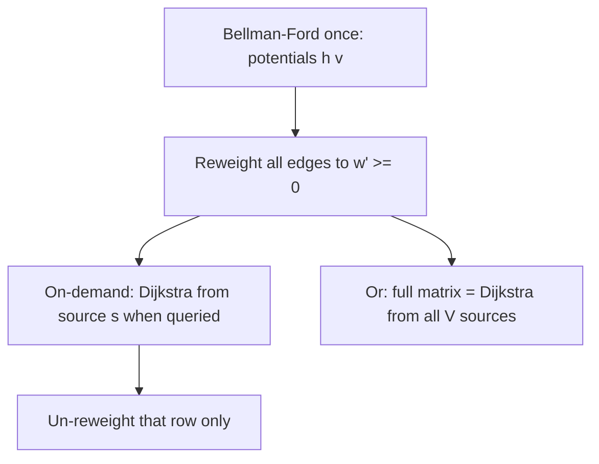
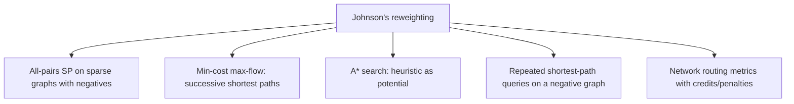

# Johnson's Algorithm — Middle Level

> **Focus:** Why reweighting preserves shortest paths, why the potentials must satisfy the triangle inequality, when Johnson's beats Floyd-Warshall and plain `V`×Dijkstra, and how the *potential method* connects Johnson's, A*, and min-cost flow.

---

## Table of Contents

1. [Introduction](#introduction)
2. [Deeper Concepts](#deeper-concepts)
3. [Comparison with Alternatives](#comparison-with-alternatives)
4. [Advanced Patterns](#advanced-patterns)
5. [Graph Applications](#graph-applications)
6. [Algorithmic Integration](#algorithmic-integration)
7. [Code Examples](#code-examples)
8. [Error Handling](#error-handling)
9. [Performance Analysis](#performance-analysis)
10. [Best Practices](#best-practices)
11. [Visual Animation](#visual-animation)
12. [Summary](#summary)

---

## Introduction

At junior level Johnson's is "Bellman-Ford to get potentials, reweight, then Dijkstra from everyone." At middle level you start asking the questions that decide whether you ship a correct, well-chosen implementation:

- *Why* does `w'(u,v) = w(u,v) + h(u) - h(v)` keep every reweighted edge non-negative?
- *Why* does it preserve the **shortest path** and not just shift distances arbitrarily?
- *Why* must the potentials `h` come from Bellman-Ford (or any function satisfying the triangle inequality) rather than arbitrary numbers?
- *When* does Johnson's `O(V·E·log V)` actually beat Floyd-Warshall's `O(V³)` — and when does it lose?
- *How* is reweighting the same "potential" trick used in A* search and min-cost flow?

These distinctions are the difference between recognizing Johnson's as a niche curiosity and wielding it as the standard answer to "all-pairs shortest paths on a sparse graph with some negative edges."

---

## Deeper Concepts

### The potential function and the triangle inequality

A **potential** is any function `h : V → ℝ` assigning a real number to each vertex. Johnson's reweighting is:

```
w'(u, v) = w(u, v) + h(u) - h(v)
```

For Dijkstra to be valid we need **`w'(u, v) ≥ 0` for every edge**, which rearranges to:

```
h(v) ≤ h(u) + w(u, v)        ← the triangle inequality for h
```

This is *exactly* the condition that the shortest-distance function satisfies. So the natural choice for `h` is "shortest distance from some source to `v`." Johnson's picks the source to be a **super-source `q`** connected to every vertex with a 0-weight edge, guaranteeing `q` can reach every vertex, so `h(v) = δ(q, v)` is finite for all `v`. Because shortest distances obey the triangle inequality by definition, every `w'` comes out non-negative.

**Key realization:** *any* `h` satisfying the triangle inequality works. The super-source is just the cleanest way to manufacture such an `h` that is defined on *all* vertices. (A single real source might not reach every vertex; the super-source always does.)

### The telescoping proof of path preservation

Take any path `p = v₀ → v₁ → ⋯ → vₖ`. Its reweighted length is:

```
w'(p) = Σᵢ w'(vᵢ, vᵢ₊₁)
      = Σᵢ [ w(vᵢ, vᵢ₊₁) + h(vᵢ) - h(vᵢ₊₁) ]
      = [ Σᵢ w(vᵢ, vᵢ₊₁) ] + [ h(v₀) - h(v₁) + h(v₁) - h(v₂) + ⋯ + h(vₖ₋₁) - h(vₖ) ]
      = w(p) + h(v₀) - h(vₖ)
```

Every interior `h(vᵢ)` appears once with `+` and once with `-`, so it **cancels** (telescopes). What remains, `h(v₀) - h(vₖ)`, depends **only on the endpoints `v₀` and `vₖ`**, not on which path you took.

Consequence: for *any* fixed pair `(s, t)`, **every** `s→t` path has its length shifted by the *same* constant `h(s) - h(t)`. Adding the same constant to every candidate cannot change which one is smallest. Therefore:

```
argmin over paths p of w'(p) = argmin over paths p of w(p)
```

The shortest reweighted path **is** the shortest original path — only its numeric value differs, and that value is recovered by `δ(s,t) = δ'(s,t) + h(t) - h(s)` (equivalently `δ'(s,t) - h(s) + h(t)`).

### Why a single source isn't enough — the super-source

If you tried to compute potentials by running Bellman-Ford from one *real* vertex `r`, then `h(v) = δ(r, v)` would be `+∞` for any vertex `r` cannot reach. An infinite potential makes `w'(u, v) = w(u,v) + h(u) - h(v)` ill-defined (∞ − ∞). The **super-source `q`** with 0-weight edges to every vertex sidesteps this: `q` reaches *everything*, so every `h(v)` is finite. And because `q` has **no incoming edges**, it cannot lie on any cycle and cannot alter shortest paths among the real vertices — it is a pure measurement device.

### Why `h(v) ≤ 0`

Since `q → v` is a direct 0-weight edge, the shortest path from `q` to `v` is at most 0; negative edges can only push it lower. So `h(v) ≤ 0` for every reachable `v`. This is a useful sanity check (and a debugging assertion) but not required for correctness — what *is* required is the triangle inequality.

---

## Comparison with Alternatives

| Attribute | Johnson's | Floyd-Warshall | V × Dijkstra (no negatives) | V × Bellman-Ford |
|-----------|-----------|----------------|------------------------------|------------------|
| Problem | All-pairs | All-pairs | All-pairs | All-pairs |
| Time | `O(V·E·log V)` | `O(V³)` | `O(V·E·log V)` | `O(V²·E)` |
| Negative edges | **Yes** (reweight) | **Yes** | **No** | **Yes** |
| Negative cycles | **Detects** | **Detects** | n/a | **Detects** |
| Best on | **Sparse + negatives** | Dense (any weights) | Sparse, non-negative | Rarely optimal |
| Code size | Large (BF + reweight + V Dijkstra) | Tiny (3 loops) | Medium | Medium |
| Memory | `O(V²)` out + `O(V+E)` | `O(V²)` | `O(V²)` out | `O(V²)` out |

**Rules of thumb:**

- **Sparse graph (`E ≈ V`) with negative edges, no negative cycle:** **Johnson's.** `O(V² log V)` crushes Floyd-Warshall's `O(V³)`.
- **Sparse graph, non-negative weights:** skip the reweighting — just run **`V`× Dijkstra** directly (`O(V·E log V)`). Johnson's would be pure overhead.
- **Dense graph (`E ≈ V²`), any weights:** **Floyd-Warshall.** `O(V³)` beats Johnson's `O(V³ log V)`, and the code is three lines.
- **You only need one source:** never use any APSP method — use Dijkstra (non-negative) or Bellman-Ford (negatives).

### The crossover, concretely

The asymptotic comparison is `V·E·log V` (Johnson's) vs `V³` (Floyd-Warshall). Set them equal: Johnson's wins when `E·log V < V²`, i.e. roughly `E < V² / log V`. For `V = 1000`, `log V ≈ 10`, so Johnson's wins whenever `E < 100,000` — and a complete graph has `~10⁶` edges. So for anything but near-complete graphs, Johnson's is asymptotically ahead. The catch is the **constant factor**: Floyd-Warshall's inner loop is two arithmetic ops on a contiguous matrix (extremely cache-friendly), while Johnson's pays heap overhead and pointer-chasing per Dijkstra. So on *moderately* dense graphs of a few hundred vertices, Floyd-Warshall often wins wall-clock despite the worse asymptotics. The clean win for Johnson's is **genuinely sparse** graphs.

---

## Advanced Patterns

### Pattern: Reweighting as a reusable subroutine

The reweighting step is independent of *what* you do afterward. Once you have a valid potential `h`, you can reweight and then run **any** non-negative-weight shortest-path algorithm — Dijkstra, A*, bidirectional search, or a k-shortest-paths routine. Johnson's is "compute a potential, then unlock the fast tools." This decoupling is worth internalizing:

```text
h = potentials satisfying  h(v) ≤ h(u) + w(u,v)   for all edges
w'(u,v) = w(u,v) + h(u) - h(v)   ≥ 0               (Dijkstra-safe)
δ(s,t) = δ'(s,t) - h(s) + h(t)                     (recover truth)
```

### Pattern: A* search is Johnson's reweighting with a heuristic potential

A* search on non-negative graphs uses a **heuristic** `h(v)` estimating the remaining distance to the goal, and explores in order of `g(v) + h(v)`. If the heuristic is **consistent** (`h(v) ≤ w(v, u) + h(u)`), then running Dijkstra with priority `g(v) + h(v)` is *exactly* Dijkstra on the reweighted graph `w'(v,u) = w(v,u) + h(u) - h(v)`. So **A* is Johnson's reweighting applied with an admissible/consistent heuristic instead of a Bellman-Ford-computed potential.** Recognizing this unifies two algorithms that are usually taught separately.

### Pattern: Min-cost flow uses Johnson's potentials per iteration

The **successive-shortest-paths** algorithm for min-cost max-flow repeatedly finds a shortest augmenting path in a residual graph that has **negative edges** (because pushing flow back along an edge has negative cost). Running Bellman-Ford every iteration would be slow. Instead, you maintain **potentials** (often called the *Johnson reweighting* in this context): one initial Bellman-Ford, then after each augmentation update `h(v) += δ'(s, v)`, keeping reduced costs non-negative so each subsequent shortest path is found by fast **Dijkstra**. This is Johnson's idea applied *incrementally* inside a larger algorithm — arguably its most important practical use.

### Pattern: Lazy / on-demand Johnson's

You do not have to compute the full `V²` matrix. Compute the potentials **once** (one Bellman-Ford), then run Dijkstra only from the sources you actually need. Each on-demand source costs `O(E log V)`. This is ideal when you need shortest paths from a *handful* of sources on a graph with negative edges — you pay the one-time `O(V·E)` reweighting setup, then enjoy fast per-source queries.



---

## Graph Applications



- **All-pairs SP on sparse negative graphs** — the textbook use, e.g. road networks where some "edges" represent discounts, or scheduling graphs with negative slack.
- **Min-cost flow** — the residual graph has negative-cost back-edges; Johnson potentials let you use Dijkstra inside each augmenting-path iteration.
- **A\*** — the consistent heuristic *is* a potential; A* is reweighted Dijkstra.
- **Arbitrage-adjacent problems** — graphs with `-log` weights have negative edges; Johnson's computes pairwise best conversions (and Bellman-Ford flags a profitable cycle).
- **Repeated queries** — compute potentials once, answer many single-source queries with Dijkstra.

---

## Algorithmic Integration

Johnson's is best understood as **glue** between two algorithms rather than a monolith:

- It **delegates** negative-weight handling to **Bellman-Ford** (one call).
- It **delegates** the heavy lifting (the `V` shortest-path computations) to **Dijkstra** (`V` calls).
- The only original content is the **reweighting transform** between them.

This modularity means improvements to either subroutine improve Johnson's for free. Swap the binary heap for a Fibonacci heap and each Dijkstra drops to `O(E + V log V)`, giving total `O(V·E + V² log V)` — the theoretically optimal version. Swap Bellman-Ford for a faster negative-weight SSSP (e.g. recent near-linear algorithms for graphs with negative weights) and the potential pass speeds up.

```python
# Johnson's = reweight(Bellman-Ford potentials) then map Dijkstra over all sources
def johnson(n, adj):
    h = bellman_ford_potentials(n, adj)   # None if negative cycle
    if h is None:
        return None
    radj = reweight(adj, h)               # w'(u,v) = w + h[u] - h[v]
    return [unreweight(dijkstra(n, radj, s), h, s) for s in range(n)]
```

The single most important integration insight: **the potential `h` is reusable across all `V` Dijkstra runs and even across later queries.** You compute it once; everything downstream consumes it.

---

## Code Examples

### Reweighting + per-source Dijkstra with an explicit non-negativity assertion

This version makes the invariants explicit — useful for catching bugs while learning.

#### Go

```go
package main

import (
	"container/heap"
	"fmt"
	"math"
)

const INF = math.MaxInt64 / 4

type edge struct{ to, w int }
type hi struct{ node, d int }
type minHeap []hi

func (h minHeap) Len() int            { return len(h) }
func (h minHeap) Less(a, b int) bool  { return h[a].d < h[b].d }
func (h minHeap) Swap(a, b int)       { h[a], h[b] = h[b], h[a] }
func (h *minHeap) Push(x interface{}) { *h = append(*h, x.(hi)) }
func (h *minHeap) Pop() interface{} {
	old := *h
	n := len(old)
	x := old[n-1]
	*h = old[:n-1]
	return x
}

// bellmanFordPotentials returns h, or (nil,false) on a negative cycle.
func bellmanFordPotentials(n int, adj [][]edge) ([]int, bool) {
	h := make([]int, n) // implicit super-source: h[v]=0
	for it := 0; it <= n; it++ {
		changed := false
		for u := 0; u < n; u++ {
			for _, e := range adj[u] {
				if h[u]+e.w < h[e.to] {
					h[e.to] = h[u] + e.w
					changed = true
					if it == n {
						return nil, false
					}
				}
			}
		}
		if !changed {
			break
		}
	}
	return h, true
}

func dijkstra(n int, adj [][]edge, src int) []int {
	d := make([]int, n)
	for i := range d {
		d[i] = INF
	}
	d[src] = 0
	pq := &minHeap{{src, 0}}
	for pq.Len() > 0 {
		x := heap.Pop(pq).(hi)
		if x.d > d[x.node] {
			continue
		}
		for _, e := range adj[x.node] {
			if d[x.node]+e.w < d[e.to] {
				d[e.to] = d[x.node] + e.w
				heap.Push(pq, hi{e.to, d[e.to]})
			}
		}
	}
	return d
}

func johnson(n int, edges [][3]int) ([][]int, bool) {
	adj := make([][]edge, n)
	for _, e := range edges {
		adj[e[0]] = append(adj[e[0]], edge{e[1], e[2]})
	}
	h, ok := bellmanFordPotentials(n, adj)
	if !ok {
		return nil, false
	}
	radj := make([][]edge, n)
	for u := 0; u < n; u++ {
		for _, e := range adj[u] {
			w2 := e.w + h[u] - h[e.to]
			if w2 < 0 {
				panic("reweighted edge negative — potential bug")
			}
			radj[u] = append(radj[u], edge{e.to, w2})
		}
	}
	dist := make([][]int, n)
	for s := 0; s < n; s++ {
		dp := dijkstra(n, radj, s)
		dist[s] = make([]int, n)
		for v := 0; v < n; v++ {
			if dp[v] >= INF {
				dist[s][v] = INF
			} else {
				dist[s][v] = dp[v] - h[s] + h[v]
			}
		}
	}
	return dist, true
}

func main() {
	edges := [][3]int{{0, 1, -2}, {1, 2, -1}, {2, 3, 2}, {0, 3, 10}, {3, 1, 4}}
	d, ok := johnson(4, edges)
	fmt.Println(ok, d[0]) // true [0 -2 -3 -1]
}
```

#### Java

```java
import java.util.*;

public class JohnsonAssert {
    static final int INF = Integer.MAX_VALUE / 4;

    static int[] bellmanFord(int n, List<int[]>[] adj) {
        int[] h = new int[n]; // implicit super-source
        for (int it = 0; it <= n; it++) {
            boolean changed = false;
            for (int u = 0; u < n; u++)
                for (int[] e : adj[u])
                    if (h[u] + e[1] < h[e[0]]) {
                        h[e[0]] = h[u] + e[1];
                        changed = true;
                        if (it == n) return null; // negative cycle
                    }
            if (!changed) break;
        }
        return h;
    }

    static int[] dijkstra(int n, List<int[]>[] adj, int src) {
        int[] d = new int[n];
        Arrays.fill(d, INF);
        d[src] = 0;
        PriorityQueue<int[]> pq = new PriorityQueue<>((a, b) -> a[1] - b[1]);
        pq.add(new int[]{src, 0});
        while (!pq.isEmpty()) {
            int[] c = pq.poll();
            if (c[1] > d[c[0]]) continue;
            for (int[] e : adj[c[0]])
                if (d[c[0]] + e[1] < d[e[0]]) {
                    d[e[0]] = d[c[0]] + e[1];
                    pq.add(new int[]{e[0], d[e[0]]});
                }
        }
        return d;
    }

    static int[][] johnson(int n, int[][] edges) {
        List<int[]>[] adj = new List[n];
        for (int i = 0; i < n; i++) adj[i] = new ArrayList<>();
        for (int[] e : edges) adj[e[0]].add(new int[]{e[1], e[2]});
        int[] h = bellmanFord(n, adj);
        if (h == null) return null;
        List<int[]>[] radj = new List[n];
        for (int u = 0; u < n; u++) {
            radj[u] = new ArrayList<>();
            for (int[] e : adj[u]) {
                int w2 = e[1] + h[u] - h[e[0]];
                if (w2 < 0) throw new IllegalStateException("negative reweight");
                radj[u].add(new int[]{e[0], w2});
            }
        }
        int[][] dist = new int[n][n];
        for (int s = 0; s < n; s++) {
            int[] dp = dijkstra(n, radj, s);
            for (int v = 0; v < n; v++)
                dist[s][v] = (dp[v] >= INF) ? INF : dp[v] - h[s] + h[v];
        }
        return dist;
    }

    public static void main(String[] args) {
        int[][] edges = {{0, 1, -2}, {1, 2, -1}, {2, 3, 2}, {0, 3, 10}, {3, 1, 4}};
        System.out.println(Arrays.toString(johnson(4, edges)[0])); // [0, -2, -3, -1]
    }
}
```

#### Python

```python
import heapq


def bellman_ford_potentials(n, adj):
    h = [0] * n  # implicit super-source
    for it in range(n + 1):
        changed = False
        for u in range(n):
            for v, w in adj[u]:
                if h[u] + w < h[v]:
                    h[v] = h[u] + w
                    changed = True
                    if it == n:
                        return None  # negative cycle
        if not changed:
            break
    return h


def dijkstra(n, adj, src):
    INF = float("inf")
    d = [INF] * n
    d[src] = 0
    pq = [(0, src)]
    while pq:
        du, u = heapq.heappop(pq)
        if du > d[u]:
            continue
        for v, w in adj[u]:
            if du + w < d[v]:
                d[v] = du + w
                heapq.heappush(pq, (d[v], v))
    return d


def johnson(n, edges):
    INF = float("inf")
    adj = [[] for _ in range(n)]
    for u, v, w in edges:
        adj[u].append((v, w))
    h = bellman_ford_potentials(n, adj)
    if h is None:
        return None
    radj = [[] for _ in range(n)]
    for u in range(n):
        for v, w in adj[u]:
            w2 = w + h[u] - h[v]
            assert w2 >= 0, "reweighted edge negative — potential bug"
            radj[u].append((v, w2))
    out = []
    for s in range(n):
        dp = dijkstra(n, radj, s)
        out.append([dp[v] - h[s] + h[v] if dp[v] < INF else INF for v in range(n)])
    return out


if __name__ == "__main__":
    edges = [(0, 1, -2), (1, 2, -1), (2, 3, 2), (0, 3, 10), (3, 1, 4)]
    print(johnson(4, edges)[0])  # [0, -2, -3, -1]
```

**What it does:** the same pipeline as junior level, but with an explicit `w' ≥ 0` assertion after reweighting — a debugging guard that immediately catches a wrong potential computation.

---

## Error Handling

| Scenario | What goes wrong | Correct approach |
|----------|----------------|------------------|
| Negative cycle in input | Bellman-Ford never converges; Dijkstra would loop or lie. | Detect via the `V`-th relaxation pass; reject (`return None`). |
| Forgot un-reweighting | Distances are shifted by `h(s)-h(v)` — systematically wrong. | Always apply `δ = δ' - h(s) + h(v)` to finite distances. |
| Un-reweighting `INF` | Overflow / garbage for unreachable pairs. | Only adjust **finite** distances; leave `INF` as is. |
| Negative `w'` after reweighting | Potential bug (too few BF passes, wrong sign). | Assert `w' ≥ 0`; run exactly `V-1` passes plus detection. |
| Using one real source for potentials | `h(v)=∞` for unreachable `v` breaks reweighting. | Use the (implicit) super-source so every `h(v)` is finite. |
| Overflow in `h[u] + e.w` | Repeated negative relaxations underflow. | Use a moderate `INF` and 64-bit accumulation if weights are large. |

---

## Performance Analysis

| Graph | `V` | `E` | Johnson's `V·E·log V` | Floyd-Warshall `V³` | Winner |
|-------|-----|-----|------------------------|----------------------|--------|
| Sparse | 1,000 | 3,000 | ~3 × 10⁷ | 10⁹ | **Johnson's** (~30×) |
| Sparse | 10,000 | 30,000 | ~4 × 10⁹ | 10¹² | **Johnson's** (~250×) |
| Medium | 1,000 | 100,000 | ~10⁹ | 10⁹ | ~tie (FW simpler) |
| Dense | 1,000 | 10⁶ | ~10¹⁰ | 10⁹ | **Floyd-Warshall** |

The breakeven is around `E ≈ V² / log V`. Below it, Johnson's wins (and the margin grows as the graph gets sparser); above it, Floyd-Warshall's tiny constant factor and cache-friendliness win.

```python
import time, random, heapq

def make_sparse(n, m):
    edges = []
    for _ in range(m):
        u, v = random.randrange(n), random.randrange(n)
        if u != v:
            edges.append((u, v, random.randint(-2, 9)))
    return edges

def bench(n, m):
    edges = make_sparse(n, m)
    t = time.perf_counter()
    # (call johnson here)
    return time.perf_counter() - t

# On sparse graphs Johnson's scales ~ V*E*log V; on dense ones prefer Floyd-Warshall.
```

The `V` Dijkstra runs dominate. Each is `O(E log V)`; together `O(V·E log V)`. The one Bellman-Ford (`O(V·E)`) is asymptotically smaller (no `log V`) and the reweighting (`O(E)`) is negligible. So Johnson's wall-clock is essentially "`V` Dijkstras plus a small setup."

---

## Best Practices

- **Use the implicit super-source** (`h[v] = 0`); do not materialize `q` and its edges.
- **Detect negative cycles** with the extra Bellman-Ford pass before doing any Dijkstra work.
- **Assert `w' ≥ 0`** after reweighting in tests — it pins down potential bugs instantly.
- **Reuse the potential `h`** across all sources and any later on-demand queries; compute it once.
- **Only un-reweight finite distances** to avoid overflow on unreachable pairs.
- **Choose by density:** sparse + negatives → Johnson's; non-negative → plain `V`×Dijkstra; dense → Floyd-Warshall.
- **Parallelize the `V` Dijkstras** — they share a read-only reweighted graph and write disjoint rows.
- **Recognize the pattern in disguise.** If you find yourself running Bellman-Ford repeatedly on a graph with negative edges to find shortest paths (min-cost flow, repeated queries), you almost certainly want Johnson's potentials so the inner loop becomes Dijkstra.

### When NOT to reach for Johnson's

Johnson's earns its complexity only in a specific niche. If your weights are all non-negative, the Bellman-Ford pass and reweighting are wasted work — run `V`×Dijkstra directly. If your graph is dense, Floyd-Warshall is both simpler and faster. If you need only one or two sources, run a single Dijkstra (non-negative) or Bellman-Ford (negative) and stop. Johnson's is the answer to one precise question: *all-pairs* (or many-source) shortest paths on a *sparse* graph that *contains negative edges but no negative cycle*. Outside that envelope, prefer the simpler tool.

---

## Visual Animation

> See [`animation.html`](./animation.html) for an interactive view.
>
> The middle-level animation highlights:
> - The super-source `q` and its 0-weight edges to every vertex.
> - The Bellman-Ford pass settling each potential `h(v)` (and `h(v) ≤ 0`).
> - Each edge's reweighting `w' = w + h(u) - h(v)`, shown turning non-negative.
> - The telescoping cancellation along a sample path.
> - Per-source Dijkstra on `w'`, then un-reweighting to recover true distances.

---

## Summary

Johnson's algorithm is reweighting glued between Bellman-Ford and Dijkstra. The **potential** `h(v) = δ(q, v)` (shortest distance from a virtual super-source) satisfies the triangle inequality `h(v) ≤ h(u) + w(u,v)`, which makes every reweighted edge `w'(u,v) = w(u,v) + h(u) - h(v)` non-negative. Along any path the interior potentials **telescope and cancel**, leaving a shift of `h(start) - h(end)` that is identical for all paths between a fixed pair — so the shortest path is preserved and recovered by `δ = δ' - h(s) + h(v)`. With non-negative weights, run **Dijkstra from every vertex** for total `O(V·E·log V)`, beating Floyd-Warshall on sparse graphs. The same potential trick powers **A\*** (heuristic as potential) and **min-cost flow** (incremental potentials). Choose Johnson's exactly when you have a sparse graph with negative edges and need many sources.

---

**Next step:** Continue to [`senior.md`](./senior.md) for system-design framing — serving APSP at scale, parallelizing the per-source Dijkstras, large/distributed graphs, and the failure modes of reweighting in production.
