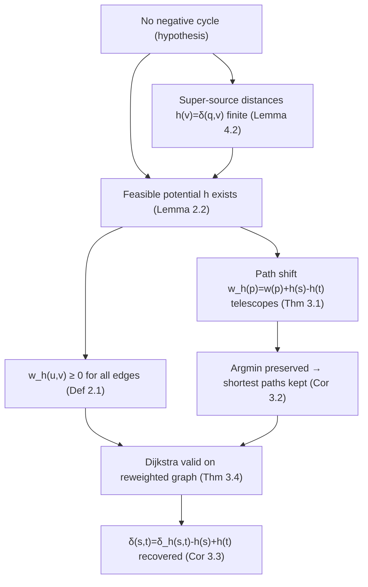

# Johnson's Algorithm — Mathematical Foundations and Complexity Theory

## Table of Contents
1. Formal Definition
2. Feasible Potentials and the Triangle Inequality
3. Correctness Proof — Reweighting Preserves Shortest Paths
4. Why the Super-Source Yields a Feasible Potential
5. Correctness of Negative-Cycle Detection
6. Complexity Analysis — O(V·E·log V)
7. The Potential Method: Johnson's, A*, and Min-Cost Flow
8. Lower Bounds and Optimality
9. Comparison with Alternatives (asymptotics + constants)
10. Worked Trace and Reweighting Evolution
11. Reference Implementations
    - 11.1 Go — Johnson's with Fibonacci-heap-style analysis notes
    - 11.2 Java — explicit feasible-potential validation
    - 11.3 Python — incremental potentials (min-cost-flow style)
12. Summary

---

## 1. Formal Definition

Let `G = (V, E, w)` be a finite directed graph with `V = {0, 1, …, n-1}`, edge set `E`, and weight function `w : E → ℝ` (weights may be negative). Assume `G` contains **no negative-weight cycle** (otherwise APSP is undefined; §5 handles detection).

**Definition 1.1 (shortest-path distance).** For `s, t ∈ V`, let `δ(s, t)` be the minimum of `w(p)` over all `s→t` paths `p`, where `w(p) = Σ` of its edge weights. If `t` is unreachable from `s`, `δ(s, t) = +∞`.

**Definition 1.2 (reweighting by a potential).** Given a *potential* `h : V → ℝ`, define the **reweighted** (a.k.a. *reduced*) weight of each edge `(u, v) ∈ E`:

```text
w_h(u, v) = w(u, v) + h(u) − h(v).
```

**The Johnson reweighting goal:** choose `h` so that `w_h(u, v) ≥ 0` for every edge, enabling Dijkstra, while shortest paths under `w_h` correspond exactly to shortest paths under `w`.

The logical dependency of the proof obligations:



---

## 2. Feasible Potentials and the Triangle Inequality

**Definition 2.1 (feasible potential).** A potential `h : V → ℝ` is **feasible** for `(G, w)` if

```text
h(v) ≤ h(u) + w(u, v)    for every edge (u, v) ∈ E.        (★)
```

Equivalently, rearranging (★):

```text
w_h(u, v) = w(u, v) + h(u) − h(v) ≥ 0   for every edge.
```

So **`h` is feasible iff every reduced weight is non-negative.** This is the central object: Johnson's needs a feasible potential, and it manufactures one with Bellman-Ford.

**Lemma 2.2 (existence).** A feasible potential exists **iff** `G` has no negative-weight cycle.

*Proof.* (⇐) If there is no negative cycle, define `h(v) = δ(q, v)` from a super-source `q` reaching all vertices (§4); the shortest-distance function satisfies (★) by the triangle inequality. (⇒) Suppose a feasible `h` exists and `C = v₀ → v₁ → ⋯ → vₖ = v₀` is any cycle. Summing (★) around `C`:

```text
Σ w_h(vᵢ, vᵢ₊₁) ≥ 0
⇒ Σ [ w(vᵢ,vᵢ₊₁) + h(vᵢ) − h(vᵢ₊₁) ] ≥ 0
⇒ w(C) + (h(v₀) − h(vₖ)) ≥ 0
⇒ w(C) ≥ 0          (since v₀ = vₖ, the h-terms telescope to 0).
```

So every cycle has non-negative weight — no negative cycle exists. ∎

This lemma is the precise statement of "Johnson's works iff there is no negative cycle": a feasible potential, and hence the whole algorithm, exists exactly under that condition.

---

## 3. Correctness Proof — Reweighting Preserves Shortest Paths

**Theorem 3.1 (path-length shift).** For any path `p = v₀ → v₁ → ⋯ → vₖ` and any potential `h`,

```text
w_h(p) = w(p) + h(v₀) − h(vₖ).
```

*Proof.* By definition and telescoping:

```text
w_h(p) = Σ_{i=0}^{k-1} w_h(vᵢ, vᵢ₊₁)
       = Σ_{i=0}^{k-1} [ w(vᵢ, vᵢ₊₁) + h(vᵢ) − h(vᵢ₊₁) ]
       = [ Σ w(vᵢ, vᵢ₊₁) ] + [ h(v₀) − h(vₖ) ]      (interior h-terms cancel pairwise)
       = w(p) + h(v₀) − h(vₖ).  ∎
```

**Corollary 3.2 (shortest paths preserved).** Fix `s, t ∈ V`. The term `h(s) − h(t)` is a constant independent of the chosen `s→t` path. Therefore a path `p` minimizes `w_h(p)` over all `s→t` paths **iff** it minimizes `w(p)`. The argmin set is identical; the optima differ by exactly `h(s) − h(t)`:

```text
δ_h(s, t) = δ(s, t) + h(s) − h(t).                       (†)
```

**Corollary 3.3 (recovery formula).** Solving (†) for the true distance:

```text
δ(s, t) = δ_h(s, t) − h(s) + h(t).
```

This is the **un-reweighting** step. Note that for **unreachable** `t` (`δ_h(s,t) = +∞`), (†) and (3.3) are not applied — `δ(s, t) = +∞` is reported directly.

**Theorem 3.4 (Dijkstra validity).** If `h` is feasible, then `w_h(u, v) ≥ 0` for all edges (Definition 2.1), so Dijkstra computes `δ_h(s, ·)` correctly from every source `s`. Combined with Corollary 3.3, Johnson's computes `δ(s, t)` for all pairs. ∎

The proof structure is worth internalizing: **(2)** feasibility ⇔ non-negative reduced weights ⇔ no negative cycle; **(3.1)** the telescoping shift; **(3.2)** the shift is path-independent so argmin is preserved; **(3.4)** non-negativity unlocks Dijkstra. Everything else is plumbing.

---

## 4. Why the Super-Source Yields a Feasible Potential

To build a feasible `h`, Johnson's adds a **super-source** `q ∉ V` with a 0-weight edge `q → v` for every `v ∈ V`, forming `G' = (V ∪ {q}, E ∪ {(q,v) : v}, w')` where `w'(q, v) = 0` and `w'` agrees with `w` on `E`.

**Lemma 4.1 (q does not change distances or cycles).** `q` has no incoming edges. Hence `q` lies on no cycle, so `G'` has a negative cycle iff `G` does. Moreover, distances among original vertices are unchanged (no original `s→t` path can route through `q`, since nothing enters `q`).

**Lemma 4.2 (every h(v) finite and feasible).** Define `h(v) = δ_{G'}(q, v)`. Since `q → v` has weight 0, `q` reaches every `v`, so `h(v) ≤ 0 < ∞` is finite. The shortest-distance function from a fixed source satisfies the triangle inequality on every edge of `G'`, in particular on every edge of `E`:

```text
h(v) = δ_{G'}(q, v) ≤ δ_{G'}(q, u) + w(u, v) = h(u) + w(u, v).
```

So `h` satisfies (★) and is feasible for `(G, w)`. ∎

**Remark 4.3 (implicit super-source).** Initializing Bellman-Ford with `h(v) = 0` for all `v` and relaxing only the original edges is operationally identical to adding `q` with 0-weight edges and running from `q`: both start every vertex at distance 0 (the cost of `q → v`) and relax the same edge set. So implementations skip materializing `q`. The `h(v) ≤ 0` bound (a vertex's potential cannot exceed the 0-cost direct edge) follows immediately and is a handy debugging assertion.

---

## 5. Correctness of Negative-Cycle Detection

**Proposition 5.1.** Bellman-Ford from the (implicit) super-source detects a negative cycle in `G` iff some edge can still be relaxed after `n` full passes (`n = |V|`).

*Proof.* With no negative cycle, every shortest path is simple (≤ `n − 1` edges), so `n − 1` relaxation passes suffice to fix all distances; a further pass changes nothing. Contrapositively, if a relaxation still improves some `h(v)` on the `n`-th pass, no finite feasible potential exists, which by Lemma 2.2 means `G` has a negative cycle. ∎

Johnson's runs the `n`-th detection pass and **rejects** the input if any relaxation succeeds, because (Lemma 2.2) no feasible potential — and hence no valid reweighting — exists. This is why detection must precede the Dijkstra fan-out: running Dijkstra on a graph where some `w_h < 0` would silently return wrong results.

---

## 6. Complexity Analysis — O(V·E·log V)

Let `n = |V|`, `m = |E|`.

**Phase 1 — potentials (Bellman-Ford).** `n` passes, each relaxing all `m` edges: `Θ(n·m)` worst case. (Queue-based SPFA variants are faster in practice but same worst case.)

**Phase 2 — reweighting.** One sweep over the edges: `Θ(m)`.

**Phase 3 — Dijkstra fan-out.** `n` runs of Dijkstra on a non-negative graph. With a **binary heap**, each run is `O((n + m) log n) = O(m log n)` (assuming `m ≥ n`), so `n` runs cost `O(n·m·log n)`.

**Phase 4 — un-reweighting.** One subtraction per pair: `Θ(n²)`.

**Total (binary heap):**

```text
Θ(n·m)  +  Θ(m)  +  O(n·m·log n)  +  Θ(n²)  =  O(n·m·log n).
```

The fan-out dominates. **With a Fibonacci heap**, each Dijkstra is `O(m + n log n)`, giving total

```text
O(n·m)  +  O(n·m + n² log n)  =  O(n·m + n² log n),
```

the theoretically optimal Johnson's. For sparse graphs (`m = Θ(n)`) both reduce to `O(n² log n)`; for dense graphs (`m = Θ(n²)`) the binary-heap version is `O(n³ log n)` and the Fibonacci version `O(n³)`.

**Space.** `O(n + m)` for the graph and potentials; `O(n²)` for the full output matrix (or `O(n)` per source if computed on demand).

**Comparison anchor.** Floyd-Warshall is `Θ(n³)` regardless of `m`. Johnson's `O(n·m·log n)` beats it whenever `m·log n < n²`, i.e. `m < n² / log n` — essentially everything but near-complete graphs.

---

## 7. The Potential Method: Johnson's, A*, and Min-Cost Flow

Reweighting by a feasible potential is a single technique appearing under different names. The unifying object is the **reduced cost** `w_h(u, v) = w(u, v) + h(u) − h(v)`.

### 7.1 A* as reweighted Dijkstra

A* explores in order of `g(v) + h(v)` where `h` estimates the remaining distance to a goal `t`. If `h` is **consistent** (`h(u) ≤ w(u, v) + h(v)` for all edges — exactly (★) oriented toward the goal), then A* expands vertices in the same order as Dijkstra on the reweighted graph `w_h`. Thus:

> **A* = Dijkstra on `w_h` with `h` a consistent heuristic.**

Johnson's uses a *Bellman-Ford-computed* feasible potential; A* uses a *domain-knowledge* heuristic. Both are feasible potentials; both make reduced costs non-negative; both preserve shortest paths by Theorem 3.1.

### 7.2 Min-cost flow's incremental potentials

The successive-shortest-paths algorithm augments flow along shortest paths in a **residual graph** whose back-edges have **negative** cost. Naively each augmentation needs Bellman-Ford. Instead, maintain a feasible potential `h` and use **reduced costs**: an initial Bellman-Ford makes `h` feasible, then after each augmentation update

```text
h(v) ← h(v) + δ_h(s, v)
```

(where `δ_h(s, v)` is the Dijkstra distance just computed). This keeps reduced costs non-negative on the *new* residual graph, so every subsequent augmenting path is found by **Dijkstra**. This is Johnson's reweighting applied *incrementally inside* a larger optimization — historically one of its most important uses.

**Lemma 7.1 (potential update stays feasible).** After pushing flow along shortest paths and updating `h(v) ← h(v) + δ_h(s, v)`, the residual graph's reduced costs remain `≥ 0`. *Sketch.* Tree edges of the shortest-path DAG have reduced cost 0 (tight), so their reversals (new residual back-edges) also have reduced cost 0 under the updated `h`; non-tree edges keep `≥ 0` by the triangle inequality on the updated distances. ∎

---

## 8. Lower Bounds and Optimality

### 8.1 Conditional optimality
Johnson's reduces APSP to one Bellman-Ford plus `n` Dijkstras. With a Fibonacci heap it is `O(n·m + n² log n)`. For **sparse** graphs (`m = O(n)`) this is `O(n² log n)`. Any APSP algorithm must at least **output** `Θ(n²)` distances, so `Ω(n²)` is an unconditional lower bound for the full matrix. Johnson's is within a `log n` factor of this output-size bound on sparse graphs — essentially optimal there.

### 8.2 Relation to SSSP lower bounds
The potential phase inherits the complexity of negative-weight SSSP. For decades Bellman-Ford's `O(n·m)` was the standard; recent breakthroughs give **near-linear** `Õ(m)` negative-weight SSSP (Bernstein–Nanongkai–Wulff-Nilsen and successors). Substituting such an algorithm for the Bellman-Ford phase yields a Johnson's variant whose bottleneck is purely the `n`-Dijkstra fan-out, i.e. `Õ(n·m + n² log n)` with a near-linear (rather than `n·m`) setup. The fan-out itself is bounded by the cost of `n` non-negative SSSP computations, which is conjectured hard to beat substantially for general sparse graphs.

### 8.3 Why not Floyd-Warshall asymptotics
Floyd-Warshall's `Θ(n³)` is oblivious to `m`. APSP is conjectured to require `n^{3−o(1)}` for **dense** real-weighted graphs (the APSP conjecture; subcubic-equivalent to min-plus matrix product). Johnson's does **not** contradict this: on dense graphs it is `O(n³)` (Fibonacci) or worse, consistent with the conjecture. Its advantage is purely **density-sensitivity** — it spends `O(m)` per source instead of `O(n²)`, which only helps when `m ≪ n²`.

### 8.4 The reweighting is not free magic
A natural question: does reweighting "remove" the difficulty of negative edges for free? No. The difficulty is concentrated into the **one** Bellman-Ford pass that computes a feasible potential — which is exactly where negative-weight SSSP's full cost is paid. Reweighting then *amortizes* that single expensive pass across all `n` sources, replacing `n` Bellman-Fords (`O(n²m)`) with one Bellman-Ford plus `n` Dijkstras (`O(nm + nm log n)`). The win is amortization, not the elimination of negative-weight handling.

---

## 9. Comparison with Alternatives (asymptotics + constants)

| Method | Time (binary heap) | Time (Fib heap) | Negatives | Best regime |
|---|---|---|---|---|
| Johnson's | `O(n·m·log n)` | `O(n·m + n² log n)` | ✓ (reweight) | **Sparse + negatives** |
| Floyd-Warshall | — | `Θ(n³)` | edges ✓, cycles detect | Dense, small `n`, simple |
| `n` × Dijkstra | `O(n·m·log n)` | `O(n·m + n² log n)` | ✗ | Sparse, **non-negative** |
| `n` × Bellman-Ford | `Θ(n²·m)` | — | ✓ | Rarely optimal; baseline |

**Constants.** Floyd-Warshall's inner loop is two arithmetic ops on a contiguous matrix — exceptionally cache-friendly and vectorizable. Johnson's pays heap operations and pointer-chasing per Dijkstra. So for `n` up to a few hundred on *moderately dense* graphs, Floyd-Warshall often wins wall-clock despite Johnson's better asymptotics. Johnson's clean win is **genuinely sparse** graphs, where the per-source `O(m log n)` is tiny.

**Versus `n`× Bellman-Ford.** Johnson's strictly dominates the naive `n`× Bellman-Ford (`Θ(n²m)`): it replaces `n − 1` of the Bellman-Ford runs with Dijkstras (one Bellman-Ford computes the shared potential), turning `O(n²m)` into `O(nm log n)`. This *is* the core insight — amortize one expensive negative-weight pass across all sources.

---

## 10. Worked Trace and Reweighting Evolution

Take the 4-vertex graph from junior level (with a negative edge), `q` the implicit super-source:

```text
edges:  0→1 (-2),  1→2 (-1),  2→3 (2),  0→3 (10),  3→1 (4)
```

**Phase 1 — Bellman-Ford from q** (`h` initialized to 0, relax to convergence):

```text
h(0) = 0
h(1) = -2     (via 0→1)
h(2) = -3     (via 0→1→2)
h(3) = -1     (via 0→1→2→3 = -3 + 2)
```

Detection pass: no further improvement → **no negative cycle**, feasible potential obtained. Note every `h(v) ≤ 0` (Remark 4.3).

**Phase 2 — reweight** `w_h(u,v) = w + h(u) − h(v)`:

| edge | `w` | `h(u)` | `h(v)` | `w_h = w + h(u) − h(v)` |
|---|---|---|---|---|
| 0→1 | −2 | 0 | −2 | −2 + 0 − (−2) = **0** |
| 1→2 | −1 | −2 | −3 | −1 + (−2) − (−3) = **0** |
| 2→3 | 2 | −3 | −1 | 2 + (−3) − (−1) = **0** |
| 0→3 | 10 | 0 | −1 | 10 + 0 − (−1) = **11** |
| 3→1 | 4 | −1 | −2 | 4 + (−1) − (−2) = **5** |

Every `w_h ≥ 0` (confirming feasibility, Definition 2.1). The "spine" path `0→1→2→3` has all-zero reduced weights — it is a tight shortest path, exactly as Lemma 7.1's tightness predicts.

**Phase 3 — Dijkstra from 0 on `w_h`** gives `δ_h(0, ·) = [0, 0, 0, 0]` (the zero-reduced-cost spine reaches everything at reduced distance 0; the direct `0→3` of reduced weight 11 loses to the spine of reduced weight 0).

**Phase 4 — un-reweight** `δ(0,v) = δ_h(0,v) − h(0) + h(v)`:

```text
δ(0,0) = 0 − 0 + 0    = 0
δ(0,1) = 0 − 0 + (-2) = -2      (path 0→1)
δ(0,2) = 0 − 0 + (-3) = -3      (path 0→1→2)
δ(0,3) = 0 − 0 + (-1) = -1      (path 0→1→2→3, beating direct 0→3 = 10)
```

These match the true distances. The trace makes Theorem 3.1 tangible: the reduced distance `δ_h(0,3) = 0` plus the endpoint shift `h(3) − h(0) = -1` recovers the true `-1`, with the route chosen identically under both weightings (Corollary 3.2).

Repeating from each source fills the matrix; for instance Dijkstra from 3 on `w_h` uses `3→1 (5)` then `1→2 (0)`, `2→3 (0)`, yielding (after un-reweighting) `δ(3,1) = 4`, `δ(3,2) = 3`, etc.

---

## 11. Reference Implementations

Code order is Go, Java, Python.

### 11.1 Go — Johnson's (binary heap; Fibonacci-heap notes inline)

```go
package main

import (
	"container/heap"
	"errors"
	"fmt"
	"math"
)

const INF = math.MaxInt64 / 4

type edge struct{ to, w int }
type hi struct{ node, d int }
type mh []hi

func (h mh) Len() int            { return len(h) }
func (h mh) Less(a, b int) bool  { return h[a].d < h[b].d }
func (h mh) Swap(a, b int)       { h[a], h[b] = h[b], h[a] }
func (h *mh) Push(x interface{}) { *h = append(*h, x.(hi)) }
func (h *mh) Pop() interface{}   { o := *h; n := len(o); x := o[n-1]; *h = o[:n-1]; return x }

// Johnson's: O(n*m*log n) with this binary heap; a Fibonacci heap would make
// each Dijkstra O(m + n log n), giving total O(n*m + n^2 log n).
func johnson(n int, edges [][3]int) ([][]int, error) {
	adj := make([][]edge, n)
	for _, e := range edges {
		adj[e[0]] = append(adj[e[0]], edge{e[1], e[2]})
	}
	// Phase 1: Bellman-Ford from implicit super-source (h[v]=0).
	h := make([]int, n)
	for it := 0; it <= n; it++ {
		changed := false
		for u := 0; u < n; u++ {
			for _, e := range adj[u] {
				if h[u]+e.w < h[e.to] {
					h[e.to] = h[u] + e.w
					changed = true
					if it == n {
						return nil, errors.New("negative cycle: no feasible potential")
					}
				}
			}
		}
		if !changed {
			break
		}
	}
	// Phase 2: reweight; assert feasibility (every reduced weight >= 0).
	radj := make([][]edge, n)
	for u := 0; u < n; u++ {
		for _, e := range adj[u] {
			rw := e.w + h[u] - h[e.to]
			if rw < 0 {
				return nil, errors.New("infeasible potential (bug)")
			}
			radj[u] = append(radj[u], edge{e.to, rw})
		}
	}
	// Phase 3 & 4: Dijkstra per source, then un-reweight.
	dist := make([][]int, n)
	for s := 0; s < n; s++ {
		dp := dijkstra(n, radj, s)
		dist[s] = make([]int, n)
		for v := 0; v < n; v++ {
			if dp[v] >= INF {
				dist[s][v] = INF
			} else {
				dist[s][v] = dp[v] - h[s] + h[v]
			}
		}
	}
	return dist, nil
}

func dijkstra(n int, radj [][]edge, src int) []int {
	d := make([]int, n)
	for i := range d {
		d[i] = INF
	}
	d[src] = 0
	pq := &mh{{src, 0}}
	for pq.Len() > 0 {
		x := heap.Pop(pq).(hi)
		if x.d > d[x.node] {
			continue
		}
		for _, e := range radj[x.node] {
			if d[x.node]+e.w < d[e.to] {
				d[e.to] = d[x.node] + e.w
				heap.Push(pq, hi{e.to, d[e.to]})
			}
		}
	}
	return d
}

func main() {
	d, err := johnson(4, [][3]int{{0, 1, -2}, {1, 2, -1}, {2, 3, 2}, {0, 3, 10}, {3, 1, 4}})
	fmt.Println(err, d[0]) // <nil> [0 -2 -3 -1]
}
```

### 11.2 Java — explicit feasible-potential validation

```java
import java.util.*;

public final class JohnsonProof {
    static final int INF = Integer.MAX_VALUE / 4;

    static int[][] johnson(int n, int[][] edges) {
        List<int[]>[] adj = new List[n];
        for (int i = 0; i < n; i++) adj[i] = new ArrayList<>();
        for (int[] e : edges) adj[e[0]].add(new int[]{e[1], e[2]});

        // Phase 1: feasible potential via Bellman-Ford (implicit super-source).
        int[] h = new int[n];
        for (int it = 0; it <= n; it++) {
            boolean changed = false;
            for (int u = 0; u < n; u++)
                for (int[] e : adj[u])
                    if (h[u] + e[1] < h[e[0]]) {
                        h[e[0]] = h[u] + e[1];
                        changed = true;
                        if (it == n) throw new IllegalStateException("negative cycle");
                    }
            if (!changed) break;
        }
        // Validate feasibility: h(v) <= h(u) + w(u,v)  for every edge.
        for (int u = 0; u < n; u++)
            for (int[] e : adj[u])
                assert h[e[0]] <= h[u] + e[1] : "potential not feasible";

        // Phase 2: reweight.
        List<int[]>[] radj = new List[n];
        for (int u = 0; u < n; u++) {
            radj[u] = new ArrayList<>();
            for (int[] e : adj[u]) {
                int rw = e[1] + h[u] - h[e[0]];
                assert rw >= 0 : "reduced weight negative";
                radj[u].add(new int[]{e[0], rw});
            }
        }
        // Phase 3 & 4.
        int[][] dist = new int[n][n];
        for (int s = 0; s < n; s++) {
            int[] dp = dijkstra(n, radj, s);
            for (int v = 0; v < n; v++)
                dist[s][v] = (dp[v] >= INF) ? INF : dp[v] - h[s] + h[v];
        }
        return dist;
    }

    static int[] dijkstra(int n, List<int[]>[] radj, int src) {
        int[] d = new int[n];
        Arrays.fill(d, INF);
        d[src] = 0;
        PriorityQueue<int[]> pq = new PriorityQueue<>((a, b) -> a[1] - b[1]);
        pq.add(new int[]{src, 0});
        while (!pq.isEmpty()) {
            int[] c = pq.poll();
            if (c[1] > d[c[0]]) continue;
            for (int[] e : radj[c[0]])
                if (d[c[0]] + e[1] < d[e[0]]) {
                    d[e[0]] = d[c[0]] + e[1];
                    pq.add(new int[]{e[0], d[e[0]]});
                }
        }
        return d;
    }

    public static void main(String[] args) {
        int[][] edges = {{0, 1, -2}, {1, 2, -1}, {2, 3, 2}, {0, 3, 10}, {3, 1, 4}};
        System.out.println(Arrays.toString(johnson(4, edges)[0])); // [0, -2, -3, -1]
    }
}
```

### 11.3 Python — incremental potentials (min-cost-flow style)

This shows the `h(v) ← h(v) + δ_h(s, v)` update of §7.2: after the first Bellman-Ford, subsequent shortest paths on a *changing* residual-like graph are found by Dijkstra alone, with the potential kept feasible incrementally.

```python
import heapq


def dijkstra_reduced(n, adj, h, src):
    """Dijkstra on reduced costs w + h[u] - h[v]; returns reduced distances."""
    INF = float("inf")
    d = [INF] * n
    d[src] = 0
    pq = [(0, src)]
    while pq:
        du, u = heapq.heappop(pq)
        if du > d[u]:
            continue
        for v, w in adj[u]:
            rw = w + h[u] - h[v]      # reduced cost; >= 0 by feasibility
            if du + rw < d[v]:
                d[v] = du + rw
                heapq.heappush(pq, (d[v], v))
    return d


def bellman_ford(n, adj):
    h = [0] * n
    for it in range(n + 1):
        changed = False
        for u in range(n):
            for v, w in adj[u]:
                if h[u] + w < h[v]:
                    h[v] = h[u] + w
                    changed = True
                    if it == n:
                        return None
        if not changed:
            break
    return h


def repeated_shortest_paths(n, adj, sources):
    """One Bellman-Ford; every queried source then uses Dijkstra with the
    potential updated incrementally (the min-cost-flow reweighting discipline)."""
    h = bellman_ford(n, adj)            # feasible potential, or None on neg cycle
    if h is None:
        raise ValueError("negative cycle")
    INF = float("inf")
    results = {}
    for s in sources:
        dh = dijkstra_reduced(n, adj, h, s)        # reduced distances >= 0
        true_dist = [dh[v] - h[s] + h[v] if dh[v] < INF else INF for v in range(n)]
        results[s] = true_dist
        # Incremental potential update keeps reduced costs feasible for the next query
        # even if the graph mutates between queries (min-cost-flow pattern):
        h = [h[v] + dh[v] if dh[v] < INF else h[v] for v in range(n)]
    return results


if __name__ == "__main__":
    adj = [[(1, -2)], [(2, -1)], [(3, 2)], [(1, 4)]]  # 0→1,1→2,2→3,3→1
    adj[0].append((3, 10))
    print(repeated_shortest_paths(4, adj, [0])[0])  # [0, -2, -3, -1]
```

The incremental update `h ← h + δ_h` (Lemma 7.1) is what lets repeated queries on a mutating graph stay in Dijkstra-land instead of paying Bellman-Ford each time — the algorithmic heart of efficient min-cost flow.

---

## 12. Summary

- **Definition.** Johnson's reweights `w_h(u,v) = w(u,v) + h(u) − h(v)` using a **feasible potential** `h`, runs Dijkstra from every source on `w_h ≥ 0`, and recovers `δ(s,t) = δ_h(s,t) − h(s) + h(t)`.
- **Feasibility ⇔ no negative cycle.** A feasible potential exists iff `G` has no negative cycle (Lemma 2.2); the super-source `h(v) = δ(q,v)` manufactures one by the triangle inequality (Lemma 4.2).
- **Correctness.** Telescoping (Theorem 3.1) shows every `s→t` path shifts by the constant `h(s) − h(t)`, so argmin is preserved (Corollary 3.2) and Dijkstra is valid on the non-negative reduced graph (Theorem 3.4).
- **Detection.** A relaxation succeeding on the `n`-th Bellman-Ford pass certifies a negative cycle (Proposition 5.1); Johnson's rejects such inputs.
- **Complexity.** `O(n·m·log n)` (binary heap) or `O(n·m + n² log n)` (Fibonacci heap); the `n`-Dijkstra fan-out dominates. Beats Floyd-Warshall's `Θ(n³)` when `m < n²/log n`.
- **Unification.** The reduced-cost / feasible-potential idea is the same in **A\*** (consistent heuristic as potential) and **min-cost flow** (incremental potentials, Lemma 7.1).
- **Optimality.** Within a `log n` factor of the `Ω(n²)` output lower bound on sparse graphs; the negative-weight difficulty is concentrated into the single Bellman-Ford pass and *amortized* across all sources — that amortization, not magic, is the algorithm's win.

Johnson (1977) introduced the algorithm; CLRS Chapter 25.3 is the canonical reference; the feasible-potential / reduced-cost framework underlies A* (Hart–Nilsson–Raphael) and min-cost flow (the successive-shortest-paths method); recent near-linear negative-weight SSSP results (Bernstein–Nanongkai–Wulff-Nilsen) can replace its Bellman-Ford phase, sharpening the setup cost while leaving the fan-out as the bottleneck.

---

**Next step:** Continue to [`interview.md`](./interview.md) for tiered interview questions across all levels plus full coding challenges in Go, Java, and Python.
