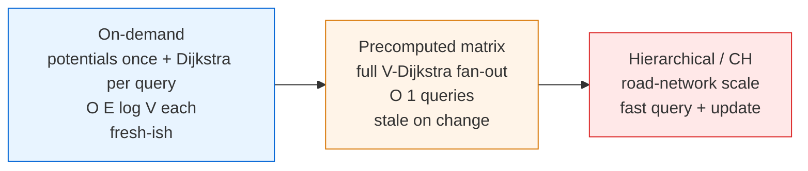
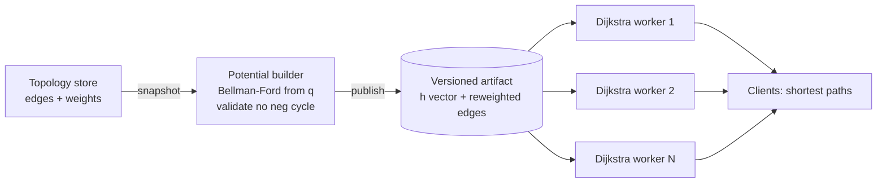

# Johnson's Algorithm — Senior Level

> Johnson's is the algorithm you reach for when an all-pairs (or many-source) shortest-path workload sits on a **sparse** graph that — annoyingly — has **negative edge weights**. At system scale, the interesting questions are not "how does reweighting work" but "where does the `V`-Dijkstra fan-out run, how stale can the potentials get, and what happens when a negative cycle appears in production traffic?"

## Table of Contents
1. [Introduction](#1-introduction)
2. [System Design with Johnson's](#2-system-design-with-johnsons)
3. [Distributed and Parallel Johnson's](#3-distributed-and-parallel-johnsons)
4. [Concurrency](#4-concurrency)
5. [Comparison at Scale](#5-comparison-at-scale)
6. [Architecture Patterns](#6-architecture-patterns)
7. [Code Examples](#7-code-examples)
8. [Observability](#8-observability)
9. [Failure Modes](#9-failure-modes)
10. [Capacity Planning](#10-capacity-planning)
11. [Summary](#11-summary)

---

## 1. Introduction

At senior level the question shifts from "how does the telescoping cancellation prove correctness" to "how do I operate an APSP service backed by Johnson's, and what breaks?" Johnson's decomposes into three operationally distinct phases, each with its own scaling and failure profile:

1. **Potential phase** — one Bellman-Ford from the virtual super-source. `O(V·E)`, sequential, the only place negative cycles are detected. Cheap but *load-bearing*: if it is wrong or stale, every downstream distance is wrong.
2. **Reweight phase** — one `O(E)` sweep. Trivial compute, but it is the contract between phases: every consumer of the reweighted graph trusts that `w' ≥ 0`.
3. **Dijkstra fan-out** — `V` independent shortest-path computations, `O(V·E log V)` total. Embarrassingly parallel; this is where almost all the wall-clock and all the scaling headroom live.

The phase boundaries are not just pedagogical — they map onto distinct services with distinct scaling axes (the potential builder scales with `V·E`; the fan-out scales with cores/nodes; the query tier scales with QPS), and the artifact between them is the deployable, versionable, validate-before-publish contract.

The senior decisions are therefore architectural:

- Should you precompute the full `V²` matrix, or keep the potentials and run Dijkstra **on demand** per query?
- How do you parallelize / distribute the `V`-Dijkstra fan-out?
- How fresh must the potentials be, and what is your policy when an edge change might invalidate them?
- How do you detect, alert on, and degrade gracefully when a **negative cycle** appears?

---

## 2. System Design with Johnson's

### 2.1 Precompute vs on-demand



| Approach | When right | When wrong |
| --- | --- | --- |
| On-demand (potentials cached, Dijkstra per query) | Sparse + negatives, few hot sources, graph changes occasionally. | Need *all* pairs constantly; per-query latency budget too tight. |
| Precomputed `V²` matrix | Sparse + negatives, static-ish graph, many `O(1)` queries. | Graph mutates faster than you can recompute potentials + fan-out. |
| Hierarchical (CH / hub labels) | Road-network scale, `V` in millions. | Negative edges (CH assumes non-negative) or small graphs. |

The crucial structural property of Johnson's for a service: **the potential `h` is computed once and reused by every Dijkstra and every later query.** That makes "compute potentials, then serve Dijkstra on demand" a natural and cheap-to-keep-fresh design — far more incremental than Floyd-Warshall's monolithic `O(V³)` rebuild.

The most expensive mistake here mirrors Floyd-Warshall's: precomputing the full `V²` matrix for a sparse graph that mutates often, paying the fan-out repeatedly and serving stale rows between rebuilds — when an on-demand design would have recomputed only the cheap potentials and served fresh Dijkstra answers per query. Match the build discipline to the query and mutation pattern, not to a reflex to "precompute everything."

### 2.2 Anatomy of a Johnson's-backed APSP service

A production service separates into stages mirroring the algorithm's phases:

1. **Topology store** — source of truth for edges and weights (graph DB, config table, edge-change stream). Owns *what the graph is*.
2. **Potential builder** — reads a consistent snapshot, runs Bellman-Ford from the super-source, validates (no negative cycle), and publishes a versioned `h` vector plus the reweighted edge list. Sequential, `O(V·E)`, the negative-cycle gate.
3. **Query / fan-out tier** — stateless workers that run Dijkstra on the reweighted graph (on demand per source, or in a batch fan-out to build the full matrix) and un-reweight. Horizontally scalable, independent per source.



The artifact (the `h` vector + reweighted graph, versioned together) is the contract. A failed potential build keeps the last good `h` serving; query workers autoscale on QPS independent of the build.

### 2.3 What the artifact actually buys you

The reweighted graph plus potential vector is a small, immutable, `O(V + E)` object — for a sparse graph that is a few megabytes even at tens of thousands of vertices. Compare this to Floyd-Warshall, whose only useful artifact is the full `O(V²)` matrix. The consequence is operational: you can replicate the Johnson's artifact to every query node cheaply (megabytes, not gigabytes), and each node can answer *any* source's shortest paths on demand without holding the whole matrix. The matrix, if you want it, is *derived* from the artifact by running the fan-out — but you are never obligated to materialize or ship it. This is the structural reason Johnson's scales gracefully on large sparse graphs where Floyd-Warshall's `O(V²)` artifact becomes the bottleneck.

There is a subtlety worth flagging for reviewers: the artifact's correctness depends on `h` and the reweighted edges agreeing. If a deploy ships a new reweighted graph but an old `h` (or vice versa), every un-reweighting `δ = δ' - h(s) + h(v)` silently corrupts. Treat `(h, reweighted graph)` as a single atomic unit — same version, same deploy, validated together (every `w' ≥ 0`) before going live.

---

## 3. Distributed and Parallel Johnson's

### 3.1 The fan-out is the parallelism

Johnson's has an almost ideal parallel structure: after the (sequential) potential phase, the `V` Dijkstra runs are **completely independent**. They read the same immutable reweighted graph and write disjoint output rows. So:

- **Multi-core:** distribute sources across a thread pool; near-linear speedup until memory bandwidth or the shared graph's cache pressure saturates.
- **Multi-node:** shard sources across machines. Each machine holds a read-only copy of the reweighted graph (`O(V + E)` — cheap for sparse graphs) and computes its assigned rows. No inter-node communication during the fan-out — only the final matrix assembly (or none, if rows are served where computed).

This is far more scalable than distributed Floyd-Warshall, which must broadcast a pivot row/column every round (`O(V³)` bytes moved total). Johnson's distributes with essentially **zero communication** during the heavy phase because each Dijkstra is self-contained.

### 3.2 The sequential bottleneck: the potential phase

The one part that does *not* parallelize cleanly is Bellman-Ford. It is `O(V·E)`, inherently iterative (each pass depends on the last), and must finish before any reweighting. For most workloads it is cheap relative to the `V`-Dijkstra fan-out, but for very large graphs it can become the critical path. Mitigations:

- Use a **queue-based (SPFA-style)** Bellman-Ford that only re-relaxes vertices whose distance changed — often far faster in practice, though same worst case.
- Replace it with a modern **near-linear negative-weight SSSP** algorithm (recent theory results) if the potential phase dominates.
- Parallelize Bellman-Ford itself (relax all edges in parallel per pass with a barrier between passes), accepting more passes for less per-pass time.

### 3.3 Distributing the graph itself

For graphs too large to replicate per node, partition the vertex set and run a distributed SSSP (e.g. delta-stepping) per source — but at that scale you are usually better served by a hierarchical method *if* weights can be made non-negative. Johnson's distributed sweet spot is "graph fits per node, but the `V`-Dijkstra fan-out is the expensive part" — shard the sources, replicate the (small, sparse) graph.

### 3.4 The communication-cost comparison that decides the architecture

The decisive number for a distributed APSP build is **bytes moved**, because at scale the network, not the CPU, is the bottleneck. Distributed Floyd-Warshall moves `O(V³)` bytes total: each of the `V` pivot rounds broadcasts a pivot row and column (`O(V)` data each) to all nodes, and every node updates its `O(V²/k)` block, so the aggregate traffic is dominated by the per-round broadcasts multiplied by `V` rounds. Distributed Johnson's moves essentially **`O(V·E)` bytes for the result, and near-zero during compute**: after the (single-node or replicated) potential phase, each node runs its assigned Dijkstras entirely locally on its replicated copy of the `O(V+E)` reweighted graph, communicating only the finished output rows (or not at all, if rows are served where computed).

For a sparse graph this is an enormous difference. At `V = 10,000` with `E = 30,000`, distributed Floyd-Warshall shovels on the order of `10¹²` bytes across the network over the build; distributed Johnson's replicates a ~few-hundred-KB graph once and then computes silently, emitting at most the `O(V²)` result if a full matrix is required. This is why, for sparse-graph APSP at scale, the architecture conversation almost always lands on "replicate the tiny Johnson's artifact, shard the sources" rather than any pivot-broadcast scheme.

### 3.5 Load balancing the fan-out

The `V` Dijkstras are independent but **not equal-cost**: a source in a dense neighborhood, or one that can reach most of the graph, runs a longer Dijkstra than an isolated source. Static round-robin partitioning of sources across workers therefore risks stragglers — one worker stuck on a cluster of expensive sources while others idle. The fix is **dynamic work-stealing**: maintain a shared queue of source ids; each worker pops the next source when it finishes its current one. This keeps all workers busy until the very end and bounds the makespan by (total work / workers) + (one longest Dijkstra), rather than the much worse (worst static shard). For multi-node fan-out, a coordinator hands out source ranges in small chunks and reassigns idle nodes — the distributed analogue of work-stealing.

---

## 4. Concurrency

### 4.1 Parallelizing the Dijkstra fan-out

```
h = bellmanFordPotentials(graph)     // sequential, detect negative cycle
radj = reweight(graph, h)            // sequential, O(E), assert w' >= 0
parallel for s in 0..V:              // independent: read-only radj, disjoint output rows
    row[s] = unreweight(dijkstra(radj, s), h, s)
```

Each Dijkstra owns its own priority queue and distance array; the only shared state is the **read-only** reweighted graph and the **read-only** potential vector `h`. No locks needed. This is the cleanest concurrency story of any APSP algorithm — no barrier-per-layer like Floyd-Warshall, just a single fork-join over sources.

### 4.2 What you cannot parallelize

- **Within the potential phase**, Bellman-Ford passes are sequential (pass `k+1` reads pass `k`).
- **A single Dijkstra** is hard to parallelize (the frontier is inherently ordered); parallelism comes from running *many* Dijkstras, not from speeding up one.

### 4.3 Serving concurrency and freshness swaps

Once built, the `h` vector and reweighted graph are immutable, so any number of query threads run Dijkstra against them lock-free. Refreshing potentials (after a topology change) uses **read-copy-update**: build a new `(h, radj)` artifact off to the side, validate it (no negative cycle, all `w' ≥ 0`), then atomically swap the pointer. In-flight queries either see the entirely old artifact or the entirely new one — never a torn mix where `h` and the reweighted edges disagree (which would silently corrupt every distance).

### 4.4 Memory and cache behavior of the fan-out

Each Dijkstra allocates its own `O(V)` distance array and `O(V)`-ish priority queue, so `C` concurrent workers need `O(C·V)` scratch memory on top of the shared read-only `O(V+E)` graph. For a sparse graph this is modest, but the shared graph is read by every worker simultaneously, so its layout matters: store the reweighted adjacency in a **compressed-sparse-row (CSR)** form (one contiguous edge array plus per-vertex offsets) so the hot read path is cache-friendly and the same cache lines are shared (not duplicated) across workers. Avoid pointer-heavy adjacency-of-objects, which scatters reads across the heap and inflates the working set per worker. On a NUMA machine, replicate the (small) CSR graph per socket so each worker reads from local memory; for a sparse graph the duplication cost is negligible and it removes cross-socket traffic from the inner loop.

### 4.5 Why one Dijkstra resists parallelization

It is tempting to ask whether each individual Dijkstra could be parallelized to cut per-query latency. In general, no: Dijkstra's correctness depends on settling vertices in non-decreasing distance order, an inherently sequential dependency (the frontier is a strict priority order). Parallel SSSP variants (delta-stepping, radius-stepping) relax this by processing *buckets* of near-equal distances in parallel, trading some redundant work for parallelism — useful when you need a *single* source's answer fast. But Johnson's natural parallelism is across the `V` sources, which is far cleaner and needs no such compromise, so the standard design parallelizes the fan-out and keeps each Dijkstra sequential.

The practical takeaway: spend your parallelism budget on **more concurrent sources**, not on speeding up any single Dijkstra. A fan-out across `C` workers gives near-linear throughput up to the point where the shared graph's memory bandwidth saturates; beyond that, adding workers raises CPU utilization without lowering wall-clock — the same "we added cores and it got no faster" trap that afflicts memory-bound kernels. When you see flat fan-out latency with rising CPU, you are bandwidth-bound, and the remedy is a tighter CSR layout (§4.4) or per-NUMA-node graph replication, not more threads.

---

## 5. Comparison at Scale

| Approach | Build | Query | Update | Memory | When |
| --- | --- | --- | --- | --- | --- |
| Johnson's (full matrix) | `O(V·E log V)` | `O(1)` | recompute potentials + fan-out | `O(V²)` out, `O(V+E)` graph | Sparse + negatives, static-ish, all pairs. |
| Johnson's (on-demand) | `O(V·E)` potentials only | `O(E log V)` per source | recompute potentials | `O(V+E)` | Sparse + negatives, hot subset of sources. |
| Floyd-Warshall | `O(V³)` | `O(1)` | `O(V³)` rebuild | `O(V²)` | Dense, small V, any weights. |
| `V`×Dijkstra | `O(V·E log V)` | `O(1)` | recompute | `O(V²)` out | Sparse, **non-negative** only. |
| Contraction Hierarchies | heavy preprocess | near-`O(log V)` | re-preprocess region | `O(V + shortcuts)` | Road networks, non-negative. |

Johnson's occupies a precise niche: **sparse, negative edges, many sources.** Lose the negatives and `V`×Dijkstra is simpler; gain density and Floyd-Warshall wins; grow to road-network scale and hierarchical methods take over (but they require non-negative weights, so you may still need Johnson's reweighting as a preprocessing step to *make* them non-negative).

### 5.1 Reading the regime boundary

Three numbers decide: `V`, density `E/V²`, and how many distinct sources you query. Johnson's `V·E·log V` beats Floyd-Warshall's `V³` when `E < V²/log V` — essentially everything but near-complete graphs. Crossed with the source-count axis: if you query far fewer than `V` sources, skip the full fan-out and use **on-demand** Johnson's (potentials once, Dijkstra per queried source). The override, as always, is mutation rate: if edges change faster than you can recompute potentials, neither precompute model holds and you fall back to fully on-demand (potentials + Dijkstra per query) or accept bounded staleness.

A subtle point unique to Johnson's: **edge changes may invalidate the potentials, not just the matrix.** A weight decrease can break the triangle inequality `h(v) ≤ h(u) + w(u,v)`, making some `w'` negative and Dijkstra invalid. So a topology change forces (at least) a potential recompute, not merely a matrix patch — unlike Floyd-Warshall's `O(V²)` single-edge-decrease trick.

### 5.2 The decision flow in practice

A senior reviewing an APSP design should walk a short decision tree. **First, are there negative edges?** No → drop Johnson's; the reweighting is pure overhead, run `V`×Dijkstra (sparse) or Floyd-Warshall (dense). Yes → continue. **Second, is the graph dense?** Dense (`E ≈ V²`) → Floyd-Warshall; its `O(V³)` beats Johnson's `O(V³ log V)` and the code is three lines. Sparse → Johnson's. **Third, do you need the whole matrix or a hot subset of sources?** Whole matrix and static-ish → precompute the full matrix via the fan-out, serve `O(1)`. Hot subset or large `V` → on-demand Johnson's: cache potentials, run Dijkstra per queried source, never materialize `O(V²)`. **Fourth, how fast does the graph change?** Slower than you can recompute potentials → either precompute model works. Faster → go fully on-demand (recompute potentials lazily) or accept bounded staleness. This four-question flow resolves almost every real APSP architecture decision without hand-waving.

### 5.3 Johnson's as a non-negativity preprocessor for other algorithms

A scaling pattern worth naming: when the graph is large enough that you would prefer a *hierarchical* method (contraction hierarchies, hub labeling) for its fast queries, but the graph has negative edges (which those methods cannot handle), Johnson's reweighting becomes a **preprocessing step**. Run the one Bellman-Ford to get `h`, reweight to a non-negative graph, then build the hierarchical index on the reweighted graph, and un-reweight query answers. This composes Johnson's negative-edge tolerance with another algorithm's query speed — the same "reweight-then-delegate" idea from §6.2, applied at road-network scale. It is the bridge that lets sparse-negative graphs benefit from non-negative-only acceleration structures.

---

## 6. Architecture Patterns

### 6.1 Potentials-as-cache (the key Johnson's pattern)

The defining production pattern: **compute the potentials once, cache them, and serve Dijkstra on demand.** Because `h` is reusable across every source and every query, you pay the `O(V·E)` Bellman-Ford rarely (only when the graph changes enough to invalidate it) and pay `O(E log V)` per actual query. This is dramatically more incremental than Floyd-Warshall, whose every query depends on a monolithic `O(V³)` build.

```
edges --> [Bellman-Ford once] --> h (cached) --> [reweight] --> radj (cached)
                                                      |
query(s, t) -----------------------------------------> [Dijkstra from s] --> un-reweight --> answer
```

### 6.2 Reweight-then-delegate

Once you hold a valid `h`, the reweighted graph is a normal non-negative graph. You can feed it to **any** downstream non-negative shortest-path machinery: bidirectional Dijkstra, A* with an additional heuristic, k-shortest-paths, or even a hierarchical preprocessor. Johnson's role collapses to "make the graph Dijkstra-safe." This pattern is how systems combine negative-edge tolerance with algorithms that assume non-negativity.

### 6.3 Incremental potentials (the min-cost-flow pattern)

When edges change slowly and you re-solve shortest paths repeatedly (the canonical case is **min-cost max-flow's successive shortest paths**), you do not recompute `h` from scratch. After each round you update `h(v) += δ'(s, v)`, which keeps reduced costs non-negative so the next round uses **Dijkstra**, not Bellman-Ford. Senior systems that route over residual/mutating graphs with negative costs lean on this incremental-potential discipline heavily.

### 6.4 Build-on-write vs build-on-read for potentials

**Build-on-write** recomputes `h` (and re-validates no negative cycle) whenever the topology changes or after a debounce window — keeps served potentials fresh, wastes work if no one queries. **Build-on-read** marks `h` stale on change and recomputes lazily on the next query against a stale artifact — amortizes over demand. Either way, **debounce a storm of edge changes into one potential recompute**; otherwise a burst of changes triggers a burst of `O(V·E)` Bellman-Ford runs.

### 6.5 Tiered freshness with a dirty set

When edges change but you cannot afford to recompute potentials on every change, maintain a small **dirty set** `D` of vertices whose incident edges changed since the last potential build. A query whose source and target avoid `D` (and whose cached path avoids `D`) is answered from the cached artifact; a query touching `D` falls back to a fresh on-demand computation — but here a subtlety bites harder than in Floyd-Warshall. Because an edge *decrease* anywhere can invalidate the *potentials* (not just one matrix cell), a cached path that does not visibly touch `D` could still be wrong if `D` introduced a new globally-shorter route. So the tiered-freshness pattern is only sound for Johnson's under **edge additions / weight increases** that cannot create a shorter path, or when you accept bounded staleness. The safe trigger is: once `|D|` exceeds a small threshold, recompute potentials and clear `D`. This caps the staleness window without paying a Bellman-Ford on every change.

---

## 7. Code Examples

### 7.1 Go — parallel Dijkstra fan-out over a worker pool

```go
package main

import (
	"container/heap"
	"math"
	"runtime"
	"sync"
)

const INF = math.MaxInt64 / 4

type edge struct{ to, w int }
type hi struct{ node, d int }
type mh []hi

func (h mh) Len() int            { return len(h) }
func (h mh) Less(a, b int) bool  { return h[a].d < h[b].d }
func (h mh) Swap(a, b int)       { h[a], h[b] = h[b], h[a] }
func (h *mh) Push(x interface{}) { *h = append(*h, x.(hi)) }
func (h *mh) Pop() interface{}   { o := *h; n := len(o); x := o[n-1]; *h = o[:n-1]; return x }

func dijkstra(n int, radj [][]edge, src int) []int {
	d := make([]int, n)
	for i := range d {
		d[i] = INF
	}
	d[src] = 0
	pq := &mh{{src, 0}}
	for pq.Len() > 0 {
		x := heap.Pop(pq).(hi)
		if x.d > d[x.node] {
			continue
		}
		for _, e := range radj[x.node] {
			if d[x.node]+e.w < d[e.to] {
				d[e.to] = d[x.node] + e.w
				heap.Push(pq, hi{e.to, d[e.to]})
			}
		}
	}
	return d
}

// fanOut runs Dijkstra from every source in parallel on the reweighted graph,
// then un-reweights each row. radj and h are read-only and shared.
func fanOut(n int, radj [][]edge, h []int) [][]int {
	dist := make([][]int, n)
	sem := make(chan struct{}, runtime.NumCPU())
	var wg sync.WaitGroup
	for s := 0; s < n; s++ {
		wg.Add(1)
		sem <- struct{}{}
		go func(s int) {
			defer wg.Done()
			defer func() { <-sem }()
			dp := dijkstra(n, radj, s)
			row := make([]int, n)
			for v := 0; v < n; v++ {
				if dp[v] >= INF {
					row[v] = INF
				} else {
					row[v] = dp[v] - h[s] + h[v]
				}
			}
			dist[s] = row // disjoint index: no lock needed
		}(s)
	}
	wg.Wait()
	return dist
}

func main() { _ = fanOut } // potentials/reweight computed elsewhere (see middle.md)
```

### 7.2 Java — read-copy-update swap of the (h, reweighted graph) artifact

```java
import java.util.*;
import java.util.concurrent.atomic.AtomicReference;

public final class JohnsonArtifact {
    // Immutable artifact: potentials + reweighted adjacency, versioned together.
    static final class Artifact {
        final long version;
        final int[] h;
        final List<int[]>[] radj; // radj[u] = list of {to, w'}
        Artifact(long version, int[] h, List<int[]>[] radj) {
            this.version = version; this.h = h; this.radj = radj;
        }
    }

    private final AtomicReference<Artifact> current = new AtomicReference<>();

    // Build a new artifact off to the side, validate, then swap atomically.
    void publish(long version, int[] h, List<int[]>[] radj) {
        // validate: every reweighted weight non-negative
        for (List<int[]> es : radj)
            for (int[] e : es)
                if (e[1] < 0) throw new IllegalStateException("torn/invalid reweight");
        current.set(new Artifact(version, h, radj)); // atomic swap; readers see old or new
    }

    // Lock-free read: in-flight queries use a consistent (h, radj) pair.
    Artifact snapshot() { return current.get(); }
}
```

### 7.3 Python — on-demand Johnson's (potentials cached, Dijkstra per query)

```python
import heapq


class JohnsonService:
    """Compute potentials once; answer single-source queries with Dijkstra on demand."""

    def __init__(self, n, edges):
        self.n = n
        self.adj = [[] for _ in range(n)]
        for u, v, w in edges:
            self.adj[u].append((v, w))
        self.h = self._potentials()
        if self.h is None:
            raise ValueError("negative cycle: APSP undefined")
        self.radj = [[(v, w + self.h[u] - self.h[v]) for v, w in self.adj[u]]
                     for u in range(self.n)]

    def _potentials(self):
        h = [0] * self.n
        for it in range(self.n + 1):
            changed = False
            for u in range(self.n):
                for v, w in self.adj[u]:
                    if h[u] + w < h[v]:
                        h[v] = h[u] + w
                        changed = True
                        if it == self.n:
                            return None
            if not changed:
                break
        return h

    def shortest_from(self, src):
        """O(E log V) per call, reusing the cached potentials."""
        INF = float("inf")
        d = [INF] * self.n
        d[src] = 0
        pq = [(0, src)]
        while pq:
            du, u = heapq.heappop(pq)
            if du > d[u]:
                continue
            for v, w in self.radj[u]:
                if du + w < d[v]:
                    d[v] = du + w
                    heapq.heappush(pq, (d[v], v))
        return [d[v] - self.h[src] + self.h[v] if d[v] < INF else INF
                for v in range(self.n)]


if __name__ == "__main__":
    svc = JohnsonService(4, [(0, 1, -2), (1, 2, -1), (2, 3, 2), (0, 3, 10), (3, 1, 4)])
    print(svc.shortest_from(0))  # [0, -2, -3, -1] — Dijkstra only, potentials cached
```

The on-demand service pays the `O(V·E)` Bellman-Ford once at construction, then answers each `shortest_from` query in `O(E log V)` — the production-favored shape when you do not need the entire matrix.

---

## 8. Observability

A Johnson's pipeline fails silently in characteristic ways — wrong potentials, a missed negative cycle, a torn artifact. Wire these from day one.

| Metric | Type | Why |
| --- | --- | --- |
| `johnson_potential_build_seconds` | histogram | Bellman-Ford cost; the sequential critical path. |
| `johnson_negative_cycle_detected` | gauge (0/1) | A negative cycle means APSP is undefined — must gate publishing. |
| `johnson_min_reweighted_edge` | gauge | Should be `≥ 0`; a negative value means a potential/reweight bug. |
| `johnson_fanout_seconds` | histogram | The `V`-Dijkstra wall-clock; scales with parallelism. |
| `johnson_dijkstra_seconds` | histogram | Per-source latency for on-demand serving. |
| `johnson_potential_age_seconds` | gauge | Staleness of `h` since last successful build. |
| `johnson_artifact_version` | gauge/label | Ties every answer to a topology snapshot. |
| `johnson_vertex_count` / `edge_count` | gauge | Drivers of build cost; track vs budget. |

The single most useful signal is **`johnson_min_reweighted_edge`**: it should never go negative. A negative value is a unique-to-Johnson's bug indicator (bad potentials, too few Bellman-Ford passes, or a stale `h` paired with new edges) that no generic shortest-path metric would catch.

Log on each potential build: `V`, `E`, build time, whether a negative cycle was found, the min reweighted edge, and the artifact version so query answers correlate to a specific snapshot.

### 8.1 Instrumenting the fan-out

The fan-out is embarrassingly parallel, so the failure mode is uneven work: a few high-degree sources whose Dijkstra dominates. Track **per-source Dijkstra duration** as a histogram and watch the tail (p99). A single pathological source (e.g. a hub reachable from everywhere) can skew batch completion. The fix is work-stealing scheduling rather than static source partitioning, so idle workers pick up remaining sources instead of waiting on a slow shard.

### 8.2 Correlating answers to a topology snapshot

Because Johnson's answer is a function of the potential `h` (and the reweighted graph), every query response should carry the **artifact version** as a response header or trace attribute. When a downstream team reports "this route looks wrong," the version tag immediately answers "which topology snapshot and which `h` produced it" — collapsing a debugging session into a lookup. Pair this with logging, on each potential build, the tuple `(V, E, build_time, negative_cycle?, min_reweighted_edge, version_hash)`. The `min_reweighted_edge` in particular is the canary: a build that logs a *negative* min reweighted edge should never have published, and its presence in the logs pinpoints exactly when a bad `h` slipped through.

### 8.3 Distinguishing a slow build from a wedged one

Like any iterative algorithm, the Bellman-Ford potential phase can *stall* (deadlock, GC death spiral, swapping) in a way that looks identical to "slow" from the outside — both just take long. Emit progress at pass granularity: a counter `johnson_bf_passes_done` updated each Bellman-Ford pass. A healthy build advances it steadily toward `V`; a wedged build freezes it. An alert on "build running but passes not advancing" catches a hang that a pure duration alert would miss until the whole window blows. For the fan-out, the analogous signal is `johnson_sources_done` advancing toward `V`.

---

## 9. Failure Modes

### 9.1 Negative cycle in input
A negative cycle makes shortest paths undefined and breaks the triangle inequality, so **no valid potential exists**. Bellman-Ford detects it (still improving on the `V`-th pass). Refuse to publish, alert, keep serving the last good artifact. Never run the Dijkstra fan-out on a graph with a negative cycle — the reweighted edges would not all be non-negative and Dijkstra would return nonsense.

### 9.2 Stale potentials after an edge change
A weight **decrease** can violate `h(v) ≤ h(u) + w(u,v)`, turning some `w'` negative and silently invalidating Dijkstra. Unlike Floyd-Warshall, you cannot patch one matrix cell — you must **recompute potentials**. Guard with the `johnson_min_reweighted_edge ≥ 0` invariant; if it ever goes negative, the potentials are stale and the matrix is wrong.

### 9.3 Torn artifact (h and reweighted graph disagree)
If a refresh swaps the reweighted edges but not `h` (or vice versa), the un-reweighting `δ = δ' - h(s) + h(v)` uses an inconsistent `h`, corrupting every distance. **Version `h` and the reweighted graph together** and swap them atomically (read-copy-update); never mutate one in place.

### 9.4 Integer overflow / underflow
Repeated negative relaxations in Bellman-Ford can underflow; un-reweighting an `INF` distance can overflow. Use `INF = MAX/4`, 64-bit accumulation for large weights, and only un-reweight **finite** distances.

### 9.5 Dijkstra invoked on a negative reweighted edge
If a bug leaves any `w' < 0`, Dijkstra silently returns wrong (too-large or finalized-too-early) distances without crashing. Assert `w' ≥ 0` after every reweight; make it a hard invariant, not a hope.

### 9.6 Vertex-id remapping across rebuilds
Johnson's indexes by dense `0..V-1`, but the real graph has stable identities. If a rebuild renumbers vertices, a client caching index `s` now queries a different vertex's potential and row. Publish the **id↔index mapping alongside `h` and the reweighted graph**, versioned together; resolve ids against the version queried.

### 9.7 Partial-snapshot builds
Bellman-Ford must read a **consistent** snapshot of the topology. Reading mid-update (some new edges, some old) produces potentials for a graph that never existed, and the reweighting may even produce negative `w'`. Take a point-in-time snapshot and record its marker in the artifact version.

### 9.8 Silent acceptance of a too-small potential pass
A particularly insidious bug: running fewer than `V-1` Bellman-Ford passes (e.g. stopping early on a wrong convergence check) can leave `h` *not yet feasible* on long shortest paths, so some `w'` come out negative — and if those edges are never on a queried path, Dijkstra returns plausible-looking but wrong answers without any crash. The defense is the `min reweighted edge ≥ 0` assertion run over **all** edges after reweighting, not just a spot check. Make it a hard publish gate: a build whose minimum reduced weight is negative must be rejected, exactly as a negative-cycle build is, because both mean the potential is not feasible. This single invariant subsumes "ran too few passes," "sign error in the formula," and "stale `h` paired with new edges."

---

## 10. Capacity Planning

### 10.1 Time
- **Potential phase:** `O(V·E)`. Sparse (`E ≈ V`) → `O(V²)`. For `V = 100,000`, `E = 300,000` → ~3 × 10¹⁰ relaxations worst case (fewer in practice with SPFA-style early stopping).
- **Fan-out:** `O(V·E log V)`. The dominant term. Parallelizes near-linearly across `C` cores/nodes → wall-clock ≈ `V·E log V / C`.
- **Rule:** the fan-out dominates; size your fleet by `V·E log V` divided by your latency budget.

### 10.2 Memory
- **Output matrix:** `O(V²)` — the same wall every APSP method hits. `int32` at `V = 30,000` is ~3.6 GB.
- **Graph + potentials:** `O(V + E)` — *tiny* for sparse graphs (the whole point). A 100,000-vertex, 300,000-edge graph plus `h` is a few MB.
- **Key asymmetry:** Johnson's graph footprint is `O(V+E)`, so if you serve **on-demand** (no full matrix), you avoid the `O(V²)` wall entirely — a major advantage over Floyd-Warshall for large sparse graphs.

| V | E (sparse) | Potential `O(VE)` | Fan-out `O(VE log V)` | Full matrix `O(V²)` int32 |
| --- | --- | --- | --- | --- |
| 1,000 | 3,000 | 3 × 10⁶ | ~3 × 10⁷ | 4 MB |
| 10,000 | 30,000 | 3 × 10⁸ | ~4 × 10⁹ | 400 MB |
| 100,000 | 300,000 | 3 × 10¹⁰ | ~5 × 10¹¹ | 40 GB |

The lesson: for large sparse graphs, the **`O(V²)` output is the wall, not the compute.** If you only need a hot subset of sources, serve on-demand and the `O(V²)` line disappears — you keep only `O(V+E)` resident.

Note also that the table's "Potential `O(VE)`" column is the *worst case*; in practice a queue-based (SPFA-style) Bellman-Ford that re-relaxes only changed vertices often converges in far fewer than `V` passes on real graphs, so the potential phase is usually well under its theoretical bound. The fan-out column, by contrast, is tight — you genuinely run `V` Dijkstras — which is exactly why parallelizing the fan-out (not the potential phase) is where the engineering effort belongs.

### 10.3 Sizing examples
- **Service-mesh latency-with-penalties matrix, `V = 800`, `E = 4000`, some negative "credit" edges:** potentials in ~3 × 10⁶ ops (sub-ms), fan-out ~4 × 10⁷ (a few ms), matrix ~2.6 MB. Johnson's is overwhelmingly right — fast, tiny, handles the negatives.
- **Logistics graph, `V = 50,000`, `E = 200,000`, negative slack edges, query ~50 hot sources/min:** do **not** build the `V²` matrix (10 GB). Compute potentials once (`O(V·E)`), serve those 50 sources on-demand at `O(E log V)` ≈ a few ms each. The `O(V+E)` resident footprint is a few MB.

### 10.4 When to leave Johnson's
- Weights become **all non-negative** → drop the reweighting, run `V`×Dijkstra directly.
- Graph becomes **dense** → Floyd-Warshall's `O(V³)` and tiny constant win.
- `V` reaches **road-network scale** with non-negative weights → contraction hierarchies / hub labeling.
- Graph develops a **persistent negative cycle** → the problem itself is ill-posed; fix the data, do not patch the algorithm.

### 10.5 A worked capacity decision

Suppose product asks for "shortest routes between any of our 25,000 delivery hubs, where some legs carry negative cost (subsidized lanes)." Walk the numbers. The graph is sparse — each hub connects to maybe 8 others, so `E ≈ 200,000`. A full matrix is `int32 × 25,000² = 2.5 GB` — large but feasible on one node; the fan-out is `V·E log V ≈ 25,000 × 200,000 × 15 ≈ 7.5 × 10¹⁰` operations, a few minutes single-core, seconds on a 16-core box with work-stealing. But query analysis reveals only ~200 hubs are ever queried as sources per day. So the senior call is **on-demand Johnson's**: compute potentials once (`O(V·E) ≈ 5 × 10⁹`, sub-second), keep only the `O(V+E)` ~few-MB artifact resident, and answer each of the 200 daily source queries with one `O(E log V)` Dijkstra (single-digit milliseconds). This dodges the 2.5 GB matrix entirely, keeps the artifact tiny enough to replicate across query nodes, and recomputes potentials only when the lane graph changes. The contrast with Floyd-Warshall is stark: it would force the full `2.5 GB` matrix *and* an `O(V³) ≈ 1.5 × 10¹³` build (hours), for a workload that genuinely needs 200 source rows.

---

## 11. Summary

- Johnson's splits into a **sequential potential phase** (Bellman-Ford, `O(V·E)`, the negative-cycle gate), a trivial **reweight phase** (`O(E)`), and an **embarrassingly parallel Dijkstra fan-out** (`O(V·E log V)`, where all the scaling lives).
- The **potential `h` is computed once and reused** by every Dijkstra and every later query — this makes "potentials-as-cache, Dijkstra on demand" the natural production pattern, far more incremental than Floyd-Warshall.
- The fan-out distributes with **near-zero communication** (each Dijkstra is self-contained on a read-only graph) — a major scaling advantage over distributed Floyd-Warshall.
- Serve with **read-copy-update**, versioning `h` and the reweighted graph **together** so they never tear.
- The signature invariant to monitor is **`min reweighted edge ≥ 0`**; a negative value uniquely flags stale or wrong potentials.
- Edge changes (especially weight **decreases**) can invalidate the potentials, forcing a **recompute** — you cannot patch a single matrix cell as Floyd-Warshall can.
- Serving **on-demand** keeps only `O(V+E)` resident, dodging the `O(V²)` matrix wall for large sparse graphs.
- **Never serve when a negative cycle is present** — detect in Bellman-Ford, alert, keep the last good artifact.

### Operational checklist before shipping a Johnson's-backed service

- **Confirm the regime.** Sparse graph, negative edges, many sources — otherwise use Floyd-Warshall (dense), `V`×Dijkstra (non-negative), or a single SSSP (one source).
- **Separate potential build from serve.** Bellman-Ford writes a versioned `(h, reweighted graph)` artifact; stateless workers run Dijkstra on it. A failed build keeps the last good `h` serving.
- **Version `h` and the reweighted edges together.** Same version, validated together (`every w' ≥ 0`); a mismatch corrupts every un-reweighting (§9.3).
- **Gate on the negative-cycle check.** Detect in Bellman-Ford; refuse to publish, alert, retain the prior artifact (§9.1).
- **Monitor `min reweighted edge ≥ 0`.** The signature Johnson's invariant; a negative value means stale or wrong potentials (§8).
- **Prefer on-demand for large sparse graphs.** Cache potentials, run Dijkstra per queried source, never materialize the `O(V²)` matrix (§6.1, §10.5).
- **Work-steal the fan-out.** Sources have unequal Dijkstra cost; dynamic scheduling avoids stragglers (§3.5).
- **Snapshot the topology.** Bellman-Ford must read a consistent point-in-time graph; record the snapshot marker in the artifact (§9.7).
- **Debounce change storms.** Coalesce bursts of edge changes into one potential recompute so a change storm cannot become a Bellman-Ford storm (§6.4).
- **Recompute potentials on change, do not patch.** A weight decrease can invalidate `h`; there is no `O(V²)` single-edge fixup like Floyd-Warshall's (§5.1, §9.2).

References to study further: CLRS 25.3 (Johnson's), the successive-shortest-paths / Johnson-reweighting technique in min-cost flow, delta-stepping for parallel SSSP, and recent near-linear negative-weight SSSP results that can replace the Bellman-Ford potential phase.

---

**Next step:** Continue to [`professional.md`](./professional.md) for the formal correctness proof that reweighting preserves shortest paths, the triangle-inequality / feasible-potential theory, complexity derivations, and lower bounds.
