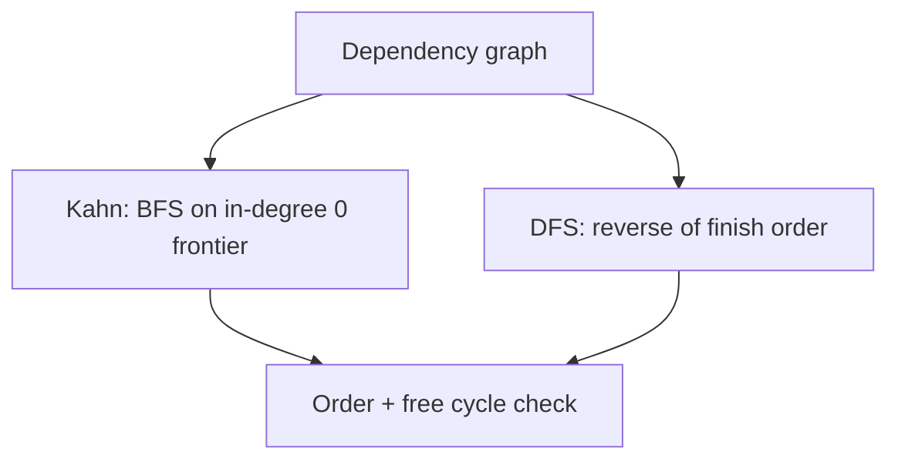

# Topological Sort — Junior Level

> **One-line summary:** A topological sort is a linear ordering of the vertices of a **directed acyclic graph (DAG)** such that for every edge `u → v`, vertex `u` comes before vertex `v` in the order. It answers the question "in what order can I do these tasks so every prerequisite is finished first?", runs in `O(V + E)`, and exists if and only if the graph has no cycle.

---

## Table of Contents

1. [Introduction](#introduction)
2. [Prerequisites](#prerequisites)
3. [Glossary](#glossary)
4. [Core Concepts](#core-concepts)
5. [Big-O Summary](#big-o-summary)
6. [Real-World Analogies](#real-world-analogies)
7. [Pros & Cons](#pros--cons)
8. [Step-by-Step Walkthrough](#step-by-step-walkthrough)
9. [Code Examples](#code-examples)
10. [Coding Patterns](#coding-patterns)
11. [Error Handling](#error-handling)
12. [Performance Tips](#performance-tips)
13. [Best Practices](#best-practices)
14. [Edge Cases & Pitfalls](#edge-cases--pitfalls)
15. [Common Mistakes](#common-mistakes)
16. [Cheat Sheet](#cheat-sheet)
17. [Visual Animation](#visual-animation)
18. [Summary](#summary)
19. [Further Reading](#further-reading)

---

## Introduction

Almost every system that "does things in the right order" is, somewhere inside, running a **topological sort**. When `make` decides which object files to compile before linking, when a package manager (`npm`, `apt`, `cargo`) figures out which dependency to install first, when a spreadsheet recalculates cells after you edit one number, when a university validates that you took *Calculus I* before *Calculus II* — they are all topologically sorting a directed graph of dependencies.

The idea is simple to state. You have a set of items, and some items must come **before** others. Draw an arrow `u → v` to mean "`u` must come before `v`". A topological sort is any straight-line listing of all the items that never violates an arrow: whenever there is an arrow `u → v`, `u` appears earlier in the list than `v`.

Two facts make this a *data-structures-and-algorithms* topic rather than just a definition:

1. **A topological order exists if and only if the graph is acyclic.** If there is a cycle `a → b → c → a`, no listing can place all three "before" each other — it is a contradiction. So topological sorting and **cycle detection** are two sides of the same coin.
2. **There are usually many valid orders, not one.** If two tasks have no dependency between them, either can go first. This non-uniqueness trips up beginners constantly.

There are two classic algorithms, both `O(V + E)`:

- **Kahn's algorithm** (1962) — a BFS-style approach. Repeatedly take any vertex with no remaining prerequisites (in-degree 0), output it, and "remove" its outgoing edges.
- **DFS-based** — run a depth-first search; the **reverse of the order in which vertices finish** is a valid topological order. (DFS is covered in the sibling topic `03-dfs`.)

This file teaches both from scratch.

---

## Prerequisites

Before you read this file you should be comfortable with:

- **Directed graphs** — vertices and directed edges, and how to store them as an **adjacency list**.
- **BFS and queues** — Kahn's algorithm is essentially a BFS over a frontier of "ready" vertices.
- **DFS and recursion** — the second algorithm is a depth-first traversal with a twist.
- **Arrays / hash maps** — to track an `indegree[]` count or a `visited[]` flag per vertex.
- **Big-O notation** — `O(V + E)`, the standard graph traversal bound.

Optional but helpful:

- A min-heap / priority queue (`heapq`, `PriorityQueue`, `container/heap`) — used for the *lexicographically smallest* variant in [`middle.md`](./middle.md).
- The idea of a **stack** — the DFS version pushes finished vertices onto a stack.

---

## Glossary

| Term | Meaning |
|------|---------|
| **Directed graph (digraph)** | A graph whose edges have direction: `u → v` is not the same as `v → u`. |
| **DAG** | Directed **A**cyclic **G**raph — a directed graph with no directed cycle. |
| **Topological order / topological sort** | A linear ordering of vertices where every edge `u → v` has `u` before `v`. |
| **In-degree** | For a vertex `v`, the number of edges pointing *into* `v`. |
| **Out-degree** | For a vertex `v`, the number of edges pointing *out of* `v`. |
| **Source** | A vertex with in-degree 0 (no prerequisites). A topo order always starts with a source. |
| **Sink** | A vertex with out-degree 0 (nothing depends on it). |
| **Kahn's algorithm** | BFS-style topo sort: repeatedly emit a vertex of in-degree 0 and decrement its neighbours. |
| **DFS post-order / finish time** | The moment DFS finishes exploring a vertex (after all its descendants). |
| **Back edge** | An edge from a vertex to one of its DFS ancestors — its presence proves a **cycle**. |
| **Cycle** | A path that returns to its start (`a → b → c → a`). A graph with a cycle has *no* topo order. |

---

## Core Concepts

### 1. The DAG and why acyclicity matters

A topological order only exists for a **DAG**. Intuitively, the order says "do `u` before `v`". If a cycle `a → b → a` existed you would need `a` before `b` *and* `b` before `a` simultaneously — impossible. So the very first thing both algorithms do, implicitly or explicitly, is *also* detect whether the graph is a DAG at all.

```
   Valid DAG (has a topo order):        Has a cycle (no topo order):

        A → B → D                            A → B
        ↓       ↑                            ↑   ↓
        C ──────┘                            D ← C
```

### 2. In-degree: the heart of Kahn's algorithm

The **in-degree** of a vertex is how many prerequisites it is still waiting on. A vertex with in-degree 0 is **ready** — nothing blocks it. Kahn's algorithm is exactly:

```
1. Compute indegree[v] for every vertex.
2. Put every vertex with indegree 0 into a queue.
3. While the queue is not empty:
     u = queue.pop()
     append u to the output order
     for each edge u → w:
         indegree[w] -= 1          # we "removed" the edge u → w
         if indegree[w] == 0:
             queue.push(w)         # w is now ready
4. If we emitted all V vertices, the order is valid.
   If fewer than V were emitted, a cycle exists.
```

The cycle check in step 4 falls out for free: vertices stuck inside a cycle never reach in-degree 0, so they are never emitted.

### 3. DFS-based topological sort

The depth-first approach (using DFS from `03-dfs`) builds the order from **finish times**:

```
visited = empty set
order = empty stack

dfs(u):
    mark u visited
    for each edge u → w:
        if w not visited:
            dfs(w)
    push u onto order            # u is "finished" — all descendants done

for each vertex v:
    if v not visited:
        dfs(v)

answer = order reversed          # reverse of finish order = topo order
```

The key insight: when DFS *finishes* a vertex `u`, every vertex reachable from `u` has already been finished and pushed. So `u` ends up **below** all its descendants on the stack; reversing puts `u` **before** them — exactly the topological property. (Why this works in full is proved in [`professional.md`](./professional.md).)

### 4. Cycle detection in DFS

The DFS version detects cycles with a three-color scheme: white (unvisited), gray (on the current recursion stack), black (finished). If DFS ever follows an edge to a **gray** vertex, that edge is a **back edge** and the graph has a cycle — so no topological order exists.

### 5. Kahn vs DFS — same answer, different shape

Both produce a valid topological order in `O(V + E)`. Kahn's is iterative and naturally lets you pick *which* ready vertex to emit next (useful for the lexicographically smallest order). DFS is recursive, reuses the DFS you already know, and detects cycles via back edges. Pick whichever fits your problem.

---

## Big-O Summary

| Operation | Time | Space | Notes |
|-----------|------|-------|-------|
| Kahn's algorithm | **O(V + E)** | O(V) | One pass to build in-degrees, one BFS-style sweep. |
| DFS-based topo sort | **O(V + E)** | O(V) | Recursion stack + visited + output stack. |
| Build in-degree array | O(V + E) | O(V) | Scan every edge once. |
| Cycle detection (either method) | O(V + E) | O(V) | Free: Kahn emits `< V`; DFS finds a back edge. |
| Lexicographically smallest order (Kahn + min-heap) | **O(V log V + E)** | O(V) | Replace the plain queue with a min-heap. |
| Counting all distinct topological orders | **#P-hard** (exponential in general) | — | Discussed in [`middle.md`](./middle.md) / [`professional.md`](./professional.md). |

`V` = number of vertices, `E` = number of edges.

---

## Real-World Analogies

| Concept | Analogy |
|---------|---------|
| Topological order | **Getting dressed.** You must put on socks before shoes and a shirt before a jacket. There are several valid orders (socks then shirt, or shirt then socks), but you can never put shoes on before socks. The dependency arrows force a partial order; any valid dressing sequence is a topological sort. |
| In-degree 0 = "ready" | An item you can put on *right now* because nothing it depends on is missing — underwear, socks, a t-shirt. |
| Emitting a vertex | Actually putting on a garment, which may unlock others (putting on the shirt makes the jacket "ready"). |
| Course prerequisites | You cannot take *Algorithms* before *Data Structures*, nor *Data Structures* before *Intro to Programming*. A valid semester-by-semester plan is a topological sort of the prerequisite graph. |
| A cycle = impossible plan | If course A requires B, B requires C, and C requires A, no schedule can satisfy all three — the catalog has a bug. That is a cycle, and there is no topo order. |

Where the analogy breaks: in real dressing you can sometimes do two things "at once" (parallel). A plain topological sort produces a strictly *linear* order; the parallel/level version appears in [`senior.md`](./senior.md).

---

## Pros & Cons

| Pros | Cons |
|------|------|
| Linear time `O(V + E)` — as fast as a single traversal. | Only defined for DAGs; a cycle makes the answer undefined. |
| Detects cycles for free as a by-product. | The order is usually **not unique** — beginners assume it is and write fragile tests. |
| Two interchangeable algorithms (Kahn / DFS) to fit BFS- or DFS-shaped code. | Disconnected DAGs need you to start from *all* sources, not just one. |
| Foundation for DAG shortest/longest path and DP on a DAG. | DFS recursion can stack-overflow on very deep graphs; you may need an explicit stack. |
| Kahn's order can be steered (e.g. lexicographically smallest via a heap). | Requires the dependency direction to be modeled correctly — a reversed edge silently gives the reverse order. |

**When to use:** scheduling tasks with prerequisites, build systems, dependency/package resolution, course planning, spreadsheet recalculation, instruction scheduling, linker symbol resolution, any "do these in a valid order" problem.

**When NOT to use:** when the graph can legitimately have cycles (use strongly-connected-components / condensation first — see sibling `09-strongly-connected-components`), or when you need *all* orders enumerated and the graph is large (counting is `#P`-hard).

---

## Step-by-Step Walkthrough

Consider this DAG of 6 tasks (think of them as build steps):

```
   5 → 2 → 3
   │       ↑
   └─→ 0   │
   4 → 0   │
   4 → 1 ──┘
```

Edges: `5→2, 5→0, 4→0, 4→1, 2→3, 1→3`.

**Step 0 — compute in-degrees:**

```
indegree = { 0:2, 1:1, 2:1, 3:2, 4:0, 5:0 }
```

**Step 1 — queue all in-degree-0 vertices:** `queue = [4, 5]` (order depends on how you scan; let's process 4 first).

**Run Kahn's algorithm:**

```
emit 4 → order=[4]     ; decrement 0→1, 1→0  ; 1 becomes ready  → queue=[5,1]
emit 5 → order=[4,5]   ; decrement 2→0, 0→0  ; 2,0 become ready → queue=[1,2,0]
emit 1 → order=[4,5,1] ; decrement 3→1       ;                  → queue=[2,0]
emit 2 → order=[4,5,1,2]; decrement 3→0      ; 3 becomes ready  → queue=[0,3]
emit 0 → order=[4,5,1,2,0]; (no outgoing)    →                  queue=[3]
emit 3 → order=[4,5,1,2,0,3]                 →                  queue=[]
```

We emitted all 6 vertices, so the graph is a DAG and `[4, 5, 1, 2, 0, 3]` is a valid topological order. Verify a few edges: `5→2` (5 before 2 ✓), `2→3` (2 before 3 ✓), `4→1` (4 before 1 ✓).

**Note the non-uniqueness:** had we emitted 5 before 4, we would have gotten a different but equally valid order such as `[5, 4, 2, 0, 1, 3]`. Both are correct.

---

## Code Examples

### Example: Kahn's algorithm and DFS-based topological sort

Both functions take `n` (vertex count) and an adjacency list, and return a topological order — or signal that a cycle exists.

#### Go

```go
package main

import "fmt"

// kahn returns a topological order and ok=true, or ok=false if a cycle exists.
func kahn(n int, adj [][]int) ([]int, bool) {
	indeg := make([]int, n)
	for u := 0; u < n; u++ {
		for _, w := range adj[u] {
			indeg[w]++
		}
	}
	queue := []int{}
	for v := 0; v < n; v++ {
		if indeg[v] == 0 {
			queue = append(queue, v)
		}
	}
	order := []int{}
	for len(queue) > 0 {
		u := queue[0]
		queue = queue[1:]
		order = append(order, u)
		for _, w := range adj[u] {
			indeg[w]--
			if indeg[w] == 0 {
				queue = append(queue, w)
			}
		}
	}
	return order, len(order) == n // fewer than n emitted => cycle
}

// dfsTopo returns a topological order via reverse finish order, ok=false on cycle.
func dfsTopo(n int, adj [][]int) ([]int, bool) {
	const (
		white = 0
		gray  = 1
		black = 2
	)
	color := make([]int, n)
	order := []int{}
	ok := true
	var dfs func(u int)
	dfs = func(u int) {
		color[u] = gray
		for _, w := range adj[u] {
			if color[w] == gray { // back edge => cycle
				ok = false
			} else if color[w] == white {
				dfs(w)
			}
		}
		color[u] = black
		order = append(order, u) // u finished
	}
	for v := 0; v < n; v++ {
		if color[v] == white {
			dfs(v)
		}
	}
	// reverse finish order
	for i, j := 0, len(order)-1; i < j; i, j = i+1, j-1 {
		order[i], order[j] = order[j], order[i]
	}
	return order, ok
}

func main() {
	n := 6
	adj := make([][]int, n)
	add := func(u, w int) { adj[u] = append(adj[u], w) }
	add(5, 2)
	add(5, 0)
	add(4, 0)
	add(4, 1)
	add(2, 3)
	add(1, 3)

	if order, ok := kahn(n, adj); ok {
		fmt.Println("Kahn:", order)
	} else {
		fmt.Println("Kahn: cycle detected")
	}
	if order, ok := dfsTopo(n, adj); ok {
		fmt.Println("DFS :", order)
	} else {
		fmt.Println("DFS : cycle detected")
	}
}
```

#### Java

```java
import java.util.*;

public class TopoSort {

    // Kahn's algorithm. Returns null if a cycle exists.
    public static List<Integer> kahn(int n, List<List<Integer>> adj) {
        int[] indeg = new int[n];
        for (int u = 0; u < n; u++)
            for (int w : adj.get(u)) indeg[w]++;

        Deque<Integer> queue = new ArrayDeque<>();
        for (int v = 0; v < n; v++)
            if (indeg[v] == 0) queue.add(v);

        List<Integer> order = new ArrayList<>();
        while (!queue.isEmpty()) {
            int u = queue.poll();
            order.add(u);
            for (int w : adj.get(u)) {
                if (--indeg[w] == 0) queue.add(w);
            }
        }
        return order.size() == n ? order : null; // < n emitted => cycle
    }

    // DFS-based: reverse of finish order. Returns null on cycle.
    public static List<Integer> dfsTopo(int n, List<List<Integer>> adj) {
        int[] color = new int[n]; // 0=white, 1=gray, 2=black
        List<Integer> order = new ArrayList<>();
        boolean[] acyclic = { true };
        for (int v = 0; v < n; v++)
            if (color[v] == 0) dfs(v, adj, color, order, acyclic);
        if (!acyclic[0]) return null;
        Collections.reverse(order);
        return order;
    }

    private static void dfs(int u, List<List<Integer>> adj, int[] color,
                            List<Integer> order, boolean[] acyclic) {
        color[u] = 1;
        for (int w : adj.get(u)) {
            if (color[w] == 1) acyclic[0] = false; // back edge
            else if (color[w] == 0) dfs(w, adj, color, order, acyclic);
        }
        color[u] = 2;
        order.add(u);
    }

    public static void main(String[] args) {
        int n = 6;
        List<List<Integer>> adj = new ArrayList<>();
        for (int i = 0; i < n; i++) adj.add(new ArrayList<>());
        adj.get(5).add(2); adj.get(5).add(0);
        adj.get(4).add(0); adj.get(4).add(1);
        adj.get(2).add(3); adj.get(1).add(3);

        System.out.println("Kahn: " + kahn(n, adj));
        System.out.println("DFS : " + dfsTopo(n, adj));
    }
}
```

#### Python

```python
from collections import deque


def kahn(n, adj):
    """Return a topological order, or None if a cycle exists."""
    indeg = [0] * n
    for u in range(n):
        for w in adj[u]:
            indeg[w] += 1

    queue = deque(v for v in range(n) if indeg[v] == 0)
    order = []
    while queue:
        u = queue.popleft()
        order.append(u)
        for w in adj[u]:
            indeg[w] -= 1
            if indeg[w] == 0:
                queue.append(w)

    return order if len(order) == n else None  # < n emitted => cycle


def dfs_topo(n, adj):
    """Reverse-finish-order topological sort, or None on cycle."""
    WHITE, GRAY, BLACK = 0, 1, 2
    color = [WHITE] * n
    order = []
    acyclic = True

    def dfs(u):
        nonlocal acyclic
        color[u] = GRAY
        for w in adj[u]:
            if color[w] == GRAY:        # back edge => cycle
                acyclic = False
            elif color[w] == WHITE:
                dfs(w)
        color[u] = BLACK
        order.append(u)                 # u finished

    for v in range(n):
        if color[v] == WHITE:
            dfs(v)

    return order[::-1] if acyclic else None


if __name__ == "__main__":
    n = 6
    adj = [[] for _ in range(n)]
    for u, w in [(5, 2), (5, 0), (4, 0), (4, 1), (2, 3), (1, 3)]:
        adj[u].append(w)

    print("Kahn:", kahn(n, adj))
    print("DFS :", dfs_topo(n, adj))
```

**What it does:** both functions return a valid order for the example DAG (orders may differ between methods and between runs because in-degree-0 vertices can be chosen in any order).
**Run:** `go run main.go` | `javac TopoSort.java && java TopoSort` | `python topo.py`

---

## Coding Patterns

### Pattern 1: Kahn's algorithm as cycle detection ("can finish?")

**Intent:** Many problems (e.g. *Course Schedule*) only ask "is there *any* valid order?". Run Kahn's and check whether you emitted all `V` vertices.

```python
def can_finish(n, prerequisites):
    adj = [[] for _ in range(n)]
    indeg = [0] * n
    for course, pre in prerequisites:   # must take `pre` before `course`
        adj[pre].append(course)
        indeg[course] += 1
    queue = deque(v for v in range(n) if indeg[v] == 0)
    seen = 0
    while queue:
        u = queue.popleft()
        seen += 1
        for w in adj[u]:
            indeg[w] -= 1
            if indeg[w] == 0:
                queue.append(w)
    return seen == n
```

### Pattern 2: Building the adjacency list from "X depends on Y"

**Intent:** Get the edge direction right. "Task `A` depends on `B`" means **B must come first**, so the edge is `B → A` (and `A`'s in-degree increases). Reversing this is the single most common bug.

### Pattern 3: DFS reverse post-order

**Intent:** Reuse the DFS you already wrote. Append each vertex to a list *after* visiting all its neighbours, then reverse the list at the end.



---

## Error Handling

| Error | Cause | Fix |
|-------|-------|-----|
| Returned order has fewer than `V` vertices | The graph contains a cycle. | Treat "emitted `< V`" (Kahn) or "found a back edge" (DFS) as "no topological order exists" and report it. |
| Some vertices missing from the order | You started DFS/BFS from a single source on a **disconnected** DAG. | Loop over *all* vertices and start from every unvisited / in-degree-0 vertex. |
| `RecursionError` / stack overflow (DFS) | Very deep graph exceeds the recursion limit. | Use Kahn's iterative algorithm, or an explicit stack, or raise the recursion limit. |
| Order is "wrong" (reversed) | Edge direction modeled backwards, or you forgot to reverse the DFS finish list. | Double-check `u → v` means "u before v"; remember the DFS list must be **reversed**. |
| `IndexError` on `indegree[w]` | Vertex ids not in `[0, n)`, or `n` undersized. | Validate the vertex range, or use a hash map keyed by vertex id. |

---

## Performance Tips

- **Use an adjacency list, not a matrix.** A matrix makes the algorithm `O(V²)`; the list keeps it `O(V + E)`.
- **Prefer Kahn's iterative version for huge graphs** to avoid recursion-depth limits.
- **Compute in-degrees in the same pass** that you build the adjacency list when you can, to avoid a second scan.
- **Use a plain FIFO queue** if you do not care about *which* valid order; only switch to a min-heap when you specifically need the lexicographically smallest order (it adds a `log V` factor).
- **Avoid re-allocating** the queue/stack inside loops; reuse buffers in hot paths.

---

## Best Practices

- Decide and document the edge direction convention (`u → v` = "u before v") at the top of the file. Reversed edges are the #1 source of bugs.
- Always handle the cycle case explicitly — never return a partial order as if it were complete.
- Loop over all vertices to handle disconnected DAGs and multiple sources.
- When testing, verify the *property* ("for every edge `u → v`, index(u) < index(v)") rather than comparing against one hard-coded expected order — there are many valid orders.
- Choose Kahn's when you may need to steer the order (lexicographic, priority); choose DFS when you already have a DFS and want cycle detection alongside.

---

## Edge Cases & Pitfalls

- **Empty graph (`V = 0`)** — the empty order is trivially valid. Make sure your code returns `[]`, not an error.
- **No edges** — every vertex has in-degree 0; *any* permutation is a valid topological order.
- **Single cycle** — no order exists; both algorithms must report this, not loop forever.
- **Self-loop `v → v`** — a self-loop is a cycle of length 1; there is no topological order.
- **Disconnected components** — you must start from every source / unvisited vertex, or you will silently drop whole components.
- **Multiple valid answers** — never assert a unique expected output in tests; assert the ordering property instead.
- **Parallel (duplicate) edges** — harmless, but they inflate in-degrees; make sure your decrement logic still drains them to 0.

---

## Common Mistakes

1. **Reversing the edge direction.** "A depends on B" is the edge `B → A`. Getting this backwards yields the reverse order and passes small tests by luck.
2. **Forgetting to reverse the DFS finish list.** Finish order is the *reverse* of a topological order; appending without reversing gives a wrong answer.
3. **Assuming the order is unique.** Tests that compare to a single expected list break the moment the queue/heap picks a different ready vertex.
4. **Only starting from one source.** On disconnected DAGs you must iterate over all vertices.
5. **Not detecting cycles.** Returning a partial Kahn order (length `< V`) as if it were complete is a silent correctness bug.
6. **Infinite recursion on a cycle** in a naive DFS without the gray/visited state — you must mark vertices on the recursion stack.
7. **Using a matrix** and accidentally turning an `O(V + E)` algorithm into `O(V²)` on a sparse graph.

---

## Cheat Sheet

| Question | Answer |
|----------|--------|
| When does a topo order exist? | Iff the graph is a **DAG** (no directed cycle). |
| Two algorithms? | **Kahn's** (BFS on in-degree) and **DFS** (reverse finish order). |
| Complexity? | `O(V + E)` for both. |
| Cycle detection? | Kahn: emitted `< V`. DFS: found a **back edge** (gray neighbour). |
| Is the order unique? | Usually **no** — many valid orders. |
| Lexicographically smallest? | Kahn's with a **min-heap** instead of a queue → `O(V log V + E)`. |
| Edge meaning? | `u → v` means "**u** must come **before** v". |

Kahn's skeleton:

```
indegree[]  →  queue all 0s  →  emit u, decrement neighbours, enqueue new 0s
emitted == V ? valid order : cycle
```

DFS skeleton:

```
for each unvisited v: dfs(v)
dfs(u): visit children, then append u
answer = finish_list reversed
```

---

## Visual Animation

> See [`animation.html`](./animation.html) for an interactive visual animation of Kahn's algorithm.
>
> The animation demonstrates:
> - In-degree counts shown on each vertex
> - The "ready" queue of in-degree-0 vertices filling and draining
> - Vertices being emitted into the output order, one at a time
> - Edges being removed and neighbours' in-degrees decrementing
> - Cycle detection: when fewer than `V` vertices are emitted, the stuck (cyclic) vertices are highlighted
> - Step / Run / Reset controls

---

## Summary

A topological sort linearizes the vertices of a DAG so that every dependency edge points "forward". It exists **if and only if** the graph is acyclic, which makes topological sorting and cycle detection inseparable. Two `O(V + E)` algorithms produce it: **Kahn's algorithm** repeatedly emits in-degree-0 vertices using a queue, and the **DFS-based** method reverses the order in which vertices finish. Remember three things and you have mastered the basics: model the edge direction correctly, handle cycles and disconnected components, and never assume the order is unique.

---

## Further Reading

- *Introduction to Algorithms* (CLRS), Chapter 22 — "Elementary Graph Algorithms" — topological sort via DFS and the white/gray/black coloring.
- A. B. Kahn, "Topological sorting of large networks", *Communications of the ACM* 5(11), 1962 — the original Kahn's algorithm.
- *Algorithms* (Sedgewick & Wayne), Section 4.2 — "Directed Graphs" — reverse post-order topological sort.
- Sibling topic `03-dfs` — depth-first search, the engine of the DFS-based method.
- visualgo.net — "Topological Sort (Kahn's / DFS)" — interactive visualisation.
