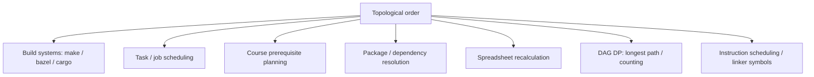

# Topological Sort — Middle Level

> **Focus:** Why reverse-postorder is provably correct, how each algorithm detects cycles, how to steer the order (lexicographically smallest), and how topological order powers DAG dynamic programming — longest path, critical path, and counting.

---

## Table of Contents

1. [Introduction](#introduction)
2. [Deeper Concepts](#deeper-concepts)
3. [Comparison with Alternatives](#comparison-with-alternatives)
4. [Advanced Patterns](#advanced-patterns)
5. [Graph and Tree Applications](#graph-and-tree-applications)
6. [Algorithmic Integration](#algorithmic-integration)
7. [Code Examples](#code-examples)
8. [Error Handling](#error-handling)
9. [Performance Analysis](#performance-analysis)
10. [Best Practices](#best-practices)
11. [Visual Animation](#visual-animation)
12. [Summary](#summary)

---

## Introduction

At junior level a topological sort is "emit in-degree-0 vertices" or "reverse the DFS finish order". At middle level you ask the *engineering* and *correctness* questions:

- *Why* is the reverse of the DFS finish order a valid topological order — not just "it works on my example"?
- How do Kahn's and DFS detect cycles, and what is the difference between the two cycle signals?
- When two vertices are both ready, how do I get the **lexicographically smallest** order — and what does that cost?
- A topological order is a *processing order*. What can I compute in one sweep over it? (Answer: longest path, critical path, number of paths, and most DAG DP.)
- How many distinct topological orders does a DAG have, and why is counting them hard?

These questions turn topological sort from a trick into a tool you reach for whenever a problem has the shape "process states so every dependency is resolved first".

---

## Deeper Concepts

### Why reverse-postorder works

**Claim.** For a DAG, listing vertices in *decreasing* order of DFS finish time yields a valid topological order.

**Argument.** Consider any edge `u → v`. When DFS explores `u` and reaches the edge `u → v`, exactly one of these holds in a DAG (a back edge to a gray ancestor is impossible because that would be a cycle):

- **`v` is white (unvisited).** DFS recurses into `v` and fully finishes `v` *before* returning to finish `u`. So `finish(v) < finish(u)`.
- **`v` is black (already finished).** Then `finish(v) < finish(u)` trivially, since `v` finished earlier.

In both cases `finish(u) > finish(v)`. Listing by decreasing finish time therefore places `u` before `v` for **every** edge — the definition of a topological order. The only excluded case is a gray `v`, which is a back edge, which only exists if there is a cycle. Hence the method is correct *exactly* on DAGs. A formal loop-invariant proof appears in [`professional.md`](./professional.md).

### Cycle detection: two different signals

The two algorithms detect the *same* condition (the graph is not a DAG) but expose it differently:

| | Kahn's | DFS |
|---|--------|-----|
| **Signal** | Fewer than `V` vertices emitted. | An edge to a **gray** (on-stack) vertex — a back edge. |
| **What you learn** | *That* a cycle exists; the un-emitted vertices form (or feed into) cycles. | *Where* a cycle is — the gray ancestor plus the current path reconstruct it. |
| **Recovering the cycle** | Harder: do a second search over the residual subgraph of vertices with in-degree > 0. | Easy: walk the recursion stack from the current vertex back to the gray ancestor. |

If you need to *report* the offending cycle (e.g. "circular dependency: A → B → C → A"), prefer DFS — the gray edge gives you the cycle almost for free.

### In-degree 0 frontier is a choice, not a fixed order

Kahn's algorithm never says *which* in-degree-0 vertex to emit next. That freedom is exactly why a DAG can have many topological orders. The data structure you use for the frontier decides the policy:

- **Plain queue (FIFO)** → BFS-like order, `O(V + E)`.
- **Stack (LIFO)** → DFS-like order, `O(V + E)`.
- **Min-heap** → lexicographically smallest order, `O(V log V + E)`.
- **Priority by deadline / weight** → critical-path-aware scheduling (see [`senior.md`](./senior.md)).

### Counting topological orders

The number of distinct topological orders is the number of **linear extensions** of the partial order the DAG represents. For a DAG that is a single chain there is exactly 1; for `n` vertices with no edges there are `n!`. Computing the exact count is **#P-complete** in general (Brightwell & Winkler, 1991), so brute-force `O(2^V · V)` DP over vertex subsets is the standard exact approach and only works for small `V` (≈ 20). This is expanded in [`professional.md`](./professional.md).

---

## Comparison with Alternatives

| Attribute | Kahn's (queue) | Kahn's (min-heap) | DFS reverse-postorder | DFS + SCC condensation |
|-----------|----------------|-------------------|-----------------------|------------------------|
| Time | O(V + E) | O(V log V + E) | O(V + E) | O(V + E) |
| Space | O(V) | O(V) | O(V) (recursion) | O(V) |
| Style | Iterative BFS | Iterative + heap | Recursive | Recursive |
| Cycle signal | emitted `< V` | emitted `< V` | back edge (gray) | builds a DAG of SCCs |
| Lexicographically smallest? | No (arbitrary) | **Yes** | No | No |
| Reports the cycle? | Indirectly | Indirectly | **Directly** | Yes (SCC > 1 vertex) |
| Deep-graph safe? | **Yes** (no recursion) | Yes | No (stack depth) | No without explicit stack |

**Choose Kahn's queue when:** you want the simplest, recursion-free linear sort and only need *some* valid order.

**Choose Kahn's min-heap when:** the problem demands the lexicographically smallest (or otherwise prioritized) order.

**Choose DFS reverse-postorder when:** you already have DFS, want to detect *and report* cycles, or want finish times for other algorithms (SCC, etc.).

**Choose SCC condensation when:** the graph *may* have cycles but you still want a meaningful order over the "blocks" — collapse each strongly connected component to a super-node and topologically sort the resulting DAG (see sibling `09-strongly-connected-components`).

---

## Advanced Patterns

### Pattern: Lexicographically smallest topological order

Replace Kahn's FIFO queue with a **min-heap**. At every step you emit the *smallest-numbered* ready vertex, which greedily yields the lexicographically smallest order.

```
indegree[]  →  min-heap of all in-degree-0 vertices
while heap not empty:
    u = heap.pop_min()
    emit u
    for each u → w: indegree[w]--; if 0 then heap.push(w)
```

This is a greedy choice: among all currently-ready vertices, picking the smallest can never hurt, because the others remain available later. The cost rises to `O(V log V + E)` because of the heap.

### Pattern: Longest path / critical path in a DAG

In a general graph the longest path is NP-hard, but in a **DAG** it is `O(V + E)`: process vertices in topological order and relax forward.

```
topo = topological_order(G)
dist[v] = 0 for all v          # or -inf if you require reaching from a source
for u in topo:                 # u's predecessors are all processed already
    for edge u → w with weight wt:
        dist[w] = max(dist[w], dist[u] + wt)
```

Because `u` precedes `w` in topo order, `dist[u]` is final before it is ever used to update `dist[w]`. The maximum `dist[v]` is the longest path; with edge weights = task durations it is the **critical path** of a project schedule.

### Pattern: Counting paths between two vertices in a DAG

```
topo = topological_order(G)
count[s] = 1, count[everything else] = 0
for u in topo:
    for edge u → w:
        count[w] += count[u]
return count[t]
```

One linear sweep gives the number of distinct `s → t` paths. The same skeleton (process in topo order, accumulate from predecessors) is the template for almost all DAG DP.

### Pattern: Counting distinct topological orders (small DAGs)

Bitmask DP over subsets — `dp[mask]` = number of valid orders that emit exactly the vertex set `mask`:

```
dp[0] = 1
for mask over all 2^V subsets:
    for v not in mask:
        if all predecessors of v are in mask:   # v is "ready" given mask
            dp[mask | (1<<v)] += dp[mask]
answer = dp[full]
```

`O(2^V · V)` time — only feasible for `V ≲ 20`. The exact count being expensive is fundamental (#P-complete).

---

## Graph and Tree Applications



- **Build systems.** `make`, `bazel`, and `cargo` model files and rules as a DAG and topologically sort it to decide compile/link order; cycles are reported as configuration errors.
- **Scheduling.** Any set of jobs with "must finish before" constraints (CI pipelines, ETL DAGs, Airflow) is topologically sorted before execution.
- **Spreadsheets.** Cell formulas form a dependency DAG; editing a cell triggers a topological recalculation of everything downstream, and a cyclic reference is flagged.
- **Dependency resolution.** Installing packages in dependency order is a topo sort; a circular dependency is a cycle.

---

## Algorithmic Integration

Topological order is the *enabling preprocessing step* for several other algorithms:

- **DAG shortest path** in `O(V + E)` (faster than Dijkstra, and works with negative weights) — relax edges in topological order.
- **DAG longest path / critical path** — same sweep with `max` instead of `min`.
- **DP on a DAG** — any DP whose subproblem dependency graph is acyclic can be evaluated by processing states in topological order (this is "iterative memoization without recursion").
- **SCC condensation** — collapse cycles into super-nodes, then topologically sort the condensation to reason about a graph that *isn't* a DAG.

The unifying idea: **a topological order guarantees that every value a vertex depends on is already computed when you reach it.** That is precisely the precondition every forward DP needs.

---

## Code Examples

### Lexicographically smallest order (Kahn + min-heap) and DAG longest path

#### Go

```go
package main

import (
	"container/heap"
	"fmt"
)

type IntHeap []int

func (h IntHeap) Len() int            { return len(h) }
func (h IntHeap) Less(i, j int) bool  { return h[i] < h[j] }
func (h IntHeap) Swap(i, j int)       { h[i], h[j] = h[j], h[i] }
func (h *IntHeap) Push(x any)         { *h = append(*h, x.(int)) }
func (h *IntHeap) Pop() any           { old := *h; n := len(old); v := old[n-1]; *h = old[:n-1]; return v }

// Lexicographically smallest topological order. nil if a cycle exists.
func lexTopo(n int, adj [][]int) []int {
	indeg := make([]int, n)
	for u := 0; u < n; u++ {
		for _, w := range adj[u] {
			indeg[w]++
		}
	}
	h := &IntHeap{}
	for v := 0; v < n; v++ {
		if indeg[v] == 0 {
			heap.Push(h, v)
		}
	}
	order := []int{}
	for h.Len() > 0 {
		u := heap.Pop(h).(int)
		order = append(order, u)
		for _, w := range adj[u] {
			indeg[w]--
			if indeg[w] == 0 {
				heap.Push(h, w)
			}
		}
	}
	if len(order) != n {
		return nil
	}
	return order
}

// Longest path length in a weighted DAG, processing in topological order.
func longestPath(n int, adj [][]int, w [][]int, order []int) []int {
	dist := make([]int, n) // 0 = path can start anywhere
	for _, u := range order {
		for i, v := range adj[u] {
			if dist[u]+w[u][i] > dist[v] {
				dist[v] = dist[u] + w[u][i]
			}
		}
	}
	return dist
}

func main() {
	n := 6
	adj := make([][]int, n)
	w := make([][]int, n)
	addW := func(u, v, weight int) { adj[u] = append(adj[u], v); w[u] = append(w[u], weight) }
	addW(5, 2, 3)
	addW(5, 0, 1)
	addW(4, 0, 2)
	addW(4, 1, 4)
	addW(2, 3, 5)
	addW(1, 3, 1)

	order := lexTopo(n, adj)
	fmt.Println("lex order:", order)
	fmt.Println("longest  :", longestPath(n, adj, w, order))
}
```

#### Java

```java
import java.util.*;

public class TopoMiddle {

    // Lexicographically smallest topological order. null if cyclic.
    public static List<Integer> lexTopo(int n, List<List<Integer>> adj) {
        int[] indeg = new int[n];
        for (int u = 0; u < n; u++)
            for (int w : adj.get(u)) indeg[w]++;

        PriorityQueue<Integer> pq = new PriorityQueue<>();
        for (int v = 0; v < n; v++)
            if (indeg[v] == 0) pq.add(v);

        List<Integer> order = new ArrayList<>();
        while (!pq.isEmpty()) {
            int u = pq.poll();
            order.add(u);
            for (int w : adj.get(u))
                if (--indeg[w] == 0) pq.add(w);
        }
        return order.size() == n ? order : null;
    }

    // Longest path in a weighted DAG processed in topological order.
    public static int[] longestPath(int n, List<int[]>[] adj, List<Integer> order) {
        int[] dist = new int[n];
        for (int u : order)
            for (int[] e : adj[u]) {       // e = {to, weight}
                if (dist[u] + e[1] > dist[e[0]]) dist[e[0]] = dist[u] + e[1];
            }
        return dist;
    }

    public static void main(String[] args) {
        int n = 6;
        List<List<Integer>> adj = new ArrayList<>();
        List<int[]>[] wadj = new List[n];
        for (int i = 0; i < n; i++) { adj.add(new ArrayList<>()); wadj[i] = new ArrayList<>(); }
        int[][] edges = {{5,2,3},{5,0,1},{4,0,2},{4,1,4},{2,3,5},{1,3,1}};
        for (int[] e : edges) { adj.get(e[0]).add(e[1]); wadj[e[0]].add(new int[]{e[1], e[2]}); }

        List<Integer> order = lexTopo(n, adj);
        System.out.println("lex order: " + order);
        System.out.println("longest  : " + Arrays.toString(longestPath(n, wadj, order)));
    }
}
```

#### Python

```python
import heapq


def lex_topo(n, adj):
    """Lexicographically smallest topological order, or None if cyclic."""
    indeg = [0] * n
    for u in range(n):
        for w in adj[u]:
            indeg[w] += 1

    heap = [v for v in range(n) if indeg[v] == 0]
    heapq.heapify(heap)
    order = []
    while heap:
        u = heapq.heappop(heap)
        order.append(u)
        for w in adj[u]:
            indeg[w] -= 1
            if indeg[w] == 0:
                heapq.heappush(heap, w)
    return order if len(order) == n else None


def longest_path(n, adj, order):
    """Longest path in a weighted DAG. adj[u] = list of (to, weight)."""
    dist = [0] * n
    for u in order:
        for v, wt in adj[u]:
            if dist[u] + wt > dist[v]:
                dist[v] = dist[u] + wt
    return dist


if __name__ == "__main__":
    n = 6
    plain = [[] for _ in range(n)]
    weighted = [[] for _ in range(n)]
    for u, v, wt in [(5, 2, 3), (5, 0, 1), (4, 0, 2), (4, 1, 4), (2, 3, 5), (1, 3, 1)]:
        plain[u].append(v)
        weighted[u].append((v, wt))

    order = lex_topo(n, plain)
    print("lex order:", order)
    print("longest  :", longest_path(n, weighted, order))
```

---

## Error Handling

| Scenario | What goes wrong | Correct approach |
|----------|----------------|------------------|
| Cycle present, lexicographic variant | Heap drains before all `V` emitted; you return a partial order. | Check `len(order) == n`; return `None`/`nil`/`null` on a cycle. |
| Longest-path on a graph with a cycle | The relaxation loop reads stale `dist[u]` and gives nonsense. | Run topological sort *first*; abort if it reports a cycle. |
| Negative weights in DAG shortest path | None — topo-order relaxation handles negatives fine (unlike Dijkstra). | Use the topo-order sweep, not Dijkstra, when weights can be negative. |
| Counting orders blows up | `2^V` DP runs out of memory/time for `V > ~22`. | Restrict exact counting to small `V`; otherwise estimate/approximate. |
| Heap holds duplicates | A vertex pushed twice if you decrement past 0. | Only push a vertex the instant its in-degree hits exactly 0. |

---

## Performance Analysis

| Method | Time | Constant-factor notes |
|--------|------|------------------------|
| Kahn (queue) | O(V + E) | Cheapest; pure array + FIFO. |
| Kahn (min-heap) | O(V log V + E) | The `log V` only multiplies the `V` heap operations, not the `E` edge scans. |
| DFS reverse-postorder | O(V + E) | Recursion overhead; risk of deep stacks. |
| DAG longest path | O(V + E) | One extra sweep over the topo order. |
| Count linear extensions (bitmask DP) | O(2^V · V) | Exponential — small graphs only. |

In practice all the linear methods run at memory-bandwidth speed: each edge and vertex is touched a constant number of times. The heap variant is the only one with a non-linear term, and even then the `log V` factor is tiny for realistic `V`.

```python
import random, time
from collections import deque

def make_dag(n, p):
    adj = [[] for _ in range(n)]
    for u in range(n):
        for v in range(u + 1, n):       # only forward edges => guaranteed DAG
            if random.random() < p:
                adj[u].append(v)
    return adj

def kahn(n, adj):
    indeg = [0]*n
    for u in range(n):
        for w in adj[u]: indeg[w]+=1
    q = deque(v for v in range(n) if indeg[v]==0)
    order=[]
    while q:
        u=q.popleft(); order.append(u)
        for w in adj[u]:
            indeg[w]-=1
            if indeg[w]==0: q.append(w)
    return order

n = 100_000
adj = make_dag(n, 5 / n)               # ~5 edges per vertex
t = time.time(); kahn(n, adj); print("kahn:", round(time.time()-t, 3), "s")
```

A sparse DAG of 100k vertices topologically sorts in well under a second in pure Python; in Go or Java it is a few milliseconds.

---

## Best Practices

- **Pick the frontier structure deliberately.** Queue for "any order", min-heap for "smallest order", priority queue for scheduling.
- **Topologically sort once, then sweep many times.** Longest path, shortest path, counting, and DP all reuse the same order.
- **Use topo-order relaxation instead of Dijkstra on DAGs** — it is faster and tolerates negative weights.
- **Report cycles, don't hide them.** A circular dependency is almost always a real bug in the input the user needs to fix.
- **Keep counting exact only for small graphs.** Know that the general case is #P-complete before you promise an exact count.

---

## Visual Animation

> See [`animation.html`](./animation.html) for an interactive view.
>
> The middle-level relevant features:
> - Watch the in-degree-0 frontier and how the *choice* of next vertex changes the resulting order.
> - Toggle a cyclic edge to see Kahn's stall with fewer than `V` vertices emitted (the cycle highlighted).
> - Compare the order produced by a FIFO frontier vs the lexicographically smallest order.

---

## Summary

The reverse of the DFS finish order is a topological order because, for every edge `u → v` in a DAG, `v` finishes before `u`; Kahn's algorithm achieves the same by draining the in-degree-0 frontier. Both detect cycles, but DFS pinpoints *where* via a back edge while Kahn only reports *that* one exists. Swapping Kahn's queue for a min-heap yields the lexicographically smallest order at an extra `log V` factor. Most importantly, a topological order is the universal preprocessing step for DAG dynamic programming — longest/critical path, path counting, and shortest path all reduce to one linear sweep over it. Counting *all* valid orders, however, is #P-complete and feasible only for small graphs.
