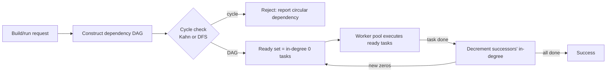

# Topological Sort — Senior Level

> A topological sort is trivial on a single node. The moment it becomes the scheduling backbone of a build system or a distributed workflow engine, every weakness — cycles in the dependency graph, deadlocks, head-of-line blocking on the critical path, dynamic edges arriving mid-run — turns into a production incident.

## Table of Contents
1. [Introduction](#1-introduction)
2. [System Design with Topological Order](#2-system-design-with-topological-order)
3. [Distributed and Parallel Scheduling](#3-distributed-and-parallel-scheduling)
4. [Concurrency: Parallel Kahn with Atomic In-Degrees](#4-concurrency-parallel-kahn-with-atomic-in-degrees)
5. [Comparison at Scale](#5-comparison-at-scale)
6. [Architecture Patterns](#6-architecture-patterns)
7. [Code Examples](#7-code-examples)
8. [Observability](#8-observability)
9. [Failure Modes](#9-failure-modes)
10. [Capacity Planning](#10-capacity-planning)
11. [Summary](#11-summary)

---

## 1. Introduction

At senior level the question is no longer "how does Kahn's algorithm work" but "where does topological order sit in my system, and what breaks when the dependency graph misbehaves?". Topological sort is the kernel inside every dependency-driven executor:

- **Build systems** — `make`, `bazel`, `gradle`, `cargo` compile a DAG of targets in dependency order, and parallelize independent targets.
- **Workflow / job schedulers** — Airflow DAGs, Argo Workflows, Luigi, Dagster, Spark stage scheduling.
- **Data pipelines** — ETL/ELT where a transform may only run once its inputs are materialized.
- **Package managers** — resolve and install in dependency order.

The interesting senior decisions are architectural:

1. How do I run independent tasks **in parallel** while still respecting all `u → v` edges?
2. How do I bound the **critical path** so adding workers actually shortens wall-clock time?
3. How do I keep the in-degree bookkeeping correct under **concurrency**?
4. How do I detect and report a **cycle** (circular dependency) cleanly instead of deadlocking?
5. How do I instrument the executor so on-call sees a stuck DAG, not just "the build is slow"?

This document answers those questions in production terms.

---

## 2. System Design with Topological Order

### 2.1 The executor model

A dependency executor is Kahn's algorithm with the FIFO queue replaced by a **worker pool**:



The "emit a vertex" step of Kahn's becomes "dispatch a task to a worker"; "decrement a neighbour's in-degree" becomes "a finished task unblocks its successors". The queue is now a thread-safe **ready set**, and the loop runs until either all tasks finish (success) or the ready set empties while tasks remain (cycle or deadlock).

### 2.2 Why cycle detection is non-negotiable

In a build or workflow system a cycle is a **user-authored bug** ("A depends on B which depends on A"). If you do not detect it up front, the executor simply never makes progress — workers sit idle, the ready set is empty, and unfinished tasks have in-degree > 0. That looks identical to a deadlock. Always run an explicit topological-feasibility check (Kahn emitted `< V`, or DFS found a back edge) **before** launching any worker, and surface the exact cycle path to the user.

### 2.3 What the order actually buys you

A topological sort gives you a *legal linear order* — but at scale you rarely want the linear order. You want:

- the **set** of currently-runnable tasks (to feed a worker pool), and
- the **critical path** (the longest weighted chain), because that, not the total work, is your wall-clock lower bound.

Both come from the same `O(V + E)` machinery.

---

## 3. Distributed and Parallel Scheduling

### 3.1 Level-by-level (layered) parallel execution

Partition the DAG into **levels** (also called the *antichain decomposition* or longest-path layering): level `0` is all sources; level `k` is every vertex whose longest path from a source has length `k`. All vertices *within* a level are mutually independent and can run concurrently.

```
level[v] = 0 for sources
process u in topological order:
    for edge u → w:
        level[w] = max(level[w], level[u] + 1)
```

Wall-clock time with unlimited workers is `(number of levels)`; with `P` workers it is bounded by `max(critical_path, total_work / P)`. The number of levels equals the length of the longest path, which is your hard floor — no amount of parallelism beats the critical path.

### 3.2 Critical path and the makespan floor

Weight each vertex by its task duration. The **critical path** is the longest weighted path through the DAG; its length is the *minimum possible makespan* even with infinite workers. Computing it is the DAG longest-path sweep from [`middle.md`](./middle.md):

```
finish[u] = duration[u] + max(finish[p] for predecessors p)   # in topo order
makespan_floor = max(finish[v])
```

Any task on the critical path is a scheduling priority: delaying it delays the whole run. This is why production schedulers feed a **priority queue keyed by critical-path slack** into the ready set rather than a plain FIFO.

### 3.3 Distributed execution

When tasks run on different machines (Spark stages, Argo pods, CI runners):

- The **DAG and in-degree state live in a coordinator** (driver / scheduler), which is the single source of truth for "what is ready".
- **Workers pull** ready tasks and report completion; the coordinator decrements in-degrees and re-populates the ready set.
- Completion messages must be **idempotent** — a worker may report "done" twice after a retry, and decrementing an in-degree twice corrupts the schedule.

The topological structure is global; only execution is distributed.

### 3.4 How real schedulers map onto Kahn

Every production DAG engine is a thin policy layer over the parallel-Kahn loop. The vocabulary changes; the algorithm does not.

| System | "Vertex" | "Edge" | "In-degree 0 / ready" | Cycle handling |
|---|---|---|---|---|
| **Make / `make -j`** | a target (file) | prerequisite relation | all prereqs up-to-date | "Circular dependency dropped" warning, edge ignored |
| **Bazel (Skyframe)** | an action / SkyValue | input → output dep | all inputs evaluated | error at analysis time, build rejected |
| **Apache Airflow** | a task instance | `t1 >> t2` upstream link | all upstream tasks `success` | DagBag import error (cycle), DAG not scheduled |
| **Argo Workflows** | a workflow step (pod) | `dependencies:` field | all deps `Succeeded` | controller rejects the workflow spec |
| **Spark DAGScheduler** | a stage | shuffle/narrow dependency | parent stages computed | n/a (lineage is acyclic by construction) |

The common shape: **construct DAG → validate acyclic → seed ready set with sources → as each task succeeds, decrement successors, enqueue new zeros → finish when the completed count equals the task count.** Airflow's scheduler loop literally re-evaluates "which task instances have all upstream dependencies met" on each heartbeat — a Kahn frontier scan, just persisted in a database so it survives a scheduler restart.

### 3.5 Worked level-execution trace

Take a 7-task pipeline (`E=extract, T=transform, L=load`):

```text
   E1     E2
   | \   / |
   v  v v  v
   T1   T2   T3
     \  |   /
      v v  v
       L (load)

edges: E1→T1 E1→T2 E2→T2 E2→T3 T1→L T2→L T3→L
durations(s): E1=10 E2=8 T1=20 T2=15 T3=5 L=12
```

Level-by-level execution with enough workers:

```text
level 0 (sources):  {E1, E2}   run in parallel, finishes at max(10,8)=10s
level 1:            {T1,T2,T3} all upstream done at 10s; run in parallel,
                    finishes at 10 + max(20,15,5) = 30s
level 2:            {L}        upstream done at 30s; finishes at 30+12 = 42s

barrier makespan = 42s
```

With **parallel-Kahn (no barriers)** the result is the same here because `L` waits on the slowest of `T1/T2/T3` regardless. But if a fourth task `T4` (duration 2s) depended only on `E2`, the barrier model would still hold it until the whole `T` level cleared at 30s, whereas parallel-Kahn would run it at 10s. That gap — fast tasks stuck behind a slow sibling at a barrier — is the central reason high-throughput engines (Bazel, Argo) use parallel-Kahn rather than level barriers.

---

## 4. Concurrency: Parallel Kahn with Atomic In-Degrees

The classic parallel formulation keeps the topological invariant correct without a global lock by using **atomic in-degree counters**:

- Each vertex `w` has an atomic `indegree[w]`.
- When a task `u` finishes, for each edge `u → w` it does `if atomic_decrement(indegree[w]) == 0 { enqueue(w) }`.
- The check-and-enqueue is safe because **exactly one** decrement drives the counter to zero, so exactly one thread enqueues `w` — no duplicates, no missed wake-ups.

This is the lock-free heart of parallel build systems. The only shared mutable state is the per-vertex atomic counter and a concurrent ready queue. There is no contention on a global lock; threads only touch the counters of the successors of the task they just finished.

Pitfalls:

- **Double-completion** (retry) decrements a counter twice and can enqueue a successor before all *real* predecessors finish. Guard task completion with idempotency (a `done[u]` flag set with compare-and-swap).
- **The terminator**: you need a separate atomic "remaining tasks" counter to know when the whole DAG is finished, because an empty ready queue alone does not distinguish "done" from "in-flight workers will refill it soon".

---

## 5. Comparison at Scale

| Approach | Parallelism | Cycle handling | Best for | Watch out for |
|----------|-------------|----------------|----------|----------------|
| Linear topo order, single worker | None | Pre-check | Simple deterministic pipelines | Wastes cores; makespan = total work |
| Level-by-level barriers | Within a level | Pre-check | Bulk-synchronous (Spark stages) | A barrier stalls on the slowest task in a level |
| Parallel Kahn (atomic in-degree) | Maximal (any ready task) | Pre-check + deadlock watchdog | Build systems, CI | Double-completion, terminator bug |
| Critical-path-priority scheduling | Maximal, prioritized | Pre-check | Latency-sensitive workflows | Needs accurate duration estimates |
| Distributed coordinator + pull workers | Cross-machine | Coordinator-side | Argo, Airflow, Spark | Idempotency, coordinator as SPOF |

Level-by-level is simplest but its barriers waste the slack of fast tasks; parallel Kahn extracts maximal parallelism but needs careful concurrency; critical-path prioritization minimizes makespan when durations are predictable.

---

## 6. Architecture Patterns

### 6.1 Pre-flight validation

```
parse config -> build DAG -> topological feasibility check
   if not a DAG: reject with the exact cycle path, run nothing
   else: proceed to execution
```

Never start executing a graph you have not proven acyclic. The cost is one `O(V + E)` pass; the benefit is turning a silent deadlock into an actionable error message.

### 6.2 Incremental / dynamic topological order

Build systems re-run after a source file changes. Rather than re-sorting from scratch, maintain the order **incrementally**: when an edge is added, only the affected region needs reordering (Pearce–Kelly online topological order algorithm). The open research question of optimal dynamic maintenance is discussed in [`professional.md`](./professional.md); in practice most systems just re-sort the (usually small) affected subgraph.

### 6.3 Retry and partial re-execution

When a task fails and is retried, its successors must *not* have been started. Because the in-degree of a successor only hits 0 after **all** predecessors succeed, a correctly-implemented executor naturally holds successors back until the retry succeeds — provided completion is reported only on success, never on the attempt.

### 6.4 Priority scheduling into the ready set

Feed the ready set with a priority queue keyed by **critical-path remaining work** (longest path from each vertex to a sink). Dispatch the task whose completion unblocks the most downstream work first. This is Kahn's algorithm with a smarter frontier — the same pattern as the lexicographic variant, but the key is "criticality" instead of "vertex id".

---

## 7. Code Examples

### 7.1 Go — parallel Kahn executor with atomic in-degrees and worker pool

```go
package executor

import (
	"context"
	"fmt"
	"sync"
	"sync/atomic"
)

// Task is a unit of work identified by an int id.
type Task struct {
	ID  int
	Run func(ctx context.Context) error
}

// Run executes the DAG with `workers` goroutines, respecting all u->v edges.
// Returns an error if the graph has a cycle or any task fails.
func Run(ctx context.Context, n int, adj [][]int, tasks []Task, workers int) error {
	indeg := make([]int64, n)
	for u := 0; u < n; u++ {
		for _, w := range adj[u] {
			indeg[w]++
		}
	}

	// Pre-flight cycle check: count reachable-from-source vertices.
	if zeros := countZeros(indeg); zeros == 0 && n > 0 {
		return fmt.Errorf("cycle: no task has in-degree 0")
	}

	ready := make(chan int, n)
	for v := 0; v < n; v++ {
		if atomic.LoadInt64(&indeg[v]) == 0 {
			ready <- v
		}
	}

	var remaining int64 = int64(n)
	var firstErr atomic.Value // holds error
	cctx, cancel := context.WithCancel(ctx)
	defer cancel()

	var wg sync.WaitGroup
	for i := 0; i < workers; i++ {
		wg.Add(1)
		go func() {
			defer wg.Done()
			for {
				select {
				case <-cctx.Done():
					return
				case u, ok := <-ready:
					if !ok {
						return
					}
					if err := tasks[u].Run(cctx); err != nil {
						firstErr.Store(err)
						cancel()
						return
					}
					// Unblock successors.
					for _, w := range adj[u] {
						if atomic.AddInt64(&indeg[w], -1) == 0 {
							ready <- w
						}
					}
					if atomic.AddInt64(&remaining, -1) == 0 {
						close(ready) // all done; wake idle workers
					}
				}
			}
		}()
	}
	wg.Wait()

	if e := firstErr.Load(); e != nil {
		return e.(error)
	}
	if atomic.LoadInt64(&remaining) != 0 {
		return fmt.Errorf("deadlock/cycle: %d tasks never became ready", atomic.LoadInt64(&remaining))
	}
	return nil
}

func countZeros(indeg []int64) int {
	c := 0
	for _, d := range indeg {
		if d == 0 {
			c++
		}
	}
	return c
}
```

Notes for review:

- `indeg` is an atomic counter; exactly one `AddInt64(...) == 0` fires per successor, so each becomes ready exactly once.
- `remaining` is the **terminator** — an empty `ready` channel is not enough to know we are done.
- A failed task cancels the context and stores the first error; in-flight tasks observe `cctx.Done()`.
- A non-zero `remaining` after the pool drains means a cycle slipped past (or all-cycle graph) — reported, not hung.

### 7.2 Java — level-by-level parallel scheduler

```java
import java.util.*;
import java.util.concurrent.*;

public final class LevelScheduler {

    // Executes the DAG level by level; tasks within a level run in parallel.
    public static void run(int n, List<List<Integer>> adj, Runnable[] tasks,
                           ExecutorService pool) throws Exception {
        int[] indeg = new int[n];
        for (int u = 0; u < n; u++)
            for (int w : adj.get(u)) indeg[w]++;

        Deque<Integer> level = new ArrayDeque<>();
        int emitted = 0;
        for (int v = 0; v < n; v++) if (indeg[v] == 0) level.add(v);

        while (!level.isEmpty()) {
            // Snapshot the current level and run it in parallel.
            List<Integer> current = new ArrayList<>(level);
            level.clear();
            List<Future<?>> futures = new ArrayList<>();
            for (int u : current) {
                final int id = u;
                futures.add(pool.submit(tasks[id]));
            }
            for (Future<?> f : futures) f.get(); // barrier: wait for the whole level
            emitted += current.size();

            // Build the next level from freed successors.
            for (int u : current)
                for (int w : adj.get(u))
                    if (--indeg[w] == 0) level.add(w);
        }

        if (emitted != n)
            throw new IllegalStateException(
                "cycle: only " + emitted + " of " + n + " tasks scheduled");
    }
}
```

The barrier (`f.get()` over the level) is the trade-off: simple and deterministic, but the level finishes only as fast as its slowest task. For maximal overlap, use the parallel-Kahn model instead.

### 7.3 Python — critical path (longest weighted path) for makespan analysis

```python
from collections import deque


def critical_path(n, adj, duration):
    """adj[u] = list of successors. duration[v] = task time.
    Returns (makespan_floor, earliest_finish[]). Raises on a cycle."""
    indeg = [0] * n
    for u in range(n):
        for w in adj[u]:
            indeg[w] += 1

    order, q = [], deque(v for v in range(n) if indeg[v] == 0)
    while q:
        u = q.popleft()
        order.append(u)
        for w in adj[u]:
            indeg[w] -= 1
            if indeg[w] == 0:
                q.append(w)
    if len(order) != n:
        raise ValueError("cycle detected: no valid schedule")

    finish = [0] * n
    for u in order:                       # predecessors already finalized
        finish[u] += duration[u]
        for w in adj[u]:
            finish[w] = max(finish[w], finish[u])
    return max(finish), finish


if __name__ == "__main__":
    n = 6
    adj = [[] for _ in range(n)]
    for u, v in [(0, 2), (0, 3), (1, 3), (2, 4), (3, 4), (4, 5)]:
        adj[u].append(v)
    dur = [3, 2, 4, 1, 5, 2]
    floor, finish = critical_path(n, adj, dur)
    print("makespan floor (infinite workers):", floor)
    print("earliest finish per task:", finish)
```

The makespan floor is the wall-clock you cannot beat regardless of worker count — the single most useful number when capacity-planning a pipeline.

---

## 8. Observability

A dependency executor is invisible until it stalls. Wire these from day one.

| Metric | Type | Why |
| --- | --- | --- |
| `dag_tasks_total` | gauge | Size of the graph being run. |
| `dag_ready_set_size` | gauge | How many tasks are runnable now; if it hits 0 with tasks remaining, you are stuck. |
| `dag_inflight` | gauge | Tasks currently executing; near 0 with work left = starvation. |
| `dag_completed_total` | counter | Progress; compare to `tasks_total`. |
| `dag_critical_path_seconds` | gauge | The makespan floor; the wall-clock you cannot beat. |
| `dag_longest_blocked_seconds` | gauge | Oldest still-blocked task — best "stuck DAG" signal. |
| `dag_cycle_rejections_total` | counter | Configs rejected for circular dependencies. |
| `dag_double_completion_total` | counter | Idempotency guard hits — non-zero means retries are racing. |

The single most useful signal is **ready-set-size hitting zero while completed < total**: that is a cycle or deadlock, regardless of how busy the workers looked a moment ago.

Trace tags per task: `task_id`, `level`, `critical_path_slack`, `predecessor_count`, `wait_time_ms`.

---

## 9. Failure Modes

### 9.1 Cycles in the dependency graph

The defining failure. A user adds an edge that closes a loop; the executor can never make progress on the loop's vertices. **Mitigation:** mandatory pre-flight feasibility check; reject with the exact cycle path (DFS gives it directly via the gray ancestor).

### 9.2 Deadlock that looks like a cycle

Even on a true DAG, you can deadlock if a task waits on a *resource* (a lock, a DB connection, a license token) held by a task scheduled later. The dependency graph says "ready" but the task blocks forever. **Mitigation:** keep task bodies free of cross-task resource waits; if unavoidable, model the resource as an explicit edge so it appears in the DAG.

### 9.3 Critical-path head-of-line blocking

A long task on the critical path stalls the whole run while workers sit idle (everything else is downstream of it). **Mitigation:** schedule critical-path tasks first (priority frontier); split long tasks; provision enough workers that off-critical-path work overlaps it.

### 9.4 Double-completion under retries

A retried task reports completion twice, decrementing successors' in-degrees twice, launching them before their real predecessors finish — silent corruption. **Mitigation:** idempotent completion (compare-and-swap a `done[u]` flag; ignore the second report).

### 9.5 Lost completion message (distributed)

A worker finishes but its "done" message is lost; the successor's in-degree never reaches 0 and the DAG stalls. **Mitigation:** at-least-once delivery + idempotent decrement, plus a watchdog that alerts when `ready_set == 0 && completed < total` for longer than a threshold.

### 9.6 Frontier starvation (under-provisioned workers)

The DAG is valid and acyclic, but the ready set holds far more runnable tasks than there are workers, so wall-clock balloons while the *available* parallelism goes unused. This is not a correctness bug — it is a capacity bug that looks like slowness. **Mitigation:** alert when `dag_ready_set_size` stays well above `dag_inflight` for a sustained window (runnable work is queued but unstarted), and size the pool toward the knee `P* = ceil(total_work / critical_path)` from §10.

### 9.7 Dynamic edges arriving mid-run

A task discovers a new dependency at runtime (common in data pipelines). Adding an edge into an already-scheduled vertex can violate an order already in flight. **Mitigation:** only allow new edges into *not-yet-started* vertices, or use an online topological order algorithm and pause affected successors.

---

## 10. Capacity Planning

### 10.1 The makespan floor

With `P` workers and total work `W`, wall-clock is bounded below by:

```
makespan >= max( critical_path_length , W / P )
```

Adding workers helps only until `W / P` drops below the critical path. Past that point you are buying idle cores. Always compute the critical path *before* deciding worker count.

### 10.2 Worker sizing example

A CI build has 4,000 targets, total CPU-work 2,000 seconds, critical path 90 seconds.

- `W / P = 90` requires `P ≈ 22` workers.
- Beyond ~22 workers, wall-clock stays pinned at the 90-second critical path; extra cores are wasted.
- To go below 90s you must *shorten the critical path* (split the longest targets, cache them, or remove edges) — not add workers.

The diminishing-returns curve, where `W=2000s` and `critical_path=90s`:

| Workers `P` | `W / P` | `makespan = max(90, W/P)` | Marginal benefit |
|---|---|---|---|
| 4 | 500s | 500s | — |
| 8 | 250s | 250s | halves wall-clock |
| 16 | 125s | 125s | still helping |
| 22 | 91s | 91s | last useful worker |
| 32 | 62s | **90s** | pinned at critical path |
| 64 | 31s | **90s** | pure waste |

The knee is at `P* = ceil(W / critical_path) = ceil(2000/90) ≈ 23`. Provisioning beyond `P*` buys idle cores; the only lever left is the critical path itself.

### 10.3 Graph size

Topological sort is `O(V + E)` in time and `O(V)` in memory for the in-degree array plus `O(E)` for the adjacency list. A graph of 10M edges sorts in well under a second and fits in a few hundred MB. The sort itself is essentially never the bottleneck; **task execution and coordination overhead** are.

### 10.4 Coordinator throughput (distributed)

Each task completion triggers `out-degree` in-degree decrements plus ready-set updates at the coordinator. At millions of tiny tasks, the coordinator's bookkeeping (not the math) becomes the limit; shard the DAG or batch completion messages.

---

## 11. Summary

- A dependency executor *is* Kahn's algorithm with the FIFO queue replaced by a worker pool and the in-degree array made atomic.
- **Always pre-validate acyclicity.** A cycle is a user bug; without detection it is indistinguishable from a deadlock.
- Maximal parallelism comes from the **parallel-Kahn / atomic-in-degree** model; level-by-level is simpler but wastes the slack of fast tasks at each barrier.
- The **critical path** is your makespan floor. Adding workers helps only until `W / P` falls below it; after that, shorten the critical path instead.
- Concurrency hazards are **double-completion** (decrementing twice) and the **terminator** (an empty ready set is not "done"). Guard both.
- Distributed executors keep the DAG/in-degree state in a **coordinator** with idempotent, at-least-once completion; a watchdog on "ready-set == 0 while tasks remain" catches stalls.
- Observe `ready_set_size`, `longest_blocked_seconds`, and `critical_path_seconds` — they catch stuck DAGs that raw throughput metrics miss.

References to study further: Bazel's action graph and skyframe, Apache Airflow scheduler, Argo Workflows DAG controller, Spark DAGScheduler stages, the Pearce–Kelly dynamic topological order algorithm, and Make's `-j` parallel build engine.
