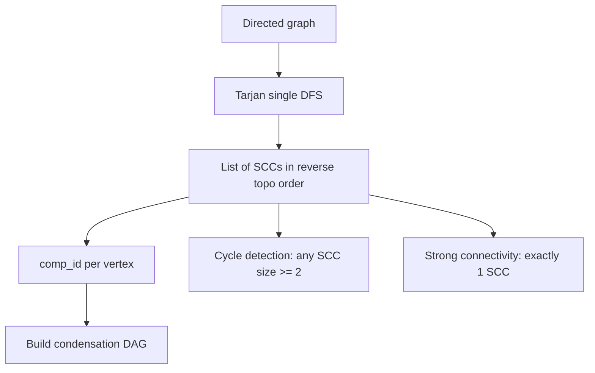

# Tarjan's SCC — Junior Level

> **One-line summary:** A strongly connected component (SCC) of a directed graph is a maximal set of vertices where every vertex can reach every other vertex along directed edges. Tarjan's algorithm finds **all** SCCs in a single depth-first search in `O(V + E)` time by tracking a discovery index `disc[]`, a "lowlink" value `low[]`, and an explicit stack of currently-open vertices.

---

## Table of Contents

1. [Introduction](#introduction)
2. [Prerequisites](#prerequisites)
3. [Glossary](#glossary)
4. [Core Concepts](#core-concepts)
5. [Big-O Summary](#big-o-summary)
6. [Real-World Analogies](#real-world-analogies)
7. [Pros & Cons](#pros--cons)
8. [Step-by-Step Walkthrough](#step-by-step-walkthrough)
9. [Code Examples](#code-examples)
10. [Coding Patterns](#coding-patterns)
11. [Error Handling](#error-handling)
12. [Performance Tips](#performance-tips)
13. [Best Practices](#best-practices)
14. [Edge Cases & Pitfalls](#edge-cases--pitfalls)
15. [Common Mistakes](#common-mistakes)
16. [Cheat Sheet](#cheat-sheet)
17. [Visual Animation](#visual-animation)
18. [Summary](#summary)
19. [Further Reading](#further-reading)

---

## Introduction

In an **undirected** graph, "connected" is simple: two vertices are in the same component if a path exists between them. Direction does not matter, so connectivity is symmetric.

In a **directed** graph the question splits in two. There can be a path from `u` to `v` without any path back from `v` to `u`. So we sharpen the definition: `u` and `v` are **strongly connected** when `u` can reach `v` **and** `v` can reach `u`. A **strongly connected component** is a *maximal* group of vertices that are all mutually reachable.

Every directed graph decomposes uniquely into SCCs. If you "shrink" each SCC down to a single node, the result is a **DAG** (directed acyclic graph) called the **condensation**. That single fact powers a surprising number of applications: deadlock detection, dependency-cycle analysis, 2-SAT solving, compiler loop analysis, and clustering of web pages or social networks.

**Robert Tarjan** published his algorithm in 1972. Its beauty is that it computes every SCC in **one** DFS pass — no second traversal, no transpose graph. It does this by giving every vertex two numbers:

- `disc[v]` — the *discovery index*: the order in which DFS first reached `v`.
- `low[v]` — the *lowlink*: the smallest discovery index reachable from `v` using tree edges plus **at most one** back/cross edge to a vertex still on the stack.

When a vertex `v` finishes DFS and `low[v] == disc[v]`, that vertex is the **root** of an SCC: everything sitting above `v` on a special stack is exactly that SCC, and we pop it off.

If that sounds dense, do not worry — the rest of this file builds it up slowly, with a full hand-trace.

---

## Prerequisites

Before this file you should be comfortable with:

- **Directed graphs** — edges have a direction, `u → v` is not the same as `v → u`.
- **Adjacency-list representation** — `adj[u]` is the list of vertices `u` points to.
- **Depth-first search (DFS)** — recursive traversal, the call stack, visited marking. (See the sibling DFS topic.)
- **Recursion and the call stack** — Tarjan's natural form is recursive.
- **Big-O notation** — `O(V + E)` linear time on graphs.
- **Stacks** — push, pop, and the LIFO discipline.

Optional but helpful:

- Brief exposure to **topological sort** (sibling topic) — the condensation is a DAG you can topo-sort.
- The idea of a **cycle in a directed graph** — every cycle lives inside one SCC.

---

## Glossary

| Term | Meaning |
|------|---------|
| **Directed graph** | A graph where each edge `u → v` has a direction. |
| **Reachable** | `v` is reachable from `u` if a directed path `u → ... → v` exists. |
| **Strongly connected** | `u` and `v` are mutually reachable: `u → v` **and** `v → u`. |
| **SCC** | Strongly Connected Component — a maximal set of mutually reachable vertices. |
| **Condensation** | The DAG formed by contracting each SCC to a single node. |
| **disc[v] (discovery index)** | The timestamp at which DFS first visits `v`. Also called `num`, `index`, or `tin`. |
| **low[v] (lowlink)** | The smallest `disc` value reachable from `v` via tree edges plus one back/cross edge to an on-stack vertex. |
| **On-stack / open vertex** | A vertex whose DFS has started but whose SCC has not been popped yet. |
| **SCC root** | The first vertex of an SCC discovered by DFS; the one with `low[v] == disc[v]`. |
| **Tree edge** | An edge `u → v` where `v` is visited for the first time through `u`. |
| **Back edge** | An edge `u → v` where `v` is an ancestor of `u` (already on the stack). |
| **Cross edge** | An edge `u → v` where `v` is already finished or in another branch; in Tarjan it matters only if `v` is still on the stack. |
| **Sink SCC** | An SCC with no edges leaving it in the condensation. |
| **Source SCC** | An SCC with no edges entering it in the condensation. |

---

## Core Concepts

### 1. What an SCC actually is

Consider this directed graph:

```
    0 → 1 → 2 → 0        (a 3-cycle: {0,1,2} is one SCC)
        2 → 3            (edge out of the cycle)
        3 → 4 → 5 → 3    (another cycle: {3,4,5} is one SCC)
```

There are exactly two SCCs: `{0, 1, 2}` and `{3, 4, 5}`. Within `{0,1,2}` every vertex reaches every other (follow the cycle). The edge `2 → 3` lets `{0,1,2}` reach `{3,4,5}`, but there is **no** path back from `3` to `2`, so they are different components.

A single vertex with no cycle through it is its own SCC of size 1.

### 2. The two numbers: disc and low

DFS assigns `disc[v]` in visiting order (0, 1, 2, ...). Think of `disc[v]` as "what time did we first see `v`."

`low[v]` answers a deeper question: *"What is the oldest (lowest-disc) vertex I can climb back up to, staying inside vertices that are still open?"* If `low[v]` equals `disc[v]`, then `v` could not climb back to anything older than itself — it is the **entry point** (root) of its SCC.

### 3. The explicit on-stack stack

Tarjan keeps a **separate stack** of vertices (not the recursion stack). When DFS enters `v`, push `v` and set `onStack[v] = true`. A vertex stays on this stack until its whole SCC is identified. The stack always holds the current DFS path **plus** vertices from not-yet-closed components.

### 4. The lowlink update rules — the heart of the algorithm

When exploring edge `u → v`:

```
if v not visited:                      # tree edge
    dfs(v)
    low[u] = min(low[u], low[v])       # inherit child's lowlink

else if onStack[v]:                    # back or cross edge to an OPEN vertex
    low[u] = min(low[u], disc[v])      # use disc[v], NOT low[v]

else:                                  # v already in a finished SCC
    ignore                             # cross edge to a closed component
```

Two rules, and **the distinction matters enormously**:

- For a **tree edge** you recurse first, then take `min(low[u], low[v])`.
- For an edge to an **on-stack** vertex you take `min(low[u], disc[v])` — discovery time, not lowlink. Using `low[v]` here would be a bug (more in Pitfalls).
- An edge to a vertex **already removed** in a finished SCC is ignored.

### 5. Popping an SCC

After exploring all of `u`'s edges, check:

```
if low[u] == disc[u]:        # u is an SCC root
    repeatedly pop w from stack until w == u
    all popped vertices form one SCC
```

Because `u` is the root, everything pushed after `u` and still on the stack belongs to `u`'s component.

### 6. Kosaraju — the simpler cousin

If two numbers feel like a lot, **Kosaraju's algorithm** is conceptually simpler (but does two DFS passes):

1. DFS the graph, pushing each vertex onto a stack **when it finishes**.
2. Build the **transpose** graph (reverse every edge).
3. Pop vertices from the stack; for each unvisited one, DFS the transpose — each such DFS visits exactly one SCC.

Kosaraju is easier to remember; Tarjan is faster in practice (one pass, no transpose). The Middle file contrasts them in detail.

---

## Big-O Summary

| Operation | Time | Space | Notes |
|-----------|------|-------|-------|
| Tarjan's SCC (full run) | **O(V + E)** | O(V) | One DFS, each vertex/edge processed once. |
| Kosaraju's SCC | **O(V + E)** | O(V + E) | Two DFS passes + transpose graph. |
| Build condensation DAG | **O(V + E)** | O(V + E) | After SCC ids are known. |
| Check "is the graph strongly connected" | **O(V + E)** | O(V) | Exactly one SCC ⇔ strongly connected. |
| Detect a directed cycle | **O(V + E)** | O(V) | Any SCC of size ≥ 2 (or a self-loop) ⇒ a cycle. |
| Per-vertex `disc`/`low` storage | — | O(V) | Two integer arrays. |
| Explicit on-stack stack | — | O(V) | At most V vertices open at once. |

The recursion stack of Tarjan can reach depth `O(V)`, which matters on large graphs — see the Senior file for the iterative version.

---

## Real-World Analogies

| Concept | Analogy |
|---------|---------|
| SCC | A cluster of cities connected by one-way roads where, no matter which city you start in, you can drive to any other and back. The whole cluster is one SCC. |
| Different SCCs | Two such city-clusters joined by a single one-way highway: you can drive from cluster A to cluster B but never back. They stay separate. |
| Condensation DAG | A "highway map" where each city-cluster is collapsed to one dot, leaving only the one-way roads between clusters — never a loop. |
| `disc[v]` | A timestamp stamped on each city the first time your road trip reaches it. |
| `low[v]` | "The oldest city I can still loop back to without leaving the cities I'm currently touring." |
| On-stack stack | The cities you have entered but not yet "closed out" — you are still deciding which cluster they belong to. |
| Popping an SCC | The moment you realize a group of cities forms a closed loop, you box them up together and label them. |

Where the analogy breaks: real roads do not have discovery timestamps. The numbering is purely an algorithmic device DFS uses to detect when a back edge closes a loop.

---

## Pros & Cons

| Pros | Cons |
|------|------|
| Finds **all** SCCs in one linear `O(V + E)` pass. | The `disc`/`low` bookkeeping is subtle and easy to get slightly wrong. |
| No transpose graph needed (unlike Kosaraju). | Natural recursive form overflows the stack on deep graphs (chains of 10⁵+). |
| Produces the condensation DAG almost for free. | Less intuitive to derive on a whiteboard than Kosaraju. |
| Directly usable for 2-SAT, cycle detection, dependency analysis. | The cross- vs back-edge lowlink rule is a classic source of bugs. |
| Constant factors are good — one DFS, simple per-edge work. | Iterative rewrite (to avoid overflow) is fiddly. |

**When to use:** cycle/deadlock detection, dependency-cycle analysis, 2-SAT, condensation + topological processing, clustering of directed networks.

**When NOT to use:** undirected connectivity (use union-find or plain DFS/BFS), shortest paths (use BFS/Dijkstra), or when a tiny graph makes a simpler reachability check clearer.

---

## Step-by-Step Walkthrough

Graph (adjacency list):

```
0 → 1
1 → 2
2 → 0        # closes cycle {0,1,2}
2 → 3
3 → 4
4 → 5
5 → 3        # closes cycle {3,4,5}
```

We run Tarjan starting at vertex `0`. A global counter `idx` starts at 0 and assigns `disc`. The on-stack stack is `S`.

```
visit 0:  disc[0]=low[0]=0,  S=[0]
  edge 0→1, new → visit 1
visit 1:  disc[1]=low[1]=1,  S=[0,1]
  edge 1→2, new → visit 2
visit 2:  disc[2]=low[2]=2,  S=[0,1,2]
  edge 2→0: 0 is on stack → low[2]=min(2, disc[0]=0)=0     # back edge
  edge 2→3, new → visit 3
visit 3:  disc[3]=low[3]=3,  S=[0,1,2,3]
  edge 3→4, new → visit 4
visit 4:  disc[4]=low[4]=4,  S=[0,1,2,3,4]
  edge 4→5, new → visit 5
visit 5:  disc[5]=low[5]=5,  S=[0,1,2,3,4,5]
  edge 5→3: 3 is on stack → low[5]=min(5, disc[3]=3)=3     # back edge
  done 5: low[5]=3 ≠ disc[5]=5 → NOT a root, return
  back in 4: low[4]=min(4, low[5]=3)=3                     # tree-edge inherit
  done 4: low[4]=3 ≠ disc[4]=4 → NOT a root, return
  back in 3: low[3]=min(3, low[4]=3)=3
  done 3: low[3]=3 == disc[3]=3 → ROOT!
          pop until 3:  pop 5, pop 4, pop 3  →  SCC = {3,4,5}
          S=[0,1,2]
  back in 2: low[2] already 0
  done 2: low[2]=0 ≠ disc[2]=2 → NOT a root, return
  back in 1: low[1]=min(1, low[2]=0)=0
  done 1: low[1]=0 ≠ disc[1]=1 → NOT a root, return
  back in 0: low[0]=min(0, low[1]=0)=0
  done 0: low[0]=0 == disc[0]=0 → ROOT!
          pop until 0:  pop 2, pop 1, pop 0  →  SCC = {0,1,2}
          S=[]
```

Result: SCCs `{3,4,5}` and `{0,1,2}`. Note that SCCs come out in **reverse topological order** of the condensation — the sink SCC `{3,4,5}` is found first. That ordering is a useful free byproduct.

---

## Code Examples

### Example: Recursive Tarjan's SCC

#### Go

```go
package main

import "fmt"

type Tarjan struct {
	adj      [][]int
	disc     []int
	low      []int
	onStack  []bool
	stack    []int
	idx      int
	sccs     [][]int
}

func NewTarjan(n int, adj [][]int) *Tarjan {
	t := &Tarjan{
		adj:     adj,
		disc:    make([]int, n),
		low:     make([]int, n),
		onStack: make([]bool, n),
	}
	for i := range t.disc {
		t.disc[i] = -1 // -1 means "unvisited"
	}
	return t
}

func (t *Tarjan) dfs(u int) {
	t.disc[u] = t.idx
	t.low[u] = t.idx
	t.idx++
	t.stack = append(t.stack, u)
	t.onStack[u] = true

	for _, v := range t.adj[u] {
		if t.disc[v] == -1 { // tree edge
			t.dfs(v)
			if t.low[v] < t.low[u] {
				t.low[u] = t.low[v]
			}
		} else if t.onStack[v] { // back/cross edge to open vertex
			if t.disc[v] < t.low[u] {
				t.low[u] = t.disc[v]
			}
		}
	}

	if t.low[u] == t.disc[u] { // u is an SCC root
		var comp []int
		for {
			w := t.stack[len(t.stack)-1]
			t.stack = t.stack[:len(t.stack)-1]
			t.onStack[w] = false
			comp = append(comp, w)
			if w == u {
				break
			}
		}
		t.sccs = append(t.sccs, comp)
	}
}

func (t *Tarjan) Run() [][]int {
	for u := range t.adj {
		if t.disc[u] == -1 {
			t.dfs(u)
		}
	}
	return t.sccs
}

func main() {
	adj := [][]int{
		{1},    // 0
		{2},    // 1
		{0, 3}, // 2
		{4},    // 3
		{5},    // 4
		{3},    // 5
	}
	t := NewTarjan(len(adj), adj)
	for _, comp := range t.Run() {
		fmt.Println(comp)
	}
	// {5 4 3}
	// {2 1 0}
}
```

#### Java

```java
import java.util.*;

public class Tarjan {
    private final List<List<Integer>> adj;
    private final int[] disc, low;
    private final boolean[] onStack;
    private final Deque<Integer> stack = new ArrayDeque<>();
    private int idx = 0;
    private final List<List<Integer>> sccs = new ArrayList<>();

    public Tarjan(List<List<Integer>> adj) {
        this.adj = adj;
        int n = adj.size();
        disc = new int[n];
        low = new int[n];
        onStack = new boolean[n];
        Arrays.fill(disc, -1); // -1 = unvisited
    }

    private void dfs(int u) {
        disc[u] = low[u] = idx++;
        stack.push(u);
        onStack[u] = true;

        for (int v : adj.get(u)) {
            if (disc[v] == -1) {            // tree edge
                dfs(v);
                low[u] = Math.min(low[u], low[v]);
            } else if (onStack[v]) {        // edge to open vertex
                low[u] = Math.min(low[u], disc[v]);
            }
        }

        if (low[u] == disc[u]) {            // SCC root
            List<Integer> comp = new ArrayList<>();
            int w;
            do {
                w = stack.pop();
                onStack[w] = false;
                comp.add(w);
            } while (w != u);
            sccs.add(comp);
        }
    }

    public List<List<Integer>> run() {
        for (int u = 0; u < adj.size(); u++) {
            if (disc[u] == -1) dfs(u);
        }
        return sccs;
    }

    public static void main(String[] args) {
        List<List<Integer>> adj = List.of(
            List.of(1),       // 0
            List.of(2),       // 1
            List.of(0, 3),    // 2
            List.of(4),       // 3
            List.of(5),       // 4
            List.of(3)        // 5
        );
        for (List<Integer> comp : new Tarjan(adj).run()) {
            System.out.println(comp);
        }
    }
}
```

#### Python

```python
import sys


def tarjan_scc(adj):
    n = len(adj)
    disc = [-1] * n          # -1 = unvisited
    low = [0] * n
    on_stack = [False] * n
    stack = []
    sccs = []
    idx = 0

    sys.setrecursionlimit(1 << 25)

    def dfs(u):
        nonlocal idx
        disc[u] = low[u] = idx
        idx += 1
        stack.append(u)
        on_stack[u] = True

        for v in adj[u]:
            if disc[v] == -1:            # tree edge
                dfs(v)
                low[u] = min(low[u], low[v])
            elif on_stack[v]:            # edge to open vertex
                low[u] = min(low[u], disc[v])

        if low[u] == disc[u]:            # SCC root
            comp = []
            while True:
                w = stack.pop()
                on_stack[w] = False
                comp.append(w)
                if w == u:
                    break
            sccs.append(comp)

    for u in range(n):
        if disc[u] == -1:
            dfs(u)
    return sccs


if __name__ == "__main__":
    adj = [
        [1],     # 0
        [2],     # 1
        [0, 3],  # 2
        [4],     # 3
        [5],     # 4
        [3],     # 5
    ]
    for comp in tarjan_scc(adj):
        print(comp)
    # [5, 4, 3]
    # [2, 1, 0]
```

**What it does:** finds every SCC of the directed graph in one DFS, emitting them in reverse topological order.
**Run:** `go run tarjan.go` | `javac Tarjan.java && java Tarjan` | `python tarjan.py`

---

## Coding Patterns

### Pattern 1: Assign an SCC id to every vertex

Instead of (or in addition to) lists, label each vertex with its component number. This is the form you almost always want downstream.

```python
def scc_ids(adj):
    comps = tarjan_scc(adj)        # list of components
    comp_id = [0] * len(adj)
    for cid, comp in enumerate(comps):
        for v in comp:
            comp_id[v] = cid
    return comp_id                 # comp_id[v] = which SCC v belongs to
```

### Pattern 2: Detect a directed cycle

A directed graph has a cycle **iff** some SCC has size ≥ 2, **or** some vertex has a self-loop.

```python
def has_cycle(adj):
    for comp in tarjan_scc(adj):
        if len(comp) > 1:
            return True
    # also check self-loops
    return any(u in adj[u] for u in range(len(adj)))
```

### Pattern 3: Is the whole graph strongly connected?

```python
def is_strongly_connected(adj):
    return len(tarjan_scc(adj)) == 1
```



---

## Error Handling

| Error | Cause | Fix |
|-------|-------|-----|
| `RecursionError` / stack overflow | Deep graph (long chain) blows the recursion stack. | Raise the limit, or switch to the iterative Tarjan (Senior file). |
| Wrong SCCs, missing back edges | Used `low[v]` instead of `disc[v]` for on-stack edges. | For on-stack edges always take `min(low[u], disc[v])`. |
| Vertices appearing in two SCCs | Forgot to set `onStack[w] = false` when popping. | Clear the flag for every popped vertex. |
| Index out of range | `adj` not sized to the number of vertices, or isolated vertices skipped. | Loop `for u in range(n)` and start DFS on every unvisited vertex. |
| Infinite loop in pop | Pop condition compares the wrong variable. | Pop until the popped vertex **equals the root `u`**, then stop. |

---

## Performance Tips

- **Use iterative DFS for large graphs.** Anything with a path longer than ~10⁴–10⁵ risks a recursion overflow.
- **Store `adj` as flat arrays / CSR** for cache locality on big graphs rather than lists-of-lists.
- **Combine `disc` and `low` into two parallel arrays** sized once; avoid per-vertex dict lookups in hot loops.
- **Don't rebuild the transpose** — that is Kosaraju's cost; Tarjan avoids it entirely.
- **Reserve the stack capacity** to `V` up front to avoid reallocation.

---

## Best Practices

- Use `disc[v] == -1` (a sentinel) to mean "unvisited" rather than a separate boolean — fewer arrays, fewer bugs.
- Start DFS from **every** unvisited vertex; a directed graph need not be reachable from one source.
- Keep the recursion tiny and the two lowlink rules explicit and commented — this is where readers and reviewers focus.
- Validate on a known graph (like the walkthrough) where you can check the SCCs by hand.
- Remember the output order: SCCs emerge in **reverse topological order** — use that directly when you need a processing order.

---

## Edge Cases & Pitfalls

- **Single vertex, no edges** — one SCC of size 1.
- **Self-loop `v → v`** — `v` is its own SCC, but it *does* contain a cycle; size-1 SCC with a self-loop counts as cyclic.
- **DAG (no cycles)** — every SCC has size 1; there are exactly `V` SCCs.
- **Disconnected graph** — multiple DFS roots; the outer loop handles it.
- **Parallel edges / duplicate edges** — harmless; the on-stack check still works.
- **Empty graph (`V = 0`)** — zero SCCs; guard the outer loop.

---

## Common Mistakes

1. **Using `low[v]` for an on-stack edge.** The rule is `low[u] = min(low[u], disc[v])` for back/cross edges. Using `low[v]` can wrongly merge separate SCCs.
2. **Forgetting the `onStack` check.** An edge to a vertex in an already-finished SCC must be ignored, *not* used to update `low`.
3. **Not clearing `onStack` on pop.** Leaves stale flags and corrupts later components.
4. **Only running DFS from vertex 0.** Misses vertices unreachable from the start.
5. **Confusing the recursion stack with the explicit SCC stack.** They are two different stacks; Tarjan needs the explicit one.
6. **Assuming SCCs come out in topological order.** They come out in **reverse** topo order; reverse the list if you need forward order.

---

## Cheat Sheet

| Item | Value |
|------|-------|
| Time | O(V + E) |
| Space | O(V) (Tarjan), O(V + E) (Kosaraju) |
| Passes | 1 (Tarjan), 2 + transpose (Kosaraju) |
| SCC root test | `low[u] == disc[u]` |
| Tree-edge rule | recurse, then `low[u] = min(low[u], low[v])` |
| On-stack-edge rule | `low[u] = min(low[u], disc[v])` |
| Closed-component edge | ignore |
| Output order | reverse topological order of condensation |
| Cycle exists? | any SCC size ≥ 2, or a self-loop |
| Strongly connected? | exactly one SCC |

Pseudocode skeleton:

```
dfs(u):
    disc[u] = low[u] = idx++; push u; onStack[u] = true
    for v in adj[u]:
        if disc[v] == -1:        dfs(v); low[u] = min(low[u], low[v])
        elif onStack[v]:         low[u] = min(low[u], disc[v])
    if low[u] == disc[u]:
        pop until u → one SCC
```

---

## Visual Animation

> See [`animation.html`](./animation.html) for an interactive visualization of Tarjan's algorithm.
>
> The animation demonstrates:
> - DFS exploring a small directed graph, with `disc`/`low` labels updating live
> - The explicit stack growing and shrinking, with on-stack vertices highlighted
> - Back edges turning a vertex's `low` down to an ancestor's `disc`
> - SCCs getting a distinct color the moment a root pops them off
> - Step / Run / Reset controls to move at your own pace

---

## Summary

A strongly connected component is a maximal set of mutually reachable vertices in a directed graph. Tarjan's algorithm finds **all** SCCs in a single `O(V + E)` DFS by maintaining `disc[v]` (discovery order), `low[v]` (the oldest reachable open vertex), and an explicit stack of open vertices. The two lowlink rules — inherit `low[v]` across tree edges, take `disc[v]` for edges to on-stack vertices — and the root test `low[u] == disc[u]` are the entire algorithm. Master those, and cycle detection, 2-SAT, condensation, and dependency analysis all fall out for free.

---

## Further Reading

- R. Tarjan, *Depth-First Search and Linear Graph Algorithms*, SIAM J. Computing, 1972 — the original paper.
- *Introduction to Algorithms* (CLRS), Chapter 22 — "Strongly Connected Components" (presents Kosaraju).
- cp-algorithms.com — "Strongly Connected Components and Condensation Graph."
- Sedgewick & Wayne, *Algorithms* (4th ed.), §4.2 — directed graphs and SCCs.
- visualgo.net — "Graph Traversal (DFS/BFS)" and SCC visualizations.
