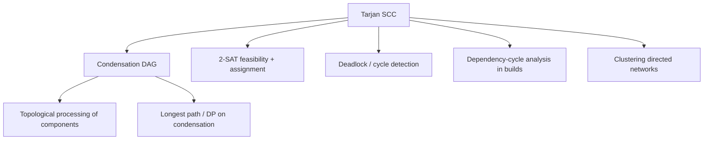

# Tarjan's SCC — Middle Level

> **Focus:** Why the lowlink test is correct, how Tarjan compares with Kosaraju and Gabow, and how SCCs compose into the condensation DAG that powers 2-SAT, topological processing, and dependency analysis.

---

## Table of Contents

1. [Introduction](#introduction)
2. [Deeper Concepts](#deeper-concepts)
3. [Comparison with Alternatives](#comparison-with-alternatives)
4. [Advanced Patterns](#advanced-patterns)
5. [Graph and Tree Applications](#graph-and-tree-applications)
6. [Algorithmic Integration](#algorithmic-integration)
7. [Code Examples](#code-examples)
8. [Error Handling](#error-handling)
9. [Performance Analysis](#performance-analysis)
10. [Best Practices](#best-practices)
11. [Visual Animation](#visual-animation)
12. [Summary](#summary)

---

## Introduction

At junior level Tarjan's algorithm is "track `disc`, `low`, a stack, and pop when `low[u] == disc[u]`." At middle level you start asking *why it works* and *what to do with the answer*:

- Why does `low[v] == disc[v]` precisely identify an SCC root, and never a false one?
- Why must back/cross edges use `disc[v]` and not `low[v]`?
- When is Kosaraju's two-pass approach preferable to Tarjan, and when is Gabow's stack-pair variant the cleanest?
- How do I turn raw SCCs into the **condensation DAG** so I can topologically process them?
- How does this become a **2-SAT** solver, a **deadlock** detector, or a **build-cycle** analyzer?

These are the questions that separate "I copied a Tarjan template" from "I can adapt it."

---

## Deeper Concepts

### Lowlink semantics — the precise definition

For a min-heap we had one invariant; for Tarjan the key quantity is the lowlink. Define, for each vertex `v`:

```
low[v] = min over:
    disc[v]
    disc[w]  for every w that is on the DFS stack and reachable from v
             using tree edges of v's subtree plus exactly ONE non-tree
             edge into an on-stack vertex
```

Intuitively, `low[v]` is the smallest discovery index of any vertex that `v`'s subtree can "reach back to" while staying inside the currently open part of the DFS. The single back/cross edge is the one that closes a cycle.

### Why `low[u] == disc[u]` marks an SCC root

Claim: when DFS finishes `u`, `low[u] == disc[u]` **iff** `u` is the first-discovered vertex of its SCC (its root), and the vertices still on the stack above `u` are exactly the rest of that SCC.

Sketch of the reasoning:

- Every vertex `w` in `u`'s SCC is reachable from `u`, and since they are mutually reachable, `u` is reachable from `w`. So during DFS from `u`, all of them are discovered inside `u`'s subtree and pushed **after** `u`. They remain on the stack until the SCC closes.
- If `u` were **not** the root, there would be an ancestor `a` in the same SCC with `disc[a] < disc[u]`. Mutual reachability gives a path from `u`'s subtree back to `a` via a back edge to an on-stack vertex, which would drive `low[u]` down to `disc[a] < disc[u]`. So `low[u] < disc[u]`.
- Conversely, if `u` **is** the root, nothing in its subtree can reach a strictly-older on-stack vertex (that would put `u` in an older SCC), so `low[u]` cannot drop below `disc[u]`; it stays equal.

Hence `low[u] == disc[u]` exactly characterizes roots. Popping everything above `u` (inclusive) yields the component. A full invariant-style proof is in the Professional file.

### Why back/cross edges use `disc[v]`, not `low[v]`

This is the single most common Tarjan bug. Suppose `u → v` is an edge and `v` is on the stack (older). We want to record that `u` can reach back to `v`. The correct contribution is `disc[v]` — the **actual** discovery time of `v`.

If instead you used `low[v]`, you would be claiming that `u` can reach back to whatever `v` can reach back to. But `v`'s lowlink may reflect a vertex in a *different, deeper* part of the DFS that `u` cannot independently reach without going *through* `v`. Worse, `low[v]` can still be changing. Using it can merge two genuinely-separate SCCs into one. The discovery index `disc[v]` is a stable, conservative fact: "`v` is reachable from `u` and `v` is older." That is exactly what lowlink needs.

(For tree edges it is the opposite: you recurse first, `low[v]` is finalized for `v`'s subtree, and inheriting `min(low[u], low[v])` is both correct and necessary.)

### The on-stack predicate

A vertex leaves the stack only when its whole SCC is popped. So "on the stack" means "discovered but its SCC is not yet closed." An edge into an already-popped vertex points into a **finished** SCC and must be ignored — using it would corrupt lowlinks. This is why we keep the explicit `onStack[]` flag instead of merely "visited."

---

## Comparison with Alternatives

| Attribute | Tarjan (1972) | Kosaraju (1978) | Gabow / Cheriyan–Mehlhorn (path-based) |
|-----------|---------------|-----------------|-----------------------------------------|
| DFS passes | **1** | 2 | 1 |
| Transpose graph needed | No | **Yes** | No |
| Extra arrays | `disc`, `low`, `onStack` | `visited`, finish-order stack | two stacks (vertices + boundaries), `disc` |
| Lowlink bookkeeping | Yes (`low[]`) | None | **None** (uses a second stack instead) |
| Time | O(V + E) | O(V + E) | O(V + E) |
| Space | O(V) | O(V + E) (transpose) | O(V) |
| Conceptual difficulty | Medium (lowlink rules) | **Low** (just two DFS) | Medium |
| Output order | reverse topo of condensation | topo-ish via finish stack | reverse topo |
| Practical speed | **Fast** (one pass) | Slower (builds transpose) | Fast, fewer comparisons |

**Choose Tarjan when:** you want one pass, no transpose, minimal memory, and you can get the lowlink rules right.

**Choose Kosaraju when:** clarity matters more than constants, you already have the transpose, or you are teaching/learning. Two simple DFS passes are hard to get wrong.

**Choose Gabow's path-based algorithm when:** you want a single pass like Tarjan but find the lowlink arithmetic error-prone. Gabow replaces `low[]` with a **second stack** that stores potential SCC boundaries; when a back edge to an on-stack vertex is found, it pops the boundary stack down to that vertex's position. Same asymptotics, arguably simpler to reason about, slightly fewer comparisons.

### Gabow in one paragraph

Gabow keeps the same vertex stack `S` as Tarjan plus a **boundary stack** `B`. On visiting `v`, push `v` onto both. On edge `v → w`: if `w` is unvisited, recurse; if `w` is on `S`, pop `B` while `disc[B.top] > disc[w]` (collapse the tentative boundaries past `w`). When `v` finishes and `B.top == v`, pop `S` down to `v` to form the SCC and pop `v` off `B`. No `low[]` array at all — the boundary stack *is* the lowlink, represented structurally.

---

## Advanced Patterns

### Pattern: Build the condensation DAG

Once every vertex has an SCC id, contract each SCC to a node and add an edge `comp[u] → comp[v]` whenever `u → v` crosses components. Deduplicate to keep it a simple DAG.

```python
def condensation(adj, comp_id, num_comps):
    dag = [set() for _ in range(num_comps)]
    for u in range(len(adj)):
        for v in adj[u]:
            if comp_id[u] != comp_id[v]:
                dag[comp_id[u]].add(comp_id[v])
    return [sorted(s) for s in dag]
```

The condensation is **always acyclic** — if it had a cycle, those SCCs would be mutually reachable and hence one larger SCC, a contradiction.

### Pattern: Topological order of SCCs for free

Tarjan emits SCCs in **reverse topological order** of the condensation. So if you number components `0, 1, 2, ...` in the order Tarjan produces them, every condensation edge goes from a **higher** id to a **lower** id. To process the DAG in forward topological order, iterate components in **decreasing** Tarjan-output order (or reverse the emitted list). No separate topological sort needed.

### Pattern: 2-SAT preview

A 2-SAT formula is a conjunction of clauses `(a ∨ b)`. Build an **implication graph** over `2n` literals: clause `(a ∨ b)` adds edges `¬a → b` and `¬b → a`. The formula is **satisfiable** iff no variable `x` has `x` and `¬x` in the **same SCC**. If satisfiable, assign each variable `true` when its positive literal's SCC appears **later** in topological order than its negation's SCC. Tarjan gives both the SCCs and (via output order) the topological order in one pass. The dedicated 2-SAT topic is a forward-reference sibling.

### Pattern: Iterative Tarjan (overflow-proof)

Recursion depth can reach `O(V)`. On a path graph of 10⁶ vertices, recursive Tarjan overflows. The iterative version simulates the call stack explicitly, tracking which child index each frame is on. (Full code in the Senior file.) Keep the same `disc`/`low`/`onStack` semantics; only the control flow changes.

---

## Graph and Tree Applications



### Deadlock detection

Model a wait-for graph: edge `T1 → T2` means "transaction T1 waits for a lock held by T2." A deadlock is a cycle, which is exactly an SCC of size ≥ 2. Run Tarjan; any non-trivial SCC is a set of mutually-blocked transactions to abort.

### Dependency-cycle analysis

Module/package import graphs, build target graphs, microservice call graphs — all directed. A circular dependency is an SCC with more than one node. Reporting the SCC tells the user the *exact* cycle to break.

---

## Algorithmic Integration

Once you have the condensation DAG, many problems become DAG-DP:

- **Reachability counting:** number of SCCs reachable from each SCC.
- **Longest chain of dependencies:** longest path in the condensation (DAG longest path is linear).
- **Minimum edges to make strongly connected:** count source SCCs and sink SCCs in the condensation; the answer is `max(sources, sinks)` (for a condensation with > 1 node).

SCC + condensation is a standard *reduction*: "directed graph with cycles" → "DAG", after which DAG algorithms apply unchanged.

---

## Code Examples

### Kosaraju's two-pass SCC + condensation

#### Go

```go
package main

import "fmt"

func kosaraju(n int, adj [][]int) []int {
	visited := make([]bool, n)
	order := []int{} // vertices by finish time

	var dfs1 func(u int)
	dfs1 = func(u int) {
		visited[u] = true
		for _, v := range adj[u] {
			if !visited[v] {
				dfs1(v)
			}
		}
		order = append(order, u) // push on finish
	}
	for u := 0; u < n; u++ {
		if !visited[u] {
			dfs1(u)
		}
	}

	// transpose
	radj := make([][]int, n)
	for u := 0; u < n; u++ {
		for _, v := range adj[u] {
			radj[v] = append(radj[v], u)
		}
	}

	compID := make([]int, n)
	for i := range compID {
		compID[i] = -1
	}
	var dfs2 func(u, c int)
	dfs2 = func(u, c int) {
		compID[u] = c
		for _, v := range radj[u] {
			if compID[v] == -1 {
				dfs2(v, c)
			}
		}
	}
	c := 0
	for i := n - 1; i >= 0; i-- { // reverse finish order
		u := order[i]
		if compID[u] == -1 {
			dfs2(u, c)
			c++
		}
	}
	return compID
}

func condensation(n int, adj [][]int, compID []int, numComps int) [][]int {
	seen := make(map[[2]int]bool)
	dag := make([][]int, numComps)
	for u := 0; u < n; u++ {
		for _, v := range adj[u] {
			cu, cv := compID[u], compID[v]
			if cu != cv && !seen[[2]int{cu, cv}] {
				seen[[2]int{cu, cv}] = true
				dag[cu] = append(dag[cu], cv)
			}
		}
	}
	return dag
}

func main() {
	adj := [][]int{{1}, {2}, {0, 3}, {4}, {5}, {3}}
	compID := kosaraju(len(adj), adj)
	numComps := 0
	for _, c := range compID {
		if c+1 > numComps {
			numComps = c + 1
		}
	}
	fmt.Println("compID:", compID)
	fmt.Println("DAG:", condensation(len(adj), adj, compID, numComps))
}
```

#### Java

```java
import java.util.*;

public class Kosaraju {
    static List<List<Integer>> adj;
    static boolean[] visited;
    static List<Integer> order = new ArrayList<>();
    static int[] compID;

    static void dfs1(int u) {
        visited[u] = true;
        for (int v : adj.get(u)) if (!visited[v]) dfs1(v);
        order.add(u); // finish
    }

    static void dfs2(int u, int c, List<List<Integer>> radj) {
        compID[u] = c;
        for (int v : radj.get(u)) if (compID[v] == -1) dfs2(v, c, radj);
    }

    public static int[] run(List<List<Integer>> g) {
        adj = g;
        int n = g.size();
        visited = new boolean[n];
        compID = new int[n];
        Arrays.fill(compID, -1);

        for (int u = 0; u < n; u++) if (!visited[u]) dfs1(u);

        List<List<Integer>> radj = new ArrayList<>();
        for (int i = 0; i < n; i++) radj.add(new ArrayList<>());
        for (int u = 0; u < n; u++)
            for (int v : g.get(u)) radj.get(v).add(u);

        int c = 0;
        for (int i = n - 1; i >= 0; i--) {
            int u = order.get(i);
            if (compID[u] == -1) { dfs2(u, c, radj); c++; }
        }
        return compID;
    }

    public static void main(String[] args) {
        List<List<Integer>> adj = List.of(
            List.of(1), List.of(2), List.of(0, 3),
            List.of(4), List.of(5), List.of(3));
        System.out.println(Arrays.toString(run(adj)));
    }
}
```

#### Python

```python
import sys


def kosaraju(adj):
    sys.setrecursionlimit(1 << 25)
    n = len(adj)
    visited = [False] * n
    order = []

    def dfs1(u):
        visited[u] = True
        for v in adj[u]:
            if not visited[v]:
                dfs1(v)
        order.append(u)            # finish order

    for u in range(n):
        if not visited[u]:
            dfs1(u)

    radj = [[] for _ in range(n)]
    for u in range(n):
        for v in adj[u]:
            radj[v].append(u)

    comp_id = [-1] * n

    def dfs2(u, c):
        comp_id[u] = c
        for v in radj[u]:
            if comp_id[v] == -1:
                dfs2(v, c)

    c = 0
    for u in reversed(order):      # reverse finish order
        if comp_id[u] == -1:
            dfs2(u, c)
            c += 1
    return comp_id, c


def condensation(adj, comp_id, num_comps):
    dag = [set() for _ in range(num_comps)]
    for u in range(len(adj)):
        for v in adj[u]:
            if comp_id[u] != comp_id[v]:
                dag[comp_id[u]].add(comp_id[v])
    return [sorted(s) for s in dag]


if __name__ == "__main__":
    adj = [[1], [2], [0, 3], [4], [5], [3]]
    comp_id, k = kosaraju(adj)
    print("comp_id:", comp_id)
    print("DAG:", condensation(adj, comp_id, k))
```

---

## Error Handling

| Scenario | What goes wrong | Correct approach |
|----------|----------------|------------------|
| Used `low[v]` for an on-stack edge in Tarjan | Two distinct SCCs get merged silently | Always `min(low[u], disc[v])` for non-tree edges |
| Kosaraju forgets to reverse finish order | Components computed in wrong order; some merged | Process the finish stack from last-finished to first |
| Transpose built with wrong direction | SCCs come out wrong | For each `u → v`, add `v → u` to the transpose |
| Recursion overflow on deep graph | Crash on large input | Iterative DFS for both Tarjan and Kosaraju |
| Self-loops treated as cycles incorrectly | Vertex with `v→v` reported as size-2 SCC | Self-loop is still a size-1 SCC; it only makes the graph cyclic |
| Condensation has duplicate edges | DAG bloated, DP slow | Deduplicate cross-component edges with a set |

---

## Performance Analysis

Both Tarjan and Kosaraju are `O(V + E)`. The practical gap:

| Aspect | Tarjan | Kosaraju |
|--------|--------|----------|
| DFS traversals | 1 | 2 |
| Builds transpose | no | yes (one full edge copy) |
| Extra memory | O(V) | O(V + E) |
| Typical wall-clock | ~1.0× (baseline) | ~1.6–2.0× |
| Cache behavior | better (no transpose) | worse (random writes to transpose) |

For a graph with `E = 5·10⁶`, building the transpose alone costs a full pass over all edges plus the memory to store them again — that is what makes Kosaraju noticeably slower despite identical asymptotics.

```python
import time, random, sys

def gen(n, m):
    return [[random.randrange(n) for _ in range(m // n)] for _ in range(n)]

# Tarjan vs Kosaraju on the same random graph — Tarjan is typically
# ~1.5-2x faster because it avoids constructing and traversing the transpose.
```

The recursion-depth cost is the real-world differentiator: both recursive versions can hit `O(V)` depth, so on adversarial chains you must go iterative regardless of which algorithm you pick.

---

## Best Practices

- **Prefer Tarjan in production** for one-pass efficiency; keep a Kosaraju reference implementation as an easy-to-audit oracle for tests.
- **Always compute `comp_id[v]`**, not just the list of components — almost every downstream use needs the per-vertex label.
- **Build the condensation immediately** if you plan any DAG processing; it is the natural interface.
- **Exploit the reverse-topo output order** instead of running a separate topological sort.
- **Switch to iterative** the moment input sizes could push recursion past ~10⁴ depth.
- **Test against brute force** (Floyd–Warshall reachability) on small random graphs: `u, v` same SCC iff `reach[u][v] && reach[v][u]`.

---

## Visual Animation

> See [`animation.html`](./animation.html) for an interactive view.
>
> The middle-level animation highlights:
> - `disc`/`low` updating per edge, distinguishing tree edges from on-stack back edges
> - The explicit stack and the on-stack flag in real time
> - The exact moment `low[u] == disc[u]` fires and an SCC is popped and colored
> - SCCs appearing in reverse topological order

---

## Summary

Tarjan's algorithm is correct because `low[u] == disc[u]` precisely identifies the first-discovered vertex of each SCC — no false roots, no missed ones — and the explicit stack lets you peel off exactly that component. The crucial subtlety is the lowlink update: inherit `low[v]` across tree edges, but use `disc[v]` for edges to on-stack vertices. Kosaraju (two passes, transpose) trades speed for simplicity; Gabow (two stacks) trades the lowlink array for a boundary stack. Whichever you pick, the real payoff is the **condensation DAG**: contract each SCC and you have turned a cyclic directed graph into a DAG, unlocking 2-SAT, deadlock detection, dependency analysis, and DAG dynamic programming.
