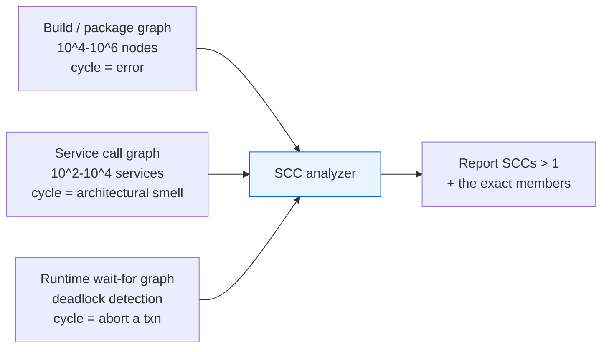

# Tarjan's SCC — Senior Level

> Tarjan's SCC is rarely the bottleneck on a small graph — but the moment you run it on a 10⁸-edge dependency graph, a service call-graph rebuilt every minute, or a build system with a million targets, the textbook recursive form overflows the stack, the single DFS becomes a memory-bandwidth problem, and "find the cycle" becomes "find the cycle without taking the whole pipeline down."

## Table of Contents

1. [Introduction](#1-introduction)
2. [System Design with SCC Analysis](#2-system-design-with-scc-analysis)
3. [Distributed and Large-Graph SCC](#3-distributed-and-large-graph-scc)
4. [Concurrency](#4-concurrency)
5. [Comparison at Scale](#5-comparison-at-scale)
6. [Architecture Patterns](#6-architecture-patterns)
7. [Code Examples — Iterative Tarjan](#7-code-examples--iterative-tarjan)
8. [Observability](#8-observability)
9. [Failure Modes](#9-failure-modes)
10. [Capacity Planning](#10-capacity-planning)
11. [Summary](#11-summary)

---

## 1. Introduction

At the senior level the question is not "how does lowlink work" but "where does SCC analysis sit in my system, and what breaks when the graph gets big?" Tarjan's algorithm is an in-memory, single-threaded, recursive graph pass. That description alone tells you three things:

- Its recursion depth is `O(V)` worst case — a long dependency chain overflows the native stack.
- It needs the whole graph resident — `O(V + E)` memory, single node.
- It is inherently sequential — the DFS order is the algorithm; you cannot trivially parallelize it.

The interesting senior decisions are therefore:

1. How do I run SCC on a graph deep enough to blow the recursion stack? (iterative Tarjan)
2. Where does cycle/SCC detection belong — in the build tool, the CI gate, the runtime scheduler, or an offline analytics job?
3. When the graph exceeds one machine's memory, what replaces Tarjan? (forward–backward / coloring)
4. How do I make SCC analysis observable so an engineer sees *which* dependency cycle broke the build?
5. How do I keep an incremental version fast when the graph changes one edge at a time?

---

## 2. System Design with SCC Analysis

### 2.1 Where SCC analysis lives



| Use case | Where it runs | What a cycle means | Action on cycle |
| --- | --- | --- | --- |
| Build dependency graph (Bazel, Gradle, Make) | Build tool, every build | Circular dependency | Fail the build, print the SCC |
| Module/import graph (linters) | CI gate | Forbidden import cycle | Block the PR |
| Microservice call graph | Offline analysis / arch review | Cyclic coupling | Flag for refactor |
| Transaction wait-for graph | DB engine, online | Deadlock | Abort a victim transaction |
| Dataflow / DAG schedulers (Airflow) | DAG validation at load | Invalid (must be acyclic) | Reject the DAG |

### 2.2 Build cycle detection

A build tool turns targets into a directed graph: `A → B` means "A depends on B." The build is valid only if the graph is a DAG. Run Tarjan; any SCC of size > 1 is a dependency cycle. The valuable output is not "there is a cycle" but **the exact set of targets in the cycle**, so the engineer knows what to break. Tarjan gives that set directly as the popped component.

### 2.3 Microservice call-graph cycles

In a service mesh, edges come from traces: `svc-A → svc-B` if A calls B. A non-trivial SCC means a set of services that (transitively) call back into each other — a coupling smell that risks cascading failures and complicates deploys. SCC analysis over the trace-derived graph turns "the system feels tangled" into a concrete list: "services X, Y, Z form a call cycle."

---

## 3. Distributed and Large-Graph SCC

When `V + E` no longer fits comfortably in one machine's RAM, or when the graph lives in a distributed store, sequential Tarjan stops being an option — its strict DFS order is fundamentally serial.

### 3.1 Why Tarjan does not parallelize

Tarjan's correctness depends on the DFS discovery order and the single shared stack. There is no known work-efficient parallel version that preserves the one-pass structure. So at scale we switch algorithms, trading the `O(V+E)` optimal bound for parallelizable ones.

### 3.2 Forward–Backward (FB / DCSC)

The standard distributed/parallel approach is **Forward–Backward** (also called Divide-and-Conquer Strong Components, Fleischer–Hendrickson–Pınar 2000):

1. Pick a **pivot** vertex `p`.
2. Compute `F = ` descendants of `p` (forward reachability, parallel BFS).
3. Compute `B = ` ancestors of `p` (backward reachability on the transpose).
4. `F ∩ B` is exactly **one SCC** — the one containing `p`.
5. Recurse independently on three disjoint pieces: `F \ B`, `B \ F`, and `V \ (F ∪ B)`. These cannot share an SCC, so they recurse in parallel.

Expected `O(V log V)` reachability rounds on many graphs; each reachability step is an embarrassingly parallel BFS. It is *not* work-optimal (worse than `O(V+E)` in the worst case) but it parallelizes well, which is the whole point at scale.

### 3.3 Coloring algorithm

The **coloring/propagation** SCC algorithm (Orzan; used in GPU and Pregel-style systems):

1. Initialize each vertex's "color" to its own id.
2. Repeatedly propagate the **maximum** color forward along edges until stable.
3. Each color's "root" (the vertex whose id equals the propagated color) seeds a backward BFS; that backward set restricted to the color class is one SCC.
4. Remove found SCCs and repeat on the remainder.

Fully vertex-centric, so it maps onto Pregel / GraphX / GPU frameworks where you express computation as "each vertex sends messages to neighbors." Higher total work than Tarjan but scales across machines.

### 3.4 Trim + pivot optimizations

Real graphs have many trivial (size-1) SCCs. **Trimming** repeatedly removes vertices with in-degree 0 or out-degree 0 (they are their own SCC) before the expensive FB/coloring step. This often peels off 80–95% of vertices cheaply, leaving a small core for the heavy algorithm.

---

## 4. Concurrency

### 4.1 Sequential by nature

A single SCC computation does not parallelize internally without changing algorithms (Section 3). Within one machine, the realistic concurrency play is **independent subgraphs**: if the graph is already disconnected, run Tarjan on each weak component on a separate thread.

### 4.2 Concurrent reads during recompute

A common production shape: a long-lived graph (dependency state, wait-for graph) that is queried for SCCs while it mutates. Patterns:

- **Snapshot + recompute**: copy-on-write the graph, run SCC on the immutable snapshot off the hot path, publish the result atomically. Readers never block writers.
- **Versioned results**: tag each SCC result with the graph version it was computed from; consumers check staleness.

### 4.3 Online / incremental SCC

If edges arrive one at a time and you need SCCs continuously, full recompute per edge is wasteful. Incremental SCC maintenance (e.g., Bender–Fineman–Gilbert–Tarjan style for incremental topological order + SCC) keeps an order and only repairs the affected region on each insert. This is significantly more complex than batch Tarjan and is justified only when the update rate is high and the graph is large. For most systems, **debounced full recompute** (recompute at most every N seconds or every K edges) is simpler and good enough.

---

## 5. Comparison at Scale

| Approach | Time | Parallel? | Memory | When |
| --- | --- | --- | --- | --- |
| Recursive Tarjan | `O(V+E)` | No | `O(V+E)`, `O(V)` stack | Default; small/medium graphs that fit one node |
| Iterative Tarjan | `O(V+E)` | No | `O(V+E)`, heap stack | Deep graphs that would overflow recursion |
| Kosaraju | `O(V+E)` | No | `O(V+E)` + transpose | Simplicity; when transpose is cheap |
| Forward–Backward (FB) | `O(V·(V+E))` worst, near-linear typical | **Yes** | `O(V+E)` distributed | Graphs that exceed one node; parallel/distributed |
| Coloring | `O(V·(V+E))` worst | **Yes** (vertex-centric) | `O(V+E)` | Pregel/GPU; very large graphs |
| Trim + FB/coloring | as above minus trivial SCCs | Yes | `O(V+E)` | Real graphs with many size-1 SCCs |

Rule of thumb: stay on **iterative Tarjan** as long as the graph fits in one machine's memory (hundreds of millions of edges on a big box). Move to **FB/coloring on a cluster** only when it does not — the constant factors of distributed graph processing are brutal, and a single fat node beats a small cluster up to surprisingly large graphs.

---

## 6. Architecture Patterns

### 6.1 SCC as a CI gate

```
   PR opened
      │
      ▼
  build graph from manifests ──► iterative Tarjan ──► any SCC size > 1?
                                                          │
                                          yes ◄───────────┴──────────► no
                                           │                           │
                                  fail check, print cycle        pass check
```

Keep it fast and deterministic; print the **smallest** offending cycle (a cycle within the SCC) to make the fix actionable, not just the whole component.

### 6.2 Condensation as the processing interface

For anything downstream — staged builds, deployment ordering, dataflow scheduling — collapse to the condensation DAG, then run DAG algorithms (topological sort, longest path, level assignment). The SCC step is the "normalize cycles away" preprocessing; everything after is DAG work.

### 6.3 Deadlock detector in a database

The wait-for graph is small (number of active transactions) but changes constantly. Run iterative Tarjan (or a cheaper cycle-finding DFS) on a snapshot triggered by a lock-wait timeout. On finding a non-trivial SCC, pick a **victim** (youngest transaction, least work done) and abort it to break the cycle.

---

## 7. Code Examples — Iterative Tarjan

The recursive form overflows the native stack at depth `O(V)`. This iterative version simulates the call stack explicitly with an integer "child index" per frame and preserves identical `disc`/`low`/`onStack` semantics.

### 7.1 Go

```go
package main

import "fmt"

// IterativeTarjan returns SCCs (each a slice of vertex ids), avoiding
// native recursion so it survives graphs with very long paths.
func IterativeTarjan(n int, adj [][]int) [][]int {
	const unvisited = -1
	disc := make([]int, n)
	low := make([]int, n)
	onStack := make([]bool, n)
	for i := range disc {
		disc[i] = unvisited
	}
	var stack []int     // explicit SCC stack
	var sccs [][]int
	idx := 0

	type frame struct {
		u    int
		next int // index into adj[u] to process next
	}

	for start := 0; start < n; start++ {
		if disc[start] != unvisited {
			continue
		}
		callStack := []frame{{start, 0}}

		for len(callStack) > 0 {
			f := &callStack[len(callStack)-1]
			u := f.u

			if f.next == 0 { // first time entering u
				disc[u] = idx
				low[u] = idx
				idx++
				stack = append(stack, u)
				onStack[u] = true
			}

			advanced := false
			for f.next < len(adj[u]) {
				v := adj[u][f.next]
				f.next++
				if disc[v] == unvisited { // tree edge → descend
					callStack = append(callStack, frame{v, 0})
					advanced = true
					break
				} else if onStack[v] { // edge to open vertex
					if disc[v] < low[u] {
						low[u] = disc[v]
					}
				}
			}
			if advanced {
				continue // process the child frame
			}

			// all edges of u processed: maybe pop an SCC
			if low[u] == disc[u] {
				var comp []int
				for {
					w := stack[len(stack)-1]
					stack = stack[:len(stack)-1]
					onStack[w] = false
					comp = append(comp, w)
					if w == u {
						break
					}
				}
				sccs = append(sccs, comp)
			}

			// return to parent: relax low[parent] with low[u]
			callStack = callStack[:len(callStack)-1]
			if len(callStack) > 0 {
				p := callStack[len(callStack)-1].u
				if low[u] < low[p] {
					low[p] = low[u]
				}
			}
		}
	}
	return sccs
}

func main() {
	adj := [][]int{{1}, {2}, {0, 3}, {4}, {5}, {3}}
	for _, comp := range IterativeTarjan(len(adj), adj) {
		fmt.Println(comp)
	}
}
```

### 7.2 Java

```java
import java.util.*;

public class IterativeTarjan {
    public static List<List<Integer>> run(List<List<Integer>> adj) {
        int n = adj.size();
        int[] disc = new int[n], low = new int[n], next = new int[n];
        boolean[] onStack = new boolean[n];
        Arrays.fill(disc, -1);
        Deque<Integer> sccStack = new ArrayDeque<>();
        Deque<Integer> call = new ArrayDeque<>();
        List<List<Integer>> sccs = new ArrayList<>();
        int idx = 0;

        for (int start = 0; start < n; start++) {
            if (disc[start] != -1) continue;
            call.push(start);

            while (!call.isEmpty()) {
                int u = call.peek();

                if (next[u] == 0) {          // entering u
                    disc[u] = low[u] = idx++;
                    sccStack.push(u);
                    onStack[u] = true;
                }

                boolean descended = false;
                while (next[u] < adj.get(u).size()) {
                    int v = adj.get(u).get(next[u]++);
                    if (disc[v] == -1) {     // tree edge
                        call.push(v);
                        descended = true;
                        break;
                    } else if (onStack[v]) { // open vertex
                        low[u] = Math.min(low[u], disc[v]);
                    }
                }
                if (descended) continue;

                if (low[u] == disc[u]) {     // SCC root
                    List<Integer> comp = new ArrayList<>();
                    int w;
                    do {
                        w = sccStack.pop();
                        onStack[w] = false;
                        comp.add(w);
                    } while (w != u);
                    sccs.add(comp);
                }

                call.pop();
                if (!call.isEmpty()) {
                    int p = call.peek();
                    low[p] = Math.min(low[p], low[u]);
                }
            }
        }
        return sccs;
    }

    public static void main(String[] args) {
        List<List<Integer>> adj = List.of(
            List.of(1), List.of(2), List.of(0, 3),
            List.of(4), List.of(5), List.of(3));
        System.out.println(run(adj));
    }
}
```

### 7.3 Python

```python
def iterative_tarjan(adj):
    n = len(adj)
    disc = [-1] * n
    low = [0] * n
    on_stack = [False] * n
    nxt = [0] * n            # per-vertex child cursor
    stack = []               # SCC stack
    sccs = []
    idx = 0

    for start in range(n):
        if disc[start] != -1:
            continue
        call = [start]       # explicit call stack

        while call:
            u = call[-1]

            if nxt[u] == 0:               # entering u
                disc[u] = low[u] = idx
                idx += 1
                stack.append(u)
                on_stack[u] = True

            descended = False
            while nxt[u] < len(adj[u]):
                v = adj[u][nxt[u]]
                nxt[u] += 1
                if disc[v] == -1:          # tree edge
                    call.append(v)
                    descended = True
                    break
                elif on_stack[v]:          # open vertex
                    low[u] = min(low[u], disc[v])
            if descended:
                continue

            if low[u] == disc[u]:          # SCC root
                comp = []
                while True:
                    w = stack.pop()
                    on_stack[w] = False
                    comp.append(w)
                    if w == u:
                        break
                sccs.append(comp)

            call.pop()
            if call:
                p = call[-1]
                low[p] = min(low[p], low[u])
    return sccs


if __name__ == "__main__":
    adj = [[1], [2], [0, 3], [4], [5], [3]]
    for comp in iterative_tarjan(adj):
        print(comp)
```

Notes for review:

- The `next[u]`/`nxt[u]` cursor is the key trick: it remembers which child we were on when we descended, exactly like a paused recursion frame.
- On returning to a parent, we relax `low[parent] = min(low[parent], low[u])` — this replaces the recursive "after `dfs(v)`" line.
- Memory is `O(V + E)` plus a heap-allocated call stack, so depth is bounded by available heap, not the (small) native stack.

---

## 8. Observability

SCC analysis is invisible until it rejects a build or aborts a transaction. Instrument it.

| Metric | Type | Why |
| --- | --- | --- |
| `scc_run_duration_seconds` | histogram | Detect graph growth pushing latency up |
| `scc_graph_vertices` / `scc_graph_edges` | gauge | Size trend; capacity planning |
| `scc_count_total` | gauge | How many components; spikes signal structure change |
| `scc_largest_size` | gauge | Biggest cycle; a jump means new circular coupling |
| `scc_nontrivial_count` | gauge | Number of size-> 1 SCCs = number of cycles |
| `scc_recursion_depth_max` | gauge | Early warning before stack overflow (recursive form) |
| `scc_cycle_detected_total` | counter | How often a cycle blocked a build / triggered an abort |

The most actionable output is **not a metric but a log line**: when a non-trivial SCC is found, emit the **member list** and a concrete cycle within it. "Cycle: A → B → C → A" is what an engineer can fix; "1 cycle detected" is not.

---

## 9. Failure Modes

### 9.1 Recursion depth overflow

The classic Tarjan failure. A path graph of `V` vertices recurses `V` deep. At ~10⁴–10⁵ frames the native stack overflows (segfault in Go/C, `StackOverflowError` in Java, `RecursionError` in Python). **Mitigation:** iterative Tarjan (Section 7), or raise the thread stack size as a stopgap. This is the single most common production incident with Tarjan.

### 9.2 Memory blow-up from the transpose (Kosaraju)

If you chose Kosaraju, the transpose doubles edge memory. On a 10⁸-edge graph that is the difference between fitting and OOM. **Mitigation:** prefer Tarjan, or stream the transpose.

### 9.3 Wrong lowlink rule

Using `low[v]` instead of `disc[v]` for on-stack edges merges separate SCCs. It often passes small tests and fails on specific cross-edge structures. **Mitigation:** property test against a brute-force reachability oracle.

### 9.4 Stale graph snapshot

In an online system the graph mutates while SCC runs on a snapshot; the result is correct for the snapshot but stale by the time it is used. **Mitigation:** version the result, recompute on a debounce, and treat SCC output as eventually-consistent.

### 9.5 Adversarial graph (one giant SCC)

A fully strongly-connected graph collapses to one SCC of size `V`; the SCC stack holds all `V` vertices at once. Memory and the single pop are `O(V)`. Usually fine, but worth knowing the worst case is one component, not many small ones.

### 9.6 Non-determinism in cycle reporting

Different adjacency orderings yield different (but all valid) SCC member orders. If a CI gate asserts an exact ordering, it flakes. **Mitigation:** sort component members before reporting.

---

## 10. Capacity Planning

### 10.1 Single-node ceiling

Working assumptions for an adjacency-list graph:

- Vertex: ~16–32 B (id + `disc` + `low` + `onStack`).
- Edge: ~8–16 B in CSR (one int per neighbor + offsets).
- 64 GiB box, half for the graph: 32 GiB.
- At ~12 B/edge: `32 GiB / 12 B ≈ 2.7·10⁹` edges theoretically.

Realistic ceiling with overhead and the SCC stack: **hundreds of millions of edges** on a single fat node before you must shard. That covers most dependency, import, and call graphs comfortably.

### 10.2 Throughput

- Iterative Tarjan: roughly 10–50 M edges/sec single-threaded, memory-bandwidth bound on large graphs.
- A 10⁸-edge graph: a few seconds. A 10⁶-edge build graph: low milliseconds — fine for a per-build CI gate.

### 10.3 When to leave the single node

Move to FB/coloring on a cluster when **any** holds:

- `V + E` does not fit in one machine's memory.
- The graph already lives partitioned in a distributed graph store (Pregel/GraphX/Neo4j-Fabric).
- You need SCC as part of a larger distributed graph pipeline.

Until then, a single fat node running iterative Tarjan is faster and far simpler than any distributed approach.

### 10.4 Recompute cadence (online)

For a continuously-changing graph, full recompute at `O(V+E)` per change is wasteful above a few updates/sec. Budget: if recompute is `R` ms and updates arrive at rate `λ`, debounce to at most `1/(R·safety)` recomputes/sec, or invest in incremental SCC only when `λ·R` exceeds your latency budget.

---

## 11. Summary

- Recursive Tarjan is optimal `O(V+E)` but fails on deep graphs via stack overflow — the **iterative version is mandatory** at scale.
- Place SCC analysis where cycles matter: build gates, import linters, arch reviews, deadlock detectors. The valuable output is the **exact cycle members**, not a boolean.
- Tarjan does not parallelize; when the graph exceeds one node, switch to **forward–backward** or **coloring**, ideally after **trimming** trivial SCCs.
- For online graphs, prefer **snapshot + debounced recompute** over complex incremental maintenance unless update rates demand it.
- Instrument duration, graph size, largest SCC, and recursion depth; log the concrete cycle when one is found.
- A single fat node handles hundreds of millions of edges; reach for a distributed algorithm only when memory, not curiosity, forces it.

References to study further: Tarjan 1972 (original), Fleischer–Hendrickson–Pınar 2000 (forward–backward), Orzan (coloring), Bloemen et al. (parallel on-the-fly SCC), Bender–Fineman–Gilbert–Tarjan (incremental topological order).
