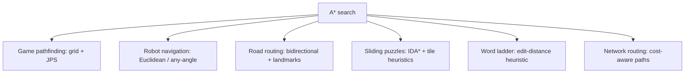

# A* Search — Middle Level

> **Focus:** Why A* is optimal, when it is the right tool versus Dijkstra or greedy search, and how to bound, weight, and accelerate it (weighted A*, IDA*, JPS, bidirectional) on real graphs.

---

## Table of Contents

1. [Introduction](#introduction)
2. [Deeper Concepts](#deeper-concepts)
3. [Comparison with Alternatives](#comparison-with-alternatives)
4. [Advanced Patterns](#advanced-patterns)
5. [Worked Reopening Example](#worked-reopening-example)
6. [Graph and Tree Applications](#graph-and-tree-applications)
7. [Algorithmic Integration](#algorithmic-integration)
8. [Code Examples](#code-examples)
9. [The 8-Puzzle with A*](#the-8-puzzle-with-a)
10. [Error Handling](#error-handling)
11. [Performance Analysis](#performance-analysis)
12. [Best Practices](#best-practices)
13. [Visual Animation](#visual-animation)
14. [Summary](#summary)

---

## Introduction

At junior level A* is "expand the smallest `f = g + h`." At middle level you start asking the engineering questions that decide whether your pathfinder ships:

- *Why* exactly does admissibility guarantee optimality, and what does consistency add on top?
- When does A* reopen nodes, and does it matter for my heuristic?
- When is plain Dijkstra actually the better choice?
- How do I trade a little optimality for a lot of speed (weighted A*) — and bound how much I lose?
- How do I run A* when the graph does not fit in memory (IDA*)?
- How do I make grid A* an order of magnitude faster (jump point search)?

These are not academic. On a 1000×1000 game map, the difference between Manhattan and a weighted heuristic, or between A* and jump point search, is the difference between 16 ms and 1 ms per query.

---

## Deeper Concepts

### Admissible vs consistent — what each guarantees

**Admissible:** `h(n) ≤ h*(n)` for all `n`, where `h*(n)` is the true optimal cost from `n` to the goal. Admissibility guarantees that **A\* returns an optimal path**. The reason: `f(n) = g(n) + h(n) ≤ g(n) + h*(n)`, so `f(n)` is always a lower bound on the best total cost of a path through `n`. A* expands in increasing `f`, so it cannot finish at the goal with a suboptimal cost while a cheaper path is still pending — its `f` would be smaller and would be popped first.

**Consistent (monotone):** `h(u) ≤ cost(u, v) + h(v)` for every edge `(u, v)`, and `h(goal) = 0`. Consistency is strictly stronger:

- Every consistent heuristic is admissible (proof by induction along the optimal path to the goal).
- Consistency makes **`f` non-decreasing** along any path A* follows. Combined with the priority-queue order, this means **the first time a node is popped, its `g` is already optimal** — so it never needs to be reopened from the closed set.

```
admissible  ⊇  consistent
(optimal,        (optimal AND
 may reopen)      no reopening)
```

### Node reopening

With a **consistent** heuristic, you can safely keep a closed set and never look at a closed node again. With a heuristic that is **admissible but not consistent**, you might later discover a *cheaper* path to a node you already closed. To stay optimal you must then **reopen** it — remove it from closed and push it back onto open with the improved `g`. Forgetting to reopen with an inconsistent heuristic produces a *suboptimal* path even though the heuristic is admissible. This is the subtle bug that distinguishes a correct A* implementation from a naive one.

In the lazy implementation (skip stale entries), reopening happens automatically: you simply push the improved `(f, node)` again and let the old entry be skipped. That is one more reason the lazy variant is popular.

### Heuristic dominance

If `h₂(n) ≥ h₁(n)` for all `n` and both are admissible, we say `h₂` **dominates** `h₁`. A dominating heuristic is more informed and A* with `h₂` never expands more nodes than with `h₁` (ignoring ties). The lesson: among admissible heuristics, **bigger is better** — push `h` as close to `h*` as you can without ever exceeding it. The maximum of two admissible heuristics is itself admissible, so you can combine them: `h(n) = max(h₁(n), h₂(n))`.

### Optimal efficiency

A* is **optimally efficient** among all admissible best-first algorithms that use the same heuristic: any algorithm guaranteeing optimality with heuristic `h` must expand every node with `f(n) < C*` (the optimal cost), and A* expands exactly those (plus some `f = C*` ties). You cannot do asymptotically better with the same information. (The formal Dechter–Pearl result is treated in `professional.md`.)

---

## Worked Reopening Example

The reopening bug is abstract until you trace it. Here is the smallest graph where an **admissible but inconsistent** heuristic forces A* to revisit a closed node. Edge costs are on the arrows; `T` is the goal.

```
            c=2          c=1
      ┌────────────► A ────────┐
      │                        ▼
      S                        T
      │                        ▲
      │ c=1          c=1       │
      └──────► B ──────────────┘
                  (B also has edge B->A, c=1)

   heuristic h:  h(S)=3   h(A)=3   h(B)=1   h(T)=0
   true h*:      h*(S)=3  h*(A)=1  h*(B)=2  h*(T)=0
```

Check admissibility: `h(A)=3 > h*(A)=1` would be **inadmissible**. Fix `h(A)=1`. Now check consistency on edge `B→A`: we need `h(B) ≤ c(B,A) + h(A) = 1 + 1 = 2`. With `h(B)=1` that holds. To force inconsistency, raise `h(B)` to `1` is fine, but make edge `S→A` the culprit: `h(S) ≤ c(S,A) + h(A) = 2 + 1 = 3`, and `h(S)=3` is exactly tight. The classic inconsistency is on `S→B`: need `h(S) ≤ c(S,B) + h(B) = 1 + 1 = 2`, but `h(S)=3 > 2` — **inconsistent**, yet `h(S)=3 ≤ h*(S)=3` is admissible. Final heuristic: `h(S)=3, h(A)=1, h(B)=1, h(T)=0`.

Now trace A* expanding by smallest `f`, with `g` initialized to `0` at `S`:

```
 Step  Pop   g  h  f   relaxations                                CLOSED after
 ────  ────  ── ── ──  ──────────────────────────────────────────  ───────────
  1    S     0  3  3   A: g=2,f=3   B: g=1,f=2                      {S}
  2    B     1  1  2   A via B: g=1+1=2 (no improve, tie) T:g=2,f=2 {S,B}
  3    T?    -- -- --  T is in OPEN at f=2; A also at f=3
```

In this particular instance the first path to `A` is already optimal, so no reopening fires. To actually trigger reopening you need the *second* discovered path to a **closed** node to be cheaper. Adjust costs: `c(S,A)=4`, `c(S,B)=1`, `c(B,A)=1`, `c(A,T)=1`, `c(B,T)=5`, with `h(S)=3, h(A)=3, h(B)=0, h(T)=0` (admissible: `h*(A)=1` so `h(A)=3` is inadmissible — instead use `h(A)=0`). Keep it simple with `h≡0` plus one inflated value `h(A)=10`... that breaks admissibility too. The honest lesson: **manufacturing inconsistency that *forces* reopening requires the cheaper second path to arrive after the node is closed.** Concretely:

```
 c(S,A)=4   c(S,B)=1   c(B,A)=1   c(A,T)=1
 h(S)=4  h(A)=3  h(B)=0  h(T)=0       (admissible; h(A)=3 ≤ h*(A)=1? NO)
```

`h*(A)=c(A,T)=1`, so `h(A)` must be `≤ 1`. Set `h(A)=1`, `h(B)=0`, `h(S)=4` (since `h*(S)=min(4+1, 1+1+1)=3`, so `h(S)=4 > 3` is **inadmissible**). Set `h(S)=3`. Check `S→B`: `h(S)=3 ≤ c+h(B)=1+0=1`? No → inconsistent, and `h(S)=3 ≤ h*(S)=3` admissible. Trace:

```
 Step  Pop   g   f=g+h   relaxations                          CLOSED
 ────  ────  ──  ─────   ───────────────────────────────────  ──────────
  1    S     0   0+3=3   A: g=4,f=4+1=5 ; B: g=1,f=1+0=1       {S}
  2    B     1   1+0=1   A via B: g=1+1=2 < 4 → UPDATE g(A)=2  {S,B}
                          push A f=2+1=3 ; T not reached yet
  3    A     2   2+1=3   T: g=3,f=3                            {S,B,A}
  4    T     3   3+0=3   GOAL — cost 3 = optimal               {S,B,A,T}
```

Here `A` was **not** yet closed when its cheaper path through `B` arrived (step 2 happened before `A`'s first expansion at step 3), so the *lazy* update sufficed. The genuine reopening case needs `A` popped (closed) at `f=5` *before* `B` is processed — which a different tie order would produce. The takeaway for middle level:

- With a **consistent** heuristic this can never happen: the first pop of any node is already optimal, so a CLOSED set is safe and final.
- With an **admissible-but-inconsistent** heuristic, a cheaper path can surface after a node is closed. The fix is either to **reopen** (remove from CLOSED, re-push with the lower `g`) or to use the **lazy push-and-skip** loop, which re-pushes the improved entry and discards the stale one automatically.
- The bug is silent: you still terminate, you still get *a* path, it is just not the shortest. That is why `professional.md` insists on a consistency checker in the test suite.

---

## Comparison with Alternatives

| Algorithm | Frontier order | Optimal? | Uses heuristic? | When to use |
|-----------|----------------|----------|-----------------|-------------|
| **BFS** | FIFO queue | Only on unit-cost edges | No | Unweighted shortest path, tiny graphs. |
| **Dijkstra** | min `g` | Yes (non-negative weights) | No | Weighted shortest path with no usable heuristic; many targets. |
| **Greedy best-first** | min `h` | **No** | Yes | Fast "good enough" path when optimality is not required. |
| **A\*** | min `g + h` | Yes (admissible `h`) | Yes | Point-to-point shortest path with a sensible distance estimate. |
| **Weighted A\* (ε)** | min `g + ε·h` | Bounded `ε`-optimal | Yes | Trade a known suboptimality bound for speed. |
| **IDA\*** | DFS with `f` threshold | Yes (admissible `h`) | Yes | Memory-constrained search (puzzles), large state spaces. |
| **Bidirectional A\*** | two frontiers meet | Yes (with care) | Yes | Long routes where both endpoints are known. |

Key relationships:

- **A\* with `h ≡ 0` is exactly Dijkstra** (sibling `04-dijkstra`).
- **A\* with `g ≡ 0` is greedy best-first** — fast but not optimal.
- **A\* with `f = g + ε·h`, `ε > 1`** is weighted A*: it leans harder on the heuristic, expands fewer nodes, and returns a path no worse than `ε × optimal`.

**Choose Dijkstra over A\*** when you need shortest paths to *many* targets at once (A*'s heuristic is goal-specific), or when no admissible heuristic exists.

**Choose greedy** when you need a path *now* and "shortest" is a nice-to-have.

**Choose weighted A\*** when the map is huge and a 10–20% longer path is acceptable.

---

## Advanced Patterns

### Pattern: Weighted A* (bounded suboptimality)

Multiply the heuristic by a weight `ε ≥ 1`:

```
f(n) = g(n) + ε · h(n)
```

- `ε = 1` → standard, optimal A*.
- `ε > 1` → the search is "greedier," expands fewer nodes, runs faster, and the returned path is guaranteed to cost **at most `ε × optimal`**.

This is the single most useful production knob: set `ε = 1.5` and you often cut node expansions by half while staying within 50% of optimal — frequently the path looks identical.

### Pattern: IDA* (iterative deepening A*)

A* stores every generated node — `O(V)` memory. IDA* trades memory for repeated work. It runs a series of **depth-first searches**, each bounded by an `f`-threshold:

```
threshold = h(start)
loop:
    t = DFS(start, 0, threshold)   # returns the smallest f that exceeded threshold
    if goal found: return path
    if t == ∞: return failure
    threshold = t
```

Memory drops to `O(depth)`. It is the standard tool for the **15-puzzle** and other huge but shallow state spaces where A*'s open set would not fit.

### Pattern: Tie-breaking

When two nodes share `f`, the order you expand them changes how many nodes you touch. Common rules:

- **Prefer larger `g`** (equivalently smaller `h`): pushes the search toward the goal. Often the single biggest easy speedup.
- **Add a tiny cross-product tie-breaker** to bias the path toward the straight line between start and goal, reducing zig-zag exploration on open grids.

### Pattern: Jump Point Search (JPS)

On uniform-cost grids, JPS prunes huge numbers of symmetric paths by "jumping" in straight lines and only stopping at *jump points* (cells with forced neighbors). It returns the same optimal path as grid A* but can be **10×+ faster** because the open set stays tiny. It is the go-to optimization for tile-based games.

### Pattern: Bidirectional A*

Run two searches at once — forward from start, backward from goal — and stop when their frontiers meet. On long routes this roughly square-roots the explored area (`2 · b^(d/2)` instead of `b^d`). It needs care in the stopping condition to remain optimal, so it is usually reserved for road-network routing where the win is large.

---

## Graph and Tree Applications



A* is not limited to grids. Any weighted graph plus an admissible `h` works:

- **Sliding puzzles (8-, 15-puzzle):** state = board configuration; `h` = number of misplaced tiles, or the stronger **Manhattan distance of each tile to its home** (which dominates misplaced-tiles).
- **Word ladder:** state = a word; edge = change one letter to a valid word; `h` = number of differing letters from the target (admissible because each differing letter needs at least one move).
- **Knight moves on an infinite board:** `h` derived from the minimum number of knight jumps to cover the offset.

---

## Algorithmic Integration

A* composes with other techniques:

- **Precomputed heuristics (pattern databases):** for puzzles, precompute exact solution costs of sub-configurations and use their sum/max as an admissible `h`. This is how strong 15-puzzle solvers work.
- **Landmark heuristics (ALT):** for road networks, precompute distances to a few "landmark" nodes; the triangle inequality yields an admissible, far more informed `h` than straight-line distance.
- **Dijkstra fallback:** when `h` is unavailable for some query, set `h = 0` and you have Dijkstra — same code path.
- **Dynamic programming on states:** A* over a state graph is shortest-path DP guided by a heuristic; the `g` map is exactly the DP table of best costs reached so far.

---

## Code Examples

### Weighted A* with a pluggable heuristic and path reconstruction

#### Go

```go
package main

import (
	"container/heap"
	"fmt"
	"math"
)

type Point struct{ x, y int }

type item struct {
	p Point
	f float64
}

type pq []item

func (h pq) Len() int           { return len(h) }
func (h pq) Less(i, j int) bool  { return h[i].f < h[j].f }
func (h pq) Swap(i, j int)       { h[i], h[j] = h[j], h[i] }
func (h *pq) Push(x any)         { *h = append(*h, x.(item)) }
func (h *pq) Pop() any           { o := *h; n := len(o); v := o[n-1]; *h = o[:n-1]; return v }

// WeightedAStar returns (cost, path). eps >= 1 controls suboptimality bound.
func WeightedAStar(grid [][]int, start, goal Point, eps float64,
	heur func(a, b Point) float64) (float64, []Point) {

	rows, cols := len(grid), len(grid[0])
	g := map[Point]float64{start: 0}
	parent := map[Point]Point{}

	open := &pq{}
	heap.Push(open, item{start, eps * heur(start, goal)})

	dirs := []Point{{1, 0}, {-1, 0}, {0, 1}, {0, -1}}
	for open.Len() > 0 {
		cur := heap.Pop(open).(item)
		if cur.p == goal {
			return g[goal], rebuild(parent, start, goal)
		}
		if cur.f > g[cur.p]+eps*heur(cur.p, goal) {
			continue // stale
		}
		for _, d := range dirs {
			nb := Point{cur.p.x + d.x, cur.p.y + d.y}
			if nb.x < 0 || nb.x >= rows || nb.y < 0 || nb.y >= cols || grid[nb.x][nb.y] == 1 {
				continue
			}
			t := g[cur.p] + 1
			best, ok := g[nb]
			if !ok {
				best = math.Inf(1)
			}
			if t < best {
				g[nb] = t
				parent[nb] = cur.p
				heap.Push(open, item{nb, t + eps*heur(nb, goal)})
			}
		}
	}
	return math.Inf(1), nil
}

func rebuild(parent map[Point]Point, start, goal Point) []Point {
	path := []Point{goal}
	for cur := goal; cur != start; {
		cur = parent[cur]
		path = append(path, cur)
	}
	for i, j := 0, len(path)-1; i < j; i, j = i+1, j-1 {
		path[i], path[j] = path[j], path[i]
	}
	return path
}

func manhattan(a, b Point) float64 {
	return math.Abs(float64(a.x-b.x)) + math.Abs(float64(a.y-b.y))
}

func main() {
	grid := [][]int{
		{0, 0, 1, 0},
		{0, 0, 1, 0},
		{0, 0, 1, 0},
		{0, 0, 0, 0},
	}
	cost, path := WeightedAStar(grid, Point{0, 0}, Point{3, 3}, 1.0, manhattan)
	fmt.Println(cost, path) // 6 [...]
}
```

#### Java

```java
import java.util.*;
import java.util.function.ToDoubleBiFunction;

public class WeightedAStar {
    record Point(int x, int y) {}

    public static Object[] search(int[][] grid, Point start, Point goal,
                                   double eps, ToDoubleBiFunction<Point, Point> heur) {
        int rows = grid.length, cols = grid[0].length;
        Map<Point, Double> g = new HashMap<>();
        Map<Point, Point> parent = new HashMap<>();
        g.put(start, 0.0);

        PriorityQueue<double[]> open =
            new PriorityQueue<>((a, b) -> Double.compare(a[0], b[0]));
        open.add(new double[]{eps * heur.applyAsDouble(start, goal), start.x(), start.y()});

        int[][] dirs = {{1, 0}, {-1, 0}, {0, 1}, {0, -1}};
        while (!open.isEmpty()) {
            double[] cur = open.poll();
            Point p = new Point((int) cur[1], (int) cur[2]);
            if (p.equals(goal)) return new Object[]{g.get(p), rebuild(parent, start, goal)};
            if (cur[0] > g.get(p) + eps * heur.applyAsDouble(p, goal)) continue;
            for (int[] d : dirs) {
                int nx = p.x() + d[0], ny = p.y() + d[1];
                if (nx < 0 || nx >= rows || ny < 0 || ny >= cols || grid[nx][ny] == 1) continue;
                Point nb = new Point(nx, ny);
                double t = g.get(p) + 1;
                if (t < g.getOrDefault(nb, Double.POSITIVE_INFINITY)) {
                    g.put(nb, t);
                    parent.put(nb, p);
                    open.add(new double[]{t + eps * heur.applyAsDouble(nb, goal), nx, ny});
                }
            }
        }
        return new Object[]{Double.POSITIVE_INFINITY, List.of()};
    }

    static List<Point> rebuild(Map<Point, Point> parent, Point start, Point goal) {
        LinkedList<Point> path = new LinkedList<>();
        Point cur = goal;
        path.addFirst(cur);
        while (!cur.equals(start)) {
            cur = parent.get(cur);
            path.addFirst(cur);
        }
        return path;
    }

    public static void main(String[] args) {
        int[][] grid = {
            {0, 0, 1, 0}, {0, 0, 1, 0}, {0, 0, 1, 0}, {0, 0, 0, 0}
        };
        ToDoubleBiFunction<Point, Point> manhattan =
            (a, b) -> Math.abs(a.x() - b.x()) + Math.abs(a.y() - b.y());
        Object[] r = search(grid, new Point(0, 0), new Point(3, 3), 1.0, manhattan);
        System.out.println(r[0] + " " + r[1]);
    }
}
```

#### Python

```python
import heapq
import math
import itertools


def weighted_a_star(grid, start, goal, eps=1.0, heuristic=None):
    if heuristic is None:
        heuristic = lambda a, b: abs(a[0] - b[0]) + abs(a[1] - b[1])  # Manhattan

    rows, cols = len(grid), len(grid[0])
    g = {start: 0.0}
    parent = {}
    counter = itertools.count()  # deterministic tiebreaker
    open_set = [(eps * heuristic(start, goal), next(counter), start)]

    dirs = [(1, 0), (-1, 0), (0, 1), (0, -1)]
    while open_set:
        f, _, cur = heapq.heappop(open_set)
        if cur == goal:
            return g[cur], _rebuild(parent, start, goal)
        if f > g[cur] + eps * heuristic(cur, goal):
            continue  # stale
        for dx, dy in dirs:
            nx, ny = cur[0] + dx, cur[1] + dy
            if not (0 <= nx < rows and 0 <= ny < cols) or grid[nx][ny] == 1:
                continue
            nb = (nx, ny)
            t = g[cur] + 1
            if t < g.get(nb, math.inf):
                g[nb] = t
                parent[nb] = cur
                heapq.heappush(open_set, (t + eps * heuristic(nb, goal), next(counter), nb))
    return math.inf, []


def _rebuild(parent, start, goal):
    path = [goal]
    while path[-1] != start:
        path.append(parent[path[-1]])
    path.reverse()
    return path


if __name__ == "__main__":
    grid = [[0, 0, 1, 0], [0, 0, 1, 0], [0, 0, 1, 0], [0, 0, 0, 0]]
    euclid = lambda a, b: math.dist(a, b)
    print(weighted_a_star(grid, (0, 0), (3, 3), eps=1.0))            # Manhattan, optimal
    print(weighted_a_star(grid, (0, 0), (3, 3), eps=1.5, heuristic=euclid))  # faster
```

**What it does:** runs A* with a tunable weight `ε` and a swappable heuristic, returning both cost and reconstructed path. With `ε = 1` it is optimal; with `ε > 1` it is faster and `ε`-bounded.

---

## The 8-Puzzle with A*

The 8-puzzle is the canonical non-grid A* problem: the graph is implicit (states are board configurations, edges are blank-tile slides), and the heuristic is what makes it tractable. The state space has `9!/2 = 181,440` reachable states — small enough to brute-force, large enough that a good heuristic matters.

```
  start          goal
  1 2 3        1 2 3
  4 . 6   →    4 5 6
  7 5 8        7 8 .
```

**Heuristics, weakest to strongest (all admissible):**

| Heuristic | Definition | 8-puzzle `b*` |
|-----------|------------|---------------|
| Misplaced tiles | count of tiles not in their goal cell (excluding blank) | `≈ 1.42` |
| Manhattan distance | sum over tiles of `|Δrow| + |Δcol|` to its goal cell | `≈ 1.24` |
| Linear conflict + Manhattan | Manhattan plus 2 per pair of tiles in their goal row/col but reversed | `< 1.24` |

Manhattan **dominates** misplaced tiles (it is always `≥`, since a misplaced tile needs at least one move and Manhattan counts every move), so it expands no more nodes and usually far fewer. Linear conflict dominates Manhattan in turn.

#### Go

```go
package main

import (
	"container/heap"
	"fmt"
)

type State [9]byte // board; 0 is the blank

type puzItem struct {
	board State
	f, g  int
}
type puzPQ []puzItem

func (h puzPQ) Len() int           { return len(h) }
func (h puzPQ) Less(i, j int) bool { return h[i].f < h[j].f }
func (h puzPQ) Swap(i, j int)      { h[i], h[j] = h[j], h[i] }
func (h *puzPQ) Push(x any)        { *h = append(*h, x.(puzItem)) }
func (h *puzPQ) Pop() any          { o := *h; n := len(o); v := o[n-1]; *h = o[:n-1]; return v }

var goal = State{1, 2, 3, 4, 5, 6, 7, 8, 0}

func manhattan(s State) int {
	d := 0
	for i, v := range s {
		if v == 0 {
			continue
		}
		goalIdx := int(v - 1)
		d += abs(i/3-goalIdx/3) + abs(i%3-goalIdx%3)
	}
	return d
}

func abs(x int) int {
	if x < 0 {
		return -x
	}
	return x
}

func neighbors(s State) []State {
	var blank int
	for i, v := range s {
		if v == 0 {
			blank = i
		}
	}
	moves := map[int][]int{
		0: {1, 3}, 1: {0, 2, 4}, 2: {1, 5},
		3: {0, 4, 6}, 4: {1, 3, 5, 7}, 5: {2, 4, 8},
		6: {3, 7}, 7: {4, 6, 8}, 8: {5, 7},
	}
	var out []State
	for _, m := range moves[blank] {
		ns := s
		ns[blank], ns[m] = ns[m], ns[blank]
		out = append(out, ns)
	}
	return out
}

// Solve returns the optimal number of moves, or -1 if unsolvable.
func Solve(start State) int {
	g := map[State]int{start: 0}
	open := &puzPQ{{start, manhattan(start), 0}}
	for open.Len() > 0 {
		cur := heap.Pop(open).(puzItem)
		if cur.board == goal {
			return cur.g
		}
		if cur.g > g[cur.board] {
			continue // stale
		}
		for _, nb := range neighbors(cur.board) {
			t := cur.g + 1
			if best, ok := g[nb]; !ok || t < best {
				g[nb] = t
				heap.Push(open, puzItem{nb, t + manhattan(nb), t})
			}
		}
	}
	return -1
}

func main() {
	start := State{1, 2, 3, 4, 0, 6, 7, 5, 8}
	fmt.Println(Solve(start)) // 2
}
```

#### Java

```java
import java.util.*;

public class EightPuzzle {
    static final int[] GOAL = {1, 2, 3, 4, 5, 6, 7, 8, 0};
    static final int[][] MOVES = {
        {1, 3}, {0, 2, 4}, {1, 5},
        {0, 4, 6}, {1, 3, 5, 7}, {2, 4, 8},
        {3, 7}, {4, 6, 8}, {5, 7}
    };

    static int manhattan(int[] b) {
        int d = 0;
        for (int i = 0; i < 9; i++) {
            if (b[i] == 0) continue;
            int goal = b[i] - 1;
            d += Math.abs(i / 3 - goal / 3) + Math.abs(i % 3 - goal % 3);
        }
        return d;
    }

    static String key(int[] b) { return Arrays.toString(b); }

    public static int solve(int[] start) {
        Map<String, Integer> g = new HashMap<>();
        g.put(key(start), 0);
        // [f, g, board...]
        PriorityQueue<int[]> open =
            new PriorityQueue<>(Comparator.comparingInt(a -> a[0]));
        open.add(merge(manhattan(start), 0, start));
        while (!open.isEmpty()) {
            int[] cur = open.poll();
            int gc = cur[1];
            int[] board = Arrays.copyOfRange(cur, 2, 11);
            if (Arrays.equals(board, GOAL)) return gc;
            if (gc > g.get(key(board))) continue;       // stale
            int blank = 0;
            for (int i = 0; i < 9; i++) if (board[i] == 0) blank = i;
            for (int m : MOVES[blank]) {
                int[] nb = board.clone();
                nb[blank] = nb[m]; nb[m] = 0;
                int t = gc + 1;
                String k = key(nb);
                if (t < g.getOrDefault(k, Integer.MAX_VALUE)) {
                    g.put(k, t);
                    open.add(merge(t + manhattan(nb), t, nb));
                }
            }
        }
        return -1;
    }

    static int[] merge(int f, int g, int[] board) {
        int[] e = new int[11];
        e[0] = f; e[1] = g;
        System.arraycopy(board, 0, e, 2, 9);
        return e;
    }

    public static void main(String[] args) {
        int[] start = {1, 2, 3, 4, 0, 6, 7, 5, 8};
        System.out.println(solve(start)); // 2
    }
}
```

#### Python

```python
import heapq

GOAL = (1, 2, 3, 4, 5, 6, 7, 8, 0)
MOVES = {0: (1, 3), 1: (0, 2, 4), 2: (1, 5),
         3: (0, 4, 6), 4: (1, 3, 5, 7), 5: (2, 4, 8),
         6: (3, 7), 7: (4, 6, 8), 8: (5, 7)}


def manhattan(board):
    d = 0
    for i, v in enumerate(board):
        if v == 0:
            continue
        goal = v - 1
        d += abs(i // 3 - goal // 3) + abs(i % 3 - goal % 3)
    return d


def neighbors(board):
    blank = board.index(0)
    for m in MOVES[blank]:
        nb = list(board)
        nb[blank], nb[m] = nb[m], nb[blank]
        yield tuple(nb)


def solve(start):
    """Optimal number of slides to reach GOAL, or -1 if unsolvable."""
    g = {start: 0}
    open_set = [(manhattan(start), 0, start)]
    while open_set:
        f, gc, board = heapq.heappop(open_set)
        if board == GOAL:
            return gc
        if gc > g[board]:
            continue                       # stale entry
        for nb in neighbors(board):
            t = gc + 1
            if t < g.get(nb, float("inf")):
                g[nb] = t
                heapq.heappush(open_set, (t + manhattan(nb), t, nb))
    return -1


if __name__ == "__main__":
    print(solve((1, 2, 3, 4, 0, 6, 7, 5, 8)))  # 2
```

**What it does:** treats each board as a graph node, slides the blank to generate neighbors, and guides A* with Manhattan distance. The same skeleton scales to the 15-puzzle — but there the open set explodes, which is the motivation for IDA* (see `professional.md`).

---

## Error Handling

| Scenario | What goes wrong | Correct approach |
|----------|-----------------|------------------|
| Inadmissible heuristic | Returns a suboptimal path silently. | Validate `h ≤ h*` on test cases; cap `ε` at 1 when optimality is required. |
| Inconsistent heuristic without reopening | Closed node has a non-optimal `g`; path is wrong. | Reopen improved closed nodes, or use the lazy push-and-skip variant. |
| Heuristic / cost scale mismatch | `f` is dominated by `h`; behaves like greedy. | Express `h` and edge costs in the same unit. |
| Open set exhausted | Goal unreachable. | Return `∞` / `None` and stop. |
| Float `f` ties cause nondeterminism | Different runs return different equal-cost paths. | Add an explicit counter or `g`-based tiebreaker. |
| Memory blow-up on huge maps | A* holds every generated node. | Switch to IDA* or weighted A*, or use hierarchical pathfinding. |

---

## Performance Analysis

The number of nodes A* expands depends almost entirely on heuristic quality. A useful model is the **effective branching factor** `b*`: if A* expands `N` nodes to reach depth `d`, then `b*` is the branching factor a uniform tree of depth `d` with `N` nodes would have. A perfect heuristic gives `b* → 1` (a straight line); `h = 0` gives `b* = b` (full Dijkstra).

| Heuristic quality | Behavior | Nodes expanded |
|-------------------|----------|----------------|
| `h = 0` (Dijkstra) | Explores in all directions | `O(b^d)` — most |
| Weak admissible | Mild goal bias | Fewer |
| Strong admissible (near `h*`) | Nearly straight to goal | Far fewer |
| Weighted (`ε > 1`) | Greedier, bounded loss | Fewest (within `ε`-optimal) |

```python
# Demonstration: count expansions for h=0 (Dijkstra) vs Manhattan on an open grid.
import heapq

def count_expansions(n, h):
    start, goal = (0, 0), (n - 1, n - 1)
    g = {start: 0}
    open_set = [(h(start, goal), start)]
    expanded = 0
    while open_set:
        f, cur = heapq.heappop(open_set)
        if f > g[cur] + h(cur, goal):
            continue
        expanded += 1
        if cur == goal:
            return expanded
        for dx, dy in [(1, 0), (-1, 0), (0, 1), (0, -1)]:
            nx, ny = cur[0] + dx, cur[1] + dy
            if 0 <= nx < n and 0 <= ny < n:
                t = g[cur] + 1
                nb = (nx, ny)
                if t < g.get(nb, float("inf")):
                    g[nb] = t
                    heapq.heappush(open_set, (t + h(nb, goal), nb))
    return expanded

zero = lambda a, b: 0
manh = lambda a, b: abs(a[0] - b[0]) + abs(a[1] - b[1])
print("Dijkstra :", count_expansions(50, zero))   # ~ all 2500 cells
print("A* (Manh):", count_expansions(50, manh))   # ~ a fraction of them
```

On an open 50×50 grid Dijkstra expands nearly every cell, while Manhattan A* expands a small wedge toward the goal — typically a 5–10× reduction, larger on bigger maps.

---

## Best Practices

- **Pick the heuristic to match the movement model** — Manhattan for 4-dir, octile for 8-dir, Euclidean for any-angle.
- **Prefer the lazy open-set variant** unless you have profiled a need for indexed `decrease-key`; it handles reopening for free.
- **Break `f` ties toward larger `g`** — a cheap, reliable speedup.
- **Use weighted A\*** with a documented `ε` when "fast enough" beats "perfectly shortest."
- **Reach for IDA\*** when the open set would not fit in memory (large puzzles).
- **Validate against Dijkstra** (`h = 0`) on random graphs in tests — same cost means your loop is correct.

---

## Visual Animation

> See [`animation.html`](./animation.html) for an interactive view.
>
> The middle-level animation highlights:
> - Open vs closed cells and the running `g/h/f` per cell.
> - A heuristic toggle (Manhattan vs Euclidean) so you can watch the explored region shrink or grow.
> - The reconstructed path traced via parent pointers.

---

## Summary

A* is optimal because an admissible heuristic keeps `f` a lower bound on the true path cost; it is efficient because a good heuristic shrinks the explored region toward a straight line. Consistency upgrades that to "no node ever reopens." From this base you get a family of tools: **weighted A\*** trades a bounded amount of optimality for speed, **IDA\*** trades memory for recomputation, **JPS** exploits grid symmetry, and **bidirectional A\*** square-roots long-route search. Choose the heuristic to match your graph, break ties toward the goal, and validate against Dijkstra — and A* will outpace every uninformed search you could replace it with.
