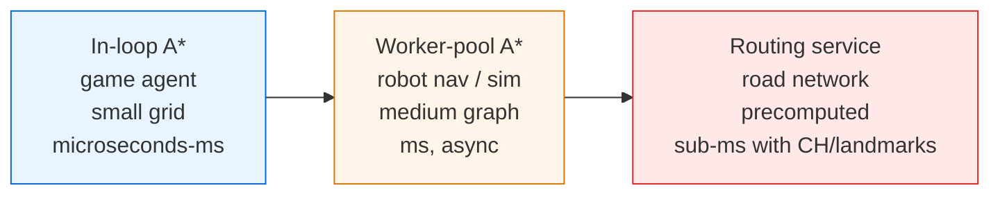
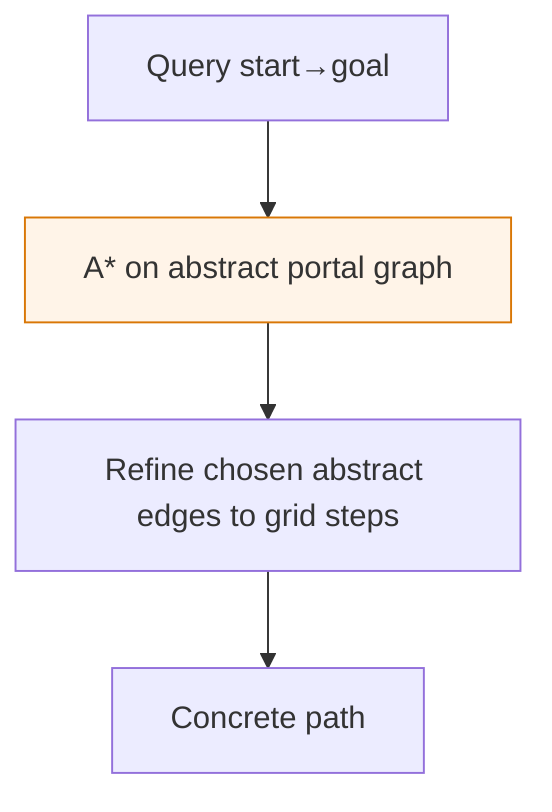

# A* Search — Senior Level

> A* is rarely the bottleneck on a single small query — but the moment you serve millions of pathfinding requests on million-cell maps, every weakness (memory per query, heuristic mis-scaling, dynamic obstacles, cold caches) becomes a production incident. Senior work on A* is about *where it lives in the system* and *what breaks when it does*.

## Table of Contents
1. [Introduction](#1-introduction)
2. [System Design with A*](#2-system-design-with-a)
3. [Distributed and Large-Map Search](#3-distributed-and-large-map-search)
4. [Concurrency: Parallel A*](#4-concurrency-parallel-a)
5. [Comparison at Scale](#5-comparison-at-scale)
6. [Architecture Patterns](#6-architecture-patterns)
7. [Code Examples](#7-code-examples)
8. [Observability](#8-observability)
9. [Failure Modes](#9-failure-modes)
10. [Capacity Planning](#10-capacity-planning)
11. [Summary](#11-summary)

---

## 1. Introduction

At senior level the question is no longer "how does `f = g + h` work" but "where does A* sit in my system, how many queries per second can it serve, and what happens when the map changes underneath it?". A* is an in-memory, single-source-single-target, CPU-bound search whose memory footprint is proportional to the number of nodes it generates. That description alone tells you three things:

- A single query's memory is bounded by the explored region, which on a bad heuristic is the whole map.
- It assumes a static graph; dynamic obstacles invalidate cached paths.
- It is CPU-bound and embarrassingly parallel *across queries* but awkward to parallelize *within* a query.

The interesting senior decisions are architectural:

1. Where does pathfinding run — in the game loop, in a worker pool, in a routing service?
2. How do you keep per-query latency bounded when map size and request rate both grow?
3. How do you precompute structure (hierarchies, contraction, landmarks) to turn an `O(map)` search into an `O(small)` one?
4. How do you keep paths valid when obstacles move?
5. How do you observe a search that is invisible until it spikes a frame or a request?

This document answers those in production terms, across three domains: game engines, robotics navigation, and map routing.

---

## 2. System Design with A*

### 2.1 Three deployment shapes



| Shape | When right | When wrong |
| --- | --- | --- |
| **In-loop** (call A* directly in the tick) | Few agents, small maps, latency must fit a frame budget (~16 ms at 60 fps). | Hundreds of agents repath every frame and blow the budget. |
| **Worker pool** (queue path requests, compute off the hot path) | Robotics planners, RTS games with many units; results can lag a tick or two. | You need the path *this instant* with zero latency. |
| **Routing service** (precomputed acceleration, query is a lookup-ish traversal) | Continent-scale road graphs, millions of queries/day. | The graph changes faster than you can preprocess it. |

The most expensive mistake is calling raw A* on a million-cell map inside a 16 ms frame for every unit. The fix is almost always *precomputation* (hierarchy) or *amortization* (path caching + time-sliced search), not a faster inner loop.

### 2.2 What A* actually costs

A single A* query costs roughly `expanded_nodes × (heap_op + neighbor_work)`. The heap op is `O(log open_size)`; neighbor work is the branching factor. The dominant lever is **how many nodes you expand**, which is set by the heuristic — not by micro-optimizing the swap. Senior design optimizes the *number of expansions* (better heuristic, hierarchy, JPS) and the *frequency of search* (caching, repathing only on change), not the constant factor of the heap.

---

## 3. Distributed and Large-Map Search

When the map is far larger than a single query should ever explore, you precompute structure so each query touches a tiny slice.

### 3.1 Hierarchical pathfinding (HPA*)

Partition the map into clusters. Within each cluster, precompute distances between the cluster's border "portals." Build an **abstract graph** whose nodes are portals and whose edges are intra-cluster shortest paths. A query then:

1. Runs A* on the small abstract graph (cheap — few portals).
2. Refines each abstract edge into concrete steps only along the chosen corridor.



HPA* turns an `O(map)` search into an `O(portals)` search plus local refinement. The trade-off: paths are near-optimal, not exactly optimal, and precomputation must be redone when a cluster's terrain changes. This is the standard technique in large RTS and MMO maps.

### 3.2 Contraction Hierarchies (road networks)

For road routing, **Contraction Hierarchies (CH)** precompute a node ordering by "importance," adding shortcut edges that bypass less-important nodes. A bidirectional search on the contracted graph answers continent-scale queries in microseconds. A* with **landmark heuristics (ALT)** is the heuristic-search cousin: precompute distances to a handful of landmarks, then use the triangle inequality for a far stronger admissible `h` than straight-line distance. CH and ALT are the engines behind production road routers.

### 3.3 Precomputed pattern databases (puzzles, robotics)

For state-space search (sliding puzzles, manipulation planning), precompute exact costs of solving sub-problems and store them in a **pattern database**. The sum or max of pattern-database lookups is an admissible, highly informed `h`. This converts an intractable search into a feasible one. The trade-off is preprocessing time and database memory.

### 3.4 Sharding queries, not searches

A* parallelizes best **across independent queries**: shard the request stream over a worker pool, each worker running its own single-threaded A* on a shared, read-only copy of the graph. The map is immutable during a query window, so no locking is needed on the read path. This is how routing services scale horizontally — replicate the graph, fan out queries.

---

## 4. Concurrency: Parallel A*

Parallelizing a *single* A* search is genuinely hard because the algorithm is inherently sequential: the next node to expand depends on the current best `f`.

### 4.1 Why a single search resists parallelism

A* has a hot frontier ordered by `f`. Two threads popping "the best node" simultaneously will either contend on one lock around the open set (serializing) or expand non-best nodes (wasting work and risking suboptimality). Striping the open set does not help because the *globally* smallest `f` is what matters.

### 4.2 Parallel approaches

- **PNBA\* / Parallel bidirectional:** run forward and backward searches on separate threads; they meet in the middle. Two threads, near-linear speedup on long routes.
- **HDA\* (Hash-Distributed A\*):** hash each node to an owner thread/process; expanding a node sends its neighbors to their owners' queues. Scales to many cores/machines but spends bandwidth on node messages and needs careful termination detection.
- **Decentralized / KPBFS:** multiple threads each pull from a shared priority queue with fine-grained locking or a concurrent skip-list-based queue; accept some duplicated expansions.

```mermaid
flowchart TB
    subgraph HDA*
      O[Generated node] -->|hash(node) mod T| T0[Thread 0 queue]
      O -->|hash| T1[Thread 1 queue]
      O -->|hash| T2[Thread 2 queue]
    end
    style T1 fill:#ffe8e8,stroke:#dc2626
```

### 4.3 The pragmatic answer

In most production systems you do **not** parallelize one search. You parallelize across queries (worker pool) and make each search fast via heuristics and hierarchy. Single-search parallelism is reserved for one very large query (a long road route) where bidirectional parallel A* gives a clean 2× with little complexity.

---

## 5. Comparison at Scale

| Approach | Per-query work | Memory | Optimality | When |
| --- | --- | --- | --- | --- |
| Plain A* (grid) | `O(expanded · log open)` | `O(expanded)` | Optimal (admissible `h`) | Small/medium maps, few queries. |
| Weighted A* | fewer expansions | smaller | `ε`-optimal | Large maps, bounded slack OK. |
| JPS (uniform grid) | far fewer expansions | tiny open set | Optimal | Tile games, uniform cost. |
| HPA* (hierarchy) | `O(portals)` + refine | `O(precomputed portals)` | Near-optimal | Large game/MMO maps. |
| CH / ALT (roads) | microseconds | large preprocessed index | Optimal | Continent-scale routing. |
| IDA* | `O(expanded)` time, `O(depth)` mem | `O(depth)` | Optimal | Memory-bound puzzles. |
| Bidirectional A* (parallel) | `~2·b^(d/2)` | two frontiers | Optimal (careful stop) | Long point-to-point routes. |

The binary takeaway: **plain A* scales by query count, not by map size**. To scale by map size you precompute structure (hierarchy, contraction, pattern DBs). To bound memory you give up storing the whole frontier (IDA*) or give up exactness (weighted/hierarchical).

---

## 6. Architecture Patterns

### 6.1 Path cache + repath-on-change

Cache computed paths keyed by `(start, goal, map_version)`. Invalidate the cache when the map changes (obstacle moves, door closes). Most agents in a game walk the same corridors repeatedly; a cache turns thousands of searches into a handful.

### 6.2 Time-sliced / interruptible search

When you cannot finish a search in one frame, run A* incrementally: do `k` expansions per tick, persist the open/closed state, and resume next tick. The agent follows a provisional path while the full search completes. This bounds per-frame cost regardless of map size.

### 6.3 Incremental replanning (D* Lite, LPA*)

In robotics, the map changes as sensors discover obstacles. **D\* Lite** and **LPA\*** repair the previous search instead of replanning from scratch, reusing most of the prior `g`-values. They are A*'s dynamic-environment relatives and are standard on real robots.

```
on sensor update:
    mark changed cells
    update affected g/rhs values
    propagate only along the changed frontier   # not a full replan
    resume following the repaired path
```

### 6.4 Request pipeline for a routing service

```
        +-----------+     +------------+     +-------------------+
query ->| validate  |---->| load graph |---->| bidirectional ALT |--> path
        | + geocode |     | (read-only)|     | / CH query        |
        +-----------+     +------------+     +-------------------+
                                                     |
                                              metrics + tracing
```

The graph is loaded once, shared read-only across worker threads, and refreshed on a schedule (new road data) by atomically swapping the immutable graph pointer.

---

## 7. Code Examples

### 7.1 Go — interruptible (time-sliced) A* that resumes across ticks

```go
package astar

import "container/heap"

type Point struct{ X, Y int }

type frontierItem struct {
	p Point
	f int
}
type frontier []frontierItem

func (h frontier) Len() int           { return len(h) }
func (h frontier) Less(i, j int) bool { return h[i].f < h[j].f }
func (h frontier) Swap(i, j int)      { h[i], h[j] = h[j], h[i] }
func (h *frontier) Push(x any)        { *h = append(*h, x.(frontierItem)) }
func (h *frontier) Pop() any          { o := *h; n := len(o); v := o[n-1]; *h = o[:n-1]; return v }

// Search holds resumable state so a long query can be spread over many ticks.
type Search struct {
	grid       [][]int
	goal       Point
	g          map[Point]int
	parent     map[Point]Point
	open       *frontier
	Done       bool
	Found      bool
}

func NewSearch(grid [][]int, start, goal Point) *Search {
	s := &Search{
		grid:   grid,
		goal:   goal,
		g:      map[Point]int{start: 0},
		parent: map[Point]Point{},
		open:   &frontier{},
	}
	heap.Push(s.open, frontierItem{start, h(start, goal)})
	return s
}

func h(a, b Point) int {
	dx, dy := a.X-b.X, a.Y-b.Y
	if dx < 0 {
		dx = -dx
	}
	if dy < 0 {
		dy = -dy
	}
	return dx + dy
}

// Step runs at most `budget` expansions, then yields. Returns true when finished.
func (s *Search) Step(budget int) bool {
	dirs := []Point{{1, 0}, {-1, 0}, {0, 1}, {0, -1}}
	for i := 0; i < budget && s.open.Len() > 0; i++ {
		cur := heap.Pop(s.open).(frontierItem)
		if cur.p == s.goal {
			s.Done, s.Found = true, true
			return true
		}
		if cur.f > s.g[cur.p]+h(cur.p, s.goal) {
			continue
		}
		for _, d := range dirs {
			nb := Point{cur.p.X + d.X, cur.p.Y + d.Y}
			if nb.X < 0 || nb.X >= len(s.grid) || nb.Y < 0 || nb.Y >= len(s.grid[0]) || s.grid[nb.X][nb.Y] == 1 {
				continue
			}
			t := s.g[cur.p] + 1
			if best, ok := s.g[nb]; !ok || t < best {
				s.g[nb] = t
				s.parent[nb] = cur.p
				heap.Push(s.open, frontierItem{nb, t + h(nb, s.goal)})
			}
		}
	}
	if s.open.Len() == 0 {
		s.Done = true // exhausted, goal unreachable
	}
	return s.Done
}
```

Each game tick calls `Step(budget)` with a small budget so the search never exceeds the frame's time slice; the agent walks the provisional path until `Found` is true.

### 7.2 Java — query worker pool over a shared, immutable graph

```java
import java.util.concurrent.*;
import java.util.*;

public final class PathfindingService {
    // Immutable graph snapshot shared read-only across workers.
    private volatile int[][] grid;
    private final ExecutorService pool;

    public PathfindingService(int[][] grid, int workers) {
        this.grid = grid;
        this.pool = Executors.newFixedThreadPool(workers);
    }

    // Atomically swap in a new map version (e.g., new road data). No locks on read path.
    public void updateGrid(int[][] next) { this.grid = next; }

    public Future<List<int[]>> submit(int[] start, int[] goal) {
        final int[][] snapshot = grid;          // pin the version for this query
        return pool.submit(() -> aStar(snapshot, start, goal));
    }

    private static List<int[]> aStar(int[][] g, int[] start, int[] goal) {
        int rows = g.length, cols = g[0].length;
        int[][] dist = new int[rows][cols];
        for (int[] row : dist) Arrays.fill(row, Integer.MAX_VALUE);
        int[][] parent = new int[rows * cols][2];
        for (int[] p : parent) { p[0] = -1; p[1] = -1; }

        PriorityQueue<int[]> open = new PriorityQueue<>((a, b) -> a[0] - b[0]);
        dist[start[0]][start[1]] = 0;
        open.add(new int[]{man(start, goal), start[0], start[1]});
        int[][] dirs = {{1, 0}, {-1, 0}, {0, 1}, {0, -1}};

        while (!open.isEmpty()) {
            int[] cur = open.poll();
            int x = cur[1], y = cur[2];
            if (x == goal[0] && y == goal[1]) return rebuild(parent, start, goal, cols);
            if (cur[0] > dist[x][y] + man(new int[]{x, y}, goal)) continue;
            for (int[] d : dirs) {
                int nx = x + d[0], ny = y + d[1];
                if (nx < 0 || nx >= rows || ny < 0 || ny >= cols || g[nx][ny] == 1) continue;
                int t = dist[x][y] + 1;
                if (t < dist[nx][ny]) {
                    dist[nx][ny] = t;
                    parent[nx * cols + ny] = new int[]{x, y};
                    open.add(new int[]{t + man(new int[]{nx, ny}, goal), nx, ny});
                }
            }
        }
        return List.of();
    }

    private static int man(int[] a, int[] b) {
        return Math.abs(a[0] - b[0]) + Math.abs(a[1] - b[1]);
    }

    private static List<int[]> rebuild(int[][] parent, int[] start, int[] goal, int cols) {
        LinkedList<int[]> path = new LinkedList<>();
        int x = goal[0], y = goal[1];
        while (x != -1) {
            path.addFirst(new int[]{x, y});
            if (x == start[0] && y == start[1]) break;
            int[] p = parent[x * cols + y];
            x = p[0]; y = p[1];
        }
        return path;
    }
}
```

The graph is `volatile` and swapped atomically; each query pins a snapshot, so readers never see a half-updated map and never need a lock.

### 7.3 Python — landmark (ALT) heuristic for a stronger admissible `h`

```python
import heapq
from collections import defaultdict


def dijkstra_from(adj, source, n):
    """Exact distances from one landmark to all nodes."""
    dist = [float("inf")] * n
    dist[source] = 0
    pq = [(0, source)]
    while pq:
        d, u = heapq.heappop(pq)
        if d > dist[u]:
            continue
        for v, w in adj[u]:
            if d + w < dist[v]:
                dist[v] = d + w
                heapq.heappush(pq, (d + w, v))
    return dist


class ALTHeuristic:
    """Precompute distances to landmarks; use the triangle inequality for an
    admissible, far-more-informed h than straight-line distance."""

    def __init__(self, adj, n, landmarks):
        self.n = n
        # dist_to[L] = distances from landmark L to every node (undirected graph)
        self.dist = {L: dijkstra_from(adj, L, n) for L in landmarks}
        self.landmarks = landmarks

    def h(self, node, goal):
        best = 0
        for L in self.landmarks:
            dL = self.dist[L]
            # |d(L,goal) - d(L,node)| is an admissible lower bound on d(node,goal)
            est = abs(dL[goal] - dL[node])
            best = max(best, est)
        return best


def a_star_alt(adj, start, goal, heuristic):
    g = {start: 0}
    parent = {}
    pq = [(heuristic.h(start, goal), start)]
    while pq:
        f, u = heapq.heappop(pq)
        if u == goal:
            path = [u]
            while path[-1] in parent:
                path.append(parent[path[-1]])
            return g[u], path[::-1]
        if f > g[u] + heuristic.h(u, goal):
            continue
        for v, w in adj[u]:
            t = g[u] + w
            if t < g.get(v, float("inf")):
                g[v] = t
                parent[v] = u
                heapq.heappush(pq, (t + heuristic.h(v, goal), v))
    return float("inf"), []
```

ALT replaces a weak geometric heuristic with a precomputed one that is much closer to `h*`, shrinking expansions dramatically on road graphs — at the cost of one Dijkstra per landmark up front.

---

## 8. Observability

A pathfinder is invisible until it spikes a frame or a p99. Instrument these from day one.

| Metric | Type | Why |
| --- | --- | --- |
| `astar_query_latency_seconds` | histogram | Catch slow queries before they breach the frame/SLA budget. |
| `astar_expanded_nodes` | histogram | The true cost driver; a spike means a bad heuristic or a maze case. |
| `astar_open_set_peak` | gauge | Memory proxy; near map size means the heuristic stopped helping. |
| `astar_failures_total` | counter | Unreachable-goal rate; a jump means a map regression. |
| `astar_reopened_nodes_total` | counter | Nonzero with a "consistent" heuristic signals a heuristic bug. |
| `astar_cache_hit_ratio` | gauge | Effectiveness of path caching. |
| `astar_path_suboptimality` | histogram | For weighted/hierarchical: measured `cost / lower_bound`. |

The single most useful one is **`expanded_nodes`**: latency tracks it almost linearly, and a sudden rise pinpoints either a degraded heuristic or a pathological map far better than wall-clock alone.

Trace tags per query: `map_version`, `start`, `goal`, `heuristic`, `eps`, `expanded`, `path_len`.

---

## 9. Failure Modes

### 9.1 Heuristic mis-scaling

`h` in one unit (meters), edge costs in another (seconds). `f` becomes dominated by whichever is larger; the search degenerates to greedy (if `h` dominates) or Dijkstra (if `g` dominates). Mitigation: normalize units; assert `h(start) ≤ measured_optimal` on a canary route.

### 9.2 Memory blow-up on pathological maps

A spiral maze or a walled-off goal forces A* to expand nearly the whole map; the open + closed sets approach `O(map)` and can OOM a worker. Mitigations: cap expansions and fail over to weighted A* or hierarchy; bound the open set; run on a memory-limited worker so one bad query cannot take down the box.

### 9.3 Inadmissible heuristic in production

Someone "optimizes" by scaling `h` up to expand fewer nodes and silently returns longer paths. Mitigation: keep an optimality regression test (compare against Dijkstra on a sample); gate `ε > 1` behind an explicit flag with a documented bound.

### 9.4 Stale paths on dynamic maps

An obstacle moves; cached or in-flight paths walk agents into walls. Mitigation: version the map; invalidate caches on change; use incremental replanning (D* Lite) for sensor-driven environments.

### 9.5 Reopening storms with inconsistent heuristics

An inconsistent (but admissible) heuristic causes frequent closed-node reopening, multiplying expansions. Mitigation: prefer consistent heuristics (Manhattan/octile/Euclidean on grids are consistent); if you must use an inconsistent one, monitor `reopened_nodes`.

### 9.6 Tie-break thrashing

On flat-cost open areas, many nodes share `f`; a poor tie-break makes A* fan out in a diamond instead of a line. Mitigation: break ties toward larger `g` and bias toward the start–goal line.

---

## 10. Capacity Planning

### 10.1 Per-query memory

A grid query stores up to one entry per expanded cell in `g`, `parent`, and the open set. At ~48 bytes per cell across maps, a 1000×1000 map fully expanded is ~150 MB for one query. Budget for the *worst* case (maze), not the average (straight line).

### 10.2 Throughput

- Plain grid A*, good heuristic, 100×100 map: tens of microseconds per query — hundreds of thousands/sec on one core.
- 1000×1000 map, hard case: single-digit to tens of milliseconds — tens to hundreds/sec per core. Precompute (HPA*/JPS) to recover orders of magnitude.
- Road network with CH/ALT: microseconds per query after preprocessing; preprocessing itself is minutes to hours offline.

### 10.3 Sizing example (game server)

500 agents, each may repath up to twice per second, average 0.3 ms per JPS query: `500 × 2 × 0.3 ms = 0.3 s` of CPU per wall-second — about one third of a core. Add a path cache (most agents share corridors) and time-slicing, and a single core comfortably serves the fleet. Without JPS, the same workload on plain A* could need 5–10 cores.

### 10.4 When to leave plain A*

Move off plain A* when any of these holds:

- Map size makes worst-case expansions exceed your memory or latency budget → hierarchy (HPA*) or contraction (CH).
- The map changes continuously under sensors → incremental replanning (D* Lite/LPA*).
- You need sub-millisecond continental routing → preprocessed CH/ALT.
- The state space is huge but shallow and memory-bound → IDA*.

Until one of those bites, plain A* with a good heuristic and a path cache is the right answer.

---

## 11. Summary

- A* scales with **query count, not map size** — to scale with map size you precompute structure (HPA*, contraction hierarchies, pattern databases, landmarks).
- The cost driver is **expanded nodes**, set by heuristic quality; optimize that and the search frequency (caching, repath-on-change), not the heap constant.
- A single search resists parallelism; parallelize **across queries** (worker pool over an immutable shared graph), and reserve in-search parallelism (bidirectional, HDA*) for one very large query.
- Bound memory and latency with **weighted A\*, JPS, hierarchy, time-slicing, or IDA\***; choose by which budget you are blowing.
- Keep paths valid on dynamic maps with **versioning and incremental replanning** (D* Lite/LPA*).
- Instrument `expanded_nodes` and `open_set_peak` above all — they predict latency and memory and pinpoint heuristic regressions.
- Plan for the worst-case maze, not the average straight line; one pathological query can OOM a worker if you do not cap it.

References to study further: HPA* (Botea, Müller, Schaeffer 2004), Contraction Hierarchies (Geisberger et al. 2008), ALT landmarks (Goldberg & Harrelson 2005), Jump Point Search (Harabor & Grastien 2011), D* Lite (Koenig & Likhachev 2002), HDA* (Kishimoto, Fukunaga, Botea 2009).
