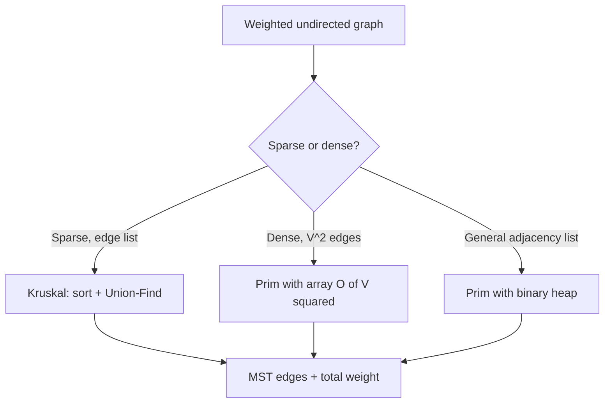

# Minimum Spanning Tree (Kruskal & Prim) — Junior Level

> **One-line summary:** A minimum spanning tree (MST) of a weighted connected undirected graph is a subset of `V−1` edges that connects every vertex with the smallest possible total weight. Two classic greedy algorithms build it: **Kruskal** (sort all edges, add the lightest edge that does not form a cycle, using Union-Find) and **Prim** (grow one tree, repeatedly adding the cheapest edge leaving it, using a priority queue).

---

## Table of Contents

1. [Introduction](#introduction)
2. [Prerequisites](#prerequisites)
3. [Glossary](#glossary)
4. [Core Concepts](#core-concepts)
5. [Big-O Summary](#big-o-summary)
6. [Real-World Analogies](#real-world-analogies)
7. [Pros & Cons](#pros--cons)
8. [Step-by-Step Walkthrough](#step-by-step-walkthrough)
9. [Code Examples](#code-examples)
10. [Coding Patterns](#coding-patterns)
11. [Error Handling](#error-handling)
12. [Performance Tips](#performance-tips)
13. [Best Practices](#best-practices)
14. [Edge Cases & Pitfalls](#edge-cases--pitfalls)
15. [Common Mistakes](#common-mistakes)
16. [Cheat Sheet](#cheat-sheet)
17. [Visual Animation](#visual-animation)
18. [Summary](#summary)
19. [Further Reading](#further-reading)

---

## Introduction

Imagine you must lay fiber-optic cable to connect a set of towns. Every possible direct link between two towns has a known digging cost. You want **every town reachable**, you want **no wasted cable**, and you want the **cheapest total bill**. That is the *minimum spanning tree* problem, and it is one of the oldest, most useful, and most beautiful problems in computer science.

A **spanning tree** of a connected graph is a set of edges that touches every vertex and contains no cycle. Because it has no cycle and connects `n` vertices, it always has exactly `n − 1` edges — remove one and the graph splits in two; add one and you create a cycle. A **minimum** spanning tree is the spanning tree whose edges sum to the smallest possible total weight.

What makes the MST special is that a *greedy* strategy — repeatedly grab the cheapest safe edge — is provably optimal. There is no need for backtracking, dynamic programming, or clever search. Two famous algorithms turn this greedy idea into code:

- **Kruskal's algorithm (1956):** sort *all* edges from cheapest to most expensive; walk the list and accept an edge whenever it joins two pieces that are not yet connected. A **Union-Find / Disjoint-Set** structure (see sibling section *12-disjoint-set*) tells you in near-constant time whether two endpoints are already in the same piece.
- **Prim's algorithm (1930/1957):** start from any single vertex and grow one tree outward, always adding the cheapest edge that leaves the tree and reaches a new vertex. A **priority queue / binary heap** (see sibling section *10-heaps*) hands you that cheapest edge quickly.

Both produce a correct MST. Kruskal thinks in terms of edges and merging forests; Prim thinks in terms of one growing tree. Learn both — they teach two different greedy mindsets, and each wins in different situations (Kruskal on sparse graphs, Prim on dense ones).

---

## Prerequisites

Before reading this file you should be comfortable with:

- **Graphs**: vertices, edges, weights, and the difference between *directed* and *undirected* (MST is for **undirected** graphs only).
- **Adjacency list / adjacency matrix** representations (see sibling section *01-representation*).
- **Sorting** — Kruskal sorts the edge list once up front.
- **Priority queue / binary heap** — Prim repeatedly extracts the minimum-weight edge (see sibling section *10-heaps*).
- **Union-Find (Disjoint Set Union)** — Kruskal uses `find` and `union` to detect cycles (see sibling section *12-disjoint-set*).
- **Big-O notation** — `O(E log E)`, `O(E log V)`, `O(V²)`.

Optional but helpful:

- Familiarity with **BFS/DFS** (sibling sections *02-bfs*, *03-dfs*) — handy for checking connectivity.
- A sense of what "**greedy algorithm**" means: make the locally best choice and never undo it.

---

## Glossary

| Term | Meaning |
|------|---------|
| **Weighted graph** | A graph where each edge carries a numeric weight (cost, distance, capacity…). |
| **Spanning tree** | A subset of edges that connects all `V` vertices and contains no cycle. Has exactly `V − 1` edges. |
| **Minimum spanning tree (MST)** | A spanning tree of minimum total edge weight. |
| **Spanning forest** | If the graph is disconnected, the per-component MSTs together. Has `V − (#components)` edges. |
| **Cut** | A partition of the vertices into two non-empty groups `(S, V∖S)`. |
| **Crossing edge** | An edge with one endpoint in `S` and the other in `V∖S`. |
| **Cut property** | The lightest edge crossing any cut belongs to *some* MST. (This is why greedy works.) |
| **Cycle property** | The heaviest edge on any cycle belongs to *no* MST. |
| **Kruskal's algorithm** | Sort edges ascending; add each edge that joins two different components. Uses Union-Find. |
| **Prim's algorithm** | Grow one tree; repeatedly add the cheapest crossing edge. Uses a priority queue. |
| **Borůvka's algorithm** | Each round, every component picks its own cheapest outgoing edge; merge them all. Parallel-friendly. |
| **Union-Find / DSU** | Disjoint-Set Union structure: `find(x)` returns x's component id, `union(a,b)` merges two components. |

---

## Core Concepts

### 1. What a Spanning Tree Is

Take any connected undirected graph with `V` vertices. A spanning tree:

- **touches every vertex** (it *spans* the graph), and
- **has no cycle** (it is a *tree*).

A tree on `V` vertices always has exactly `V − 1` edges. That is the magic number: too few and the graph is disconnected, too many and you have a cycle. The MST is simply the cheapest of all possible spanning trees.

### 2. The Cut Property (why greedy is safe)

Split the vertices into any two non-empty groups `S` and `V∖S`. The edges with one endpoint in each group are the **crossing edges**.

> **Cut property:** the *lightest* crossing edge can always be part of some MST.

Intuition: any spanning tree must connect `S` to `V∖S` somehow, so it must include at least one crossing edge. If it does not already use the lightest one, you could swap the heavier crossing edge it does use for the lightest — never increasing the total. This single fact justifies *both* Kruskal and Prim.

### 3. The Cycle Property (which edges to reject)

> **Cycle property:** on any cycle, the *heaviest* edge is never needed in an MST.

Intuition: if your tree used that heavy cycle edge, you could delete it and re-connect the two sides with a lighter edge from the same cycle. Kruskal uses this implicitly — when an edge would close a cycle, it is (by sorted order) the heaviest on that cycle, so we reject it.

### 4. Kruskal — Merge Forests by Cheapest Edge

```
kruskal(V, edges):
    sort edges by weight ascending
    dsu = UnionFind(V)
    mst = []
    for (w, u, v) in edges:
        if dsu.find(u) != dsu.find(v):     # different components → no cycle
            dsu.union(u, v)
            mst.append((w, u, v))
            if len(mst) == V - 1: break    # done early
    return mst
```

Kruskal starts with `V` separate single-vertex trees (a forest) and merges them one cheap edge at a time. The Union-Find structure answers "are `u` and `v` already connected?" in near-constant time.

### 5. Prim — Grow One Tree by Cheapest Crossing Edge

```
prim(adj, start):
    visited = {start}
    pq = min-heap of (weight, to) for every edge leaving start
    total = 0
    while pq not empty and |visited| < V:
        (w, v) = pq.pop()
        if v in visited: continue          # stale entry
        visited.add(v); total += w
        for (to, weight) in adj[v]:
            if to not in visited:
                pq.push((weight, to))
    return total
```

Prim keeps a single connected tree (`visited`) and a priority queue of edges that cross from inside to outside. The cheapest crossing edge is always safe by the cut property.

### 6. Borůvka — Everyone Picks at Once (parallel)

Each round, **every** current component selects its own cheapest outgoing edge, and all chosen edges are added at once. The number of components at least halves every round, so it finishes in `O(log V)` rounds — and the per-round work parallelizes well.

---

## Big-O Summary

| Algorithm / variant | Time | Space | Best when |
|---------------------|------|-------|-----------|
| **Kruskal** (sort + Union-Find) | **O(E log E)** = O(E log V) | O(V + E) | Sparse graphs; edges already sorted; edge list given. |
| **Prim** with binary heap | **O(E log V)** | O(V + E) | General-purpose; adjacency list. |
| **Prim** with array (no heap) | **O(V²)** | O(V) | Dense graphs (E ≈ V²); adjacency matrix. |
| **Prim** with Fibonacci heap | **O(E + V log V)** | O(V + E) | Theoretical best for dense; rarely worth it in practice. |
| **Borůvka** | **O(E log V)** | O(V + E) | Parallel / distributed settings. |

Note: `log E = log V² = 2 log V = Θ(log V)`, so Kruskal's `O(E log E)` and Prim's `O(E log V)` are the same asymptotic class. The constant factors and the input format decide which one you reach for.

---

## Real-World Analogies

| Concept | Analogy |
|---------|---------|
| MST | The cheapest way to lay water pipes so every house in a new neighborhood has running water, with no redundant loops. |
| Kruskal | A contractor with a price list sorted cheapest-first. He builds each link only if the two ends are not already joined by previous links. |
| Prim | A single growing road network: from the town hall, you always pave the cheapest road that reaches a not-yet-connected house. |
| Cut property | No matter how you draw a fence splitting the city in two, the cheapest gate across that fence is worth keeping. |
| Cycle property | If pipes form a loop, the most expensive pipe in that loop is wasted money — you can always remove it and stay connected. |
| Union-Find in Kruskal | A "who-is-connected-to-whom" registry that instantly tells you whether two neighborhoods already share a pipe network. |

Where the analogy breaks: real cabling has obstacles, right-of-way, and capacity limits that pure MST ignores. MST optimizes *only* total edge weight on a fixed set of allowed links.

---

## Pros & Cons

| Pros | Cons |
|------|------|
| Simple greedy algorithms with clean, provable correctness. | Only for **undirected** weighted graphs — directed needs *arborescence* (Chu–Liu/Edmonds), a different problem. |
| Near-linear time in practice (`O(E log V)`). | Requires the graph to be connected for a single tree; otherwise you get a forest. |
| Kruskal reuses Union-Find; Prim reuses a heap — both standard tools. | MST is **not unique** when weights tie; you may get a different (equally good) tree. |
| Works on millions of edges comfortably. | Does **not** minimize path lengths between pairs — that is Dijkstra, a different goal. |
| Two algorithms cover both sparse (Kruskal) and dense (Prim-array) cases. | Sensitive to a single mistake (forgetting the cycle check in Kruskal silently produces wrong answers). |

**When to use:** network/circuit design, clustering, building a backbone, approximation for traveling-salesman, image segmentation.

**When NOT to use:** shortest path between two nodes (use Dijkstra / Bellman-Ford), directed graphs (use minimum arborescence), maximum-flow problems.

---

## Step-by-Step Walkthrough

Consider this 5-vertex graph (vertices `A B C D E`, edges shown as `weight`):

```
        A
      6/ \ 3
      /   \
     B--5--C
     |\    |
    8| \1  |7
     |  \  |
     D--4--E
```

Edge list with weights:
`A–C 3`, `A–B 6`, `B–C 5`, `B–E 1`, `B–D 8`, `D–E 4`, `C–E 7`

### Kruskal trace (sort ascending, accept if no cycle)

| Step | Edge | Weight | Components before | Decision | MST total |
|------|------|--------|-------------------|----------|-----------|
| 1 | B–E | 1 | {A}{B}{C}{D}{E} | **accept** (merge B,E) | 1 |
| 2 | A–C | 3 | {A}{B,E}{C}{D} | **accept** (merge A,C) | 4 |
| 3 | D–E | 4 | {A,C}{B,E}{D} | **accept** (merge D into B,E) | 8 |
| 4 | B–C | 5 | {A,C}{B,E,D} | **accept** (merge the two big groups) | 13 |
| 5 | A–B | 6 | {A,C,B,E,D} | reject — A and B already connected (cycle) | 13 |
| 6 | C–E | 7 | all connected | reject — cycle | 13 |
| 7 | B–D | 8 | all connected | reject — cycle | 13 |

We stopped accepting after `V − 1 = 4` edges. **MST edges:** `B–E, A–C, D–E, B–C`. **Total = 13.**

### Prim trace (start at A, grow one tree)

| Step | Visited | Cheapest crossing edge | Add | Total |
|------|---------|------------------------|-----|-------|
| 1 | {A} | A–C 3 (vs A–B 6) | C | 3 |
| 2 | {A,C} | B–C 5 (vs A–B 6, C–E 7) | B | 8 |
| 3 | {A,B,C} | B–E 1 | E | 9 |
| 4 | {A,B,C,E} | D–E 4 (vs B–D 8) | D | 13 |

**MST total = 13** — same cost as Kruskal (here even the same edge set). Note the two algorithms visited edges in a different *order* but reached the same optimal total. When weights are unique, the MST is unique and both must agree edge-for-edge.

---

## Code Examples

### Example 1: Kruskal's Algorithm (with inline Union-Find)

#### Go

```go
package main

import (
	"fmt"
	"sort"
)

type Edge struct {
	W, U, V int
}

type DSU struct {
	parent, rank []int
}

func NewDSU(n int) *DSU {
	d := &DSU{parent: make([]int, n), rank: make([]int, n)}
	for i := range d.parent {
		d.parent[i] = i
	}
	return d
}

func (d *DSU) Find(x int) int {
	for d.parent[x] != x {
		d.parent[x] = d.parent[d.parent[x]] // path halving
		x = d.parent[x]
	}
	return x
}

func (d *DSU) Union(a, b int) bool {
	ra, rb := d.Find(a), d.Find(b)
	if ra == rb {
		return false // already connected → would form a cycle
	}
	if d.rank[ra] < d.rank[rb] {
		ra, rb = rb, ra
	}
	d.parent[rb] = ra
	if d.rank[ra] == d.rank[rb] {
		d.rank[ra]++
	}
	return true
}

func Kruskal(n int, edges []Edge) (int, []Edge) {
	sort.Slice(edges, func(i, j int) bool { return edges[i].W < edges[j].W })
	dsu := NewDSU(n)
	total, mst := 0, []Edge{}
	for _, e := range edges {
		if dsu.Union(e.U, e.V) {
			total += e.W
			mst = append(mst, e)
			if len(mst) == n-1 {
				break
			}
		}
	}
	return total, mst
}

func main() {
	// A=0 B=1 C=2 D=3 E=4
	edges := []Edge{{3, 0, 2}, {6, 0, 1}, {5, 1, 2}, {1, 1, 4}, {8, 1, 3}, {4, 3, 4}, {7, 2, 4}}
	total, mst := Kruskal(5, edges)
	fmt.Println("MST weight:", total) // 13
	fmt.Println("Edges:", mst)
}
```

#### Java

```java
import java.util.*;

public class Kruskal {
    static int[] parent, rank_;

    static int find(int x) {
        while (parent[x] != x) {
            parent[x] = parent[parent[x]]; // path halving
            x = parent[x];
        }
        return x;
    }

    static boolean union(int a, int b) {
        int ra = find(a), rb = find(b);
        if (ra == rb) return false;        // cycle
        if (rank_[ra] < rank_[rb]) { int t = ra; ra = rb; rb = t; }
        parent[rb] = ra;
        if (rank_[ra] == rank_[rb]) rank_[ra]++;
        return true;
    }

    static int kruskal(int n, int[][] edges) {
        // edges[i] = {w, u, v}
        Arrays.sort(edges, Comparator.comparingInt(e -> e[0]));
        parent = new int[n];
        rank_ = new int[n];
        for (int i = 0; i < n; i++) parent[i] = i;
        int total = 0, used = 0;
        for (int[] e : edges) {
            if (union(e[1], e[2])) {
                total += e[0];
                if (++used == n - 1) break;
            }
        }
        return total;
    }

    public static void main(String[] args) {
        int[][] edges = {
            {3, 0, 2}, {6, 0, 1}, {5, 1, 2},
            {1, 1, 4}, {8, 1, 3}, {4, 3, 4}, {7, 2, 4}
        };
        System.out.println("MST weight: " + kruskal(5, edges)); // 13
    }
}
```

#### Python

```python
def kruskal(n, edges):
    """edges: list of (weight, u, v). Returns (total_weight, mst_edges)."""
    parent = list(range(n))
    rank = [0] * n

    def find(x):
        while parent[x] != x:
            parent[x] = parent[parent[x]]   # path halving
            x = parent[x]
        return x

    def union(a, b):
        ra, rb = find(a), find(b)
        if ra == rb:
            return False                    # would create a cycle
        if rank[ra] < rank[rb]:
            ra, rb = rb, ra
        parent[rb] = ra
        if rank[ra] == rank[rb]:
            rank[ra] += 1
        return True

    total, mst = 0, []
    for w, u, v in sorted(edges):           # sort by weight (first tuple field)
        if union(u, v):
            total += w
            mst.append((w, u, v))
            if len(mst) == n - 1:
                break
    return total, mst


if __name__ == "__main__":
    # A=0 B=1 C=2 D=3 E=4
    edges = [(3, 0, 2), (6, 0, 1), (5, 1, 2), (1, 1, 4), (8, 1, 3), (4, 3, 4), (7, 2, 4)]
    total, mst = kruskal(5, edges)
    print("MST weight:", total)             # 13
    print("Edges:", mst)
```

**What it does:** sorts edges, then accepts each edge that joins two different components; rejects cycle-forming edges. Stops after `V − 1` edges.
**Run:** `go run main.go` | `javac Kruskal.java && java Kruskal` | `python kruskal.py`

### Example 2: Prim's Algorithm (binary heap / lazy variant)

#### Go

```go
package main

import (
	"container/heap"
	"fmt"
)

type Item struct{ w, to int }
type PQ []Item

func (p PQ) Len() int            { return len(p) }
func (p PQ) Less(i, j int) bool  { return p[i].w < p[j].w }
func (p PQ) Swap(i, j int)       { p[i], p[j] = p[j], p[i] }
func (p *PQ) Push(x interface{}) { *p = append(*p, x.(Item)) }
func (p *PQ) Pop() interface{} {
	old := *p
	n := len(old)
	it := old[n-1]
	*p = old[:n-1]
	return it
}

func Prim(n int, adj [][]Item, start int) int {
	visited := make([]bool, n)
	pq := &PQ{{0, start}}
	total, count := 0, 0
	for pq.Len() > 0 && count < n {
		it := heap.Pop(pq).(Item)
		if visited[it.to] {
			continue // stale entry
		}
		visited[it.to] = true
		total += it.w
		count++
		for _, e := range adj[it.to] {
			if !visited[e.to] {
				heap.Push(pq, e)
			}
		}
	}
	return total
}

func main() {
	n := 5
	adj := make([][]Item, n)
	add := func(u, v, w int) {
		adj[u] = append(adj[u], Item{w, v})
		adj[v] = append(adj[v], Item{w, u})
	}
	add(0, 2, 3)
	add(0, 1, 6)
	add(1, 2, 5)
	add(1, 4, 1)
	add(1, 3, 8)
	add(3, 4, 4)
	add(2, 4, 7)
	fmt.Println("MST weight:", Prim(n, adj, 0)) // 13
}
```

#### Java

```java
import java.util.*;

public class Prim {
    static int prim(List<int[]>[] adj, int n, int start) {
        boolean[] visited = new boolean[n];
        // entry = {weight, to}
        PriorityQueue<int[]> pq = new PriorityQueue<>(Comparator.comparingInt(a -> a[0]));
        pq.add(new int[]{0, start});
        int total = 0, count = 0;
        while (!pq.isEmpty() && count < n) {
            int[] cur = pq.poll();
            int w = cur[0], v = cur[1];
            if (visited[v]) continue;       // stale entry
            visited[v] = true;
            total += w;
            count++;
            for (int[] e : adj[v]) {        // e = {to, weight}
                if (!visited[e[0]]) pq.add(new int[]{e[1], e[0]});
            }
        }
        return total;
    }

    @SuppressWarnings("unchecked")
    public static void main(String[] args) {
        int n = 5;
        List<int[]>[] adj = new List[n];
        for (int i = 0; i < n; i++) adj[i] = new ArrayList<>();
        int[][] e = {{0,2,3},{0,1,6},{1,2,5},{1,4,1},{1,3,8},{3,4,4},{2,4,7}};
        for (int[] x : e) {
            adj[x[0]].add(new int[]{x[1], x[2]});
            adj[x[1]].add(new int[]{x[0], x[2]});
        }
        System.out.println("MST weight: " + prim(adj, n, 0)); // 13
    }
}
```

#### Python

```python
import heapq


def prim(adj, n, start=0):
    """adj[u] = list of (weight, v). Returns total MST weight."""
    visited = [False] * n
    pq = [(0, start)]              # (weight, vertex)
    total, count = 0, 0
    while pq and count < n:
        w, v = heapq.heappop(pq)
        if visited[v]:
            continue              # stale entry — already in the tree
        visited[v] = True
        total += w
        count += 1
        for weight, to in adj[v]:
            if not visited[to]:
                heapq.heappush(pq, (weight, to))
    return total


if __name__ == "__main__":
    n = 5
    adj = [[] for _ in range(n)]
    def add(u, v, w):
        adj[u].append((w, v))
        adj[v].append((w, u))
    add(0, 2, 3); add(0, 1, 6); add(1, 2, 5); add(1, 4, 1)
    add(1, 3, 8); add(3, 4, 4); add(2, 4, 7)
    print("MST weight:", prim(adj, n, 0))   # 13
```

**What it does:** grows a tree from a start vertex, always popping the cheapest crossing edge; skips edges whose target is already in the tree.
**Run:** `go run main.go` | `javac Prim.java && java Prim` | `python prim.py`

---

## Coding Patterns

### Pattern 1: "Lazy" Prim (push duplicates, skip stale on pop)

**Intent:** avoid implementing `decreaseKey`. Push every candidate edge; when you pop one whose endpoint is already visited, discard it. Simpler code, slightly more heap entries (`O(E)` instead of `O(V)`).

```python
if visited[v]:
    continue        # this is the whole trick
```

### Pattern 2: Kruskal as the default for an edge list

**Intent:** when the input is already a list of `(w, u, v)` edges (very common in competitive programming and CSV imports), Kruskal needs no adjacency list at all — just sort and union.

### Pattern 3: Min cost to connect points (implicit complete graph)

**Intent:** "connect all points with minimum cost" problems give you coordinates, not edges. The graph is *complete* with `V²` edges, so it is **dense** → prefer **Prim with an array** (`O(V²)`), or build all edges and run Kruskal if `V` is small.



---

## Error Handling

| Error | Cause | Fix |
|-------|-------|-----|
| MST has the wrong (too-small) weight | Forgot the Union-Find cycle check in Kruskal — added cycle edges. | Only add an edge when `find(u) != find(v)`. |
| Result has fewer than `V−1` edges | Graph is **disconnected**. | Detect it (count accepted edges); decide whether you want a spanning *forest* or an error. |
| Infinite loop / wrong answer in Prim | Forgot the `visited` skip; re-adding visited vertices. | Always `continue` when the popped vertex is already visited. |
| Used on a directed graph | MST is undefined for directed graphs. | Use minimum *arborescence* (Chu–Liu/Edmonds) instead. |
| Self-loops or parallel edges break counts | Self-loop `u–u` is always a cycle; parallel edges are fine but only the cheapest matters. | Skip self-loops; Kruskal naturally ignores the heavier parallel edge. |
| Integer overflow on total weight | Many large weights summed in 32-bit. | Accumulate the total in a 64-bit integer (`int64`/`long`). |

---

## Performance Tips

- **Choose by density.** Sparse (`E ≈ V`) → Kruskal or heap-Prim. Dense (`E ≈ V²`) → array-Prim (`O(V²)`) beats both because it avoids `log` factors and heap overhead.
- **Pre-sorted edges** make Kruskal effectively `O(E α(V))` — if weights are small integers, *counting/radix sort* the edge list instead of comparison sort.
- **Use path compression + union by rank** in Union-Find so `find`/`union` are amortized near `O(1)` (see sibling *12-disjoint-set*, *02-path-compression*, *03-union-by-rank*).
- **Lazy Prim** is usually fast enough; eager Prim with `decreaseKey` saves heap space but adds an index map and complexity.
- **Stop early** in Kruskal once you have accepted `V − 1` edges — no need to scan the rest.

---

## Best Practices

- Always confirm the graph is **undirected** and **weighted** before reaching for MST.
- Decide up front what to do if the graph is **disconnected**: return a forest, or raise an error.
- Accumulate the total weight in a 64-bit integer to avoid overflow.
- Write a brute-force checker for tiny graphs (try all spanning trees) and test your implementation against it on random inputs.
- Document which algorithm and variant you chose and why (density argument) in a code comment.
- Reuse a well-tested Union-Find for Kruskal rather than rewriting it each time.

---

## Edge Cases & Pitfalls

- **Disconnected graph** — no single spanning tree exists; you get a *minimum spanning forest*. Always handle this.
- **Single vertex** — MST is empty (0 edges, weight 0). Make sure loops do not crash on `V = 1`.
- **Equal weights** — the MST is **not unique**; different runs / algorithms may return different (but equally cheap) trees. That is fine.
- **Parallel edges** — keep them; Kruskal/Prim naturally use only the cheapest between two vertices.
- **Self-loops** — always cycle-forming; skip them.
- **Negative weights** — totally fine for MST (unlike Dijkstra). Greedy still works because no path concept is involved.
- **Already a tree** — if the input is already a tree, the MST is the whole graph.

---

## Common Mistakes

1. **Forgetting Union-Find in Kruskal** — without the cycle check you happily add cycle edges and get a wrong, too-cheap "tree."
2. **Running MST on a directed graph** — produces nonsense; the right tool is minimum arborescence.
3. **Not handling disconnected input** — silently returning `< V−1` edges and treating it as a valid tree.
4. **Skipping the stale-entry check in lazy Prim** — re-visiting nodes and double-counting weight.
5. **Confusing MST with shortest paths** — the MST does *not* give shortest distances between vertices; that is Dijkstra.
6. **Summing weights in 32-bit** and overflowing on large graphs.
7. **Assuming the MST is unique** — it is only unique when all edge weights are distinct.

---

## Cheat Sheet

| Question | Answer |
|----------|--------|
| What is an MST? | Cheapest set of `V−1` edges connecting all vertices, no cycle. |
| Which graphs? | Connected, **undirected**, weighted. |
| Kruskal core idea | Sort edges; add if endpoints in different components (Union-Find). |
| Prim core idea | Grow one tree; add cheapest crossing edge (priority queue). |
| Kruskal time | O(E log E) = O(E log V). |
| Prim (heap) time | O(E log V). |
| Prim (array) time | O(V²) — best for **dense** graphs. |
| Borůvka | O(E log V), parallel-friendly. |
| Cut property | Lightest edge across any cut is in some MST. |
| Cycle property | Heaviest edge on any cycle is in no MST. |
| Disconnected graph | → minimum spanning *forest*. |
| MST unique? | Only if all edge weights are distinct. |

Decision rule:

```
edge list given        → Kruskal
sparse adjacency list  → Prim (binary heap) or Kruskal
dense / complete graph → Prim (array, O(V²))
parallel / distributed → Borůvka
```

---

## Visual Animation

> See [`animation.html`](./animation.html) for an interactive visual animation of MST construction.
>
> The animation demonstrates:
> - A small weighted graph with a toggle between **Kruskal** and **Prim**
> - Kruskal: the sorted edge list, Union-Find component colors, and accept/reject of each edge
> - Prim: the growing tree, the crossing-edge priority queue, and the chosen edge
> - The running total weight as each edge is added
> - Step / Run / Reset controls

---

## Summary

A minimum spanning tree connects every vertex of a weighted undirected graph with the least total edge weight, using exactly `V − 1` edges. Two greedy algorithms build it: **Kruskal** sorts all edges and adds each one that joins two different components (using Union-Find to reject cycles), running in `O(E log E)`; **Prim** grows a single tree, repeatedly adding the cheapest crossing edge (using a priority queue), running in `O(E log V)` or `O(V²)` with an array on dense graphs. Both are justified by the **cut property** (lightest crossing edge is safe) and the **cycle property** (heaviest cycle edge is useless). Pick Kruskal for sparse / edge-list inputs and Prim for dense graphs, always handle disconnected input as a forest, and remember the MST is unique only when all weights differ.

---

## Further Reading

- *Introduction to Algorithms* (CLRS), Chapter 23 — "Minimum Spanning Trees" — Kruskal, Prim, and the generic greedy proof.
- *Algorithms* (Sedgewick & Wayne), Section 4.3 — clear treatment with lazy/eager Prim.
- Sibling section *12-disjoint-set* — the Union-Find structure Kruskal relies on.
- Sibling section *10-heaps* — the priority queue Prim relies on.
- Borůvka's original 1926 paper (electrical network design) — the first MST algorithm.
- cp-algorithms.com — "Minimum spanning tree - Kruskal" and "- Prim" — concise reference implementations.
- visualgo.net — "Minimum Spanning Tree" — interactive visualization.
