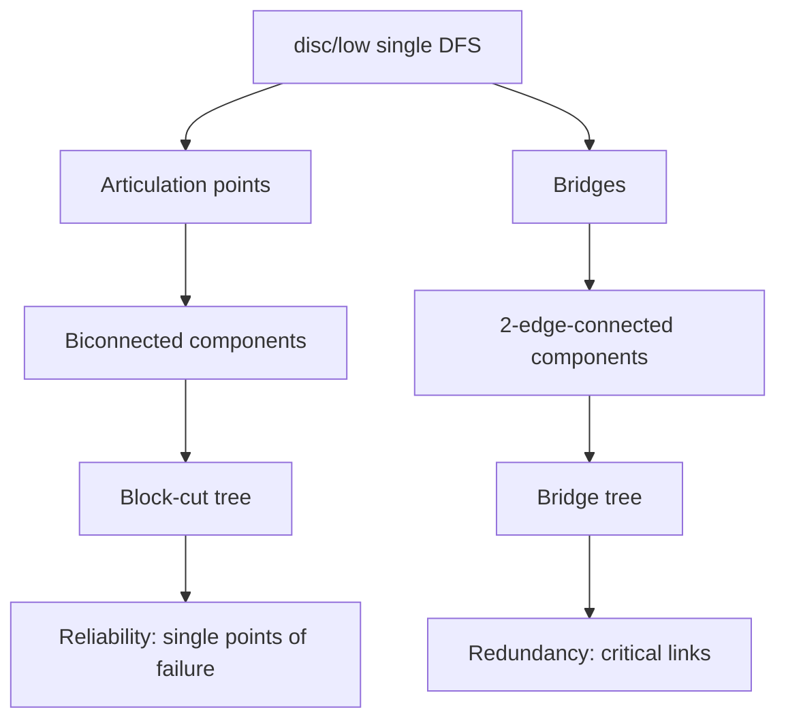

# Articulation Points & Bridges — Middle Level

> **Focus:** Why the `disc`/`low` criteria are correct, how the single-DFS approach beats remove-and-check, and how cut vertices and bridges decompose a graph into biconnected components, 2-edge-connected components, the block-cut tree, and the bridge tree.

---

## Table of Contents

1. [Introduction](#introduction)
2. [Deeper Concepts](#deeper-concepts)
3. [Comparison with Alternatives](#comparison-with-alternatives)
4. [Advanced Patterns](#advanced-patterns)
5. [Graph and Tree Applications](#graph-and-tree-applications)
6. [Algorithmic Integration](#algorithmic-integration)
7. [Code Examples](#code-examples)
8. [Error Handling](#error-handling)
9. [Performance Analysis](#performance-analysis)
10. [Best Practices](#best-practices)
11. [Visual Animation](#visual-animation)
12. [Summary](#summary)

---

## Introduction

At junior level you learned the two inequalities and how to apply them. At middle level the engineering questions appear:

- *Why* does `low[v] >= disc[u]` mean `u` is a cut vertex — what does the proof actually rely on?
- Why is the bridge test **strict** (`>`) while the cut-vertex test is **non-strict** (`>=`)?
- How do articulation points and bridges *decompose* a graph — into biconnected components and 2-edge-connected components?
- What is the **block-cut tree**, and the **bridge tree**, and why are they the structures you actually want for downstream queries?
- When is the naive remove-and-check ever acceptable?

These are not academic. The block-cut tree turns "is there a single point of failure between A and B?" from a graph search into a tree path query, and the bridge tree turns "which edges are critical on the A–B route?" into the same.

---

## Deeper Concepts

### Low-link semantics, precisely

Define, for the DFS tree rooted at the start vertex:

```
low[u] = min over:
    disc[u]
    disc[w]   for every back edge (x, w) where x is in subtree(u) and w is an ancestor (or u itself)
    low[c]    for every tree-edge child c of u
```

Because `low[c]` already folds in `c`'s own subtree, the recursive formula `low[u] = min(disc[u], min over back edges disc[w], min over children low[c])` computes exactly this. Intuitively: `low[u]` is the **shallowest** (smallest `disc`) vertex the whole subtree under `u` can "escape" to using tree edges down and **one** back edge up.

### Why `low[v] >= disc[u]` makes `u` a cut vertex (non-root)

Consider tree edge `u → v`. The subtree `subtree(v)` is connected to the rest of the graph only through:

1. the tree edge `(u, v)` itself, and
2. any back edges from `subtree(v)` to ancestors of `u`.

`low[v]` is the shallowest vertex reachable from `subtree(v)`. If `low[v] >= disc[u]`, then **no back edge from `subtree(v)` reaches strictly above `u`** (anything reachable has `disc >= disc[u]`, i.e. is `u` or deeper). Therefore the *only* path from `subtree(v)` to the part of the graph above `u` passes through `u`. Remove `u`, and `subtree(v)` is severed. Hence `u` is an articulation point. The root fails this argument because it has no "part above it," which is why it needs the children-count rule.

### Why the bridge test is strict (`>`)

Edge `(u, v)` is a bridge iff removing it disconnects `v`'s side. The subtree under `v` can reach back to `u` or above only through a back edge. `low[v]` is the shallowest such target.

- If `low[v] > disc[u]`: the subtree cannot even reach `u` (no back edge to `u` or above). The only connection is the edge `(u, v)`. Remove it → disconnected. **Bridge.**
- If `low[v] == disc[u]`: there *is* a back edge from the subtree to `u` itself, providing an alternate route. Remove `(u, v)` and the subtree still reaches `u` via that back edge. **Not a bridge.** But note `u` may still be a cut vertex — which is exactly why the cut-vertex test uses `>=`, catching the `==` case the bridge test rejects.

So the single character `>` vs `>=` is the entire distinction, and it is *not* arbitrary: it is the difference between "can reach `u`" and "cannot reach `u`."

### The root case, restated

The root `r` has no ancestors. For each child `c`, `subtree(c)` can only connect to other children's subtrees *through `r`* (there is nothing above `r` to route around it). So if `r` has two or more children, removing `r` splits those subtrees apart → cut vertex. One child → removing `r` leaves a single connected subtree → not a cut vertex.

A subtle consequence: if you naively applied the non-root test `low[c] >= disc[r]` to the root, it would *always* fire, because `disc[r] = 0` is the global minimum and every `low[c] >= 0`. That would falsely flag every root. The children-count rule replaces it precisely to avoid this false positive.

### A worked low-link trace

Take the running example — two triangles `0-1-2` and `3-4-5` joined by the bridge `1-3`:

```
edges: 0-1, 1-2, 2-0, 1-3, 3-4, 4-5, 5-3
```

DFS from `0`, smallest neighbor first, builds this tree (`│` tree edges, `╌╌>` back edges to ancestors):

```
   0   disc=0 low=0     root, 1 child  -> NOT a cut vertex
   │
   1   disc=1 low=0     low pulled to 0 by back edge 2->0
   ├──────────────╮
   2  disc=2       3  disc=3 low=3
   low=0           │
   ╎ back 2->0     4  disc=4 low=3
                   │
                   5  disc=5 low=3
                   ╎ back 5->3
```

Folding `low` upward in post-order:

| vertex | disc | low | how low was set |
|--------|------|-----|-----------------|
| 0 | 0 | 0 | root |
| 1 | 1 | 0 | min(1, low[2]=0, low[3]=3) |
| 2 | 2 | 0 | back edge 2->0 gives disc[0]=0 |
| 3 | 3 | 3 | min(3, low[4]=3) |
| 4 | 4 | 3 | min(4, low[5]=3) |
| 5 | 5 | 3 | back edge 5->3 gives disc[3]=3 |

Now read off the criteria, edge by edge:

| tree edge u→v | low[v] | disc[u] | `low[v] >= disc[u]`? cut | `low[v] > disc[u]`? bridge |
|---------------|--------|---------|--------------------------|----------------------------|
| 1→2 | 0 | 1 | 0 >= 1 — no | 0 > 1 — no |
| 1→3 | 3 | 1 | 3 >= 1 — **yes (1 is AP)** | 3 > 1 — **yes (bridge)** |
| 3→4 | 3 | 3 | 3 >= 3 — **yes (3 is AP)** | 3 > 3 — **no** |
| 4→5 | 3 | 4 | 3 >= 4 — no | 3 > 4 — no |

So articulation points are `{1, 3}` and the only bridge is `(1,3)`. Note vertex `3`: the back edge `5->3` makes `low[4] = disc[3]`, so the edge `3-4` is *not* a bridge (the triangle gives a detour), yet `3` *is* a cut vertex — the exact `low[v] == disc[u]` boundary that separates the `>` test from the `>=` test.

---

## Comparison with Alternatives

| Approach | Articulation points | Bridges | Time | When |
|----------|---------------------|---------|------|------|
| Single DFS (`disc`/`low`, Tarjan) | yes | yes | `O(V + E)` | Always the default. |
| Remove-and-check (per vertex/edge) | yes | yes | `O(V·(V+E))` / `O(E·(V+E))` | Tiny graphs; a correctness oracle for tests. |
| Union-Find offline (bridges only) | no | yes | `O((V+E) α)` | When you only want bridges and prefer DSU over DFS recursion. |
| BFS-based low-link | yes | yes | `O(V + E)` | Same idea but BFS layering; avoids deep recursion. |

### The naive remove-and-check table (why we avoid it)

```text
for each vertex u:               for each edge e:
    remove u                         remove e
    components' = count_cc()         components' = count_cc()
    if components' > components:      if components' > components:
        u is articulation point          e is a bridge
    restore u                        restore e
```

Each `count_cc()` is a full traversal: `O(V + E)`. Doing it `V` times (vertices) or `E` times (edges) gives the quadratic-ish costs above. On a graph with 10⁵ vertices and 10⁵ edges, the single-DFS approach runs in ~milliseconds while remove-and-check runs in tens of seconds. The only legitimate use of remove-and-check is as a **brute-force oracle** to validate the fast algorithm on small random graphs.

---

## Advanced Patterns

### Biconnected components (2-vertex-connected)

A **biconnected component** (BCC) is a maximal subgraph in which no single vertex is an articulation point — equivalently, every pair of edges lies on a common simple cycle. BCCs partition the **edges** of the graph (not the vertices — a cut vertex belongs to multiple BCCs).

To extract BCCs, push **edges** onto a stack as you traverse them. When you discover a child `v` of `u` with `low[v] >= disc[u]` (the cut-vertex condition), pop edges off the stack down to and including `(u, v)` — those edges form one biconnected component.

### 2-edge-connected components

A **2-edge-connected component** (2ECC) is a maximal subgraph with **no bridge** inside it — you cannot disconnect it by removing a single edge. The 2ECCs are exactly the connected pieces you get after **deleting all bridges**. They partition the **vertices**.

A clean way to compute them: find all bridges, mark them, then run a second DFS/union that refuses to cross a bridge — each resulting component is a 2ECC. (You can also assign 2ECC ids in the same pass using the bridge condition.)

### The block-cut tree

The **block-cut tree** (BC-tree) compresses the graph's biconnected structure into a tree:

- One node per **biconnected component** ("block").
- One node per **articulation point**.
- Connect each articulation point to every block that contains it.

The result is a tree (or forest). It answers questions like "must every path from A to B pass through some cut vertex?" as a **tree path** query. Two vertices in the same block share a cycle (no cut vertex between them); otherwise the cut vertices on the BC-tree path between their blocks are exactly the single points of failure.

### The bridge tree (2-edge-connected component tree)

The **bridge tree** compresses 2-edge-connected structure:

- Contract each 2-edge-connected component to a single node.
- The remaining edges between contracted nodes are exactly the **bridges**.

The result is a tree (one per connected component). The number of bridges on the path between two vertices in the bridge tree is exactly the number of critical edges on every route between them. This turns "how many single-edge failures separate A from B?" into a tree-distance query.

```mermaid
graph TD
    subgraph Original
    A0[Triangle 0-1-2] ---|bridge 1-3| A1[Triangle 3-4-5]
    end
    subgraph "Bridge tree"
    C0[2ECC: {0,1,2}] ---|bridge| C1[2ECC: {3,4,5}]
    end
```

---

## Graph and Tree Applications



### Reliability and redundancy

- **Single points of failure (vertices):** the articulation points. A network with *no* articulation points is **2-vertex-connected** — any one node can fail and everything stays reachable.
- **Critical links (edges):** the bridges. A network with *no* bridges is **2-edge-connected** — any one cable can be cut and everything stays reachable.
- **Redundancy planning:** the bridge tree shows precisely where adding one edge removes a critical link. Adding an edge between two leaves of the bridge tree can collapse a whole path of bridges into a 2-edge-connected blob (related to `26-strong-orientation` and the classic "add fewest edges to make 2-edge-connected" problem).

---

## Algorithmic Integration

The `disc`/`low` pattern is shared across several algorithms — recognizing it lets you reuse one mental model:

- **Tarjan's SCC** (`08-tarjan-scc`): same `disc`/`low`, but on a *directed* graph and with an on-stack membership test. Cut vertices/bridges are the undirected cousin.
- **Strong orientation** (`26-strong-orientation`): a connected graph can be oriented to be strongly connected **iff it has no bridge** (Robbins' theorem). Bridge detection is the precondition check.
- **Eulerian path** (`12-eulerian-path-circuit`): bridge awareness underlies Fleury's algorithm ("don't burn a bridge unless you must").
- **General connectivity** (`23-edge-vertex-connectivity`): articulation points and bridges are the `k = 1` case of vertex- and edge-connectivity.
- **Online / dynamic bridges** (`30-online-bridges`): maintaining the bridge set as edges are inserted, instead of recomputing from scratch.

---

## Code Examples

### Biconnected components via an edge stack, plus the bridge tree

These build on the junior-level DFS: we push edges as we traverse, and pop a component when the cut-vertex condition fires. We also assign 2-edge-connected component ids and build the bridge tree.

#### Go

```go
package main

import "fmt"

type Graph struct {
	n   int
	adj [][][2]int // adj[u] = list of {neighbor, edgeId}
	m   int
}

func NewGraph(n int) *Graph { return &Graph{n: n, adj: make([][][2]int, n)} }

func (g *Graph) AddEdge(u, v int) {
	g.adj[u] = append(g.adj[u], [2]int{v, g.m})
	g.adj[v] = append(g.adj[v], [2]int{u, g.m})
	g.m++
}

// Biconnected components: each returned slice is a list of edge ids.
func (g *Graph) BiconnectedComponents() [][]int {
	disc := make([]int, g.n)
	low := make([]int, g.n)
	for i := range disc {
		disc[i] = -1
	}
	timer := 0
	var stack []int // edge ids
	var bccs [][]int

	var dfs func(u, parentEdge int)
	dfs = func(u, parentEdge int) {
		disc[u] = timer
		low[u] = timer
		timer++
		for _, e := range g.adj[u] {
			v, id := e[0], e[1]
			if id == parentEdge {
				continue // skip the specific edge we came on (handles multi-edges)
			}
			if disc[v] == -1 {
				stack = append(stack, id)
				dfs(v, id)
				if low[v] < low[u] {
					low[u] = low[v]
				}
				if low[v] >= disc[u] {
					// pop one biconnected component
					var comp []int
					for {
						top := stack[len(stack)-1]
						stack = stack[:len(stack)-1]
						comp = append(comp, top)
						if top == id {
							break
						}
					}
					bccs = append(bccs, comp)
				}
			} else if disc[v] < disc[u] {
				// back edge going up; push and relax low
				stack = append(stack, id)
				if disc[v] < low[u] {
					low[u] = disc[v]
				}
			}
		}
	}

	for i := 0; i < g.n; i++ {
		if disc[i] == -1 {
			dfs(i, -1)
		}
	}
	return bccs
}

func main() {
	g := NewGraph(6)
	for _, e := range [][2]int{{0, 1}, {1, 2}, {2, 0}, {1, 3}, {3, 4}, {4, 5}, {5, 3}} {
		g.AddEdge(e[0], e[1])
	}
	for i, comp := range g.BiconnectedComponents() {
		fmt.Printf("BCC %d edges: %v\n", i, comp)
	}
}
```

#### Java

```java
import java.util.*;

public class Biconnected {
    int n, m = 0;
    List<int[]>[] adj; // {neighbor, edgeId}
    int[] disc, low;
    int timer = 0;
    Deque<Integer> stack = new ArrayDeque<>();
    List<List<Integer>> bccs = new ArrayList<>();

    @SuppressWarnings("unchecked")
    Biconnected(int n) {
        this.n = n;
        adj = new List[n];
        for (int i = 0; i < n; i++) adj[i] = new ArrayList<>();
    }

    void addEdge(int u, int v) {
        adj[u].add(new int[]{v, m});
        adj[v].add(new int[]{u, m});
        m++;
    }

    void run() {
        disc = new int[n];
        low = new int[n];
        Arrays.fill(disc, -1);
        for (int i = 0; i < n; i++) if (disc[i] == -1) dfs(i, -1);
    }

    void dfs(int u, int parentEdge) {
        disc[u] = low[u] = timer++;
        for (int[] e : adj[u]) {
            int v = e[0], id = e[1];
            if (id == parentEdge) continue;     // skip the exact edge we came on
            if (disc[v] == -1) {
                stack.push(id);
                dfs(v, id);
                low[u] = Math.min(low[u], low[v]);
                if (low[v] >= disc[u]) {
                    List<Integer> comp = new ArrayList<>();
                    int top;
                    do { top = stack.pop(); comp.add(top); } while (top != id);
                    bccs.add(comp);
                }
            } else if (disc[v] < disc[u]) {
                stack.push(id);
                low[u] = Math.min(low[u], disc[v]);
            }
        }
    }

    public static void main(String[] args) {
        Biconnected g = new Biconnected(6);
        int[][] edges = {{0, 1}, {1, 2}, {2, 0}, {1, 3}, {3, 4}, {4, 5}, {5, 3}};
        for (int[] e : edges) g.addEdge(e[0], e[1]);
        g.run();
        for (int i = 0; i < g.bccs.size(); i++) {
            System.out.println("BCC " + i + " edges: " + g.bccs.get(i));
        }
    }
}
```

#### Python

```python
import sys


class Graph:
    def __init__(self, n):
        self.n = n
        self.adj = [[] for _ in range(n)]  # adj[u] = list of (neighbor, edge_id)
        self.m = 0

    def add_edge(self, u, v):
        self.adj[u].append((v, self.m))
        self.adj[v].append((u, self.m))
        self.m += 1

    def biconnected_components(self):
        disc = [-1] * self.n
        low = [0] * self.n
        timer = [0]
        stack = []          # edge ids
        bccs = []

        def dfs(u, parent_edge):
            disc[u] = low[u] = timer[0]
            timer[0] += 1
            for v, eid in self.adj[u]:
                if eid == parent_edge:
                    continue                       # skip the exact edge we came on
                if disc[v] == -1:
                    stack.append(eid)
                    dfs(v, eid)
                    low[u] = min(low[u], low[v])
                    if low[v] >= disc[u]:
                        comp = []
                        while True:
                            top = stack.pop()
                            comp.append(top)
                            if top == eid:
                                break
                        bccs.append(comp)
                elif disc[v] < disc[u]:
                    stack.append(eid)
                    low[u] = min(low[u], disc[v])

        for i in range(self.n):
            if disc[i] == -1:
                dfs(i, -1)
        return bccs


if __name__ == "__main__":
    sys.setrecursionlimit(1 << 20)
    g = Graph(6)
    for u, v in [(0, 1), (1, 2), (2, 0), (1, 3), (3, 4), (4, 5), (5, 3)]:
        g.add_edge(u, v)
    for i, comp in enumerate(g.biconnected_components()):
        print(f"BCC {i} edges: {comp}")
```

**What it does:** pushes edges onto a stack during DFS; when `low[v] >= disc[u]` fires at vertex `u` for child `v`, pops the edges down to `(u, v)` as one biconnected component. Using the **parent edge id** (not parent vertex) makes it multi-edge safe. For the example, you get the triangle `{0,1,2}`, the bridge edge `{1-3}` as its own one-edge BCC, and the triangle `{3,4,5}`.

### Building the bridge tree (2ECC labeling + contraction)

The recipe is three phases: (1) find all bridges with `disc`/`low`; (2) flood-fill 2-edge-connected-component ids without crossing a bridge; (3) for each bridge, add a tree edge between the two component ids. Here it is concretely in all three languages.

#### Go

```go
// Returns comp[v] = 2ECC id and the bridge-tree edges (pairs of comp ids).
func (g *Graph) BridgeTree() ([]int, [][2]int) {
	disc := make([]int, g.n)
	low := make([]int, g.n)
	for i := range disc {
		disc[i] = -1
	}
	isBridge := make([]bool, g.m)
	timer := 0
	var dfs func(u, parentEdge int)
	dfs = func(u, parentEdge int) {
		disc[u], low[u] = timer, timer
		timer++
		for _, e := range g.adj[u] {
			v, id := e[0], e[1]
			if id == parentEdge {
				continue
			}
			if disc[v] == -1 {
				dfs(v, id)
				if low[v] < low[u] {
					low[u] = low[v]
				}
				if low[v] > disc[u] { // strict => bridge
					isBridge[id] = true
				}
			} else if disc[v] < low[u] {
				low[u] = disc[v]
			}
		}
	}
	for i := 0; i < g.n; i++ {
		if disc[i] == -1 {
			dfs(i, -1)
		}
	}

	comp := make([]int, g.n)
	for i := range comp {
		comp[i] = -1
	}
	numComp := 0
	for s := 0; s < g.n; s++ {
		if comp[s] != -1 {
			continue
		}
		id := numComp
		numComp++
		stack := []int{s}
		comp[s] = id
		for len(stack) > 0 {
			u := stack[len(stack)-1]
			stack = stack[:len(stack)-1]
			for _, e := range g.adj[u] {
				if isBridge[e[1]] {
					continue // never cross a bridge
				}
				if comp[e[0]] == -1 {
					comp[e[0]] = id
					stack = append(stack, e[0])
				}
			}
		}
	}

	var tree [][2]int
	seen := make([]bool, g.m)
	for u := 0; u < g.n; u++ {
		for _, e := range g.adj[u] {
			if isBridge[e[1]] && !seen[e[1]] {
				seen[e[1]] = true
				tree = append(tree, [2]int{comp[u], comp[e[0]]})
			}
		}
	}
	return comp, tree
}
```

#### Java

```java
// Phase 1: bridges; Phase 2: 2ECC flood fill; Phase 3: contract.
int[] comp;       // comp[v] = 2ECC id
boolean[] isBridge;
int numComp = 0;

int[][] bridgeTree() {           // assumes adj[u] holds {neighbor, edgeId}
    int[] disc = new int[n], low = new int[n];
    Arrays.fill(disc, -1);
    isBridge = new boolean[m];
    int[] t = {0};
    // recursive bridge DFS
    java.util.function.BiConsumer<Integer, Integer>[] dfs = new java.util.function.BiConsumer[1];
    dfs[0] = (u, pe) -> {
        disc[u] = low[u] = t[0]++;
        for (int[] e : adj[u]) {
            int v = e[0], id = e[1];
            if (id == pe) continue;
            if (disc[v] == -1) {
                dfs[0].accept(v, id);
                low[u] = Math.min(low[u], low[v]);
                if (low[v] > disc[u]) isBridge[id] = true;
            } else low[u] = Math.min(low[u], disc[v]);
        }
    };
    for (int i = 0; i < n; i++) if (disc[i] == -1) dfs[0].accept(i, -1);

    comp = new int[n];
    Arrays.fill(comp, -1);
    for (int s = 0; s < n; s++) {
        if (comp[s] != -1) continue;
        int id = numComp++;
        Deque<Integer> q = new ArrayDeque<>();
        q.push(s); comp[s] = id;
        while (!q.isEmpty()) {
            int u = q.pop();
            for (int[] e : adj[u]) {
                if (isBridge[e[1]] || comp[e[0]] != -1) continue;
                comp[e[0]] = id; q.push(e[0]);
            }
        }
    }

    List<int[]> tree = new ArrayList<>();
    boolean[] seen = new boolean[m];
    for (int u = 0; u < n; u++)
        for (int[] e : adj[u])
            if (isBridge[e[1]] && !seen[e[1]]) {
                seen[e[1]] = true;
                tree.add(new int[]{comp[u], comp[e[0]]});
            }
    return tree.toArray(new int[0][]);
}
```

#### Python

```python
def bridge_tree(n, adj):
    """adj[u] = list of (neighbor, edge_id); m = number of edges.
    Returns (comp, tree_edges)."""
    m = sum(len(a) for a in adj) // 2
    disc = [-1] * n
    low = [0] * n
    is_bridge = [False] * m
    timer = [0]

    def dfs(u, parent_edge):
        disc[u] = low[u] = timer[0]
        timer[0] += 1
        for v, eid in adj[u]:
            if eid == parent_edge:
                continue
            if disc[v] == -1:
                dfs(v, eid)
                low[u] = min(low[u], low[v])
                if low[v] > disc[u]:          # strict => bridge
                    is_bridge[eid] = True
            else:
                low[u] = min(low[u], disc[v])

    for i in range(n):
        if disc[i] == -1:
            dfs(i, -1)

    comp = [-1] * n
    num_comp = 0
    for s in range(n):
        if comp[s] != -1:
            continue
        comp[s] = num_comp
        stack = [s]
        while stack:
            u = stack.pop()
            for v, eid in adj[u]:
                if is_bridge[eid] or comp[v] != -1:
                    continue
                comp[v] = num_comp
                stack.append(v)
        num_comp += 1

    tree, seen = [], [False] * m
    for u in range(n):
        for v, eid in adj[u]:
            if is_bridge[eid] and not seen[eid]:
                seen[eid] = True
                tree.append((comp[u], comp[v]))
    return comp, tree
```

For the two-triangle example this yields `comp = [0,0,0,1,1,1]` (the two triangles are the two 2ECCs) and a single bridge-tree edge `(0, 1)` — the bridge `1-3` contracted to a link between the components. Distances on this tree count critical edges between any pair of vertices.

---

## Error Handling

| Scenario | What goes wrong | Correct approach |
|----------|-----------------|------------------|
| Multi-edge reported as bridge | Skipped by parent *vertex*, so the parallel edge was treated as the incoming edge. | Skip by parent **edge id**; the second parallel edge then correctly acts as a back edge. |
| BCC stack never emptied | Forgot to pop on the `low[v] >= disc[u]` event, or pushed back edges twice. | Push each edge once (guard `disc[v] < disc[u]` for back edges) and pop exactly on the cut event. |
| Duplicated back edge in BCC | Pushed the back edge from both endpoints. | Only push a back edge when `disc[v] < disc[u]` (i.e., going *up*). |
| Wrong root in BC-tree | Treated the root like an interior vertex. | The edge-stack BCC method needs no root special case — the condition `low[v] >= disc[u]` plus the stack handle it. |
| Stack overflow on deep graphs | Recursive DFS on a million-vertex path. | Use the iterative DFS (senior level). |

---

## Performance Analysis

| Graph | Vertices | Edges | Single DFS | Remove-and-check |
|-------|----------|-------|------------|------------------|
| Sparse | 10⁵ | 2·10⁵ | ~5 ms | ~30 s |
| Dense-ish | 10⁴ | 10⁶ | ~20 ms | ~100 s |
| Tree (all edges bridges) | 10⁶ | 10⁶−1 | ~80 ms (iterative) | impractical |

The single-DFS approach is linear in `V + E` for *all* of articulation points, bridges, biconnected components, 2ECCs, and the trees — they share the traversal. The dominant practical cost is memory bandwidth scanning the adjacency list, and (for recursive code) function-call overhead. On adversarial deep graphs the recursive version's bottleneck is the stack, not the arithmetic — which is why production code goes iterative.

---

## Best Practices

- **Always use edge ids** in the adjacency list if multi-edges are possible — it makes both the bridge test and BCC extraction robust.
- **Compute everything in one DFS.** Articulation points, bridges, BCCs, and 2ECC ids all come from the same `disc`/`low` pass.
- **Build the right tree for the query.** Vertex-failure questions → block-cut tree. Edge-failure questions → bridge tree.
- **Validate with the brute force.** Generate random small graphs, compute cuts/bridges both ways, assert equality.
- **Normalize bridge pairs** (`(min, max)`) when you store or compare them.

---

## Visual Animation

> See [`animation.html`](./animation.html) for an interactive view.
>
> The middle-level perspective on the animation:
> - Watch `low` values propagate up from children and from back edges, and see exactly when `low[v] >= disc[u]` (cut vertex) versus `low[v] > disc[u]` (bridge) becomes true.
> - The bridge edge between the two triangles in the sample graph highlights distinctly from the in-cycle edges.
> - Observe that a cut vertex can belong to multiple biconnected components while a bridge sits in its own one-edge component.

---

## Summary

The `disc`/`low` single DFS is correct because `low[v]` measures the shallowest vertex `v`'s subtree can escape to: if it cannot get above `u` (`low[v] >= disc[u]`), then `u` is a cut vertex; if it cannot even reach `u` (`low[v] > disc[u]`), then `(u, v)` is a bridge — the strict inequality being exactly the "reaches `u` or not" boundary. From these, the graph decomposes into biconnected components (edge partition, extracted with an edge stack) and 2-edge-connected components (vertex partition, the pieces left after deleting bridges). Compressing those yields the block-cut tree and the bridge tree, which turn reliability and redundancy questions into tree-path queries. This is the foundation for connectivity (`23-edge-vertex-connectivity`), strong orientation (`26-strong-orientation`), and the dynamic variants (`30-online-bridges`).
