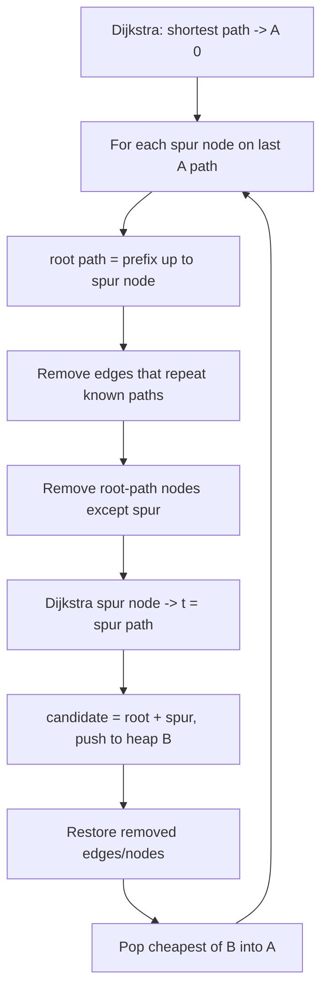
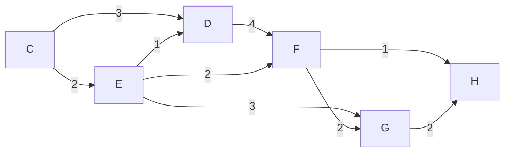

# Yen's Algorithm (K Shortest Loopless Paths) — Junior Level

> **One-line summary:** Yen's algorithm finds the **K shortest *loopless* paths** between two vertices by first running a single shortest-path search (Dijkstra), then repeatedly building the next-best path from a "spur node" on a previously found path — removing edges and nodes that would recreate an earlier answer — while keeping a candidate min-heap `B` and an accepted list `A`. It runs in `O(K · V · (E + V log V))`.

---

## Table of Contents

1. [Introduction](#introduction)
2. [Prerequisites](#prerequisites)
3. [Glossary](#glossary)
4. [Core Concepts](#core-concepts)
5. [Big-O Summary](#big-o-summary)
6. [Real-World Analogies](#real-world-analogies)
7. [Pros & Cons](#pros--cons)
8. [Step-by-Step Walkthrough](#step-by-step-walkthrough)
9. [Code Examples](#code-examples)
10. [Coding Patterns](#coding-patterns)
11. [Error Handling](#error-handling)
12. [Performance Tips](#performance-tips)
13. [Best Practices](#best-practices)
14. [Edge Cases & Pitfalls](#edge-cases--pitfalls)
15. [Common Mistakes](#common-mistakes)
16. [Cheat Sheet](#cheat-sheet)
17. [Visual Animation](#visual-animation)
18. [Summary](#summary)
19. [Further Reading](#further-reading)

---

## Introduction

Most shortest-path algorithms answer one question: *"What is the single cheapest route from `A` to `B`?"* But real applications often need more. A navigation app wants to offer **three alternative routes**, not one. A network engineer wants the **two most reliable paths** so traffic can fail over if the primary link dies. A logistics planner wants the **five cheapest delivery itineraries** to compare. These are all instances of the **K shortest paths (KSP)** problem: *find the `K` cheapest routes from a source `s` to a target `t`, in order from cheapest to most expensive.*

**Yen's algorithm**, published by **Jin Y. Yen in 1971**, is the classic answer when those paths must be **loopless** (also called *simple paths* — no vertex is visited twice). It is built on top of an ordinary shortest-path routine like Dijkstra, and its central idea is surprisingly intuitive:

> The 2nd-best path must *branch off* from the best path somewhere. The 3rd-best must branch off from one of the first two. So: take a path you already accepted, pick a vertex on it (a **spur node**), force the search to leave that path at that vertex by temporarily deleting the edges that would repeat an existing answer, and stitch together the unchanged beginning (the **root path**) with a freshly computed detour (the **spur path**).

Every such stitched path becomes a **candidate**. We keep all candidates in a min-heap `B` (ordered by total cost), and the cheapest candidate that is not already accepted becomes the next answer, moved into the accepted list `A`. Repeat until `A` holds `K` paths.

That is the whole algorithm: **one Dijkstra to seed `A`, then a loop that derives candidates spur-node by spur-node.** This file teaches the *what* and the *how* with a fully worked example. The *why it's correct* and the *when to choose it* live in `middle.md` and beyond.

---

## Prerequisites

Before reading this file you should be comfortable with:

- **Dijkstra's algorithm** — Yen calls it as a subroutine; you must know how to compute one shortest path. (See sibling topic `04-dijkstra`.)
- **Graphs basics** — vertices, directed/undirected edges, edge weights, paths (see `01-representation`).
- **Min-heaps / priority queues** — the candidate set `B` is a min-heap keyed on path cost (see `10-heaps`).
- **The idea of a "loopless" / "simple" path** — a path that never repeats a vertex.
- **Big-O notation** — we will quote `O(K · V · (E + V log V))`.

Optional but helpful:

- Familiarity with **path reconstruction** (recovering the actual vertex sequence, not just the cost).
- Exposure to **set/hash-set membership** (to deduplicate candidate paths).

---

## Glossary

| Term | Meaning |
|------|---------|
| **K shortest paths (KSP)** | The `K` cheapest routes from `s` to `t`, ordered cheapest-first. |
| **Loopless / simple path** | A path that visits no vertex more than once. Yen finds *these*. |
| **`A` (accepted list)** | The paths already confirmed as answers, in order: `A[0]` cheapest, `A[K-1]` most expensive. |
| **`B` (candidate heap)** | A min-heap of *proposed* paths not yet accepted, keyed by total cost. |
| **Spur node** | A vertex on a previously accepted path where the next candidate branches off. |
| **Root path** | The prefix of an accepted path from `s` up to (and including) the spur node — kept fixed. |
| **Spur path** | A freshly computed shortest path from the spur node to `t`, avoiding forbidden edges/nodes. |
| **Total path** | `root path + spur path` concatenated — one candidate. |
| **Relaxation / Dijkstra** | The subroutine that computes each spur path on the temporarily modified graph. |
| **Edge removal** | Temporarily deleting edges so a candidate cannot duplicate an already-found path. |

---

## Core Concepts

### 1. The Two Containers: `A` and `B`

Yen's algorithm is bookkeeping around two collections:

- **`A`** — the **accepted** paths, the answers. It starts with one element: the single shortest path from `s` to `t` (computed by Dijkstra). It grows by one each iteration until it has `K` paths.
- **`B`** — a **min-heap of candidates** (proposed paths). Each iteration generates several candidates, pushes them into `B`, then pops the cheapest one into `A`.

Think of `A` as the "published leaderboard" and `B` as the "waiting room" of contenders sorted by score.

### 2. The Spur Node

To find the `(k+1)`-th shortest path, we examine the most recently accepted path `A[k]`. We try **every possible branch point** along it. Each vertex on `A[k]` (except the last, `t`) is tried as a **spur node** — the place where the new path will *leave* the old one.

```
A[k]:   s ── n1 ── n2 ── n3 ── t
                 ↑
            spur node = n1
        root path = s ── n1
        spur path = a NEW shortest route from n1 to t (that detours away)
```

### 3. The Root Path

For a given spur node, the **root path** is the unchanged prefix: from `s` up to and including the spur node. We keep it fixed — the new candidate shares this beginning with `A[k]`.

### 4. Edge & Node Removal (the clever part)

If we just ran Dijkstra from the spur node to `t`, we would often re-discover a path we already have. To prevent that, before computing the spur path we **temporarily remove**:

- **Edges that would repeat an already-found path.** For every accepted (and current) path `p` whose root path equals our current root path, remove the *one edge* leaving the spur node along `p`. This forces the spur search down a genuinely different first step.
- **The root-path vertices (except the spur node itself).** Removing them guarantees the resulting total path stays **loopless** — the spur path can never wander back into the prefix.

After computing the spur path, we **restore** everything (the removals were temporary, scoped to this one spur node).

### 5. Building and Filtering Candidates

The candidate is `total = root path + spur path`. We push it into `B` **only if** it is a valid path (a spur path actually exists) and **not already** in `A` or `B` (deduplicate). Then the cheapest candidate in `B` becomes the next accepted path.



---

## Big-O Summary

| Aspect | Complexity | Notes |
|--------|------------|-------|
| Total time | **O(K · V · (E + V log V))** | `K` accepted paths × up to `V` spur nodes × one Dijkstra each. |
| One Dijkstra (binary heap) | O(E + V log V) | The cost of one spur-path computation. |
| Spur nodes per accepted path | up to O(V) | One per vertex on the path. |
| Space | O(K · V + E) | Store `K` paths (each up to `V` long), heap `B`, and the graph. |
| Candidate heap operations | O(log \|B\|) per push/pop | `B` can grow to `O(K · V)` candidates. |
| Dedup membership check | O(path length) per check | Hash the path or its vertex sequence. |

The dominant cost is **`K · V` Dijkstra runs**. For small `K` (a navigation app showing 3 routes) this is very practical; for large `K` on big graphs, Yen becomes expensive and you consider alternatives (see `middle.md`).

---

## Real-World Analogies

| Concept | Analogy |
|---------|---------|
| K shortest paths | A travel app showing you the cheapest flight *and* the next few cheapest alternatives, ranked by price. |
| The best path `A[0]` | The headline "recommended route" the GPS shows first. |
| Spur node | The intersection where an alternate route peels off from the main route ("at the next exit, take the detour"). |
| Root path | The part of the trip you drive identically no matter which alternative you pick — the shared beginning. |
| Edge removal | A road-closure sign placed *just past* the branch point, forcing you to take a different first turn than every route you already know. |
| Node removal (root) | Barricading the streets you already drove, so you cannot accidentally loop back through them. |
| Candidate heap `B` | A shortlist of proposed detours, sorted by total travel time, waiting to be promoted. |
| Loopless requirement | A rule that you may never drive through the same intersection twice on a single trip. |

Where the analogy breaks: a real GPS may *allow* a small backtrack and uses heuristics; Yen is exact and strictly loopless, and it recomputes a fresh shortest path for every branch point — far more work than a GPS does in practice.

---

## Pros & Cons

| Pros | Cons |
|------|------|
| Finds **exact** K shortest *loopless* paths, in order. | `O(K · V)` Dijkstra runs — slow for large `K` or `V`. |
| Built on Dijkstra — easy to implement if you have Dijkstra. | Each spur path needs a *modified* graph (edge/node removal). |
| Handles non-negative weights cleanly. | Bookkeeping for removal/restore is error-prone. |
| Produces *simple* paths (no repeated vertices) — exactly what routing wants. | If loops are *allowed*, Eppstein's algorithm is far faster. |
| Naturally yields ranked alternatives for failover/diversity. | Candidate set `B` can grow large; needs dedup. |
| Deterministic and well-understood since 1971. | No early shortcut: must materialize each path fully. |

**When to use:** you need a *small* number `K` of *loopless* (simple) alternative routes, on a graph with non-negative weights, and exactness matters (routing, failover, k-best alternatives).

**When NOT to use:** loops are allowed (use **Eppstein's algorithm**, near-linear in `K`), `K` is huge, the graph is enormous, or you only need the single shortest path (use plain Dijkstra).

---

## Step-by-Step Walkthrough

Consider this small directed graph. We want the **3 shortest loopless paths** from `C` to `H`.

```
edges (directed, with weights):
  C→D 3,  C→E 2,
  D→F 4,  E→D 1,  E→F 2,  E→G 3,
  F→G 2,  F→H 1,
  G→H 2,
  D→F is the only way D reaches F
```

Drawn:



### Step 0 — Seed `A` with Dijkstra

Run Dijkstra from `C` to `H`. The cheapest route:

```
C → E → F → H     cost = 2 + 2 + 1 = 5
A = [ (C,E,F,H : 5) ]
B = [ ]
```

### Step 1 — Find the 2nd path: spur nodes along `A[0] = C,E,F,H`

We try each vertex (except `H`) as a spur node. The root path is the prefix up to that node.

**Spur node `C`** (root path = `C`):
- Remove edges that repeat a known path with this same root: from `A[0]`, the edge leaving `C` is `C→E`. Remove it.
- Remove root-path nodes except `C`: none besides `C` itself.
- Dijkstra `C → H` on the modified graph: cheapest is `C → D → F → H = 3 + 4 + 1 = 8`.
- Candidate: `C,D,F,H : 8`. Push to `B`.

**Spur node `E`** (root path = `C,E`):
- Known paths sharing root `C,E`: `A[0]` leaves `E` via `E→F`. Remove `E→F`.
- Remove root-path nodes except spur `E`: remove `C`.
- Dijkstra `E → H` (no `C`, no edge `E→F`): options from `E` are `E→D (1)` and `E→G (3)`.
  - `E → D → F → H = 1 + 4 + 1 = 6`, plus root `C→E (2)` ⇒ total `8`.
  - `E → G → H = 3 + 2 = 5`, plus root `2` ⇒ total `7`.
  - Cheapest spur path: `E → G → H = 5`. Candidate total: `C,E,G,H : 7`. Push to `B`.

**Spur node `F`** (root path = `C,E,F`):
- Known paths sharing root `C,E,F`: `A[0]` leaves `F` via `F→H`. Remove `F→H`.
- Remove root nodes except `F`: remove `C`, `E`.
- Dijkstra `F → H` without `F→H`: `F → G → H = 2 + 2 = 4`, plus root `C→E→F = 4` ⇒ total `8`.
- Candidate: `C,E,F,G,H : 8`. Push to `B`.

Now:

```
B = [ (C,E,G,H : 7),  (C,D,F,H : 8),  (C,E,F,G,H : 8) ]
```

Pop the cheapest: `C,E,G,H : 7` → becomes `A[1]`.

```
A = [ (C,E,F,H : 5),  (C,E,G,H : 7) ]
B = [ (C,D,F,H : 8),  (C,E,F,G,H : 8) ]
```

### Step 2 — Find the 3rd path: spur nodes along `A[1] = C,E,G,H`

**Spur node `C`** (root = `C`):
- Now *two* accepted paths share root `C`: `A[0]` and `A[1]` both leave `C` via `C→E`. Remove `C→E` (only that one edge — it covers both).
- Dijkstra `C → H` without `C→E`: `C → D → F → H = 8`. But `C,D,F,H : 8` is **already in `B`** — skip the duplicate.

**Spur node `E`** (root = `C,E`):
- Paths sharing root `C,E`: `A[0]` leaves `E` via `E→F`; `A[1]` leaves `E` via `E→G`. Remove **both** `E→F` and `E→G`.
- Remove root nodes except `E`: remove `C`.
- Dijkstra `E → H` with only `E→D` left: `E → D → F → H = 1 + 4 + 1 = 6`, plus root `2` ⇒ total `8`.
- Candidate: `C,E,D,F,H : 8`. Push to `B`.

**Spur node `G`** (root = `C,E,G`):
- `A[1]` leaves `G` via `G→H`. Remove `G→H`.
- Remove root nodes except `G`: remove `C`, `E`.
- Dijkstra `G → H` without `G→H`: `G` has no other edge to `H` → **no spur path**. Skip.

Now:

```
B = [ (C,D,F,H : 8),  (C,E,F,G,H : 8),  (C,E,D,F,H : 8) ]
```

Pop the cheapest (ties broken arbitrarily, say by insertion order): `C,D,F,H : 8` → `A[2]`.

```
A = [ (C,E,F,H : 5),  (C,E,G,H : 7),  (C,D,F,H : 8) ]
```

We have `K = 3` paths. **Done.** The three shortest loopless paths are:

| Rank | Path | Cost |
|------|------|------|
| 1 | C → E → F → H | 5 |
| 2 | C → E → G → H | 7 |
| 3 | C → D → F → H | 8 |

Notice the key behaviors: a candidate that ties an existing path's cost is fine; duplicates are filtered before entering `B`; and a spur node with no valid detour simply contributes nothing.

---

## Code Examples

### Example: Yen's K Shortest Loopless Paths

We implement Yen on top of a Dijkstra that accepts *removed* edges and nodes. Paths are stored as vertex lists; costs are summed edge weights.

#### Go

```go
package main

import (
	"container/heap"
	"fmt"
	"strings"
)

type Graph map[string]map[string]int // u -> v -> weight

type Path struct {
	Nodes []string
	Cost  int
}

// --- min-heap of candidate paths (set B) ---
type PathHeap []Path

func (h PathHeap) Len() int            { return len(h) }
func (h PathHeap) Less(i, j int) bool  { return h[i].Cost < h[j].Cost }
func (h PathHeap) Swap(i, j int)       { h[i], h[j] = h[j], h[i] }
func (h *PathHeap) Push(x interface{}) { *h = append(*h, x.(Path)) }
func (h *PathHeap) Pop() interface{} {
	old := *h
	n := len(old)
	p := old[n-1]
	*h = old[:n-1]
	return p
}

// dijkstra returns the shortest path src->dst avoiding removedEdges and removedNodes.
func dijkstra(g Graph, src, dst string,
	removedEdges map[string]map[string]bool, removedNodes map[string]bool) (Path, bool) {

	const INF = 1 << 60
	dist := map[string]int{src: 0}
	prev := map[string]string{}
	// simple O(V^2) selection is fine for clarity; use a heap in production
	visited := map[string]bool{}
	for {
		// pick unvisited node with smallest dist
		u, best := "", INF
		for node, d := range dist {
			if !visited[node] && d < best {
				u, best = node, d
			}
		}
		if u == "" {
			break
		}
		if u == dst {
			break
		}
		visited[u] = true
		for v, w := range g[u] {
			if removedNodes[v] {
				continue
			}
			if removedEdges[u] != nil && removedEdges[u][v] {
				continue
			}
			if nd := dist[u] + w; nd < get(dist, v, INF) {
				dist[v] = nd
				prev[v] = u
			}
		}
	}
	if _, ok := dist[dst]; !ok {
		return Path{}, false
	}
	// reconstruct
	nodes := []string{}
	for at := dst; at != ""; at = prev[at] {
		nodes = append([]string{at}, nodes...)
		if at == src {
			break
		}
	}
	if nodes[0] != src {
		return Path{}, false
	}
	return Path{Nodes: nodes, Cost: dist[dst]}, true
}

func get(m map[string]int, k string, def int) int {
	if v, ok := m[k]; ok {
		return v
	}
	return def
}

func key(p []string) string { return strings.Join(p, ",") }

// YenKSP returns up to k shortest loopless paths from src to dst.
func YenKSP(g Graph, src, dst string, k int) []Path {
	first, ok := dijkstra(g, src, dst, nil, nil)
	if !ok {
		return nil
	}
	A := []Path{first}
	B := &PathHeap{}
	heap.Init(B)
	inB := map[string]bool{} // dedup candidates

	for len(A) < k {
		last := A[len(A)-1].Nodes
		for i := 0; i < len(last)-1; i++ {
			spur := last[i]
			root := last[:i+1]
			rootCost := pathCost(g, root)

			removedEdges := map[string]map[string]bool{}
			// remove the edge leaving the spur node along every path sharing this root
			for _, p := range A {
				if len(p.Nodes) > i && key(p.Nodes[:i+1]) == key(root) {
					u, v := p.Nodes[i], p.Nodes[i+1]
					if removedEdges[u] == nil {
						removedEdges[u] = map[string]bool{}
					}
					removedEdges[u][v] = true
				}
			}
			// remove root nodes except the spur node (keeps the result loopless)
			removedNodes := map[string]bool{}
			for _, n := range root[:len(root)-1] {
				removedNodes[n] = true
			}

			spurPath, ok := dijkstra(g, spur, dst, removedEdges, removedNodes)
			if !ok {
				continue
			}
			total := append(append([]string{}, root[:len(root)-1]...), spurPath.Nodes...)
			cand := Path{Nodes: total, Cost: rootCost + spurPath.Cost}
			if !inB[key(total)] && !inA(A, total) {
				heap.Push(B, cand)
				inB[key(total)] = true
			}
		}
		if B.Len() == 0 {
			break // no more paths
		}
		next := heap.Pop(B).(Path)
		A = append(A, next)
	}
	return A
}

func pathCost(g Graph, nodes []string) int {
	c := 0
	for i := 0; i+1 < len(nodes); i++ {
		c += g[nodes[i]][nodes[i+1]]
	}
	return c
}

func inA(A []Path, nodes []string) bool {
	for _, p := range A {
		if key(p.Nodes) == key(nodes) {
			return true
		}
	}
	return false
}

func main() {
	g := Graph{
		"C": {"D": 3, "E": 2},
		"D": {"F": 4},
		"E": {"D": 1, "F": 2, "G": 3},
		"F": {"G": 2, "H": 1},
		"G": {"H": 2},
	}
	for i, p := range YenKSP(g, "C", "H", 3) {
		fmt.Printf("%d: %v cost=%d\n", i+1, p.Nodes, p.Cost)
	}
}
```

#### Java

```java
import java.util.*;

public class Yen {

    static class Path {
        List<String> nodes;
        int cost;
        Path(List<String> nodes, int cost) { this.nodes = nodes; this.cost = cost; }
        String key() { return String.join(",", nodes); }
    }

    // graph: u -> (v -> weight)
    static Path dijkstra(Map<String, Map<String, Integer>> g, String src, String dst,
                         Set<String> removedEdges, Set<String> removedNodes) {
        final int INF = Integer.MAX_VALUE / 4;
        Map<String, Integer> dist = new HashMap<>();
        Map<String, String> prev = new HashMap<>();
        PriorityQueue<String> pq = new PriorityQueue<>(Comparator.comparingInt(
                n -> dist.getOrDefault(n, INF)));
        dist.put(src, 0);
        pq.add(src);
        Set<String> done = new HashSet<>();
        while (!pq.isEmpty()) {
            String u = pq.poll();
            if (done.contains(u)) continue;
            done.add(u);
            if (u.equals(dst)) break;
            Map<String, Integer> adj = g.getOrDefault(u, Map.of());
            for (Map.Entry<String, Integer> e : adj.entrySet()) {
                String v = e.getKey();
                if (removedNodes.contains(v)) continue;
                if (removedEdges.contains(u + "->" + v)) continue;
                int nd = dist.get(u) + e.getValue();
                if (nd < dist.getOrDefault(v, INF)) {
                    dist.put(v, nd);
                    prev.put(v, u);
                    pq.add(v);
                }
            }
        }
        if (!dist.containsKey(dst)) return null;
        LinkedList<String> nodes = new LinkedList<>();
        String at = dst;
        while (at != null) {
            nodes.addFirst(at);
            if (at.equals(src)) break;
            at = prev.get(at);
        }
        if (!nodes.getFirst().equals(src)) return null;
        return new Path(nodes, dist.get(dst));
    }

    static int pathCost(Map<String, Map<String, Integer>> g, List<String> nodes) {
        int c = 0;
        for (int i = 0; i + 1 < nodes.size(); i++)
            c += g.get(nodes.get(i)).get(nodes.get(i + 1));
        return c;
    }

    static List<Path> yen(Map<String, Map<String, Integer>> g, String src, String dst, int k) {
        Path first = dijkstra(g, src, dst, Set.of(), Set.of());
        if (first == null) return List.of();
        List<Path> A = new ArrayList<>();
        A.add(first);
        PriorityQueue<Path> B = new PriorityQueue<>(Comparator.comparingInt(p -> p.cost));
        Set<String> inB = new HashSet<>();

        while (A.size() < k) {
            List<String> last = A.get(A.size() - 1).nodes;
            for (int i = 0; i < last.size() - 1; i++) {
                String spur = last.get(i);
                List<String> root = new ArrayList<>(last.subList(0, i + 1));
                int rootCost = pathCost(g, root);

                Set<String> removedEdges = new HashSet<>();
                for (Path p : A) {
                    if (p.nodes.size() > i
                            && p.nodes.subList(0, i + 1).equals(root)) {
                        removedEdges.add(p.nodes.get(i) + "->" + p.nodes.get(i + 1));
                    }
                }
                Set<String> removedNodes = new HashSet<>(root.subList(0, root.size() - 1));

                Path spurPath = dijkstra(g, spur, dst, removedEdges, removedNodes);
                if (spurPath == null) continue;

                List<String> total = new ArrayList<>(root.subList(0, root.size() - 1));
                total.addAll(spurPath.nodes);
                String key = String.join(",", total);
                boolean inA = A.stream().anyMatch(p -> p.key().equals(key));
                if (!inB.contains(key) && !inA) {
                    B.add(new Path(total, rootCost + spurPath.cost));
                    inB.add(key);
                }
            }
            if (B.isEmpty()) break;
            A.add(B.poll());
        }
        return A;
    }

    public static void main(String[] args) {
        Map<String, Map<String, Integer>> g = new HashMap<>();
        g.put("C", Map.of("D", 3, "E", 2));
        g.put("D", Map.of("F", 4));
        g.put("E", Map.of("D", 1, "F", 2, "G", 3));
        g.put("F", Map.of("G", 2, "H", 1));
        g.put("G", Map.of("H", 2));
        int rank = 1;
        for (Path p : yen(g, "C", "H", 3))
            System.out.println((rank++) + ": " + p.nodes + " cost=" + p.cost);
    }
}
```

#### Python

```python
import heapq


def dijkstra(g, src, dst, removed_edges=frozenset(), removed_nodes=frozenset()):
    """Shortest src->dst path avoiding removed edges/nodes. Returns (nodes, cost) or None."""
    INF = float("inf")
    dist = {src: 0}
    prev = {}
    pq = [(0, src)]
    done = set()
    while pq:
        d, u = heapq.heappop(pq)
        if u in done:
            continue
        done.add(u)
        if u == dst:
            break
        for v, w in g.get(u, {}).items():
            if v in removed_nodes:
                continue
            if (u, v) in removed_edges:
                continue
            nd = d + w
            if nd < dist.get(v, INF):
                dist[v] = nd
                prev[v] = u
                heapq.heappush(pq, (nd, v))
    if dst not in dist:
        return None
    nodes = [dst]
    while nodes[-1] != src:
        nodes.append(prev[nodes[-1]])
    nodes.reverse()
    return nodes, dist[dst]


def path_cost(g, nodes):
    return sum(g[nodes[i]][nodes[i + 1]] for i in range(len(nodes) - 1))


def yen_ksp(g, src, dst, k):
    first = dijkstra(g, src, dst)
    if first is None:
        return []
    A = [first]               # accepted paths: list of (nodes, cost)
    B = []                    # candidate min-heap: (cost, nodes_tuple)
    in_b = set()

    while len(A) < k:
        last = A[-1][0]
        for i in range(len(last) - 1):
            spur = last[i]
            root = last[: i + 1]
            root_cost = path_cost(g, root)

            removed_edges = set()
            for nodes, _ in A:
                if len(nodes) > i and nodes[: i + 1] == root:
                    removed_edges.add((nodes[i], nodes[i + 1]))
            removed_nodes = set(root[:-1])  # all root nodes except the spur

            spur_path = dijkstra(g, spur, dst, frozenset(removed_edges),
                                 frozenset(removed_nodes))
            if spur_path is None:
                continue
            total = root[:-1] + spur_path[0]
            cost = root_cost + spur_path[1]
            tkey = tuple(total)
            if tkey not in in_b and not any(tuple(p[0]) == tkey for p in A):
                heapq.heappush(B, (cost, total))
                in_b.add(tkey)

        if not B:
            break
        cost, nodes = heapq.heappop(B)
        A.append((nodes, cost))
    return A


if __name__ == "__main__":
    g = {
        "C": {"D": 3, "E": 2},
        "D": {"F": 4},
        "E": {"D": 1, "F": 2, "G": 3},
        "F": {"G": 2, "H": 1},
        "G": {"H": 2},
    }
    for i, (nodes, cost) in enumerate(yen_ksp(g, "C", "H", 3), 1):
        print(f"{i}: {nodes} cost={cost}")
```

**What it does:** seeds `A` with one Dijkstra, then for each spur node removes repeating edges and root nodes, computes a spur path, builds candidates into heap `B`, and promotes the cheapest. Output for all three: the table from the walkthrough.
**Run:** `go run main.go` | `javac Yen.java && java Yen` | `python yen.py`

---

## Coding Patterns

### Pattern 1: Seed-then-Extend

**Intent:** Start with one exact answer, then *derive* the rest from already-found answers.

```python
A = [dijkstra(g, s, t)]      # seed
while len(A) < k:
    generate_candidates_from(A[-1])  # extend
    A.append(cheapest_candidate())
```

### Pattern 2: Temporary Graph Mutation (remove → compute → restore)

**Intent:** Forbid certain edges/nodes for *one* subcomputation, then undo.

```python
removed_edges, removed_nodes = compute_removals(root, A)
spur = dijkstra(g, spur_node, t, removed_edges, removed_nodes)
# removals are passed as arguments, so nothing to "undo" — graph untouched
```

> Passing removals as *parameters* (rather than mutating the graph) is the cleanest way to keep remove/restore correct.

### Pattern 3: Dedup via Path Key

**Intent:** Never push the same path into `B` twice.

```python
key = tuple(total_path)
if key not in in_b and key not in {tuple(p) for p in A}:
    heapq.heappush(B, (cost, total_path)); in_b.add(key)
```

---

## Error Handling

| Error | Cause | Fix |
|-------|-------|-----|
| Loop in a result path | Forgot to remove root-path nodes (except spur). | Always remove `root[:-1]` from the spur search. |
| Duplicate paths in `A` | No dedup before pushing into `B`. | Track a `seen` set of path keys for both `A` and `B`. |
| Re-found the same answer | Removed the wrong edge, or only checked `A[-1]` instead of *all* paths sharing the root. | Remove the spur-leaving edge for **every** path whose root matches. |
| Spur path missing | Removal disconnected `spur` from `t`. | Treat "no spur path" as "skip this spur node", not an error. |
| Wrong total cost | Summed root and spur cost incorrectly or double-counted the spur node. | `total = root[:-1] + spur_path`; cost = `rootCost + spurCost`. |
| Heap returns stale path | Pushed a candidate already accepted later. | Re-check membership when popping, or dedup on push. |

---

## Performance Tips

- **Use a real binary-heap Dijkstra** for spur paths — the junior Go example uses an `O(V²)` selection loop for clarity; switch to `container/heap` in production.
- **Pass removals as parameters**, not by mutating and restoring the global graph — it avoids restore bugs and is cache-friendlier.
- **Hash whole paths** (e.g. a joined string or tuple) for `O(1)` dedup instead of comparing node-by-node.
- **Stop early** once `A` has `K` paths or `B` empties; never compute spur nodes you don't need.
- **Reuse the root cost**: the prefix cost is constant for a given spur node — compute it once.
- **Bound `B`**: if you only need `K` paths, you never need more than `~K·V` candidates; you may prune the heap.

---

## Best Practices

- Store each path as both a **vertex list** and a **cost**; you almost always need to reconstruct the route, not just its length.
- Keep the Dijkstra subroutine **pure** (no global mutation): give it `removedEdges` and `removedNodes` as arguments.
- Deduplicate candidates **on push**, using a set of path keys, to keep `B` clean.
- Treat "no spur path found" as a normal, skippable case — many spur nodes are dead ends.
- Confirm your input weights are **non-negative** (Yen relies on Dijkstra); if negative edges exist, you need a different shortest-path subroutine.
- Write the worked example from this file as your first unit test — it exercises ties, duplicates, and dead-end spurs.

---

## Edge Cases & Pitfalls

- **`K` larger than the number of simple paths** — Yen returns *all* of them and stops; don't loop forever expecting `K`.
- **Disconnected `s` and `t`** — even the first Dijkstra fails; return an empty result.
- **Ties in cost** — multiple candidates with equal cost are valid; pick any consistent tie-break (insertion order is fine).
- **Self-loops / parallel edges** — keep the minimum-weight parallel edge; self-loops are irrelevant to simple paths.
- **Single-vertex "path"** (`s == t`) — define behavior explicitly; usually the trivial zero-cost path.
- **Forgetting that removals are per-spur-node** — they must be scoped to one spur computation, never leak to the next.

---

## Common Mistakes

1. **Not removing root nodes** — produces paths with loops, violating the whole point of *loopless* KSP.
2. **Only removing the edge from `A[-1]`** — you must remove the spur-leaving edge from *every* path that shares the current root, or you re-discover old answers.
3. **No dedup** — the same candidate gets pushed many times; `B` bloats and you accept duplicates.
4. **Mutating the graph and forgetting to restore** — later spur computations see a corrupted graph.
5. **Using Yen when loops are allowed** — Eppstein's algorithm is dramatically faster; Yen is overkill.
6. **Off-by-one in the spur range** — the last vertex (`t`) is never a spur node; iterate indices `0 .. len-2`.

---

## Cheat Sheet

| Item | Value |
|------|-------|
| Problem | K shortest **loopless** paths, `s → t`, ranked |
| Time | O(K · V · (E + V log V)) |
| Space | O(K · V + E) |
| Subroutine | Dijkstra (non-negative weights) |
| Containers | `A` accepted list, `B` candidate min-heap |
| Spur node | every vertex of `A[-1]` except `t` |
| Root path | prefix `s … spur` (kept fixed) |
| Remove (edges) | spur-leaving edge of every path sharing the root |
| Remove (nodes) | all root nodes except the spur (keeps it loopless) |
| If loops allowed | use **Eppstein**, not Yen |

Core loop in words:

```
A = [ shortest path ]
while |A| < K:
    for each spur node on A[-1]:
        root = prefix up to spur
        remove repeating edges + root nodes
        spur = dijkstra(spur -> t) on modified graph
        push (root + spur) into B  (if new)
    move cheapest of B into A
```

---

## Visual Animation

> See [`animation.html`](./animation.html) for an interactive visual animation of Yen's algorithm.
>
> The animation demonstrates:
> - The seed shortest path (Dijkstra) entering `A`
> - Each spur node being selected along the latest accepted path
> - Edges and root nodes being removed (highlighted in red)
> - The spur path computed on the modified graph (highlighted)
> - Candidates entering the heap `B` and the cheapest promoted into `A`
> - The growing `A` (accepted) and `B` (candidate) sets side by side
> - Step / Run / Reset controls and an operation log

---

## Summary

Yen's algorithm answers the *K shortest loopless paths* question by bootstrapping off Dijkstra. It seeds the accepted list `A` with the single shortest path, then repeatedly derives candidates: pick a **spur node** on the last accepted path, keep the **root path** prefix fixed, **remove** the edges that would repeat known answers and the root nodes that would create loops, compute a **spur path** from the spur node to `t`, and stitch them into a candidate pushed onto the heap `B`. The cheapest candidate becomes the next accepted path; repeat until `A` has `K` paths. It costs `O(K · V · (E + V log V))` — fine for small `K` of simple alternative routes, but if loops are *allowed*, reach for **Eppstein's algorithm** instead. Master the remove-then-restore bookkeeping and the dedup, and you have mastered Yen.

---

## Further Reading

- Jin Y. Yen, *Finding the K Shortest Loopless Paths in a Network*, Management Science 17(11):712–716, 1971 — the original paper.
- *Introduction to Algorithms* (CLRS) — Chapter 24 (single-source shortest paths) for the Dijkstra subroutine.
- David Eppstein, *Finding the k Shortest Paths*, SIAM J. Computing 28(2):652–673, 1998 — the loops-allowed alternative.
- cp-algorithms.com — "Dijkstra" and k-shortest-path notes.
- Sibling topics: `04-dijkstra` (the subroutine), `10-heaps` (the candidate heap), `01-representation`.
- Wikipedia — "Yen's algorithm" interactive pseudocode and worked example.

---

**Next step:** Continue to [`middle.md`](./middle.md) to learn *why* Yen is correct, *when* to choose it over Dijkstra-only and Eppstein, and how to manage the candidate set efficiently.
