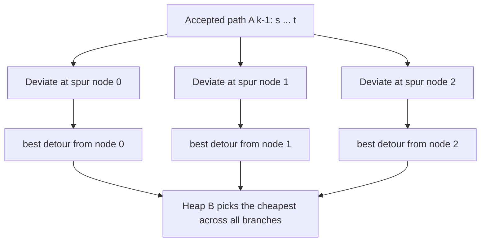
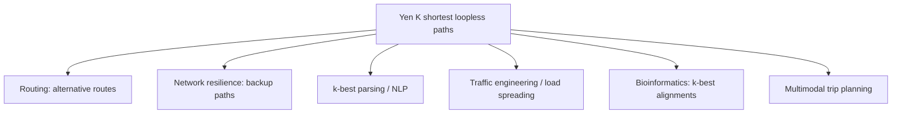

# Yen's Algorithm (K Shortest Loopless Paths) — Middle Level

> **Focus:** Why Yen produces the K shortest *loopless* paths in nondecreasing order, when to choose it over plain Dijkstra or Eppstein's algorithm, how the spur/root decomposition partitions the path space without missing or duplicating answers, and how to manage the candidate heap `B` efficiently.

---

## Table of Contents

1. [Introduction](#introduction)
2. [Deeper Concepts](#deeper-concepts)
3. [Comparison with Alternatives](#comparison-with-alternatives)
4. [Advanced Patterns](#advanced-patterns)
5. [Graph and Tree Applications](#graph-and-tree-applications)
6. [Algorithmic Integration](#algorithmic-integration)
7. [Code Examples](#code-examples)
8. [Error Handling](#error-handling)
9. [Performance Analysis](#performance-analysis)
10. [Best Practices](#best-practices)
11. [Visual Animation](#visual-animation)
12. [Summary](#summary)

---

## Introduction

At junior level Yen's algorithm is "seed with Dijkstra, then derive candidates from spur nodes." At middle level you start asking the *engineering* and *correctness* questions:

- *Why* does branching at every spur node, with those exact removals, enumerate the K shortest loopless paths and miss none?
- *Why* are they produced in **nondecreasing cost order** (so popping the heap gives the right next answer)?
- *Why* must we remove the spur-leaving edge of **every** path sharing the root — not just the last one?
- *When* does Yen win, and when should you reach for **Eppstein's algorithm** (loops allowed) or **Lawler/Hoffman-Pavley** variants?
- *How* do you keep the candidate heap `B` small and duplicate-free as `K` grows?

These distinctions decide whether you ship a correct, efficient k-best router or one that silently drops valid alternatives, re-emits duplicates, or times out.

---

## Deeper Concepts

### The partition idea — branching covers every path exactly once

Yen's correctness rests on a clean **partition of the path space**. Suppose we have already accepted the first `k` paths `A[0..k-1]`. Consider *any* loopless `s→t` path `P` that is not among them. `P` and the most recently accepted path `A[k-1]` share a common prefix from `s` (at minimum, both start at `s`). Let the **deviation point** be the first vertex where `P` leaves `A[k-1]`.

That deviation point is exactly a **spur node**, and the prefix up to it is exactly the **root path**. So *every* not-yet-found path deviates from some accepted path at some spur node. By trying **every spur node on the latest accepted path** and computing the best detour at each, Yen generates the best representative of each "branching class." The heap then selects globally the cheapest across all classes.



### Why remove the spur-leaving edge of *every* matching path

For a fixed root path, **multiple** already-found paths may share that exact prefix. If we only blocked the edge taken by `A[k-1]`, the spur Dijkstra could re-find a path identical to some *earlier* `A[j]` that also branched here — a duplicate. So the rule is:

> For the current root path, find **all** paths in `A` (and the candidate that produced the root) whose prefix equals the root, and remove the edge each of them takes *out of the spur node*.

This guarantees the spur path's first edge differs from every known path that shares this root — the detour is genuinely new at the deviation point.

### Why remove the root nodes (looplessness)

The spur path runs from the spur node to `t`. If it were allowed to revisit a vertex already in the root prefix, the concatenated total path would contain that vertex twice — a **loop**. Removing all root vertices *except the spur node* from the spur search forbids that, guaranteeing the result is **simple (loopless)**. This is the single feature that distinguishes Yen from the much faster loops-allowed algorithms.

### Why the output is in nondecreasing order

Each accepted path is popped from `B` as the **minimum-cost** candidate currently available. The crucial invariant is:

> Every loopless path not yet in `A` is *represented* in `B` by a candidate whose cost is **≤** that path's cost (in fact equal, for the cheapest unfound path's class).

Because the next true answer's class is already in `B` at its true cost, and we pop the heap minimum, we always pop the correct next-cheapest path. Each newly accepted path can only *add* candidates of cost ≥ its own (a detour off a path costs at least as much as the path), so costs never decrease across accepted paths. The full invariant proof lives in `professional.md`; the practical upshot: **popping the heap minimum is exactly right.**

### Cost accounting

For a candidate with root path `R` (ending at spur node `v`) and spur path `Q` (from `v` to `t`):

```
cost(candidate) = cost(R) + cost(Q)
```

The spur node `v` is shared, so when you concatenate you write `R[:-1] + Q` (don't duplicate `v`), but the cost is still `cost(R) + cost(Q)` because `cost(R)` already stops at `v` and `cost(Q)` starts at `v`.

---

## Comparison with Alternatives

| Attribute | Yen (loopless KSP) | Eppstein (loops allowed) | Repeated Dijkstra (naive) | Lawler / Hoffman-Pavley |
|-----------|--------------------|--------------------------|---------------------------|-------------------------|
| Paths found | K shortest **simple** | K shortest (may repeat vertices) | K shortest simple (inefficient) | K shortest simple (Yen variant) |
| Time | `O(K·V·(E + V log V))` | `O(E + V log V + K)` | much worse than Yen | similar to Yen, fewer redundant Dijkstras |
| Loopless? | **Yes** | No (allows cycles) | Yes | Yes |
| Idea | Spur/root branching + removal | Implicit path graph + heap of sidetracks | Brute-force enumerate | Lazy spur generation |
| Negative edges | No (Dijkstra) | No (uses shortest-path tree) | No | No |
| Code size | Medium | Large/intricate | Small but slow | Medium |
| Best on | Small K, simple routes | Large K, loops OK | never (teaching only) | when avoiding redundant spur work matters |

**Rules of thumb:**

- **Need *simple* paths, small `K`:** Yen. It is the standard, well-understood choice for routing alternatives and failover.
- **Loops are acceptable (or impossible because the graph is a DAG), large `K`:** **Eppstein's algorithm** — near-linear in `K` after one shortest-path-tree build. Dramatically faster when `K` is large.
- **You need only the single best path:** plain Dijkstra; never Yen.
- **You want Yen but with fewer redundant spur computations:** **Lawler's improvement** (and Hoffman-Pavley) avoids regenerating spur nodes already explored for an unchanged root prefix.

Yen trades Eppstein's speed for the *looplessness guarantee*. If your domain forbids repeated nodes (a delivery route can't visit the same depot twice; a circuit path can't revisit a component), Yen is the right tool despite the higher cost.

### Why not "just run Dijkstra K times"?

A tempting wrong idea: run Dijkstra, remove one edge from the result, run again, repeat. This neither enumerates in order nor guarantees simplicity nor avoids missing paths — removing a single edge is far too blunt. Yen's per-spur-node removal is precisely the surgical version of that instinct, made correct.

---

## Advanced Patterns

### Pattern: Lawler's lazy spur generation

In plain Yen, each iteration re-scans **all** spur nodes of the latest accepted path. But many of those spur nodes share a root prefix with spur nodes explored in earlier iterations, doing redundant Dijkstra work. **Lawler's improvement** records, for each accepted path, the spur index at which it deviated, and only generates spur nodes *from that deviation index onward* for paths derived from it. This cuts the number of spur Dijkstra calls substantially on graphs where many paths share long prefixes.

```python
# Each candidate remembers the spur index where it deviated.
# When it becomes accepted, only generate spurs at index >= its deviation index.
cand = (cost, total_nodes, deviation_index)
```

The correctness argument: spur nodes *before* the deviation index were already fully explored when the parent path was processed; re-exploring them only regenerates known candidates (which dedup would discard anyway). Lawler's variant simply skips that wasted work.

### Pattern: Bounded / streaming K

If `K` is not known up front (a UI loads "more routes" on demand), structure Yen as a **generator**: yield each accepted path as it is popped, keep `A`, `B`, and the removal bookkeeping as persistent state, and resume on the next request. The algorithm is naturally incremental — nothing about it requires knowing `K` in advance.

### Pattern: Cost-bounded KSP

Instead of "K paths," some applications want "all loopless paths within `c` of the optimum." Run Yen but **stop when the heap minimum exceeds `cost(A[0]) + c`**. Because output is nondecreasing, once a popped (or peeked) candidate breaks the threshold, no later one can satisfy it.

### Pattern: Diversity-aware selection

Raw KSP often returns paths that are near-duplicates (they share most edges). For *diverse* alternatives, post-filter: accept a candidate only if its **edge overlap** (Jaccard distance) with already-accepted paths is below a threshold. This is a greedy heuristic layered on Yen's exact ranking — common in routing UIs that want genuinely different options, not three variations of the same road.

```python
def jaccard_overlap(p, q):
    ep = set(zip(p, p[1:]))
    eq = set(zip(q, q[1:]))
    return len(ep & eq) / max(1, len(ep | eq))
```

---

## Graph and Tree Applications



- **Alternative route planning** — show the driver the top 2–3 distinct routes. Looplessness matters: a real route never drives through the same junction twice.
- **Network resilience / failover** — precompute the primary and a few backup paths so traffic reroutes instantly when a link fails. The backups should be *node-disjoint* where possible; Yen + a disjointness filter approximates this.
- **Traffic engineering** — spread load across the top `K` cheapest paths rather than overloading the single best.
- **k-best parsing and decoding** — in NLP and speech, the "graph" is a lattice and KSP yields the `K` most likely parses/transcriptions (often with loops disallowed by construction).
- **Bioinformatics** — k-best sequence alignments correspond to k shortest paths in an alignment graph.

Because Yen treats Dijkstra as a black box, it inherits Dijkstra's restriction to **non-negative weights**. For lattices with log-probabilities (which are non-negative as `-log p`), this is automatic.

---

## Algorithmic Integration

Yen sits in a family of **k-best** algorithms and composes with several other techniques:

- **As a layer over any single-source shortest path.** Swap Dijkstra for A\* (with an admissible heuristic) to speed each spur computation on geometric/road graphs — Yen's structure is unchanged.
- **With contraction hierarchies / ALT preprocessing.** On road networks, replacing the inner Dijkstra with a CH query makes each spur path near-instant, pushing Yen to interactive speeds for small `K`.
- **As a subroutine in constrained routing.** "K shortest paths avoiding tolls / with a charging stop" run Yen on a transformed graph encoding the constraint.

```python
# Yen with a pluggable shortest-path oracle (Dijkstra, A*, CH, ...)
def yen_generic(shortest_path, s, t, k):
    first = shortest_path(s, t, removed_edges=set(), removed_nodes=set())
    A, B, seen = [first], [], set()
    # ... identical spur/root loop, calling shortest_path(...) per spur ...
    return A
```

This pluggability is why Yen endures: the *combinatorial scaffolding* (spur/root/removal/heap) is independent of *how* you compute each shortest path.

---

## Code Examples

### Yen with Lawler's lazy spur generation (deviation index)

This version stores a **deviation index** with each accepted path and skips redundant spur nodes — the standard production optimization.

#### Go

```go
package main

import (
	"container/heap"
	"fmt"
	"strings"
)

type Graph map[string]map[string]int

type Cand struct {
	Cost   int
	Nodes  []string
	DevIdx int // index of the spur node where this path deviated
}

type CandHeap []Cand

func (h CandHeap) Len() int            { return len(h) }
func (h CandHeap) Less(i, j int) bool  { return h[i].Cost < h[j].Cost }
func (h CandHeap) Swap(i, j int)       { h[i], h[j] = h[j], h[i] }
func (h *CandHeap) Push(x interface{}) { *h = append(*h, x.(Cand)) }
func (h *CandHeap) Pop() interface{} {
	old := *h
	n := len(old)
	c := old[n-1]
	*h = old[:n-1]
	return c
}

func dijkstra(g Graph, s, t string, remE map[[2]string]bool, remN map[string]bool) ([]string, int, bool) {
	const INF = 1 << 60
	dist := map[string]int{s: 0}
	prev := map[string]string{}
	type item struct {
		d int
		n string
	}
	pq := &CandHeapInt{{0, s}}
	heap.Init(pq)
	done := map[string]bool{}
	for pq.Len() > 0 {
		it := heap.Pop(pq).(itemInt)
		u := it.n
		if done[u] {
			continue
		}
		done[u] = true
		if u == t {
			break
		}
		for v, w := range g[u] {
			if remN[v] || remE[[2]string{u, v}] {
				continue
			}
			nd := it.d + w
			if old, ok := dist[v]; !ok || nd < old {
				dist[v] = nd
				prev[v] = u
				heap.Push(pq, itemInt{nd, v})
			}
		}
	}
	if _, ok := dist[t]; !ok {
		return nil, 0, false
	}
	path := []string{}
	for at := t; ; at = prev[at] {
		path = append([]string{at}, path...)
		if at == s {
			break
		}
	}
	return path, dist[t], true
}

// minimal int-keyed heap for Dijkstra
type itemInt struct {
	d int
	n string
}
type CandHeapInt []itemInt

func (h CandHeapInt) Len() int            { return len(h) }
func (h CandHeapInt) Less(i, j int) bool  { return h[i].d < h[j].d }
func (h CandHeapInt) Swap(i, j int)       { h[i], h[j] = h[j], h[i] }
func (h *CandHeapInt) Push(x interface{}) { *h = append(*h, x.(itemInt)) }
func (h *CandHeapInt) Pop() interface{} {
	old := *h
	n := len(old)
	c := old[n-1]
	*h = old[:n-1]
	return c
}

func key(p []string) string { return strings.Join(p, ",") }

func cost(g Graph, p []string) int {
	c := 0
	for i := 0; i+1 < len(p); i++ {
		c += g[p[i]][p[i+1]]
	}
	return c
}

func Yen(g Graph, s, t string, k int) []Cand {
	p0, c0, ok := dijkstra(g, s, t, nil, nil)
	if !ok {
		return nil
	}
	A := []Cand{{c0, p0, 0}}
	B := &CandHeap{}
	heap.Init(B)
	seen := map[string]bool{key(p0): true}

	for len(A) < k {
		prev := A[len(A)-1]
		// Lawler: start spurs from the deviation index of the latest path
		for i := prev.DevIdx; i < len(prev.Nodes)-1; i++ {
			spur := prev.Nodes[i]
			root := prev.Nodes[:i+1]
			remE := map[[2]string]bool{}
			for _, p := range A {
				if len(p.Nodes) > i && key(p.Nodes[:i+1]) == key(root) {
					remE[[2]string{p.Nodes[i], p.Nodes[i+1]}] = true
				}
			}
			remN := map[string]bool{}
			for _, n := range root[:len(root)-1] {
				remN[n] = true
			}
			sp, sc, ok := dijkstra(g, spur, t, remE, remN)
			if !ok {
				continue
			}
			total := append(append([]string{}, root[:len(root)-1]...), sp...)
			if seen[key(total)] {
				continue
			}
			seen[key(total)] = true
			heap.Push(B, Cand{cost(g, root) + sc, total, i})
		}
		if B.Len() == 0 {
			break
		}
		A = append(A, heap.Pop(B).(Cand))
	}
	return A
}

func main() {
	g := Graph{
		"C": {"D": 3, "E": 2},
		"D": {"F": 4},
		"E": {"D": 1, "F": 2, "G": 3},
		"F": {"G": 2, "H": 1},
		"G": {"H": 2},
	}
	for i, c := range Yen(g, "C", "H", 3) {
		fmt.Printf("%d: %v cost=%d (dev=%d)\n", i+1, c.Nodes, c.Cost, c.DevIdx)
	}
}
```

#### Java

```java
import java.util.*;

public class YenLawler {
    record Cand(int cost, List<String> nodes, int devIdx) {}

    static Object[] dijkstra(Map<String, Map<String, Integer>> g, String s, String t,
                             Set<List<String>> remE, Set<String> remN) {
        final int INF = Integer.MAX_VALUE / 4;
        Map<String, Integer> dist = new HashMap<>();
        Map<String, String> prev = new HashMap<>();
        PriorityQueue<String> pq = new PriorityQueue<>(
                Comparator.comparingInt(n -> dist.getOrDefault(n, INF)));
        dist.put(s, 0); pq.add(s);
        Set<String> done = new HashSet<>();
        while (!pq.isEmpty()) {
            String u = pq.poll();
            if (!done.add(u)) continue;
            if (u.equals(t)) break;
            for (var e : g.getOrDefault(u, Map.of()).entrySet()) {
                String v = e.getKey();
                if (remN.contains(v) || remE.contains(List.of(u, v))) continue;
                int nd = dist.get(u) + e.getValue();
                if (nd < dist.getOrDefault(v, INF)) {
                    dist.put(v, nd); prev.put(v, u); pq.add(v);
                }
            }
        }
        if (!dist.containsKey(t)) return null;
        LinkedList<String> path = new LinkedList<>();
        for (String at = t; at != null; at = at.equals(s) ? null : prev.get(at))
            path.addFirst(at);
        return new Object[]{path, dist.get(t)};
    }

    static int cost(Map<String, Map<String, Integer>> g, List<String> p) {
        int c = 0;
        for (int i = 0; i + 1 < p.size(); i++) c += g.get(p.get(i)).get(p.get(i + 1));
        return c;
    }

    @SuppressWarnings("unchecked")
    static List<Cand> yen(Map<String, Map<String, Integer>> g, String s, String t, int k) {
        Object[] r0 = dijkstra(g, s, t, Set.of(), Set.of());
        if (r0 == null) return List.of();
        List<Cand> A = new ArrayList<>();
        A.add(new Cand((int) r0[1], (List<String>) r0[0], 0));
        PriorityQueue<Cand> B = new PriorityQueue<>(Comparator.comparingInt(Cand::cost));
        Set<String> seen = new HashSet<>(Set.of(String.join(",", A.get(0).nodes())));

        while (A.size() < k) {
            Cand prev = A.get(A.size() - 1);
            for (int i = prev.devIdx(); i < prev.nodes().size() - 1; i++) {
                String spur = prev.nodes().get(i);
                List<String> root = new ArrayList<>(prev.nodes().subList(0, i + 1));
                Set<List<String>> remE = new HashSet<>();
                for (Cand p : A)
                    if (p.nodes().size() > i && p.nodes().subList(0, i + 1).equals(root))
                        remE.add(List.of(p.nodes().get(i), p.nodes().get(i + 1)));
                Set<String> remN = new HashSet<>(root.subList(0, root.size() - 1));
                Object[] sp = dijkstra(g, spur, t, remE, remN);
                if (sp == null) continue;
                List<String> total = new ArrayList<>(root.subList(0, root.size() - 1));
                total.addAll((List<String>) sp[0]);
                String tk = String.join(",", total);
                if (!seen.add(tk)) continue;
                B.add(new Cand(cost(g, root) + (int) sp[1], total, i));
            }
            if (B.isEmpty()) break;
            A.add(B.poll());
        }
        return A;
    }

    public static void main(String[] args) {
        Map<String, Map<String, Integer>> g = new HashMap<>();
        g.put("C", Map.of("D", 3, "E", 2));
        g.put("D", Map.of("F", 4));
        g.put("E", Map.of("D", 1, "F", 2, "G", 3));
        g.put("F", Map.of("G", 2, "H", 1));
        g.put("G", Map.of("H", 2));
        int r = 1;
        for (Cand c : yen(g, "C", "H", 3))
            System.out.println((r++) + ": " + c.nodes() + " cost=" + c.cost());
    }
}
```

#### Python

```python
import heapq


def dijkstra(g, s, t, rem_e=frozenset(), rem_n=frozenset()):
    INF = float("inf")
    dist, prev = {s: 0}, {}
    pq, done = [(0, s)], set()
    while pq:
        d, u = heapq.heappop(pq)
        if u in done:
            continue
        done.add(u)
        if u == t:
            break
        for v, w in g.get(u, {}).items():
            if v in rem_n or (u, v) in rem_e:
                continue
            nd = d + w
            if nd < dist.get(v, INF):
                dist[v] = nd
                prev[v] = u
                heapq.heappush(pq, (nd, v))
    if t not in dist:
        return None
    path = [t]
    while path[-1] != s:
        path.append(prev[path[-1]])
    path.reverse()
    return path, dist[t]


def cost(g, p):
    return sum(g[p[i]][p[i + 1]] for i in range(len(p) - 1))


def yen(g, s, t, k):
    first = dijkstra(g, s, t)
    if first is None:
        return []
    A = [(first[1], first[0], 0)]      # (cost, nodes, deviation_index)
    B, seen = [], {tuple(first[0])}
    while len(A) < k:
        pc, pnodes, dev = A[-1]
        for i in range(dev, len(pnodes) - 1):  # Lawler: start at deviation index
            spur = pnodes[i]
            root = pnodes[: i + 1]
            rem_e = set()
            for _, nodes, _ in A:
                if len(nodes) > i and nodes[: i + 1] == root:
                    rem_e.add((nodes[i], nodes[i + 1]))
            rem_n = set(root[:-1])
            sp = dijkstra(g, spur, t, frozenset(rem_e), frozenset(rem_n))
            if sp is None:
                continue
            total = root[:-1] + sp[0]
            tk = tuple(total)
            if tk in seen:
                continue
            seen.add(tk)
            heapq.heappush(B, (cost(g, root) + sp[1], total, i))
        if not B:
            break
        A.append(heapq.heappop(B))
    return A


if __name__ == "__main__":
    g = {
        "C": {"D": 3, "E": 2},
        "D": {"F": 4},
        "E": {"D": 1, "F": 2, "G": 3},
        "F": {"G": 2, "H": 1},
        "G": {"H": 2},
    }
    for i, (c, nodes, dev) in enumerate(yen(g, "C", "H", 3), 1):
        print(f"{i}: {nodes} cost={c} (dev={dev})")
```

**What it does:** identical results to the junior version but stores a deviation index per path so spur generation starts from where the path branched — Lawler's optimization that avoids redundant spur Dijkstra calls.

---

## Error Handling

| Scenario | What goes wrong | Correct approach |
|----------|----------------|------------------|
| Duplicate candidate paths | Same total path pushed from two spur nodes / iterations. | Keep a `seen` set of path keys; dedup on push. |
| Re-finding an accepted path | Only blocked `A[-1]`'s spur edge, not all paths sharing the root. | Remove the spur-leaving edge for **every** path in `A` with the matching root prefix. |
| Result contains a loop | Forgot to remove root nodes from the spur search. | Always remove `root[:-1]` from the spur Dijkstra. |
| Heap min not the true next path | Pushed candidates with wrong cost (double-counted spur node). | `cost = cost(root) + cost(spur)`; concatenate `root[:-1] + spur`. |
| Fewer than K results | Graph simply has fewer than K simple paths. | Stop when `B` empties; return what you have (do not loop forever). |
| Negative edges present | Dijkstra subroutine gives wrong distances. | Reject negative weights, or swap in Bellman-Ford (and accept the slowdown). |
| Lawler skips a valid spur | Deviation index set wrong on a candidate. | The deviation index is the spur index `i` where the candidate branched — store it at push time. |

---

## Performance Analysis

The dominant term is the number of **spur Dijkstra calls**. In the worst case, finding `K` paths requires up to `K · V` spur computations (each accepted path has up to `V` spur nodes), each Dijkstra costing `O(E + V log V)`:

```
T = O(K · V · (E + V log V))
```

| K | V | E | Approx. spur Dijkstras | Feasibility |
|---|---|---|------------------------|-------------|
| 3 | 1,000 | 5,000 | ~3,000 | very fast (interactive) |
| 10 | 10,000 | 50,000 | ~100,000 | seconds |
| 100 | 10,000 | 50,000 | ~1,000,000 | tens of seconds |
| 1,000 | 100,000 | 500,000 | ~10⁸ | impractical — use Eppstein |

Key levers:

- **Lawler's lazy spur generation** cuts the *constant factor* by skipping spur nodes before each path's deviation index — often a 2–5× reduction on graphs with shared prefixes.
- **Faster inner shortest path** (A\*, contraction hierarchies) shrinks each Dijkstra term, which dominates.
- **Heap discipline**: `B` can hold `O(K·V)` candidates; dedup on push keeps it from blowing up.

```python
import time, random

def make_graph(n, deg):
    g = {i: {} for i in range(n)}
    for u in range(n):
        for _ in range(deg):
            v = random.randrange(n)
            if v != u:
                g[u][v] = random.randint(1, 9)
    return g

g = make_graph(500, 4)
t0 = time.perf_counter()
yen(g, 0, 499, 10)   # uses the yen() above adapted to int nodes
print(f"{time.perf_counter()-t0:.3f}s")
```

Pure Python is ~50–100× slower than Go/Java here; for large graphs push the inner Dijkstra into a compiled extension or use A\*/CH.

---

## Best Practices

- **Pass removals as parameters** to Dijkstra; never mutate-and-restore a shared graph in the hot loop.
- **Dedup on push** with a path-key set covering both `A` and `B`.
- **Store a deviation index** per accepted path to enable Lawler's optimization.
- **Treat "no spur path" as normal** — many spur nodes are dead ends after removal.
- **Stop on `B` empty** or on `|A| == K`; do not assume `K` paths exist.
- **Match the inner oracle to the graph:** Dijkstra for general non-negative graphs, A\* for geometric/road graphs, CH for huge static road networks.
- **Reuse the root cost**: it is constant for a given spur node; compute it once per spur node, not per edge.

### When NOT to reach for Yen

If your application *allows* repeated vertices (or the graph is a DAG where simplicity is automatic), Yen's per-spur removal is wasted effort — **Eppstein's algorithm** delivers the K shortest paths in essentially the time of one shortest-path-tree build plus `O(K)`. If you need a *huge* `K`, Yen's `K·V` Dijkstra factor is a trap. And if you only ever need the single best path, Yen is strictly worse than a lone Dijkstra. Yen earns its keep precisely when: paths must be **simple**, `K` is **small**, weights are **non-negative**, and **exactness** matters.

---

## Visual Animation

> See [`animation.html`](./animation.html) for an interactive view.
>
> The middle-level animation highlights:
> - The deviation point where each candidate branches from the last accepted path.
> - The exact edges removed (every spur-leaving edge of paths sharing the root) and root nodes removed.
> - The spur path computed on the modified graph, and the resulting candidate's cost.
> - The heap `B` ordering candidates and the nondecreasing order in which `A` grows.

---

## Summary

Yen's algorithm is correct because the spur/root decomposition **partitions** every not-yet-found loopless path by its deviation point off an accepted path: trying every spur node, removing the spur-leaving edge of *every* path sharing the root (no duplicates) and the root nodes (no loops), and computing the best detour at each, places the best representative of each branching class into the heap `B`. Popping the heap minimum yields the next answer in **nondecreasing** cost order. It costs `O(K · V · (E + V log V))`; **Lawler's** deviation-index trick trims redundant spur work. Choose Yen for small `K` of *simple* alternative routes with non-negative weights; reach for **Eppstein** when loops are allowed and `K` is large. Master the per-root edge removal and the dedup, and the algorithm is both correct and efficient.

---

**Next step:** Continue to [`senior.md`](./senior.md) to see how Yen powers production routing systems — scaling the spur Dijkstras, deduplicating and diversifying candidates at scale, and the failure modes of a k-best path service.
