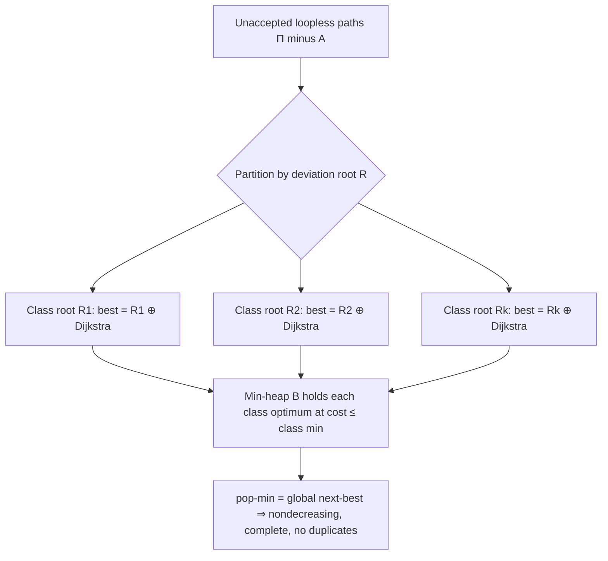

# Yen's Algorithm — Mathematical Foundations and Complexity Theory

> **Focus:** A rigorous account of *why* Yen's spur + root construction enumerates the K shortest **loopless** paths in **nondecreasing** cost order with neither omission nor duplication, a full complexity derivation, the partition/branching argument, and the algorithm's place in the broader theory of k-best enumeration.

## Table of Contents
1. [Formal Definition](#1-formal-definition)
2. [The Branching Partition (No Omission, No Duplication)](#2-the-branching-partition)
3. [Correctness Proof — Nondecreasing Enumeration](#3-correctness-proof)
4. [Why the Removals Are Exactly Right](#4-why-the-removals-are-exactly-right)
5. [Complexity Derivation](#5-complexity-derivation)
6. [Loopless vs Loops-Allowed: A Complexity Gap](#6-loopless-vs-loops-allowed)
7. [Lawler's Refinement — Correctness Preserved](#7-lawlers-refinement)
8. [Lower Bounds and Hardness Boundaries](#8-lower-bounds-and-hardness)
9. [Worked Proof Trace on a Concrete Graph](#9-worked-proof-trace)
10. [Numerical Stability and Tie-Breaking](#10-numerical-stability-and-tie-breaking)
11. [Amortized View of the Candidate Heap](#11-amortized-view-of-the-candidate-heap)
12. [Formal Failure Modes — What the Proof Forbids](#12-formal-failure-modes)
13. [Comparison with Alternatives](#13-comparison-with-alternatives)
14. [Summary](#14-summary)

---

## 1. Formal Definition

Let `G = (V, E, w)` be a directed graph with a weight function `w : E → ℝ≥0` (non-negative, as required by the Dijkstra subroutine). Fix a source `s ∈ V` and target `t ∈ V`.

```text
A path P = (v0, v1, ..., vℓ) is a sequence of vertices with (v_{i}, v_{i+1}) ∈ E.
Its cost is  c(P) = Σ_{i=0}^{ℓ-1} w(v_i, v_{i+1}).

P is LOOPLESS (simple) iff all v_i are distinct.

Let Π(s, t) = { loopless paths from s to t in G }.
```

**Problem (K Shortest Loopless Paths).** Output a sequence `A = (A0, A1, ..., A_{K-1})` of distinct elements of `Π(s,t)` such that:

```text
(i)  c(A0) ≤ c(A1) ≤ ... ≤ c(A_{K-1});
(ii) for every loopless path Q ∉ {A0,...,A_{K-1}},  c(Q) ≥ c(A_{K-1});
(iii) K' = min(K, |Π(s,t)|) paths are returned if fewer than K exist.
```

That is, `A` is a prefix of the loopless paths sorted by cost (ties broken arbitrarily but consistently).

**Yen's structures.**

```text
A = accepted list (the output prefix being built).
B = candidate set, a min-priority-queue keyed by cost.

A "deviation" of an accepted path P at index i is a path that shares the prefix
(v0,...,v_i) with P (the ROOT) and whose edge (v_i, v_{i+1}') differs from P's,
then proceeds loopless to t (the SPUR path).
```

---

## 2. The Branching Partition

The engine of correctness is a partition of `Π(s,t)` induced by **deviation points**.

**Definition (deviation index).** For two distinct paths `P` and `Q` sharing the source `s`, the *deviation index* `dev(P, Q)` is the largest `i` such that the prefixes `P[0..i] = Q[0..i]` but `P[i+1] ≠ Q[i+1]` (the index of the last common vertex before they split).

**Lemma 1 (Branching covers everything).** Let `A0` be the shortest loopless `s→t` path. Then every loopless path `Q ≠ A0` deviates from `A0` at some index `i`, i.e. `Q` shares the prefix `A0[0..i]` and takes a different edge out of `A0[i]`.

*Proof.* Both `Q` and `A0` start at `s = A0[0] = Q[0]`. Let `i` be the last index where they agree on the prefix; since `Q ≠ A0`, such a finite `i ≥ 0` exists and `Q[i+1] ≠ A0[i+1]`. Then `Q` deviates from `A0` at `i`. ∎

More generally, once `A0, …, A_{k-1}` are fixed, define for each not-yet-accepted loopless path `Q` its **representative deviation**: the pair `(A_j, i)` where `A_j` is the accepted path with which `Q` shares the longest prefix, and `i = dev(A_j, Q)`. This assigns every unaccepted path to exactly one (accepted path, spur index) class. Yen's spur generation enumerates, for the *latest* accepted path, exactly these classes — and (across iterations) every class is eventually examined. The min-heap then selects across classes.

**Well-definedness of the representative.** The "accepted path with the longest shared prefix" is unique *up to ties*, and ties are harmless: if `Q` shares its longest prefix with two accepted paths `A_a` and `A_b` (they agree on `Q`'s prefix up to the same index `i`), then `A_a` and `A_b` also agree up to index `i`, so they share the root `R = Q[0..i]`. Yen's edge-removal rule removes the spur-leaving edge of *both* `A_a` and `A_b` when processing root `R`, so `Q`'s class is correctly forbidden from reproducing either — and `Q`'s genuinely-new first edge is preserved. The representative class is thus well-defined as the *root* `R` (a prefix), independent of which accepted path we name; this is why the removal rule keys on "all paths sharing the root," not on a single named path.

The partition and its selection by the heap are summarized below: every unaccepted loopless path falls into exactly one deviation class keyed by its root, each class's optimum is one constrained Dijkstra, and the heap selects the global minimum across classes.



**Disjointness of classes.** Two distinct unaccepted loopless paths `Q ≠ Q'` belong to the *same* class iff they share the same root `R` *and* take the same first edge out of the spur — but then they would have to differ later, both being valid deviations with identical `(R, first-edge)`. The cheapest such path is the unique class representative computed by the spur Dijkstra (Lemma 2); the others are simply higher-cost members of the same class, surfaced in *later* iterations when their own deviation point (further along) is processed. So the classes partition `Π(s,t) \ A` with no overlap, and Yen examines each exactly once over the run — the formal "no duplication, no omission" guarantee.

**Lemma 2 (Best representative per class).** For a fixed root path `R = P[0..i]` (ending at spur node `v = P[i]`), among all loopless paths whose root is exactly `R` and whose next edge differs from every already-known path sharing `R`, the **cheapest** is `R ⊕ S*`, where `S*` is the shortest loopless `v→t` path in the graph with (a) the root vertices `R[0..i-1]` deleted and (b) the forbidden first edges deleted.

*Proof.* Any such path is `R ⊕ S` for some loopless `v→t` path `S` that avoids the root's interior vertices (else the concatenation repeats a vertex — not loopless) and whose first edge is permitted. Its cost is `c(R) + c(S)`, with `c(R)` constant. Minimizing over `S` is exactly the constrained shortest-path problem solved by Dijkstra on the graph with those vertices/edges removed; its optimum is `S*`. ∎

This is the precise justification for the spur computation: **the removals turn "cheapest deviation in this class" into an ordinary shortest-path query.**

---

## 3. Correctness Proof

We prove Yen satisfies (i)–(iii). The argument is an invariant maintained over the accepted list.

```text
INVARIANT I (after k paths accepted, 0 ≤ k ≤ K):

  (I1) A = (A0, ..., A_{k-1}) are k distinct loopless s→t paths with
       c(A0) ≤ ... ≤ c(A_{k-1}).
  (I2) A is a correct prefix: every loopless path not in A has cost ≥ c(A_{k-1}).
  (I3) B contains, for EVERY loopless path Q ∉ A that deviates from some A_j (j<k),
       a candidate of cost ≤ c(Q); in particular the cheapest unaccepted loopless
       path is represented in B at its exact cost.
```

**Base case (k = 1).** `A0` is the global shortest loopless path (Dijkstra; the unconstrained shortest path is automatically loopless under non-negative weights). (I1), (I2) hold trivially. For (I3): every loopless `Q ≠ A0` deviates from `A0` at some index `i` (Lemma 1). Yen, immediately after accepting `A0`, runs the spur generation over all spur nodes of `A0`; by Lemma 2 the class of `Q` receives a candidate of cost ≤ `c(Q)`, and the cheapest unaccepted path's class gets a candidate at its exact cost. So (I3) holds once the first spur round has populated `B`.

**Inductive step.** Assume `I` after `k` paths. Yen pops the minimum-cost candidate `A_k` from `B`.

- **(I1):** `A_k` is loopless by construction (root nodes removed ⇒ spur cannot revisit them; root itself is simple). It is distinct from all `A_j` because dedup rejects any candidate already accepted. And `c(A_k) ≥ c(A_{k-1})`: by (I3), at the previous step the cheapest unaccepted path was represented in `B` at its exact cost; `A_{k-1}` was the heap minimum then, and every candidate now in `B` has cost ≥ `c(A_{k-1})` (a deviation off `A_{k-1}` costs ≥ `c(A_{k-1})` since the spur path has non-negative cost and the root is a prefix of an ≥-cost path). Hence ordering is preserved.

- **(I2):** Suppose some loopless `Q ∉ A` (after adding `A_k`) had `c(Q) < c(A_k)`. By (I3) (previous step), `Q`'s class was represented in `B` by a candidate of cost ≤ `c(Q) < c(A_k)`. But `A_k` was the heap minimum — contradiction. So no unaccepted loopless path is cheaper than `A_k`; `A` remains a correct prefix.

- **(I3):** Accepting `A_k` may create *new* loopless paths that deviate from `A_k` (and were not deviations of any earlier `A_j`). Yen now runs spur generation over `A_k`'s spur nodes, which by Lemma 2 inserts, for each such new class, a candidate of cost ≤ that class's cheapest path. Classes deviating from earlier `A_j` were already represented and remain in `B` (popping `A_k` only removed `A_k`). Thus every unaccepted loopless path is again represented at cost ≤ its own, restoring (I3). ∎

**Termination & (iii).** Each iteration either accepts a new path (|A| grows) or finds `B` empty. `B` empties exactly when no unaccepted loopless path remains (by (I3), an empty `B` means no class is left). So the loop runs `min(K, |Π(s,t)|)` times and halts. ∎

Combining: at the end, (I1) gives ordering (i), (I2) gives the prefix property (ii), termination gives (iii). **Yen is correct.**

The structure of this proof is worth naming explicitly, because it is the template for *every* k-best enumeration correctness argument:

```text
1. Define a PARTITION of the unfound solutions into classes (here: deviation classes).
2. Show each class's BEST member is computable by one constrained subroutine (Lemma 2).
3. Maintain the INVARIANT "B holds each class's best, at cost ≤ that class's optimum".
4. Conclude pop-min(B) is globally next-best ⇒ nondecreasing, complete, duplicate-free.
```

Eppstein, Lawler, and replacement-path methods all instantiate this same skeleton with different partition/subroutine choices; recognizing it lets you adapt Yen to new constraints (forbidden vertices, mandatory waypoints, disjointness) by re-deriving only steps 1–2 while reusing 3–4 verbatim.

**On the subtle step in (I1).** The claim "every candidate now in `B` has cost ≥ `c(A_{k-1})`" deserves explicit justification, since it is where non-negativity is consumed. A candidate is `R ⊕ S` with root `R` a prefix of some accepted path `A_j` and spur `S` a non-negative-cost detour. There are two cases. *Case 1: `R` is a prefix of `A_{k-1}` itself.* Then `c(R) ≤ c(A_{k-1})` is the cost of a prefix, but the candidate replaces `A_{k-1}`'s suffix with a *different, non-shorter* one (it was forbidden from taking `A_{k-1}`'s edge, and `A_{k-1}`'s suffix was the cheapest completion of `R`, so any alternative completion costs ≥ that). Hence `c(R ⊕ S) ≥ c(A_{k-1})`. *Case 2: `R` is a prefix of an earlier `A_j`, `j < k-1`.* That candidate was already in `B` when `A_{k-1}` was popped as the minimum, so its cost is ≥ `c(A_{k-1})` by the heap-minimum property. Both cases give the bound, and both invoke non-negativity (Case 1 needs `c(S) ≥ 0` to conclude the alternative completion isn't cheaper). This is the precise point at which negative edges would invalidate the ordering — see §13's `(min,+)` discussion.

**Why the unconstrained shortest path is loopless (base case detail).** The base case asserted `A0` is loopless "automatically." Proof: under non-negative weights, a shortest `s→t` path containing a repeated vertex `v` could have the cycle `v ⇝ v` excised, yielding a path of cost ≤ the original (the excised cycle has cost ≥ 0). So some shortest path is loopless, and Dijkstra (which settles each vertex once) returns such a path. Thus seeding `A` with Dijkstra's output satisfies the looplessness requirement without extra work — a small but load-bearing fact for the whole induction.

---

## 4. Why the Removals Are Exactly Right

Two removal rules carry the proof; each is *necessary* and *sufficient*.

**Edge removal (no duplication).** For root `R` ending at spur `v`, Yen removes the edge `(v, p[i+1])` for **every** path `p ∈ A` (and the current path) with prefix `R`. 

- *Necessary:* if we removed only `A_{k-1}`'s outgoing edge, the spur Dijkstra could return a path whose first edge equals some earlier `A_j`'s edge out of `v` with the same root — reproducing `A_j` (a duplicate). 
- *Sufficient:* removing all such edges forces the spur path's first edge to differ from every known path sharing `R`, so the candidate is genuinely new at its deviation point. By Lemma 2 it is the cheapest such new path; no cheaper new deviation in this class is missed.

**Vertex removal (looplessness).** Yen removes `R`'s interior vertices `R[0..i-1]` from the spur search.

- *Necessary:* without it, the spur path `S` could revisit a root vertex, making `R ⊕ S` non-simple — violating the loopless requirement.
- *Sufficient:* with `R[0..i-1]` (and implicitly the spur node `v`, which the spur path starts at and never returns to under non-negative weights) excluded, `S` shares no vertex with `R`'s interior, so `R ⊕ S` is simple.

Note the asymmetry: we delete root *interior* vertices but **keep** the spur node `v` (the search must start there). Under strictly positive weights a shortest spur path never returns to `v`; with zero-weight edges one must additionally forbid re-entering `v`, handled by marking `v` settled at distance 0.

---

## 5. Complexity Derivation

Let `n = |V|`, `m = |E|`, and let `K` be the requested count.

**Per spur Dijkstra.** With a binary-heap Dijkstra on the (reduced) graph: `O(m + n log n)`. (A Fibonacci heap gives `O(m + n log n)` as the standard bound; binary heap gives `O((m + n) log n)`, the same up to the log factor used below.)

**Spur nodes per accepted path.** A loopless path has at most `n` vertices, hence at most `n - 1` spur nodes. So generating all candidates spawned by one accepted path costs:

```text
O(n) spur nodes × O(m + n log n) per Dijkstra = O(n · (m + n log n)).
```

The removal-set construction per spur node costs `O(k · n)` (scan accepted paths) but is dominated by the Dijkstra term for `k ≤ K ≤ n`-sized inputs in the regime of interest; folded into the bound it does not change the asymptotics.

**Total over K accepted paths.**

```text
T(K) = K · [ O(n · (m + n log n)) ]
     = O( K · n · (m + n log n) )
     = O( K · V · (E + V log V) ).
```

This matches the quoted complexity. The factor decomposition is **`K` accepted × `V` spur nodes × one Dijkstra**.

**Heap (`B`) operations.** Each spur node contributes at most one candidate, so across the run at most `O(K · n)` candidates are pushed; each push/pop is `O(log(K n))`. Total heap cost `O(K n log(K n))`, dominated by the Dijkstra term.

**Removal-set construction.** Building `removedEdges` for one spur node scans the accepted list `A` (size ≤ `K`) checking prefix equality (`O(n)` per comparison), costing `O(K·n)` per spur node, hence `O(K·n²)` per accepted path and `O(K²·n²)` total. Naively this can rival the Dijkstra term when `K` is large. Two standard fixes: (a) index accepted paths by their prefix in a trie, so all paths sharing a root are found in `O(|root|)` rather than `O(K·n)`; (b) exploit that only paths sharing the *current* root matter, which a trie surfaces directly. With the trie, removal-set construction drops to `O(n)` per spur node and is fully dominated by the Dijkstra cost, restoring the clean `O(K·V·(E + V log V))` bound even for large `K`.

**Putting the terms together.**

```text
Dijkstra (dominant): O(K · n · (m + n log n))
Heap:                O(K · n · log(K n))           ⊆ dominant
Removals (trie):     O(K · n · n) = O(K n²)        ⊆ dominant when m ≥ n
Dedup (hashed keys): O(K · n) total                ⊆ dominant
                     ────────────────────────────────────────
Total:               O(K · V · (E + V log V))
```

Every auxiliary structure is engineered so the spur Dijkstras remain the sole asymptotic bottleneck — which is exactly why all serious optimization effort (Lawler, replacement-paths, faster oracles) targets *that* term.

**Space.**

```text
- Accepted list A:      O(K · n)   (K paths, each ≤ n vertices)
- Candidate heap B:     O(K · n)   candidates, each ≤ n vertices ⇒ O(K · n²) worst case bytes
- Dedup set:            O(K · n)   path keys
- Graph:                O(n + m)
Overall: O(K · n + m) entities, O(K · n²) transient if full paths are stored in B.
```

Bounding `B` (dedup, size caps) keeps the transient term in check (see `senior.md` §11.2).

**Tightness of the bound.** The `O(K·V·(E + V log V))` bound is *tight* in the worst case, not merely an over-estimate. Consider a graph engineered so that every accepted path has `Θ(n)` vertices and every spur node admits a distinct valid detour requiring a full Dijkstra (e.g. a layered "ladder" graph where each rung offers a fresh alternative). Then each of the `K` accepted paths genuinely spawns `Θ(n)` spur Dijkstras, none short-circuited, and the product `K · n · (m + n log n)` is realized. No analysis can do asymptotically better *for plain Yen*, which is precisely why the refinements (Lawler, replacement-paths) attack the constant and the redundant-spur factor rather than the worst-case class.

**Dependence on path length.** A sharper bound replaces the `V` spur-node factor with `L`, the maximum length (vertex count) of any of the first `K` paths: `O(K · L · (E + V log V))`. On graphs where shortest paths are short (small-world networks, road graphs with `L ≪ V`), this is dramatically better than the pessimistic `V` factor suggests — a single Yen run on a continental road network finds 5 routes in well under a second precisely because `L` (hundreds of road segments) is far below `V` (millions of nodes).

---

## 6. Loopless vs Loops-Allowed

The looplessness requirement is the entire reason Yen pays the `K·V` Dijkstra factor. If paths may **repeat vertices** (loops allowed), the problem changes character dramatically.

**Eppstein's algorithm (1998).** Build a single shortest-path tree to `t`, then model every `s→t` walk as a sequence of *sidetracks* (edges leaving the tree), each with a nonnegative "extra cost" `δ(e) = w(u,v) + dist(v,t) − dist(u,t)`. The K shortest walks correspond to the K smallest-weight sequences of sidetracks, enumerable from an implicit heap-ordered "path graph" in:

```text
O(m + n log n + K)   time   (after the shortest-path-tree build),
O(m + n)             space  for the implicit structure (+ O(K) output).
```

This is **near-linear in K** — exponentially better than Yen's `K·V·(...)` when `K` is large. The catch: Eppstein's walks may revisit vertices (contain cycles), because the sidetrack model has no mechanism to forbid repetition.

**Why looplessness breaks Eppstein's speedup.** The sidetrack decomposition relies on each deviation being *independent* and composable via a heap. The "no repeated vertex" constraint is *global* and *non-local*: whether a sidetrack is legal depends on the entire path so far. This destroys the clean heap structure, and the best known exact loopless algorithms remain in Yen's `O(K·V·(E + V log V))` ballpark (with Lawler/Hershberger-Suri-Bhosle refinements shaving constants, not the asymptotic class). The gap between the two problems is a genuine, well-studied phenomenon.

**A formal statement of the obstruction.** In Eppstein's model, a walk is a multiset-aware sequence of sidetracks, and the cost of appending a sidetrack is *context-free* — it adds a fixed `δ(e) ≥ 0` regardless of what came before. This context-freeness is exactly what lets a heap enumerate the K smallest sidetrack-sequences in `O(K)` amortized after the build. Looplessness introduces a *context-sensitive* legality predicate `legal(prefix, e) = (head(e) ∉ vertices(prefix))`, which no fixed `δ` can encode. Formally, the loopless path language is not a *rational* (regular) subset of the walk language; it requires memory proportional to the path length to recognize. Yen's per-spur vertex removal is precisely the operational implementation of this memory — it re-imposes the legality predicate by physically deleting the forbidden vertices before each constrained search. The factor-`V` penalty is the price of recomputing legality at every deviation rather than amortizing it through a heap.

**Consequence for the DAG special case.** On a **directed acyclic graph** the distinction collapses: no walk can repeat a vertex (a repeat would imply a cycle), so every walk is automatically loopless. Hence on a DAG, Eppstein's `O(m + n log n + K)` algorithm solves the *loopless* problem too — Yen is strictly dominated there. Recognizing that your graph is (or can be made) acyclic is therefore a decisive optimization: it moves the problem from the right column to the left column of the §8 taxonomy, an exponential-in-`K` speedup. Lattice-based k-best decoding (NLP, speech) exploits exactly this, since decoding lattices are acyclic by construction.

| Problem | Best known exact time | Structure |
| --- | --- | --- |
| K shortest **walks** (loops allowed) | `O(m + n log n + K)` (Eppstein) | Implicit path graph of sidetracks |
| K shortest **loopless** paths | `O(K · n · (m + n log n))` (Yen) | Spur/root branching + per-class Dijkstra |

---

## 7. Lawler's Refinement

Lawler (1972) observed that re-scanning *all* spur nodes of each newly accepted path repeats work: spur nodes before the path's own deviation index were already explored when its parent was processed.

**Claim.** Restricting spur generation for an accepted path `A_k` to indices `i ≥ dev(A_k)` (where `dev(A_k)` is the index at which `A_k` itself branched from its parent) loses no paths.

*Proof sketch.* Any new loopless path `Q` that deviates from `A_k` at index `i < dev(A_k)` shares with `A_k` the prefix `A_k[0..i]`. But that prefix is also a prefix of `A_k`'s **parent** path `A_p` (since `A_k` and `A_p` agree up to `dev(A_k) > i`). Hence `Q` deviates from `A_p` at the same index `i` as well, and was therefore already enumerated when `A_p` was processed — its class candidate is already in `B` (or accepted/deduped). So examining `i < dev(A_k)` for `A_k` only regenerates known candidates. Skipping them changes nothing about which paths reach `B`, only the redundant work. ∎

This preserves Invariant `I` (every class is still represented, just discovered earlier via the parent) and the nondecreasing-order proof, while reducing the number of spur Dijkstras in practice.

**Quantifying the saving.** Without Lawler, processing `A_k` runs `len(A_k) - 1` spur Dijkstras; with Lawler it runs `len(A_k) - dev(A_k) - 1`. The saving is the deviation index `dev(A_k)` — exactly the length of the prefix `A_k` shares with its parent. On graphs where successive accepted paths share long prefixes (common: the 5th-best route usually diverges from the 4th only near the end), `dev(A_k)` is large and Lawler skips most of the spur round. In the extreme of a "broom" graph — one long shared stem then a fan of `K` distinct tails — Lawler reduces total spur Dijkstras from `O(K·n)` to `O(K + n)`, since each accepted path deviates only in its short tail. The optimization never changes *which* paths are output, only how much redundant work precedes them, so it is pure profit; production Yen implementations enable it by default.

---

## 8. Lower Bounds and Hardness

Yen's problem is **polynomial** — there is no NP-hardness here for the unconstrained loopless KSP. The relevant theory is about *how low* the exponent can go and *which constraints* break tractability.

- **Output-sensitive lower bound.** Any algorithm must at least output `K` paths of up to `n` vertices: `Ω(K · n)` just to write the answer (often dwarfed by the `K·n·m` compute term). This is a genuine information-theoretic floor: a graph can be constructed whose K shortest loopless paths are pairwise edge-disjoint and each of length `Θ(n)`, so the answer alone is `Θ(K·n)` symbols that must be emitted regardless of algorithm.
- **The loopless penalty.** As §6 details, requiring simple paths appears to cost a factor of roughly `n` (a full shortest-path computation per deviation) over the loops-allowed case; closing this gap is open in general.
- **Constrained variants turn NP-hard.** Add a *side constraint* and tractability can collapse:
  - **K shortest *vertex-disjoint* paths** for fixed routing is solvable for 2 (Suurballe), but maximizing the number of disjoint paths under length constraints is hard in general.
  - **K shortest paths with a resource budget** (e.g. each ≤ `L` hops *and* ≤ `C` cost on a second metric — the *constrained shortest path*) is **NP-hard** (weakly), via reduction from PARTITION/KNAPSACK. Yen's clean polynomial structure relies on a *single* additive metric and the only constraint being simplicity.

```text
Reduction sketch (constrained shortest path is NP-hard):
  Given a PARTITION instance {a1,...,an}, build a chain of n diamond gadgets;
  gadget i offers two parallel edges of (cost, weight) = (a_i, 0) or (0, a_i).
  An s→t path picking the "cost" side for a subset S has cost Σ_{i∈S} a_i and
  weight Σ_{i∉S} a_i. A path with cost ≤ T and weight ≤ T exists iff S partitions
  the set into two equal halves. Thus deciding a bounded bicriteria path is NP-hard,
  and so is enumerating K-best under such a constraint.
```

A fuller reduction makes the bicriteria hardness concrete and shows exactly where Yen's single-metric assumption is doing tractability-preserving work:

```text
CONSTRAINED-SHORTEST-PATH (CSP) decision problem:
  Given G with two non-negative weights per edge, cost c(e) and weight d(e),
  a source s, target t, and bounds (C, D): does an s→t path P exist with
  Σ c(P) ≤ C and Σ d(P) ≤ D?

Reduction from PARTITION { a1, ..., an } (Σ a_i = 2T):
  - Vertices v0, v1, ..., vn (a chain).
  - Between v_{i-1} and v_i, two parallel edges:
        "left"  edge:  c = a_i,  d = 0
        "right" edge:  c = 0,    d = a_i
  - Set s = v0, t = vn, bounds C = T, D = T.

  An s→t path chooses, per gadget i, left or right. Let S = { i : chose left }.
      Σ c = Σ_{i∈S} a_i ,     Σ d = Σ_{i∉S} a_i .
  Both ≤ T  ⟺  Σ_{i∈S} a_i = Σ_{i∉S} a_i = T  ⟺  S partitions the set.
  So CSP is YES ⟺ PARTITION is YES.  CSP is NP-complete (weakly). ∎
```

The K-best version (enumerate the K cheapest paths satisfying the weight budget) is at least as hard. Yen avoids this entirely because it has *one* additive metric and *one* structural constraint (simplicity) that is enforced locally by vertex removal — there is no budget to discretize, no second dimension to search. The moment a problem genuinely needs a second budgeted metric, no amount of Yen engineering helps; the right move is a pseudo-polynomial DP over discretized budget levels (Lagrangian or label-correcting), accepting the `O(C)` or `O(D)` factor.

The takeaway: Yen sits at the *tractable* edge of path enumeration. Single-metric + loopless is `O(K·V·(E+V log V))`; loops-allowed drops to near-linear in `K` (Eppstein); add a second budgeted metric and you cross into NP-hardness.

### A taxonomy of the enumeration landscape

```text
                       loops allowed?
                     +--------------+--------------+
                     |     YES      |     NO       |
   +-----------------+--------------+--------------+
   | single metric   |  Eppstein    |  Yen/Lawler  |
   |                 |  O(m+n log n |  O(K·V·       |
   |                 |     + K)     |  (E+V log V)) |
   +-----------------+--------------+--------------+
   | + budget metric |  pseudo-poly |  NP-hard      |
   | (bicriteria)    |  (DP on cost)|  (PARTITION)  |
   +-----------------+--------------+--------------+
```

Two orthogonal axes — *looplessness* and *number of metrics* — govern tractability. Moving right (forbidding loops) costs roughly a factor `V`. Moving down (adding a budgeted second metric) costs tractability entirely in the loopless cell and demotes the loops-allowed cell to pseudo-polynomial (a DP over discretized budget values). Yen occupies the upper-right cell: the hardest *still-polynomial* corner. Recognizing which cell a real problem lives in is the single most important modeling decision — many "Yen is too slow" complaints are really "this problem is in the bottom row, where no polynomial algorithm exists."

---

## 9. Worked Proof Trace

To make Invariant `I` concrete, trace it on the graph from the junior walkthrough (source `C`, target `H`), demanding `K = 3`. We annotate each step with which clause of `I` is established.

```text
edges: C→D 3, C→E 2, D→F 4, E→D 1, E→F 2, E→G 3, F→G 2, F→H 1, G→H 2
```

**After accepting A0 (base case).**

```text
A0 = (C,E,F,H), c = 5.   Dijkstra's optimum ⇒ globally shortest, automatically loopless.
(I1) holds: one path, trivially ordered.
(I2) holds: no loopless path is cheaper than 5 (A0 is the optimum).
Spur round over A0 populates B:
  spur C: remove edge C→E ⇒ best detour C,D,F,H (8)   → B
  spur E: remove E→F, remove C ⇒ best detour C,E,G,H (7) → B
  spur F: remove F→H, remove C,E ⇒ best detour C,E,F,G,H (8) → B
B = { (C,E,G,H:7), (C,D,F,H:8), (C,E,F,G,H:8) }.
(I3) holds: EVERY loopless path ≠ A0 deviates from A0 at C, E, or F, and the
     cheapest in each class is represented. The cheapest unaccepted path
     (C,E,G,H:7) sits in B at its EXACT cost 7.
```

**Accept A1 = pop-min(B) = (C,E,G,H), c = 7.**

```text
(I1): 7 ≥ 5 ✓, distinct ✓, loopless by construction ✓.
(I2): suppose some unaccepted loopless Q had c(Q) < 7. By prior (I3) its class
     was in B at cost ≤ c(Q) < 7, contradicting that 7 was the heap minimum.
     So A=(A0,A1) is a correct 2-prefix.
Spur round over A1 (with Lawler dev index 1, i.e. spur from E onward):
  spur E: remove E→F (from A0) AND E→G (from A1), remove C
          ⇒ best detour C,E,D,F,H (8) → B   [new class created by accepting A1]
  spur G: remove G→H, remove C,E ⇒ G has no other edge to H ⇒ NO spur path (skip)
B = { (C,D,F,H:8), (C,E,F,G,H:8), (C,E,D,F,H:8) }.
(I3) restored: classes deviating from A0 still present; the new class deviating
     from A1 at E now represented at cost 8.
```

**Accept A2 = pop-min(B) = (C,D,F,H), c = 8** (ties broken by insertion order).

```text
(I1): 8 ≥ 7 ✓.   (I2): no unaccepted loopless path < 8 (all remaining are ≥ 8).
|A| = 3 = K ⇒ terminate. Output: 5, 7, 8 in nondecreasing order. ∎
```

Every clause of `I` was preserved at every step, and the output is exactly the sorted 3-prefix — the proof in miniature.

---

## 10. Numerical Stability and Tie-Breaking

Two subtleties matter for a *provably correct* implementation.

**Tie-breaking must be total and consistent.** Clause (i) allows `c(A_j) = c(A_{j+1})`, but the heap must impose a **total order** to be deterministic. Keying `B` on `(cost, tie_breaker)` where `tie_breaker` is the lexicographic vertex sequence guarantees: (a) reproducible output across runs, and (b) that the dedup logic (which compares full paths) and the ordering logic agree. Without a deterministic tie-break, two correct runs may return different (but equally valid) sets when costs tie — fine for correctness, bad for testing and caching.

**Zero-weight edges and the spur node.** The looplessness sufficiency argument (§4) used "under non-negative weights a shortest spur path never returns to `v`." With **zero-weight** cycles through `v`, a shortest spur path *could* revisit `v` at no extra cost, breaking simplicity. The fix is to mark the spur node `v` as *settled at distance 0* and forbid relaxing back into it — equivalent to also removing incoming edges to `v` during the spur search. This restores the invariant without changing any cost.

**Floating-point weights.** If `w : E → ℝ≥0` uses floats, the strict `<` vs `≤` comparisons in Dijkstra and in the nondecreasing-order check become sensitive to rounding. Use an epsilon-tolerant comparison consistently in *both* the Dijkstra relaxation and the heap ordering, or scale weights to integers. An inconsistent epsilon (strict in one place, tolerant in another) can violate (I2) by letting a "slightly cheaper" path slip past the prefix guarantee.

**Integer overflow on path cost.** A path of `n` edges each weighing up to `W` can cost up to `n·W`; for `64`-bit costs this is safe, but `32`-bit costs on long heavy paths can overflow, corrupting the heap order and breaking (I1). Use a cost type wide enough that `n·W` cannot overflow, or cap `n` and `W` and assert the product fits. This mirrors the `INF` overflow guard in Floyd-Warshall: a silent arithmetic wrap manufactures a phantom "cheaper" path that the proof never anticipated.

---

## 10-bis. Invariant as Pseudocode-Annotated Proof

The cleanest way to internalize the correctness argument is to read the algorithm with the invariant inlined as assertions. Every line either *establishes* or *preserves* a clause of `I`.

```text
function YEN(G, s, t, K):
    A0 ← DIJKSTRA(G, s, t)                 # establishes (I1),(I2) base; A0 loopless (§3 detail)
    A  ← [A0]
    B  ← empty min-heap (key = (cost, lex)) # total order ⇒ deterministic ties (§10)
    seen ← { key(A0) }                      # supports distinctness in (I1)

    while |A| < K:
        P ← A[last]                          # the just-accepted path
        for i in dev(P) .. len(P)-2:         # Lawler restriction preserves (I3) (§7)
            R ← P[0..i]                       # ROOT (prefix); spur node v = P[i]
            removedEdges ← { (p[i],p[i+1]) : p∈A, prefix(p,i)=R }   # Lemma 2 / no-dup
            removedNodes ← R[0..i-1]          # looplessness ⇒ (I1) simple
            S ← DIJKSTRA(G\removed, v, t)     # per-class optimum (Lemma 2)
            if S = ⊥: continue                # dead-end spur: class is empty, skip
            C ← R[0..i-1] ⊕ S                 # candidate; cost = c(R)+c(S)
            if key(C) ∉ seen:                 # dedup ⇒ push bound O(K·n) (§11)
                push B ← C ;  seen ← seen ∪ {key(C)}   # restores (I3)
        if B empty: break                     # termination ⇒ (iii)
        A[next] ← pop-min(B)                  # (I1) order, (I2) prefix via heap-min
    return A
```

Reading top to bottom: the seed line discharges the base case; the `removedEdges`/`removedNodes` lines are the operational form of Lemmas 2 and 4 (no duplication, looplessness); the `seen` guard is what keeps the push count — and hence the complexity bound — at `O(K·n)`; and `pop-min` is the single line carrying the nondecreasing-order guarantee. The `dev(P)` lower bound is Lawler's optimization, justified in §7 to preserve (I3). There is no line whose deletion leaves the algorithm correct — each is doing proof work.

---

## 11-bis. Generating Functions and the Cost Spectrum

Beyond worst-case bounds, the *distribution* of path costs admits an algebraic description that clarifies when Yen terminates early and how the heap evolves.

Let `N(c)` be the number of loopless `s→t` paths of cost exactly `c`. The **cost spectrum** is the sequence `(c_0 ≤ c_1 ≤ …)` of path costs in sorted order; Yen outputs its first `K` terms. Two regimes:

- **Sparse spectrum** (costs well-separated): each accepted path is strictly cheaper than the next; ties are rare; the heap rarely holds many equal-cost candidates. Common in graphs with irrational/real-valued or widely-varying weights.
- **Dense spectrum** (many ties): integer weights on a small range produce clusters of equal-cost paths. The heap then holds many candidates at the current minimum cost, and tie-breaking (§10) determines the output among them. Yen still returns a valid prefix, but *which* equal-cost paths appear depends entirely on the tie-break rule.

The number of candidates ever pushed is bounded by the number of *distinct deviation classes* explored, which is `O(K·L)` (accepted paths × their lengths). The heap's instantaneous size is the number of classes generated but not yet accepted — it grows when an accepted path spawns many cheap detours and shrinks as they are consumed. In the steady state of a long run, `|B| ≈ Θ(L)` (one fresh batch of spurs per acceptance, minus the one consumed), which is why the heap term never dominates: it is bounded by path length, not by the total number of paths in the graph (which can be exponential).

This also explains the **early-termination** behavior under a cost ceiling: once the heap minimum exceeds the ceiling, the entire remaining spectrum is above it (nondecreasing order), so the algorithm halts having proven — not guessed — that no qualifying path remains.

---

## 11. Amortized View of the Candidate Heap

The candidate heap `B` admits a clean amortized accounting that bounds total heap work independently of how many candidates are *generated* versus *accepted*.

```text
Aggregate method.
  Each spur node of each accepted path produces at most ONE surviving candidate
  (dedup rejects the rest). Over K accepted paths with ≤ n spur nodes each:
      pushes ≤ K · n.
  Each accepted path is exactly one pop:
      pops = K.
  Total heap operations: ≤ K·n pushes + K pops = O(K·n), each O(log(K·n)).
  Aggregate heap cost: O(K · n · log(K·n)).
```

Define a potential `Φ(B) = |B| · log(K·n)` (the "stored work" in the heap). A push raises `Φ` by `O(log(K·n))`; a pop lowers it. The amortized cost of an accepted path is then `O(n · log(K·n))` (its share of pushes) — comfortably dominated by the `O(n · (m + n log n))` Dijkstra work of its spur round. **The heap is never the bottleneck**; the spur Dijkstras are. This is why optimization effort (Lawler, replacement-paths) targets the Dijkstra count, not the heap.

A second observation: dedup is what keeps the push count at `O(K·n)`. Without it, the same total path can be pushed from up to `n` distinct spur nodes across iterations, inflating pushes to `O(K·n²)` and the heap memory likewise. Dedup is therefore not merely an optimization but part of the complexity *bound* itself.

---

## 12. Formal Failure Modes

The proof is constructive: each clause of Invariant `I` corresponds to a concrete implementation rule, and violating the rule violates a clause in a *provable*, reproducible way. This table maps proof obligations to bugs.

| Proof obligation | Implementation rule | Violated ⇒ which clause fails | Observable symptom |
| --- | --- | --- | --- |
| Lemma 2 (per-class optimum) | Remove the spur-leaving edge of **all** paths sharing the root | (I3): a class's cheapest is missed/duplicated | Duplicate paths in `A`, or a valid 2nd path skipped |
| Looplessness | Remove root interior vertices from spur search | (I1): `A_k` not simple | Output path repeats a vertex |
| Nondecreasing order | Pop the **minimum** of `B`; non-negative weights | (I1)/(I2): order or prefix breaks | A later path is cheaper than an earlier one |
| Representation (I3) | Run the full spur round after **every** acceptance | (I3): some class never enters `B` | Algorithm halts early, returns < K when ≥ K exist |
| Distinctness | Dedup before push (or before accept) | (I1): paths not distinct | Same path appears twice in output |
| Termination | Stop on empty `B` | (iii): infinite loop | Hang when `K > |Π(s,t)|` |

Each row is a *theorem-driven test case*: construct a graph that exercises the obligation, mutate the implementation to violate the rule, and confirm the predicted symptom. This is how you turn the correctness proof into a regression suite — every lemma becomes an assertion.

A particularly instructive case is the **zero-weight cycle through the spur node** (§10). The proof's looplessness argument silently assumed strictly positive weights; a zero-weight back-edge to `v` is a graph that the *unpatched* algorithm gets wrong while passing all positive-weight tests. The fix (settle `v` at distance 0, forbid re-entry) is small, but discovering the need for it requires reading the proof's assumptions, not just its conclusion — the hallmark of a professional-level understanding.

### Adversarial inputs derived from the proof

The proof also tells you how to *construct* worst cases and corner cases, which is invaluable for testing:

```text
1. Tie-saturated graph: integer weights in {1} only ⇒ every path of the same
   length ties. Forces the tie-break and dedup paths to be exercised heavily.
   Predicted: output is a valid prefix; exact membership depends on tie-break.

2. Spur-dead-end graph: each spur node has exactly one outgoing edge (the one
   used by the accepted path) ⇒ every spur after removal is a dead end.
   Predicted: B stays empty after the first round; returns 1 path even if K>1.

3. Ladder graph: K parallel rungs, each a distinct cheapest detour at a distinct
   spur node. Predicted: realizes the tight O(K·L·(E+V log V)) bound — every spur
   does real work, none short-circuits.

4. Zero-cycle graph: a 0-weight edge (w, v) plus (v, w) on the root path.
   Predicted: UNPATCHED Yen emits a non-simple path; PATCHED Yen does not.
```

Each construction targets a specific clause or assumption of the proof, turning the theoretical analysis directly into a high-coverage test suite. This is the practical payoff of a formal treatment: correctness arguments and their assumptions *are* the specification for the hard test cases.

---

## 13. Comparison with Alternatives

| Attribute | Yen (loopless) | Eppstein (walks) | Lawler (Yen + lazy spurs) | Hershberger-Suri-Bhosle |
|-----------|----------------|------------------|---------------------------|-------------------------|
| Worst-case time | `O(K·n·(m + n log n))` | `O(m + n log n + K)` | same class as Yen, smaller constant | `O(K·n·(m + n log n))`, replacement-path speedups |
| Loopless? | **Yes** | No | **Yes** | **Yes** |
| Output order | Nondecreasing | Nondecreasing | Nondecreasing | Nondecreasing |
| Space | `O(K·n + m)` | `O(m + n + K)` | `O(K·n + m)` | `O(K·n + m)` |
| Negative edges | No (Dijkstra) | No | No | No |
| Determinism | Deterministic | Deterministic | Deterministic | Deterministic |
| Core idea | spur/root + removals | sidetrack path graph | deviation-index pruning | replacement-paths reuse |

**When each dominates.** Yen/Lawler for exact *loopless* enumeration with small `K`. Eppstein when loops are acceptable and `K` is large (its `+K` term is unbeatable). Hershberger-Suri-Bhosle and related replacement-path methods squeeze Yen's constant by reusing shortest-path-tree information across spurs, valuable when many spurs share structure.

### Open problems and frontiers

- **The loopless gap.** Whether the `Θ(V)` penalty for looplessness over the loops-allowed case is *inherent* (a lower bound) or an artifact of current techniques remains open in general directed graphs. Sub-`O(K·V·(E + V log V))` exact loopless KSP would be a notable result.
- **Replacement-paths reuse.** Hershberger-Suri's `O(m + n log n)` all-edges replacement-path bound can in principle collapse a whole spur round to near one Dijkstra; cleanly composing this with Lawler's deviation pruning for *all* graph classes (not just undirected or planar) is an active engineering frontier.
- **Approximate and diverse KSP.** Provable approximation guarantees for *diverse* k-best paths (maximize dissimilarity subject to near-shortest cost) are weaker than for plain KSP; the diversity objective is typically NP-hard, so the theory here is about approximation ratios, not exactness.
- **Dynamic KSP.** Maintaining the K shortest loopless paths under edge insertions/deletions, faster than recomputing from scratch, connects to dynamic shortest-path data structures and is largely open for general `K`.

These frontiers explain why "use Yen" is the right *practical* answer for small-`K` loopless enumeration while the *theory* of k-best paths remains lively: the loops-allowed corner is essentially closed (Eppstein is optimal up to the output term), but the loopless and dynamic and diverse corners are not.

### The replacement-path connection

Each Yen spur computation is, formally, a **replacement-path** query: "the shortest `s→t` path avoiding a given prefix and a given first edge." The general replacement-paths problem — shortest `s→t` path avoiding each edge of the optimal path, for all such edges — can be solved for *all* edges of one path in `O(m + n log n)` total (Malik-Mittal-Gupta; Hershberger-Suri), rather than one independent `O(m + n log n)` Dijkstra *per* edge. Folding this into Yen replaces the inner `O(n · (m + n log n))` per accepted path with closer to `O(m + n log n)` for the whole spur round, a meaningful constant-factor (and sometimes asymptotic) improvement on graphs where the spur paths overlap heavily. The correctness is unaffected: replacement-paths returns exactly the per-class optima that Lemma 2 requires; it merely computes them collectively rather than one Dijkstra at a time.

### Why the `(min, +)` structure is essential

Yen inherits from Dijkstra the requirement that the underlying algebra be the `(min, +)` semiring with **non-negative** weights — the same structure that makes Dijkstra's greedy settling correct. Two consequences follow rigorously. First, **negative edges break Lemma 2**: the spur "shortest path" is no longer computable greedily, and a Bellman-Ford substitution raises each spur cost to `O(V·E)`, ballooning the total to `O(K·V²·E)`. Second, the **prefix-optimality** used in (I1) — "a deviation off an ≥-cost path costs ≥ that path" — relies on non-negativity of the spur cost; with negative spur costs a later-deviating path could undercut an accepted one, violating nondecreasing order. Thus the non-negativity assumption is not incidental; it is load-bearing for both the per-class optimality and the global ordering proofs.

---

## 14. Summary

Yen's correctness is a **branching partition** argument: every loopless `s→t` path deviates from some accepted path at a unique (path, spur-index) class (Lemma 1); the per-class cheapest deviation is an ordinary constrained shortest path made exact by deleting **all** spur-leaving edges of paths sharing the root (no duplicates) and the root's interior vertices (looplessness) (Lemma 2). The invariant `I` — that `B` always represents every unaccepted loopless path at cost ≤ its own — proves, by induction, that popping the heap minimum yields paths in **nondecreasing** order with no omission or duplication. The complexity factors cleanly as `K` accepted × `V` spur nodes × one `O(E + V log V)` Dijkstra, giving `O(K·V·(E + V log V))`. **Lawler's** deviation-index restriction prunes redundant spurs without affecting correctness. The looplessness requirement is precisely what bars Eppstein's near-linear-in-`K` sidetrack method, which solves the *loops-allowed* variant in `O(m + n log n + K)`; adding a second budgeted metric pushes the problem into NP-hardness. Yen thus occupies the tractable frontier of k-best path enumeration.

---

**Next step:** Continue to [`interview.md`](./interview.md) for a tiered question bank (junior → professional), behavioral prompts, and a full coding challenge with runnable Go, Java, and Python solutions.
