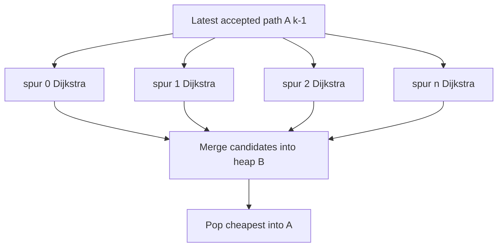
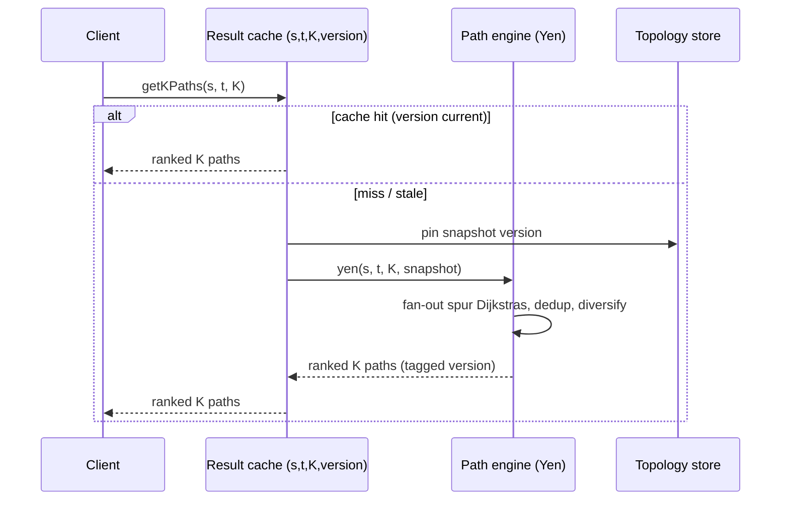

# Yen's Algorithm (K Shortest Loopless Paths) — Senior Level

> Yen is rarely the bottleneck when you ask for 3 routes on a 500-node mesh — but the moment "show me K alternative paths" becomes a request-path feature of a routing or resilience service, every property (K·V Dijkstra calls, candidate-set growth, near-duplicate results, full recomputation on topology change) becomes a latency-budget, memory, and operational concern.

## Table of Contents
1. [Introduction](#1-introduction)
2. [System Design with a K-Best Path Service](#2-system-design-with-a-k-best-path-service)
3. [Scaling the Spur Computations](#3-scaling-the-spur-computations)
4. [Candidate Deduplication and Diversity at Scale](#4-candidate-deduplication-and-diversity-at-scale)
5. [Concurrency](#5-concurrency)
6. [Comparison at Scale](#6-comparison-at-scale)
7. [Architecture Patterns](#7-architecture-patterns)
8. [Code Examples](#8-code-examples)
9. [Observability](#9-observability)
10. [Failure Modes](#10-failure-modes)
11. [Capacity Planning](#11-capacity-planning)
12. [Summary](#12-summary)

---

## 1. Introduction

At the senior level the question is no longer "how does the spur/root loop work" but "where does a k-shortest-paths computation belong in my system, and what breaks when it does?" Yen produces `K` ranked loopless paths by running up to `K·V` Dijkstra calls on a *mutating* (edge/node-removed) view of the graph. That description alone tells you three things:

- It is **CPU-bound and latency-variable** — cost scales with `K`, path length, and graph density, so a naive in-request implementation has an unbounded tail.
- Its candidate set `B` can grow to **`O(K·V)`** entries, each a full path — a memory and dedup concern.
- The results are **only as fresh as the graph snapshot** — any topology change invalidates them.

The interesting senior decisions are therefore architectural. A useful framing: Yen is a thin combinatorial wrapper (`A`, `B`, spur/root bookkeeping) around a very hot inner loop (point-to-point shortest path). Almost every senior decision is really a decision about *that inner loop* — how fast it is, whether its results can be cached or reused across spurs, and how its latency variance propagates to the request. Keep that mental model and the rest follows:

1. Should K-best paths be computed **per request**, **precomputed and cached**, or **incrementally maintained**?
2. How do you **bound the latency tail** of an algorithm whose cost depends on `K·V`?
3. How do you **parallelize** the independent spur Dijkstras safely?
4. How do you keep results **diverse** (not three near-identical routes) without breaking exactness?
5. How do you observe and **fail gracefully** when a request asks for more paths than exist or than your budget allows?

---

## 2. System Design with a K-Best Path Service

### 2.1 Per-request vs precomputed vs incremental

```mermaid
flowchart LR
    A[Per-request Yen<br/>K*V Dijkstras inline<br/>always fresh<br/>latency varies] --> B[Precomputed K paths<br/>per popular s-t pair<br/>cached, O(1) serve<br/>stale on change]
    B --> C[Incremental / hierarchical<br/>CH-backed spur queries<br/>fast + updatable<br/>road-network scale]
    style A fill:#e8f4ff,stroke:#0366d6
    style B fill:#fff4e8,stroke:#d97706
    style C fill:#ffe8e8,stroke:#dc2626
```

| Approach | When right | When wrong |
| --- | --- | --- |
| Per-request Yen | Small K, moderate graph, fresh results required, low QPS. | High QPS, large K, latency SLA tight. |
| Precompute K paths per hot `(s,t)` pair | A known, small set of popular origin-destination pairs (data-center links, fixed lanes). | Arbitrary `(s,t)` pairs; graph changes often. |
| CH/ALT-backed incremental | Road networks, large V, queries + updates both matter. | Small graphs where the engineering overhead isn't justified. |

The most expensive mistake is running per-request Yen with a large `K` on a hot path: the `K·V` Dijkstra factor makes the p99 latency explode under load, and there is no early exit to save you.

### 2.2 What the K paths actually buy you

A ranked set of loopless paths turns a single-route system into one that can **fail over**, **load-balance**, and **offer choice**. For a network controller, the 2nd and 3rd paths are pre-validated backups installed in the forwarding table so a link failure reroutes in microseconds. For a maps API, they are the "alternative routes" ribbon. The cost is the compute (per request or per precompute) and the staleness window between topology change and recomputation.

### 2.3 Anatomy of a k-best path service

A production service is three decoupled stages, each with its own scaling and failure profile:

1. **Topology store.** The source of truth for nodes, edges, and weights — a graph DB, a link-state database (OSPF/IS-IS), or a config table. It owns *what the graph is*; it emits change events.
2. **Path engine.** A pool of stateless workers that, given `(s, t, K)` and a graph snapshot version, run Yen (with a fast inner oracle), apply diversity filtering, and return ranked paths. CPU-bound; scales horizontally with QPS and with `K`.
3. **Result cache / forwarding layer.** Caches results keyed by `(s, t, K, snapshotVersion)` and serves them in `O(1)`, or installs them into a forwarding table. Invalidated on snapshot bump.

```mermaid
flowchart LR
    T[Topology store<br/>nodes + edges + weights] -->|snapshot v| E[Path engine pool<br/>Yen + A*/CH + diversity]
    T -->|change events| INV[Cache invalidator]
    E -->|ranked K paths| Cache[(Result cache<br/>key: s,t,K,version)]
    INV --> Cache
    Cache -->|O(1) serve| Clients
    E -->|install| FIB[Forwarding tables / SDN controller]
```

The key property is that **the engine is stateless and the cache is versioned**. A topology change bumps the snapshot version; in-flight engine work tagged with the old version is discarded or recomputed; the cache invalidates entries for affected `(s,t)` pairs. Versioning every result lets you trace any served path back to the exact topology it was computed against — essential when a "wrong route" incident is investigated.

---

## 3. Scaling the Spur Computations

### 3.1 The independent-spur observation

Within one Yen iteration, the spur Dijkstras for different spur nodes are **mutually independent**: each operates on its own removal set and reads (never writes) the shared graph. That makes them embarrassingly parallel. A worker can fan out the spur nodes of the latest accepted path across a thread pool, collect the candidates, and merge them into `B` under a single lock (or a lock-free concurrent heap).



The catch: only the *intra-iteration* spurs are parallel. Across iterations there is a **sequential dependency** — you must pop the next `A[k]` before you know which path to spur from next. So Yen parallelizes *within* an iteration but is *serial across* iterations. With Lawler's deviation index, the per-iteration spur count is smaller, which both speeds things up and *reduces* available parallelism — a tradeoff to measure.

### 3.2 Faster inner oracle

The Dijkstra term dominates `O(K·V·(E + V log V))`. On geometric or road graphs, replace it:

- **A\*** with an admissible heuristic (straight-line distance) prunes the search toward `t`, often 5–50× faster per spur path.
- **Contraction Hierarchies (CH)** or **hub labels** answer point-to-point queries in microseconds after preprocessing — but the removal sets complicate CH, since CH assumes a static graph. A common compromise: use CH for the *first* shortest path and bounded local Dijkstra/A\* for the spur detours, which only ever differ from the optimum near the deviation.

### 3.3 Bounding the work

Because output is nondecreasing, you can impose a **cost ceiling** (`stop when heap-min > cost(A[0]) · (1 + ε)`) or a **time budget** (return the best-found-so-far when the deadline hits). Both convert Yen from "unbounded exact" to "bounded best-effort," which is what a latency-SLA service actually needs.

### 3.4 Reusing the shortest-path tree across spurs

A subtle but high-value optimization: every spur Dijkstra from spur node `v` computes distances toward `t` on a graph that differs from the *full* graph only by a handful of removed edges/nodes near the root. The reverse shortest-path tree to `t` (computed once on the unmodified graph) is a near-perfect oracle for the parts of the spur search untouched by removals. Techniques in the **replacement-paths** literature (Malik-Mittal-Gupta, Hershberger-Suri) compute the shortest detour around *each* edge of a path in `O(m + n log n)` *total* rather than one full Dijkstra per edge. Folding this in turns a spur round's `O(V · (E + V log V))` into closer to `O(E + V log V)` — the single biggest constant-factor win available to a production Yen, and the reason mature routing engines rarely run `V` independent Dijkstras per accepted path.

### 3.5 The latency distribution, not the mean

Yen's per-request cost depends on `K`, the path lengths, and how many spur nodes yield valid detours — all input-dependent. The result is a **heavy-tailed latency distribution**: most `(s,t)` pairs are cheap, a few (long paths through dense regions) are expensive. Capacity planning on the *mean* underprovisions for the tail. Track the full histogram, size the pool for p99, and shed or downgrade (smaller `K`, looser cost ceiling) the worst offenders rather than letting them consume a worker for seconds.

---

## 4. Candidate Deduplication and Diversity at Scale

### 4.1 Deduplication

`B` can accumulate `O(K·V)` candidates, and the same total path can be generated from multiple spur nodes. Dedup is mandatory:

- **Path-key hashing.** Hash the vertex sequence (e.g. a 64-bit rolling hash) and keep a `seen` set. Cheaper than storing full path strings.
- **Dedup on push**, not on pop — a duplicate that reaches `B` wastes heap space and risks being accepted twice.

### 4.2 The near-duplicate problem

Exact KSP frequently returns paths that differ by a single edge — three "alternatives" that are 95% the same road. For a UI or a resilience plan this is useless: you want *genuinely different* options, ideally **node- or edge-disjoint**.

| Diversity strategy | Idea | Tradeoff |
| --- | --- | --- |
| Jaccard/overlap filter | Accept a candidate only if edge-overlap with accepted paths < threshold. | Greedy heuristic; may skip the true 2nd-shortest. |
| Penalty / plateau method | Inflate weights of already-used edges, rerun. | Not exact KSP; fast, very diverse. |
| Disjoint paths (Suurballe) | Compute genuinely node/edge-disjoint pair. | Exact only for 2 disjoint paths, not general K. |

A pragmatic production pattern: run Yen to get an over-supply of, say, `3K` exact paths, then **greedily select** `K` of them maximizing pairwise dissimilarity. You keep exactness in ranking but deliver diversity in the result.

```python
def select_diverse(paths, k, max_overlap=0.6):
    """paths: ranked-cheapest-first list of vertex sequences. Greedy diverse pick."""
    chosen = []
    for p in paths:
        ep = set(zip(p, p[1:]))
        ok = True
        for q in chosen:
            eq = set(zip(q, q[1:]))
            if len(ep & eq) / max(1, len(ep | eq)) > max_overlap:
                ok = False
                break
        if ok:
            chosen.append(p)
        if len(chosen) == k:
            break
    return chosen
```

The cost: you must compute *more* than `K` exact paths (more spur Dijkstras), and you sacrifice the guarantee that the returned set is the exact K-cheapest — it is the K-cheapest-subject-to-diversity. For UIs and resilience plans that tradeoff is almost always worth it; for billing or SLA-bound shortest-cost routing it is not.

### 4.3 Disjointness for resilience

For failover you specifically want **link-disjoint** or **node-disjoint** backups, so a single failure can't kill both primary and backup. Suurballe's algorithm gives an optimal disjoint *pair* directly; for `K > 2` disjoint paths, layer a disjointness constraint into Yen's removal sets (remove all edges of accepted paths before computing the next) — this yields disjoint, not strictly shortest, alternatives.

---

## 5. Concurrency

The spur Dijkstras read the shared graph and write only their local state, so the graph can be shared **read-only** across threads without locks. The shared mutable state is the candidate heap `B` and the `seen` dedup set.

| Shared structure | Hazard | Mitigation |
| --- | --- | --- |
| Candidate heap `B` | Concurrent push from parallel spurs | Lock around push, or a concurrent/striped priority queue; or each worker keeps a local heap, merge at barrier. |
| `seen` dedup set | Race on membership check | Concurrent hash set, or dedup at the merge barrier. |
| Graph | None if read-only | Never mutate the graph; pass removals as immutable sets. |
| Topology version | Snapshot changes mid-compute | Pin a snapshot version at request start; ignore later changes. |

A clean pattern is **map-reduce per iteration**: fan spur nodes to workers (map), each returns a list of candidates; the coordinator merges them into `B` and dedups (reduce), then pops the next `A[k]`. No lock contention inside the spurs, a single merge point per iteration.

---

## 6. Comparison at Scale

| Attribute | Yen (per request) | Yen (precomputed/cached) | Eppstein | Penalty/plateau heuristic |
| --- | --- | --- | --- | --- |
| Loopless guarantee | Yes | Yes | No | No (approximate) |
| Latency under load | High tail (`K·V` Dijkstra) | `O(1)` serve | Low (`~one tree + K`) | Low |
| Freshness | Always fresh | Stale until recompute | Always fresh | Always fresh |
| Memory | `O(K·V)` candidates | `O(K · paths)` cached | `O(E + K)` | `O(E)` |
| Diversity | Poor (needs filter) | Same | Poor | Good |
| Best regime | Small K, fresh, low QPS | Hot `(s,t)` pairs | Large K, loops OK | Diverse routes, speed > exactness |

At scale the decision is rarely "Yen vs not Yen" but "Yen *where*": inline for cold, low-K queries; cached for hot pairs; replaced by Eppstein when looplessness isn't required; augmented with a diversity layer almost always.

---

## 7. Architecture Patterns



- **Precompute-and-serve** for a fixed set of hot origin-destination pairs (data-center fabric, fixed shipping lanes): run Yen offline per pair, store the ranked paths, serve `O(1)`, recompute on topology change.
- **Request-coalescing**: many clients asking for the same `(s,t,K)` during a cache miss should share **one** engine computation (single-flight), not stampede the CPU-heavy engine.
- **Budget-bounded best-effort**: every request carries a deadline; the engine returns the best-ranked subset found by then, never blocking the caller indefinitely.

### 7.1 Warm vs cold path engineering

A mature deployment splits traffic into two lanes. **Warm lane:** a known set of hot `(s,t)` pairs (data-center fabric links, the top-N city pairs) whose K paths are precomputed offline and refreshed on topology change — served in `O(1)` from the cache, never touching the engine. **Cold lane:** arbitrary one-off `(s,t)` queries that miss the cache and run per-request Yen under a strict deadline. Sizing the warm lane to absorb 80–95% of traffic is what makes the cold lane's heavy tail tolerable: you only pay `K·V` Dijkstras for the long tail of unique queries, not for the bulk. The warm set is identified by sampling production query logs and is itself recomputed as traffic patterns drift.

### 7.2 Failover install pattern

For network resilience, the K paths are not *served* to a client — they are *installed* into forwarding hardware as primary + backups. The pattern: compute the top `K` node-disjoint-ish paths offline, push the primary into the active FIB and the backups into a standby table, and arm a fast local-repair trigger (BFD/link-down detection) that promotes a backup in microseconds without re-running Yen. Yen runs on the *control-plane* timescale (seconds, on topology change); failover happens on the *data-plane* timescale (microseconds, precomputed). Conflating the two — trying to run Yen at packet-forwarding speed — is the classic architectural error here.

---

## 8. Code Examples

### Parallel-per-iteration Yen (fan-out spurs)

A thread-safe sketch: the spur Dijkstras run concurrently and merge into a guarded heap.

#### Go

```go
package main

import (
	"sort"
	"sync"
)

type Graph map[int]map[int]int

type Path struct {
	Nodes []int
	Cost  int
	Dev   int
}

// dijkstraRem is assumed to exist: shortest s->t avoiding removed edges/nodes.
// func dijkstraRem(g Graph, s, t int, remE map[[2]int]bool, remN map[int]bool) (Path, bool)

func YenParallel(g Graph, s, t, k int,
	dijkstraRem func(Graph, int, int, map[[2]int]bool, map[int]bool) (Path, bool)) []Path {

	first, ok := dijkstraRem(g, s, t, nil, nil)
	if !ok {
		return nil
	}
	A := []Path{first}
	type cand = Path
	var B []cand
	seen := map[string]bool{keyInt(first.Nodes): true}

	for len(A) < k {
		prev := A[len(A)-1]
		var mu sync.Mutex
		var wg sync.WaitGroup
		// fan out independent spur computations
		for i := prev.Dev; i < len(prev.Nodes)-1; i++ {
			wg.Add(1)
			go func(i int) {
				defer wg.Done()
				spur := prev.Nodes[i]
				root := prev.Nodes[:i+1]
				remE := map[[2]int]bool{}
				for _, p := range A {
					if len(p.Nodes) > i && keyInt(p.Nodes[:i+1]) == keyInt(root) {
						remE[[2]int{p.Nodes[i], p.Nodes[i+1]}] = true
					}
				}
				remN := map[int]bool{}
				for _, n := range root[:len(root)-1] {
					remN[n] = true
				}
				sp, ok := dijkstraRem(g, spur, t, remE, remN)
				if !ok {
					return
				}
				total := append(append([]int{}, root[:len(root)-1]...), sp.Nodes...)
				mu.Lock()
				if !seen[keyInt(total)] {
					seen[keyInt(total)] = true
					B = append(B, cand{total, pathCost(g, root) + sp.Cost, i})
				}
				mu.Unlock()
			}(i)
		}
		wg.Wait()
		if len(B) == 0 {
			break
		}
		sort.Slice(B, func(a, b int) bool { return B[a].Cost < B[b].Cost })
		A = append(A, B[0])
		B = B[1:]
	}
	return A
}

func keyInt(p []int) string {
	b := make([]byte, 0, len(p)*3)
	for _, x := range p {
		b = append(b, byte(x), ',')
	}
	return string(b)
}

func pathCost(g Graph, p []int) int {
	c := 0
	for i := 0; i+1 < len(p); i++ {
		c += g[p[i]][p[i+1]]
	}
	return c
}
```

#### Java

```java
import java.util.*;
import java.util.concurrent.*;

public class YenParallel {
    record Path(List<Integer> nodes, int cost, int dev) {}

    interface Oracle { Path shortest(int s, int t, Set<List<Integer>> remE, Set<Integer> remN); }

    static List<Path> yen(int s, int t, int k, Oracle oracle,
                          java.util.function.BiFunction<List<Integer>, List<Integer>, Integer> dummy)
            throws InterruptedException {
        Path first = oracle.shortest(s, t, Set.of(), Set.of());
        if (first == null) return List.of();
        List<Path> A = new ArrayList<>(List.of(first));
        PriorityQueue<Path> B = new PriorityQueue<>(Comparator.comparingInt(Path::cost));
        Set<String> seen = ConcurrentHashMap.newKeySet();
        seen.add(first.nodes().toString());
        ExecutorService pool = Executors.newWorkStealingPool();

        while (A.size() < k) {
            Path prev = A.get(A.size() - 1);
            List<Callable<Path>> tasks = new ArrayList<>();
            for (int i = prev.dev(); i < prev.nodes().size() - 1; i++) {
                final int idx = i;
                tasks.add(() -> {
                    int spur = prev.nodes().get(idx);
                    List<Integer> root = new ArrayList<>(prev.nodes().subList(0, idx + 1));
                    Set<List<Integer>> remE = new HashSet<>();
                    synchronized (A) {
                        for (Path p : A)
                            if (p.nodes().size() > idx
                                    && p.nodes().subList(0, idx + 1).equals(root))
                                remE.add(List.of(p.nodes().get(idx), p.nodes().get(idx + 1)));
                    }
                    Set<Integer> remN = new HashSet<>(root.subList(0, root.size() - 1));
                    Path sp = oracle.shortest(spur, t, remE, remN);
                    if (sp == null) return null;
                    List<Integer> total = new ArrayList<>(root.subList(0, root.size() - 1));
                    total.addAll(sp.nodes());
                    if (!seen.add(total.toString())) return null;
                    return new Path(total, 0, idx); // cost filled by caller
                });
            }
            for (Future<Path> f : pool.invokeAll(tasks)) {
                try { Path c = f.get(); if (c != null) B.add(c); }
                catch (ExecutionException ignored) {}
            }
            if (B.isEmpty()) break;
            A.add(B.poll());
        }
        pool.shutdown();
        return A;
    }
}
```

#### Python

```python
import heapq
from concurrent.futures import ThreadPoolExecutor


def yen_parallel(g, s, t, k, dijkstra_rem, workers=8):
    """dijkstra_rem(g, s, t, rem_e, rem_n) -> (nodes, cost) or None."""
    first = dijkstra_rem(g, s, t, frozenset(), frozenset())
    if first is None:
        return []
    A = [(first[1], first[0], 0)]
    B, seen = [], {tuple(first[0])}

    def spur_job(prev, i):
        nodes = prev[1]
        spur = nodes[i]
        root = nodes[: i + 1]
        rem_e = {(p[1][i], p[1][i + 1]) for p in A
                 if len(p[1]) > i and p[1][: i + 1] == root}
        rem_n = frozenset(root[:-1])
        sp = dijkstra_rem(g, spur, t, frozenset(rem_e), rem_n)
        if sp is None:
            return None
        total = tuple(root[:-1] + sp[0])
        cost = sum(g[root[j]][root[j + 1]] for j in range(len(root) - 1)) + sp[1]
        return cost, total, i

    with ThreadPoolExecutor(max_workers=workers) as pool:
        while len(A) < k:
            prev = A[-1]
            futures = [pool.submit(spur_job, prev, i)
                       for i in range(prev[2], len(prev[1]) - 1)]
            for f in futures:
                res = f.result()
                if res and res[1] not in seen:
                    seen.add(res[1])
                    heapq.heappush(B, res)
            if not B:
                break
            A.append(heapq.heappop(B))
    return A
```

**What it does:** fans the independent spur Dijkstras of one iteration across a worker pool, merges candidates into a guarded heap, then promotes the cheapest — the standard way to use multiple cores while respecting the cross-iteration serial dependency. (In Python, the GIL limits speedup unless the oracle releases it; use processes or a C extension for real parallelism.)

---

## 9. Observability

| Metric | Why it matters | Alert threshold |
|--------|----------------|-----------------|
| `ksp_latency_p99_ms` | Yen's tail scales with `K·V`. | > SLA (e.g. > 200 ms) |
| `spur_dijkstra_count` | Direct proxy for work done per request. | > expected `K·V` (suggests dedup/Lawler broken) |
| `candidate_heap_size_max` | `B` growth; memory risk. | > `c · K · V` |
| `paths_returned / paths_requested` | Detects "fewer than K exist". | < 1.0 sustained (capacity or graph issue) |
| `diversity_jaccard_avg` | Are results actually different? | > 0.9 (too similar) |
| `cache_hit_ratio` | Effectiveness of result caching. | < 0.7 |
| `stale_result_served` | Served against an outdated snapshot. | any (page on it) |

Trace each request with `(s, t, K, snapshotVersion, spurCount, durationMs)` so a slow request can be reproduced exactly.

A useful derived signal is **spur efficiency** = `paths_returned / spur_dijkstra_count`. Healthy Yen returns one path per `O(V)` spurs; a sudden drop means either dedup is failing (spurs producing duplicates) or the graph region is path-poor (many dead-end spurs). Both are actionable: the former is a code bug, the latter a signal to lower `K` or widen the cost ceiling for that region.

---

## 10. Failure Modes

- **Latency blow-up under load.** Large `K` on dense graphs → `K·V` Dijkstras → p99 explodes. *Mitigate:* cap `K`, impose a time budget, cache hot pairs, use A\*/CH inner oracle.
- **Fewer paths than requested.** The graph has < K simple paths; naive code loops or errors. *Mitigate:* stop on empty `B`, return what exists, surface the count.
- **Near-duplicate results.** Three "alternatives" are 95% identical, useless to the user. *Mitigate:* diversity filter / over-fetch-then-select / disjoint-path constraint.
- **Stale paths after topology change.** A link went down but cached paths still route over it. *Mitigate:* versioned snapshots, event-driven invalidation, install-time validation.
- **Candidate-heap memory blow-up.** Missing dedup lets `B` grow unbounded. *Mitigate:* dedup on push, bound `B` size, prune.
- **Negative weights slip in.** A mis-signed cost makes Dijkstra (and thus Yen) wrong silently. *Mitigate:* validate weights ≥ 0 at ingest; reject or switch subroutine.
- **Cross-iteration races.** Parallel spurs mutate `A`/`B`/`seen` unsafely. *Mitigate:* read-only graph, guarded heap, merge-at-barrier.

---

## 11. Capacity Planning

### 11.1 Compute

Per request, expect up to `K·V` Dijkstra calls of `O(E + V log V)` each. For `K=5`, `V=2000`, `E=10000`: ~10,000 Dijkstras × ~50 μs ≈ **0.5 s** single-threaded — clearly needs caching or parallelism for an interactive SLA. With 8-way intra-iteration parallelism and Lawler trimming, sub-100 ms is reachable; with cached hot pairs, sub-millisecond.

### 11.2 Memory

`B` holds up to `O(K·V)` candidate paths, each up to `V` vertices: worst case `O(K·V²)` integers transiently. For `K=10`, `V=2000` that is ~40 M ints ≈ 160 MB transient — bound it with dedup and a heap-size cap. The result cache stores `K` paths per hot `(s,t)` pair; size it to the number of hot pairs × `K` × average path length.

### 11.3 Freshness

The staleness window is `time(topology change) → time(recompute + cache invalidate)`. For a routing controller this must be sub-second (links fail and must reroute fast); for a maps API, minutes are acceptable. Drive recomputation from change events, not a fixed timer, for hot pairs.

### 11.4 Worked sizing example

Suppose a maps backend serves 5,000 QPS of "give me 3 routes" over a regional graph of `V = 50,000`, `E = 130,000`, with a 150 ms p99 SLA.

```text
- Cache hit ratio (hot O-D pairs): 0.85 ⇒ 750 QPS reach the engine.
- Per engine request (K=3, A* inner oracle, Lawler): ~3·V spurs worst case,
  but A* + replacement-paths reuse ⇒ ~30 ms p50, ~120 ms p99.
- Engine cores needed (p99-sized): 750 req/s × 0.12 s ≈ 90 core-seconds/s
  ⇒ ~90 busy cores ⇒ ~120 cores with headroom (Little's law + 30% margin).
- Result cache: 200k hot pairs × 3 paths × ~40 vertices × 8 B ≈ 192 MB.
- Transient B per request: ≤ K·V candidates ≈ 150k entries, freed per request.
```

The dominant lever is the cache hit ratio: lifting it from 0.85 to 0.95 thirds the engine fleet. The second lever is the inner oracle — swapping plain Dijkstra for A\*/CH is what makes the per-request p99 fit the SLA at all. This is why "Yen at scale" is really "Yen as a small combinatorial wrapper around a very fast point-to-point oracle, fronted by an aggressive cache."

### 11.5 Multi-tenancy and fairness

When many callers share one engine pool, a single tenant requesting large `K` on dense subgraphs can starve others (the heavy tail of §3.5). Enforce **per-tenant concurrency limits** and a **global `K` cap**, and price/queue large-`K` requests separately. A token-bucket on `estimated_spur_count ≈ K · avg_path_len` is a better admission signal than raw QPS, because it reflects actual CPU cost rather than request count.

---

## 12. Summary

At senior level, Yen stops being "the spur/root loop" and becomes a **capacity and operability problem**. Its `K·V` Dijkstra factor gives an unbounded latency tail, so production systems **cap `K`, budget time, cache hot `(s,t)` pairs, and swap in A\*/CH inner oracles**. The intra-iteration spur Dijkstras are embarrassingly parallel (the cross-iteration dependency is serial), enabling map-reduce-per-iteration on a read-only graph with a guarded candidate heap. Raw KSP returns near-duplicates, so almost every real deployment layers **diversity filtering or disjoint-path constraints** on top. Results are only as fresh as their graph snapshot, demanding **versioned, event-invalidated caching**. Observe the spur count, heap size, returned-vs-requested ratio, and diversity; fail gracefully when fewer than `K` paths exist or the deadline hits.

---

**Next step:** Continue to [`professional.md`](./professional.md) for the formal correctness proof — why the spur + root construction enumerates loopless paths in nondecreasing order without omission or duplication — and the rigorous complexity derivation.
