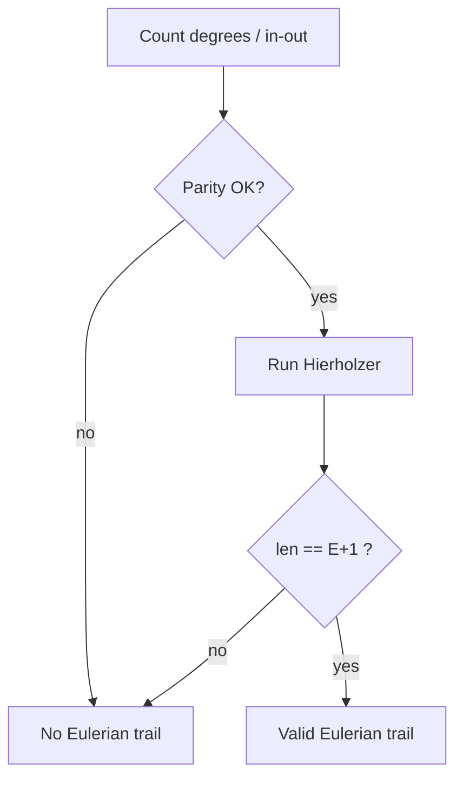

# Eulerian Path & Circuit — Junior Level

> **One-line summary:** An *Eulerian circuit* walks every edge of a graph exactly once and returns to its start; an *Eulerian path* walks every edge exactly once but ends somewhere else. Whether one exists depends only on vertex degrees and connectivity, and Hierholzer's algorithm builds one in `O(E)`.

---

## Table of Contents

1. [Introduction](#introduction)
2. [Prerequisites](#prerequisites)
3. [Glossary](#glossary)
4. [Core Concepts](#core-concepts)
5. [Big-O Summary](#big-o-summary)
6. [Real-World Analogies](#real-world-analogies)
7. [Pros & Cons](#pros--cons)
8. [Step-by-Step Walkthrough](#step-by-step-walkthrough)
9. [Code Examples](#code-examples)
10. [Coding Patterns](#coding-patterns)
11. [Error Handling](#error-handling)
12. [Performance Tips](#performance-tips)
13. [Best Practices](#best-practices)
14. [Edge Cases & Pitfalls](#edge-cases--pitfalls)
15. [Common Mistakes](#common-mistakes)
16. [Cheat Sheet](#cheat-sheet)
17. [Visual Animation](#visual-animation)
18. [Summary](#summary)
19. [Further Reading](#further-reading)

---

## Introduction

In 1736 the city of **Königsberg** had seven bridges across the river Pregel, connecting two riverbanks and two islands. A popular puzzle asked: *can you take a walk that crosses every bridge exactly once?* **Leonhard Euler** proved that you cannot — and in doing so he invented graph theory.

Euler's insight was to throw away everything about the city except the **connections**. The landmasses became *vertices*; the bridges became *edges*. The question "can I walk every bridge once?" became "does this graph have a trail that uses every edge exactly once?" Such a trail is now called an **Eulerian path**, and if it returns to where it started, an **Eulerian circuit**.

Euler's genius was to realize that the answer depends on a single local quantity: the **degree** of each vertex (how many edges touch it). Every time your walk *enters* a landmass it must also *leave*, so it consumes edges two at a time — one in, one out. A vertex you pass through therefore needs an **even** number of edges. The only vertices allowed an odd degree are the two endpoints of an open path (where you start and stop). In Königsberg, *all four* landmasses had an odd number of bridges, so no such walk could exist.

This file teaches you two things:

1. **The existence test** — a couple of degree counts and one connectivity check tell you instantly whether an Eulerian path or circuit exists.
2. **Hierholzer's algorithm** — once you know one exists, this `O(E)` procedure actually produces it by stitching small cycles together.

Eulerian trails are not a museum piece. They power **de Bruijn sequences**, **DNA genome assembly**, the **Chinese Postman** route-optimization problem, and every "draw this shape without lifting your pen" puzzle.

---

## Prerequisites

Before you read this file you should be comfortable with:

- **Graphs**: vertices and edges, directed vs undirected — see sibling topic *01-representation*.
- **Adjacency lists** — the standard way to store a graph.
- **Degree of a vertex** — the count of incident edges (for directed graphs, *in-degree* and *out-degree*).
- **Depth-first search (DFS)** basics — Hierholzer is a DFS-flavored traversal; see sibling topic *03-dfs*.
- **Connected components** — the idea that a graph may split into disconnected pieces.
- **Stacks** — the iterative Hierholzer uses an explicit stack.
- **Big-O notation** — `O(V)`, `O(E)`, `O(V + E)`.

Optional but helpful:

- A glance at *11-articulation-points-bridges* (the sibling topic Fleury's algorithm relies on).

---

## Glossary

| Term | Meaning |
|------|---------|
| **Trail** | A walk that may repeat vertices but never repeats an edge. |
| **Eulerian trail / path** | A trail that uses *every* edge of the graph exactly once. |
| **Eulerian circuit / cycle** | An Eulerian trail that starts and ends at the same vertex. |
| **Eulerian graph** | A graph that contains an Eulerian circuit. |
| **Semi-Eulerian graph** | A graph that has an Eulerian path but not a circuit. |
| **Degree** (undirected) | Number of edges incident to a vertex; a self-loop counts as 2. |
| **In-degree / out-degree** (directed) | Edges entering / leaving a vertex. |
| **Odd vertex** | A vertex of odd degree. |
| **Hierholzer's algorithm** | The standard `O(E)` method that builds an Eulerian trail by stitching cycles. |
| **Fleury's algorithm** | An older, slower `O(E²)` method that avoids crossing bridges. |
| **Bridge** | An edge whose removal disconnects the graph (see *11-articulation-points-bridges*). |
| **Multigraph** | A graph allowed to have multiple edges between the same pair of vertices. |
| **Connected (for Euler)** | All vertices that actually *have* edges lie in one component; isolated vertices are ignored. |

---

## Core Concepts

### 1. The Existence Conditions (Undirected)

Picture walking the trail. Each time you visit an intermediate vertex you use one edge to come in and one to go out, so you consume edges in pairs. Hence:

**Eulerian circuit exists** if and only if:
- **every** vertex has **even** degree, *and*
- all edges lie in a **single connected component** (isolated vertices with no edges are fine).

**Eulerian path (but not circuit) exists** if and only if:
- **exactly 0 or 2** vertices have **odd** degree, *and*
- all edges lie in a single connected component.

If there are 2 odd vertices, the path *must* start at one and end at the other. If there are 0 odd vertices, you get a circuit (which is also a path). Any other count (4, 6, …) means no Eulerian trail exists. The number of odd-degree vertices is always even — a handshake-lemma fact.

### 2. The Existence Conditions (Directed)

For a directed graph, replace "even degree" with "balanced":

**Eulerian circuit exists** if and only if:
- **every** vertex has `in-degree == out-degree`, *and*
- all vertices with at least one edge form a single **strongly connected** piece.

**Eulerian path exists** if and only if:
- **at most one** vertex has `out − in = +1` (this is the **start**),
- **at most one** vertex has `in − out = +1` (this is the **end**),
- every other vertex has `in == out`, *and*
- the relevant vertices are connected.

### 3. Hierholzer's Algorithm

Once you know a trail exists, Hierholzer builds it in linear time. The idea:

1. Start at a valid start vertex, follow unused edges, marking them used, until you return to where you cannot continue. (For a circuit this loop closes back on the start.)
2. If unused edges remain, find a vertex *on the current trail* that still has unused edges, walk a new closed loop from there, and **splice** it into the trail at that point.
3. Repeat until no edges remain.

The clean iterative version uses an explicit **stack**:

```
hierholzer(start):
    stack = [start]
    circuit = []
    while stack not empty:
        v = stack.top()
        if v still has an unused edge (v, w):
            mark (v, w) used
            stack.push(w)
        else:
            circuit.append(stack.pop())
    reverse(circuit)            # circuit is built backwards
    return circuit
```

Each edge is pushed and popped at most once, so the whole thing is `O(E)`.

### 4. Fleury's Algorithm (Historical)

Fleury's older method walks one edge at a time with one rule: **never cross a bridge unless it is the only edge left**. Checking "is this a bridge?" is expensive, so the whole algorithm is `O(E²)` (or `O(E·(V+E))`). It is intuitive but slow; **prefer Hierholzer** in practice. Fleury is the reason the sibling topic *11-articulation-points-bridges* matters here.

---

## Big-O Summary

| Operation | Time | Space | Notes |
|-----------|------|-------|-------|
| Degree / balance check | **O(V + E)** | O(V) | Count degrees, scan for odd / unbalanced. |
| Connectivity check | **O(V + E)** | O(V) | One BFS/DFS over non-isolated vertices. |
| Existence test (combined) | **O(V + E)** | O(V) | Degrees + connectivity. |
| Hierholzer's algorithm | **O(E)** | O(E) | Each edge visited once; stack + output. |
| Fleury's algorithm | **O(E²)** | O(V + E) | Bridge check per edge — avoid. |

`E` dominates `V` for connected graphs, so people often write Hierholzer as simply `O(E)`.

---

## Real-World Analogies

| Concept | Analogy |
|---------|---------|
| Eulerian circuit | A **mail carrier** who must walk down every street exactly once and return to the post office. If every intersection has an even number of streets, a perfect loop exists. |
| Eulerian path | A **one-stroke drawing** puzzle: trace the whole figure without lifting your pen or redrawing any line. Possible only when 0 or 2 corners have an odd number of lines. |
| Odd-degree vertex | A **dead-end-ish corner** where you can enter one more time than you leave (or vice versa) — only the start and end of an open trail may be like that. |
| Hierholzer's splicing | Walking a loop, then noticing a side-street you missed, walking that side-loop, and **inserting** it into your route at the junction. |
| Königsberg's failure | All four landmasses had an odd number of bridges, so the walk is like trying to draw an envelope shape that has *four* odd corners — impossible. |

Where the analogy breaks: a real mail route also cares about *distance*; Eulerian theory only cares about *using each edge once*. Optimizing distance when no Eulerian circuit exists is the **Chinese Postman** problem (covered in `middle.md`).

---

## Pros & Cons

| Pros | Cons |
|------|------|
| Existence is decidable in `O(V + E)` with trivial code (count degrees). | Only answers "use every *edge* once" — the *vertex* analogue (Hamiltonian) is NP-hard and unrelated. |
| Hierholzer constructs an actual trail in optimal `O(E)`. | Requires a correct connectivity check on the **edge-induced** subgraph (a classic bug source). |
| Works on directed, undirected, and multigraphs with self-loops. | The recursive form can blow the call stack; you usually need the iterative stack version. |
| Underpins de Bruijn sequences and genome assembly. | The trail is not unique — different runs may yield different valid trails. |
| Conditions are *necessary and sufficient* (provable), not heuristics. | Fleury's intuitive variant is `O(E²)` and a trap for beginners. |

**When to use:** "cover every connection exactly once" problems — DNA assembly, circuit board routing, snow-plow / street-sweeper routing, word-chain puzzles, one-stroke drawings.

**When NOT to use:** when you must visit every *vertex* once (Hamiltonian / TSP — see *28-np-hard-tsp-hamiltonian*), or when you must minimize travel distance over edges you may reuse.

---

## Step-by-Step Walkthrough

Take this small **undirected** graph (a square `0-1-2-3` with a diagonal `0-2`):

```
edges: 0-1, 1-2, 2-3, 3-0, 0-2

degrees: deg(0)=3, deg(1)=2, deg(2)=3, deg(3)=2
```

Two vertices (0 and 2) have **odd** degree, the other two are even, and the graph is connected. So an **Eulerian path** exists and **must start at 0 and end at 2** (or vice versa).

Run Hierholzer from vertex `0` using the stack method. We track the stack and the output `circuit`:

```
stack=[0]                      take edge 0-1   -> stack=[0,1]
stack=[0,1]                    take edge 1-2   -> stack=[0,1,2]
stack=[0,1,2]                  take edge 2-3   -> stack=[0,1,2,3]
stack=[0,1,2,3]                take edge 3-0   -> stack=[0,1,2,3,0]
stack=[0,1,2,3,0]  vertex 0 has unused edge 0-2 -> stack=[0,1,2,3,0,2]
stack=[0,1,2,3,0,2] vertex 2 has no unused edge -> pop 2, circuit=[2]
stack=[0,1,2,3,0]   vertex 0 done              -> pop 0, circuit=[2,0]
stack=[0,1,2,3]     vertex 3 done              -> pop 3, circuit=[2,0,3]
stack=[0,1,2]       vertex 2 done              -> pop 2, circuit=[2,0,3,2]
stack=[0,1]         vertex 1 done              -> pop 1, circuit=[2,0,3,2,1]
stack=[0]           vertex 0 done              -> pop 0, circuit=[2,0,3,2,1,0]
```

Reverse the output: **`0 - 1 - 2 - 3 - 0 - 2`**. Check it: that uses edges `0-1, 1-2, 2-3, 3-0, 0-2` — all five, each once — and it starts at `0`, ends at `2`. Correct.

---

## Code Examples

### Example: Hierholzer for an Undirected Graph

#### Go

```go
package main

import "fmt"

// EulerianUndirected returns an Eulerian trail (path or circuit) over all edges,
// or nil if none exists. Edges are given as pairs; multigraph + self-loops OK.
func EulerianUndirected(n int, edges [][2]int) []int {
	// adjacency stores (neighbor, edgeID); used[edgeID] guards each edge once.
	type half struct{ to, id int }
	adj := make([][]half, n)
	deg := make([]int, n)
	for id, e := range edges {
		u, v := e[0], e[1]
		adj[u] = append(adj[u], half{v, id})
		adj[v] = append(adj[v], half{u, id})
		deg[u]++
		deg[v]++
	}

	// Pick a start: a vertex of odd degree if any, else any vertex with edges.
	start, odd := -1, 0
	for v := 0; v < n; v++ {
		if deg[v]%2 == 1 {
			odd++
			start = v
		}
		if start == -1 && deg[v] > 0 {
			start = v
		}
	}
	if odd != 0 && odd != 2 {
		return nil // no Eulerian trail
	}
	if start == -1 {
		return []int{} // no edges at all
	}

	used := make([]bool, len(edges))
	iter := make([]int, n) // next index to scan in adj[v]
	stack := []int{start}
	var circuit []int
	for len(stack) > 0 {
		v := stack[len(stack)-1]
		advanced := false
		for iter[v] < len(adj[v]) {
			h := adj[v][iter[v]]
			iter[v]++
			if !used[h.id] {
				used[h.id] = true
				stack = append(stack, h.to)
				advanced = true
				break
			}
		}
		if !advanced {
			circuit = append(circuit, v)
			stack = stack[:len(stack)-1]
		}
	}
	if len(circuit) != len(edges)+1 {
		return nil // disconnected: not all edges reachable
	}
	// reverse
	for i, j := 0, len(circuit)-1; i < j; i, j = i+1, j-1 {
		circuit[i], circuit[j] = circuit[j], circuit[i]
	}
	return circuit
}

func main() {
	edges := [][2]int{{0, 1}, {1, 2}, {2, 3}, {3, 0}, {0, 2}}
	fmt.Println(EulerianUndirected(4, edges)) // e.g. [0 1 2 3 0 2]
}
```

#### Java

```java
import java.util.*;

public class EulerUndirected {
    // Returns an Eulerian trail over all edges, or null if none exists.
    public static List<Integer> eulerian(int n, int[][] edges) {
        List<int[]>[] adj = new List[n]; // each entry: {neighbor, edgeId}
        for (int i = 0; i < n; i++) adj[i] = new ArrayList<>();
        int[] deg = new int[n];
        for (int id = 0; id < edges.length; id++) {
            int u = edges[id][0], v = edges[id][1];
            adj[u].add(new int[]{v, id});
            adj[v].add(new int[]{u, id});
            deg[u]++; deg[v]++;
        }

        int start = -1, odd = 0;
        for (int v = 0; v < n; v++) {
            if (deg[v] % 2 == 1) { odd++; start = v; }
            if (start == -1 && deg[v] > 0) start = v;
        }
        if (odd != 0 && odd != 2) return null;
        if (start == -1) return new ArrayList<>();

        boolean[] used = new boolean[edges.length];
        int[] iter = new int[n];
        Deque<Integer> stack = new ArrayDeque<>();
        stack.push(start);
        LinkedList<Integer> circuit = new LinkedList<>();
        while (!stack.isEmpty()) {
            int v = stack.peek();
            boolean advanced = false;
            while (iter[v] < adj[v].size()) {
                int[] h = adj[v].get(iter[v]++);
                if (!used[h[1]]) {
                    used[h[1]] = true;
                    stack.push(h[0]);
                    advanced = true;
                    break;
                }
            }
            if (!advanced) circuit.addFirst(stack.pop());
        }
        if (circuit.size() != edges.length + 1) return null; // disconnected
        return circuit;
    }

    public static void main(String[] args) {
        int[][] edges = {{0, 1}, {1, 2}, {2, 3}, {3, 0}, {0, 2}};
        System.out.println(eulerian(4, edges));
    }
}
```

#### Python

```python
def eulerian_undirected(n, edges):
    """Return an Eulerian trail over all edges, or None if none exists."""
    adj = [[] for _ in range(n)]          # adj[v] = list of (neighbor, edge_id)
    deg = [0] * n
    for eid, (u, v) in enumerate(edges):
        adj[u].append((v, eid))
        adj[v].append((u, eid))
        deg[u] += 1
        deg[v] += 1

    start, odd = -1, 0
    for v in range(n):
        if deg[v] % 2 == 1:
            odd += 1
            start = v
        if start == -1 and deg[v] > 0:
            start = v
    if odd not in (0, 2):
        return None
    if start == -1:
        return []                          # no edges

    used = [False] * len(edges)
    it = [0] * n                           # next index to scan in adj[v]
    stack = [start]
    circuit = []
    while stack:
        v = stack[-1]
        advanced = False
        while it[v] < len(adj[v]):
            w, eid = adj[v][it[v]]
            it[v] += 1
            if not used[eid]:
                used[eid] = True
                stack.append(w)
                advanced = True
                break
        if not advanced:
            circuit.append(stack.pop())
    if len(circuit) != len(edges) + 1:
        return None                        # disconnected
    return circuit[::-1]


if __name__ == "__main__":
    edges = [(0, 1), (1, 2), (2, 3), (3, 0), (0, 2)]
    print(eulerian_undirected(4, edges))   # e.g. [0, 1, 2, 3, 0, 2]
```

**What it does:** checks degree parity, runs iterative Hierholzer, and confirms all edges were consumed (catching disconnection).
**Run:** `go run main.go` | `javac EulerUndirected.java && java EulerUndirected` | `python euler.py`

### Example: Hierholzer for a Directed Graph

#### Go

```go
package main

import "fmt"

// EulerianDirected returns a directed Eulerian trail over all arcs, or nil.
func EulerianDirected(n int, edges [][2]int) []int {
	adj := make([][]int, n)
	outd := make([]int, n)
	ind := make([]int, n)
	for _, e := range edges {
		u, v := e[0], e[1]
		adj[u] = append(adj[u], v)
		outd[u]++
		ind[v]++
	}

	start, plus, minus := -1, 0, 0
	for v := 0; v < n; v++ {
		d := outd[v] - ind[v]
		switch {
		case d == 1:
			plus++
			start = v
		case d == -1:
			minus++
		case d != 0:
			return nil // imbalance > 1
		}
		if start == -1 && outd[v] > 0 {
			start = v
		}
	}
	if !(plus == 0 && minus == 0) && !(plus == 1 && minus == 1) {
		return nil
	}
	if start == -1 {
		return []int{}
	}

	iter := make([]int, n)
	stack := []int{start}
	var circuit []int
	for len(stack) > 0 {
		v := stack[len(stack)-1]
		if iter[v] < len(adj[v]) {
			w := adj[v][iter[v]]
			iter[v]++
			stack = append(stack, w)
		} else {
			circuit = append(circuit, v)
			stack = stack[:len(stack)-1]
		}
	}
	if len(circuit) != len(edges)+1 {
		return nil
	}
	for i, j := 0, len(circuit)-1; i < j; i, j = i+1, j-1 {
		circuit[i], circuit[j] = circuit[j], circuit[i]
	}
	return circuit
}

func main() {
	edges := [][2]int{{0, 1}, {1, 2}, {2, 0}, {0, 2}, {2, 1}, {1, 0}}
	fmt.Println(EulerianDirected(3, edges))
}
```

#### Java

```java
import java.util.*;

public class EulerDirected {
    public static List<Integer> eulerian(int n, int[][] edges) {
        List<Integer>[] adj = new List[n];
        for (int i = 0; i < n; i++) adj[i] = new ArrayList<>();
        int[] outd = new int[n], ind = new int[n];
        for (int[] e : edges) {
            adj[e[0]].add(e[1]);
            outd[e[0]]++; ind[e[1]]++;
        }

        int start = -1, plus = 0, minus = 0;
        for (int v = 0; v < n; v++) {
            int d = outd[v] - ind[v];
            if (d == 1) { plus++; start = v; }
            else if (d == -1) { minus++; }
            else if (d != 0) return null;
            if (start == -1 && outd[v] > 0) start = v;
        }
        if (!((plus == 0 && minus == 0) || (plus == 1 && minus == 1))) return null;
        if (start == -1) return new ArrayList<>();

        int[] iter = new int[n];
        Deque<Integer> stack = new ArrayDeque<>();
        stack.push(start);
        LinkedList<Integer> circuit = new LinkedList<>();
        while (!stack.isEmpty()) {
            int v = stack.peek();
            if (iter[v] < adj[v].size()) {
                stack.push(adj[v].get(iter[v]++));
            } else {
                circuit.addFirst(stack.pop());
            }
        }
        if (circuit.size() != edges.length + 1) return null;
        return circuit;
    }

    public static void main(String[] args) {
        int[][] edges = {{0, 1}, {1, 2}, {2, 0}, {0, 2}, {2, 1}, {1, 0}};
        System.out.println(eulerian(3, edges));
    }
}
```

#### Python

```python
def eulerian_directed(n, edges):
    """Return a directed Eulerian trail over all arcs, or None if none exists."""
    adj = [[] for _ in range(n)]
    outd = [0] * n
    ind = [0] * n
    for u, v in edges:
        adj[u].append(v)
        outd[u] += 1
        ind[v] += 1

    start, plus, minus = -1, 0, 0
    for v in range(n):
        d = outd[v] - ind[v]
        if d == 1:
            plus += 1
            start = v
        elif d == -1:
            minus += 1
        elif d != 0:
            return None
        if start == -1 and outd[v] > 0:
            start = v
    if not ((plus == 0 and minus == 0) or (plus == 1 and minus == 1)):
        return None
    if start == -1:
        return []

    it = [0] * n
    stack = [start]
    circuit = []
    while stack:
        v = stack[-1]
        if it[v] < len(adj[v]):
            stack.append(adj[v][it[v]])
            it[v] += 1
        else:
            circuit.append(stack.pop())
    if len(circuit) != len(edges) + 1:
        return None
    return circuit[::-1]


if __name__ == "__main__":
    edges = [(0, 1), (1, 2), (2, 0), (0, 2), (2, 1), (1, 0)]
    print(eulerian_directed(3, edges))
```

**What it does:** checks the in/out balance, runs Hierholzer, and verifies all arcs were consumed.

---

## Coding Patterns

### Pattern 1: Iterator Pointer to Avoid Rescanning Edges

**Intent:** Hierholzer must never re-examine an edge it already used, or it degrades to `O(E²)`. Keep a per-vertex pointer `iter[v]` into its adjacency list and only move forward.

```python
it = [0] * n
# at vertex v, the next candidate edge is adj[v][it[v]]; it never moves backward
```

### Pattern 2: Edge IDs for Undirected Graphs

**Intent:** An undirected edge appears in *both* endpoints' lists. To mark it used exactly once, store a shared `edge_id` and flip a single `used[edge_id]` flag.

```python
adj[u].append((v, eid))
adj[v].append((u, eid))   # same eid in both directions
```

### Pattern 3: Validate, Then Build

**Intent:** Always run the cheap degree/connectivity check *before* Hierholzer, and re-confirm afterward that the output length equals `E + 1`. The second check catches disconnected graphs that pass the degree test.



---

## Error Handling

| Error | Cause | Fix |
|-------|-------|-----|
| Returns a trail that skips edges | Graph is disconnected but passed the degree test. | Check `len(circuit) == E + 1` after building. |
| `O(E²)` blowup | Re-scanning used edges from the start each time. | Use the `iter[v]` forward pointer (Pattern 1). |
| Same undirected edge used twice | Marked "used" per direction instead of per edge. | Share one `edge_id` across both half-edges. |
| Stack overflow | Recursive Hierholzer on a long path graph. | Use the iterative stack version. |
| Wrong start vertex | Started a path at an even vertex instead of an odd one. | If 2 odd vertices exist, start at one of them. |
| Off-by-one isolated vertices | Counted a vertex with 0 edges as "disconnected." | Only require connectivity among vertices with `deg > 0`. |

---

## Performance Tips

- **Use the iterator-pointer Hierholzer** — it is the difference between `O(E)` and `O(E²)`.
- **Prefer iterative over recursive** — recursion depth can reach `O(E)` on a path graph and overflow the stack.
- **Avoid Fleury** unless the problem explicitly asks for it — its bridge check makes it `O(E²)`.
- **Reuse the connectivity DFS** you already run for the existence test; do not scan twice.
- **Store edges in flat arrays** (`adj` as slices/lists of ints) rather than objects to stay cache-friendly on large graphs.

---

## Best Practices

- Decide up front whether you need a **circuit** (returns to start) or a **path** (different ends); the start-vertex choice differs.
- Always pair the degree check with a connectivity check — degrees alone are not sufficient.
- For undirected graphs, use shared edge IDs; for directed graphs, a plain adjacency list with a per-vertex pointer is enough.
- Write a tiny validator that walks your output and asserts every edge is used exactly once.
- Document your tie-breaking if the problem wants the *lexicographically smallest* trail (sort each adjacency list).

---

## Edge Cases & Pitfalls

- **Empty graph (no edges)** — trivially Eulerian; return an empty or single-vertex trail, and document which.
- **Single self-loop** — degree 2, even; an Eulerian circuit `v - v` exists.
- **Two odd vertices, disconnected** — degree test passes but no trail exists; the `E + 1` length check saves you.
- **Multigraph with parallel edges** — perfectly fine; edge IDs keep them distinct.
- **Isolated vertices** — ignore them entirely when checking connectivity.
- **Directed vs undirected confusion** — the conditions differ (parity vs in/out balance); never mix them.

---

## Common Mistakes

1. **Checking degrees but forgetting connectivity** — `{0-1, 2-3}` has all even degrees yet no Eulerian circuit.
2. **Re-scanning adjacency from index 0** every visit, turning `O(E)` into `O(E²)`.
3. **Marking an undirected edge used in only one direction**, so it gets traversed twice.
4. **Starting a path at an even-degree vertex** when two odd vertices exist — you will get stuck early.
5. **Using recursion** and overflowing the call stack on long trails.
6. **Confusing Eulerian with Hamiltonian** — "every edge once" (easy) vs "every vertex once" (NP-hard).

---

## Cheat Sheet

| Question | Undirected | Directed |
|----------|-----------|----------|
| Circuit exists? | all degrees even **+** connected | `in == out` for all **+** connected |
| Path exists? | 0 or 2 odd vertices **+** connected | ≤1 vertex `out−in=+1`, ≤1 `in−out=+1`, rest balanced **+** connected |
| Where to start a path? | an odd-degree vertex | the vertex with `out−in=+1` |
| Build algorithm | Hierholzer `O(E)` | Hierholzer `O(E)` |
| Slow historical method | Fleury `O(E²)` | Fleury `O(E²)` |

Iterative Hierholzer skeleton:

```
stack=[start]; circuit=[]
while stack:
    v = stack.top
    if v has unused edge (v,w): mark used; stack.push(w)
    else: circuit.append(stack.pop)
return reverse(circuit)      # valid iff len(circuit) == E + 1
```

---

## Visual Animation

> See [`animation.html`](./animation.html) for an interactive visualization of Hierholzer's algorithm.
>
> The animation demonstrates:
> - Each vertex's degree and whether it is odd or even
> - The explicit **stack** growing as edges are consumed
> - Edges being marked *used* one at a time
> - The **circuit** being assembled (in reverse) as vertices are popped
> - The final Eulerian path or circuit highlighted on the graph
> - Step / Run / Reset controls

---

## Summary

An Eulerian trail uses every edge exactly once; a circuit also returns to the start. Existence is decided by two cheap checks: **degree parity** (undirected) or **in/out balance** (directed), plus **connectivity** of the edge-bearing vertices. Königsberg fails because all four landmasses are odd. Once a trail is known to exist, **Hierholzer's algorithm** stitches cycles together with an explicit stack in optimal `O(E)` time — vastly better than Fleury's `O(E²)`. Master the existence conditions and the iterative stack loop, and you have mastered the topic at this level.

---

## Further Reading

- Euler, L. (1736). *Solutio problematis ad geometriam situs pertinentis* — the original Königsberg paper.
- Hierholzer, C. (1873). The cycle-stitching algorithm.
- *Introduction to Algorithms* (CLRS), problem on Euler tours.
- *Algorithm Design Manual* (Skiena), section on Eulerian cycles.
- cp-algorithms.com — "Finding the Eulerian path / cycle."
- Sibling topics: *03-dfs*, *11-articulation-points-bridges* (for Fleury), *28-np-hard-tsp-hamiltonian* (the NP-hard contrast).
