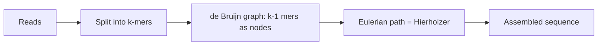

# Eulerian Path & Circuit — Middle Level

> **Focus:** *Why* the degree conditions are necessary and sufficient, how Hierholzer compares with Fleury and with the NP-hard Hamiltonian problem, and how Eulerian trails power de Bruijn sequences, genome assembly, and the Chinese Postman problem.

---

## Table of Contents

1. [Introduction](#introduction)
2. [Deeper Concepts](#deeper-concepts)
3. [Comparison with Alternatives](#comparison-with-alternatives)
4. [Advanced Patterns](#advanced-patterns)
5. [Graph and Tree Applications](#graph-and-tree-applications)
6. [Algorithmic Integration](#algorithmic-integration)
7. [Code Examples](#code-examples)
8. [Error Handling](#error-handling)
9. [Performance Analysis](#performance-analysis)
10. [Best Practices](#best-practices)
11. [Visual Animation](#visual-animation)
12. [Summary](#summary)

---

## Introduction

At junior level you learned the rules: count degrees, check connectivity, run Hierholzer. At middle level you ask the questions that separate someone who *applies* the recipe from someone who *understands* it:

- *Why* is "all degrees even" both necessary **and** sufficient — not just a coincidence that happens to work on small examples?
- Why is finding an Eulerian trail *easy* (`O(E)`) while the almost-identical-sounding Hamiltonian trail is *NP-hard*?
- How does a de Bruijn sequence — a string in which every length-`k` pattern appears once — reduce to an Eulerian circuit?
- How do modern genome assemblers turn billions of short DNA reads into a chromosome using exactly this idea?
- When the graph is *not* Eulerian, how does the Chinese Postman problem find the shortest route that still covers every edge?

These are the questions that show up in interviews and in real systems.

---

## Deeper Concepts

### Why the conditions are *necessary*

Suppose an Eulerian circuit exists. Walk it. Every time the walk visits a vertex `v` it arrives along one edge and departs along another, pairing up the edges at `v`. Because the circuit uses *every* edge exactly once and starts and ends at the same place, **every** edge incident to `v` is consumed in one of these in/out pairs. Therefore `deg(v)` is even for all `v`. And since a single walk touches all edges, those edges must lie in one connected component. So the conditions are *necessary*: no even-degree-and-connected graph, no circuit.

For an Eulerian *path* that starts at `s` and ends at `t ≠ s`: at the start vertex the walk departs without a matching prior arrival, and at the end vertex it arrives without a matching later departure. So `s` and `t` each have an odd number of incident edges, while every intermediate vertex still pairs up evenly. Hence **exactly two** odd vertices (or zero, which gives a circuit).

The directed case is identical with "arrive/depart" replaced by "in-arc/out-arc": each pass through `v` uses one in-arc and one out-arc, forcing `in(v) = out(v)` everywhere except a start (`out − in = 1`) and an end (`in − out = 1`).

### Why the conditions are *sufficient*

This is the deeper half. We show that *if* the graph is connected (on its edge-bearing vertices) and every vertex is even, an Eulerian circuit *can be built*. The argument **is** Hierholzer's algorithm, and it is constructive:

1. Start at any vertex `v₀` and keep walking along unused edges. Because every vertex has even degree, whenever you *enter* a vertex you have used an odd number of its edges, so at least one unused edge remains to *leave* by — **except** when you return to `v₀`. So the walk can only get stuck back at `v₀`, producing a closed cycle `C`.
2. Remove `C`'s edges. Every vertex still has even degree (we removed edges in in/out pairs). If edges remain, connectivity guarantees some vertex `u` on `C` still has unused edges. Build a new cycle `C'` from `u` the same way.
3. **Splice** `C'` into `C` at `u`. The result is a longer closed walk. Repeat until no edges remain.

Because each splice strictly increases the number of covered edges and edges are finite, the process terminates with a single closed walk covering every edge — an Eulerian circuit. For a path, add a virtual edge between the two odd vertices, find a circuit, then delete the virtual edge to reopen it into a path. This *constructive* proof is why the conditions are sufficient, and it is exactly the algorithm you code.

### The handshake lemma footnote

The sum of all degrees equals `2E` (each edge contributes 2), so it is even, which forces the number of odd-degree vertices to be even. That is why you can have 0, 2, 4, … odd vertices but never an odd count — and why "0 or 2" are the only counts admitting a trail.

---

## Comparison with Alternatives

### Hierholzer vs Fleury

| Attribute | Hierholzer | Fleury |
|-----------|-----------|--------|
| Idea | Walk arbitrary cycles, splice them together | Walk one edge at a time, never crossing a bridge unless forced |
| Time | **O(E)** | **O(E²)** (a bridge check per edge) |
| Data structures | adjacency list + iterator pointer + stack | adjacency list + repeated bridge detection |
| Needs bridge detection? | No | Yes (see *11-articulation-points-bridges*) |
| Recursion risk | Avoidable (iterative) | Inherent |
| Use in practice | Always | Pedagogical / historical only |

Fleury is intuitive ("just don't burn a bridge you still need") but its per-step bridge check dominates. Hierholzer sidesteps bridges entirely by allowing itself to walk *any* cycle and fix up the order afterward.

### Eulerian vs Hamiltonian — the great contrast

| | Eulerian | Hamiltonian |
|--|----------|-------------|
| Visit each ___ exactly once | **edge** | **vertex** |
| Existence test | `O(V + E)` degree/balance check | No known polynomial test |
| Construction | `O(E)` (Hierholzer) | NP-hard (no known polynomial algorithm) |
| Characterization | Clean: degrees + connectivity | None known (only sufficient conditions like Dirac/Ore) |
| Related problem | Chinese Postman (polynomial) | Travelling Salesman (NP-hard) |

The lesson: a one-word change in the problem statement — *edge* vs *vertex* — flips it from trivially easy to one of the hardest problems in computer science. Eulerian's tractability comes from the *local* degree characterization; Hamiltonicity has no such local witness. See *28-np-hard-tsp-hamiltonian* for the hard side.

### Other ways to cover all edges

- **Route inspection / Chinese Postman:** when the graph is *not* Eulerian, find the minimum extra distance (by duplicating some edges) so it becomes Eulerian, then run Hierholzer.
- **Edge-disjoint cycle cover:** an even graph decomposes into edge-disjoint cycles; Hierholzer is essentially merging that cover into one walk.

---

## Advanced Patterns

### Pattern: de Bruijn Sequences via Eulerian Circuit

A **de Bruijn sequence** `B(k, n)` is a cyclic string over an alphabet of size `k` in which **every** length-`n` string appears **exactly once** as a substring. For `k = 2, n = 3` one answer is `00010111` (cyclically): the eight 3-bit patterns `000, 001, 010, 101, 011, 111, 110, 100` each occur once.

Construction trick: build the **de Bruijn graph** whose vertices are all `(n−1)`-length strings, with an edge from `a` to `b` whenever `a`'s last `n−2` characters equal `b`'s first `n−2` characters (i.e., they overlap by appending one symbol). Each vertex has in-degree = out-degree = `k`, so the graph has an Eulerian circuit, and **that circuit spells the de Bruijn sequence**. This is the classic reduction: a "cover every length-`n` window once" problem becomes "cover every edge once."

This is exactly **LeetCode 753 — Cracking the Safe**: find the shortest sequence that tries every possible PIN. It is a de Bruijn sequence, found by Hierholzer.

### Pattern: Chinese Postman / Route Inspection

A postman must walk every street and return to the post office with **minimum total distance**. If the street graph is Eulerian, the answer is just the sum of edge weights (one Eulerian circuit). If not, some streets must be walked twice.

Algorithm (undirected):
1. Find the set `O` of odd-degree vertices (always even in count).
2. Compute shortest paths between all pairs in `O`.
3. Find a **minimum-weight perfect matching** on `O` using those distances.
4. **Duplicate** the edges along each matched shortest path. Now every vertex is even.
5. Run Hierholzer; the answer length is `(sum of all edges) + (matching cost)`.

The expensive step is the matching (`O(V³)` with blossom), not the Euler tour itself.

### Pattern: Lexicographically Smallest Eulerian Path

To get the smallest trail (often required by problems like *Reconstruct Itinerary*), **sort each adjacency list** and always take the smallest unused edge first in Hierholzer. Because Hierholzer builds the circuit in reverse and you append on pop, the greedy "smallest first" combined with the reverse output yields the lexicographically smallest valid trail. This is the heart of LeetCode 332.

---

## Graph and Tree Applications

### Genome Assembly (the killer application)

A DNA sequencer does not read a chromosome end to end. It produces millions of short overlapping fragments called **reads** (e.g., 100–300 bases each). Reconstructing the original sequence is a puzzle: stitch the reads back into one long string.

The **de Bruijn graph approach** (used by assemblers like Velvet, SPAdes, ABySS):

1. Break every read into all its overlapping `k`-mers (substrings of length `k`).
2. Build a de Bruijn graph: each `(k−1)`-mer is a vertex; each `k`-mer is an edge from its prefix `(k−1)`-mer to its suffix `(k−1)`-mer.
3. The original genome corresponds to an **Eulerian path** through this graph — a walk using every `k`-mer edge once.
4. Run Hierholzer (with heavy real-world cleanup for errors, repeats, and coverage gaps).

This is why Eulerian paths are not academic: they are the algorithmic core of how genomes are assembled. Note the contrast with the older **overlap-layout-consensus** method, which builds an *overlap* graph and seeks a *Hamiltonian* path — NP-hard. Switching from "visit every read (vertex) once" to "visit every k-mer (edge) once" turned an intractable problem into a linear-time one. That reframing (Pevzner et al., 2001) revolutionized sequencing.



### Other applications

- **One-stroke drawing puzzles** — directly the Eulerian path question.
- **Circuit board / PCB routing and CNC tool paths** — cover every trace/cut once.
- **Street sweeping, snow plowing, meter reading** — Chinese Postman.

---

## Algorithmic Integration

Eulerian construction composes with several other graph routines covered in sibling topics:

- **Connectivity (DFS/BFS, *02-bfs* / *03-dfs*):** required for the existence test.
- **Bridges (*11-articulation-points-bridges*):** the basis of Fleury's algorithm.
- **Strong connectivity / SCC (*08-tarjan-scc*):** the directed existence test needs strong connectivity of the edge-bearing vertices.
- **Matching (*19-bipartite-matching*, general matching):** the Chinese Postman step.
- **Strong orientation (*26-strong-orientation*):** related "make this graph traversable" family.

---

## Code Examples

### de Bruijn Sequence Construction via Hierholzer

#### Go

```go
package main

import (
	"fmt"
	"strconv"
)

// deBruijn returns a cyclic B(k, n) sequence over alphabet {0..k-1}.
func deBruijn(k, n int) string {
	if n == 1 {
		s := ""
		for i := 0; i < k; i++ {
			s += strconv.Itoa(i)
		}
		return s
	}
	// Vertices: all (n-1)-length strings, encoded as base-k integers 0..k^(n-1)-1.
	numV := 1
	for i := 0; i < n-1; i++ {
		numV *= k
	}
	iter := make([]int, numV)
	var edges [][2]int // (vertex, symbol appended)
	// adjacency: from vertex v, appending symbol c goes to (v*k + c) mod numV
	adj := make([][]int, numV) // stores appended symbols 0..k-1, in order
	for v := 0; v < numV; v++ {
		for c := 0; c < k; c++ {
			adj[v] = append(adj[v], c)
		}
	}

	stack := []int{0}
	var seq []int
	for len(stack) > 0 {
		v := stack[len(stack)-1]
		if iter[v] < len(adj[v]) {
			c := adj[v][iter[v]]
			iter[v]++
			next := (v*k + c) % numV
			stack = append(stack, next)
			edges = append(edges, [2]int{v, c})
		} else {
			if len(stack) > 1 {
				// edge label was pushed when we descended; record on pop
			}
			stack = stack[:len(stack)-1]
			_ = seq
		}
	}
	// Simpler: collect the appended symbols in edge order.
	out := make([]byte, 0, len(edges))
	for _, e := range edges {
		out = append(out, byte('0'+e[1]))
	}
	return string(out)
}

func main() {
	fmt.Println(deBruijn(2, 3)) // length 8, every 3-bit pattern once
}
```

#### Java

```java
import java.util.*;

public class DeBruijn {
    public static String deBruijn(int k, int n) {
        if (n == 1) {
            StringBuilder sb = new StringBuilder();
            for (int i = 0; i < k; i++) sb.append(i);
            return sb.toString();
        }
        int numV = 1;
        for (int i = 0; i < n - 1; i++) numV *= k;
        int[] iter = new int[numV];
        StringBuilder seq = new StringBuilder();
        Deque<int[]> stack = new ArrayDeque<>(); // {vertex, nextSymbolToTry}
        // iterative Hierholzer recording the appended symbol on each descent
        Deque<Integer> nodeStack = new ArrayDeque<>();
        Deque<Integer> edgeStack = new ArrayDeque<>(); // appended symbol used to reach top
        nodeStack.push(0);
        edgeStack.push(-1);
        while (!nodeStack.isEmpty()) {
            int v = nodeStack.peek();
            if (iter[v] < k) {
                int c = iter[v]++;
                int next = (v * k + c) % numV;
                nodeStack.push(next);
                edgeStack.push(c);
            } else {
                nodeStack.pop();
                int c = edgeStack.pop();
                if (c >= 0) seq.append(c);
            }
        }
        seq.reverse();
        return seq.toString();
    }

    public static void main(String[] args) {
        System.out.println(deBruijn(2, 3));
    }
}
```

#### Python

```python
def de_bruijn(k, n):
    """Return a cyclic de Bruijn sequence B(k, n) over alphabet 0..k-1."""
    if n == 1:
        return "".join(str(i) for i in range(k))
    num_v = k ** (n - 1)
    it = [0] * num_v
    node_stack = [0]
    edge_stack = [-1]            # appended symbol used to reach this node
    seq = []
    while node_stack:
        v = node_stack[-1]
        if it[v] < k:
            c = it[v]
            it[v] += 1
            nxt = (v * k + c) % num_v
            node_stack.append(nxt)
            edge_stack.append(c)
        else:
            node_stack.pop()
            c = edge_stack.pop()
            if c >= 0:
                seq.append(str(c))
    return "".join(reversed(seq))


if __name__ == "__main__":
    print(de_bruijn(2, 3))   # e.g. "00010111" (cyclic)
```

### Directed Hierholzer Returning the Edge Sequence (Reconstruct Itinerary style)

#### Go

```go
package main

import (
	"fmt"
	"sort"
)

// findItinerary returns the lexicographically smallest Eulerian path of arcs,
// starting at `start`. tickets is a list of [from, to].
func findItinerary(tickets [][]string, start string) []string {
	adj := map[string][]string{}
	for _, t := range tickets {
		adj[t[0]] = append(adj[t[0]], t[1])
	}
	for k := range adj {
		sort.Strings(adj[k]) // smallest-first
	}
	idx := map[string]int{}
	var route []string
	var stack []string
	stack = append(stack, start)
	for len(stack) > 0 {
		v := stack[len(stack)-1]
		if idx[v] < len(adj[v]) {
			next := adj[v][idx[v]]
			idx[v]++
			stack = append(stack, next)
		} else {
			route = append(route, v)
			stack = stack[:len(stack)-1]
		}
	}
	for i, j := 0, len(route)-1; i < j; i, j = i+1, j-1 {
		route[i], route[j] = route[j], route[i]
	}
	return route
}

func main() {
	tickets := [][]string{{"JFK", "SFO"}, {"JFK", "ATL"}, {"SFO", "ATL"}, {"ATL", "JFK"}, {"ATL", "SFO"}}
	fmt.Println(findItinerary(tickets, "JFK"))
}
```

#### Java

```java
import java.util.*;

public class Itinerary {
    public static List<String> findItinerary(List<List<String>> tickets) {
        Map<String, PriorityQueue<String>> adj = new HashMap<>();
        for (List<String> t : tickets)
            adj.computeIfAbsent(t.get(0), x -> new PriorityQueue<>()).add(t.get(1));
        LinkedList<String> route = new LinkedList<>();
        Deque<String> stack = new ArrayDeque<>();
        stack.push("JFK");
        while (!stack.isEmpty()) {
            String v = stack.peek();
            PriorityQueue<String> pq = adj.get(v);
            if (pq != null && !pq.isEmpty()) {
                stack.push(pq.poll());
            } else {
                route.addFirst(stack.pop());
            }
        }
        return route;
    }

    public static void main(String[] args) {
        List<List<String>> tickets = Arrays.asList(
            Arrays.asList("JFK", "SFO"), Arrays.asList("JFK", "ATL"),
            Arrays.asList("SFO", "ATL"), Arrays.asList("ATL", "JFK"),
            Arrays.asList("ATL", "SFO"));
        System.out.println(findItinerary(tickets));
    }
}
```

#### Python

```python
import heapq
from collections import defaultdict


def find_itinerary(tickets, start="JFK"):
    """Lexicographically smallest Eulerian path of arcs from `start`."""
    adj = defaultdict(list)
    for src, dst in tickets:
        heapq.heappush(adj[src], dst)   # min-heap => smallest first
    route = []
    stack = [start]
    while stack:
        v = stack[-1]
        if adj[v]:
            stack.append(heapq.heappop(adj[v]))
        else:
            route.append(stack.pop())
    return route[::-1]


if __name__ == "__main__":
    tickets = [["JFK", "SFO"], ["JFK", "ATL"], ["SFO", "ATL"],
               ["ATL", "JFK"], ["ATL", "SFO"]]
    print(find_itinerary(tickets))
```

---

## Error Handling

| Scenario | What goes wrong | Correct approach |
|----------|----------------|------------------|
| Graph passes degree test but is disconnected | Hierholzer returns a partial trail | Verify output length equals `E + 1` (vertices) or `E` (edges). |
| Directed graph "weakly" connected but not strongly | Trail covers a subset of arcs | Require strong connectivity among edge-bearing vertices. |
| Lexicographic order requested but adjacency unsorted | Returns a valid but not smallest trail | Sort each adjacency list (or use a min-heap) before Hierholzer. |
| de Bruijn with `n = 1` | Generic code mishandles 0-length vertices | Special-case `n = 1` (just list the alphabet). |
| Chinese Postman on already-Eulerian graph | Matching step does redundant work | Short-circuit: if no odd vertices, answer is total edge weight. |

---

## Performance Analysis

| Task | Complexity | Dominant cost |
|------|-----------|---------------|
| Existence test | `O(V + E)` | degree count + one DFS/BFS |
| Hierholzer | `O(E)` | each edge pushed/popped once |
| de Bruijn `B(k, n)` | `O(k^n)` | output size is `k^n`; graph has `k^n` edges |
| Lexicographic Eulerian path | `O(E log E)` | sorting adjacency / heap operations |
| Chinese Postman (undirected) | `O(V³)` | min-weight perfect matching on odd vertices |

The Euler-tour part is always cheap; when a problem is expensive (Chinese Postman, de Bruijn for large `n`) the cost lives in matching or in the exponential output, not in Hierholzer.

#### Python — quick benchmark of Hierholzer scaling

```python
import random, time


def random_eulerian_cycle_graph(num_cycles, cycle_len):
    edges, nxt = [], 0
    for _ in range(num_cycles):
        nodes = list(range(nxt, nxt + cycle_len))
        for i in range(cycle_len):
            edges.append((nodes[i], nodes[(i + 1) % cycle_len]))
        nxt += cycle_len
    # stitch cycles by sharing a vertex (keep all even)
    return edges


for c in (1000, 10000, 100000):
    edges = [(i, (i + 1) % c) for i in range(c)]  # one big even cycle
    t = time.perf_counter()
    # ... run iterative Hierholzer here ...
    print(c, "edges,", round((time.perf_counter() - t) * 1000, 2), "ms")
```

Hierholzer scales linearly: doubling `E` roughly doubles the time.

---

## Best Practices

- **Reduce, don't reinvent.** Many problems ("cover every pattern once," "smallest superstring of all k-mers") are Eulerian circuits in disguise — recognize the reduction.
- **Sort once for lexicographic order**, then run plain Hierholzer; do not try to re-sort mid-traversal.
- **Short-circuit Chinese Postman** when the graph is already Eulerian.
- **Use SCC** (*08-tarjan-scc*) for the directed connectivity check rather than a naive reachability scan in both directions.
- **Always validate** the constructed trail with an independent edge-usage check in tests.

---

## Visual Animation

> See [`animation.html`](./animation.html) for an interactive view.
>
> The middle-level animation highlights:
> - How small cycles are discovered and **spliced** together
> - The degree parity (odd/even) badge on each vertex
> - The stack vs the emerging circuit, side by side
> - A de Bruijn-graph preset showing the sequence spelled out by the Euler tour

---

## Summary

The degree conditions are not magic: they are *necessary* because each pass through a vertex pairs its edges, and *sufficient* because Hierholzer's cycle-splicing constructively builds the trail whenever they hold. Hierholzer beats Fleury (`O(E)` vs `O(E²)`) by avoiding bridge checks entirely. The deepest lesson is the Eulerian/Hamiltonian contrast: covering every *edge* once is linear-time, while covering every *vertex* once is NP-hard — a reframing that turned genome assembly from intractable into practical via de Bruijn graphs. The same machinery generates de Bruijn sequences (cracking-the-safe) and, with a matching step, solves the Chinese Postman routing problem.
