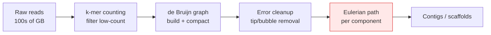

# Eulerian Path & Circuit — Senior Level

> Hierholzer is `O(E)` and almost never the bottleneck. At scale the hard parts are elsewhere: a de Bruijn graph for a human genome has billions of edges that do not fit in one machine's RAM, the "graph" is full of sequencing errors and repeats that must be cleaned before any Euler tour is meaningful, and the recursion/stack depth can reach the edge count. This document is about Eulerian construction as a component of a real system, not as a textbook loop.

## Table of Contents
1. [Introduction](#1-introduction)
2. [System Design: Assemblers and Route Optimization](#2-system-design-assemblers-and-route-optimization)
3. [Worked Example: de Bruijn Assembly of a Tiny Genome](#3-worked-example-de-bruijn-assembly-of-a-tiny-genome)
4. [Chinese Postman in Practice](#4-chinese-postman-in-practice)
5. [Distributed and Large-Graph Eulerian Construction](#5-distributed-and-large-graph-eulerian-construction)
6. [Concurrency](#6-concurrency)
7. [Comparison at Scale](#7-comparison-at-scale)
8. [Architecture Patterns](#8-architecture-patterns)
9. [Code Examples](#9-code-examples)
10. [Observability](#10-observability)
11. [Failure Modes](#11-failure-modes)
12. [Capacity Planning](#12-capacity-planning)
13. [Summary](#13-summary)

---

## 1. Introduction

At senior level the question is not "how does Hierholzer work" but "where does an Euler tour sit in my pipeline, and what breaks around it?" The algorithm is a linear scan over edges. That description tells you the real constraints:

- It needs the **entire edge set addressable** — random access into adjacency lists. At billions of edges that is a memory-layout and possibly an out-of-core problem.
- It is **inherently sequential** in its naive form: the splice order depends on which edges remain.
- Its correctness depends on **upstream graph cleanliness** — in genome assembly the raw de Bruijn graph is *not* Eulerian until errors and tips are pruned.
- Its recursive form has **stack depth = O(E)**; on a 3-billion-edge graph that is an instant overflow.

The interesting senior decisions are therefore: how to represent a graph too big for one node, how to make the construction robust to a graph that *almost* satisfies the conditions, and how to instrument a multi-hour assembly so an operator can see progress and detect a stall.

---

## 2. System Design: Assemblers and Route Optimization

### 2.1 Genome assembler pipeline



The Euler tour (red) is a single stage in a long pipeline. The stages around it dominate runtime: `k`-mer counting touches every base of every read; error cleanup iterates the graph repeatedly; the Euler tour itself is one linear pass per connected component. Production assemblers (SPAdes, ABySS, Velvet) spend most of their wall-clock outside Hierholzer.

A crucial design point: the real graph is **rarely Eulerian**. Coverage gaps, sequencing errors, and repeated regions break the in/out balance. So assemblers do not demand a single Euler path — they extract **maximal unambiguous paths** (unitigs) and emit many contigs, deferring the "join them" step to scaffolding with extra information (paired reads, long reads). The pure Eulerian-path idea is the *conceptual* core; the implementation relaxes it heavily.

### 2.2 Route optimization (Chinese Postman at scale)

For street-sweeping, snow-plowing, drone inspection, or meter reading over a city:

- The graph is small enough to fit in memory (a city has ~10⁵–10⁶ edges).
- The graph is **not** Eulerian, so the cost is in the **min-weight matching** of odd vertices (`O(V³)` blossom), not the tour.
- Real constraints — one-way streets (directed Postman, harder), vehicle capacity, time windows, multiple vehicles — push this toward a vehicle-routing solver where the Euler tour is the final "make it a single closed walk" step.

The senior insight: in routing, Hierholzer is the *cheap* finishing move; the optimization is upstream (matching, partitioning).

---

## 3. Worked Example: de Bruijn Assembly of a Tiny Genome

To make the assembly framing concrete, walk a toy example end to end. Suppose the true genome is the circular string `ATGGCGTGCA` and a sequencer produced these reads (here, all length-5 substrings, no errors, full coverage):

```
ATGGC, TGGCG, GGCGT, GCGTG, CGTGC, GTGCA, TGCAT, GCATG, CATGG
```

We pick `k = 4`, so each read of length 5 contributes two overlapping 4-mers, and each 4-mer becomes an **arc** between its two flanking 3-mers (the `k-1 = 3` prefixes and suffixes are the **vertices**).

**Step 1 — build the de Bruijn graph.** For a 4-mer `w₁w₂w₃w₄` add an arc from `w₁w₂w₃` to `w₂w₃w₄`. Collecting the distinct 4-mers across reads:

```
ATGG → arc ATG → TGG
TGGC → arc TGG → GGC
GGCG → arc GGC → GCG
GCGT → arc GCG → CGT
CGTG → arc CGT → GTG
GTGC → arc GTG → TGC
TGCA → arc TGC → GCA
GCAT → arc GCA → CAT
CATG → arc CAT → ATG
```

**Step 2 — vertex degree table.** Vertices are the 3-mers:

| vertex (3-mer) | out | in | balance (out−in) |
|----------------|-----|----|------------------|
| ATG | 1 (→TGG) | 1 (CAT→) | 0 |
| TGG | 1 (→GGC) | 1 (ATG→) | 0 |
| GGC | 1 (→GCG) | 1 (TGG→) | 0 |
| GCG | 1 (→CGT) | 1 (GGC→) | 0 |
| CGT | 1 (→GTG) | 1 (GCG→) | 0 |
| GTG | 1 (→TGC) | 1 (CGT→) | 0 |
| TGC | 1 (→GCA) | 1 (GTG→) | 0 |
| GCA | 1 (→CAT) | 1 (TGC→) | 0 |
| CAT | 1 (→ATG) | 1 (GCA→) | 0 |

Every vertex is balanced (`in = out`) and the graph is strongly connected, so an Eulerian **circuit** exists — consistent with the genome being circular.

**Step 3 — Euler circuit.** The graph is a single cycle here, so Hierholzer returns the obvious tour:

```
ATG → TGG → GGC → GCG → CGT → GTG → TGC → GCA → CAT → ATG
```

**Step 4 — spell the genome.** Start with the first vertex's 3 characters, then append the last character of each subsequent vertex (each arc adds exactly one new base):

```
ATG + G + C + G + T + G + C + A + T  =  ATGGCGTGCAT
```

Dropping the final `T` (it wraps to the start in a circular genome) recovers `ATGGCGTGCA` — the original. The Eulerian circuit *is* the assembly.

**Step 5 — what breaks in reality.** Now perturb the toy to show why production assemblers do not just run Hierholzer:

- **A sequencing error** turns one read's `GGCGT` into `GGCAT`, creating a spurious arc `GGC → GCA` and a *tip* (a short dead-end branch). The graph is no longer balanced; Hierholzer's balance check fails. Mitigation: tip removal in the cleanup stage.
- **A repeat** — say the genome contained `…CGT…CGT…` — collapses two distinct genomic regions onto the same vertex, raising its degree to 2-in/2-out. Now there are *multiple* Eulerian circuits, and only one matches biology. This ambiguity is exactly why assemblers emit **unitigs** (the unambiguous non-branching paths) and defer the branch resolution to paired/long reads.
- **A coverage gap** drops a 4-mer entirely, splitting the graph into two components; each yields its own partial trail, never a single tour.

This 9-read example is the entire conceptual payload of `Pevzner et al. (2001)`: assembly = Euler path on a de Bruijn graph, but the engineering is the graph-cleaning that makes the Euler step meaningful.

---

## 4. Chinese Postman in Practice

The **Chinese Postman Problem** (CPP, or Route Inspection) asks for a *minimum-length closed walk that traverses every edge at least once*. If the graph is already Eulerian, the answer is an Euler circuit (each edge once, cost = sum of weights). Otherwise some edges must be repeated, and the optimization is *which* edges to duplicate so the result becomes Eulerian at minimum extra cost.

### 4.1 The reduction to matching (undirected)

The odd-degree vertices are the obstruction (Theorem: a connected graph is Eulerian iff all degrees are even). An undirected graph always has an even number of odd vertices (handshake lemma). The optimal CPP solution:

1. Find all odd-degree vertices `O` (`|O|` is even).
2. Compute all-pairs shortest paths among `O`.
3. Find a **minimum-weight perfect matching** on `O` using those shortest-path distances (Edmonds' blossom algorithm, `O(V³)`).
4. **Duplicate** the edges along each matched shortest path. Now every vertex is even-degree → Eulerian.
5. Run Hierholzer on the augmented multigraph. Its cost = (sum of all original edge weights) + (matching cost).

```
         odd vertices: {b, d, f, h}
         shortest paths between them, then min-weight perfect matching:

              b ---- d           pairing {b-d, f-h}  cost = 7
               \    /            vs
                \  /             pairing {b-f, d-h}  cost = 9  ✗
                 ⋈               vs
                /  \             pairing {b-h, d-f}  cost = 11 ✗
               /    \
              f ---- h           choose the cheapest perfect matching
```

The minimum-weight perfect matching is the expensive step (`O(V³)`); Hierholzer afterward is linear and trivial. This is the senior point repeated: **in routing, the cost lives in the matching, not the Euler tour.**

### 4.2 Directed and mixed variants

- **Directed CPP** (one-way streets only): balance `out − in` at every vertex by adding minimum-cost paths from over-out vertices to over-in vertices. This is a **min-cost flow** problem (poly-time), not matching.
- **Mixed CPP** (some streets two-way, some one-way): **NP-hard**. The clean polynomial structure collapses the moment you mix orientations. Real city networks are mixed, so production routing uses heuristics or ILP solvers with time limits.

### 4.3 Python — undirected Chinese Postman skeleton

```python
import itertools, networkx as nx

def chinese_postman(G):
    """G: weighted undirected nx.Graph. Returns (extra_cost, augmented multigraph)."""
    odd = [v for v, d in G.degree() if d % 2 == 1]
    if not odd:
        return 0, nx.MultiGraph(G)  # already Eulerian

    # all-pairs shortest path lengths among odd vertices
    dist = {}
    paths = {}
    for u in odd:
        lengths, p = nx.single_source_dijkstra(G, u, weight="weight")
        for v in odd:
            if u < v:
                dist[(u, v)] = lengths[v]
                paths[(u, v)] = p[v]

    # min-weight perfect matching on odd set (use max-weight on negated weights)
    H = nx.Graph()
    for (u, v), w in dist.items():
        H.add_edge(u, v, weight=-w)
    matching = nx.max_weight_matching(H, maxcardinality=True)

    aug = nx.MultiGraph(G)
    extra = 0
    for u, v in matching:
        key = (u, v) if (u, v) in paths else (v, u)
        path = paths[key]
        extra += dist[key]
        for a, b in zip(path, path[1:]):       # duplicate edges along the path
            aug.add_edge(a, b, weight=G[a][b]["weight"])
    return extra, aug
```

The duplicated multigraph is now Eulerian; feeding `aug` to a Hierholzer (the §9 code) yields the optimal inspection route. The `O(V³)` matching dominates; for a city of `10⁵` edges with a few hundred odd vertices this is seconds, while the Euler tour is milliseconds.

---

## 5. Distributed and Large-Graph Eulerian Construction

A human de Bruijn graph at `k = 31` can have on the order of **10⁹–10¹⁰** edges. Strategies when it does not fit in one machine's RAM:

### 3.1 Graph compaction first

Most of a de Bruijn graph is **non-branching chains** (paths of degree-2 vertices). Compact each maximal chain into a single edge ("unitig"). This shrinks the graph by orders of magnitude *before* any Euler tour, often enough to fit in memory. This is the single most important large-graph technique and is essentially free correctness-wise (a chain has a unique traversal).

### 3.2 Partition by connected component

Eulerian construction is independent per connected component. Identify components (a distributed connected-components pass, e.g., label propagation on Spark/GraphX), then process each component on whatever node holds it. Components in assembly graphs are numerous and mostly small after compaction, giving natural parallelism.

### 3.3 Out-of-core / streaming

When even one component is too large, stream adjacency from disk with an external-memory traversal. The `iter[v]` pointer pattern is friendly here: each edge is touched once, so a well-ordered on-disk adjacency yields mostly sequential I/O.

### 3.4 What does *not* distribute well

The **splice order** of Hierholzer is a sequential dependency: you cannot trivially compute the final walk's order in parallel across a single component, because each cycle's insertion point depends on the rest. Practical systems sidestep this by emitting unitigs (independent) and stitching with side information, rather than insisting on one global Euler tour.

---

## 6. Concurrency

### 4.1 Parallelism across components

The clean win: run one worker per connected component. No shared state, no locks. This is embarrassingly parallel and is how multi-threaded assemblers get speedup on the tour stage.

### 4.2 Within a single component

Hierholzer on one component is hard to parallelize because:
- The `used[edge]` flags are shared mutable state — concurrent traversal would race on which thread claims an edge.
- The splice structure is sequential.

A relaxed approach: partition the component's *cycles* (an even graph decomposes into edge-disjoint cycles), find cycles in parallel, then merge — but the merge is sequential and tricky. In practice, per-component parallelism is enough; intra-component parallelism is rarely worth the complexity.

### 4.3 Read-only sharing

If multiple queries run Euler tours over the *same* immutable graph (e.g., generating several de Bruijn sequences), the adjacency lists are read-only and the only per-run mutable state is `iter[]` and `used[]`. Give each worker its own copies; the graph stays shared and cache-warm.

---

## 7. Comparison at Scale

| Approach | Edges feasible | Memory | Notes |
|----------|----------------|--------|-------|
| In-memory iterative Hierholzer | up to ~10⁸ on a big node | `O(V + E)` | The default. Linear, cache-friendly with flat arrays. |
| Recursive Hierholzer | small only | `O(E)` stack | Stack overflow on long trails. Avoid in production. |
| Compaction + per-component | 10⁹–10¹⁰ after compaction | reduced | Standard assembler approach. |
| Out-of-core streaming | beyond RAM | `O(V)` in RAM | I/O-bound; needs good on-disk adjacency layout. |
| Fleury | tiny / teaching | `O(V + E)` | `O(E²)` — never at scale. |

For routing-scale graphs (≤10⁶ edges) any in-memory method is instant; the comparison only matters for assembly-scale graphs.

---

## 8. Architecture Patterns

### 6.1 Validate-clean-construct

```
        +-----------+     +-----------+     +-----------+     +-----------+
reads ->|  build    |---->| validate  |---->|  clean    |---->| Euler /   |
        |  graph    |     | balance   |     | tips,bubbles|   | unitigs   |
        +-----------+     +-----------+     +-----------+     +-----------+
```

Never run Hierholzer on a freshly built biological graph; it will fail the balance check or produce a meaningless tour. The validate and clean stages are where engineering effort goes.

### 6.2 Component-sharded workers

A coordinator assigns connected components to a worker pool; each worker runs an independent in-memory Hierholzer and streams its result back. Components are sized so each fits a worker's memory; oversized components fall back to streaming.

### 6.3 Idempotent, checkpointed stages

Each pipeline stage writes its output (compacted graph, component list, per-component tours) to durable storage so a crash resumes from the last checkpoint rather than re-reading hundreds of GB of raw reads.

---

## 9. Code Examples

### 7.1 Go — overflow-safe iterative Hierholzer for huge graphs

```go
package euler

// Trail builds an Eulerian trail over a directed graph given as adjacency
// slices. It is fully iterative (no recursion) so it survives trails of length
// O(E) without stack overflow. Returns the vertex sequence, or ok=false if the
// graph is not Eulerian / not connected on its edge-bearing vertices.
func Trail(adj [][]int32, numEdges int) (trail []int32, ok bool) {
	n := len(adj)
	out := make([]int, n)
	in := make([]int, n)
	for u := range adj {
		out[u] = len(adj[u])
		for _, v := range adj[u] {
			in[v]++
		}
	}

	start, plus, minus := -1, 0, 0
	for v := 0; v < n; v++ {
		d := out[v] - in[v]
		switch {
		case d == 1:
			plus++
			start = v
		case d == -1:
			minus++
		case d != 0:
			return nil, false
		}
		if start == -1 && out[v] > 0 {
			start = v
		}
	}
	if !((plus == 0 && minus == 0) || (plus == 1 && minus == 1)) {
		return nil, false
	}
	if start == -1 {
		return []int32{}, numEdges == 0
	}

	iter := make([]int32, n)
	// preallocate stack and output to avoid reallocations on huge graphs
	stack := make([]int32, 0, numEdges+1)
	trail = make([]int32, 0, numEdges+1)
	stack = append(stack, int32(start))
	for len(stack) > 0 {
		v := stack[len(stack)-1]
		if int(iter[v]) < len(adj[v]) {
			w := adj[v][iter[v]]
			iter[v]++
			stack = append(stack, w)
		} else {
			trail = append(trail, v)
			stack = stack[:len(stack)-1]
		}
	}
	if len(trail) != numEdges+1 {
		return nil, false // disconnected: not all edges used
	}
	for i, j := 0, len(trail)-1; i < j; i, j = i+1, j-1 {
		trail[i], trail[j] = trail[j], trail[i]
	}
	return trail, true
}
```

Notes for review:
- `int32` vertices halve memory vs `int` on huge graphs — at 10⁹ vertices that is gigabytes saved.
- Stack and output are preallocated to `numEdges+1`; reallocation churn is a real cost at scale.
- The `iter[]` pointer guarantees each edge is touched once: total work is strictly `O(E)`.

### 7.2 Java — per-component parallel driver

```java
import java.util.*;
import java.util.concurrent.*;

public class ParallelEuler {
    // Runs an independent Eulerian trail on each weakly-connected component,
    // in parallel. Returns a trail per component (or null if a component is
    // not Eulerian).
    public static List<int[]> trailsPerComponent(List<int[]>[] adj) throws Exception {
        int n = adj.length;
        int[] comp = new int[n];
        Arrays.fill(comp, -1);
        List<List<Integer>> components = new ArrayList<>();
        for (int s = 0; s < n; s++) {
            if (comp[s] != -1 || adj[s].isEmpty()) continue;
            List<Integer> members = new ArrayList<>();
            Deque<Integer> dq = new ArrayDeque<>();
            dq.push(s); comp[s] = components.size();
            while (!dq.isEmpty()) {
                int v = dq.pop();
                members.add(v);
                for (int[] e : adj[v]) {
                    if (comp[e[0]] == -1) { comp[e[0]] = comp[v]; dq.push(e[0]); }
                }
            }
            components.add(members);
        }

        ExecutorService pool = Executors.newWorkStealingPool();
        List<Future<int[]>> futures = new ArrayList<>();
        for (List<Integer> members : components) {
            futures.add(pool.submit(() -> hierholzer(adj, members)));
        }
        List<int[]> result = new ArrayList<>();
        for (Future<int[]> f : futures) result.add(f.get());
        pool.shutdown();
        return result;
    }

    // Directed Hierholzer restricted to one component's vertex set.
    private static int[] hierholzer(List<int[]>[] adj, List<Integer> members) {
        Map<Integer, Integer> iter = new HashMap<>();
        int start = members.get(0);
        Deque<Integer> stack = new ArrayDeque<>();
        ArrayList<Integer> trail = new ArrayList<>();
        stack.push(start);
        int edgeCount = 0;
        for (int v : members) edgeCount += adj[v].size();
        while (!stack.isEmpty()) {
            int v = stack.peek();
            int i = iter.getOrDefault(v, 0);
            if (i < adj[v].size()) {
                iter.put(v, i + 1);
                stack.push(adj[v].get(i)[0]);
            } else {
                trail.add(stack.pop());
            }
        }
        if (trail.size() != edgeCount + 1) return null;
        Collections.reverse(trail);
        return trail.stream().mapToInt(Integer::intValue).toArray();
    }
}
```

### 7.3 Python — streaming validation before construction

```python
def is_eulerian_directed(out_deg, in_deg, reachable_from_start, total_v_with_edges):
    """Cheap pre-check: balance + connectivity. Returns (ok, start_vertex)."""
    start, plus, minus = None, 0, 0
    for v in out_deg:
        d = out_deg[v] - in_deg.get(v, 0)
        if d == 1:
            plus += 1
            start = v
        elif d == -1:
            minus += 1
        elif d != 0:
            return False, None
    for v in in_deg:
        if v not in out_deg and in_deg[v] - 0 not in (0,) and (in_deg[v]) == 1:
            minus += 1
    if not ((plus == 0 and minus == 0) or (plus == 1 and minus == 1)):
        return False, None
    if start is None:
        start = next(iter(out_deg), None)
    # connectivity: all edge-bearing vertices reachable from start
    if reachable_from_start != total_v_with_edges:
        return False, None
    return True, start
```

The point of this stage in a large pipeline is to **fail fast and cheaply** (a degree scan and one reachability pass) before committing to an expensive construction over billions of edges.

---

## 10. Observability

A multi-hour Euler-based pipeline is opaque without instrumentation. Wire these from the start.

| Metric | Type | Why |
| --- | --- | --- |
| `graph_edges_total` | gauge | Size after each compaction stage; detects ineffective compaction. |
| `components_total` | gauge | Number of connected components to process. |
| `component_max_edges` | gauge | The biggest component decides peak memory and stall risk. |
| `euler_edges_consumed` | counter | Progress within a component (against its edge count). |
| `euler_balance_violations` | counter | Vertices failing in/out balance — graph-cleanup quality signal. |
| `euler_stage_duration_seconds` | histogram | Where the pipeline actually spends time. |
| `disconnected_components_dropped` | counter | Components that did not yield a full trail. |

The most useful single signal is `euler_edges_consumed / component_edges`: if it stalls, the traversal is stuck (almost always a graph that is not actually Eulerian, or a memory thrash).

---

## 11. Failure Modes

### 9.1 Graph not actually Eulerian
Raw biological graphs fail balance constantly. Mitigation: pre-validate and route non-Eulerian components to the unitig extractor instead of demanding a single tour.

### 9.2 Recursion stack overflow
Recursive Hierholzer on a long path overflows at depth `O(E)`. Mitigation: always use the iterative stack form. This is the single most common production crash for naive implementations.

### 9.3 Disconnected components masquerading as Eulerian
All-even degrees but two components → partial trail. Mitigation: assert `len(trail) == E + 1`; never trust the degree check alone.

### 9.4 Memory blow-up on a giant component
One repeat-rich component can dominate memory. Mitigation: compaction first; out-of-core streaming for the residual giant; cap and shard.

### 9.5 Multigraph edge double-use
Undirected parallel edges marked used by endpoint pair rather than edge ID get traversed twice. Mitigation: per-edge IDs, always.

### 9.6 Non-determinism breaking reproducibility
Hierholzer's output depends on adjacency order; two runs differ. For reproducible science, **fix the adjacency order** (sort) so the tour is deterministic.

---

## 12. Capacity Planning

### 10.1 Memory

Working assumptions for an in-memory directed graph:
- Adjacency as a flat `int32` slice: 4 bytes per arc.
- `iter[]`, `in[]`, `out[]`: `O(V)` ints.
- Output trail: `E + 1` vertices.

For `E = 10⁸` arcs: `~0.4 GB` adjacency + `~0.4 GB` output (int32) ≈ **under 1 GB** — comfortably single-node. For `E = 10¹⁰` raw, you **must** compact first; post-compaction graphs are typically 10²–10³× smaller.

### 10.2 Time

Hierholzer is `~O(E)` with a small constant (a push and a pop per edge). On a modern core, expect tens to low hundreds of millions of edges per second in a compiled language; the bottleneck is memory bandwidth on the adjacency scan, not arithmetic.

### 10.3 Sizing example

A bacterial genome (~5 Mbp) at `k = 31`: a few million `k`-mers, graph fits in tens of MB, Euler/unitig stage runs in well under a second. A human genome (~3 Gbp): build/clean/compact dominate (hours, hundreds of GB peak); the tour stage per component is negligible by comparison. Plan capacity for the **build and cleanup**, not for Hierholzer.

### 10.4 When to leave the single node

Move to a distributed build (Spark/GraphX or a dedicated assembler's MPI mode) when raw `k`-mer counts exceed single-node RAM during graph construction — which happens *before* the Euler stage, not at it.

---

## 13. Summary

- Hierholzer is a linear-time finishing move; the engineering lives upstream (graph build, validation, error cleanup, compaction).
- Always iterative — recursive Hierholzer overflows at depth `O(E)` and is the classic production crash.
- Large graphs (genome assembly) are tamed by **compaction** then **per-component** parallelism; intra-component parallelism rarely pays off because the splice order is sequential.
- Real graphs are usually *not* Eulerian; robust systems emit unitigs and defer joining, rather than insisting on one global tour.
- Validate cheaply (balance + one reachability pass) before committing to construction; assert `len(trail) == E + 1` to catch disconnection.
- Instrument `edges_consumed / component_edges` to detect stalls; fix adjacency order for reproducibility.
- Capacity is dominated by graph *construction*, not by the Euler tour — plan memory and time accordingly.

References worth studying: Pevzner, Tang & Waterman (2001) on the Eulerian path approach to DNA assembly; the SPAdes and ABySS papers; cp-algorithms "Finding the Eulerian path"; sibling topics *08-tarjan-scc* and *11-articulation-points-bridges*.
