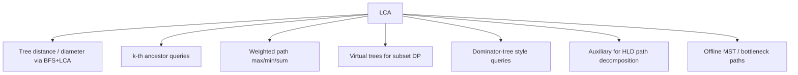

# Lowest Common Ancestor — Middle Level

> **Focus:** The semantics of the binary-lifting table, the Euler-tour-to-RMQ reduction that buys `O(1)` queries, and the advanced patterns LCA unlocks — k-th ancestor, distances, weighted path aggregates, and virtual trees.

---

## Table of Contents

1. [Introduction](#introduction)
2. [Deeper Concepts](#deeper-concepts)
3. [Comparison with Alternatives](#comparison-with-alternatives)
4. [Advanced Patterns](#advanced-patterns)
5. [Graph and Tree Applications](#graph-and-tree-applications)
6. [Algorithmic Integration](#algorithmic-integration)
7. [Code Examples](#code-examples)
8. [Error Handling](#error-handling)
9. [Performance Analysis](#performance-analysis)
10. [Best Practices](#best-practices)
11. [Visual Animation](#visual-animation)
12. [Summary](#summary)

---

## Introduction

At junior level LCA is "lift the deeper node, then climb together." At middle level you start asking the questions that decide which method to reach for and how to extend it:

- What does `up[k][v]` *really* store, and why is the doubling recurrence correct?
- Why does the climb loop go from the **high** bit to the **low** bit, never the other way?
- When is the Euler-tour + sparse-table `O(1)`-query method worth its extra code over binary lifting?
- How do I aggregate **edge weights** (max, min, sum, gcd) along a path while I climb?
- How do I build a **virtual tree** on a subset of `k` nodes in `O(k log k)`?

These are the questions that separate "I can paste a snippet" from "I can adapt LCA to the problem in front of me."

---

## Deeper Concepts

### Binary-lifting table semantics

`up[k][v]` is defined as the ancestor of `v` exactly `2^k` levels up. The recurrence

```
up[0][v] = parent[v]
up[k][v] = up[k-1][ up[k-1][v] ]
```

reads as: "to go up `2^k`, go up `2^(k-1)`, then up `2^(k-1)` again." This is correct because ancestor relationships compose: the `2^(k-1)`-th ancestor of the `2^(k-1)`-th ancestor is the `2^k`-th ancestor. Overshooting the root must be **idempotent**: if `up[0][root] = root`, then every higher jump from the root stays at the root, so the table never reads garbage.

Any climb of length `d` is the sum of the powers of two given by the set bits of `d`. Because each power appears at most once, a climb touches each table level at most once → `O(log N)` per climb.

### The lift-then-climb query, bit by bit

```
1. WLOG depth[u] >= depth[v]. Lift u up by depth[u] - depth[v].
2. If u == v, return u.            // v was an ancestor of u
3. For k = LOG-1 down to 0:
       if up[k][u] != up[k][v]:    // jumping 2^k keeps both BELOW the LCA
           u = up[k][u]; v = up[k][v]
4. return up[0][u]                 // u and v are now children of the LCA
```

**Why high-to-low?** We want to climb the largest distance that still keeps both nodes strictly below the LCA. Greedily taking the biggest safe jump first (and only when the `2^k`-th ancestors *differ*, which proves they are still below the LCA) leaves a remaining distance that the smaller powers can finish. Going low-to-high would let a small jump land on or above the LCA and lose the invariant.

**Invariant maintained:** after step 1 both nodes are at equal depth and below (or equal to) the LCA. In step 3, jumping only when ancestors differ guarantees both stay strictly below the LCA, so after the loop they are exactly the two children of the LCA on its respective branches.

### LCA ⟺ RMQ via the Euler tour

Run a DFS and append the current node to an array **every time you enter or return to it**. This **Euler tour** has length `2N − 1`. Record `first[v]` = the first index where `v` appears, and `euler_depth[i]` = the depth of the node at tour position `i`.

**Key fact:** `LCA(u, v)` is the **shallowest** node visited between `first[u]` and `first[v]` in the Euler tour. Why? Walking the tour from `u` to `v`, you must pass through their LCA (you cannot leave the LCA's subtree without going through the LCA), and the LCA is the highest (minimum-depth) node on that stretch.

So `LCA(u, v)` = the node at the position of the **minimum** `euler_depth` in the range `[min(first[u], first[v]), max(first[u], first[v])]`. That is a **Range Minimum Query**. A sparse table answers RMQ in `O(1)` after `O(N log N)` build → `O(1)` LCA queries.

```
Tour:        0 1 3 1 4 6 4 1 0 2 5 2 0
depth:       0 1 2 1 2 3 2 1 0 1 2 1 0
first[]:     0->0, 1->1, 3->2, 4->4, 6->5, 2->9, 5->10
LCA(6, 3): first[3]=2, first[6]=5 -> min depth in tour[2..5] is depth 1 at node 1 -> LCA = 1
```

---

## Comparison with Alternatives

| Attribute | Naive climb | Binary lifting | Euler + sparse RMQ | Farach-Colton–Bender | Tarjan offline | HLD |
|-----------|-------------|----------------|--------------------|----------------------|----------------|-----|
| Build time | `O(N)` | `O(N log N)` | `O(N log N)` | **`O(N)`** | `O((N+Q) α)` | `O(N)` |
| Build space | `O(N)` | `O(N log N)` | `O(N log N)` | `O(N)` | `O(N+Q)` | `O(N)` |
| Query time | `O(N)` | `O(log N)` | **`O(1)`** | **`O(1)`** | amortized ~`O(1)` | `O(log N)` |
| Online? | yes | yes | yes | yes | **no** | yes |
| k-th ancestor | `O(N)` | **`O(log N)`** | no (needs extra) | no (needs extra) | no | `O(log N)` |
| Path aggregates | no | yes (extend table) | no | no | no | **yes (with seg tree)** |
| Implementation effort | trivial | low | medium | high | low–medium | high |

**Choose binary lifting** when you need an online, easy-to-extend method that also gives k-th ancestor and weighted path queries. It is the default.

**Choose Euler + sparse RMQ** when you have a huge query volume and need `O(1)` per query, and you do not need k-th ancestor.

**Choose Farach-Colton–Bender** when even the `O(N log N)` build is too much and you need `O(N)`/`O(1)` (large `N`, tight limits). See `professional.md` for the construction.

**Choose Tarjan offline** when all queries are known up front and you only need plain LCA — see `12-disjoint-set / 04-offline-lca`.

**Choose HLD** when you need to *update* and *query* path aggregates, not just read static ones — see `14-heavy-light-decomposition`.

---

## Advanced Patterns

### k-th ancestor

Already in the table: decompose `k` into set bits and jump. Returns `-1` if `k > depth[v]`. This powers LeetCode 1483 ("Kth Ancestor of a Tree Node").

### Distance and "node on the path"

```
dist(u, v)         = depth[u] + depth[v] - 2 * depth[lca(u, v)]
k-th node on path  = kth_ancestor(u, k)          if k <= depth[u]-depth[l]
                     kth_ancestor(v, dist - k)    otherwise
```

### Path max / min via lifting (weighted trees)

Store a second table `maxw[k][v]` = the maximum edge weight on the `2^k`-step climb from `v`. Build it alongside `up`:

```
maxw[0][v] = weight(v, parent[v])
maxw[k][v] = max( maxw[k-1][v], maxw[k-1][ up[k-1][v] ] )
```

When climbing during a query, fold the partial maxima into a running answer. This answers "the heaviest edge on the path `u`–`v`" in `O(log N)` — the core of offline MST / second-best-MST style problems. The same template works for min, sum, gcd, or any associative aggregate.

### Virtual (auxiliary) trees

Given a query subset `S` of `k` nodes, the **virtual tree** is the minimal tree containing `S` plus all pairwise LCAs, with edges contracted. Build:

1. Sort `S` by Euler-tour entry time (`tin`).
2. Insert LCAs of adjacent (in that order) pairs into the set; re-sort/unique.
3. Use a stack to connect nodes by ancestor relationship.

This shrinks a problem on `k` marked nodes from `O(N)` to `O(k log k)` per query batch — essential for problems with `Σk` small but `N` large.

### O(1) ancestor test with `tin`/`tout`

During the Euler DFS record entry time `tin[v]` and exit time `tout[v]`. Then `a` is an ancestor of `b` iff `tin[a] <= tin[b] && tout[b] <= tout[a]` — an `O(1)` check, handy inside other algorithms.

---

## Graph and Tree Applications



- **Tree diameter and eccentricity**: distances built on LCA.
- **Heavy-light decomposition** uses LCA to split any path into `O(log N)` chains.
- **Bottleneck shortest path on a tree** (min over max-edge): exactly the path-max lifting pattern.
- **Network routing on hierarchies**: LCA finds the join point of two routes in a routing tree.

---

## Algorithmic Integration

LCA rarely stands alone. It plugs into:

- **DFS preprocessing** — one pass computes depth, parent, `tin`/`tout`, and the lifting table.
- **Sparse tables** — Euler+RMQ is literally a sparse table over the tour's depth array.
- **Segment trees** — HLD maps each chain to a contiguous segment-tree range; LCA decides where the path bends.
- **Disjoint-set union** — Tarjan's offline LCA merges nodes as the DFS unwinds (separate topic).
- **Small-to-large merging** and **centroid decomposition** — frequently combine with LCA-based distance queries.

---

## Code Examples

### Euler tour + sparse-table RMQ → `O(1)` LCA, plus distance

#### Go

```go
package main

import (
	"fmt"
	"math/bits"
)

type EulerLCA struct {
	euler  []int   // nodes in Euler order
	depthE []int   // depth of euler[i]
	first  []int   // first occurrence index of each node
	depth  []int   // depth of each node (for distance)
	sparse [][]int // sparse[k][i] = index (into euler) of min depth in [i, i+2^k)
	adj    [][]int
}

func NewEulerLCA(n, root int, edges [][2]int) *EulerLCA {
	e := &EulerLCA{
		first: make([]int, n),
		depth: make([]int, n),
		adj:   make([][]int, n),
	}
	for _, ed := range edges {
		e.adj[ed[0]] = append(e.adj[ed[0]], ed[1])
		e.adj[ed[1]] = append(e.adj[ed[1]], ed[0])
	}
	e.dfs(root, -1, 0)
	e.buildSparse()
	return e
}

func (e *EulerLCA) dfs(v, p, d int) {
	e.depth[v] = d
	e.first[v] = len(e.euler)
	e.euler = append(e.euler, v)
	e.depthE = append(e.depthE, d)
	for _, to := range e.adj[v] {
		if to != p {
			e.dfs(to, v, d+1)
			e.euler = append(e.euler, v) // return visit
			e.depthE = append(e.depthE, d)
		}
	}
}

func (e *EulerLCA) buildSparse() {
	m := len(e.euler)
	K := bits.Len(uint(m))
	e.sparse = make([][]int, K)
	e.sparse[0] = make([]int, m)
	for i := range e.sparse[0] {
		e.sparse[0][i] = i
	}
	for k := 1; (1 << k) <= m; k++ {
		size := m - (1 << k) + 1
		e.sparse[k] = make([]int, size)
		for i := 0; i < size; i++ {
			l := e.sparse[k-1][i]
			r := e.sparse[k-1][i+(1<<(k-1))]
			if e.depthE[l] <= e.depthE[r] {
				e.sparse[k][i] = l
			} else {
				e.sparse[k][i] = r
			}
		}
	}
}

func (e *EulerLCA) LCA(u, v int) int {
	l, r := e.first[u], e.first[v]
	if l > r {
		l, r = r, l
	}
	k := bits.Len(uint(r-l+1)) - 1
	a := e.sparse[k][l]
	b := e.sparse[k][r-(1<<k)+1]
	if e.depthE[a] <= e.depthE[b] {
		return e.euler[a]
	}
	return e.euler[b]
}

func (e *EulerLCA) Dist(u, v int) int {
	return e.depth[u] + e.depth[v] - 2*e.depth[e.LCA(u, v)]
}

func main() {
	edges := [][2]int{{0, 1}, {0, 2}, {1, 3}, {1, 4}, {2, 5}, {4, 6}}
	e := NewEulerLCA(7, 0, edges)
	fmt.Println(e.LCA(6, 3))  // 1
	fmt.Println(e.LCA(6, 5))  // 0
	fmt.Println(e.Dist(6, 5)) // 5: path 6-4-1-0-2-5
}
```

#### Java

```java
import java.util.*;

public class EulerLCA {
    private final List<Integer> euler = new ArrayList<>();
    private final List<Integer> depthE = new ArrayList<>();
    private final int[] first, depth;
    private int[][] sparse;
    private final List<List<Integer>> adj;

    public EulerLCA(int n, int root, int[][] edges) {
        first = new int[n];
        depth = new int[n];
        adj = new ArrayList<>();
        for (int i = 0; i < n; i++) adj.add(new ArrayList<>());
        for (int[] e : edges) {
            adj.get(e[0]).add(e[1]);
            adj.get(e[1]).add(e[0]);
        }
        dfs(root, -1, 0);
        buildSparse();
    }

    private void dfs(int v, int p, int d) {
        depth[v] = d;
        first[v] = euler.size();
        euler.add(v);
        depthE.add(d);
        for (int to : adj.get(v)) {
            if (to != p) {
                dfs(to, v, d + 1);
                euler.add(v);
                depthE.add(d);
            }
        }
    }

    private void buildSparse() {
        int m = euler.size();
        int K = 32 - Integer.numberOfLeadingZeros(m);
        sparse = new int[K][];
        sparse[0] = new int[m];
        for (int i = 0; i < m; i++) sparse[0][i] = i;
        for (int k = 1; (1 << k) <= m; k++) {
            int size = m - (1 << k) + 1;
            sparse[k] = new int[size];
            for (int i = 0; i < size; i++) {
                int l = sparse[k - 1][i];
                int r = sparse[k - 1][i + (1 << (k - 1))];
                sparse[k][i] = depthE.get(l) <= depthE.get(r) ? l : r;
            }
        }
    }

    public int lca(int u, int v) {
        int l = first[u], r = first[v];
        if (l > r) { int t = l; l = r; r = t; }
        int k = 31 - Integer.numberOfLeadingZeros(r - l + 1);
        int a = sparse[k][l];
        int b = sparse[k][r - (1 << k) + 1];
        return depthE.get(a) <= depthE.get(b) ? euler.get(a) : euler.get(b);
    }

    public int dist(int u, int v) {
        return depth[u] + depth[v] - 2 * depth[lca(u, v)];
    }

    public static void main(String[] args) {
        int[][] edges = {{0, 1}, {0, 2}, {1, 3}, {1, 4}, {2, 5}, {4, 6}};
        EulerLCA e = new EulerLCA(7, 0, edges);
        System.out.println(e.lca(6, 3));  // 1
        System.out.println(e.lca(6, 5));  // 0
        System.out.println(e.dist(6, 5)); // 5
    }
}
```

#### Python

```python
import sys
from typing import List, Tuple


class EulerLCA:
    def __init__(self, n: int, root: int, edges: List[Tuple[int, int]]):
        self.first = [0] * n
        self.depth = [0] * n
        self.euler: List[int] = []
        self.depth_e: List[int] = []
        self.adj: List[List[int]] = [[] for _ in range(n)]
        for a, b in edges:
            self.adj[a].append(b)
            self.adj[b].append(a)
        self._dfs(root)
        self._build_sparse()

    def _dfs(self, root: int) -> None:
        # iterative Euler tour: push (node, parent, depth, child_iter_index)
        stack = [(root, -1, 0)]
        # Emulate recursion with an explicit work-list capturing return visits.
        it_stack = [(root, -1, 0, iter(self.adj[root]))]
        self.depth[root] = 0
        self.first[root] = 0
        self.euler.append(root)
        self.depth_e.append(0)
        while it_stack:
            v, p, d, it = it_stack[-1]
            advanced = False
            for to in it:
                if to != p:
                    self.depth[to] = d + 1
                    self.first[to] = len(self.euler)
                    self.euler.append(to)
                    self.depth_e.append(d + 1)
                    it_stack.append((to, v, d + 1, iter(self.adj[to])))
                    advanced = True
                    break
            if not advanced:
                it_stack.pop()
                if it_stack:
                    pv, _, pd, _ = it_stack[-1]
                    self.euler.append(pv)       # return visit
                    self.depth_e.append(pd)

    def _build_sparse(self) -> None:
        m = len(self.euler)
        K = m.bit_length()
        self.sparse: List[List[int]] = [list(range(m))]
        k = 1
        while (1 << k) <= m:
            prev = self.sparse[k - 1]
            size = m - (1 << k) + 1
            cur = [0] * size
            half = 1 << (k - 1)
            for i in range(size):
                l, r = prev[i], prev[i + half]
                cur[i] = l if self.depth_e[l] <= self.depth_e[r] else r
            self.sparse.append(cur)
            k += 1

    def lca(self, u: int, v: int) -> int:
        l, r = self.first[u], self.first[v]
        if l > r:
            l, r = r, l
        k = (r - l + 1).bit_length() - 1
        a = self.sparse[k][l]
        b = self.sparse[k][r - (1 << k) + 1]
        return self.euler[a] if self.depth_e[a] <= self.depth_e[b] else self.euler[b]

    def dist(self, u: int, v: int) -> int:
        return self.depth[u] + self.depth[v] - 2 * self.depth[self.lca(u, v)]


if __name__ == "__main__":
    edges = [(0, 1), (0, 2), (1, 3), (1, 4), (2, 5), (4, 6)]
    e = EulerLCA(7, 0, edges)
    print(e.lca(6, 3))   # 1
    print(e.lca(6, 5))   # 0
    print(e.dist(6, 5))  # 5
```

---

## Error Handling

| Scenario | What goes wrong | Correct approach |
|----------|-----------------|------------------|
| Wrong RMQ range | Used node ids instead of `first[]` indices. | Always map nodes to `first[u]` / `first[v]` before the RMQ. |
| Sparse table off-by-one | Used `>=` instead of `<=` when picking the min index, breaking ties inconsistently. | Use `<=` so ties resolve to the earlier (shallower-or-equal) index deterministically. |
| Euler array too small | Allocated `N` instead of `2N − 1`. | Size Euler/`depthE` for `2N − 1`. |
| Recursion overflow building the tour | Deep tree, recursive DFS. | Use the iterative tour (shown for Python). |
| Path-aggregate mismatch | Mixed edge-indexed vs node-indexed weights. | Define `maxw[0][v] = weight(edge v→parent)`; the root has no incoming edge (neutral element). |

---

## Performance Analysis

| `N` | Binary lifting build | Euler+RMQ build | per query (lift) | per query (RMQ) |
|-----|----------------------|------------------|-------------------|-----------------|
| 10^4 | ~1 ms | ~1 ms | ~0.3 µs | ~0.1 µs |
| 10^5 | ~15 ms | ~18 ms | ~0.5 µs | ~0.1 µs |
| 10^6 | ~250 ms | ~300 ms | ~0.8 µs | ~0.1 µs |

Binary lifting wins on build memory locality and flexibility; Euler+RMQ wins on raw query throughput. For `Q ≫ N`, the `O(1)` query of Euler+RMQ amortizes its slightly larger build. The constant factor of the lifting query (`log N` random-access jumps into `up[][]`) is dominated by cache misses for large `N`.

```python
import random, time

def bench(n, q):
    # build a random tree
    edges = [(random.randint(0, i - 1), i) for i in range(1, n)]
    from collections import defaultdict
    # ... build EulerLCA / BinaryLiftingLCA, time q random queries
```

In practice: if you only need a few thousand queries, plain binary lifting is simplest and fast enough. Reach for Euler+RMQ when query count crosses ~10× the node count.

---

## Best Practices

- **Default to binary lifting**; it is the most reusable and extends to k-th ancestor and weighted paths with one extra table.
- **Switch to Euler+RMQ** only when profiling shows query time dominates and you need `O(1)`.
- **Compute `tin`/`tout` always** — the `O(1)` ancestor test is cheap and frequently useful.
- **Keep the neutral element explicit** for path aggregates (`-inf` for max, `+inf` for min, `0` for sum).
- **Test every method against the naive oracle** on random trees before trusting it.
- **For virtual trees**, sort once by `tin`, dedup, and connect with a stack — do not re-LCA the whole set repeatedly.

---

## Visual Animation

> See [`animation.html`](./animation.html) for an interactive view.
>
> The middle-level relevant parts of the animation:
> - The jump-pointer table `up[k][v]` shown next to the tree.
> - The equalize step and the high-to-low climb, with each `2^k` jump highlighted.
> - The "stop just below the LCA, then take one parent step" final move.

---

## Summary

Binary lifting and the Euler-tour RMQ reduction are the two pillars of online LCA. Binary lifting stores `2^k`-ancestors and answers queries by *lifting the deeper node, then jumping both up from the highest safe bit down*; it generalizes effortlessly to k-th ancestor and weighted path aggregates. The Euler tour flattens the tree so that LCA becomes a Range Minimum Query, giving `O(1)` queries via a sparse table. Distances, ancestor tests, k-th-on-path, and virtual trees all sit on top of these. The next files push further: the senior file on scaling and concurrency, and the professional file on the `O(N)`/`O(1)` Farach-Colton–Bender construction and the formal LCA ⟺ RMQ equivalence.
