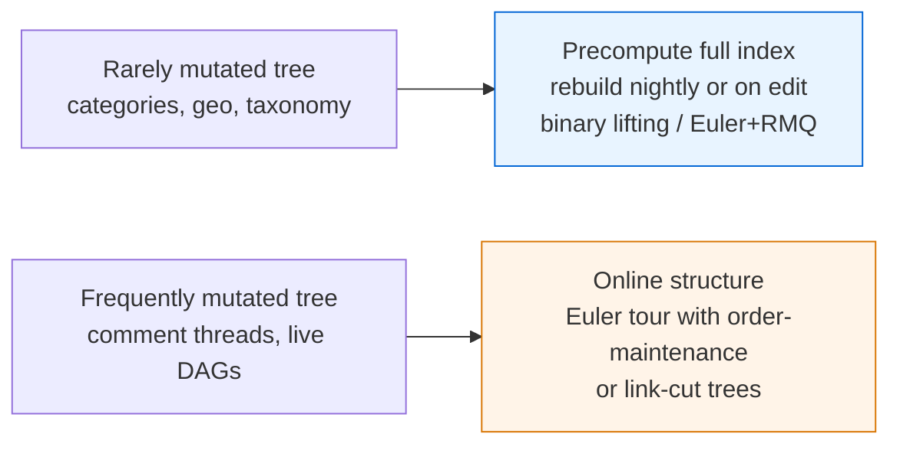

# Lowest Common Ancestor — Senior Level

> LCA on a single small tree is a 30-line snippet. LCA as the backbone of a hierarchy service — categories, filesystems, taxonomies, permission trees — is a system-design problem where the table's `O(N log N)` memory, immutability, rebuild cost on tree mutation, and read concurrency all become production concerns.

## Table of Contents
1. [Introduction](#1-introduction)
2. [System Design with LCA over Hierarchies](#2-system-design-with-lca-over-hierarchies)
3. [Distributed and Large-Tree LCA](#3-distributed-and-large-tree-lca)
4. [Concurrency: Immutable Tables, Lock-Free Reads](#4-concurrency-immutable-tables-lock-free-reads)
5. [Comparison at Scale](#5-comparison-at-scale)
6. [Architecture Patterns](#6-architecture-patterns)
7. [Code Examples](#7-code-examples)
8. [Observability](#8-observability)
9. [Failure Modes](#9-failure-modes)
10. [Capacity Planning](#10-capacity-planning)
11. [Summary](#11-summary)

---

## 1. Introduction

At the senior level the question is not "how does binary lifting work" but "where does an LCA index belong in my system, and what breaks when it does?". An LCA structure is, at its core, a **precomputed, read-optimized index over a rooted tree**. That framing tells you its three defining properties:

- It is **static**: it assumes the tree does not change between build and query.
- It is **memory-heavy** for the fast variants: `O(N log N)` for binary lifting or sparse-table RMQ.
- It is **read-dominated**: built once, queried millions of times.

The interesting decisions are therefore architectural:

1. What is the tree, really — a category tree, a filesystem, an org chart, a comment thread, a taxonomy?
2. How do you keep the index correct when the underlying tree mutates?
3. How do you serve concurrent reads without locks?
4. When does the tree outgrow one machine, and what do you do then?
5. How do you observe and capacity-plan an index whose memory grows as `N log N`?

This document answers those questions in production terms.

---

## 2. System Design with LCA over Hierarchies

### 2.1 Where LCA shows up in real systems

| Domain | The tree | LCA answers |
| --- | --- | --- |
| E-commerce categories | Category taxonomy (Electronics → Phones → Android) | "Most specific shared category of two products" for breadcrumbs, faceting, related-item rules. |
| Filesystem / object store | Directory tree | "Common ancestor directory of two paths" for permission inheritance and quota rollups. |
| Org / RBAC | Reporting or permission tree | "Lowest manager both employees report to" for approval routing. |
| Taxonomy / ontology services | Concept hierarchy | "Most specific common concept" (semantic distance, recommendations). |
| Comment threads | Reply tree | "Where two replies diverge" for collapsing and context. |
| Geo / region hierarchy | Continent → country → state → city | "Smallest region containing two places." |

In every case the *query* is cheap; the engineering is in **build cost, freshness, and memory**.

### 2.2 The build-vs-freshness tension

A category tree changes rarely (a few edits per day) but is queried constantly. A comment tree changes constantly. These two extremes pick different strategies:



For most hierarchy services the tree is firmly in the "rarely mutated" camp, and a **precomputed immutable index rebuilt on change** is the right answer.

---

## 3. Distributed and Large-Tree LCA

### 3.1 When the tree exceeds one machine

A binary-lifting table for `N = 10^8` nodes with `LOG = 27` is `10^8 × 27 × 4 bytes ≈ 10.8 GB` just for `up[][]`. That is uncomfortable but feasible on a big box. Beyond `~10^9` nodes you must either shrink the index or partition.

**Index-shrinking options (single machine):**

- Drop binary lifting; use **Euler tour + sparse-table RMQ** (`2N` Euler entries, `O(N log N)` table) — similar memory but `O(1)` queries.
- Use **Farach-Colton–Bender** `O(N)`/`O(1)` (see `professional.md`) to cut the index to `O(N)`.
- Store only `tin`/`tout` (`2N` integers) if you only need **ancestor tests**, not full LCA.

### 3.2 Out-of-core and precomputed answers

If the tree is enormous but queries cluster on a small "hot" subtree, precompute the index only for the hot region and fall back to a slower on-disk parent-pointer climb for cold nodes.

Alternatively, **materialize answers**: many hierarchy services do not need arbitrary LCA — they need ancestor *paths*. Storing each node's root-to-node path (a "materialized path" like `/1/7/23/`) lets you compute LCA as the **longest common prefix** of two paths with no index at all. This is the pattern Postgres `ltree`, MPTT, and closure tables use. Trade-off: `O(depth)` per query and expensive subtree moves, but trivial to shard by path prefix.

### 3.3 Partitioning a huge tree

Split the tree into a **top tree** (near the root, replicated everywhere) and **subtrees** sharded by their attach point. An LCA query:

- If both nodes are in the same shard, answer locally.
- If they are in different shards, their LCA lies in the replicated top tree — answer from the replica.

This is effectively a two-level LCA and mirrors how hierarchical routing tables work.

---

## 4. Concurrency: Immutable Tables, Lock-Free Reads

### 4.1 The big win: the index is immutable after build

Binary-lifting tables, Euler tours, and sparse tables are **never mutated by a query**. A query only *reads* `up[][]`, `depth[]`, `first[]`, and the sparse table. That means:

- Any number of threads can query concurrently **with zero locks**.
- No false sharing on writes, no cache-line ping-pong — only shared reads.
- The structure is trivially safe to memory-map and share across processes.

This is the single most important senior-level property: an LCA index is a **read-only artifact**, and read-only artifacts scale linearly with cores.

### 4.2 Updating under concurrency: copy-on-rebuild

When the tree changes, you cannot mutate the index in place safely while readers run. The standard pattern is **atomic pointer swap**:

1. Build a fresh index from the new tree in the background.
2. Publish it by atomically swapping a single pointer (`atomic.Value` in Go, `AtomicReference` in Java, an immutable rebind in Python with the GIL).
3. Old readers keep using the old index until they finish; new readers see the new one. Garbage-collect the old index when the last reader drops it.

This gives **lock-free reads** and **safe updates** at the cost of a full rebuild per change — acceptable when changes are rare.

### 4.3 Incremental updates

If rebuilds are too frequent, you need an **online** structure: an Euler tour stored in a balanced BST / order-maintenance structure (insert/delete a subtree in `O(log N)`), or **link-cut trees** for fully dynamic forests. These trade the `O(1)`/`O(log N)` static query for `O(log N)` amortized dynamic operations and far more code. Reach for them only when the tree genuinely mutates faster than you can rebuild.

---

## 5. Comparison at Scale

| Approach | Build | Query | Memory | Mutation story | When |
| --- | --- | --- | --- | --- | --- |
| Binary lifting | `O(N log N)` | `O(log N)` | `O(N log N)` | rebuild on change | Default; also k-th ancestor and path aggregates. |
| Euler + sparse RMQ | `O(N log N)` | `O(1)` | `O(N log N)` | rebuild | Huge read volume, static tree. |
| Farach-Colton–Bender | `O(N)` | `O(1)` | `O(N)` | rebuild | Very large `N`, tight memory. |
| Materialized path / `ltree` | `O(N)` write | `O(depth)` | `O(N·depth)` | cheap inserts, costly moves | DB-backed hierarchies, shard by prefix. |
| Closure table | `O(N²)` worst write | `O(1)` ancestor test | `O(#ancestor pairs)` | per-edge insert/delete | SQL ancestor queries, moderate depth. |
| Link-cut trees | `O(N)` | `O(log N)` amort. | `O(N)` | fully dynamic | Tree changes faster than rebuild. |

For a static or rarely-changing tree served from RAM, **binary lifting or Euler+RMQ** dominates. For a DB-backed hierarchy that must be queried in SQL, **materialized path** or a **closure table** is the production answer even though it is asymptotically weaker.

---

## 6. Architecture Patterns

### 6.1 Index-as-a-service

```
   tree source (DB) ---> [Indexer job] ---> immutable LCA artifact (mmap blob)
                                                 |
                              atomic publish      v
   query API  <----  [Read replicas load artifact, lock-free reads]
```

The indexer rebuilds on a schedule or on a change event, writes a versioned artifact, and read replicas hot-swap to it. This is how search-style "build once, serve many" indexes work, applied to LCA.

### 6.2 Versioned artifacts and rollback

Tag each artifact with the source tree version. If a rebuild produces a corrupt or surprising index, roll back by re-publishing the previous artifact pointer. Because the artifact is immutable, rollback is just a pointer change.

### 6.3 Embedded vs remote

- **Embedded**: the index lives in the query service's address space (best latency, must fit in RAM, rebuild redeploys the artifact).
- **Remote**: a dedicated "hierarchy service" owns the index and answers RPCs (one source of truth, network hop per query — batch queries to amortize).

Batch the remote API: a single RPC carrying 1000 `(u, v)` pairs amortizes the network cost and keeps per-query latency low.

---

## 7. Code Examples

### 7.1 Go — immutable index with atomic hot-swap (lock-free reads)

```go
package lca

import (
	"sync/atomic"
)

// Index is an immutable, read-only LCA artifact. Safe for concurrent reads.
type Index struct {
	up    [][]int32
	depth []int32
	log   int
}

func Build(n, root int, parent []int32, children [][]int32) *Index {
	log := 1
	for (1 << log) < n {
		log++
	}
	idx := &Index{
		up:    make([][]int32, log),
		depth: make([]int32, n),
		log:   log,
	}
	for k := range idx.up {
		idx.up[k] = make([]int32, n)
	}
	// iterative BFS/DFS to fill up[0] and depth (omitted: standard)
	fillBase(idx, root, parent, children)
	for k := 1; k < log; k++ {
		for v := 0; v < n; v++ {
			idx.up[k][v] = idx.up[k-1][idx.up[k-1][v]]
		}
	}
	return idx
}

// Query is pure-read: no locks, safe from any number of goroutines.
func (ix *Index) Query(u, v int32) int32 {
	if ix.depth[u] < ix.depth[v] {
		u, v = v, u
	}
	diff := ix.depth[u] - ix.depth[v]
	for k := 0; k < ix.log; k++ {
		if (diff>>k)&1 == 1 {
			u = ix.up[k][u]
		}
	}
	if u == v {
		return u
	}
	for k := ix.log - 1; k >= 0; k-- {
		if ix.up[k][u] != ix.up[k][v] {
			u = ix.up[k][u]
			v = ix.up[k][v]
		}
	}
	return ix.up[0][u]
}

// Service holds the current immutable index behind an atomic pointer.
type Service struct {
	cur atomic.Pointer[Index]
}

func (s *Service) Publish(ix *Index) { s.cur.Store(ix) } // atomic swap

func (s *Service) LCA(u, v int32) int32 {
	return s.cur.Load().Query(u, v) // lock-free read of the live index
}

func fillBase(ix *Index, root int, parent []int32, children [][]int32) {
	ix.up[0][root] = int32(root) // root parent = itself (sentinel)
	ix.depth[root] = 0
	stack := []int{root}
	for len(stack) > 0 {
		v := stack[len(stack)-1]
		stack = stack[:len(stack)-1]
		for _, c := range children[v] {
			ix.up[0][c] = int32(v)
			ix.depth[c] = ix.depth[v] + 1
			stack = append(stack, int(c))
		}
	}
}
```

The whole point: `Query` touches only immutable arrays; `Publish` swaps one pointer. Readers never block, and an update never tears a reader's view.

### 7.2 Java — `AtomicReference` hot-swap

```java
import java.util.concurrent.atomic.AtomicReference;

public final class LcaService {
    // Immutable index: all fields final, never mutated after construction.
    public static final class Index {
        final int[][] up;
        final int[] depth;
        final int log;

        Index(int[][] up, int[] depth, int log) {
            this.up = up; this.depth = depth; this.log = log;
        }

        int query(int u, int v) {
            if (depth[u] < depth[v]) { int t = u; u = v; v = t; }
            int diff = depth[u] - depth[v];
            for (int k = 0; k < log; k++)
                if (((diff >> k) & 1) == 1) u = up[k][u];
            if (u == v) return u;
            for (int k = log - 1; k >= 0; k--)
                if (up[k][u] != up[k][v]) { u = up[k][u]; v = up[k][v]; }
            return up[0][u];
        }
    }

    private final AtomicReference<Index> current = new AtomicReference<>();

    public void publish(Index ix) { current.set(ix); }     // atomic swap
    public int lca(int u, int v) { return current.get().query(u, v); } // lock-free
}
```

`final` fields give a safe-publication guarantee: once an `Index` is constructed and stored, every thread that reads the `AtomicReference` sees a fully-built, immutable object.

### 7.3 Python — copy-on-rebuild under the GIL

```python
import threading
from typing import List


class LcaIndex:
    """Immutable after build. Reads need no lock (pure array reads)."""

    __slots__ = ("up", "depth", "log")

    def __init__(self, up: List[List[int]], depth: List[int], log: int):
        self.up = up
        self.depth = depth
        self.log = log

    def query(self, u: int, v: int) -> int:
        depth, up, log = self.depth, self.up, self.log
        if depth[u] < depth[v]:
            u, v = v, u
        diff = depth[u] - depth[v]
        k = 0
        while diff:
            if diff & 1:
                u = up[k][u]
            diff >>= 1
            k += 1
        if u == v:
            return u
        for k in range(log - 1, -1, -1):
            if up[k][u] != up[k][v]:
                u = up[k][u]
                v = up[k][v]
        return up[0][u]


class LcaService:
    def __init__(self) -> None:
        self._index: LcaIndex | None = None
        self._build_lock = threading.Lock()  # serialize *builders*, not readers

    def publish(self, index: LcaIndex) -> None:
        # Rebinding an attribute is atomic under CPython's GIL.
        self._index = index

    def lca(self, u: int, v: int) -> int:
        idx = self._index  # snapshot the reference once
        assert idx is not None
        return idx.query(u, v)  # lock-free read
```

Under CPython the GIL makes the attribute rebind atomic, so readers observe either the old or the new index, never a half-built one. The lock guards only concurrent *builders*.

---

## 8. Observability

An LCA index is invisible until it goes stale or runs out of memory. Wire these from day one.

| Metric | Type | Why |
| --- | --- | --- |
| `lca_index_nodes` | gauge | Track `N`; drives the `N log N` memory model. |
| `lca_index_bytes` | gauge | Actual table memory; alert before OOM. |
| `lca_build_seconds` | histogram | Rebuild latency; if it approaches the change rate, you need an online structure. |
| `lca_index_age_seconds` | gauge | Staleness: how long since the source tree changed but the index did not. |
| `lca_query_latency_seconds` | histogram | Detect cache-miss regressions as `N` grows. |
| `lca_query_qps` | counter | Read volume; justifies `O(1)` variants. |
| `lca_publish_total` | counter | Hot-swaps; spikes mean churny trees. |
| `lca_rollback_total` | counter | Bad-artifact rollbacks. |

The most useful one is **`lca_index_age_seconds`**: a hierarchy service that silently serves a week-old category tree is a correctness incident no latency dashboard will catch.

---

## 9. Failure Modes

### 9.1 Stale index
The tree changed but the rebuild failed or was skipped. Queries return *valid-looking but wrong* ancestors. Mitigate with `index_age` alerts and a version check between source and artifact.

### 9.2 OOM during rebuild
Building a fresh `N log N` table while the old one is still live doubles memory momentarily. A growing tree can OOM exactly at publish time. Mitigate by sizing for `2×` the index, building incrementally, or switching to the `O(N)` Farach-Colton–Bender index.

### 9.3 Wrong root / re-rooting
LCA is defined relative to a root. If an upstream process re-roots the tree (e.g., a category is promoted to top level) and the index is not rebuilt, every answer is wrong. Treat root changes as a forced rebuild.

### 9.4 Non-tree input
A cycle or a second parent slips into the source (data-quality bug). The DFS may loop or produce an inconsistent `depth[]`. Validate that the input is a single rooted tree (exactly `N − 1` edges, connected, acyclic) before building.

### 9.5 Recursion overflow on build
A deep, path-like tree overflows a recursive DFS during indexing. Always build with an **iterative** traversal in production indexers.

### 9.6 Sentinel corruption
Root's parent left as a real node id, so overshooting jumps read a valid-but-wrong node and produce subtly wrong LCAs near the root. Always set `up[0][root] = root`.

---

## 10. Capacity Planning

### 10.1 Memory model

Binary lifting: `up[][]` is `N × LOG` integers, `LOG = ceil(log2 N)`.

| `N` | `LOG` | `up[][]` (4-byte ints) | + `depth` | Total |
| --- | --- | --- | --- | --- |
| 10^5 | 17 | ~6.8 MB | 0.4 MB | ~7 MB |
| 10^6 | 20 | ~80 MB | 4 MB | ~84 MB |
| 10^7 | 24 | ~960 MB | 40 MB | ~1 GB |
| 10^8 | 27 | ~10.8 GB | 0.4 GB | ~11 GB |

Use 32-bit indices (`int32`) when `N < 2^31` to halve memory. Euler+RMQ has comparable memory (`2N` Euler entries × `LOG`); Farach-Colton–Bender cuts it to roughly `O(N)`.

### 10.2 Build time

Roughly `N × LOG` simple operations: ~`10^7` ops for `N = 10^5`, ~`2×10^8` for `N = 10^7`. Expect tens of milliseconds at `10^5`, a few seconds at `10^7`. If build time approaches your change interval, you have outgrown copy-on-rebuild.

### 10.3 Query throughput

A lock-free `O(log N)` query on an in-RAM table runs in well under a microsecond; a single core sustains millions of QPS, and it scales linearly with cores because reads share immutable memory. The bottleneck is cache misses into `up[][]` for large `N`, which the `O(1)` Euler+RMQ variant reduces.

### 10.4 When to leave the single-node, precomputed model

Move off it when any of these holds:

- The tree no longer fits in RAM even with `int32` and Farach-Colton–Bender (`N > ~10^9`).
- The tree mutates faster than you can rebuild (→ link-cut trees or order-maintenance Euler tour).
- You must query in SQL (→ materialized path or closure table).
- You need cross-region serving (→ replicate the immutable artifact to each region).

---

## 11. Summary

- An LCA index is a **precomputed, immutable, read-optimized** structure: build once, query forever, swap atomically on change.
- Its defining tension is **memory vs query speed vs freshness**. Binary lifting (`O(N log N)` memory, `O(log N)` query) is the default; Euler+RMQ buys `O(1)` queries; Farach-Colton–Bender cuts memory to `O(N)`.
- Immutability is the superpower: **lock-free concurrent reads**, safe mmap sharing, trivial rollback via pointer swap.
- Mutating trees break the static model. Rebuild on change if changes are rare; reach for order-maintenance Euler tours or link-cut trees only when they are not.
- For DB-backed hierarchies, materialized paths and closure tables are the pragmatic production answer despite weaker asymptotics.
- Instrument **index age** above all else — a stale hierarchy index is a silent correctness bug.
- Plan memory from the `N log N` model, prefer `int32`, and build iteratively so deep trees do not overflow the indexer.
