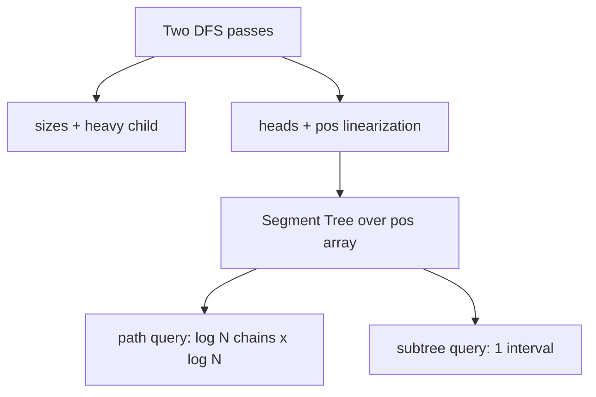

# Heavy-Light Decomposition — Junior Level

> **One-line summary:** Heavy-Light Decomposition (HLD) cuts a rooted tree's edges into "heavy" and "light" so that any root-to-node path crosses only `O(log N)` light edges — meaning it touches only `O(log N)` heavy *chains*. Each chain becomes a contiguous slice of one array, so a Segment Tree or Fenwick tree over that array can answer **path** and **subtree** queries on the tree in `O(log² N)`.

---

## Table of Contents

1. [Introduction](#introduction)
2. [Prerequisites](#prerequisites)
3. [Glossary](#glossary)
4. [Core Concepts](#core-concepts)
5. [Big-O Summary](#big-o-summary)
6. [Real-World Analogies](#real-world-analogies)
7. [Pros & Cons](#pros--cons)
8. [Step-by-Step Walkthrough](#step-by-step-walkthrough)
9. [Code Examples](#code-examples)
10. [Coding Patterns](#coding-patterns)
11. [Error Handling](#error-handling)
12. [Performance Tips](#performance-tips)
13. [Best Practices](#best-practices)
14. [Edge Cases & Pitfalls](#edge-cases--pitfalls)
15. [Common Mistakes](#common-mistakes)
16. [Cheat Sheet](#cheat-sheet)
17. [Visual Animation](#visual-animation)
18. [Summary](#summary)
19. [Further Reading](#further-reading)

---

## Introduction

Imagine you have a tree of `N` nodes. Each node holds a value (a price, a weight, a color). You are asked thousands of questions like:

- "What is the **sum** of the values on the path from node `u` to node `v`?"
- "What is the **maximum** edge weight on the path from `u` to `v`?"
- "**Add 5** to every node on the path from `u` to `v`."
- "What is the **sum of the whole subtree** rooted at node `w`?"

On an **array**, these are easy: a Segment Tree answers range queries and range updates in `O(log N)`. But a tree is not a line — a path between two nodes can zig-zag through the structure, and there is no obvious way to lay a tree's path onto a flat array.

**Heavy-Light Decomposition** is the trick that makes a tree behave like a small number of arrays. The idea, introduced by **Sleator and Tarjan in 1983** (as part of their work on Link-Cut Trees), is deceptively simple:

1. For every node, pick its **heavy child** — the child whose subtree is the biggest. The edge to that child is a **heavy edge**. Every other child-edge is **light**.
2. Heavy edges link up into long vertical **chains**. Crucially, any path from the root down to a node crosses **at most `⌊log₂ N⌋` light edges** — so it passes through at most `O(log N)` heavy chains.
3. Number the nodes with a DFS that always visits the heavy child first. Then **every chain occupies a contiguous block of indices** in that numbering. Now a Segment Tree built over the numbering can answer queries on any single chain as a normal range query.

A path query `path(u, v)` is split at their **LCA** (Lowest Common Ancestor) into `O(log N)` chain pieces. Each piece is one Segment Tree range query of cost `O(log N)`, so the total is `O(log N) × O(log N) = O(log² N)`. Subtree queries are even simpler — a subtree is a single contiguous interval, so it is one Segment Tree query.

HLD sits next to two siblings you will meet later: **13-lca** (which answers ancestor questions but not weighted path aggregates) and **15-centroid-decomposition** (which answers a *different* class of "all pairs through a center" problems). HLD is the go-to tool when you need **path + subtree aggregates with updates** on a *static-shaped* tree.

---

## Prerequisites

Before reading this file you should be comfortable with:

- **Rooted trees** — parent, child, subtree, ancestor, depth. We root the tree at node 0 (or 1).
- **DFS (Depth-First Search)** — both recursive and the idea of an iterative version. HLD is built from two DFS passes.
- **The Segment Tree** (sibling section `09-trees/06-segment-tree`) — range sum/min/max and point/range updates in `O(log N)`. HLD is "the thing that feeds a Segment Tree." A Fenwick / BIT works too for sums.
- **LCA — Lowest Common Ancestor** (sibling `13-lca`) — the deepest node that is an ancestor of both `u` and `v`. You need the *idea*; HLD can even compute the LCA itself.
- **Big-O notation** — especially `O(log N)` and `O(log² N)`.
- **Arrays and zero-based indexing** — the chains are laid into one flat array.

Optional but helpful:

- A first exposure to **Euler tours** for subtree queries (in-time / out-time intervals).
- Familiarity with **recursion depth limits** in your language (Python's default is ~1000).

---

## Glossary

| Term | Meaning |
|------|---------|
| **Rooted tree** | A tree with one node chosen as the root; every other node has a unique parent. |
| **Subtree size** | The number of nodes in the subtree rooted at a node (including itself). |
| **Heavy child** | For a node, the child whose subtree has the **largest** size (ties broken arbitrarily). |
| **Heavy edge** | The edge from a node to its heavy child. |
| **Light edge** | Any child-edge that is *not* heavy. |
| **Heavy chain (path)** | A maximal sequence of nodes connected by heavy edges, running top-to-bottom. |
| **Chain head (top)** | The highest (closest to root) node of a chain. |
| **`pos[v]` / position** | The index assigned to node `v` in the flat array (the order in which the special DFS visited it). |
| **`head[v]`** | The chain head of the chain that contains `v`. |
| **`heavy[v]`** | The heavy child of `v`, or `-1` / `None` if `v` is a leaf. |
| **LCA** | Lowest Common Ancestor of two nodes — the deepest node that is an ancestor of both. |
| **Path query** | A query (sum / min / max / update) over all nodes (or edges) on the path between two nodes. |
| **Subtree query** | A query over all nodes in a subtree — answered as one contiguous interval. |
| **Edge values vs vertex values** | Whether the data lives on edges or on nodes. Edge values need a careful "skip the LCA" fix. |

---

## Core Concepts

### 1. Heavy and light edges

For a node `v` with children `c₁, c₂, …`, the **heavy child** is the one with the maximum subtree size:

```
heavy(v) = argmax over children c of  size(c)
```

The edge `v → heavy(v)` is **heavy**. Every other edge `v → cᵢ` is **light**.

Why this particular rule? Because of a beautiful counting fact:

> **When you go *down* a light edge `v → c`, the subtree size at least halves: `size(c) ≤ size(v) / 2`.**

Here is the one-line reason: if a light child `c` had `size(c) > size(v)/2`, it would be strictly bigger than all the other children combined plus `v` itself — so it would be *the* biggest child and therefore the heavy one. Contradiction. So a light child has at most half the nodes of its parent.

Starting from the root (`size = N`), each light edge you traverse halves the count, and you cannot halve more than `⌊log₂ N⌋` times before reaching 1. **Therefore any root-to-node path contains at most `⌊log₂ N⌋` light edges.** That is the whole magic of HLD.

### 2. Chains

Connect every heavy edge and you get vertical **chains**. Each chain:

- starts at a **head** (a node reached from its parent by a *light* edge, or the root),
- and runs straight down following heavy edges until it hits a leaf.

Because a path crosses `O(log N)` light edges, it enters `O(log N)` distinct chains.

### 3. The array mapping (linearization)

Run a DFS from the root that **always recurses into the heavy child first**, then into the light children. Assign each node an increasing position `pos[v] = 0, 1, 2, …` in visit order.

Because the heavy child is visited immediately after its parent, **every chain becomes a contiguous run of positions**. A chain that starts at `head` and ends at some leaf occupies `pos[head], pos[head]+1, …, pos[leaf]`.

Now build a Segment Tree over an array `base[]` where `base[pos[v]] = value(v)`. Any query restricted to one chain is a Segment Tree query on the interval `[pos[head], pos[v]]`.

### 4. Answering `path(u, v)`

To aggregate over the path from `u` to `v`:

```
result = identity
while head[u] != head[v]:
    if depth[head[u]] < depth[head[v]]:
        swap u, v                      # always lift the deeper head
    result = combine(result, query(pos[head[u]], pos[u]))   # one chain segment
    u = parent[head[u]]                # jump to the chain above
# now u and v are on the same chain
if depth[u] > depth[v]: swap u, v
result = combine(result, query(pos[u], pos[v]))             # final segment
return result
```

We repeatedly take the node whose chain head is **deeper**, query its top chain segment, then jump over the light edge to the parent of that head. After `O(log N)` jumps both nodes share a chain, and one last query finishes the job. That loop *is* an LCA computation in disguise — the LCA is exactly the shallower of `u`, `v` when the loop ends.

### 5. Subtree queries

Because the special DFS numbers a node and then its **entire** subtree consecutively, the subtree of `v` is the single interval `[pos[v], pos[v] + size[v] - 1]`. One Segment Tree query — no chains needed.

---

## Big-O Summary

| Operation | Time | Space | Notes |
|-----------|------|-------|-------|
| Build (two DFS + segment tree) | **O(N)** | O(N) | First DFS: sizes + heavy child. Second: heads + positions. |
| `path(u, v)` query (sum/min/max) | **O(log² N)** | O(1) | `O(log N)` chains × `O(log N)` per segment-tree query. |
| `path(u, v)` update (point or range) | **O(log² N)** | O(1) | Same chain decomposition, with a range-update segment tree. |
| Subtree query | **O(log N)** | O(1) | One interval `[pos[v], pos[v]+size[v]-1]`. |
| Subtree update | **O(log N)** | O(1) | One interval, lazy segment tree. |
| Single-node update | **O(log N)** | O(1) | Point update at `pos[v]`. |
| LCA via HLD | **O(log N)** | O(1) | Same chain-head jumping, no segment tree. |
| Total space | **O(N)** | — | Arrays `size, heavy, head, parent, depth, pos` + segment tree. |

---

## Real-World Analogies

| Concept | Analogy |
|---------|---------|
| Heavy chains | A national road network. The **highways** (heavy chains) run long and straight; you stay on a highway as far as you can. The **on/off ramps** (light edges) are the few places where you switch highways. |
| "≤ log N light edges" | To drive between any two towns you only ever switch highways a handful of times, even though there are millions of towns — because each switch takes you to a much "smaller" region of the map. |
| Chain → contiguous array slice | Each highway is given a contiguous range of mile-markers, so asking "total toll between mile 12 and mile 40 on Highway 1" is one lookup. |
| Path query splitting at the LCA | A trip from town A to town B goes *up* to a shared junction (the LCA) and back *down*. You pay tolls highway-by-highway, switching at each ramp. |
| Subtree query | "Everything reachable below this junction" happens to be one continuous block of mile-markers, so it is a single lookup. |

Where the analogy breaks: real highways form a graph with loops; a tree has exactly one path between any two nodes, which is why the decomposition is clean and the LCA is unique.

---

## Pros & Cons

| Pros | Cons |
|------|------|
| Turns hard tree-path problems into ordinary array range queries. | `O(log² N)` per path query — an extra `log` over a plain Segment Tree. |
| Handles **both** path and subtree queries with the *same* numbering. | More code than an Euler tour; easy to get the edge-vs-vertex off-by-one wrong. |
| Supports updates (point, path, subtree) with a lazy Segment Tree. | The tree structure must be **static** (shape can't change). For dynamic trees use Link-Cut Trees. |
| `O(N)` build, `O(N)` memory — cheap to set up. | Deep trees can blow the recursion stack; you may need an iterative DFS. |
| Computes the LCA for free as a side effect. | The chain-head jumping order (always lift the deeper head) is subtle. |
| Composes with Fenwick (sums) or Segment Tree (any monoid). | Not the right tool for "count pairs of nodes with property X" — that's centroid decomposition. |

**When to use:** path sum/min/max/assignment on a fixed tree, subtree aggregates, "max edge weight on path," mixed path-and-subtree problems, tree + segment-tree combined tasks.

**When NOT to use:** only subtree queries (a plain Euler tour is simpler), the tree shape changes over time (use Link-Cut Trees), or "count/aggregate over all paths through a center" (use centroid decomposition, sibling `15`).

---

## Step-by-Step Walkthrough

Take this small tree rooted at **1** (node values shown in brackets):

```
                1[5]
              /  |   \
           2[3] 3[8] 4[1]
           /  \        \
        5[2]  6[4]     7[6]
        /
      8[9]
```

**Step 1 — subtree sizes (first DFS, post-order):**

```
size(8)=1
size(5)=2   (5 + 8)
size(6)=1
size(2)=4   (2 + 5 + 6 + 8)
size(3)=1
size(7)=1
size(4)=2   (4 + 7)
size(1)=8   (whole tree)
```

**Step 2 — heavy child of each node (biggest subtree):**

```
heavy(1) = 2   (size 4 beats 3's 1 and 4's 2)
heavy(2) = 5   (size 2 beats 6's 1)
heavy(5) = 8
heavy(4) = 7
others are leaves
```

Heavy edges: `1–2`, `2–5`, `5–8`, `4–7`. All other edges (`1–3`, `1–4`, `2–6`) are **light**.

**Step 3 — chains** (follow heavy edges down from each head):

```
Chain A:  1 → 2 → 5 → 8     head = 1
Chain B:  3                 head = 3   (reached by light edge 1–3)
Chain C:  4 → 7             head = 4   (reached by light edge 1–4)
Chain D:  6                 head = 6   (reached by light edge 2–6)
```

**Step 4 — positions (second DFS, heavy child first):** Visit `1`, then heavy child `2`, then `5`, then `8` (chain A fully), then back up to take light children. A consistent order:

```
pos:  1→0  2→1  5→2  8→3  6→4  3→5  4→6  7→7
```

Chain A occupies positions `0,1,2,3` — contiguous. Chain C (`4,7`) occupies `6,7` — contiguous. 

The `base[]` array fed to the Segment Tree (values at each position):

```
position:  0   1   2   3   4   5   6   7
node:      1   2   5   8   6   3   4   7
value:    [5] [3] [2] [9] [4] [8] [1] [6]
```

**Step 5 — answer `path(8, 7)` (sum of values).** The LCA of 8 and 7 is node 1.

```
head[8]=1 (depth 0),  head[7]=4 (depth 1)
→ head[7] is deeper, lift v=7: query pos[head[7]=4 → pos 6 .. pos[7]=7] = values 1+6 = 7
  jump to parent[head[7]] = parent[4] = 1
head[8]=1, head[1]=1 → same chain now (u=8, v=1)
→ final query pos[1]=0 .. pos[8]=3 = 5+3+2+9 = 19
total = 7 + 19 = 26
```

Path `8 → 5 → 2 → 1 → 4 → 7` has values `9+2+3+5+1+6 = 26`. Correct.

---

## Code Examples

### Example: Build HLD + path-sum query (vertex values)

This minimal version uses a plain Segment Tree for **sum** with **point updates** and **path-sum queries** on **vertex** values.

#### Go

```go
package main

import "fmt"

type HLD struct {
	n                          int
	adj                        [][]int
	parent, depth, heavy, size []int
	head, pos                  []int
	seg                        []int64 // segment tree (sum), size 2*n
	cur                        int
}

func NewHLD(n int) *HLD {
	h := &HLD{n: n, adj: make([][]int, n)}
	h.parent = make([]int, n)
	h.depth = make([]int, n)
	h.heavy = make([]int, n)
	h.size = make([]int, n)
	h.head = make([]int, n)
	h.pos = make([]int, n)
	h.seg = make([]int64, 2*n)
	for i := range h.heavy {
		h.heavy[i] = -1
	}
	return h
}

func (h *HLD) AddEdge(u, v int) {
	h.adj[u] = append(h.adj[u], v)
	h.adj[v] = append(h.adj[v], u)
}

// First DFS: subtree sizes + heavy child. Iterative to avoid deep recursion.
func (h *HLD) dfsSize(root int) {
	h.parent[root] = -1
	h.depth[root] = 0
	order := []int{root}
	stack := []int{root}
	visited := make([]bool, h.n)
	visited[root] = true
	for len(stack) > 0 {
		u := stack[len(stack)-1]
		stack = stack[:len(stack)-1]
		for _, w := range h.adj[u] {
			if !visited[w] {
				visited[w] = true
				h.parent[w] = u
				h.depth[w] = h.depth[u] + 1
				order = append(order, w)
				stack = append(stack, w)
			}
		}
	}
	// process in reverse BFS/DFS order = children before parents
	for i := len(order) - 1; i >= 0; i-- {
		u := order[i]
		h.size[u] = 1
		best := 0
		for _, w := range h.adj[u] {
			if w != h.parent[u] {
				h.size[u] += h.size[w]
				if h.size[w] > best {
					best = h.size[w]
					h.heavy[u] = w
				}
			}
		}
	}
}

// Second DFS: chain heads + positions. Heavy child first.
func (h *HLD) decompose(root int) {
	type frame struct{ node, head int }
	stack := []frame{{root, root}}
	for len(stack) > 0 {
		f := stack[len(stack)-1]
		stack = stack[:len(stack)-1]
		u := f.node
		h.head[u] = f.head
		h.pos[u] = h.cur
		h.cur++
		// push light children first (processed later), heavy child last (processed next → contiguous)
		for _, w := range h.adj[u] {
			if w != h.parent[u] && w != h.heavy[u] {
				stack = append(stack, frame{w, w})
			}
		}
		if h.heavy[u] != -1 {
			stack = append(stack, frame{h.heavy[u], f.head})
		}
	}
}

func (h *HLD) Build(root int, value []int64) {
	h.dfsSize(root)
	h.decompose(root)
	for v := 0; v < h.n; v++ {
		h.update(h.pos[v], value[v])
	}
}

// --- iterative segment tree (sum, point update, range query) ---
func (h *HLD) update(i int, val int64) {
	i += h.n
	h.seg[i] = val
	for i > 1 {
		i >>= 1
		h.seg[i] = h.seg[2*i] + h.seg[2*i+1]
	}
}

func (h *HLD) queryRange(l, r int) int64 { // inclusive [l, r]
	var res int64
	for l, r = l+h.n, r+h.n+1; l < r; l, r = l>>1, r>>1 {
		if l&1 == 1 {
			res += h.seg[l]
			l++
		}
		if r&1 == 1 {
			r--
			res += h.seg[r]
		}
	}
	return res
}

func (h *HLD) PathSum(u, v int) int64 {
	var res int64
	for h.head[u] != h.head[v] {
		if h.depth[h.head[u]] < h.depth[h.head[v]] {
			u, v = v, u
		}
		res += h.queryRange(h.pos[h.head[u]], h.pos[u])
		u = h.parent[h.head[u]]
	}
	if h.depth[u] > h.depth[v] {
		u, v = v, u
	}
	res += h.queryRange(h.pos[u], h.pos[v]) // LCA is u here (vertex values)
	return res
}

func main() {
	h := NewHLD(8)
	// tree from the walkthrough, 0-indexed: node i = (i+1)
	edges := [][2]int{{0, 1}, {0, 2}, {0, 3}, {1, 4}, {1, 5}, {3, 6}, {4, 7}}
	for _, e := range edges {
		h.AddEdge(e[0], e[1])
	}
	val := []int64{5, 3, 8, 1, 2, 4, 6, 9} // values of nodes 1..8
	h.Build(0, val)
	fmt.Println(h.PathSum(7, 6)) // path 8..7 → 26
}
```

#### Java

```java
import java.util.*;

public class HLD {
    int n, cur = 0;
    List<Integer>[] adj;
    int[] parent, depth, heavy, size, head, pos;
    long[] seg;

    @SuppressWarnings("unchecked")
    HLD(int n) {
        this.n = n;
        adj = new List[n];
        for (int i = 0; i < n; i++) adj[i] = new ArrayList<>();
        parent = new int[n]; depth = new int[n];
        heavy = new int[n]; size = new int[n];
        head = new int[n]; pos = new int[n];
        seg = new long[2 * n];
        Arrays.fill(heavy, -1);
    }

    void addEdge(int u, int v) { adj[u].add(v); adj[v].add(u); }

    void dfsSize(int root) {
        parent[root] = -1; depth[root] = 0;
        int[] order = new int[n]; int cnt = 0;
        Deque<Integer> stack = new ArrayDeque<>();
        boolean[] vis = new boolean[n];
        stack.push(root); vis[root] = true;
        while (!stack.isEmpty()) {
            int u = stack.pop(); order[cnt++] = u;
            for (int w : adj[u]) if (!vis[w]) {
                vis[w] = true; parent[w] = u; depth[w] = depth[u] + 1;
                stack.push(w);
            }
        }
        for (int i = cnt - 1; i >= 0; i--) {
            int u = order[i]; size[u] = 1; int best = 0;
            for (int w : adj[u]) if (w != parent[u]) {
                size[u] += size[w];
                if (size[w] > best) { best = size[w]; heavy[u] = w; }
            }
        }
    }

    void decompose(int root) {
        Deque<int[]> stack = new ArrayDeque<>();
        stack.push(new int[]{root, root});
        while (!stack.isEmpty()) {
            int[] f = stack.pop();
            int u = f[0], hd = f[1];
            head[u] = hd; pos[u] = cur++;
            for (int w : adj[u])
                if (w != parent[u] && w != heavy[u]) stack.push(new int[]{w, w});
            if (heavy[u] != -1) stack.push(new int[]{heavy[u], hd});
        }
    }

    void build(int root, long[] value) {
        dfsSize(root); decompose(root);
        for (int v = 0; v < n; v++) update(pos[v], value[v]);
    }

    void update(int i, long val) {
        i += n; seg[i] = val;
        for (i >>= 1; i >= 1; i >>= 1) seg[i] = seg[2 * i] + seg[2 * i + 1];
    }

    long queryRange(int l, int r) { // inclusive
        long res = 0;
        for (l += n, r += n + 1; l < r; l >>= 1, r >>= 1) {
            if ((l & 1) == 1) res += seg[l++];
            if ((r & 1) == 1) res += seg[--r];
        }
        return res;
    }

    long pathSum(int u, int v) {
        long res = 0;
        while (head[u] != head[v]) {
            if (depth[head[u]] < depth[head[v]]) { int t = u; u = v; v = t; }
            res += queryRange(pos[head[u]], pos[u]);
            u = parent[head[u]];
        }
        if (depth[u] > depth[v]) { int t = u; u = v; v = t; }
        res += queryRange(pos[u], pos[v]);
        return res;
    }

    public static void main(String[] args) {
        HLD h = new HLD(8);
        int[][] edges = {{0,1},{0,2},{0,3},{1,4},{1,5},{3,6},{4,7}};
        for (int[] e : edges) h.addEdge(e[0], e[1]);
        long[] val = {5,3,8,1,2,4,6,9};
        h.build(0, val);
        System.out.println(h.pathSum(7, 6)); // 26
    }
}
```

#### Python

```python
import sys
from sys import setrecursionlimit

class HLD:
    def __init__(self, n):
        self.n = n
        self.adj = [[] for _ in range(n)]
        self.parent = [-1] * n
        self.depth = [0] * n
        self.heavy = [-1] * n
        self.size = [0] * n
        self.head = [0] * n
        self.pos = [0] * n
        self.seg = [0] * (2 * n)
        self.cur = 0

    def add_edge(self, u, v):
        self.adj[u].append(v)
        self.adj[v].append(u)

    def _dfs_size(self, root):
        order, stack, vis = [], [root], [False] * self.n
        vis[root] = True
        self.parent[root] = -1
        while stack:
            u = stack.pop()
            order.append(u)
            for w in self.adj[u]:
                if not vis[w]:
                    vis[w] = True
                    self.parent[w] = u
                    self.depth[w] = self.depth[u] + 1
                    stack.append(w)
        for u in reversed(order):
            self.size[u] = 1
            best = 0
            for w in self.adj[u]:
                if w != self.parent[u]:
                    self.size[u] += self.size[w]
                    if self.size[w] > best:
                        best = self.size[w]
                        self.heavy[u] = w

    def _decompose(self, root):
        stack = [(root, root)]
        while stack:
            u, hd = stack.pop()
            self.head[u] = hd
            self.pos[u] = self.cur
            self.cur += 1
            for w in self.adj[u]:
                if w != self.parent[u] and w != self.heavy[u]:
                    stack.append((w, w))
            if self.heavy[u] != -1:
                stack.append((self.heavy[u], hd))

    def build(self, root, value):
        self._dfs_size(root)
        self._decompose(root)
        for v in range(self.n):
            self.update(self.pos[v], value[v])

    def update(self, i, val):
        i += self.n
        self.seg[i] = val
        i >>= 1
        while i >= 1:
            self.seg[i] = self.seg[2 * i] + self.seg[2 * i + 1]
            i >>= 1

    def query_range(self, l, r):  # inclusive [l, r]
        res = 0
        l += self.n
        r += self.n + 1
        while l < r:
            if l & 1:
                res += self.seg[l]; l += 1
            if r & 1:
                r -= 1; res += self.seg[r]
            l >>= 1; r >>= 1
        return res

    def path_sum(self, u, v):
        res = 0
        while self.head[u] != self.head[v]:
            if self.depth[self.head[u]] < self.depth[self.head[v]]:
                u, v = v, u
            res += self.query_range(self.pos[self.head[u]], self.pos[u])
            u = self.parent[self.head[u]]
        if self.depth[u] > self.depth[v]:
            u, v = v, u
        res += self.query_range(self.pos[u], self.pos[v])
        return res


if __name__ == "__main__":
    h = HLD(8)
    for u, v in [(0,1),(0,2),(0,3),(1,4),(1,5),(3,6),(4,7)]:
        h.add_edge(u, v)
    h.build(0, [5, 3, 8, 1, 2, 4, 6, 9])
    print(h.path_sum(7, 6))  # 26
```

**What it does:** builds the decomposition with two iterative DFS passes, lays values into a Segment Tree, and answers a path-sum query in `O(log² N)`.
**Run:** `go run main.go` | `javac HLD.java && java HLD` | `python hld.py`

---

## Coding Patterns

### Pattern 1: The "always lift the deeper head" loop

Every path operation shares the same skeleton — query the chain whose head is deeper, then jump up:

```python
while head[u] != head[v]:
    if depth[head[u]] < depth[head[v]]:
        u, v = v, u
    do_something(pos[head[u]], pos[u])   # query OR update this chain segment
    u = parent[head[u]]
# u and v now share a chain
if depth[u] > depth[v]:
    u, v = v, u
do_something(pos[u], pos[v])
```

Swap "query" for "update" and you have path updates; the structure never changes.

### Pattern 2: Vertex values vs edge values

- **Vertex values:** store `value(v)` at `pos[v]`; the final same-chain segment is `[pos[lca], pos[deeper]]` — *includes* the LCA.
- **Edge values:** store the edge `(parent(v), v)` at `pos[v]`. On the final same-chain segment you must **skip the LCA**: query `[pos[lca] + 1, pos[deeper]]`. This `+1` is the single most common HLD bug.

### Pattern 3: Subtree as one interval

```python
def subtree_query(v):
    return query_range(pos[v], pos[v] + size[v] - 1)
```

No chain loop — the special DFS guarantees the subtree is contiguous.



---

## Error Handling

| Error | Cause | Fix |
|-------|-------|-----|
| Wrong path sum, off by the LCA's value | Edge values but you queried `[pos[lca], …]` instead of `[pos[lca]+1, …]`. | For edge values, store the edge at the *child* and skip the LCA with `+1`. |
| Index out of range in segment tree | Built the tree with the wrong size, or `pos` not in `[0, N)`. | Allocate `2*N`; assert every `pos[v]` is unique and in range. |
| Chains not contiguous | The second DFS did **not** visit the heavy child first. | In `decompose`, recurse into / push the heavy child so it is processed *immediately* after its parent. |
| `RecursionError` (Python) / stack overflow | Recursive DFS on a deep (path-like) tree of `N ~ 10⁵`. | Use the iterative DFS shown above, or raise `setrecursionlimit`. |
| Infinite loop in path query | Forgot `u = parent[head[u]]`, or compared the wrong head depths. | Always lift the node whose *head* is deeper, then jump to that head's parent. |

---

## Performance Tips

- **Build once, query many.** The two DFS passes are `O(N)`; pay them up front. All the runtime cost is in the queries.
- **Use a Fenwick tree for pure sums** — smaller constant than a Segment Tree, still `O(log N)` per chain. Use a Segment Tree when you need min/max or lazy range updates.
- **Iterative segment tree** (the `2*N` array form above) is both faster and avoids recursion overhead inside the hot path-query loop.
- **Cache `head`, `pos`, `depth` as flat arrays**, not maps — random map lookups dominate the runtime otherwise.
- **Avoid recomputing `parent[head[u]]`** by storing it; it is read on every jump.

---

## Best Practices

- Decide **vertex vs edge values up front** and write it in a comment at the top of the file. It changes the LCA handling.
- Test your HLD against a **brute-force path walk** (`O(N)` per query) on small random trees before trusting it on big inputs.
- Keep the **Segment Tree generic** (sum / min / max via a `combine` function) so the same HLD code serves many problems.
- Root the tree explicitly at a known node; never assume node 0 is the root unless you set it.
- Assert `cur == N` after `decompose` — every node must get exactly one position.

---

## Edge Cases & Pitfalls

- **Edge vs vertex off-by-one at the LCA** — the headline pitfall. Vertex values include the LCA; edge values must skip it (`pos[lca] + 1`).
- **Single node tree** (`N = 1`) — `path(u, u)` must return `value(u)` (vertex) or the identity (edge). Make sure the same-chain branch handles `u == v`.
- **`path(u, u)`** generally — the loop body never runs; the final query is a single position. Works as long as `pos[u] ≤ pos[v]` after the swap.
- **Star / path-shaped trees** — a path graph is one giant chain (great); a star is `N-1` length-1 chains (each light edge). Both are handled; the star just shows that "≤ log N chains" is a worst-case bound, not always tight.
- **Disconnected input** — HLD assumes a single rooted tree. Validate connectivity first.
- **Recursion depth** — a near-linear chain depth can overflow the call stack; prefer iterative DFS.

---

## Common Mistakes

1. **Forgetting to skip the LCA for edge values** — silently adds one extra edge's weight.
2. **Visiting light children before the heavy child** in the second DFS — chains stop being contiguous and every query breaks.
3. **Lifting the shallower head** instead of the deeper one — the loop never terminates or skips a chain.
4. **Mixing 0-indexed and 1-indexed nodes** between the tree input and the value array.
5. **Building the segment tree before computing `pos`** — values land at the wrong indices.
6. **Assuming a path query is `O(log N)`** — it is `O(log² N)`; the second `log` comes from the segment tree.

---

## Cheat Sheet

| Concept | Formula / rule |
|---------|----------------|
| Heavy child | `argmax size(child)` |
| Light edge halving | `size(light child) ≤ size(parent) / 2` |
| Light edges on any root path | `≤ ⌊log₂ N⌋` |
| Chains touched by a path | `O(log N)` |
| Path query cost | `O(log² N)` |
| Subtree query cost | `O(log N)` |
| Subtree interval | `[pos[v], pos[v] + size[v] - 1]` |
| Same-chain segment (vertex) | `[pos[lca], pos[deeper]]` |
| Same-chain segment (edge) | `[pos[lca] + 1, pos[deeper]]` |
| Jump up a chain | `u = parent[head[u]]` |

Path loop skeleton:

```text
while head[u] != head[v]:
    if depth[head[u]] < depth[head[v]]: swap(u, v)
    op(pos[head[u]], pos[u]); u = parent[head[u]]
if depth[u] > depth[v]: swap(u, v)
op(pos[u] (+1 for edges), pos[v])
```

---

## Visual Animation

> See [`animation.html`](./animation.html) for an interactive visual animation of Heavy-Light Decomposition.
>
> The animation demonstrates:
> - The tree with heavy edges and chains colored distinctly
> - Each chain's contiguous block of array positions
> - A `path(u, v)` query splitting into `O(log N)` chain segments as it climbs to the LCA
> - Step / Run / Reset controls

---

## Summary

Heavy-Light Decomposition is the bridge from "trees are hard" to "trees are just a few arrays." By choosing the heaviest child at each node, any root-to-node path crosses at most `⌊log₂ N⌋` light edges and therefore touches only `O(log N)` chains. Laying chains into a contiguous array lets a Segment Tree answer path queries in `O(log² N)` and subtree queries in `O(log N)`. Master the two DFS passes and the "lift the deeper head" loop — and remember the one rule that trips everyone up: **vertex values include the LCA, edge values skip it.**

---

## Further Reading

- Sleator, Tarjan — *A Data Structure for Dynamic Trees* (1983) — the origin of heavy paths.
- cp-algorithms.com — "Heavy-Light Decomposition" — the standard competitive-programming reference.
- Sibling `13-lca` — LCA via binary lifting and Euler tour + sparse table.
- Sibling `15-centroid-decomposition` — a different decomposition for "paths through a center" problems.
- Sibling `09-trees/06-segment-tree` — the array structure HLD feeds.
- USACO Guide — "Heavy-Light Decomposition" — annotated implementations and problem set.
