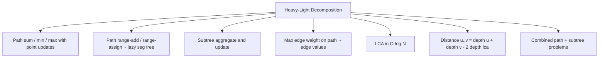

# Heavy-Light Decomposition — Middle Level

> **Focus:** *Why* a path touches only `O(log N)` chains, how HLD compares to Euler tours / centroid decomposition / Link-Cut Trees, and how to wire it to a lazy Segment Tree for path updates, edge values, and mixed path/subtree queries.

---

## Table of Contents

1. [Introduction](#introduction)
2. [Deeper Concepts](#deeper-concepts)
3. [Comparison with Alternatives](#comparison-with-alternatives)
4. [Advanced Patterns](#advanced-patterns)
5. [Graph and Tree Applications](#graph-and-tree-applications)
6. [Algorithmic Integration](#algorithmic-integration)
7. [Code Examples](#code-examples)
8. [Error Handling](#error-handling)
9. [Performance Analysis](#performance-analysis)
10. [Best Practices](#best-practices)
11. [Visual Animation](#visual-animation)
12. [Summary](#summary)

---

## Introduction

At junior level HLD is "two DFS passes and a path loop." At middle level you start asking the questions that decide whether your solution is correct *and* fast enough:

- *Why* is the light-edge count bounded by `⌊log₂ N⌋`, rigorously?
- When is an Euler tour enough, and when do you actually need HLD?
- How do you do **path updates** (add `x` to every node on a path), not just queries?
- How do you handle **edge values** without double-counting or skipping the wrong node?
- How does HLD compare to **Link-Cut Trees**, which solve the same path problems in `O(log N)` amortized but on a *dynamic* tree?

These distinctions decide whether you reach for HLD, an Euler tour, centroid decomposition, or an LCT — four tools that look similar but answer different question classes.

---

## Deeper Concepts

### Why a path crosses at most `⌊log₂ N⌋` light edges

The proof is a clean halving argument. Define `size(v)` = number of nodes in the subtree rooted at `v`.

**Lemma.** If edge `(v, c)` is **light** (i.e. `c` is *not* the heavy child of `v`), then `size(c) ≤ size(v) / 2`.

*Proof.* The heavy child `hc` is, by definition, the child with the maximum subtree size, so `size(c) ≤ size(hc)`. The children's subtrees are disjoint and all live inside `v`'s subtree, so `size(c) + size(hc) ≤ size(v)`. Combining, `2·size(c) ≤ size(c) + size(hc) ≤ size(v)`, hence `size(c) ≤ size(v)/2`. ∎

Now walk **down** from the root to any node. The first node's subtree has `size = N`. Each time you cross a *light* edge, the current subtree size at least halves. You can halve `N` only `⌊log₂ N⌋` times before reaching size 1. **Heavy** edges don't increase the count. Therefore any root-to-node path crosses `≤ ⌊log₂ N⌋` light edges, and a `u → v` path (which is two root-to-node paths joined at the LCA) crosses `≤ 2⌊log₂ N⌋` light edges. Since you only switch chains when you cross a light edge (plus the chain you start on), a path touches `O(log N)` chains. □

### Chain decomposition correctness

The second DFS recurses into the heavy child *first*. Claim: every chain is then a contiguous range of positions.

When we enter the head `h` of a chain, we assign `pos[h]`, then immediately recurse into `heavy(h)`, assigning `pos[heavy(h)] = pos[h] + 1`, and so on down the chain. Only after the whole chain (and the subtrees hanging off it via the heavy path) is fully numbered do we... wait — careful: the heavy child's *light* children are numbered *inside* the recursion, **after** the heavy chain segment that belongs to them. Let's be precise:

The DFS order is: `h`, then the heavy subtree of `h` (recursively), then the light subtrees. Because the heavy child of `h` is processed immediately, and *its* heavy child immediately after, the nodes `h, heavy(h), heavy²(h), …` (the chain) get the *first* consecutive positions in `h`'s DFS block. The light subtrees that branch off the chain are numbered later, *after* the entire heavy descent. So the chain `[h … leaf]` is exactly `[pos[h], pos[h] + (chain length − 1)]` — contiguous. ∎

This is also why the **subtree** of any node `v` is the single interval `[pos[v], pos[v] + size[v] − 1]`: the DFS numbers `v` and then all of `v`'s descendants consecutively, regardless of heavy/light structure.

### The same-chain segment and the LCA

When the path loop ends, `u` and `v` share a chain and the **shallower** of the two is exactly `LCA(u, v)`. For **vertex** values the final segment `[pos[lca], pos[deeper]]` correctly includes the LCA once. For **edge** values, where the value at `pos[c]` represents the edge `(parent(c), c)`, the LCA's stored value is the edge *above* the LCA — which is **not** on the path — so the final segment must be `[pos[lca] + 1, pos[deeper]]`.

---

## Comparison with Alternatives

| Attribute | HLD + Segment Tree | Euler tour + Segment Tree | Centroid Decomposition | Link-Cut Tree (LCT) |
|-----------|--------------------|---------------------------|------------------------|---------------------|
| Subtree query | **O(log N)** | **O(log N)** | not its purpose | O(log N) amortized |
| Path query (sum/min/max) | **O(log² N)** | ✗ (only subtree) | ✗ (different class) | **O(log N) amortized** |
| Path update (lazy) | **O(log² N)** | ✗ | ✗ | **O(log N) amortized** |
| "Count pairs of nodes with property" | ✗ | ✗ | **its specialty** | ✗ |
| Tree shape may change (link/cut) | ✗ static | ✗ static | ✗ static | **✓ dynamic** |
| LCA | O(log N) (built in) | O(1) with ±sparse table | — | O(log N) (access) |
| Implementation difficulty | medium | easy | medium | hard |
| Constant factor | moderate | low | moderate | high |

**Use an Euler tour when** you only need *subtree* queries/updates — it is strictly simpler than HLD and answers them in one interval. (An Euler tour cannot answer arbitrary *path* aggregates, because a path is not a contiguous interval in the tour.)

**Use HLD when** you need *path* queries/updates (and possibly subtree too) on a **static** tree. This is the overwhelmingly common case in contests and in read-heavy tree-analytics systems.

**Use centroid decomposition (sibling `15`) when** the problem is about *all paths through some center* — e.g. "count node pairs at distance `≤ K`." This is a fundamentally different query class; HLD cannot do it efficiently.

**Use a Link-Cut Tree when** the tree shape is **dynamic** (edges are linked and cut over time) or you genuinely need `O(log N)` per path op rather than `O(log² N)`. LCTs are harder to implement and have a larger constant, so most people prefer HLD unless dynamism is required.

---

## Advanced Patterns

### Pattern: LCA via HLD (no segment tree needed)

The chain-jumping loop computes the LCA directly:

```text
lca(u, v):
    while head[u] != head[v]:
        if depth[head[u]] < depth[head[v]]: swap(u, v)
        u = parent[head[u]]
    return u if depth[u] < depth[v] else v
```

`O(log N)` per query. If you already built HLD, you get LCA for free — no separate binary-lifting table.

### Pattern: Edge values (store the edge at the child)

Assign the weight of edge `(parent(c), c)` to position `pos[c]`. The root has no incoming edge, so `base[pos[root]] = identity`. Path operations are identical **except** the same-chain segment skips the LCA:

```text
# same-chain final segment for EDGE values:
if u != v:
    op(pos[u] + 1, pos[v])     # u is the LCA, its stored edge is above the path
```

If `u == v` (same node) there are no edges on the path — do nothing.

### Pattern: Path update with a lazy Segment Tree

To add `delta` to every node on `path(u, v)`, run the chain loop but call a **range-add** on each segment instead of a range-query:

```text
path_update(u, v, delta):
    while head[u] != head[v]:
        if depth[head[u]] < depth[head[v]]: swap(u, v)
        range_add(pos[head[u]], pos[u], delta)
        u = parent[head[u]]
    if depth[u] > depth[v]: swap(u, v)
    range_add(pos[u], pos[v], delta)     # (+1 on u for edge values)
```

The lazy Segment Tree handles the actual range update in `O(log N)` per chain, so `path_update` is `O(log² N)`. You can support both `range_add + range_sum` and `range_assign + range_max`, etc.

### Pattern: Subtree and path together

Because the *same* `pos[]` numbering makes subtrees contiguous **and** chains contiguous, a single Segment Tree serves both:

- `subtree_query(v) = query(pos[v], pos[v] + size[v] − 1)` — one interval.
- `path_query(u, v)` — the chain loop.

This is HLD's killer feature over an Euler tour: one structure, both query types. Mixed problems ("add to a subtree, then query a path") just work.

### Pattern: Max edge weight on a path (a classic)

Use edge values + a **max** Segment Tree. The path loop combines with `max` instead of `+`, and the same-chain segment uses the `+1` edge skip. A few problems also ask for "the *minimum* edge that, if increased, changes the MST" — same machinery, different combine.

---

## Graph and Tree Applications



- **Network/tree analytics:** a fixed org chart or dependency tree where you repeatedly ask "total cost along the reporting chain from employee A to employee B."
- **Routing on trees:** unique path between two nodes; aggregate a metric (latency, toll, capacity-min) along it.
- **MST-related queries:** after building an MST, "max edge weight on the tree path between `u` and `v`" answers "is edge `(u,v)` a non-tree edge that could replace a heavier tree edge?" — a building block for second-best MST.
- **Painting / coloring:** range-assign on a path (paint a corridor a color), then count distinct segments — pair HLD with a segment tree that tracks boundaries.

---

## Algorithmic Integration

HLD is a **router**: it decomposes a tree operation into `O(log N)` interval operations and hands each to an underlying array structure. The choice of array structure depends on the query:

| Underlying structure | Good for | Per-interval cost |
|----------------------|----------|-------------------|
| Fenwick / BIT | path/subtree **sum** with point updates | O(log N), small constant |
| Segment Tree | min / max / sum, any monoid | O(log N) |
| Lazy Segment Tree | range-add / range-assign + range query | O(log N) |
| Merge-sort tree / wavelet | "how many values ≤ x on the path" | O(log² N) per interval → O(log³ N) total |

The composition rule is simple: **HLD contributes one `log`, the array structure contributes the rest.** A plain Segment Tree → `O(log² N)`. A merge-sort tree → `O(log³ N)`.

**With LCA:** you don't need a separate LCA structure; HLD's chain loop gives it in `O(log N)`. Distance is then `depth[u] + depth[v] − 2·depth[lca]`.

---

## Code Examples

### Example: Path range-add + path-max query with edge values, LCA via HLD

This combines a **lazy Segment Tree** (range-add, range-max) with HLD over **edge** values, plus an explicit `lca`. Vertex `i` stores the edge `(parent(i), i)`.

#### Go

```go
package main

import "fmt"

const NEG = int64(-1) << 60

type HLD struct {
	n                          int
	adj                        [][]int
	parent, depth, heavy, size []int
	head, pos                  []int
	cur                        int
	// lazy segment tree (range add, range max)
	mx, lz []int64
}

func NewHLD(n int) *HLD {
	h := &HLD{n: n, adj: make([][]int, n)}
	h.parent = make([]int, n)
	h.depth = make([]int, n)
	h.heavy = make([]int, n)
	h.size = make([]int, n)
	h.head = make([]int, n)
	h.pos = make([]int, n)
	h.mx = make([]int64, 4*n)
	h.lz = make([]int64, 4*n)
	for i := range h.heavy {
		h.heavy[i] = -1
	}
	return h
}

func (h *HLD) AddEdge(u, v int) { h.adj[u] = append(h.adj[u], v); h.adj[v] = append(h.adj[v], u) }

func (h *HLD) dfsSize(root int) {
	order, stack, vis := []int{}, []int{root}, make([]bool, h.n)
	vis[root] = true
	h.parent[root] = -1
	for len(stack) > 0 {
		u := stack[len(stack)-1]
		stack = stack[:len(stack)-1]
		order = append(order, u)
		for _, w := range h.adj[u] {
			if !vis[w] {
				vis[w] = true
				h.parent[w] = u
				h.depth[w] = h.depth[u] + 1
				stack = append(stack, w)
			}
		}
	}
	for i := len(order) - 1; i >= 0; i-- {
		u := order[i]
		h.size[u] = 1
		best := 0
		for _, w := range h.adj[u] {
			if w != h.parent[u] {
				h.size[u] += h.size[w]
				if h.size[w] > best {
					best = h.size[w]
					h.heavy[u] = w
				}
			}
		}
	}
}

func (h *HLD) decompose(root int) {
	type fr struct{ node, head int }
	stack := []fr{{root, root}}
	for len(stack) > 0 {
		f := stack[len(stack)-1]
		stack = stack[:len(stack)-1]
		u := f.node
		h.head[u] = f.head
		h.pos[u] = h.cur
		h.cur++
		for _, w := range h.adj[u] {
			if w != h.parent[u] && w != h.heavy[u] {
				stack = append(stack, fr{w, w})
			}
		}
		if h.heavy[u] != -1 {
			stack = append(stack, fr{h.heavy[u], f.head})
		}
	}
}

func (h *HLD) push(node int) {
	if h.lz[node] != 0 {
		for _, c := range []int{2 * node, 2*node + 1} {
			h.mx[c] += h.lz[node]
			h.lz[c] += h.lz[node]
		}
		h.lz[node] = 0
	}
}

func (h *HLD) add(node, lo, hi, l, r int, v int64) {
	if r < lo || hi < l {
		return
	}
	if l <= lo && hi <= r {
		h.mx[node] += v
		h.lz[node] += v
		return
	}
	h.push(node)
	mid := (lo + hi) / 2
	h.add(2*node, lo, mid, l, r, v)
	h.add(2*node+1, mid+1, hi, l, r, v)
	h.mx[node] = max64(h.mx[2*node], h.mx[2*node+1])
}

func (h *HLD) qmax(node, lo, hi, l, r int) int64 {
	if r < lo || hi < l {
		return NEG
	}
	if l <= lo && hi <= r {
		return h.mx[node]
	}
	h.push(node)
	mid := (lo + hi) / 2
	return max64(h.qmax(2*node, lo, mid, l, r), h.qmax(2*node+1, mid+1, hi, l, r))
}

func max64(a, b int64) int64 {
	if a > b {
		return a
	}
	return b
}

func (h *HLD) LCA(u, v int) int {
	for h.head[u] != h.head[v] {
		if h.depth[h.head[u]] < h.depth[h.head[v]] {
			u, v = v, u
		}
		u = h.parent[h.head[u]]
	}
	if h.depth[u] < h.depth[v] {
		return u
	}
	return v
}

// Edge values: skip the LCA on the final segment.
func (h *HLD) PathAdd(u, v int, delta int64) {
	for h.head[u] != h.head[v] {
		if h.depth[h.head[u]] < h.depth[h.head[v]] {
			u, v = v, u
		}
		h.add(1, 0, h.n-1, h.pos[h.head[u]], h.pos[u], delta)
		u = h.parent[h.head[u]]
	}
	if h.depth[u] > h.depth[v] {
		u, v = v, u
	}
	if u != v {
		h.add(1, 0, h.n-1, h.pos[u]+1, h.pos[v], delta) // +1 skips LCA
	}
}

func (h *HLD) PathMax(u, v int) int64 {
	res := NEG
	for h.head[u] != h.head[v] {
		if h.depth[h.head[u]] < h.depth[h.head[v]] {
			u, v = v, u
		}
		res = max64(res, h.qmax(1, 0, h.n-1, h.pos[h.head[u]], h.pos[u]))
		u = h.parent[h.head[u]]
	}
	if h.depth[u] > h.depth[v] {
		u, v = v, u
	}
	if u != v {
		res = max64(res, h.qmax(1, 0, h.n-1, h.pos[u]+1, h.pos[v]))
	}
	return res
}

func main() {
	h := NewHLD(8)
	edges := [][2]int{{0, 1}, {0, 2}, {0, 3}, {1, 4}, {1, 5}, {3, 6}, {4, 7}}
	for _, e := range edges {
		h.AddEdge(e[0], e[1])
	}
	h.dfsSize(0)
	h.decompose(0)
	// give every edge initial weight 1, then bump path 7..6
	for v := 1; v < 8; v++ {
		h.add(1, 0, h.n-1, h.pos[v], h.pos[v], 1)
	}
	h.PathAdd(7, 6, 10)
	fmt.Println("LCA(7,6) =", h.LCA(7, 6))     // 0
	fmt.Println("max edge on 7..6 =", h.PathMax(7, 6)) // 11
}
```

#### Java

```java
import java.util.*;

public class HLD {
    static final long NEG = Long.MIN_VALUE / 4;
    int n, cur = 0;
    List<Integer>[] adj;
    int[] parent, depth, heavy, size, head, pos;
    long[] mx, lz;

    @SuppressWarnings("unchecked")
    HLD(int n) {
        this.n = n;
        adj = new List[n];
        for (int i = 0; i < n; i++) adj[i] = new ArrayList<>();
        parent = new int[n]; depth = new int[n]; heavy = new int[n];
        size = new int[n]; head = new int[n]; pos = new int[n];
        mx = new long[4 * n]; lz = new long[4 * n];
        Arrays.fill(heavy, -1);
    }

    void addEdge(int u, int v) { adj[u].add(v); adj[v].add(u); }

    void dfsSize(int root) {
        parent[root] = -1;
        int[] order = new int[n]; int cnt = 0;
        boolean[] vis = new boolean[n];
        Deque<Integer> st = new ArrayDeque<>(); st.push(root); vis[root] = true;
        while (!st.isEmpty()) {
            int u = st.pop(); order[cnt++] = u;
            for (int w : adj[u]) if (!vis[w]) {
                vis[w] = true; parent[w] = u; depth[w] = depth[u] + 1; st.push(w);
            }
        }
        for (int i = cnt - 1; i >= 0; i--) {
            int u = order[i]; size[u] = 1; int best = 0;
            for (int w : adj[u]) if (w != parent[u]) {
                size[u] += size[w];
                if (size[w] > best) { best = size[w]; heavy[u] = w; }
            }
        }
    }

    void decompose(int root) {
        Deque<int[]> st = new ArrayDeque<>(); st.push(new int[]{root, root});
        while (!st.isEmpty()) {
            int[] f = st.pop(); int u = f[0], hd = f[1];
            head[u] = hd; pos[u] = cur++;
            for (int w : adj[u]) if (w != parent[u] && w != heavy[u]) st.push(new int[]{w, w});
            if (heavy[u] != -1) st.push(new int[]{heavy[u], hd});
        }
    }

    void push(int node) {
        if (lz[node] != 0) {
            for (int c : new int[]{2*node, 2*node+1}) { mx[c] += lz[node]; lz[c] += lz[node]; }
            lz[node] = 0;
        }
    }
    void add(int node, int lo, int hi, int l, int r, long v) {
        if (r < lo || hi < l) return;
        if (l <= lo && hi <= r) { mx[node] += v; lz[node] += v; return; }
        push(node); int mid = (lo + hi) >> 1;
        add(2*node, lo, mid, l, r, v); add(2*node+1, mid+1, hi, l, r, v);
        mx[node] = Math.max(mx[2*node], mx[2*node+1]);
    }
    long qmax(int node, int lo, int hi, int l, int r) {
        if (r < lo || hi < l) return NEG;
        if (l <= lo && hi <= r) return mx[node];
        push(node); int mid = (lo + hi) >> 1;
        return Math.max(qmax(2*node, lo, mid, l, r), qmax(2*node+1, mid+1, hi, l, r));
    }

    int lca(int u, int v) {
        while (head[u] != head[v]) {
            if (depth[head[u]] < depth[head[v]]) { int t = u; u = v; v = t; }
            u = parent[head[u]];
        }
        return depth[u] < depth[v] ? u : v;
    }

    void pathAdd(int u, int v, long delta) {
        while (head[u] != head[v]) {
            if (depth[head[u]] < depth[head[v]]) { int t = u; u = v; v = t; }
            add(1, 0, n - 1, pos[head[u]], pos[u], delta);
            u = parent[head[u]];
        }
        if (depth[u] > depth[v]) { int t = u; u = v; v = t; }
        if (u != v) add(1, 0, n - 1, pos[u] + 1, pos[v], delta);
    }

    long pathMax(int u, int v) {
        long res = NEG;
        while (head[u] != head[v]) {
            if (depth[head[u]] < depth[head[v]]) { int t = u; u = v; v = t; }
            res = Math.max(res, qmax(1, 0, n - 1, pos[head[u]], pos[u]));
            u = parent[head[u]];
        }
        if (depth[u] > depth[v]) { int t = u; u = v; v = t; }
        if (u != v) res = Math.max(res, qmax(1, 0, n - 1, pos[u] + 1, pos[v]));
        return res;
    }

    public static void main(String[] args) {
        HLD h = new HLD(8);
        int[][] edges = {{0,1},{0,2},{0,3},{1,4},{1,5},{3,6},{4,7}};
        for (int[] e : edges) h.addEdge(e[0], e[1]);
        h.dfsSize(0); h.decompose(0);
        for (int v = 1; v < 8; v++) h.add(1, 0, h.n - 1, h.pos[v], h.pos[v], 1);
        h.pathAdd(7, 6, 10);
        System.out.println("LCA(7,6) = " + h.lca(7, 6));
        System.out.println("max edge on 7..6 = " + h.pathMax(7, 6));
    }
}
```

#### Python

```python
import sys

class HLD:
    NEG = -(1 << 60)

    def __init__(self, n):
        self.n = n
        self.adj = [[] for _ in range(n)]
        self.parent = [-1] * n
        self.depth = [0] * n
        self.heavy = [-1] * n
        self.size = [0] * n
        self.head = [0] * n
        self.pos = [0] * n
        self.cur = 0
        self.mx = [0] * (4 * n)
        self.lz = [0] * (4 * n)

    def add_edge(self, u, v):
        self.adj[u].append(v)
        self.adj[v].append(u)

    def dfs_size(self, root):
        order, st, vis = [], [root], [False] * self.n
        vis[root] = True
        while st:
            u = st.pop()
            order.append(u)
            for w in self.adj[u]:
                if not vis[w]:
                    vis[w] = True
                    self.parent[w] = u
                    self.depth[w] = self.depth[u] + 1
                    st.append(w)
        for u in reversed(order):
            self.size[u] = 1
            best = 0
            for w in self.adj[u]:
                if w != self.parent[u]:
                    self.size[u] += self.size[w]
                    if self.size[w] > best:
                        best = self.size[w]
                        self.heavy[u] = w

    def decompose(self, root):
        st = [(root, root)]
        while st:
            u, hd = st.pop()
            self.head[u] = hd
            self.pos[u] = self.cur
            self.cur += 1
            for w in self.adj[u]:
                if w != self.parent[u] and w != self.heavy[u]:
                    st.append((w, w))
            if self.heavy[u] != -1:
                st.append((self.heavy[u], hd))

    def _push(self, node):
        if self.lz[node]:
            for c in (2 * node, 2 * node + 1):
                self.mx[c] += self.lz[node]
                self.lz[c] += self.lz[node]
            self.lz[node] = 0

    def _add(self, node, lo, hi, l, r, v):
        if r < lo or hi < l:
            return
        if l <= lo and hi <= r:
            self.mx[node] += v
            self.lz[node] += v
            return
        self._push(node)
        mid = (lo + hi) // 2
        self._add(2 * node, lo, mid, l, r, v)
        self._add(2 * node + 1, mid + 1, hi, l, r, v)
        self.mx[node] = max(self.mx[2 * node], self.mx[2 * node + 1])

    def _qmax(self, node, lo, hi, l, r):
        if r < lo or hi < l:
            return self.NEG
        if l <= lo and hi <= r:
            return self.mx[node]
        self._push(node)
        mid = (lo + hi) // 2
        return max(self._qmax(2 * node, lo, mid, l, r),
                   self._qmax(2 * node + 1, mid + 1, hi, l, r))

    def lca(self, u, v):
        while self.head[u] != self.head[v]:
            if self.depth[self.head[u]] < self.depth[self.head[v]]:
                u, v = v, u
            u = self.parent[self.head[u]]
        return u if self.depth[u] < self.depth[v] else v

    def path_add(self, u, v, delta):
        while self.head[u] != self.head[v]:
            if self.depth[self.head[u]] < self.depth[self.head[v]]:
                u, v = v, u
            self._add(1, 0, self.n - 1, self.pos[self.head[u]], self.pos[u], delta)
            u = self.parent[self.head[u]]
        if self.depth[u] > self.depth[v]:
            u, v = v, u
        if u != v:
            self._add(1, 0, self.n - 1, self.pos[u] + 1, self.pos[v], delta)

    def path_max(self, u, v):
        res = self.NEG
        while self.head[u] != self.head[v]:
            if self.depth[self.head[u]] < self.depth[self.head[v]]:
                u, v = v, u
            res = max(res, self._qmax(1, 0, self.n - 1, self.pos[self.head[u]], self.pos[u]))
            u = self.parent[self.head[u]]
        if self.depth[u] > self.depth[v]:
            u, v = v, u
        if u != v:
            res = max(res, self._qmax(1, 0, self.n - 1, self.pos[u] + 1, self.pos[v]))
        return res


if __name__ == "__main__":
    h = HLD(8)
    for u, v in [(0,1),(0,2),(0,3),(1,4),(1,5),(3,6),(4,7)]:
        h.add_edge(u, v)
    h.dfs_size(0)
    h.decompose(0)
    for v in range(1, 8):
        h._add(1, 0, h.n - 1, h.pos[v], h.pos[v], 1)
    h.path_add(7, 6, 10)
    print("LCA(7,6) =", h.lca(7, 6))
    print("max edge on 7..6 =", h.path_max(7, 6))
```

**What it does:** edge-weighted HLD with a lazy range-add / range-max Segment Tree. `path_add` skips the LCA (edge semantics); `lca` reuses the chain loop.

---

## Error Handling

| Scenario | What goes wrong | Correct approach |
|----------|----------------|------------------|
| Edge values, LCA counted | Path sum/max includes the edge *above* the LCA. | Skip with `pos[lca] + 1`; if `u == v` do nothing. |
| Lazy not pushed down before recursion | Stale `max`/`sum` returned from children. | Always `push(node)` before recursing in `add`/`query`. |
| Heavy child changes after edits | You mutated `value` but recomputed `heavy`. | Heavy child depends only on **shape**, not values; never recompute it on value updates. |
| Path loop swaps by node depth, not head depth | Loop can skip a chain or loop forever. | Compare `depth[head[u]]` vs `depth[head[v]]`, not `depth[u]` vs `depth[v]`, *inside* the loop. |
| Segment tree sized `2*n` but using recursive `4*n` form | Out-of-bounds. | Match the tree array size to the implementation (iterative `2n`, recursive `4n`). |

---

## Performance Analysis

| Quantity | Value | Why |
|----------|-------|-----|
| Build | `O(N)` | Two linear DFS passes + `O(N)` segment build. |
| Path query/update | `O(log² N)` | `≤ 2⌊log₂ N⌋` chain segments, each `O(log N)`. |
| Subtree query/update | `O(log N)` | One interval. |
| LCA | `O(log N)` | One chain loop, no segment tree. |
| Memory | `O(N)` | Six `O(N)` arrays + `O(N)` segment tree. |

In practice the `log²` factor is small: for `N = 10⁵`, `log² N ≈ 289`, so a million queries is ~`3·10⁸` segment-tree node touches — comfortably under a second in Go/Java, a few seconds in Python. If you need the extra speed, replace the recursive lazy tree with an iterative one, or use a Fenwick when only sums are needed.

A subtle constant: the number of chain segments per query is usually **far below** `2 log₂ N` on real trees — random trees touch a handful of chains. The worst case is a "caterpillar" tree where light edges stack up.

---

## Best Practices

- **Pin down vertex vs edge semantics first** — it determines the `+1` and the `u == v` guard.
- **Keep `heavy[]` immutable after build** — it depends on tree *shape*, not on the values you query/update.
- **Reuse the chain loop** for path-query, path-update, and LCA — three callers, one pattern.
- **Prefer an iterative DFS** for both passes when `N` can approach `10⁵`–`10⁶`; recursion depth is the most common production failure.
- **Validate with brute force** on random small trees: compare `path_query` against an `O(N)` walk and `subtree_query` against a direct sum.
- **Use a single Segment Tree** for both path and subtree queries — that is the whole point of the shared `pos[]` numbering.

---

## Visual Animation

> See [`animation.html`](./animation.html) for an interactive view.
>
> The middle-level animation highlights:
> - Heavy chains in distinct colors and their contiguous array ranges.
> - A `path(u, v)` query decomposed into chain segments, climbing to the LCA.
> - The edge-vs-vertex distinction at the LCA (the skipped position).

---

## Summary

HLD's correctness rests on one halving lemma: a light edge at least halves the subtree size, so any path crosses `≤ ⌊log₂ N⌋` light edges and `O(log N)` chains. The heavy-first DFS makes every chain — and every subtree — a contiguous array range, so a single Segment Tree answers path queries in `O(log² N)` and subtree queries in `O(log N)`, with the chain loop doubling as an `O(log N)` LCA. Choose HLD over an Euler tour when you need path aggregates, over centroid decomposition when the question is path-shaped (not pair-counting), and over a Link-Cut Tree when the tree is static and `O(log² N)` is fast enough.
