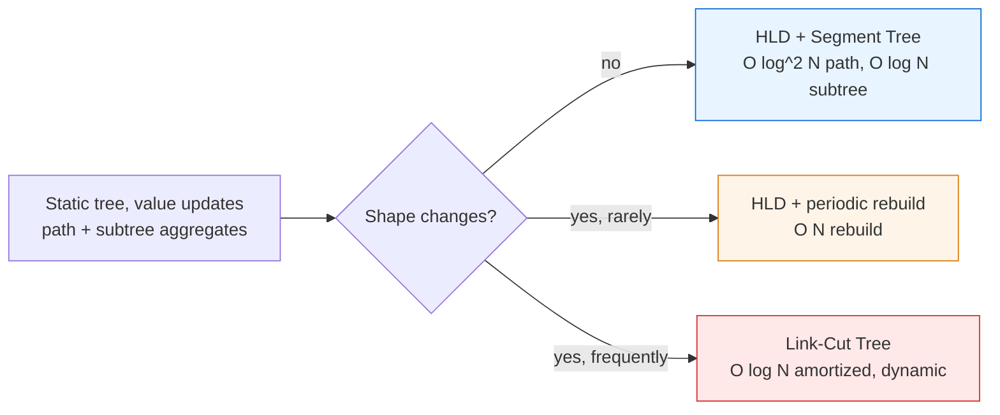
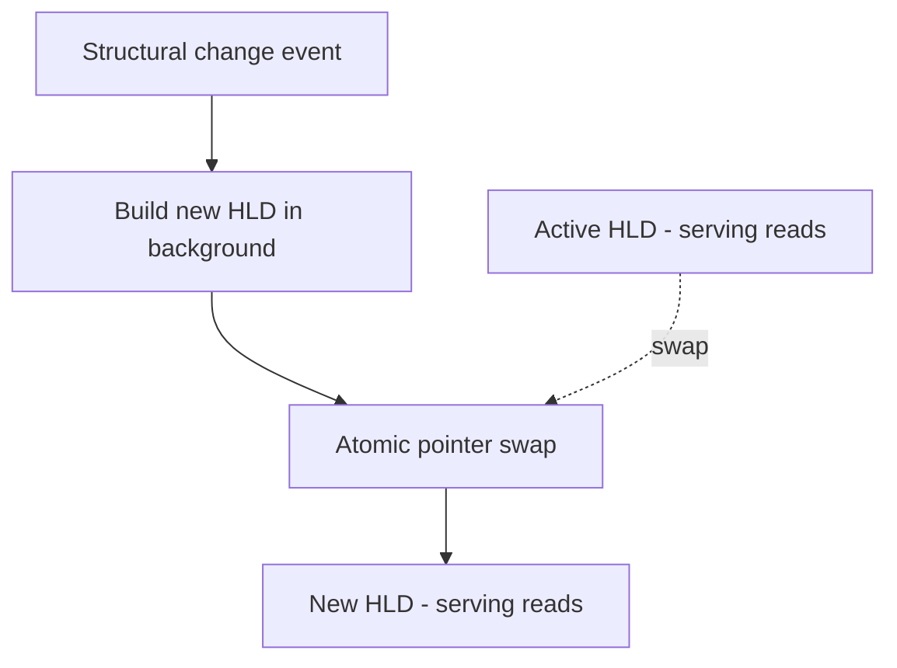

# Heavy-Light Decomposition — Senior Level

> HLD is rarely the bottleneck on a single node — but the moment you make it the backbone of a tree-analytics service, every weakness (static shape, recursion depth, the `log²` factor, single-process memory) becomes a production decision. This document treats HLD as a system component, not a contest trick.

## Table of Contents
1. [Introduction](#1-introduction)
2. [System Design with HLD](#2-system-design-with-hld)
3. [Distributed and Large-Tree Considerations](#3-distributed-and-large-tree-considerations)
4. [Concurrency: Immutable Structure, Read Concurrency](#4-concurrency-immutable-structure-read-concurrency)
5. [Comparison at Scale](#5-comparison-at-scale)
6. [Architecture Patterns](#6-architecture-patterns)
7. [Code Examples](#7-code-examples)
8. [Observability](#8-observability)
9. [Failure Modes](#9-failure-modes)
10. [Capacity Planning](#10-capacity-planning)
11. [Summary](#11-summary)

---

## 1. Introduction

At senior level the question is no longer "how does the chain loop work" but "where does HLD belong in my system, and what breaks when it does?" HLD is an **in-memory, static-shape, mutable-values** structure layered on top of a Segment Tree (or Fenwick). That description already tells you the architectural constraints:

- The **tree shape must be fixed** at build time. Any structural change (link/cut an edge, re-parent a subtree) invalidates `size`, `heavy`, `head`, and `pos` — you must rebuild, or move to a Link-Cut Tree.
- **Values are mutable** in `O(log N)` (point) or `O(log² N)` (path/subtree) — this is the workload HLD is built for.
- It lives in **one process's heap**; it is bounded by RAM and lost on restart unless you persist the inputs and rebuild.

The interesting senior decisions are therefore:

1. Is the tree truly static, or will it change? (HLD vs LCT.)
2. How do you survive a rebuild-triggering structural change without a latency cliff?
3. How do you serve many concurrent readers safely?
4. How do you instrument the `log²` path-query cost so you catch a pathological tree before it pages you?
5. How big can the tree get before a single node is the wrong home for it?

---

## 2. System Design with HLD

### 2.1 Where HLD fits



HLD is the right backbone when the **relationships are fixed but the data on them moves**: an org chart where reporting lines rarely change but headcount/cost per node updates hourly; a dependency tree where the graph is fixed at deploy and weights (build time, risk score) update continuously; a routing tree where topology is stable and link metrics float.

### 2.2 The component boundary

Treat HLD as two layers with a clean seam:

1. **Topology layer** — `parent, depth, size, heavy, head, pos`. Computed once, **immutable** thereafter. This is the part that encodes "the tree."
2. **Value layer** — the Segment Tree / Fenwick over `pos[]`. **Mutable**, hot, the only thing that changes at query time.

This separation is the key senior insight: the expensive-to-build, never-changing topology can be shared read-only across threads/requests, while only the value layer needs write coordination.

### 2.3 What HLD actually buys you

`O(log² N)` path queries. For `N = 10⁶`, that is `~400` segment-tree node visits per path query — tens of microseconds. The bottleneck at scale is never the asymptotics; it is **cache misses on the `pos`-ordered array**, **lock contention on the value layer**, and **GC pressure** from per-query allocations. Senior tuning targets those, not the algorithm.

---

## 3. Distributed and Large-Tree Considerations

### 3.1 HLD does not shard cleanly

A path query can span `O(log N)` chains that live anywhere in the tree. Unlike a hash map, you cannot partition the tree across machines and answer an arbitrary path query locally — the path may cross the partition boundary `O(log N)` times. Practical options:

- **Replicate, don't shard.** The topology layer is read-only; replicate the whole structure to every query node. Each replica answers any query locally. Writes go to a primary and propagate.
- **Shard by independent trees.** If your data is a *forest* of many independent trees (per-tenant org charts), shard by tree id. Each tree is small enough for one node.
- **Tier by hotness.** Keep the hot subtree (recent/active nodes) in memory with HLD; spill cold subtrees to a columnar store queried in bulk, not per-path.

### 3.2 Build cost at scale

The two DFS passes are `O(N)` but touch memory in tree order (poor locality on the first pass). For `N = 10⁸`, the build is seconds and the structure is gigabytes (six `int` arrays = `6·4·10⁸ = 2.4 GB` plus the Segment Tree). At that size you are firmly in "one big machine" territory; beyond it, reconsider whether you truly need arbitrary path queries or whether subtree-only (Euler tour, cheaper) suffices.

### 3.3 Persistence and rebuild

HLD is not durable. The durable artifact is the **edge list + values**; HLD is a derived index. On restart you reload edges, run the two DFS passes, and replay value updates from a log. Treat the build like rebuilding a database index: idempotent, restartable, and fast relative to your RTO.

---

## 4. Concurrency: Immutable Structure, Read Concurrency

### 4.1 The topology layer is naturally lock-free for readers

`parent, depth, size, heavy, head, pos` never change after build. Any number of threads can read them with **zero synchronization**. This is HLD's biggest concurrency advantage: the part that defines the chain loop (and the LCA) is immutable.

### 4.2 The value layer needs coordination

Only the Segment Tree mutates. Choices, from simplest to most scalable:

- **Single RW lock.** Readers share; writers exclude. Fine when reads dominate (the common analytics case).
- **Copy-on-write snapshots.** Keep an immutable Segment Tree; a writer builds a new version (persistent segment tree shares unchanged nodes in `O(log N)`). Readers pin a snapshot — zero read locks, point-in-time consistency. This pairs beautifully with HLD because the topology is already immutable.
- **Lock striping by chain.** Because each chain is a contiguous `pos` range, you *can* stripe locks per chain. But a path update touches `O(log N)` chains, so you must acquire them in a canonical order (e.g. by `pos`) to avoid deadlock. Usually not worth it versus copy-on-write.

### 4.3 Read-mostly is the sweet spot

The canonical HLD workload — "huge tree, occasional value update, millions of path/subtree reads" — maps perfectly onto an immutable topology + persistent value layer. Reads never block; writes are versioned.

---

## 5. Comparison at Scale

| Dimension | HLD + Segment Tree | Link-Cut Tree | Centroid Decomposition | Euler tour + Segment Tree |
|-----------|--------------------|---------------|------------------------|---------------------------|
| Path query | O(log² N) | **O(log N) amortized** | n/a (different class) | n/a |
| Subtree query | **O(log N)** | O(log N) amortized | n/a | **O(log N)** |
| Dynamic shape | ✗ rebuild O(N) | **✓ link/cut O(log N)** | ✗ | ✗ |
| Read concurrency | **excellent (immutable topology)** | poor (splay rotations mutate) | good (immutable) | excellent |
| Constant factor | moderate | high | moderate | low |
| Code complexity | medium | high | medium | low |
| Best workload | static tree, path + subtree, read-heavy | dynamic forest, path ops | pair-counting / distance ≤ K | subtree-only |

**Read-heavy static analytics → HLD.** The immutable topology + persistent value layer gives lock-free reads that LCT cannot match (splay rotations mutate the structure on *every* access, defeating read concurrency).

**Frequent structural change → LCT**, despite the worse concurrency, because rebuilding HLD on every change is `O(N)` and dominates.

**Pair/distance aggregation → centroid (sibling `15`)**, a different query class entirely.

**Subtree-only → Euler tour**, simpler and lower constant.

---

## 6. Architecture Patterns

### 6.1 Topology-as-immutable-index

Build the topology once, wrap it in an immutable value object, and share a single reference across all request handlers. Updates create a new value-layer version; the topology object is never copied.

### 6.2 Rebuild-on-change with double-buffering

When a rare structural change occurs, build the new HLD **in the background** into a second buffer, then atomically swap the active pointer. In-flight reads finish on the old buffer; new reads see the new one. No read ever blocks on a rebuild.



### 6.3 CQRS split

Separate the **write model** (edge list + value log, durable) from the **read model** (HLD index, derived, rebuildable). Writes append to the log; a projector rebuilds or incrementally updates the read model. The HLD index becomes a cache you can throw away and regenerate.

---

## 7. Code Examples

### 7.1 Iterative-friendly build (no recursion, snapshot-ready)

Recursion depth is the single most common HLD production failure on deep trees. This build is fully iterative and separates the immutable topology from the mutable value layer so the topology can be shared read-only.

#### Go

```go
package main

import "fmt"

// Topology is immutable after Build; safe to share across goroutines.
type Topology struct {
	N      int
	Parent []int
	Depth  []int
	Heavy  []int
	Head   []int
	Pos    []int
	Size   []int
}

func BuildTopology(n, root int, adj [][]int) *Topology {
	t := &Topology{
		N: n, Parent: make([]int, n), Depth: make([]int, n),
		Heavy: make([]int, n), Head: make([]int, n),
		Pos: make([]int, n), Size: make([]int, n),
	}
	for i := range t.Heavy {
		t.Heavy[i] = -1
	}
	// Pass 1: iterative DFS order, then sizes + heavy child bottom-up.
	order := make([]int, 0, n)
	st := []int{root}
	vis := make([]bool, n)
	vis[root] = true
	t.Parent[root] = -1
	for len(st) > 0 {
		u := st[len(st)-1]
		st = st[:len(st)-1]
		order = append(order, u)
		for _, w := range adj[u] {
			if !vis[w] {
				vis[w] = true
				t.Parent[w] = u
				t.Depth[w] = t.Depth[u] + 1
				st = append(st, w)
			}
		}
	}
	for i := len(order) - 1; i >= 0; i-- {
		u := order[i]
		t.Size[u] = 1
		best := 0
		for _, w := range adj[u] {
			if w != t.Parent[u] {
				t.Size[u] += t.Size[w]
				if t.Size[w] > best {
					best = t.Size[w]
					t.Heavy[u] = w
				}
			}
		}
	}
	// Pass 2: heads + positions, heavy child first, iterative.
	cur := 0
	type fr struct{ node, head int }
	st2 := []fr{{root, root}}
	for len(st2) > 0 {
		f := st2[len(st2)-1]
		st2 = st2[:len(st2)-1]
		u := f.node
		t.Head[u] = f.head
		t.Pos[u] = cur
		cur++
		for _, w := range adj[u] {
			if w != t.Parent[u] && w != t.Heavy[u] {
				st2 = append(st2, fr{w, w})
			}
		}
		if t.Heavy[u] != -1 {
			st2 = append(st2, fr{t.Heavy[u], f.head})
		}
	}
	return t
}

// LCA uses only the immutable topology — fully lock-free.
func (t *Topology) LCA(u, v int) int {
	for t.Head[u] != t.Head[v] {
		if t.Depth[t.Head[u]] < t.Depth[t.Head[v]] {
			u, v = v, u
		}
		u = t.Parent[t.Head[u]]
	}
	if t.Depth[u] < t.Depth[v] {
		return u
	}
	return v
}

func main() {
	n := 8
	adj := make([][]int, n)
	add := func(a, b int) { adj[a] = append(adj[a], b); adj[b] = append(adj[b], a) }
	for _, e := range [][2]int{{0, 1}, {0, 2}, {0, 3}, {1, 4}, {1, 5}, {3, 6}, {4, 7}} {
		add(e[0], e[1])
	}
	t := BuildTopology(n, 0, adj)
	fmt.Println("LCA(7,6) =", t.LCA(7, 6)) // 0
}
```

#### Java

```java
import java.util.*;

// Immutable after construction; share read-only across threads.
public final class Topology {
    final int n;
    final int[] parent, depth, heavy, head, pos, size;

    Topology(int n, int root, List<Integer>[] adj) {
        this.n = n;
        parent = new int[n]; depth = new int[n]; heavy = new int[n];
        head = new int[n]; pos = new int[n]; size = new int[n];
        Arrays.fill(heavy, -1);
        int[] order = new int[n]; int cnt = 0;
        boolean[] vis = new boolean[n];
        Deque<Integer> st = new ArrayDeque<>(); st.push(root); vis[root] = true;
        parent[root] = -1;
        while (!st.isEmpty()) {
            int u = st.pop(); order[cnt++] = u;
            for (int w : adj[u]) if (!vis[w]) {
                vis[w] = true; parent[w] = u; depth[w] = depth[u] + 1; st.push(w);
            }
        }
        for (int i = cnt - 1; i >= 0; i--) {
            int u = order[i]; size[u] = 1; int best = 0;
            for (int w : adj[u]) if (w != parent[u]) {
                size[u] += size[w];
                if (size[w] > best) { best = size[w]; heavy[u] = w; }
            }
        }
        int cur = 0;
        Deque<int[]> s2 = new ArrayDeque<>(); s2.push(new int[]{root, root});
        while (!s2.isEmpty()) {
            int[] f = s2.pop(); int u = f[0], hd = f[1];
            head[u] = hd; pos[u] = cur++;
            for (int w : adj[u]) if (w != parent[u] && w != heavy[u]) s2.push(new int[]{w, w});
            if (heavy[u] != -1) s2.push(new int[]{heavy[u], hd});
        }
    }

    int lca(int u, int v) {
        while (head[u] != head[v]) {
            if (depth[head[u]] < depth[head[v]]) { int t = u; u = v; v = t; }
            u = parent[head[u]];
        }
        return depth[u] < depth[v] ? u : v;
    }

    @SuppressWarnings("unchecked")
    public static void main(String[] args) {
        int n = 8;
        List<Integer>[] adj = new List[n];
        for (int i = 0; i < n; i++) adj[i] = new ArrayList<>();
        int[][] e = {{0,1},{0,2},{0,3},{1,4},{1,5},{3,6},{4,7}};
        for (int[] x : e) { adj[x[0]].add(x[1]); adj[x[1]].add(x[0]); }
        Topology t = new Topology(n, 0, adj);
        System.out.println("LCA(7,6) = " + t.lca(7, 6));
    }
}
```

#### Python

```python
class Topology:
    """Immutable after construction; safe to share across reader threads."""

    def __init__(self, n, root, adj):
        self.n = n
        self.parent = [-1] * n
        self.depth = [0] * n
        self.heavy = [-1] * n
        self.head = [0] * n
        self.pos = [0] * n
        self.size = [0] * n

        order, st, vis = [], [root], [False] * n
        vis[root] = True
        while st:
            u = st.pop()
            order.append(u)
            for w in adj[u]:
                if not vis[w]:
                    vis[w] = True
                    self.parent[w] = u
                    self.depth[w] = self.depth[u] + 1
                    st.append(w)
        for u in reversed(order):
            self.size[u] = 1
            best = 0
            for w in adj[u]:
                if w != self.parent[u]:
                    self.size[u] += self.size[w]
                    if self.size[w] > best:
                        best = self.size[w]
                        self.heavy[u] = w
        cur = 0
        st2 = [(root, root)]
        while st2:
            u, hd = st2.pop()
            self.head[u] = hd
            self.pos[u] = cur
            cur += 1
            for w in adj[u]:
                if w != self.parent[u] and w != self.heavy[u]:
                    st2.append((w, w))
            if self.heavy[u] != -1:
                st2.append((self.heavy[u], hd))

    def lca(self, u, v):
        while self.head[u] != self.head[v]:
            if self.depth[self.head[u]] < self.depth[self.head[v]]:
                u, v = v, u
            u = self.parent[self.head[u]]
        return u if self.depth[u] < self.depth[v] else v


if __name__ == "__main__":
    n = 8
    adj = [[] for _ in range(n)]
    for a, b in [(0,1),(0,2),(0,3),(1,4),(1,5),(3,6),(4,7)]:
        adj[a].append(b)
        adj[b].append(a)
    t = Topology(n, 0, adj)
    print("LCA(7,6) =", t.lca(7, 6))
```

---

### 7.2 The mutable value layer + an instrumented path query

The topology above never changes; the value layer is the only mutable part and the only place a path query spends `O(log² N)`. Below the value layer is a Fenwick over `pos[]` (lowest constant for sums), and the path query is *instrumented* to emit the `chain_segments_per_query` signal §8 relies on. The same loop is the recurrence proved `O(log² N)` in `professional.md`.

#### Go

```go
package main

import "fmt"

// ValueLayer is the only mutable component; guard it with an RW lock or
// swap it copy-on-write per the concurrency notes in §4.
type ValueLayer struct {
	bit  []int64 // Fenwick over pos[], 1-indexed
	n    int
	segs int64 // observability: total chain segments touched (atomic in prod)
	qs   int64 // observability: total path queries
}

func NewValueLayer(base []int64) *ValueLayer { // base indexed by pos
	n := len(base)
	v := &ValueLayer{bit: make([]int64, n+1), n: n}
	for i, x := range base {
		v.add(i, x)
	}
	return v
}
func (v *ValueLayer) add(i int, d int64) {
	for i++; i <= v.n; i += i & (-i) {
		v.bit[i] += d
	}
}
func (v *ValueLayer) sum(i int) int64 {
	var s int64
	for i++; i > 0; i -= i & (-i) {
		s += v.bit[i]
	}
	return s
}
func (v *ValueLayer) rng(l, r int) int64 { return v.sum(r) - v.sum(l-1) }

// PathSum reads only the immutable topology + the mutable value layer.
func (t *Topology) PathSum(v *ValueLayer, u, w int) (int64, int) {
	var res int64
	segments := 0
	for t.Head[u] != t.Head[w] {
		if t.Depth[t.Head[u]] < t.Depth[t.Head[w]] {
			u, w = w, u
		}
		res += v.rng(t.Pos[t.Head[u]], t.Pos[u])
		segments++
		u = t.Parent[t.Head[u]]
	}
	if t.Depth[u] > t.Depth[w] {
		u, w = w, u
	}
	res += v.rng(t.Pos[u], t.Pos[w]) // include LCA (vertex values)
	segments++
	v.segs += int64(segments)
	v.qs++
	return res, segments // emit `segments` to the histogram
}

func main() {
	n := 8
	adj := make([][]int, n)
	add := func(a, b int) { adj[a] = append(adj[a], b); adj[b] = append(adj[b], a) }
	for _, e := range [][2]int{{0, 1}, {0, 2}, {0, 3}, {1, 4}, {1, 5}, {3, 6}, {4, 7}} {
		add(e[0], e[1])
	}
	t := BuildTopology(n, 0, adj)
	base := make([]int64, n)
	vals := []int64{5, 3, 8, 1, 2, 4, 6, 9}
	for node := 0; node < n; node++ {
		base[t.Pos[node]] = vals[node]
	}
	vl := NewValueLayer(base)
	sum, segs := t.PathSum(vl, 7, 6)
	fmt.Printf("PathSum(7,6)=%d touched %d chain segments\n", sum, segs)
}
```

#### Java

```java
// Mutable value layer; the immutable Topology of §7.1 supplies pos/head/parent/depth.
final class ValueLayer {
    final long[] bit; final int n;
    long segs, qs; // observability counters (use LongAdder in prod)
    ValueLayer(long[] base) {
        n = base.length; bit = new long[n + 1];
        for (int i = 0; i < n; i++) add(i, base[i]);
    }
    void add(int i, long d) { for (i++; i <= n; i += i & (-i)) bit[i] += d; }
    long sum(int i) { long s = 0; for (i++; i > 0; i -= i & (-i)) s += bit[i]; return s; }
    long rng(int l, int r) { return sum(r) - sum(l - 1); }
}

// In Topology:
//   long[] result = pathSum(vl, u, w);  // {sum, chainSegments}
long[] pathSum(ValueLayer vl, int u, int w) {
    long res = 0; int segments = 0;
    while (head[u] != head[w]) {
        if (depth[head[u]] < depth[head[w]]) { int t = u; u = w; w = t; }
        res += vl.rng(pos[head[u]], pos[u]); segments++;
        u = parent[head[u]];
    }
    if (depth[u] > depth[w]) { int t = u; u = w; w = t; }
    res += vl.rng(pos[u], pos[w]); segments++; // include LCA
    vl.segs += segments; vl.qs++;
    return new long[]{res, segments};
}
```

#### Python

```python
class ValueLayer:
    """Only mutable component; topology stays immutable and lock-free."""
    def __init__(self, base):                # base indexed by pos
        self.n = len(base)
        self.bit = [0] * (self.n + 1)
        self.segs = 0                         # observability: chain segments
        self.qs = 0                           # observability: path queries
        for i, x in enumerate(base):
            self.add(i, x)

    def add(self, i, d):
        i += 1
        while i <= self.n:
            self.bit[i] += d; i += i & (-i)

    def _sum(self, i):
        i += 1; s = 0
        while i > 0:
            s += self.bit[i]; i -= i & (-i)
        return s

    def rng(self, l, r):
        return self._sum(r) - self._sum(l - 1)


def path_sum(topo, vl, u, w):                 # returns (sum, chain_segments)
    res = 0; segments = 0
    while topo.head[u] != topo.head[w]:
        if topo.depth[topo.head[u]] < topo.depth[topo.head[w]]:
            u, w = w, u
        res += vl.rng(topo.pos[topo.head[u]], topo.pos[u]); segments += 1
        u = topo.parent[topo.head[u]]
    if topo.depth[u] > topo.depth[w]:
        u, w = w, u
    res += vl.rng(topo.pos[u], topo.pos[w]); segments += 1   # include LCA
    vl.segs += segments; vl.qs += 1
    return res, segments
```

The returned `segments` is the per-query value you push into the `chain_segments_per_query` histogram. On a healthy tree it stays a small single-digit number even for `N` in the millions; a sustained climb toward `2·log₂ N` is the early warning that someone fed you a caterpillar-shaped tree.

### 7.3 Workload comparison — choosing HLD vs LCT vs centroid

The senior decision is rarely "is HLD correct" (it is) but "is HLD the *cheapest correct* option for this workload." Map your workload onto the dominant axis:

| Workload signature | Dominant cost driver | Choose | Why |
|--------------------|----------------------|--------|-----|
| Fixed tree, billions of path/subtree reads, rare value writes | per-read latency + read concurrency | **HLD + Fenwick/SegTree** | immutable topology → lock-free reads; `O(log² N)` worst-case latency you can SLO |
| Tree shape changes many times/sec (link/cut) | rebuild cost would dominate | **Link-Cut Tree** | `O(log N)` amortized per link/cut/query; rebuilding HLD is `O(N)` each change |
| "How many pairs `(u,v)` with `dist ≤ K`" / aggregate over all paths | total work over all pairs | **Centroid decomposition (sibling `15`)** | decomposes into `O(log N)` centroid levels; not a single-path query class |
| Subtree-only aggregates, never path | interval simplicity | **Euler tour + Segment Tree** | one contiguous interval per subtree; lower constant than full HLD |
| Static path-min/max, **no updates** | preprocessing once | **binary lifting / sparse table (sibling `13`)** | `O(log N)` path-min directly, no `log²`, no value layer |

Two heuristics resolve most real cases. First, **count structural mutations per second**: zero or rare → HLD (rebuild on the rare change via the double-buffer of §6.2); frequent → LCT. Second, **count the query class**: one given path → HLD/LCT; all pairs within a distance → centroid; subtree only → Euler. The `log²` of HLD is almost never the deciding factor — read concurrency and worst-case latency are.

---

## 8. Observability

What to emit so you catch trouble before it pages you:

- **`chain_segments_per_query` histogram.** Path queries should touch a small number of chains. A spike means a pathological tree (caterpillar-shaped) — a topology problem, not a value problem.
- **`segment_tree_ops_per_query`.** Multiply by `log N` to verify you're seeing `O(log² N)`, not an accidental `O(N)` fallback.
- **`build_duration` and `build_count`.** Frequent rebuilds reveal a tree that is *not* actually static — a sign you should be on an LCT.
- **`value_layer_lock_wait`.** Read latency creeping up under write load means the value-layer coordination (RW lock vs copy-on-write) is the bottleneck.
- **`recursion_depth` / max chain length at build.** Track it; if it approaches your stack limit you are one deep tree away from a crash (only relevant if you kept a recursive build).

---

## 9. Failure Modes

| Failure | Symptom | Mitigation |
|---------|---------|-----------|
| **Recursion depth overflow** | Stack overflow / `RecursionError` on a deep (near-linear) tree. | Use the iterative build in §7; never ship recursive DFS for `N > 10⁴`. |
| **Edge-vs-vertex off-by-one** | Path aggregates wrong by exactly one edge/node near the LCA. | Encode semantics in one place; `pos[lca] + 1` for edges, guard `u == v`. |
| **Stale topology after shape change** | Wrong answers after an edge was added/removed but HLD not rebuilt. | Treat any shape change as cache invalidation; rebuild via double-buffer, or move to LCT. |
| **Pathological tree → slow queries** | p99 path-query latency 10–100× the median. | Alert on `chain_segments_per_query`; the bound is worst-case `2 log N`, real trees touch fewer. |
| **Value layer race** | Sporadically wrong sums under concurrent writes. | Single RW lock or copy-on-write snapshots; never mutate the Segment Tree without coordination. |
| **Memory blow-up** | OOM on very large `N`. | Six `int` arrays + Segment Tree ≈ `~10·4·N` bytes; budget it, or spill cold subtrees. |

---

## 10. Capacity Planning

Rules of thumb for one node:

- **Memory:** topology ≈ `6 × 4 × N` bytes (six int arrays). Segment Tree (sum, `int64`) ≈ `2 × 8 × N` to `4 × 8 × N` bytes. For `N = 10⁷`: ~240 MB topology + ~320 MB tree ≈ 0.6 GB. For `N = 10⁸`: ~6 GB — single large machine.
- **Throughput:** a path query is `~2 log₂ N` segment-tree descents. At `N = 10⁶` that's ~400 node visits, ~tens of microseconds → low millions of path queries/sec/core, before lock and GC overhead. Subtree queries (one interval) are `~log N` → faster.
- **Build budget:** `O(N)` but cache-unfriendly on pass 1; budget a few hundred ns/node. `N = 10⁷` builds in ~tens of milliseconds to low seconds depending on memory layout. This is your rebuild cost on any structural change — keep it well under your RTO.
- **When to leave one node:** beyond `~10⁸` nodes, or when structural changes are frequent enough that rebuild dominates, switch to either a forest-sharded deployment (independent trees per node) or a Link-Cut Tree.

---

## 11. Summary

At scale, HLD is best understood as **an immutable topology index plus a mutable value layer**. The topology — the part that makes path queries `O(log² N)` and gives you a free `O(log N)` LCA — never changes after build, so it shares read-only across threads and replicates trivially. The value layer is the only thing that needs write coordination, and copy-on-write snapshots make even that lock-free for readers. The two senior-level traps are **recursion depth** (use an iterative build) and **assuming the tree is static when it isn't** (rebuild via double-buffer, or graduate to a Link-Cut Tree). HLD shards poorly across machines because a path spans `O(log N)` chains anywhere in the tree — so replicate the topology, shard by independent tree, or tier by hotness rather than partitioning a single tree.
