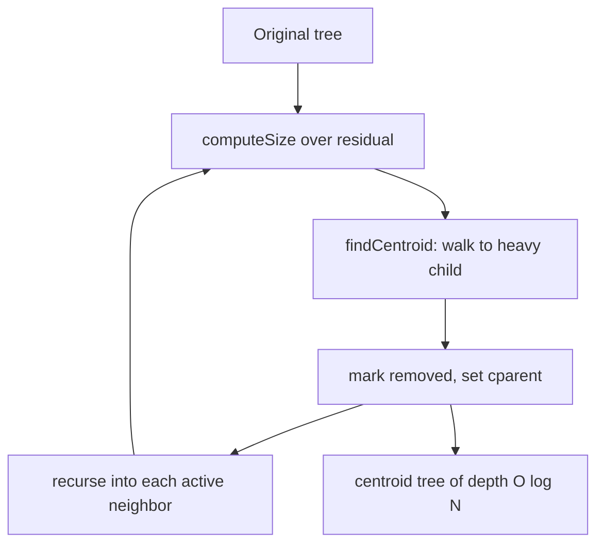

# Centroid Decomposition — Junior Level

> **One-line summary:** A *centroid* of a tree is a vertex whose removal splits the tree into pieces that each have at most `N/2` vertices. **Centroid decomposition** recursively finds the centroid, removes it, and recurses into each leftover piece — producing a *centroid tree* of depth `O(log N)` that turns hard path problems on trees into a balanced divide-and-conquer.

---

## Table of Contents

1. [Introduction](#introduction)
2. [Prerequisites](#prerequisites)
3. [Glossary](#glossary)
4. [Core Concepts](#core-concepts)
5. [Big-O Summary](#big-o-summary)
6. [Real-World Analogies](#real-world-analogies)
7. [Pros & Cons](#pros--cons)
8. [Step-by-Step Walkthrough](#step-by-step-walkthrough)
9. [Code Examples](#code-examples)
10. [Coding Patterns](#coding-patterns)
11. [Error Handling](#error-handling)
12. [Performance Tips](#performance-tips)
13. [Best Practices](#best-practices)
14. [Edge Cases & Pitfalls](#edge-cases--pitfalls)
15. [Common Mistakes](#common-mistakes)
16. [Cheat Sheet](#cheat-sheet)
17. [Visual Animation](#visual-animation)
18. [Summary](#summary)
19. [Further Reading](#further-reading)

---

## Introduction

Imagine you are handed a tree with a million vertices and asked: *"How many pairs of nodes are at distance exactly K from each other?"* There are up to `N²/2 ≈ 5×10¹¹` pairs — far too many to enumerate one by one. You need a way to **break the tree into balanced pieces** so that every path is accounted for exactly once, cheaply.

**Centroid decomposition** is that tool. It is the tree analogue of *divide and conquer on a sorted array*: just as binary search halves a range each step, centroid decomposition halves a **tree** each step. The magic is a special vertex called the **centroid** — a vertex you can delete so that no remaining piece is bigger than half the tree. Because each cut at least halves the size, after `O(log N)` cuts everything is gone.

The structure you build during this process is the **centroid tree**: a brand-new tree whose root is the first centroid, whose children are the centroids of the resulting pieces, and so on. It has only `O(log N)` depth even if the original tree was a long, skinny path of a million nodes. That shallow depth is what makes otherwise-impossible problems solvable.

The single most important fact — the one every application leans on — is this:

> **Any path between two vertices `u` and `v` in the original tree passes through exactly one vertex that is their lowest common ancestor in the centroid tree.**

In other words, every path has a unique "highest centroid" sitting on it, and that centroid is the right place to *count* or *answer* that path. We will return to this idea again and again.

Centroid decomposition is closely related to two siblings you may study near it: **13-lca** (lowest common ancestor — we use LCA-style reasoning on the centroid tree) and **14-heavy-light-decomposition** (HLD — another way to break a tree apart, but for a *different* class of problems, which we compare below).

---

## Prerequisites

Before you read this file you should be comfortable with:

- **Trees** — a connected acyclic graph with `N` vertices and `N-1` edges. No cycles, exactly one path between any two vertices.
- **Adjacency lists** — storing a tree as `adj[u] = [neighbors of u]`.
- **DFS (depth-first search)** — both recursive and iterative forms.
- **Subtree sizes** — computing `size[u]` = number of vertices in the subtree rooted at `u` via a post-order DFS.
- **Recursion** — the whole decomposition is recursive.
- **Big-O notation** — `O(N)`, `O(N log N)`, `O(log N)`.

Optional but helpful:

- A first look at **divide and conquer** (merge sort, binary search) — centroid decomposition is the same idea on trees.
- Familiarity with **distance in a tree** (number of edges on the unique path between two vertices).

---

## Glossary

| Term | Meaning |
|------|---------|
| **Tree** | Connected, acyclic, undirected graph: `N` vertices, `N-1` edges. |
| **Subtree size** | `size[u]` — number of vertices in the subtree rooted at `u` (with respect to some root or parent). |
| **Centroid** | A vertex whose removal leaves every remaining component with `≤ N/2` vertices. Every tree has 1 or 2 centroids. |
| **Component** | A connected piece left behind after a vertex is removed. |
| **Centroid decomposition** | The recursive process: find centroid, remove it, recurse on each component. |
| **Centroid tree** | The new tree formed by linking each centroid to the centroid of the piece it was found in (its parent). |
| **Centroid level / depth** | How deep a vertex's centroid is in the centroid tree. Root = level 0. |
| **`removed[]`** | A boolean marker array: once a vertex becomes a centroid it is "removed" so deeper recursions ignore it. |
| **Path-through-centroid** | The principle that every original path is "owned" by exactly one centroid (its centroid-tree LCA). |
| **Inclusion–exclusion** | The counting trick used to avoid double-counting pairs that lie in the same child piece. |

---

## Core Concepts

### 1. What is a centroid?

Root the tree anywhere and compute subtree sizes. A vertex `c` is a **centroid** if, when you delete `c`, **every** remaining component has size `≤ N/2`. Equivalently:

- every child subtree of `c` has size `≤ N/2`, **and**
- the "rest of the tree above `c`" (which has size `N - size[c]`) also has size `≤ N/2`.

```
            (whole tree size N)
                   │
       ┌───────────c───────────┐      remove c →
       │           │           │
   piece A      piece B      "above" piece
   ≤ N/2         ≤ N/2          ≤ N/2
```

**Key fact:** every tree has **at least one** centroid, and **at most two**. If there are two, they are adjacent (connected by an edge). This is proven carefully in [`professional.md`](./professional.md); for now, trust it.

### 2. Finding the centroid

A simple two-pass method:

1. DFS from any start vertex (ignoring already-removed vertices) to compute `size[]` and the total `n` of the *current* component.
2. Walk down from the start: at each vertex, move toward the child whose subtree size is `> n/2`. When no child subtree exceeds `n/2`, you are standing on the centroid.

This works because the centroid is exactly where "the biggest piece you could fall into" stops being more than half.

### 3. The decomposition (building the centroid tree)

```
decompose(entry):
    n = compute sizes of the current component starting from entry
    c = find_centroid(entry, n)
    removed[c] = true                  # c leaves the active tree forever
    for each neighbor v of c that is NOT removed:
        child_centroid = decompose(v)  # recurse into the piece containing v
        centroidTree[c].add(child_centroid)
    return c
```

Each call removes one centroid and recurses into pieces that are each `≤ N/2`. The recursion tree **is** the centroid tree, and its depth is `O(log N)`.

### 4. The N/2 property and O(log N) depth

Because every component you recurse into is at most half the size of its parent component, the chain of nested components shrinks like `N, N/2, N/4, …, 1`. That is `O(log N)` levels. So:

- Every original vertex appears in **`O(log N)`** centroid components (one per level it survives).
- The centroid tree has **height `O(log N)`**.

This is the whole reason the technique is fast.

### 5. Counting paths through a centroid

When we *use* centroid decomposition (covered more in [`middle.md`](./middle.md)), the pattern is always:

> For each centroid `c`, count all valid paths whose **highest point is `c`** — i.e. paths that pass *through* `c`. Then recurse.

Because every path has exactly one such "highest centroid," summing over all centroids counts every path **exactly once** — no path is missed, none is counted twice.

---

## Big-O Summary

| Operation | Time | Space | Notes |
|-----------|------|-------|-------|
| Find a single centroid of a component of size `n` | **O(n)** | O(n) | Two DFS passes. |
| Build the full centroid tree | **O(N log N)** | O(N) | `O(N)` work per level × `O(log N)` levels. |
| Centroid-tree depth | **O(log N)** | — | Each cut halves the component. |
| Per-vertex level membership | **O(log N)** levels | — | Each vertex belongs to `O(log N)` components. |
| Count paths satisfying a property (e.g. distance = K) | **O(N log N)** | O(N) | The classic application. |
| Point-to-root walk in centroid tree (per query) | **O(log N)** | O(1) | Used in nearest-marked-node queries. |

---

## Real-World Analogies

| Concept | Analogy |
|---------|---------|
| Centroid | The **balance point** of a mobile sculpture: the single hook from which every hanging piece weighs no more than half the total. |
| Removing the centroid | **Cutting the road network at its busiest interchange** so the country splits into regions, none bigger than half — making each region independently manageable. |
| Centroid tree depth `O(log N)` | A **corporate org chart that is always shallow**: no matter how the company grew, re-org by "balance point" keeps the reporting depth logarithmic. |
| Path owned by its highest centroid | Every cross-country trip passes through exactly one "national hub" you can charge a toll at — count every trip once, at its hub. |
| Inclusion–exclusion | When tallying trips through a hub, you must **subtract trips that never actually left a single region** but looked like they passed the hub. |

Where the analogy breaks: a physical balance point is about *weight*; a centroid is about *vertex count*. And unlike a road interchange, after removing a centroid we never reconnect — we recurse into each region permanently.

---

## Pros & Cons

| Pros | Cons |
|------|------|
| Turns `O(N²)`-pair path problems into `O(N log N)`. | Only works on **trees**, not general graphs. |
| Centroid tree has guaranteed `O(log N)` depth — even for a path graph. | Build is conceptually trickier than HLD or plain DFS. |
| Each vertex lives in only `O(log N)` levels → bounded total work. | Easy to introduce subtle bugs: forgetting to recompute sizes, double-counting. |
| Great for "count paths with property" and "nearest marked node with updates." | Not ideal for **edge/path-aggregate updates** along a path — that is HLD's job (sibling 14). |
| Static structure: build once, answer many queries. | Recursion depth `O(log N)` is fine, but the *size-DFS* can recurse `O(N)` deep on a path graph → may need an explicit stack. |

**When to use:** counting pairs/paths by distance, "is there a path of length K," nearest marked/colored node with updates, any problem decomposable by "the highest centroid on the path."

**When NOT to use:** path-sum / path-max queries with updates along a path (use HLD + segment tree, sibling 14), subtree-aggregate queries (use Euler tour + BIT/segment tree), general (non-tree) graphs.

---

## Step-by-Step Walkthrough

Take this 7-vertex tree (vertices `0..6`):

```
        0
        │
        1
      ╱   ╲
     2     3
     │     │
     4     5
           │
           6
```

Edges: `0-1, 1-2, 1-3, 2-4, 3-5, 5-6`. `N = 7`, so a centroid must leave every piece `≤ 3`.

**Step 1 — root at 0, compute sizes.**

```
size[4]=1  size[2]=2  size[6]=1  size[5]=2  size[3]=3  size[1]=6  size[0]=7
```

**Step 2 — find the centroid.** Start at 0. Largest child subtree of 0 is `size[1]=6 > 7/2=3.5`, move to 1. At 1, the "above" part is `7-6=1`, child subtrees are `size[2]=2` and `size[3]=3`; the biggest is `3 ≤ 3.5`. No piece exceeds half → **centroid is 1**.

Removing 1 leaves three components: `{0}` (size 1), `{2,4}` (size 2), `{3,5,6}` (size 3). All `≤ 3`. 

**Step 3 — record 1 as the centroid-tree root, recurse into each piece.**

- Piece `{0}`: single vertex → centroid `0`, parent in centroid tree = `1`.
- Piece `{2,4}`: centroid is `2` (removing 2 leaves `{4}` of size 1). Parent = `1`. Then recurse into `{4}` → centroid `4`, parent `2`.
- Piece `{3,5,6}`: size 3, centroid is `5` (removing 5 leaves `{3}` and `{6}`, both size 1). Parent = `1`. Recurse → centroids `3` (parent `5`) and `6` (parent `5`).

**Resulting centroid tree:**

```
            1            (level 0)
         ╱  │  ╲
        0   2   5        (level 1)
            │  ╱ ╲
            4 3   6      (level 2)
```

Depth is 2 = `O(log 7)`. Notice vertex `1` belongs to **one** component, vertex `5` to two, vertex `6` to three — exactly `O(log N)` each. Every original path now has a clear "highest centroid": e.g. the path `4–6` has highest centroid `1` (it passes through 1), while the path `3–6` has highest centroid `5`.

---

## Code Examples

### Example: Find a centroid and build the centroid tree

The code below builds the centroid tree and stores, for each vertex, its **parent in the centroid tree**. It is the foundation every application reuses.

#### Go

```go
package main

import "fmt"

type CD struct {
	adj       [][]int
	removed   []bool
	size      []int
	cparent   []int // parent in the centroid tree, -1 for root
}

func NewCD(n int) *CD {
	c := &CD{
		adj:     make([][]int, n),
		removed: make([]bool, n),
		size:    make([]int, n),
		cparent: make([]int, n),
	}
	for i := range c.cparent {
		c.cparent[i] = -1
	}
	return c
}

func (c *CD) AddEdge(u, v int) {
	c.adj[u] = append(c.adj[u], v)
	c.adj[v] = append(c.adj[v], u)
}

// computeSize: subtree sizes within the current (residual) component.
func (c *CD) computeSize(u, parent int) int {
	c.size[u] = 1
	for _, v := range c.adj[u] {
		if v != parent && !c.removed[v] {
			c.size[u] += c.computeSize(v, u)
		}
	}
	return c.size[u]
}

// findCentroid: walk toward the heavy child until no piece exceeds n/2.
func (c *CD) findCentroid(u, parent, n int) int {
	for _, v := range c.adj[u] {
		if v != parent && !c.removed[v] && c.size[v] > n/2 {
			return c.findCentroid(v, u, n)
		}
	}
	return u
}

// decompose returns the centroid of the component containing 'entry'.
func (c *CD) decompose(entry, cpar int) int {
	n := c.computeSize(entry, -1)
	centroid := c.findCentroid(entry, -1, n)
	c.removed[centroid] = true
	c.cparent[centroid] = cpar
	for _, v := range c.adj[centroid] {
		if !c.removed[v] {
			c.decompose(v, centroid)
		}
	}
	return centroid
}

func main() {
	c := NewCD(7)
	edges := [][2]int{{0, 1}, {1, 2}, {1, 3}, {2, 4}, {3, 5}, {5, 6}}
	for _, e := range edges {
		c.AddEdge(e[0], e[1])
	}
	root := c.decompose(0, -1)
	fmt.Println("centroid-tree root:", root) // 1
	for i := 0; i < 7; i++ {
		fmt.Printf("vertex %d -> centroid-parent %d\n", i, c.cparent[i])
	}
}
```

#### Java

```java
import java.util.*;

public class CentroidDecomposition {
    int n;
    List<List<Integer>> adj;
    boolean[] removed;
    int[] size;
    int[] cparent; // parent in centroid tree, -1 for root

    CentroidDecomposition(int n) {
        this.n = n;
        adj = new ArrayList<>();
        for (int i = 0; i < n; i++) adj.add(new ArrayList<>());
        removed = new boolean[n];
        size = new int[n];
        cparent = new int[n];
        Arrays.fill(cparent, -1);
    }

    void addEdge(int u, int v) {
        adj.get(u).add(v);
        adj.get(v).add(u);
    }

    int computeSize(int u, int parent) {
        size[u] = 1;
        for (int v : adj.get(u))
            if (v != parent && !removed[v])
                size[u] += computeSize(v, u);
        return size[u];
    }

    int findCentroid(int u, int parent, int total) {
        for (int v : adj.get(u))
            if (v != parent && !removed[v] && size[v] > total / 2)
                return findCentroid(v, u, total);
        return u;
    }

    int decompose(int entry, int cpar) {
        int total = computeSize(entry, -1);
        int centroid = findCentroid(entry, -1, total);
        removed[centroid] = true;
        cparent[centroid] = cpar;
        for (int v : adj.get(centroid))
            if (!removed[v])
                decompose(v, centroid);
        return centroid;
    }

    public static void main(String[] args) {
        CentroidDecomposition c = new CentroidDecomposition(7);
        int[][] edges = {{0,1},{1,2},{1,3},{2,4},{3,5},{5,6}};
        for (int[] e : edges) c.addEdge(e[0], e[1]);
        int root = c.decompose(0, -1);
        System.out.println("centroid-tree root: " + root); // 1
        for (int i = 0; i < c.n; i++)
            System.out.println("vertex " + i + " -> centroid-parent " + c.cparent[i]);
    }
}
```

#### Python

```python
import sys
sys.setrecursionlimit(1 << 20)


class CentroidDecomposition:
    def __init__(self, n):
        self.n = n
        self.adj = [[] for _ in range(n)]
        self.removed = [False] * n
        self.size = [0] * n
        self.cparent = [-1] * n  # parent in the centroid tree

    def add_edge(self, u, v):
        self.adj[u].append(v)
        self.adj[v].append(u)

    def compute_size(self, u, parent):
        self.size[u] = 1
        for v in self.adj[u]:
            if v != parent and not self.removed[v]:
                self.size[u] += self.compute_size(v, u)
        return self.size[u]

    def find_centroid(self, u, parent, total):
        for v in self.adj[u]:
            if v != parent and not self.removed[v] and self.size[v] > total // 2:
                return self.find_centroid(v, u, total)
        return u

    def decompose(self, entry, cpar):
        total = self.compute_size(entry, -1)
        centroid = self.find_centroid(entry, -1, total)
        self.removed[centroid] = True
        self.cparent[centroid] = cpar
        for v in self.adj[centroid]:
            if not self.removed[v]:
                self.decompose(v, centroid)
        return centroid


if __name__ == "__main__":
    c = CentroidDecomposition(7)
    for u, v in [(0, 1), (1, 2), (1, 3), (2, 4), (3, 5), (5, 6)]:
        c.add_edge(u, v)
    root = c.decompose(0, -1)
    print("centroid-tree root:", root)  # 1
    for i in range(c.n):
        print(f"vertex {i} -> centroid-parent {c.cparent[i]}")
```

**What it does:** builds the centroid tree of the 7-vertex example and prints each vertex's parent in the centroid tree.
**Run:** `go run main.go` | `javac CentroidDecomposition.java && java CentroidDecomposition` | `python cd.py`

---

## Coding Patterns

### Pattern 1: Recompute sizes inside the residual tree

**Intent:** After removing centroids, you must measure sizes **only over vertices that are still active** (`!removed[v]`). Never reuse a `size[]` array from a previous level.

```python
def compute_size(self, u, parent):
    self.size[u] = 1
    for v in self.adj[u]:
        if v != parent and not self.removed[v]:   # the guard that matters
            self.size[u] += self.compute_size(v, u)
    return self.size[u]
```

### Pattern 2: Count-through-the-centroid with inclusion–exclusion

**Intent:** At each centroid `c`, count valid paths that pass through `c`. First count using *all* vertices in `c`'s component; then **subtract** the over-count from pairs that share the same child branch (those pairs don't actually pass through `c`).

```
count_through(c):
    total = count_pairs(distances from c over the WHOLE component)
    for each child branch b of c:
        total -= count_pairs(distances from c over branch b only)
    return total
```

This subtraction is the heart of avoiding double-counting; it is expanded in [`middle.md`](./middle.md).

### Pattern 3: Walk a vertex's centroid ancestors

**Intent:** For "nearest marked node" style queries, every vertex `v` has `O(log N)` centroid ancestors. Walk them via `cparent` to update or query.

```python
def ancestors(self, v):
    while v != -1:
        yield v
        v = self.cparent[v]
```



---

## Error Handling

| Error | Cause | Fix |
|-------|-------|-----|
| Stack overflow / `RecursionError` | `compute_size` recurses `O(N)` deep on a path-shaped tree. | Raise the recursion limit, or rewrite `compute_size`/`find_centroid` iteratively with an explicit stack. |
| Wrong centroid / infinite recursion | Reused stale `size[]` from a previous level. | Always recompute sizes over the **residual** tree (respecting `removed[]`) before finding each centroid. |
| Double-counted answers | Counted pairs within the same branch as "through the centroid." | Apply inclusion–exclusion: subtract per-branch counts. |
| Centroid found outside the component | `find_centroid` crossed into a removed region. | Guard every neighbor traversal with `!removed[v]`. |
| `cparent[root]` read as a real vertex | Forgot the root's parent is `-1`. | Treat `-1` as "no parent" (stop ancestor walks there). |

---

## Performance Tips

- **One DFS pass for sizes, one walk for the centroid** — both `O(n)` over the residual component; do not re-DFS more than necessary.
- **Avoid allocating new arrays per level.** Reuse `size[]`, `dist[]`, etc.; they get overwritten anyway.
- **Use iterative DFS for size computation** when `N` can be `10⁵`–`10⁶` and the tree can be a path; recursion depth `O(N)` will overflow otherwise.
- **Store the centroid tree implicitly** via `cparent[]` rather than building explicit child lists when you only ever walk *upward*.
- **Batch per-centroid work**: collect all distances from the centroid first, then count, rather than counting pair-by-pair.

---

## Best Practices

- Write a brute-force `O(N²)` baseline (enumerate all pairs) and test centroid decomposition against it on small random trees.
- Keep `removed[]`, `size[]`, and `cparent[]` as plain arrays indexed by vertex id — simple and cache-friendly.
- Comment which array is "global/residual" vs "per-centroid-temporary."
- Separate the *generic decomposition* (find centroid, recurse) from the *problem-specific counting* hook; you will reuse the former for every problem.
- Decompose once; answer many queries. Never rebuild the centroid tree per query.

---

## Edge Cases & Pitfalls

- **Single vertex (`N = 1`)** — it is its own centroid; recursion bottoms out immediately.
- **Path graph (line)** — the worst shape for recursion depth in the *size DFS*, but the centroid tree is still `O(log N)` deep. Use an explicit stack for the size DFS.
- **Star graph** — the center is the centroid; all leaves become its centroid-tree children at level 1.
- **Two centroids** — when `N` is even and the tree is "balanced across one edge," there are two adjacent centroids; picking either is fine.
- **Disconnected input** — centroid decomposition assumes a single tree. If you have a forest, decompose each tree separately.
- **Self-loops / multi-edges** — must not exist in a proper tree; reject malformed input early.

---

## Common Mistakes

1. **Forgetting to recompute sizes** in the residual tree after removals — the single most common bug; sizes from a previous level are wrong now.
2. **Not marking `removed[centroid] = true`** before recursing — you will re-enter the centroid and loop forever.
3. **Double-counting same-branch pairs** when counting paths through a centroid — always apply inclusion–exclusion.
4. **Using `n/2` vs `n/2.0` incorrectly** — integer `total / 2` is the correct, standard threshold; the `> total/2` comparison is exact for this purpose.
5. **Recursing into removed neighbors** — every neighbor loop needs the `!removed[v]` guard.
6. **Assuming the centroid is the tree's root** — the centroid is found dynamically and is usually *not* your DFS root.

---

## Cheat Sheet

| Concept | Fact |
|---------|------|
| Centroid | Removal leaves every piece `≤ N/2`. |
| Number of centroids | 1 or 2 (two are always adjacent). |
| Centroid-tree depth | `O(log N)`. |
| Per-vertex levels | `O(log N)`. |
| Build cost | `O(N log N)`. |
| Path ownership | Each path's "highest centroid" = centroid-tree LCA of its endpoints, unique. |
| Counting trick | Inclusion–exclusion: total over component minus per-branch over-counts. |
| Must-remember guards | `!removed[v]` everywhere; recompute `size[]` each level. |

Decompose skeleton:

```
decompose(entry, cparent):
    n = computeSize(entry)             # residual only!
    c = findCentroid(entry, n)
    removed[c] = true
    cparent_of[c] = cparent
    for v in adj[c] if not removed[v]:
        decompose(v, c)
    return c
```

---

## Visual Animation

> See [`animation.html`](./animation.html) for an interactive visual animation of centroid decomposition.
>
> The animation demonstrates:
> - Computing subtree sizes on a small tree
> - Finding the centroid by walking toward the heavy child
> - Removing the centroid and coloring it by its centroid-tree level
> - Recursing into each component
> - Building the centroid tree side by side with the original
> - Step / Run / Reset controls

---

## Summary

A **centroid** is a vertex whose removal leaves every remaining piece at most half the tree; every tree has one or two of them. **Centroid decomposition** recursively removes centroids to build a **centroid tree** of depth `O(log N)`, with each vertex appearing in only `O(log N)` levels and a total build cost of `O(N log N)`. The defining property — every original path is "owned" by exactly one centroid (its centroid-tree LCA) — lets us count or answer path problems by visiting each centroid and tallying paths *through* it, using inclusion–exclusion to avoid double-counting same-branch pairs. Master the two primitives — `computeSize` over the residual tree and `findCentroid` — and the rest is bookkeeping.

---

## Further Reading

- *Competitive Programmer's Handbook* (Laaksonen) — tree algorithms chapter.
- cp-algorithms.com — "Centroid Decomposition" — the standard reference with the IOI "Race" problem.
- USACO Guide — "Centroid Decomposition" (Platinum) — examples and problem sets.
- Jordan's theorem (1869) — the original proof that a tree centroid exists.
- Sibling **13-lca** — lowest common ancestor, used when reasoning about the centroid tree.
- Sibling **14-heavy-light-decomposition** — a different tree-decomposition for path-aggregate queries.
