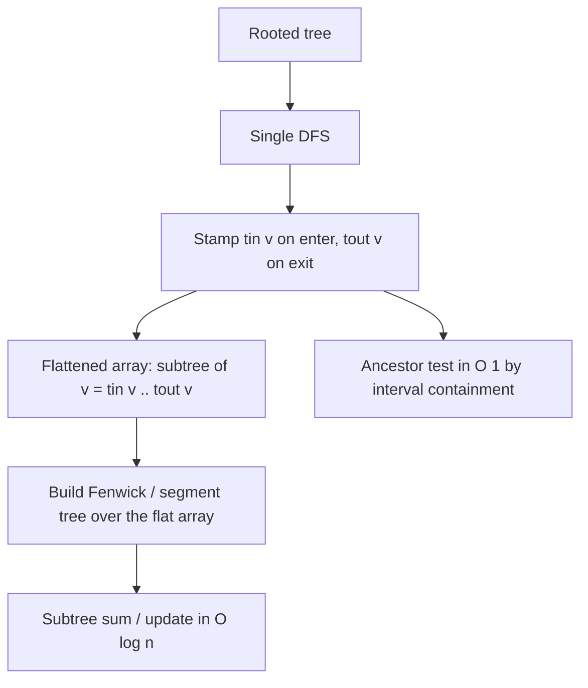

# Euler Tour Technique (Tree Flattening) — Junior Level

> **One-line summary:** The Euler Tour Technique flattens a rooted tree into a linear array using a single DFS that records an **entry time** `tin[v]` and an **exit time** `tout[v]` for every node, so that an entire subtree maps to one **contiguous range** `[tin[v], tout[v]]` — turning subtree queries and updates into plain array-range operations you can serve with a Fenwick tree or segment tree in `O(log n)`.

---

## Table of Contents

1. [Introduction](#introduction)
2. [Prerequisites](#prerequisites)
3. [Glossary](#glossary)
4. [Core Concepts](#core-concepts)
5. [Big-O Summary](#big-o-summary)
6. [Real-World Analogies](#real-world-analogies)
7. [Pros & Cons](#pros--cons)
8. [Step-by-Step Walkthrough](#step-by-step-walkthrough)
9. [Code Examples](#code-examples)
10. [Coding Patterns](#coding-patterns)
11. [Error Handling](#error-handling)
12. [Performance Tips](#performance-tips)
13. [Best Practices](#best-practices)
14. [Edge Cases & Pitfalls](#edge-cases--pitfalls)
15. [Common Mistakes](#common-mistakes)
16. [Cheat Sheet](#cheat-sheet)
17. [Visual Animation](#visual-animation)
18. [Summary](#summary)
19. [Further Reading](#further-reading)

---

## Introduction

A **tree** is a beautiful structure for *thinking* — a root, children, subtrees — but it is an awkward structure for *querying*. Suppose someone asks: "What is the sum of all values in the subtree rooted at node `v`?" or "Add 5 to every node under `v`." Done naively, each such query walks the whole subtree in `O(subtree size)`, which can be `O(n)` per query. Do that for `q` queries and you are at `O(n·q)` — far too slow when `n` and `q` are each `10^5` or more.

The **Euler Tour Technique** (ETT), sometimes called **tree flattening** or the **tin/tout technique**, fixes this with one simple observation:

> If you run a depth-first search from the root and stamp each node with the *time* you first enter it (`tin`) and the *time* you finish it (`tout`), then **every subtree occupies one contiguous block of timestamps**. The subtree of `v` is exactly the set of nodes whose entry time lies in the interval `[tin[v], tout[v]]`.

Once a subtree is a contiguous range `[L, R]`, a *subtree query* becomes a *range query* on an array, and a *range query on an array* is exactly what a **Fenwick tree (Binary Indexed Tree)** or a **segment tree** is built to answer in `O(log n)`. The hard tree problem dissolves into a standard array problem you already know how to solve.

That is the entire idea. You DFS once to build the mapping (`O(n)`), then every subtree operation is `O(log n)` instead of `O(n)`.

> **Important distinction.** The "Euler Tour Technique" for *tree flattening* described here is **not** the same as an "Euler circuit" or "Euler path" in general graphs (visiting every *edge* exactly once). The name is shared because the DFS traversal that visits each edge twice is loosely an "Euler tour of the tree," but the technique we study is purely about flattening a rooted tree into an array. Keep them separate in your head.

---

## Prerequisites

Before reading this file you should be comfortable with:

- **Trees** — root, parent, child, subtree, leaf (see `09-trees`).
- **Depth-first search (DFS)** — recursive or stack-based traversal of a tree/graph.
- **Arrays and 0-based indexing** — the flattened tree lives in a 1D array.
- **Ranges / intervals** `[L, R]` — a contiguous slice of an array.
- **Big-O notation** — `O(n)`, `O(log n)`.

Strongly helpful (you will pair ETT with these):

- **Fenwick tree / Binary Indexed Tree** (see `09-trees/09-fenwick-tree`) — `O(log n)` prefix sums and point updates.
- **Segment tree** (see `09-trees/08-segment-tree`) — `O(log n)` range queries and range updates.
- **Recursion mechanics** — call stack, entering and returning from a call.

---

## Glossary

| Term | Meaning |
|------|---------|
| **Rooted tree** | A tree with one designated root; every other node has a unique parent. |
| **Subtree of `v`** | `v` together with all of its descendants. |
| **Euler Tour Technique (ETT)** | Flattening a rooted tree into an array via DFS entry/exit times. |
| **`tin[v]` (in-time / entry time)** | The DFS timestamp when `v` is first visited. |
| **`tout[v]` (out-time / exit time)** | The DFS timestamp when DFS finishes processing `v`'s whole subtree. |
| **Flattened array / order array** | An array indexed by time; position `t` holds the node entered at time `t`. |
| **Subtree range** | The contiguous interval `[tin[v], tout[v]]` covering exactly `v`'s subtree. |
| **Fenwick tree (BIT)** | An array structure giving `O(log n)` point update + prefix-sum query. |
| **Ancestor** | A node on the path from the root down to (but above) a given node. |
| **One-entry-per-node flattening** | ETT variant where the array has `n` cells (subtree = range). |
| **Entry+exit (2n) flattening** | ETT variant where each node appears twice; used for path/ancestor work. |
| **LCA (lowest common ancestor)** | The deepest node that is an ancestor of two given nodes. |

---

## Core Concepts

### 1. The DFS timer

ETT runs one DFS and keeps a single global counter, `timer`, that ticks up as the traversal proceeds. There are two common conventions; both are correct, just pick one and stay consistent.

**Convention A — one entry per node (subtree = range).** You stamp `tin[v] = timer++` when you *enter* `v`, recurse into children, then set `tout[v] = timer - 1` after the last child returns. The array has exactly `n` positions. This is the variant used for **subtree sum / subtree update / subtree min** — the bread-and-butter of ETT.

**Convention B — entry and exit both (2n array).** You push `v` onto the Euler array when you enter it *and* again when you leave it, so each node appears twice and the array has `2n` positions. This variant is used for **path queries**, **"is `u` an ancestor of `v`?"** checks combined with depth, and **LCA via range-minimum**.

For junior level we focus on **Convention A**, because "subtree = contiguous range" is the cleanest and most useful first lesson.

### 2. The key invariant — subtree is a contiguous range

Here is the property that makes everything work:

> For Convention A, the nodes of `v`'s subtree are **exactly** the nodes `u` with `tin[v] ≤ tin[u] ≤ tout[v]`.

Why? DFS enters `v`, then completely explores every descendant of `v` *before* it returns from `v` and moves on to anything outside the subtree. So all of `v`'s descendants receive entry times *after* `tin[v]` and *before* `v` finishes. The entry times of the subtree form an unbroken block `[tin[v], tout[v]]` — no node outside the subtree can sneak a timestamp into that range.

### 3. Building the flattened array

Create an array `order` of size `n`. When you stamp `tin[v] = t`, also record `order[t] = v`. Now `order` lists the nodes in DFS-entry order, and the subtree of `v` is the slice `order[tin[v] .. tout[v]]`.

If each node has a *value*, build a parallel array `flat` where `flat[tin[v]] = value(v)`. Then **the sum of `v`'s subtree values = the sum of `flat[tin[v] .. tout[v]]`** — a plain range sum.

### 4. Plugging in a Fenwick tree

A subtree query is now a range query on `flat`. Build a Fenwick tree (BIT) over `flat`:

- **Subtree sum of `v`** = `prefixSum(tout[v]) - prefixSum(tin[v] - 1)` → `O(log n)`.
- **Point update node `v` to value `x`** = update BIT position `tin[v]` → `O(log n)`.
- **Add `delta` to the whole subtree of `v`** = a *range update* on `[tin[v], tout[v]]`, done with a difference-Fenwick or a lazy segment tree → `O(log n)`.

The DFS to build `tin/tout` is `O(n)` once; after that, each operation is `O(log n)`.

### 5. The ancestor test

A delightful bonus: with `tin/tout` you can test ancestry in `O(1)`:

```
u is an ancestor of v  ⟺  tin[u] ≤ tin[v] AND tout[v] ≤ tout[u]
```

`u`'s subtree range fully contains `v`'s range exactly when `u` is above `v`. This `O(1)` check is the seed of LCA-by-binary-lifting and many tree algorithms.

---

## Big-O Summary

| Operation | Complexity | Notes |
|-----------|------------|-------|
| Build `tin/tout` (one DFS) | **O(n)** | Single traversal, each node visited once. |
| Map subtree of `v` to a range | **O(1)** | Just read `[tin[v], tout[v]]`. |
| Is `u` an ancestor of `v`? | **O(1)** | Two timestamp comparisons. |
| Subtree sum (with Fenwick/segtree) | **O(log n)** | Range query on the flattened array. |
| Point update a node | **O(log n)** | Fenwick/segtree point update at `tin[v]`. |
| Subtree range update (+delta) | **O(log n)** | Difference-Fenwick or lazy segment tree. |
| Memory | **O(n)** | `tin`, `tout`, flattened array, Fenwick/segtree. |

Compare with the naive approach: each subtree query is `O(subtree size)` = up to `O(n)`, so `q` queries cost `O(n·q)`. ETT replaces that with `O(n + q·log n)`.

---

## Real-World Analogies

| Concept | Analogy |
|---------|---------|
| DFS entry/exit timestamps | Reading a book's **table of contents**: a chapter's start page and its end page bracket every section, subsection, and paragraph that belongs to it. |
| Subtree = contiguous range | A **nested folder** on your computer: everything inside `Photos/` is stored under one path prefix; "everything under Photos" is one contiguous region of the tree. |
| `tin[v]` and `tout[v]` | **Punch-in and punch-out times** at a job: everything you did during your shift happened between clock-in and clock-out. |
| Ancestor test by interval containment | **Russian nesting dolls (matryoshka):** one doll is "inside" another exactly when its range fits entirely inside the bigger doll's range. |
| Fenwick tree over the flat array | The **page-number index** at the back of a book: jump to any range of pages and total them quickly. |

Where the analogies break down: a table of contents lists each section once (matching Convention A), but the *traversal itself* enters and leaves each node, so the full Euler walk visits each edge twice — closer to "walking the perimeter of every chapter," which is Convention B.

---

## Pros & Cons

| Pros | Cons |
|------|------|
| Turns subtree queries into `O(log n)` range queries. | Requires the tree to be **rooted and static in shape** (no easy node insertion). |
| One `O(n)` DFS preprocesses everything. | Adding/removing edges forces a re-flatten (`O(n)`). |
| `O(1)` ancestor test as a free bonus. | "Path between two nodes" needs the heavier Convention B + LCA (or HLD). |
| Pairs cleanly with Fenwick/segment trees you already know. | Recursion depth can overflow the stack on deep trees. |
| Same flat array supports sum, min, max, gcd via the right segtree. | The two conventions (n vs 2n) confuse beginners; mixing them is a classic bug. |
| Extends to LCA via Euler tour + range-minimum. | Only contiguous *subtrees* are ranges — arbitrary node sets are not. |

**When to use:** static-shape rooted tree, many subtree sum/min/update queries, ancestor tests, or as a building block for LCA and Heavy-Light Decomposition.

**When NOT to use:** the tree's *shape* changes frequently (link/cut operations) — reach for a Link-Cut Tree or Euler-Tour Tree instead; or you need arbitrary-subset queries that are not subtrees.

---

## Step-by-Step Walkthrough

Take this small rooted tree (root = `1`):

```
            1
          / | \
         2  3  4
        / \     \
       5   6     7
```

Run DFS from `1`, visiting children in increasing order. We use **Convention A** (one entry per node), with `timer` starting at `0`.

| Step | Action | Node | `tin` | `tout` |
|------|--------|------|-------|--------|
| enter | visit 1 | 1 | 0 | — |
| enter | visit 2 | 2 | 1 | — |
| enter | visit 5 (leaf) | 5 | 2 | 2 |
| enter | visit 6 (leaf) | 6 | 3 | 3 |
| leave | finish 2 | 2 | 1 | 3 |
| enter | visit 3 (leaf) | 3 | 4 | 4 |
| enter | visit 4 | 4 | 5 | — |
| enter | visit 7 (leaf) | 7 | 6 | 6 |
| leave | finish 4 | 4 | 5 | 6 |
| leave | finish 1 | 1 | 0 | 6 |

Final stamps:

| node | 1 | 2 | 3 | 4 | 5 | 6 | 7 |
|------|---|---|---|---|---|---|---|
| `tin`  | 0 | 1 | 4 | 5 | 2 | 3 | 6 |
| `tout` | 6 | 3 | 4 | 6 | 2 | 3 | 6 |

The **flattened order array** (position = time, value = node entered then):

```
index:   0   1   2   3   4   5   6
order:   1   2   5   6   3   4   7
```

Now read off subtrees as ranges:

- Subtree of `1` = `[tin=0, tout=6]` = `order[0..6]` = `{1,2,5,6,3,4,7}` → the whole tree. ✓
- Subtree of `2` = `[1, 3]` = `order[1..3]` = `{2,5,6}`. ✓
- Subtree of `4` = `[5, 6]` = `order[5..6]` = `{4,7}`. ✓
- Subtree of `5` = `[2, 2]` = `{5}` (a leaf is a length-1 range). ✓

Ancestor test, `O(1)`:

- Is `2` an ancestor of `6`? `tin[2]=1 ≤ tin[6]=3` and `tout[6]=3 ≤ tout[2]=3` → **yes**. ✓
- Is `2` an ancestor of `7`? `tin[2]=1 ≤ tin[7]=6` but `tout[7]=6 ≤ tout[2]=3` is **false** → **no**. ✓

If node values are `value = [_, 10, 20, 30, 40, 50, 60, 70]` (1-indexed by node id), the flattened value array is:

```
index:   0   1   2   3   4   5   6
order:   1   2   5   6   3   4   7
flat:   10  20  50  60  30  40  70
```

Subtree sum of `2` = `flat[1..3]` = `20 + 50 + 60 = 130`. A Fenwick prefix query computes it in `O(log n)`.

---

## Code Examples

### Example: Build tin/tout and answer subtree sums with a Fenwick tree

We DFS once to flatten, then use a Fenwick tree over the flattened values so each subtree sum and each point update is `O(log n)`.

#### Go

```go
package main

import "fmt"

// EulerTour holds the flattening of a rooted tree.
type EulerTour struct {
	tin, tout []int
	timer     int
	adj       [][]int
}

func newEulerTour(n int, adj [][]int, root int) *EulerTour {
	e := &EulerTour{
		tin:  make([]int, n),
		tout: make([]int, n),
		adj:  adj,
	}
	e.dfs(root, -1)
	return e
}

// dfs stamps entry and exit times (Convention A: one entry per node).
func (e *EulerTour) dfs(v, parent int) {
	e.tin[v] = e.timer
	e.timer++
	for _, c := range e.adj[v] {
		if c != parent {
			e.dfs(c, v)
		}
	}
	e.tout[v] = e.timer - 1
}

// isAncestor reports whether u is an ancestor of w (or u == w).
func (e *EulerTour) isAncestor(u, w int) bool {
	return e.tin[u] <= e.tin[w] && e.tout[w] <= e.tout[u]
}

// Fenwick (Binary Indexed Tree) for point update + prefix sum.
type Fenwick struct{ t []int }

func newFenwick(n int) *Fenwick { return &Fenwick{t: make([]int, n+1)} }

func (f *Fenwick) add(i, delta int) { // i is 0-based
	for i++; i < len(f.t); i += i & (-i) {
		f.t[i] += delta
	}
}

func (f *Fenwick) prefix(i int) int { // sum of [0..i], i is 0-based
	s := 0
	for i++; i > 0; i -= i & (-i) {
		s += f.t[i]
	}
	return s
}

func (f *Fenwick) rangeSum(l, r int) int { return f.prefix(r) - f.prefix(l-1) }

func main() {
	// tree: 1 is root; children below (0-based node ids 0..6 == labels 1..7)
	adj := make([][]int, 7)
	add := func(a, b int) { adj[a] = append(adj[a], b); adj[b] = append(adj[b], a) }
	add(0, 1) // 1-2
	add(0, 2) // 1-3
	add(0, 3) // 1-4
	add(1, 4) // 2-5
	add(1, 5) // 2-6
	add(3, 6) // 4-7

	et := newEulerTour(7, adj, 0)

	values := []int{10, 20, 30, 40, 50, 60, 70} // by node id
	bit := newFenwick(7)
	for v := 0; v < 7; v++ {
		bit.add(et.tin[v], values[v]) // place value at the node's entry time
	}

	subtreeSum := func(v int) int { return bit.rangeSum(et.tin[v], et.tout[v]) }

	fmt.Println("subtree sum of node 2 (id 1):", subtreeSum(1)) // 20+50+60 = 130
	fmt.Println("is 2 ancestor of 6?", et.isAncestor(1, 5))     // true
	fmt.Println("is 2 ancestor of 7?", et.isAncestor(1, 6))     // false

	bit.add(et.tin[4], 5) // node 5 (id 4): +5
	fmt.Println("subtree sum of node 2 after update:", subtreeSum(1)) // 135
}
```

#### Java

```java
import java.util.*;

public class EulerTourSubtreeSum {
    static int[] tin, tout;
    static int timer = 0;
    static List<List<Integer>> adj;

    // Convention A: one entry per node; subtree = [tin[v], tout[v]].
    static void dfs(int v, int parent) {
        tin[v] = timer++;
        for (int c : adj.get(v)) {
            if (c != parent) dfs(c, v);
        }
        tout[v] = timer - 1;
    }

    static boolean isAncestor(int u, int w) {
        return tin[u] <= tin[w] && tout[w] <= tout[u];
    }

    // Fenwick tree (BIT): point add + prefix sum, both O(log n).
    static long[] bit;
    static void bitAdd(int i, long delta) { // 0-based index
        for (i++; i < bit.length; i += i & (-i)) bit[i] += delta;
    }
    static long bitPrefix(int i) { // sum of [0..i], 0-based
        long s = 0;
        for (i++; i > 0; i -= i & (-i)) s += bit[i];
        return s;
    }
    static long bitRange(int l, int r) { return bitPrefix(r) - bitPrefix(l - 1); }

    public static void main(String[] args) {
        int n = 7;
        adj = new ArrayList<>();
        for (int i = 0; i < n; i++) adj.add(new ArrayList<>());
        int[][] edges = {{0,1},{0,2},{0,3},{1,4},{1,5},{3,6}};
        for (int[] e : edges) { adj.get(e[0]).add(e[1]); adj.get(e[1]).add(e[0]); }

        tin = new int[n];
        tout = new int[n];
        dfs(0, -1);

        long[] values = {10, 20, 30, 40, 50, 60, 70};
        bit = new long[n + 1];
        for (int v = 0; v < n; v++) bitAdd(tin[v], values[v]);

        System.out.println("subtree sum of node 2: " + bitRange(tin[1], tout[1])); // 130
        System.out.println("is 2 ancestor of 6? " + isAncestor(1, 5));            // true
        System.out.println("is 2 ancestor of 7? " + isAncestor(1, 6));            // false

        bitAdd(tin[4], 5);
        System.out.println("subtree sum of node 2 after update: " + bitRange(tin[1], tout[1])); // 135
    }
}
```

#### Python

```python
import sys
sys.setrecursionlimit(1_000_000)  # deep trees can blow the default limit


class EulerTour:
    def __init__(self, n, adj, root):
        self.tin = [0] * n
        self.tout = [0] * n
        self.timer = 0
        self.adj = adj
        self._dfs(root, -1)

    def _dfs(self, v, parent):
        self.tin[v] = self.timer
        self.timer += 1
        for c in self.adj[v]:
            if c != parent:
                self._dfs(c, v)
        self.tout[v] = self.timer - 1

    def is_ancestor(self, u, w):
        return self.tin[u] <= self.tin[w] and self.tout[w] <= self.tout[u]


class Fenwick:
    def __init__(self, n):
        self.t = [0] * (n + 1)

    def add(self, i, delta):          # 0-based index
        i += 1
        while i < len(self.t):
            self.t[i] += delta
            i += i & (-i)

    def prefix(self, i):              # sum of [0..i], 0-based
        i += 1
        s = 0
        while i > 0:
            s += self.t[i]
            i -= i & (-i)
        return s

    def range_sum(self, l, r):
        return self.prefix(r) - self.prefix(l - 1)


if __name__ == "__main__":
    n = 7
    adj = [[] for _ in range(n)]
    for a, b in [(0, 1), (0, 2), (0, 3), (1, 4), (1, 5), (3, 6)]:
        adj[a].append(b)
        adj[b].append(a)

    et = EulerTour(n, adj, 0)
    values = [10, 20, 30, 40, 50, 60, 70]
    bit = Fenwick(n)
    for v in range(n):
        bit.add(et.tin[v], values[v])

    subtree_sum = lambda v: bit.range_sum(et.tin[v], et.tout[v])
    print("subtree sum of node 2:", subtree_sum(1))      # 130
    print("is 2 ancestor of 6?", et.is_ancestor(1, 5))   # True
    print("is 2 ancestor of 7?", et.is_ancestor(1, 6))   # False

    bit.add(et.tin[4], 5)
    print("subtree sum of node 2 after update:", subtree_sum(1))  # 135
```

**What it does:** flattens the tree with one DFS, stores each node's value at its entry time, then answers subtree sums and ancestor tests using a Fenwick tree.
**Run:** `go run main.go` | `javac EulerTourSubtreeSum.java && java EulerTourSubtreeSum` | `python ett.py`

---

## Coding Patterns

### Pattern 1: Subtree → Range

**Intent:** Convert "do something to `v`'s subtree" into "do something to `[tin[v], tout[v]]`."

```text
range = [tin[v], tout[v]]
subtreeSum(v)   = bit.rangeSum(tin[v], tout[v])
subtreeUpdate(v, x) = rangeUpdate(tin[v], tout[v], x)
```

### Pattern 2: Point-update node, query subtree

**Intent:** Single nodes change value; subtree aggregates are queried.

```text
update node v to value x: bit.add(tin[v], x - currentValue[v]); currentValue[v] = x
subtree aggregate of v:   bit.rangeSum(tin[v], tout[v])
```

### Pattern 3: Range-update subtree, query single node

**Intent:** Add `delta` to a whole subtree; ask for a single node's accumulated value. Use a **difference Fenwick**: add `+delta` at `tin[v]`, `-delta` at `tout[v]+1`; a node's value is the prefix sum up to its `tin`.

```text
subtreeAdd(v, delta): diff.add(tin[v], +delta); diff.add(tout[v] + 1, -delta)
nodeValue(u):         base[u] + diff.prefix(tin[u])
```

### Pattern 4: O(1) ancestor test

```text
isAncestor(u, w) = (tin[u] <= tin[w]) and (tout[w] <= tout[u])
```



---

## Error Handling

| Error | Cause | Fix |
|-------|-------|-----|
| Wrong subtree members | Mixed up `tin`/`tout` order, or used Convention B (2n) where A (n) was needed. | Pick one convention; subtree-as-range needs Convention A. |
| Stack overflow on deep tree | Recursive DFS on a chain of 10^5+ nodes. | Raise the recursion limit (Python) or use an explicit-stack iterative DFS. |
| Off-by-one in range query | Used `tout[v]` exclusive vs inclusive inconsistently. | Be explicit: `[tin[v], tout[v]]` is **inclusive** in Convention A. |
| Counting a node twice | Used the 2n array but summed both occurrences. | For subtree *sums*, store the value once (Convention A), not twice. |
| Ancestor test always false | Compared `tin` to `tout` of the wrong nodes. | `tin[u] ≤ tin[w]` AND `tout[w] ≤ tout[u]` — outer node is `u`. |

---

## Performance Tips

- **Do the DFS iteratively** for very deep trees to avoid stack overflow; an explicit stack of `(node, childIndex)` frames works.
- **Store values at `tin[v]`** in a single flat array, then build the Fenwick/segtree once in `O(n)` rather than `n` point updates.
- **Use a Fenwick tree, not a segment tree, for plain subtree sums** — smaller constant factor and less code.
- **Reuse the same flat array** for multiple aggregate types (sum, min, max) by building one segtree per aggregate over it.
- **Avoid recomputing `tin/tout`** unless the tree shape changes; the mapping is stable across value updates.

---

## Best Practices

- Decide up front: do you need **subtree** queries (Convention A) or **path/LCA** queries (Convention B)? Comment which one you chose.
- Keep `tin` and `tout` as separate arrays; do not overload one array to mean both.
- Use **inclusive** ranges `[tin[v], tout[v]]` consistently and document it.
- Pair ETT with a Fenwick tree for sums; with a lazy segment tree for range-add + range-sum.
- Test the ancestor test on root-vs-leaf, node-vs-itself, and sibling pairs.
- Re-flatten (`O(n)`) only when the tree's *shape* changes, never on value changes.

---

## Edge Cases & Pitfalls

- **Single-node tree** — `tin[root]=tout[root]=0`; the subtree range is `[0,0]`.
- **A leaf** — `tin[v] == tout[v]`; the range has length 1.
- **The root** — its subtree is the entire array `[0, n-1]`.
- **A node is its own ancestor** — `isAncestor(v, v)` returns true with the `≤` comparisons; decide if you want that.
- **Deep skinny tree (a chain)** — recursion depth `n`; iterative DFS or a higher recursion limit is mandatory.
- **Forest (multiple roots)** — run the DFS from each root, continuing the same `timer`; each tree gets a disjoint block.

---

## Common Mistakes

1. **Confusing ETT with Euler circuits in graphs** — this technique flattens a *rooted tree*; it is not about visiting every edge of an arbitrary graph.
2. **Mixing the n and 2n conventions** — using a `2n` Euler array but treating `[tin, tout]` as if it were the `n`-array range.
3. **Forgetting the range is inclusive** — querying `[tin[v], tout[v])` (exclusive) drops the last node.
4. **Re-flattening on every value update** — the DFS is only needed when the *shape* changes; values can change freely.
5. **Recursive DFS without raising the stack limit** — a deep tree overflows and crashes.
6. **Storing a value at the node id instead of `tin[v]`** — the Fenwick must be indexed by *time*, not by node id.

---

## Cheat Sheet

| Item | Value |
|------|-------|
| Build (one DFS) | O(n) |
| Subtree → range | O(1): `[tin[v], tout[v]]` |
| Ancestor test | O(1): `tin[u]≤tin[w] ∧ tout[w]≤tout[u]` |
| Subtree sum (Fenwick) | O(log n) |
| Point update | O(log n) |
| Subtree range update | O(log n) (diff-Fenwick / lazy segtree) |
| Memory | O(n) |

Core DFS stamping (Convention A):

```text
dfs(v, parent):
    tin[v] = timer++          # enter
    for child c of v (c != parent):
        dfs(c, v)
    tout[v] = timer - 1       # leave; subtree is [tin[v], tout[v]]
```

Two conventions:

| Convention | Array size | Subtree query | Path / LCA query |
|------------|-----------|---------------|------------------|
| A — one entry per node | `n` | range `[tin, tout]` ✓ | not directly |
| B — entry + exit | `2n` | possible but heavier | ✓ (with depth / RMQ) |

---

## Visual Animation

> See [`animation.html`](./animation.html) for an interactive visual animation of the Euler Tour Technique.
>
> The animation demonstrates:
> - A DFS sweeping the tree and assigning `tin`/`tout` timestamps live
> - The flattened linear array filling up in entry order
> - Selecting a node and highlighting its subtree as a **contiguous range** in the array
> - A Fenwick-tree update and a subtree-sum query over that range
> - Step / Run / Reset controls with an operation log

---

## Summary

The Euler Tour Technique flattens a rooted tree into a linear array with a single DFS that records entry (`tin`) and exit (`tout`) times. Its central gift is that **every subtree becomes one contiguous range** `[tin[v], tout[v]]`, so subtree sums, subtree updates, and subtree minima reduce to ordinary array-range operations served by a Fenwick tree or segment tree in `O(log n)`. As a free bonus, the same timestamps give an `O(1)` ancestor test by interval containment. Build the mapping once in `O(n)`, then answer `q` queries in `O(q log n)` instead of the naive `O(n·q)`. Keep the two conventions (one-entry `n`-array for subtrees, entry+exit `2n`-array for paths/LCA) straight, and never confuse this tree-flattening trick with Euler circuits in general graphs.

**Next step:** Continue to [`middle.md`](./middle.md) to learn *why* the two flattenings exist, when to choose subtree-range vs path queries, and how ETT pairs with Fenwick trees, lazy segment trees, and LCA.

---

## Further Reading

- *Competitive Programmer's Handbook* (Antti Laaksonen) — "Tree queries" chapter (Euler tour, subtree and path queries).
- cp-algorithms.com — "Euler tour technique" and "Lowest Common Ancestor — `O(1)` with Sparse Table (Euler tour + RMQ)."
- *Introduction to Algorithms* (CLRS) — DFS, discovery/finish times (the `tin/tout` idea originates here as "timestamps").
- Sibling topics: `09-trees/09-fenwick-tree`, `09-trees/08-segment-tree`, `11-graphs/15-lca` (lowest common ancestor), `11-graphs/17-heavy-light-decomposition`.
- USACO Guide — "Euler Tour on Trees" module.
