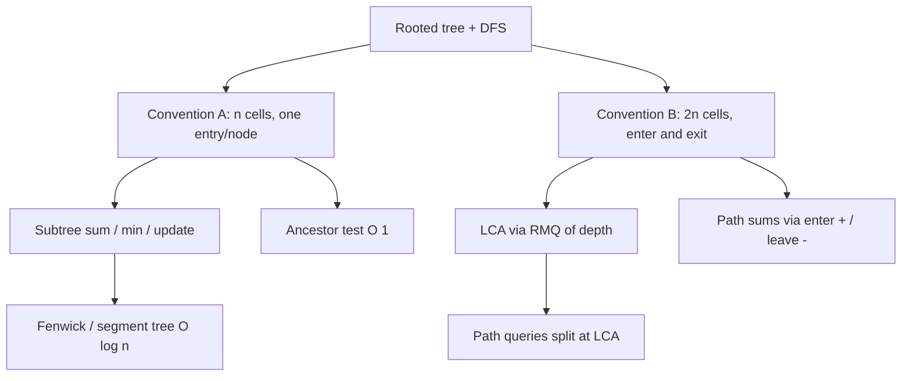

# Euler Tour Technique (Tree Flattening) — Middle Level

> **Focus:** *Why* there are two flattenings, *when* to use subtree-range vs path/ancestor queries, and how the Euler tour pairs with a Fenwick tree, a lazy segment tree, and LCA-by-RMQ to solve a whole family of tree problems with one `O(n)` preprocessing and `O(log n)` queries.

---

## Table of Contents

1. [Introduction](#introduction)
2. [Deeper Concepts: The Two Flattenings](#deeper-concepts-the-two-flattenings)
3. [Comparison with Alternatives](#comparison-with-alternatives)
4. [Advanced Patterns](#advanced-patterns)
5. [Tree Applications](#tree-applications)
6. [Pairing with Fenwick and Segment Trees](#pairing-with-fenwick-and-segment-trees)
7. [Euler Tour + RMQ for LCA](#euler-tour--rmq-for-lca)
8. [Code Examples](#code-examples)
9. [Error Handling](#error-handling)
10. [Performance Analysis](#performance-analysis)
11. [Best Practices](#best-practices)
12. [Visual Animation](#visual-animation)
13. [Summary](#summary)

---

## Introduction

> Focus: "Why does it work?" and "When should I choose this?"

At junior level you learned the mechanic: one DFS produces `tin/tout`, and a subtree becomes a contiguous range. At middle level we step back and ask the engineering questions:

1. There are **two** common Euler-tour flattenings — a `n`-cell array and a `2n`-cell array. Why do both exist, and which problems demand which?
2. ETT competes with raw DFS-per-query, with **Heavy-Light Decomposition (HLD)**, with **small-to-large merging**, and with **Mo's algorithm on trees**. When is ETT the right tool, and when is it the wrong one?
3. How exactly does the flat array marry a Fenwick tree (point update + subtree sum) versus a lazy segment tree (subtree range-add + subtree range-sum)? The choice of auxiliary structure is where most of the real engineering lives.
4. The Euler tour is also the classic route to **`O(1)` LCA** via range-minimum. Understanding that link unlocks path queries and HLD.

The throughline: ETT is a *reduction*. It turns tree problems into array problems. The skill is recognizing **which** array problem each tree problem becomes, and then picking the right array structure.

---

## Deeper Concepts: The Two Flattenings

### Invariant recap (Convention A)

For the one-entry-per-node flattening, the load-bearing invariant is:

> **Subtree-as-interval:** `u` is in the subtree of `v` ⟺ `tin[v] ≤ tin[u] ≤ tout[v]`.

This holds because DFS fully explores a subtree before leaving it, so subtree entry times form an unbroken block. Break this — for example by visiting children out of a consistent DFS order between two runs — and your ranges no longer mean anything. The invariant is what makes the whole technique a valid reduction.

### Convention A — one entry per node (the `n`-array)

```text
dfs(v):
    tin[v] = timer++
    for child c: dfs(c)
    tout[v] = timer - 1     # inclusive
```

- Array length: `n`.
- Subtree of `v` = `[tin[v], tout[v]]`.
- Used for: **subtree sum**, **subtree min/max**, **subtree add**, **count distinct in subtree (Mo on tree)**, **ancestor test**.

### Convention B — entry and exit both (the `2n`-array)

```text
dfs(v):
    euler.append(v); first[v] = len(euler)-1   # entry
    for child c: dfs(c); euler.append(v)        # re-append on returning
```

Two popular sub-variants:

1. **Push on enter and on leave** (each node twice) → length `2n`. A node `u` is in `v`'s subtree iff its first occurrence lies between `v`'s first and last occurrence. This variant supports **path sums via prefix sums** (add value on enter, subtract on leave) and is the substrate for **LCA-by-RMQ-of-depth**.
2. **Push on enter and after every child return** → length `2n - 1` (the canonical "Euler tour" used for LCA). The LCA of `u` and `v` is the **shallowest** node in the array segment between `first[u]` and `first[v]`.

### Why two? A decision table

| You need… | Use | Why |
|-----------|-----|-----|
| Subtree aggregate (sum/min/max) | Convention A (`n`) | Subtree = one clean inclusive range. |
| Subtree range update | Convention A (`n`) | Update one contiguous range. |
| `O(1)` ancestor test | Either (uses `tin/tout`) | Interval containment. |
| LCA in `O(1)` after `O(n)` build | Convention B (`2n-1`) + RMQ | LCA = shallowest node in a range. |
| Path sum root→node | Convention B (enter `+`, leave `-`) | Prefix sum cancels out left subtrees. |
| Path between arbitrary `u,v` | Convention B + LCA, or HLD | Split path at LCA. |

The single most common beginner bug is using a `2n` array and then treating `[tin[v], tout[v]]` as if the array had `n` cells — the indices no longer line up. **Pick the convention the problem needs and stay in it.**



---

## Comparison with Alternatives

| Attribute | Euler Tour + Fenwick/segtree | Naive DFS per query | Heavy-Light Decomposition | Small-to-large merge |
|-----------|------------------------------|---------------------|---------------------------|----------------------|
| Build time | `O(n)` | `O(1)` | `O(n)` | — |
| Subtree query | `O(log n)` | `O(subtree)` ≤ `O(n)` | `O(log n)` | `O(n log n)` total |
| Subtree update | `O(log n)` | `O(subtree)` | `O(log n)` | offline only |
| Path query | needs B+LCA / HLD | `O(path)` | `O(log² n)` | — |
| Handles shape change | no (re-flatten) | yes | no | no |
| Code complexity | low | trivial | high | medium |
| Best for | subtree queries, ancestor tests | tiny `n` / one-off | path **and** subtree queries | offline subtree aggregation |

**Choose Euler Tour when:** the dominant operations are **subtree** queries/updates on a **static-shape** tree, or you need ancestor tests, or you need a cheap LCA. It is the lightest tool that gets subtree work to `O(log n)`.

**Choose HLD when:** you need fast **path** queries (`u`→`v` along tree edges), not just subtree queries. HLD also gives subtree ranges, so it subsumes ETT for subtrees, but it is heavier to implement.

**Choose small-to-large / Mo-on-tree when:** queries are **offline** and you need things like "number of distinct colors in a subtree," where no simple invertible aggregate exists.

**Avoid ETT when:** the tree's *shape* changes (links/cuts) — use a Link-Cut Tree or Euler-Tour Tree (a balanced BST over the Euler sequence) instead.

---

## Advanced Patterns

### Pattern A: Subtree range-add + subtree range-sum (lazy segment tree)

When updates add a delta to *every* node in a subtree and queries ask for a subtree sum, a plain Fenwick is not enough (it does point update + range query). Use a **lazy segment tree** over the flat array, where both update and query are on `[tin[v], tout[v]]`:

```text
subtreeAdd(v, delta) -> seg.rangeAdd(tin[v], tout[v], delta)
subtreeSum(v)        -> seg.rangeSum(tin[v], tout[v])
```

### Pattern B: Point-add + subtree-sum (Fenwick)

When a single node changes and you query subtree sums, a Fenwick is ideal:

```text
update(v, x) -> bit.add(tin[v], x - cur[v]); cur[v] = x
query(v)     -> bit.rangeSum(tin[v], tout[v])
```

### Pattern C: Subtree-add + point-query (difference Fenwick)

The dual of B. Add to a whole subtree, read a single node:

```text
subtreeAdd(v, delta) -> diff.add(tin[v], +delta); diff.add(tout[v]+1, -delta)
nodeValue(u)         -> base[u] + diff.prefix(tin[u])
```

### Pattern D: Two Fenwicks for range-add + range-sum

If you want **both** range-add and range-sum but prefer Fenwicks over a segment tree, the classic two-BIT trick (`B1`, `B2`) gives range update + range sum in `O(log n)` with a tiny constant — applied directly on `[tin[v], tout[v]]`.

### Pattern E: Path root→v sum via enter/leave signs

On the `2n` array, store `+value` at `tin[v]` and `-value` at `tout[v]+1` (or at the leave position). Then the **prefix sum up to `tin[v]`** equals the sum of values on the root→`v` path, because every left subtree's `+`/`-` cancels.

---

## Tree Applications

| Problem | Reduction via Euler tour |
|---------|--------------------------|
| Sum of values in subtree of `v` | range sum `[tin[v], tout[v]]` (Fenwick) |
| Add `x` to every node under `v` | range add `[tin[v], tout[v]]` (lazy segtree / diff-Fenwick) |
| Min value in subtree of `v` | range min `[tin[v], tout[v]]` (segtree) |
| Is `u` an ancestor of `v`? | `tin[u]≤tin[v] ∧ tout[v]≤tout[u]` (`O(1)`) |
| Distance between `u`, `v` | `depth[u]+depth[v]-2·depth[LCA(u,v)]` |
| `k`-th ancestor / LCA | binary lifting or Euler+RMQ |
| Count nodes in subtree | `tout[v] - tin[v] + 1` (`O(1)`) |
| Color a subtree, query node color | subtree range-assign (lazy segtree) |

---

## Pairing with Fenwick and Segment Trees

The flat array is just an array; the *operations* decide the auxiliary structure:

| Update kind | Query kind | Structure | Per-op cost |
|-------------|-----------|-----------|-------------|
| point | subtree sum | Fenwick (BIT) | `O(log n)` |
| subtree add | point value | difference Fenwick | `O(log n)` |
| subtree add | subtree sum | lazy segment tree **or** two-BIT trick | `O(log n)` |
| point | subtree min/max/gcd | segment tree | `O(log n)` |
| subtree assign | subtree sum | lazy segment tree | `O(log n)` |

The recurring template, no matter the structure:

```text
build tin/tout once  (O(n) DFS)
build aux structure over flat[]   (O(n))
each subtree op = aux op on [tin[v], tout[v]]   (O(log n))
```

---

## Euler Tour + RMQ for LCA

The most elegant use of the `2n-1` Euler tour: **LCA reduces to range-minimum.**

Build the Euler tour `euler[]` (length `2n-1`) by appending `v` on entry and after each child returns, together with a parallel `depth[]` array (`depth[t]` is the depth of `euler[t]`), and `first[v]` = the first index where `v` appears.

> **LCA(u, v)** = the node at the index of the **minimum depth** in the segment `euler[ first[u] .. first[v] ]`.

Intuition: between the first visits of `u` and `v`, the tour must climb up to their common ancestor and back down; the shallowest node touched in that window is exactly the LCA. A range-minimum structure over `depth[]` then answers each LCA in:

- `O(log n)` with a segment tree (build `O(n)`), or
- `O(1)` with a sparse table (build `O(n log n)`).

Once you have LCA, **path queries** between arbitrary `u` and `v` split as `u → LCA → v`, and distances become `depth[u] + depth[v] - 2·depth[LCA]`.

---

## Code Examples

### Full Implementation: subtree sum/update (Fenwick) + LCA (Euler+RMQ)

#### Go

```go
package main

import "fmt"

type Tree struct {
	n          int
	adj        [][]int
	tin, tout  []int
	depth      []int
	euler      []int // length 2n-1, node at each step
	eulerDepth []int
	first      []int
	timer      int
}

func newTree(n int, adj [][]int, root int) *Tree {
	t := &Tree{
		n: n, adj: adj,
		tin: make([]int, n), tout: make([]int, n),
		depth: make([]int, n), first: make([]int, n),
	}
	t.dfs(root, -1, 0)
	return t
}

func (t *Tree) dfs(v, parent, d int) {
	t.tin[v] = t.timer
	t.timer++
	t.depth[v] = d
	t.first[v] = len(t.euler)
	t.euler = append(t.euler, v)
	t.eulerDepth = append(t.eulerDepth, d)
	for _, c := range t.adj[v] {
		if c != parent {
			t.dfs(c, v, d+1)
			t.euler = append(t.euler, v) // re-append on return
			t.eulerDepth = append(t.eulerDepth, d)
		}
	}
	t.tout[v] = t.timer - 1
}

func (t *Tree) isAncestor(u, w int) bool {
	return t.tin[u] <= t.tin[w] && t.tout[w] <= t.tout[u]
}

// Sparse table over eulerDepth for O(1) range-min (stores index of min).
type SparseRMQ struct {
	d    []int
	st   [][]int
	logT []int
}

func newSparseRMQ(d []int) *SparseRMQ {
	m := len(d)
	logT := make([]int, m+1)
	for i := 2; i <= m; i++ {
		logT[i] = logT[i/2] + 1
	}
	K := logT[m] + 1
	st := make([][]int, K)
	st[0] = make([]int, m)
	for i := range d {
		st[0][i] = i
	}
	for k := 1; k < K; k++ {
		st[k] = make([]int, m-(1<<k)+1)
		for i := 0; i+(1<<k) <= m; i++ {
			a, b := st[k-1][i], st[k-1][i+(1<<(k-1))]
			if d[a] <= d[b] {
				st[k][i] = a
			} else {
				st[k][i] = b
			}
		}
	}
	return &SparseRMQ{d: d, st: st, logT: logT}
}

func (s *SparseRMQ) queryIdx(l, r int) int { // inclusive, returns index of min
	if l > r {
		l, r = r, l
	}
	k := s.logT[r-l+1]
	a, b := s.st[k][l], s.st[k][r-(1<<k)+1]
	if s.d[a] <= s.d[b] {
		return a
	}
	return b
}

func (t *Tree) lca(u, v int, rmq *SparseRMQ) int {
	l, r := t.first[u], t.first[v]
	return t.euler[rmq.queryIdx(l, r)]
}

func main() {
	adj := make([][]int, 7)
	add := func(a, b int) { adj[a] = append(adj[a], b); adj[b] = append(adj[b], a) }
	add(0, 1)
	add(0, 2)
	add(0, 3)
	add(1, 4)
	add(1, 5)
	add(3, 6)

	t := newTree(7, adj, 0)
	rmq := newSparseRMQ(t.eulerDepth)

	fmt.Println("LCA(5,6) =", t.lca(4, 5, rmq))     // node 2 (id 1)
	fmt.Println("LCA(5,7) =", t.lca(4, 6, rmq))     // node 1 (id 0)
	fmt.Println("dist(5,7) =",
		t.depth[4]+t.depth[6]-2*t.depth[t.lca(4, 6, rmq)]) // 2+2-0 = 4
	fmt.Println("is 2 ancestor of 6?", t.isAncestor(1, 5)) // true
}
```

#### Java

```java
import java.util.*;

public class EulerTourLca {
    int n, timer = 0;
    List<List<Integer>> adj;
    int[] tin, tout, depth, first;
    List<Integer> euler = new ArrayList<>();
    List<Integer> eulerDepth = new ArrayList<>();

    EulerTourLca(int n, List<List<Integer>> adj, int root) {
        this.n = n; this.adj = adj;
        tin = new int[n]; tout = new int[n];
        depth = new int[n]; first = new int[n];
        dfs(root, -1, 0);
    }

    void dfs(int v, int parent, int d) {
        tin[v] = timer++;
        depth[v] = d;
        first[v] = euler.size();
        euler.add(v); eulerDepth.add(d);
        for (int c : adj.get(v)) {
            if (c != parent) {
                dfs(c, v, d + 1);
                euler.add(v); eulerDepth.add(d); // re-append on return
            }
        }
        tout[v] = timer - 1;
    }

    boolean isAncestor(int u, int w) {
        return tin[u] <= tin[w] && tout[w] <= tout[u];
    }

    // Sparse table of indices of minimum depth.
    int[][] st; int[] logT; int[] d;
    void buildRMQ() {
        d = new int[eulerDepth.size()];
        for (int i = 0; i < d.length; i++) d[i] = eulerDepth.get(i);
        int m = d.length;
        logT = new int[m + 1];
        for (int i = 2; i <= m; i++) logT[i] = logT[i / 2] + 1;
        int K = logT[m] + 1;
        st = new int[K][];
        st[0] = new int[m];
        for (int i = 0; i < m; i++) st[0][i] = i;
        for (int k = 1; k < K; k++) {
            st[k] = new int[m - (1 << k) + 1];
            for (int i = 0; i + (1 << k) <= m; i++) {
                int a = st[k - 1][i], b = st[k - 1][i + (1 << (k - 1))];
                st[k][i] = (d[a] <= d[b]) ? a : b;
            }
        }
    }

    int queryIdx(int l, int r) {
        if (l > r) { int t = l; l = r; r = t; }
        int k = logT[r - l + 1];
        int a = st[k][l], b = st[k][r - (1 << k) + 1];
        return (d[a] <= d[b]) ? a : b;
    }

    int lca(int u, int v) { return euler.get(queryIdx(first[u], first[v])); }

    public static void main(String[] args) {
        int n = 7;
        List<List<Integer>> adj = new ArrayList<>();
        for (int i = 0; i < n; i++) adj.add(new ArrayList<>());
        int[][] edges = {{0,1},{0,2},{0,3},{1,4},{1,5},{3,6}};
        for (int[] e : edges) { adj.get(e[0]).add(e[1]); adj.get(e[1]).add(e[0]); }

        EulerTourLca t = new EulerTourLca(n, adj, 0);
        t.buildRMQ();
        System.out.println("LCA(5,6) = " + t.lca(4, 5)); // 1
        System.out.println("LCA(5,7) = " + t.lca(4, 6)); // 0
        System.out.println("dist(5,7) = " +
            (t.depth[4] + t.depth[6] - 2 * t.depth[t.lca(4, 6)])); // 4
    }
}
```

#### Python

```python
import sys
sys.setrecursionlimit(1_000_000)


class EulerTourLca:
    def __init__(self, n, adj, root):
        self.n = n
        self.adj = adj
        self.tin = [0] * n
        self.tout = [0] * n
        self.depth = [0] * n
        self.first = [0] * n
        self.euler = []
        self.euler_depth = []
        self.timer = 0
        self._dfs(root, -1, 0)
        self._build_rmq()

    def _dfs(self, v, parent, d):
        self.tin[v] = self.timer
        self.timer += 1
        self.depth[v] = d
        self.first[v] = len(self.euler)
        self.euler.append(v)
        self.euler_depth.append(d)
        for c in self.adj[v]:
            if c != parent:
                self._dfs(c, v, d + 1)
                self.euler.append(v)        # re-append on return
                self.euler_depth.append(d)
        self.tout[v] = self.timer - 1

    def is_ancestor(self, u, w):
        return self.tin[u] <= self.tin[w] and self.tout[w] <= self.tout[u]

    def _build_rmq(self):
        d = self.euler_depth
        m = len(d)
        self.log = [0] * (m + 1)
        for i in range(2, m + 1):
            self.log[i] = self.log[i // 2] + 1
        K = self.log[m] + 1
        self.st = [[0] * m for _ in range(K)]
        self.st[0] = list(range(m))
        for k in range(1, K):
            span = 1 << k
            for i in range(0, m - span + 1):
                a = self.st[k - 1][i]
                b = self.st[k - 1][i + (span >> 1)]
                self.st[k][i] = a if d[a] <= d[b] else b
        self._d = d

    def _query_idx(self, l, r):
        if l > r:
            l, r = r, l
        k = self.log[r - l + 1]
        a = self.st[k][l]
        b = self.st[k][r - (1 << k) + 1]
        return a if self._d[a] <= self._d[b] else b

    def lca(self, u, v):
        return self.euler[self._query_idx(self.first[u], self.first[v])]

    def dist(self, u, v):
        return self.depth[u] + self.depth[v] - 2 * self.depth[self.lca(u, v)]


if __name__ == "__main__":
    n = 7
    adj = [[] for _ in range(n)]
    for a, b in [(0, 1), (0, 2), (0, 3), (1, 4), (1, 5), (3, 6)]:
        adj[a].append(b)
        adj[b].append(a)
    t = EulerTourLca(n, adj, 0)
    print("LCA(5,6) =", t.lca(4, 5))   # 1
    print("LCA(5,7) =", t.lca(4, 6))   # 0
    print("dist(5,7) =", t.dist(4, 6)) # 4
    print("is 2 ancestor of 6?", t.is_ancestor(1, 5))  # True
```

**What it does:** builds the `2n-1` Euler tour and a sparse table over depths, giving `O(1)` LCA, `O(1)` ancestor tests, and `O(1)` distances after `O(n log n)` preprocessing.
**Run:** `go run main.go` | `javac EulerTourLca.java && java EulerTourLca` | `python ett_lca.py`

---

## Error Handling

| Scenario | What goes wrong | Correct approach |
|----------|-----------------|------------------|
| Used `2n` Euler array but indexed with `n`-array `[tin,tout]` | Ranges point at wrong cells; garbage queries | Keep separate `tin/tout` (n-array) and `euler/first` (2n-array). |
| LCA returns wrong node | Forgot to re-append parent after each child return | Convention B for LCA needs `2n-1` entries, not `n`. |
| RMQ over the wrong array | Took min over node ids instead of depths | Range-min must be over `depth`, returning the index, then map to node. |
| Subtree range update with plain Fenwick | Fenwick does point update, not range update | Use a lazy segment tree or difference-Fenwick. |
| Distance formula off | Used `depth` of the wrong LCA | `dist = depth[u]+depth[v]-2*depth[LCA(u,v)]`. |

---

## Performance Analysis

| Build | Per query | Notes |
|-------|-----------|-------|
| DFS flatten: `O(n)` | subtree sum (Fenwick): `O(log n)` | smallest constant for sums |
| build Fenwick: `O(n)` | subtree add+sum (lazy segtree): `O(log n)` | needed for range updates |
| build segtree: `O(n)` | LCA (segtree RMQ): `O(log n)` | no extra memory beyond segtree |
| build sparse table: `O(n log n)` | LCA (sparse table): `O(1)` | `O(n log n)` memory; static array only |

```go
// Benchmark sketch (Go): build once, then time q random subtree-sum queries.
import (
	"fmt"
	"math/rand"
	"time"
)

func benchmark(n, q int) {
	// build a random tree + Euler tour + Fenwick (omitted for brevity)
	start := time.Now()
	for i := 0; i < q; i++ {
		_ = rand.Intn(n) // pick a node, query its subtree sum O(log n)
	}
	fmt.Printf("n=%d q=%d: %v\n", n, q, time.Since(start))
}
```

```java
public static void benchmark(int n, int q) {
    long start = System.nanoTime();
    for (int i = 0; i < q; i++) {
        // query subtree sum of a random node, O(log n)
    }
    System.out.printf("n=%d q=%d: %.3f ms%n", n, q,
        (System.nanoTime() - start) / 1_000_000.0);
}
```

```python
import timeit
for n, q in [(1000, 1000), (100_000, 100_000)]:
    t = timeit.timeit(lambda: None, number=q)  # replace with real query
    print(f"n={n} q={q}: {t*1000:.3f} ms")
```

The headline: naive subtree queries cost `O(n)` each, so `q` of them is `O(nq)`; ETT brings this to `O(n + q log n)`. For `n = q = 10^5`, that is roughly `10^10` vs `~2·10^6` operations — a four-orders-of-magnitude difference.

---

## Best Practices

- **Name the convention** in a comment: `// Convention A: n-array, subtree = [tin,tout]`.
- **Choose the auxiliary structure from the operation pair** (point vs range update, point vs range query) — see the table above.
- **Build the flat value array first, then bulk-build the Fenwick/segtree in `O(n)`** rather than `n` updates.
- **Prefer iterative DFS** on large trees to dodge recursion-depth limits.
- **For LCA**, pick sparse-table RMQ (`O(1)` query) if the tree is static and memory allows; pick segment-tree RMQ if you also need to mutate depths (rare).
- **Re-flatten only on shape changes.** Value updates never require re-running the DFS.

---

## Visual Animation

> See [`animation.html`](./animation.html) for interactive visualization.
>
> Middle-level animation includes:
> - Side-by-side tree and flattened array, with `tin`/`tout` filling in during DFS
> - Highlighting a chosen subtree as a contiguous range
> - A Fenwick update and subtree-sum query over that range
> - Step counter, operation log, and a Big-O reference table

---

## Summary

At middle level, the Euler Tour Technique is understood as a **reduction**: one `O(n)` DFS turns a tree into an array, and the operation pair you need decides the array structure. The **one-entry-per-node (`n`) flattening** makes subtrees contiguous ranges for sum/min/update and ancestor tests; the **entry+exit (`2n`) flattening** supports path sums and the elegant **LCA-by-RMQ-of-depth**, which in turn unlocks path queries via splitting at the LCA. Pair the flat array with a **Fenwick tree** for point-update/subtree-sum, a **lazy segment tree** for subtree range-add/range-sum, and a **sparse table** for `O(1)` LCA. Choose ETT for subtree-heavy, static-shape trees; reach for HLD when path queries dominate, and for Link-Cut/Euler-Tour Trees when the tree's *shape* changes.

**Next step:** Continue to [`senior.md`](./senior.md) to see ETT in large-tree systems — combining it with LCA and Heavy-Light Decomposition, handling rebuild costs, persistence, and serving subtree queries at scale.

---

## Further Reading

- *Competitive Programmer's Handbook* — "Tree queries" (subtree vs path queries, Euler tour).
- cp-algorithms.com — "Euler tour technique", "Lowest Common Ancestor (`O(1)` with Sparse Table)", "Heavy-light decomposition."
- USACO Guide — "Euler Tour" and "Heavy-Light Decomposition" modules.
- Sibling topics: `09-trees/09-fenwick-tree`, `09-trees/08-segment-tree`, `11-graphs/15-lca`, `11-graphs/17-heavy-light-decomposition`.
- Bender & Farach-Colton, "The LCA Problem Revisited" — Euler tour + ±1 RMQ for `O(1)` LCA.
