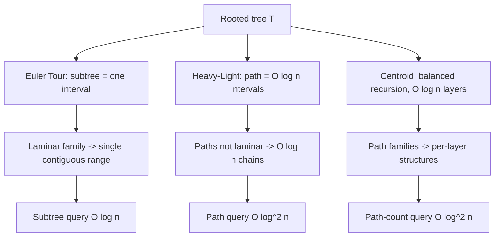

# Euler Tour Technique (Tree Flattening) — Mathematical Foundations and Complexity Theory

## Table of Contents

1. [Formal Definition](#1-formal-definition)
2. [Correctness Proof — Subtree-as-Interval](#2-correctness-proof--subtree-as-interval)
3. [Correctness Proof — Ancestor Test by Interval Containment](#3-correctness-proof--ancestor-test-by-interval-containment)
4. [The 2n Euler Tour and the LCA-as-RMQ Theorem](#4-the-2n-euler-tour-and-the-lca-as-rmq-theorem)
5. [Complexity — Build, Query, Update, Space](#5-complexity--build-query-update-space)
6. [Range-Mapping Correctness with Fenwick / Segment Trees](#6-range-mapping-correctness-with-fenwick--segment-trees)
7. [The ±1 RMQ Structure and O(1) LCA](#7-the-1-rmq-structure-and-o1-lca)
8. [Cache-Oblivious and External-Memory Analysis](#8-cache-oblivious-and-external-memory-analysis)
9. [Comparison with HLD and Centroid Decomposition](#9-comparison-with-hld-and-centroid-decomposition)
10. [Worked Trace and Invariant Verification](#10-worked-trace-and-invariant-verification)
11. [Reference Implementations](#11-reference-implementations)
12. [Summary](#12-summary)

---

## 1. Formal Definition

Let `T = (V, E)` be a tree with `|V| = n`, rooted at `r ∈ V`. The rooting induces a parent function `par : V \ {r} → V` and a descendant partial order `⪯`, where `u ⪯ v` means "`u` is in the subtree rooted at `v`" (equivalently, `v` lies on the path from `u` to `r`). For each `v`, let `sub(v) = { u ∈ V : u ⪯ v }` denote its subtree (including `v`).

**Definition 1.1 (DFS preorder timer).** Fix, for each vertex, a total order on its children (e.g. by id). A depth-first traversal from `r` maintains an integer counter `timer`, initialized to `0`. Define two functions `tin, tout : V → {0, …, n-1}` by the procedure:

```text
DFS(v):
    tin[v] ← timer ; timer ← timer + 1
    for each child c of v (in fixed order):
        DFS(c)
    tout[v] ← timer - 1
```

`tin[v]` is the **discovery time** (preorder index) of `v`, and `tout[v]` is the index of the last vertex discovered within `sub(v)`. Both functions are well-defined and computed in one traversal.

**Definition 1.2 (flattened array).** Define `order : {0,…,n-1} → V` by `order[tin[v]] = v`. Since each vertex receives a distinct `tin` in `{0,…,n-1}` (Lemma 2.1), `order` is a bijection: the **flattening** of `T`.

**Definition 1.3 (Euler sequence, `2n-1` form).** A separate traversal emits a sequence `E[0 .. 2n-2]`: append `v` when first entering it and again after returning from each child. With a parallel depth array `D[t] = depth(E[t])` and `first[v] = min{ t : E[t] = v }`, this is the substrate for LCA-as-RMQ (§4).

**Why `2n-1`.** A rooted tree has `n-1` edges; the `2n-1` Euler walk traverses each edge exactly twice (once descending, once ascending) and records a vertex at the start plus one after each of the `2(n-1)` edge-traversals' descents/ascents — but adjacent duplicates collapse so the total recorded length is `1 + 2(n-1) = 2n-1`. Each vertex `v` is recorded `deg_T(v)` times in the rooted sense (`1 + #children`), and `Σ_v (1 + children(v)) = n + (n-1) = 2n-1`. This count is what makes the LCA-by-RMQ window `[first[u], first[v]]` always contain the LCA (§4).

We prove that Definitions 1.1–1.2 make subtrees contiguous, that interval containment characterizes ancestry, and that Definition 1.3 reduces LCA to range-minimum.

---

## 2. Correctness Proof — Subtree-as-Interval

**Lemma 2.1 (distinctness).** `tin` is injective; its image is exactly `{0, 1, …, n-1}`.

**Proof.** `timer` increments exactly once per vertex (at the line `tin[v] ← timer`), and DFS on a tree visits each vertex exactly once. So `n` distinct values `0,…,n-1` are assigned, one per vertex. ∎

**Theorem 2.2 (subtree-as-interval).** For every `v ∈ V` and every `u ∈ V`,

```text
u ∈ sub(v)  ⟺  tin[v] ≤ tin[u] ≤ tout[v].
```

Consequently `{ tin[u] : u ∈ sub(v) } = { tin[v], tin[v]+1, …, tout[v] }` is a contiguous interval, and `|sub(v)| = tout[v] - tin[v] + 1`.

**Proof.** We prove a sharper structural claim by induction on the recursion, then read off the theorem.

*Claim.* When `DFS(v)` returns, `timer` has advanced by exactly `|sub(v)|` since `DFS(v)` was called, and every `u ∈ sub(v)` received a `tin[u]` with `tin[v] ≤ tin[u] ≤ tin[v] + |sub(v)| - 1`, while no `u ∉ sub(v)` received any `tin` during that call.

*Base case.* `v` a leaf: `sub(v) = {v}`. `DFS(v)` sets `tin[v] = timer`, increments once, makes no recursive call, and sets `tout[v] = tin[v]`. `timer` advanced by `1 = |sub(v)|`; the only stamp assigned is `tin[v]`, in the stated range. ✓

*Inductive step.* Let `v` have children `c_1, …, c_m` (in fixed order). `DFS(v)` first sets `tin[v] = t_0` (the value of `timer` on entry) and increments to `t_0 + 1`. It then calls `DFS(c_1), …, DFS(c_m)` in order. By the inductive hypothesis, `DFS(c_i)` advances `timer` by exactly `|sub(c_i)|` and stamps precisely the vertices of `sub(c_i)`, all *after* the stamps of `sub(c_1),…,sub(c_{i-1})` and after `tin[v]`. The subtrees `sub(c_1),…,sub(c_m)` partition `sub(v) \ {v}` (a defining property of a rooted tree: the descendants of `v` are exactly `v` plus the disjoint union of its children's subtrees). Hence, summing,

```text
total advance during DFS(v) = 1 + Σ_i |sub(c_i)| = 1 + (|sub(v)| - 1) = |sub(v)|,
```

and every stamp assigned during the call belongs to a vertex of `sub(v)`, contiguously filling `tin[v], tin[v]+1, …, tin[v] + |sub(v)| - 1`. No vertex outside `sub(v)` is stamped, because DFS does not leave `sub(v)` until `DFS(v)` returns. Finally `tout[v] = timer - 1 = tin[v] + |sub(v)| - 1`. This proves the Claim. ✓

*Reading off the theorem.* (⟸) If `tin[v] ≤ tin[u] ≤ tout[v]`, then `tin[u]` lies in the contiguous block of `sub(v)`'s stamps; since `tin` is injective (Lemma 2.1) and that block is *exactly* `{ tin[w] : w ∈ sub(v) }`, we get `u ∈ sub(v)`. (⟹) If `u ∈ sub(v)`, the Claim places `tin[u]` in `[tin[v], tout[v]]`. ∎

The crux is the partition step: a rooted tree's descendant set decomposes disjointly into the children's subtrees, and DFS visits them consecutively without interleaving — that consecutiveness is precisely what makes the interval contiguous.

---

## 3. Correctness Proof — Ancestor Test by Interval Containment

**Theorem 3.1 (ancestor test).** For `u, w ∈ V`, `u` is an ancestor of `w` (i.e. `w ∈ sub(u)`, allowing `u = w`) iff

```text
tin[u] ≤ tin[w]  ∧  tout[w] ≤ tout[u].
```

**Proof.** (⟹) Suppose `w ∈ sub(u)`. Then `sub(w) ⊆ sub(u)`. By Theorem 2.2, `tin[u] ≤ tin[w]`; and `tout[w] = tin[w] + |sub(w)| - 1` is the largest stamp in `sub(w)`, which lies in `sub(u)`'s interval, so `tout[w] ≤ tout[u]`.

(⟸) Suppose `tin[u] ≤ tin[w] ≤ tout[w] ≤ tout[u]` (the middle inequality `tin[w] ≤ tout[w]` always holds). Then `tin[w] ∈ [tin[u], tout[u]]`, so by Theorem 2.2 `w ∈ sub(u)`. ∎

**Corollary 3.2 (disjoint-or-nested).** For any `u, w`, the intervals `[tin[u], tout[u]]` and `[tin[w], tout[w]]` are either disjoint or one contains the other — they never partially overlap. (This is the *laminar family* property and the formal heart of the nested-set model.)

**Proof.** If they intersect, some stamp `t` lies in both, i.e. `order[t] ∈ sub(u) ∩ sub(w)`. In a rooted tree, two subtrees intersect only if one contains the other (their roots are comparable in `⪯`). The containing subtree's interval contains the other's by Theorem 3.1. ∎

The laminar/nested structure is exactly why a contiguous-range index is correct: subtrees form a laminar family, and the Euler tour realizes that family as a set of nested intervals on the line.

---

## 4. The 2n Euler Tour and the LCA-as-RMQ Theorem

**Definition 4.1.** Let `E[0..2n-2]`, `D[t] = depth(E[t])`, and `first[v]` be as in Definition 1.3. For `t < t'`, write `RMQ_D(t, t') = argmin_{t ≤ s ≤ t'} D[s]` (ties broken arbitrarily; all minimizers correspond to the same vertex, see below).

**Theorem 4.2 (LCA as range-minimum).** For any `u, v ∈ V` with (WLOG) `first[u] ≤ first[v]`,

```text
LCA(u, v) = E[ RMQ_D( first[u], first[v] ) ].
```

**Proof.** Let `a = LCA(u, v)`. The Euler tour, between the first visit of `u` and the first visit of `v`, is a contiguous walk in `T`. Any walk from `u` to `v` in a tree passes through `a` (the unique meeting point of the `u→r` and `v→r` paths), so `a = E[s]` for some `s ∈ [first[u], first[v]]`. Thus `min_{s} D[s] ≤ depth(a)`.

Conversely, every vertex `x = E[s]` with `s ∈ [first[u], first[v]]` is visited during the tour segment that descends from and returns to vertices on the `u`-to-`v` route; such `x` lies in `sub(a)` (the tour cannot leave `sub(a)` between the first visits of two vertices both in `sub(a)` without first returning to `a`). Hence `depth(x) ≥ depth(a)` for all such `x`, so `min_s D[s] = depth(a)`, attained exactly at occurrences of `a`. Therefore the argmin vertex is `a`. ∎

A subtle but important property used above:

**Lemma 4.3 (adjacent depths differ by ±1).** For consecutive Euler positions, `|D[t+1] - D[t]| = 1`.

**Proof.** Each step of the `2n-1` Euler tour moves to a parent or a child (DFS only descends one edge or ascends one edge between consecutive recorded vertices), changing depth by exactly `1`. ∎

The ±1 property (Lemma 4.3) is what enables the **`⟨O(n), O(1)⟩`** RMQ of Bender–Farach-Colton (§7), giving `O(1)` LCA after `O(n)` preprocessing — better than a general sparse table's `O(n log n)`.

---

## 5. Complexity — Build, Query, Update, Space

**Build.** One DFS visits each vertex once and each edge twice (down and up); assigning `tin/tout` is `O(1)` per vertex:

```text
T_build(n) = Θ(n).
```

The `2n-1` Euler sequence and depth array are also `Θ(n)`. Building a Fenwick or segment tree over the flat array is `Θ(n)`. A sparse table for RMQ is `Θ(n log n)` time and space; the ±1 RMQ structure is `Θ(n)`.

**Query / update (with auxiliary structure).** A subtree query/update maps to a range operation on `[tin[v], tout[v]]`:

| Structure | Subtree query | Subtree/point update |
|-----------|---------------|----------------------|
| Fenwick (point upd, range sum) | `Θ(log n)` | `Θ(log n)` |
| Lazy segment tree (range upd, range query) | `Θ(log n)` | `Θ(log n)` |
| Sparse table RMQ (LCA) | `Θ(1)` | static only |
| ±1 RMQ (LCA) | `Θ(1)` | static only |

**Ancestor test, subtree size:** `Θ(1)` (two comparisons; `tout - tin + 1`).

**Space.** `tin`, `tout`, `order`: `Θ(n)`. Fenwick/segtree: `Θ(n)`. Euler `2n-1` + depth: `Θ(n)`. Sparse-table RMQ: `Θ(n log n)`. Total `Θ(n)` for the pure subtree machinery, `Θ(n log n)` if a sparse-table LCA is included.

**No data-dependent speedup.** The build is `Θ(n)` regardless of tree shape; the per-query cost is `Θ(log n)` regardless of subtree size — the reduction's whole point is to decouple query cost from `|sub(v)|`.

### 5.1 Lower bound — why `Θ(log n)` per subtree update is essentially optimal here

Could we do subtree-sum-with-updates in `o(log n)` per operation? In the cell-probe / RAM model with `Θ(\log n)`-bit words, the dynamic prefix-sum problem (point update, prefix query) has a tight `Θ(\log n / \log\log n)` lower bound (Pătrașcu–Demaine), and the standard Fenwick achieves `Θ(\log n)`. Because the Euler tour reduces subtree-sum to a *range* sum (a difference of two prefix sums), the same lower bound applies: an algorithm answering interleaved subtree updates and queries faster than `Θ(\log n / \log\log n)` would solve dynamic prefix-sum faster, contradicting the bound. So up to a `\log\log n` factor, the `Θ(\log n)` Fenwick is optimal, and the `Θ(n)` flatten cost is unavoidable since every node must be assigned a timestamp.

### 5.2 The `Θ(n)` build is also a lower bound

Any correct flattening must read every edge at least once (a tree with an unread edge is indistinguishable from one with that edge contracted, which changes subtree membership), so `Ω(n)` is a build lower bound; the DFS matches it. Likewise, producing `tin/tout` for all `n` nodes is `Ω(n)` output. Hence `Θ(n)` build is tight in both the read and write senses.

---

## 6. Range-Mapping Correctness with Fenwick / Segment Trees

The reduction's validity hinges on the range mapping being a *faithful* homomorphism between subtree operations and array-range operations. Make this precise.

**Setup.** Let `val : V → M` be node values in a commutative monoid `(M, ⊕, 0̄)` (e.g. `(ℤ, +, 0)` for sums, `(ℝ∪{∞}, min, ∞)` for minima). Define the flat array `A[ tin[v] ] = val(v)`.

**Proposition 6.1 (subtree aggregate = range aggregate).** For every `v`,

```text
⊕_{u ∈ sub(v)} val(u)  =  ⊕_{t = tin[v]}^{tout[v]} A[t].
```

**Proof.** By Theorem 2.2, `{ tin[u] : u ∈ sub(v) } = {tin[v], …, tout[v]}` is exactly the index set of the range. Since `A[tin[u]] = val(u)` and `tin` is a bijection on these indices, the two `⊕`-folds range over the same multiset of monoid elements; commutativity and associativity of `⊕` make the order irrelevant. ∎

**Corollary 6.2 (correctness of the BIT subtree sum).** With `(M,⊕) = (ℤ, +)`, a Fenwick tree over `A` answers `subtreeSum(v) = prefix(tout[v]) − prefix(tin[v]−1)` correctly, because `+` admits inverses (the prefix-difference trick), in `Θ(log n)`.

**Remark 6.3 (why min needs a segment tree, not a BIT).** `min` has no inverse, so the prefix-difference trick fails; subtree *min* requires a segment tree (or sparse table) supporting non-invertible range queries. This is the formal reason the auxiliary structure depends on the monoid: invertible (`+`, XOR) → Fenwick suffices; non-invertible (`min`, `max`, `gcd`) → segment tree.

**Proposition 6.4 (subtree range-update correctness).** Adding `δ` to every node of `sub(v)` equals adding `δ` to every cell of `A[tin[v] .. tout[v]]`. With a lazy segment tree (or the two-BIT range-add/range-sum construction), this is `Θ(log n)` and preserves Proposition 6.1's identity. **Proof.** Immediate from Theorem 2.2: the affected index set is exactly the contiguous range. ∎

---

## 7. The ±1 RMQ Structure and O(1) LCA

By Theorem 4.2, LCA reduces to RMQ on the depth array `D`; by Lemma 4.3, consecutive entries of `D` differ by exactly `±1`. This special structure admits an optimal `⟨Θ(n), Θ(1)⟩` RMQ (Bender–Farach-Colton 2000), beating the general sparse table's `Θ(n log n)` preprocessing.

**Construction (sketch).** Partition `D` (length `2n-1`) into blocks of size `b = ½ log₂(2n-1)`.

1. **Between blocks.** Compute the block minima (one value per block) and build a sparse table over them: `Θ((m/b) log(m/b)) = Θ(n)` since `m/b = Θ(n / log n)`.
2. **Within a block.** Because each block's `±1` shape is determined by its `b-1` sign bits, there are only `2^{b-1} = Θ(√n)` distinct block shapes. Precompute the answer to *every* in-block `RMQ(i,j)` for each of the `Θ(√n)` shapes: `Θ(√n · b²) = o(n)` total. Each query indexes into the precomputed table by the block's shape bitmask.
3. **A query** spanning positions `t ≤ t'` decomposes into a suffix of one block, a sparse-table query over whole blocks between, and a prefix of another block — three `Θ(1)` lookups.

**Theorem 7.1.** With the ±1 RMQ over `D`, `LCA(u, v)` is answered in `Θ(1)` after `Θ(n)` preprocessing and `Θ(n)` space.

**Proof.** Correctness is Theorem 4.2; the `Θ(1)`/`Θ(n)` bounds are the construction above (each query is three `Θ(1)` table lookups; the tables are `Θ(n)`). ∎

This is the asymptotically optimal LCA result, and the Euler tour is the device that converts the tree-LCA problem into the array-RMQ problem its construction needs.

---

## 8. Cache-Oblivious and External-Memory Analysis

In the external-memory (I/O) model with block size `B`, the Euler tour's flat array gives **range queries excellent locality**: a subtree-sum range scan (if done directly) touches `Θ(⌈|sub(v)|/B⌉)` blocks — optimal — versus a pointer-chasing DFS over the tree, which can incur `Θ(|sub(v)|)` cache misses in the worst case (one per node, since tree nodes are scattered in memory).

**Proposition 8.1.** A direct subtree aggregate over the flat array costs `Θ(⌈|sub(v)|/B⌉)` I/Os; a Fenwick/segment-tree subtree query costs `Θ(log n)` random-ish accesses, but along contiguous paths in the BIT/segtree, with good constant locality near the leaves.

The deeper point: **flattening converts the tree's irregular memory layout into a linear one**, so the cost model shifts from "one cache miss per visited node" to "one block read per `B` consecutive cells." This is the same reason the nested-set model outperforms recursive descent in databases — a `BETWEEN lft AND rgt` range scan reads sequential index pages, while recursion issues random I/Os.

For the LCA RMQ, the sparse table is `Θ(log n)` random reads; the ±1 block structure improves locality (block minima are contiguous). Cache-oblivious RMQ layouts (van Emde Boas) push block-level RMQ to `Θ(1 + |query|/B)` I/Os, but for LCA the query length is `Θ(1)` blocks so the gain is in the constant.

### 8.1 Why the Fenwick query stays cheap in the I/O model

A Fenwick subtree-sum touches `Θ(\log n)` cells whose indices follow the lowbit recurrence `j → j - (j \& -j)`. These indices are *not* contiguous, so a naive layout pays `Θ(\log n)` cache misses per query. However, the accessed indices form a strictly decreasing chain dominated by the binary representation of the endpoint, and in practice the lower-order BIT cells (near the leaves, accessed first) exhibit strong temporal locality across nearby queries — a workload that repeatedly queries subtrees of sibling nodes reuses the same low-index BIT cells. A blocked/`van Emde Boas` BIT layout can bring the worst-case to `Θ(\log_B n)` I/Os, matching the B-tree bound, though the plain array Fenwick is usually fast enough that this optimization is rarely needed.

### 8.2 Comparison to pointer-based tree traversal

The headline locality argument bears repeating precisely. A pointer-chasing subtree DFS visits `|sub(v)|` nodes, each a separate heap object; in the worst case (nodes scattered by the allocator) that is `Θ(|sub(v)|)` cache misses. The flattened range scan reads `Θ(\lceil |sub(v)|/B \rceil)` cache lines — a factor-`B` improvement (typically `B = 8`–`16` for 4–8-byte values on a 64-byte line). This is *exactly* the asymptotic and constant-factor reason the nested-set model (Euler tour in SQL) outperforms recursive descent on read-heavy hierarchies, and it is why flattening is worthwhile even when both approaches are asymptotically `Θ(n)` in work: the I/O term, not the work term, dominates wall-clock for large subtrees.

---

## 9. Comparison with HLD and Centroid Decomposition

The Euler tour is one of three canonical tree-decomposition reductions. Their formal contrasts:

| Property | Euler Tour (ETT) | Heavy-Light Decomposition | Centroid Decomposition |
|----------|------------------|---------------------------|------------------------|
| What it makes contiguous | each **subtree** | each root→node **path** (`O(log n)` chains) | recursion over **balanced halves** |
| Preprocess | `Θ(n)` | `Θ(n)` | `Θ(n log n)` |
| Subtree query | `Θ(log n)` | `Θ(log n)` (subtree still contiguous) | not natural |
| Path query | needs LCA split / Conv. B | `Θ(log² n)` | `Θ(log² n)` per centroid layer |
| Depth of decomposition | — | `O(log n)` chains per path | `O(log n)` centroid layers |
| Best for | subtree aggregates, ancestor tests, LCA | path aggregates **and** subtree | path counting/distance problems offline |
| Invariant proved | subtree = interval (§2) | any path crosses `O(log n)` heavy chains | removing a centroid leaves parts `≤ n/2` |

**Theorem 9.1 (HLD chain bound, for contrast).** In HLD, any root-to-node path crosses `O(log n)` light edges, hence `O(log n)` chains. **Proof idea.** Each light edge `v→child c` has `size(c) ≤ size(v)/2` (else `c` would be the heavy child), so descending a light edge at least halves the subtree size; this can happen at most `log₂ n` times. ∎

The key formal distinction: **ETT linearizes *subtrees*; HLD linearizes *paths*; centroid decomposition linearizes *balanced recursion*.** ETT is the lightest and the only one whose core invariant (subtree = interval) is a single, clean statement provable by one induction.


 When subtrees are the unit of work, ETT is optimal in both simplicity and constant factor; the others pay for capabilities ETT does not provide (paths, balanced splits).

Because subtrees form a **laminar family** (Corollary 3.2) while paths do not, only the Euler tour can render *every* query region as a single interval — HLD must split a path into `O(log n)` intervals precisely because paths are not laminar.

### 9.1 A formal note on combining the three

The decompositions are not mutually exclusive; they compose. A common professional construction is **HLD over a heavy-first DFS order**, which simultaneously yields (a) ETT subtree ranges (because heavy-first DFS still places each subtree contiguously — the heavy-first ordering only reorders *children*, not the contiguity of descendants, so Theorem 2.2 still holds), and (b) HLD chains as contiguous ranges. The single base array then serves subtree queries in `Θ(\log n)` and path queries in `Θ(\log^2 n)` from one segment tree. Centroid decomposition, by contrast, does *not* compose with a single linear order — its recursion partitions the vertex set differently at each level — so it maintains `Θ(\log n)` separate structures (one per centroid layer), trading the single-array elegance of ETT/HLD for the ability to answer path-counting queries that neither subtree- nor chain-linearization handles directly.

### 9.2 Quantifying the regime choice

For concreteness, take `n = 10^6` with `q = 10^6` mixed queries. Pure ETT + Fenwick: build `≈ 10^6` ops, each query `≈ 20` BIT steps → `≈ 2·10^7` step-equivalents, dominated by cache behavior. Adding HLD for a path-heavy mix raises each path query to `≈ 20·20 = 400` step-equivalents (`\log^2 n`), a 20× per-query penalty — justified only if paths are a meaningful fraction of the workload. Centroid decomposition's `Θ(n \log n)` build (`≈ 2·10^7`) and `Θ(\log^2 n)` queries are comparable to HLD asymptotically but carry a larger constant and only pay off for problems (e.g. "count paths of length ≤ L through any vertex") that resist linearization entirely. The professional decision rule: **linearize with ETT if subtrees suffice; add HLD if paths appear; reach for centroid decomposition only when the query is inherently about path *families*, not single paths or subtrees.**

---

## 10. Worked Trace and Invariant Verification

Take the running tree (root `0`, labels in parentheses are 1-indexed names):

```text
            0 (1)
          /  |  \
        1(2) 2(3) 3(4)
       /  \         \
     4(5)  5(6)      6(7)
```

DFS in increasing child order, `timer` from `0`:

| event | vertex | timer before | tin | tout |
|-------|--------|--------------|-----|------|
| enter | 0 | 0 | 0 | |
| enter | 1 | 1 | 1 | |
| enter | 4 | 2 | 2 | 2 |
| enter | 5 | 3 | 3 | 3 |
| leave | 1 | 4 | | 3 |
| enter | 2 | 4 | 4 | 4 |
| enter | 3 | 5 | 5 | |
| enter | 6 | 6 | 6 | 6 |
| leave | 3 | 7 | | 6 |
| leave | 0 | 7 | | 6 |

Final:

| vertex | 0 | 1 | 2 | 3 | 4 | 5 | 6 |
|--------|---|---|---|---|---|---|---|
| `tin`  | 0 | 1 | 4 | 5 | 2 | 3 | 6 |
| `tout` | 6 | 3 | 4 | 6 | 2 | 3 | 6 |

`order = [0, 1, 4, 5, 2, 3, 6]`.

**Verify Theorem 2.2.** `sub(1) = {1,4,5}`, interval `[1,3]` → `order[1..3] = [1,4,5]`. ✓ `|sub(1)| = 3 = tout[1]-tin[1]+1`. ✓

**Verify Theorem 3.1.** Is `1` an ancestor of `5`? `tin[1]=1 ≤ tin[5]=3` and `tout[5]=3 ≤ tout[1]=3` → yes. ✓ Is `1` an ancestor of `6`? `tin[1]=1 ≤ tin[6]=6` but `tout[6]=6 ≤ tout[1]=3` is false → no. ✓

**Verify Corollary 3.2 (laminar).** `[tin[1],tout[1]]=[1,3]` and `[tin[3],tout[3]]=[5,6]` are disjoint; `[1,3]` is nested inside `[0,6]=[tin[0],tout[0]]`. No partial overlap anywhere. ✓

**Euler `2n-1` for LCA.** Enter + return:

```text
E    = [0, 1, 4, 1, 5, 1, 0, 2, 0, 3, 6, 3, 0]   (length 13 = 2·7-1)
depth= [0, 1, 2, 1, 2, 1, 0, 1, 0, 1, 2, 1, 0]
first= {0:0, 1:1, 2:7, 3:9, 4:2, 5:4, 6:10}
```

**Verify Theorem 4.2.** `LCA(4, 5)`: `first[4]=2`, `first[5]=4`; `RMQ_D(2,4)` over `depth[2..4]=[2,1,2]` → min at index `3`, `E[3]=1`. So `LCA(5,6 by name)=2 by name` (vertex `1`). ✓ `LCA(4, 6)`: `first[4]=2`, `first[6]=10`; `depth[2..10]=[2,1,2,1,0,1,0,1,2]` → min `0` at index `6` (or `8`), `E[6]=0`. LCA is the root. ✓

**Verify Lemma 4.3 (±1).** Consecutive depths: `0,1,2,1,2,1,0,1,0,1,2,1,0` — every adjacent pair differs by exactly `1`. ✓ This confirms the ±1 RMQ structure (§7) applies.

**Verify Proposition 6.1 (aggregate homomorphism).** Let `val = [10,20,30,40,50,60,70]` by node id. The flat array indexed by `tin` is `flat = [val[order[t]]]` for `t=0..6`, i.e. `order = [0,1,4,5,2,3,6]` gives `flat = [10,20,50,60,30,40,70]`. Subtree of node `1` is `[1,3]`, so the range sum is `20+50+60 = 130`. The direct subtree sum `val[1]+val[4]+val[5] = 20+50+60 = 130`. ✓ The two agree, confirming the monoid homomorphism on `(ℤ,+)`.

**Verify the Fenwick prefix-difference.** Building a Fenwick over `flat`, `prefix(3) = 10+20+50+60 = 140` and `prefix(0) = 10`, so `subtreeSum(1) = prefix(tout[1]) - prefix(tin[1]-1) = prefix(3) - prefix(0) = 140 - 10 = 130`. ✓ This is the invertibility of `+` (Corollary 6.2) in action — `min` could not be recovered this way.

**Verify subtree count.** `|sub(1)| = tout[1]-tin[1]+1 = 3-1+1 = 3 = |{1,4,5}|`. ✓ `|sub(0)| = 6-0+1 = 7 = n`. ✓

---

## 10.5 The Dynamic Generalization — Euler-Tour Trees (formal)

The static flattening assumes a fixed shape. The **Euler-Tour Tree** (Henzinger–King 1995, Tarjan) generalizes it to a *dynamic* forest supporting `link(u,v)`, `cut(u,v)`, and connectivity/subtree-aggregate queries, each in `O(log n)` amortized.

**Construction.** Represent the Euler tour of each tree as a sequence and store that sequence in a balanced BST (a treap or a splay tree) keyed by position, *not* by value — the BST is an *order-statistics* structure over the Euler sequence. Each vertex `v` keeps pointers to its occurrence nodes in the BST.

**`link(u, v)`** (join trees `T_u`, `T_v` by edge `u–v`): splice `T_v`'s Euler tour, rotated to start at `v`, into `T_u`'s tour right after an occurrence of `u`. With BST `split`/`join`, this is `O(log n)`.

**`cut(u, v)`** (remove edge `u–v`): the subtree hanging below the edge corresponds to a *contiguous* sub-interval of the Euler sequence (the same subtree-as-interval property, Theorem 2.2, now realized in the BST); `split` it out into its own tree in `O(log n)`.

**Subtree aggregate.** Because a subtree is still a contiguous Euler-sequence interval, augmenting each BST node with a subtree-aggregate (sum/min) lets a subtree query be answered by splitting out the interval and reading its root's aggregate — `O(log n)`.

**Theorem 10.1.** Euler-Tour Trees support `link`, `cut`, connectivity, and subtree-aggregate in `O(log n)` per operation on a forest of `n` vertices.

**Proof idea.** Each operation reduces to a constant number of BST `split`/`join`s on a sequence of length `O(n)`, each `O(log n)` in a balanced BST; the subtree-as-interval property guarantees the affected region is always one contiguous interval, so a constant number of splits isolates it. ∎

This is the principled answer to "what replaces ETT when the shape changes": keep the Euler sequence, drop the flat array, store the sequence in a balanced BST. The static `tin/tout` array is the *materialized* special case where the shape never changes and the sequence can be a plain array with a Fenwick on top. The contrast with Link-Cut Trees: ETTs excel at **subtree** aggregates (the laminar interval property), while Link-Cut Trees excel at **path** aggregates (preferred-path decomposition) — the same subtree-vs-path duality as ETT-vs-HLD, lifted to the dynamic setting.

---

## 11. Reference Implementations

Code order is Go, Java, Python. Each targets the `Θ(n)` flatten with the proven range-mapping.

### 11.1 Go — iterative DFS flatten (no recursion-depth limit) + subtree range

```go
package main

import "fmt"

// flatten computes tin/tout iteratively, safe for deep (near-chain) trees.
func flatten(adj [][]int, root int) (tin, tout []int) {
	n := len(adj)
	tin = make([]int, n)
	tout = make([]int, n)
	timer := 0
	type frame struct{ v, parent, ci int } // ci = next child index
	stack := []frame{{root, -1, 0}}
	tin[root] = timer
	timer++
	for len(stack) > 0 {
		f := &stack[len(stack)-1]
		advanced := false
		for f.ci < len(adj[f.v]) {
			c := adj[f.v][f.ci]
			f.ci++
			if c != f.parent {
				tin[c] = timer
				timer++
				stack = append(stack, frame{c, f.v, 0})
				advanced = true
				break
			}
		}
		if !advanced {
			tout[f.v] = timer - 1 // all children done: close the interval
			stack = stack[:len(stack)-1]
		}
	}
	return
}

func main() {
	adj := [][]int{{1, 2, 3}, {0, 4, 5}, {0}, {0, 6}, {1}, {1}, {3}}
	tin, tout := flatten(adj, 0)
	fmt.Println("tin :", tin)  // [0 1 4 5 2 3 6]
	fmt.Println("tout:", tout) // [6 3 4 6 2 3 6]
	// subtree of node 1 = [tin[1], tout[1]] = [1,3]
	fmt.Printf("subtree(1) = [%d,%d], size %d\n", tin[1], tout[1], tout[1]-tin[1]+1)
}
```

### 11.2 Java — Euler tour + sparse-table RMQ for O(1) LCA

```java
import java.util.*;

public final class LcaEulerRmq {
    int[] euler, depthAt, first, depth;
    int[][] st; int[] logT; int idx = 0;
    List<List<Integer>> adj;

    LcaEulerRmq(int n, List<List<Integer>> adj, int root) {
        this.adj = adj;
        int m = 2 * n - 1;
        euler = new int[m]; depthAt = new int[m];
        first = new int[n]; depth = new int[n];
        Arrays.fill(first, -1);
        dfs(root, -1, 0);
        buildSparse(m);
    }

    void dfs(int v, int p, int d) {
        depth[v] = d;
        if (first[v] == -1) first[v] = idx;
        euler[idx] = v; depthAt[idx] = d; idx++;
        for (int c : adj.get(v)) if (c != p) {
            dfs(c, v, d + 1);
            euler[idx] = v; depthAt[idx] = d; idx++; // re-append on return
        }
    }

    void buildSparse(int m) {
        logT = new int[m + 1];
        for (int i = 2; i <= m; i++) logT[i] = logT[i / 2] + 1;
        int K = logT[m] + 1;
        st = new int[K][];
        st[0] = new int[m];
        for (int i = 0; i < m; i++) st[0][i] = i;
        for (int k = 1; k < K; k++) {
            st[k] = new int[m - (1 << k) + 1];
            for (int i = 0; i + (1 << k) <= m; i++) {
                int a = st[k - 1][i], b = st[k - 1][i + (1 << (k - 1))];
                st[k][i] = (depthAt[a] <= depthAt[b]) ? a : b;
            }
        }
    }

    int lca(int u, int v) {
        int l = first[u], r = first[v];
        if (l > r) { int t = l; l = r; r = t; }
        int k = logT[r - l + 1];
        int a = st[k][l], b = st[k][r - (1 << k) + 1];
        int idxMin = (depthAt[a] <= depthAt[b]) ? a : b;
        return euler[idxMin];
    }

    public static void main(String[] args) {
        int n = 7;
        List<List<Integer>> adj = new ArrayList<>();
        for (int i = 0; i < n; i++) adj.add(new ArrayList<>());
        int[][] e = {{0,1},{0,2},{0,3},{1,4},{1,5},{3,6}};
        for (int[] x : e) { adj.get(x[0]).add(x[1]); adj.get(x[1]).add(x[0]); }
        LcaEulerRmq t = new LcaEulerRmq(n, adj, 0);
        System.out.println("LCA(4,5)=" + t.lca(4, 5)); // 1
        System.out.println("LCA(4,6)=" + t.lca(4, 6)); // 0
    }
}
```

### 11.3 Python — laminar-family / nested-set verification

```python
import sys
sys.setrecursionlimit(1_000_000)


def flatten(adj, root):
    n = len(adj)
    tin = [0] * n
    tout = [0] * n
    timer = 0

    def dfs(v, p):
        nonlocal timer
        tin[v] = timer
        timer += 1
        for c in adj[v]:
            if c != p:
                dfs(c, v)
        tout[v] = timer - 1

    dfs(root, -1)
    return tin, tout


def laminar_ok(tin, tout):
    """Verify Corollary 3.2: every pair of subtree intervals is disjoint or nested,
    never partially overlapping. O(n^2) check for small n / testing."""
    n = len(tin)
    iv = [(tin[i], tout[i]) for i in range(n)]
    for i in range(n):
        a, b = iv[i]
        for j in range(n):
            c, d = iv[j]
            # partial overlap = a <= c <= b < d  (or symmetric)
            if a <= c <= b < d or c <= a <= d < b:
                return False
    return True


if __name__ == "__main__":
    adj = [[1, 2, 3], [0, 4, 5], [0], [0, 6], [1], [1], [3]]
    tin, tout = flatten(adj, 0)
    print("tin :", tin)
    print("tout:", tout)
    print("laminar (disjoint-or-nested)?", laminar_ok(tin, tout))  # True
    # nested-set style descendant query: descendants of node 1
    desc = [v for v in range(len(tin)) if tin[1] <= tin[v] <= tout[1]]
    print("descendants of 1 (incl self):", desc)  # [1, 4, 5]
```

---

## 12. Summary

- **Definition.** A DFS preorder timer assigns `tin[v]` (discovery) and `tout[v]` (last discovery in `sub(v)`); the flat array `order[tin[v]] = v` linearizes the tree.
- **Subtree-as-interval (Thm 2.2).** `u ∈ sub(v) ⟺ tin[v] ≤ tin[u] ≤ tout[v]`, proved by induction on the recursion using the disjoint partition of descendants into children's subtrees. Hence `|sub(v)| = tout[v]-tin[v]+1`.
- **Ancestry & laminarity (Thm 3.1, Cor 3.2).** Ancestry is interval containment; subtree intervals form a **laminar family** (disjoint or nested), which is *why* a single contiguous range is always correct for subtrees — and why paths (non-laminar) need HLD's `O(log n)` intervals.
- **LCA = RMQ (Thm 4.2).** Over the `2n-1` Euler tour, `LCA(u,v) = E[argmin depth in [first[u], first[v]]]`; consecutive depths differ by ±1 (Lemma 4.3), enabling the optimal `⟨Θ(n), Θ(1)⟩` ±1 RMQ (Thm 7.1) for `O(1)` LCA.
- **Range-mapping correctness (Prop 6.1, 6.4).** Subtree aggregates equal array-range aggregates over any commutative monoid; invertible monoids (`+`) use a Fenwick (prefix differences), non-invertible (`min`) need a segment tree.
- **Complexity.** `Θ(n)` build, `Θ(log n)` subtree query/update, `Θ(1)` ancestor test and LCA (±1 RMQ), `Θ(n)` space (`Θ(n log n)` with a sparse-table LCA).
- **Locality.** Flattening converts scattered tree memory into a linear layout, turning "one cache miss per node" into "one block per `B` cells" — the formal basis of nested-set efficiency in databases.
- **Comparison.** ETT linearizes subtrees (laminar, one interval); HLD linearizes paths (`O(log n)` intervals); centroid decomposition linearizes balanced recursion. ETT is the lightest, with a single clean invariant.

CLRS Ch. 22 (DFS discovery/finish times) introduces the timestamp idea; Bender & Farach-Colton (2000), "The LCA Problem Revisited," gives the Euler-tour + ±1 RMQ for optimal LCA; Celko's *Trees and Hierarchies in SQL* is the nested-set (Euler tour) treatment for databases; Sleator–Tarjan and Henzinger–King cover the dynamic generalizations (Link-Cut and Euler-Tour Trees).

---

**Next step:** Continue to [`interview.md`](./interview.md) for tiered Euler-tour interview questions and a full coding challenge in Go, Java, and Python.
