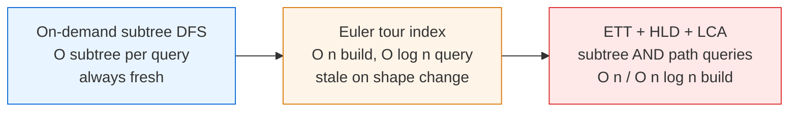
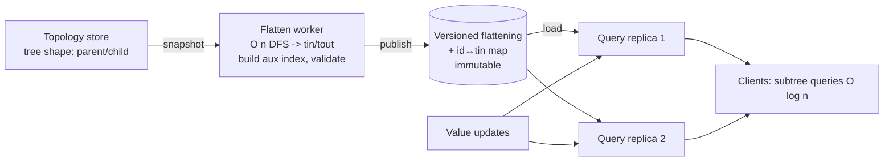
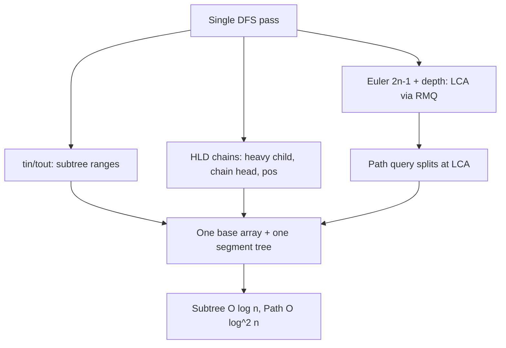

# Euler Tour Technique (Tree Flattening) — Senior Level

> The Euler tour is rarely the bottleneck on a textbook 1,000-node tree. But the moment a flattened tree becomes the index backing a permissions service, an org-chart roll-up, or a comment-thread aggregation, every property — the `O(n)` rebuild on shape change, the `O(n)` flat footprint, the strict "subtree = contiguous range" coupling between the DFS order and the auxiliary index — becomes a capacity-planning and operational concern.

## Table of Contents

1. [Introduction](#1-introduction)
2. [System Design with Flattened Trees](#2-system-design-with-flattened-trees)
3. [Combining ETT with LCA and Heavy-Light Decomposition](#3-combining-ett-with-lca-and-heavy-light-decomposition)
4. [Rebuild Costs and Incremental Maintenance](#4-rebuild-costs-and-incremental-maintenance)
5. [Concurrency](#5-concurrency)
6. [Comparison at Scale](#6-comparison-at-scale)
7. [Architecture Patterns](#7-architecture-patterns)
8. [Code Examples](#8-code-examples)
9. [Observability](#9-observability)
10. [Failure Modes](#10-failure-modes)
11. [Capacity Planning](#11-capacity-planning)
12. [Summary](#12-summary)

---

## 1. Introduction

At the senior level the question is no longer "how do I assign `tin/tout`" but "where does a flattened tree belong in my system, and what breaks when it does?" The Euler tour produces a dense `O(n)` artifact — `tin`, `tout`, the flat value array, and an auxiliary Fenwick/segment tree — in a single `O(n)` DFS. That description alone tells you three things:

- It is a **precomputed index** over a tree whose **shape is assumed stable**.
- Its correctness rests on a **tight coupling**: the auxiliary structure is indexed by DFS *time*, so any change to the DFS order (re-root, re-parent, insert a subtree) invalidates the entire index.
- Subtree operations become `O(log n)` array operations — extremely cheap to serve — but a **shape change is an `O(n)` rebuild**, not an `O(log n)` patch.

The interesting senior decisions are therefore architectural:

1. Should subtree aggregates be precomputed via an Euler tour, or computed on demand by a bounded DFS?
2. How do you combine ETT (subtree ranges) with LCA and HLD (path queries) so one index serves both subtree and path workloads?
3. How do you bound and amortize the `O(n)` rebuild when the tree's shape *does* change?
4. How do you serve subtree queries concurrently and update them safely?
5. How do you observe an index whose freshness silently decouples from the underlying tree on every reparent?

---

## 2. System Design with Flattened Trees

### 2.1 Where flattened trees show up in real systems

The "static-shape rooted tree with heavy subtree queries" pattern is everywhere once you look:

- **Org-chart roll-ups.** "Total headcount / spend under this manager" is a subtree sum; the reporting tree changes shape rarely (reorgs), but is queried constantly.
- **Permission / ACL inheritance.** A file system or document tree where "does this principal have access to everything under folder X?" is an ancestor/subtree question.
- **Category / taxonomy aggregation.** "How many products are in this category and all its sub-categories?" is a subtree count.
- **Comment-thread or nested-set aggregation.** The classic *nested set model* in SQL is exactly Convention A: `lft`/`rgt` columns are `tin`/`tout`, and "all descendants" is a `WHERE lft BETWEEN parent.lft AND parent.rgt` range scan.
- **Dependency / build trees.** "Rebuild everything downstream of this target" is a subtree.

The nested-set model in relational databases is the most widespread production instance of the Euler tour technique, even though practitioners rarely call it that.

In the nested-set model, each row carries `lft` and `rgt` columns (the `tin`/`tout` stamps). "All descendants of node X" is `SELECT * FROM tree WHERE lft BETWEEN X.lft AND X.rgt`, which a B-tree index on `lft` answers as a contiguous range scan. "Is X an ancestor of Y" is `X.lft <= Y.lft AND Y.rgt <= X.rgt`. Subtree node count is `(rgt - lft - 1) / 2` (because each node contributes two stamps in the classic `2n` numbering). The cost mirrors the in-memory version exactly: reads are fast index range scans, but **any structural change renumbers a range of `lft`/`rgt` values** — an `O(n)` write in the worst case (inserting a node near the root shifts every stamp after it). This is precisely the ETT shape-change cliff, manifested as a bulk `UPDATE`. Systems that need cheap structural writes use the *adjacency-list* or *closure-table* models instead, trading read speed for write agility — the database analogue of choosing an Euler-Tour Tree over a static flattening.

### 2.2 Precompute vs on-demand



| Approach | When right | When wrong |
|----------|-----------|------------|
| On-demand subtree DFS | Few queries, tree small or changing constantly. | Many subtree queries per second; per-query `O(subtree)` dominates. |
| Euler tour + Fenwick/segtree | Many subtree queries, static-shape tree, value updates fine. | Shape changes every few seconds; `O(n)` rebuilds pile up. |
| ETT + HLD (path) + LCA | Mixed subtree **and** path workload on a static tree. | Subtree-only workload — HLD is overkill. |
| Euler-Tour Tree (BBST over Euler seq) | Shape changes frequently (link/cut). | Static tree — needless complexity and constant-factor cost. |

The most expensive mistake is precomputing an Euler index over a tree that reparents constantly: you pay `O(n)` rebuilds repeatedly and serve stale ranges between rebuilds.

### 2.3 Anatomy of a subtree-aggregation service

A production subtree-aggregation service decomposes into three decoupled stages, mirroring the build/serve split of any precomputed index:

1. **Topology store.** The source of truth for the tree's *shape* (parent/child edges). It owns what the tree *is*; it does not compute aggregates. Org systems, ACL stores, and category catalogs each have one.
2. **Flatten worker.** A job that reads a consistent snapshot of the shape, runs the `O(n)` DFS to produce `tin`, `tout`, and the flat ordering, builds the auxiliary index, validates it (every node mapped, ranges nested correctly), and publishes a **versioned immutable artifact** (the flattening + a node-id↔`tin` mapping).
3. **Query layer.** A stateless, horizontally-scalable read tier that loads the current flattening and a Fenwick/segment tree of *values*, answering `subtreeSum(v)` / `subtreeUpdate(v)` in `O(log n)`.



The key property: **flatten (shape) and value-serve are separated.** A reparent triggers a re-flatten (a new artifact version); pure value changes go straight to the live Fenwick/segtree without re-flattening. This separation is exactly what makes the design tractable — value churn (the common case) is `O(log n)`, while shape churn (the rare case) is the `O(n)` rebuild.

---

## 3. Combining ETT with LCA and Heavy-Light Decomposition

### 3.1 One index, two query families

Subtree queries and path queries are different reductions of the same tree:

- **Subtree query** `→` contiguous range `[tin[v], tout[v]]` (pure Euler tour).
- **Path query** `u→v` `→` split at `LCA(u,v)`, then either `O(log n)`-per-segment via HLD, or root-prefix differences via Convention B.

A system that needs both builds **one DFS** that emits, in a single pass: `tin/tout` (subtree ranges), `depth` + an Euler `2n-1` sequence (LCA via RMQ), and HLD chains (heavy-child + chain-head + position-in-base-array). HLD's base array can be **the same** flattened order if you order children heavy-first, so the Fenwick/segtree backing subtree queries also backs path queries. This is the senior payoff: a unified `O(n)` (or `O(n log n)` with sparse-table LCA) preprocessing serving both families in `O(log n)`/`O(log² n)`.

### 3.2 HLD path query in brief

Heavy-Light Decomposition cuts the tree into chains so any root→node path crosses `O(log n)` chains. Each chain is a contiguous range in the base array, so a path query is `O(log n)` chain segments × `O(log n)` per segment-query = `O(log² n)`. Because HLD lays children out heavy-first and contiguously, **subtree of `v` is still `[pos[v], pos[v]+subtreeSize[v]-1]`** — ETT and HLD coexist in one base array.



### 3.3 When to add HLD vs stay pure-ETT

| Workload | Index |
|----------|-------|
| Subtree sum/min/update only | Pure Euler tour + Fenwick/segtree |
| Ancestor tests, distances | Euler tour + LCA (RMQ or binary lifting) |
| Path sum/min/update on `u→v` | + Heavy-Light Decomposition (`O(log² n)`) |
| Shape mutates (link/cut) | Euler-Tour Tree / Link-Cut Tree (drop static ETT) |

Add HLD only when path queries appear. A subtree-only service that drags in HLD pays implementation complexity and a constant-factor penalty for nothing.

---

## 4. Rebuild Costs and Incremental Maintenance

### 4.1 The rebuild cliff

ETT's defining limitation: **a shape change invalidates the flattening.** Insert a subtree, move a node to a new parent, or re-root, and every `tin/tout` *after* the affected position can shift, breaking the auxiliary index. The safe, simple response is a full `O(n)` re-flatten + `O(n)` rebuild of the Fenwick/segtree. For a tree that reparents rarely (org reorgs, ACL grants), an `O(n)` rebuild amortized over millions of `O(log n)` queries is a non-issue. For a tree mutating every few seconds, it is a wall.

### 4.2 Localizing rebuilds

You can sometimes avoid a full rebuild:

- **Moving a leaf or a small subtree** changes only a contiguous block of `tin/tout` (the moved subtree) plus a shift of everything between the old and new positions. If you store the flattening in a balanced BST keyed by Euler position (an **Euler-Tour Tree**), a subtree move is a *split + join* on `O(subtree)`/`O(log n)` boundaries rather than an `O(n)` renumber. This is the principled way to make shape changes cheap, at the cost of replacing flat arrays with a BBST.
- **Append-only growth** (new leaves added at the end of a parent's child list, parent itself at the array's tail) can be folded in without renumbering, if your DFS order tolerates appends. This is fragile and only works for restricted shapes.
- **Batched rebuilds.** Accumulate shape changes and re-flatten once per window (debounce). Queries between rebuilds see a bounded-staleness shape.

### 4.3 The decision

| Shape-change rate | Strategy |
|-------------------|----------|
| Rare (reorgs, daily) | Full `O(n)` re-flatten on change; trivial. |
| Moderate (batched) | Debounced batch re-flatten per window. |
| Frequent (link/cut workload) | Euler-Tour Tree (BBST over Euler sequence): `O(log n)` link/cut. |

The Euler-Tour Tree is the senior generalization: it keeps the *Euler sequence* but stores it in a balanced BST so that `link`, `cut`, and `subtree-aggregate` are all `O(log n)`, trading the flat array's cache-friendliness for shape-change agility.

### 4.4 The hidden cost of "just re-flatten"

A tempting simplification is "shape changes are rare, so always full-rebuild." This is correct for *rebuild CPU* but hides three secondary costs that bite at scale:

1. **Artifact distribution.** If query replicas each load the flattening, every re-flatten ships a fresh `O(n)` artifact to every replica. At `n = 10^7` and 20 replicas, a rebuild is hundreds of MB × 20 of egress — the network, not the DFS, becomes the rebuild bottleneck (mirror of the distance-matrix fan-out problem). Ship row-deltas or have replicas mmap a shared object-store copy.
2. **Cache invalidation.** A renumbered flattening invalidates every cached subtree-sum keyed by `tin`. A reorg that touched one node can cold-start the entire query cache. Key caches by `(shapeVersion, nodeId)` so a value-only change does not blow the cache, and a reorg invalidates only by version bump.
3. **In-flight query coherence.** A query that read `tin[v]` from version `k` must not read the value index of version `k+1`. Pin a version per request (§5.3) so a mid-rebuild query is internally consistent even if slightly stale.

The senior lesson: the `O(n)` CPU of a re-flatten is usually the *cheapest* part of a shape change; distribution, cache, and coherence costs often dominate and must be designed for explicitly.

---

## 5. Concurrency

### 5.1 Read concurrency

Once built, `tin/tout` and the flattening are **immutable** (they depend only on shape). Any number of reader threads compute subtree ranges and run the auxiliary structure lock-free *for reads*. The only shared mutable state is the *value* index (Fenwick/segtree).

### 5.2 Value updates under concurrency

Subtree value updates mutate the Fenwick/segtree. Options:

- **Single-writer / many-reader.** A dedicated writer applies updates; readers see a consistent snapshot via a versioned pointer (read-copy-update on the value array, or a persistent segment tree per version).
- **Lock-striping the segment tree** by base-array range — but the tree's internal nodes are shared near the root, so fine-grained locking is subtle. In practice most systems serialize writes and parallelize reads.
- **Persistent (immutable) segment tree.** Each update produces a new root in `O(log n)` extra nodes; readers pin a root, writers publish a new one. This gives lock-free snapshot reads and time-travel queries.

### 5.3 Rebuild under live traffic — read-copy-update

A shape change builds a **fresh** flattening + index off to the side, then atomically swaps the served pointer. Readers never observe a torn, half-renumbered index; they see either the old version or the new one. The id↔`tin` mapping must be swapped *together* with the flattening so a client never resolves a node id against a mismatched version (see §10).

---

## 6. Comparison at Scale

| Structure / approach | Build | Subtree query | Path query | Shape change | Memory | When |
|----------------------|-------|---------------|------------|--------------|--------|------|
| Euler tour + Fenwick | `O(n)` | `O(log n)` | — | `O(n)` rebuild | `O(n)` | Subtree-only, static. |
| Euler tour + lazy segtree | `O(n)` | `O(log n)` range-add | — | `O(n)` rebuild | `O(n)` | Subtree range-update. |
| ETT + HLD + LCA | `O(n)`/`O(n log n)` | `O(log n)` | `O(log² n)` | `O(n)` rebuild | `O(n)`/`O(n log n)` | Subtree + path, static. |
| Euler-Tour Tree (BBST) | `O(n)` | `O(log n)` | aggregate | `O(log n)` link/cut | `O(n)` | Frequent shape change. |
| Link-Cut Tree | `O(n)` | path-aggregate | `O(log n)` amortized | `O(log n)` | `O(n)` | Dynamic trees, path-heavy. |
| Nested-set in SQL | `O(n)` renumber | range scan (indexed) | — | `O(n)` renumber | `O(n)` rows | Read-heavy hierarchies in a DB. |

Pure ETT wins decisively in the **static-shape, subtree-heavy** regime. Path queries push you to HLD; frequent shape changes push you to Euler-Tour or Link-Cut Trees.

### 6.1 Reading the regime boundary

The decision hinges on three numbers: how often the **shape** changes, the **subtree-to-path** query mix, and `n`. If shape is static and queries are subtree-only, pure ETT is unbeatable for its simplicity. Add path queries and you add HLD. The moment shape-change frequency rises so that `O(n)` rebuilds cost more than the `O(log n)` link/cut of an Euler-Tour Tree would — roughly when `rebuilds/sec × n` exceeds `link-cuts/sec × log n` — you migrate off flat arrays to a BBST-backed Euler sequence. For relational systems with a read-heavy hierarchy, the nested-set model (ETT in disguise) often beats recursive CTEs precisely because a `BETWEEN lft AND rgt` range scan hits an index, while recursion does not.

---

## 7. Architecture Patterns

### 7.1 Flatten-and-serve

```
        +-------------------+        +------------------+        +-------------+
shape ->| flatten worker    |------->| flattening +     |------->| query API   |
        | (on reorg /        |  swap | Fenwick/segtree  |  O(logn)| subtree     |
        |  shape change)     |       | (immutable shape)|        | reads       |
        +-------------------+        +------------------+        +-------------+
                                            ^
                              value updates | (O(log n), no re-flatten)
```

Trigger the flatten on a shape-change event. Serve subtree queries from the immutable flattening. Route value updates directly to the live value index — they never re-flatten.

### 7.2 Split shape-version from value-version

Carry **two** versions: a *shape version* (bumped on re-flatten) and a *value version* (bumped on each value update, or a logical clock). Clients resolve node ids against the shape version they query; value reads are tagged with the value version for consistency. Conflating the two is a classic source of "the aggregate looks wrong after a reorg" bugs.

### 7.3 Tiered freshness for shape changes

Serve the precomputed flattening for the common case; for nodes touched by a *very recent* reparent (a "dirty set"), fall back to an on-demand bounded subtree DFS that is always fresh. When the dirty set grows past a threshold, trigger a full re-flatten and clear it. This caps staleness without an `O(n)` rebuild on every single shape change.

### 7.4 Persistent flattening for time-travel

If queries need "the subtree sum as of last Tuesday," back the value index with a **persistent segment tree**: each update creates `O(log n)` new nodes and a new root; keep a root per version. Subtree queries over any historical version are `O(log n)`, and the flattening (shape) is shared across versions as long as the shape did not change.

---

## 8. Code Examples

### 8.1 Go — read-copy-update swap of an immutable flattening

```go
package main

import (
	"sync/atomic"
)

// Flattening is immutable once built; swapped atomically on re-flatten.
type Flattening struct {
	tin, tout []int
	order     []int // order[t] = node at time t
	shapeVer  uint64
}

// Index serves subtree queries against the currently-published flattening.
type Index struct {
	cur atomic.Pointer[Flattening] // RCU: readers load, writer stores
}

func (ix *Index) Publish(f *Flattening) { ix.cur.Store(f) } // atomic swap

// SubtreeRange returns the contiguous [L,R] for v on the live flattening.
// Lock-free: readers never block, never see a torn renumber.
func (ix *Index) SubtreeRange(v int) (int, int, uint64) {
	f := ix.cur.Load()
	return f.tin[v], f.tout[v], f.shapeVer
}

func main() {
	ix := &Index{}
	ix.Publish(&Flattening{
		tin:  []int{0, 1, 4, 5, 2, 3, 6},
		tout: []int{6, 3, 4, 6, 2, 3, 6},
		order: []int{0, 1, 4, 5, 2, 3, 6},
		shapeVer: 1,
	})
	l, r, ver := ix.SubtreeRange(1)
	_ = l
	_ = r
	_ = ver // l=1, r=3, ver=1  -> subtree of node 2 (id 1)
}
```

### 8.2 Java — combined Euler tour + HLD base layout (heavy-first DFS)

```java
import java.util.*;

// Lays the tree out heavy-child-first so that BOTH subtree ranges (ETT)
// and HLD chains live in one base array, served by one segment tree.
public final class EttHldLayout {
    int n, timer = 0;
    List<List<Integer>> adj;
    int[] parent, depth, size, heavy, head, pos, tin, tout;

    EttHldLayout(int n, List<List<Integer>> adj, int root) {
        this.n = n; this.adj = adj;
        parent = new int[n]; depth = new int[n]; size = new int[n];
        heavy = new int[n]; head = new int[n]; pos = new int[n];
        tin = new int[n]; tout = new int[n];
        Arrays.fill(heavy, -1);
        dfsSize(root, -1);
        decompose(root, root);
    }

    // First pass: subtree sizes + heavy child.
    int dfsSize(int v, int p) {
        parent[v] = p; size[v] = 1; int maxC = 0;
        for (int c : adj.get(v)) if (c != p) {
            depth[c] = depth[v] + 1;
            int s = dfsSize(c, v);
            size[v] += s;
            if (s > maxC) { maxC = s; heavy[v] = c; }
        }
        return size[v];
    }

    // Second pass: assign pos (base-array index) heavy-first; subtree stays contiguous.
    void decompose(int v, int h) {
        head[v] = h; pos[v] = timer; tin[v] = timer; timer++;
        if (heavy[v] != -1) decompose(heavy[v], h);      // heavy child first
        for (int c : adj.get(v))
            if (c != parent[v] && c != heavy[v]) decompose(c, c);
        tout[v] = timer - 1;                              // subtree = [pos[v], tout[v]]
    }

    int[] subtreeRange(int v) { return new int[]{pos[v], tout[v]}; }

    public static void main(String[] args) {
        int n = 7;
        List<List<Integer>> adj = new ArrayList<>();
        for (int i = 0; i < n; i++) adj.add(new ArrayList<>());
        int[][] e = {{0,1},{0,2},{0,3},{1,4},{1,5},{3,6}};
        for (int[] x : e) { adj.get(x[0]).add(x[1]); adj.get(x[1]).add(x[0]); }
        EttHldLayout t = new EttHldLayout(n, adj, 0);
        System.out.println(Arrays.toString(t.subtreeRange(1))); // [pos, tout] of node 2
    }
}
```

### 8.3 Python — persistent (versioned) subtree sums via per-version roots

```python
import sys
sys.setrecursionlimit(1_000_000)


class PersistentBIT:
    """Versioned Fenwick over the flattened array using copy-on-write rows.
    For brevity this snapshots the whole tree array per version (O(n) per
    version); a production build uses a persistent segment tree (O(log n)
    new nodes per update). The point: each shape-stable value-version is a
    separate root, enabling time-travel subtree queries."""

    def __init__(self, n):
        self.n = n
        self.versions = [[0] * (n + 1)]  # version 0 = all zeros

    def update(self, base_version, i, delta):
        t = list(self.versions[base_version])  # copy-on-write snapshot
        i += 1
        while i <= self.n:
            t[i] += delta
            i += i & (-i)
        self.versions.append(t)
        return len(self.versions) - 1  # new version id

    def prefix(self, version, i):
        t = self.versions[version]
        i += 1
        s = 0
        while i > 0:
            s += t[i]
            i -= i & (-i)
        return s

    def subtree_sum(self, version, tin, tout):
        return self.prefix(version, tout) - self.prefix(version, tin - 1)


if __name__ == "__main__":
    # node 2 subtree is [tin=1, tout=3] in our running example
    bit = PersistentBIT(7)
    v1 = bit.update(0, 1, 20)   # value at tin=1
    v2 = bit.update(v1, 2, 50)  # value at tin=2
    v3 = bit.update(v2, 3, 60)  # value at tin=3
    print("subtree(2) @v3:", bit.subtree_sum(v3, 1, 3))  # 130
    print("subtree(2) @v1:", bit.subtree_sum(v1, 1, 3))  # 20 (time travel)
```

---

## 9. Observability

A flattening index is invisible until it serves a stale subtree or a rebuild overruns. Wire these from day one.

| Metric | Type | Why |
|--------|------|-----|
| `ett_flatten_duration_seconds` | histogram | `O(n)` rebuild; alert if it trends up with `n`. |
| `ett_node_count` | gauge | Driver of `O(n)` build and memory. |
| `ett_shape_version` | gauge | Bumped on each re-flatten; correlate answers to a shape. |
| `ett_flatten_age_seconds` | gauge | Staleness since last successful flatten vs the live tree. |
| `ett_reflatten_trigger_total{reason}` | counter | reorg vs node-move vs manual. |
| `ett_query_total` / `ett_query_errors_total` | counters | Read traffic; out-of-range node ids. |
| `ett_dirty_set_size` | gauge | Nodes pending re-flatten (tiered-freshness pattern). |

The single most useful signal is `ett_flatten_age_seconds` against your staleness SLO: it catches a wedged or failing re-flatten even while subtree queries keep succeeding against an old flattening.

Log on each flatten: `n`, edge count, flatten time, shape version hash, and whether validation (all nodes mapped, ranges properly nested) passed — so a "the roll-up looks wrong" report immediately resolves to a specific shape snapshot.

### 9.1 The staleness trap

The insidious failure is that **every individual subtree query succeeds** even when the flattening is stale — it returns a correct aggregate for an *old* shape. A reparent that never triggered a re-flatten yields answers that are internally consistent but describe a tree that no longer exists. Pure latency/error monitoring will not catch this; you need `ett_flatten_age_seconds` and a reconciliation check (periodically re-flatten and diff a sample of subtree sizes against the live topology).

### 9.2 A cheap reconciliation invariant

A powerful, cheap consistency check exploits Theorem from the professional level: `Σ_v 1 = tout[root] - tin[root] + 1 = n`. If the flattening's claimed `n` disagrees with the topology store's live node count, the flattening is stale or partial — fire an alert before serving. A stronger periodic check samples `k` random nodes, recomputes their live subtree size by a bounded DFS, and compares to `tout[v]-tin[v]+1`; any mismatch means a missed reparent. This catches the silent-staleness class (§9.1) at `O(k · sample-subtree)` cost, far cheaper than a full re-flatten, and can run continuously as a background canary.

### 9.3 Distinguishing slow from wedged rebuilds

Because the flatten is a fixed `Θ(n)` march with no early exit, a *stalled* flatten looks identical to a *slow* one from the outside. Emit progress at DFS granularity — a counter `ett_flatten_nodes_done` updated every few thousand nodes. A healthy flatten advances it steadily; a wedged one (GC death spiral, swapping, a lock held by a value-writer) freezes it. An alert on "flatten running but node counter not advancing" fires long before a pure duration alert blows the whole window.

---

## 10. Failure Modes

### 10.1 Stale flattening after a shape change
A reparent that misses the re-flatten trigger leaves the index describing the old shape. Every query succeeds but is wrong. Mitigate with a hard cap on `ett_flatten_age_seconds`, a dirty-set fallback to on-demand DFS, and reconciliation diffs.

### 10.2 Node-id↔`tin` remapping across rebuilds
Re-flattening renumbers `tin/tout`. A client caching `tin[v]` from a previous version now reads a different node's cell. Always publish the **id↔`tin` mapping alongside the flattening**, version them together, and have clients resolve ids against the same shape version they query. A mismatch should be a hard error, not a silent wrong answer. Every lookup *succeeds*; only the meaning is wrong — the most dangerous class of bug.

### 10.3 Partial-snapshot flatten
The flatten worker must read a **consistent** snapshot of the tree shape. Reading edges mid-reparent yields a flattening of a tree that never existed (a node appearing under two parents, or a cycle). Take a point-in-time snapshot (read transaction / event-log offset) and record the marker in the artifact. Without it, intermittent "impossible subtree" bugs appear that no single shape reproduces.

### 10.4 Torn reads during the swap
A reader observing a half-renumbered flattening returns garbage ranges. Use read-copy-update: build a fresh flattening, then atomically swap an immutable pointer (§5.3).

### 10.5 Recursion-depth overflow on deep trees
A degenerate near-chain tree (`depth ≈ n`) overflows a recursive DFS during flatten. Use an explicit-stack iterative DFS for the flatten worker, or raise the stack limit and bound `n`.

### 10.6 Forest / multi-root drift
If the tree is actually a forest, each root must flatten into a disjoint block on a shared timer. A new root appearing (or a root being deleted) shifts blocks — treat it as a full re-flatten trigger, and validate that blocks remain disjoint.

### 10.7 Rebuild overruns its window
`n` grows, the `O(n)` flatten plus `O(n)` index build start to overlap with the next trigger. Mitigations: debounce/coalesce shape changes into one rebuild, move to an Euler-Tour Tree for `O(log n)` incremental maintenance, or shard the tree by top-level subtree and flatten shards independently.

---

## 11. Capacity Planning

### 11.1 Memory wall
- `tin`, `tout`, `order`: `3·n` integers. Flat value array: `n`. Fenwick: `n`. Total `O(n)` with a small constant — `n = 10^7` ints ≈ a few hundred MB.
- LCA sparse table adds `O(n log n)` — for `n = 10^7`, `log n ≈ 24`, so `~24·n` ints ≈ several GB. Prefer segment-tree RMQ (`O(n)`) when memory is tight.
- The `2n-1` Euler array for LCA doubles the position arrays.

### 11.2 Time wall
- Flatten DFS: `~10^8`–`10^9` nodes/sec single-core, so `n = 10^7` flattens in tens of milliseconds to a second.
- Each subtree query: `O(log n)` ≈ 20–24 BIT steps for `n = 10^7` — microseconds.
- The wall is **rebuild frequency**, not single-rebuild cost: `R` reflattens/sec × `O(n)` each must stay well below a core's throughput.

### 11.3 The rebuild-rate table (the number to memorize)

| n | flatten (`O(n)`) @ ~5·10⁸ nodes/s | sustainable reflattens/sec (1 core, ~50% budget) |
|---|---|---|
| 10,000 | ~20 µs | ~25,000 |
| 100,000 | ~200 µs | ~2,500 |
| 1,000,000 | ~2 ms | ~250 |
| 10,000,000 | ~20 ms | ~25 |

Two lessons. First, **subtree queries are essentially free** (`O(log n)`), so a read-heavy workload over a static tree is trivially served. Second, the constraint is shape-change rate: at `n = 10^7`, more than ~25 reparents/sec saturates a core on rebuilds alone — that is the signal to move to an Euler-Tour Tree (`O(log n)` link/cut) instead of flat-array re-flattening.

### 11.4 Sizing example
An org-chart roll-up over `n = 500,000` employees, reorged a handful of times per day, queried thousands of times per second. Flatten = `~1 ms`; each subtree headcount/spend query = `O(log n)` ≈ microseconds; rebuild rate is negligible. Pure Euler tour + Fenwick is overwhelmingly correct: tiny code, sub-millisecond flatten, microsecond queries.

A cautionary sizing: a live collaborative document tree where users drag subtrees around constantly — say hundreds of reparents/sec over `n = 10^6`. Flat re-flattening at `~2 ms` × hundreds/sec saturates multiple cores and serves stale ranges between rebuilds. The senior call is to drop static ETT for an **Euler-Tour Tree**, accepting the BBST's constant-factor and cache penalty in exchange for `O(log n)` link/cut.

### 11.5 Sharding a tree too big for one node

When `n` outgrows a single node's RAM, shard by **top-level subtree**: pick a cut at depth `d` so the tree splits into `O(k)` subtrees each fitting one shard, plus a small "spine" (the top `d` levels) replicated everywhere. A subtree query whose root is below the cut routes entirely to one shard (the subtree is contained in one shard's contiguous range). A query whose root is *above* the cut spans multiple shards and is answered by summing the per-shard contributions of the relevant child subtrees plus the spine — a scatter-gather. The flattening is computed per shard with a shard-local timer, and a small global index maps node id → (shard, local `tin`). This keeps each shard's footprint at `O(n/k)` and most queries single-shard, at the cost of cross-shard scatter for high (near-root) queries — which are rarer and naturally cacheable.

### 11.6 When to leave static ETT
Move to an Euler-Tour Tree / Link-Cut Tree, or shard, when any holds:
- Shape changes faster than you can re-flatten within budget (§11.3).
- You need `O(log n)` `link`/`cut`, not `O(n)` rebuild.
- The tree no longer fits one node's RAM (shard by top-level subtree).
- Path queries dominate and even HLD's `O(log² n)` is too slow (consider Link-Cut Trees).

---

## 12. Summary

- The Euler tour is an **offline `O(n)` flatten** that produces a `tin/tout` index plus a Fenwick/segment tree; treat it as a build step over a **static-shape** tree, not an online mutable structure.
- It gives `O(log n)`, shardable subtree queries and `O(1)` ancestor tests — ideal for static, subtree-heavy hierarchies (org charts, ACLs, taxonomies, nested-set SQL).
- **Separate shape from value:** value updates are `O(log n)` and never re-flatten; only **shape changes** force the `O(n)` rebuild.
- Combine with **LCA (RMQ/binary lifting)** for ancestor/distance/path splitting and with **Heavy-Light Decomposition** for `O(log² n)` path queries — all sharing one base array if you lay children out heavy-first.
- Serve with **read-copy-update** so re-flattens never tear reads; **version shape and id↔`tin` mapping together**; **snapshot the topology** so a flatten never mixes two shapes.
- Watch the **rebuild rate**, not the single-flatten cost: past a few-tens-per-second of reparents at `n = 10^7`, migrate to an **Euler-Tour Tree** (`O(log n)` link/cut).
- **Never serve a flattening whose shape version disagrees with the id mapping** — every lookup succeeds while the meaning is silently wrong.

### Operational checklist before shipping a flattened-tree index

- **Bound `n` and the reparent rate.** Confirm both stay in the static-subtree regime; alert on `ett_node_count` and `ett_reflatten_trigger_total`.
- **Separate flatten from value-serve.** A failed flatten keeps the last good version serving; value updates bypass re-flatten.
- **Version everything together.** Flattening, `tin/tout`, and id↔`tin` map share one shape version; clients resolve ids against the version they query (§10.2).
- **Snapshot the shape.** Read a consistent point-in-time tree; record the marker in the artifact (§10.3).
- **Track freshness end-to-end.** `ett_flatten_age_seconds` must reflect the live tree, not just the last build (§9.1).
- **Plan the exit.** Know the reparent rate at which you migrate to an Euler-Tour Tree, scoped before you hit it (§11.5).
- **Coalesce reflatten triggers.** Debounce bursts of shape changes into one rebuild.
- **Make degraded mode explicit.** Decide whether stale-but-available beats fresh-but-erroring, and encode it (tiered freshness, §7.3).

References to study further: nested-set model in relational databases (Celko's *Trees and Hierarchies in SQL*), Euler-Tour Trees (Henzinger–King), Link-Cut Trees (Sleator–Tarjan), Heavy-Light Decomposition, and `O(1)` LCA via Euler tour + ±1 RMQ (Bender–Farach-Colton).

---

**Next step:** Continue to [`professional.md`](./professional.md) for the formal foundations — the subtree-as-interval and ancestor proofs, the LCA-as-RMQ theorem, the ±1 RMQ for `O(1)` LCA, range-mapping correctness, and a formal comparison with HLD and centroid decomposition.
