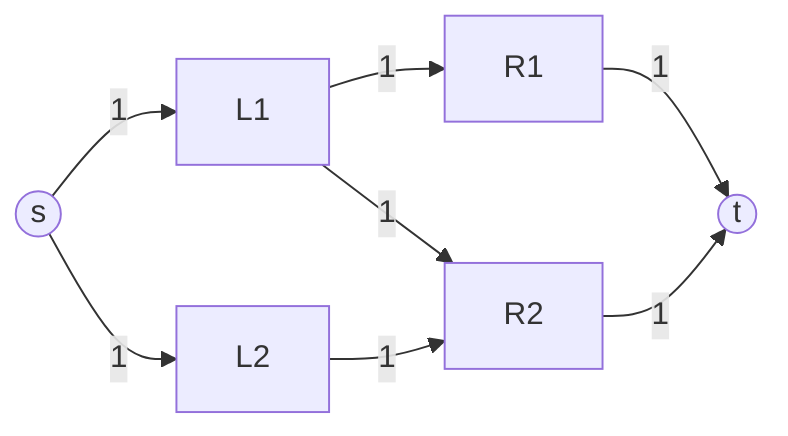

# Maximum Flow (Edmonds-Karp & Dinic) — Junior Level

> **One-line summary:** Maximum flow asks how much "stuff" (water, packets, units) you can push from a source `s` to a sink `t` through a network of capacity-limited edges. The Ford-Fulkerson *method* repeatedly finds an augmenting path in the *residual graph* and pushes flow along it; **Edmonds-Karp** picks the shortest such path with BFS (`O(VE²)`), and **Dinic's algorithm** speeds this up using level graphs and blocking flow (`O(V²E)`).

---

## Table of Contents

1. [Introduction](#introduction)
2. [Prerequisites](#prerequisites)
3. [Glossary](#glossary)
4. [Core Concepts](#core-concepts)
5. [Big-O Summary](#big-o-summary)
6. [Real-World Analogies](#real-world-analogies)
7. [Pros & Cons](#pros--cons)
8. [Step-by-Step Walkthrough](#step-by-step-walkthrough)
9. [Code Examples](#code-examples)
10. [Coding Patterns](#coding-patterns)
11. [Error Handling](#error-handling)
12. [Performance Tips](#performance-tips)
13. [Best Practices](#best-practices)
14. [Edge Cases & Pitfalls](#edge-cases--pitfalls)
15. [Common Mistakes](#common-mistakes)
16. [Cheat Sheet](#cheat-sheet)
17. [Visual Animation](#visual-animation)
18. [Summary](#summary)
19. [Further Reading](#further-reading)

---

## Introduction

Imagine a city water system. Water enters at a single **pumping station** (the *source*, written `s`) and must reach a single **reservoir** (the *sink*, written `t`). In between is a tangle of pipes, and every pipe has a maximum throughput — its **capacity**. No pipe can carry more water than its capacity, and at every junction the water that flows *in* must flow *out* (you cannot store water in a junction). The **maximum flow problem** asks one deceptively simple question:

> What is the greatest total rate of water we can route from `s` to `t`?

This single question turns out to be one of the most useful in all of computer science. The exact same math models data through a network, goods through a supply chain, the assignment of workers to jobs (bipartite matching), the separation of an image into foreground and background (image segmentation), and dozens of other problems that do not look like "flow" at first glance.

The breakthrough idea, due to **L. R. Ford Jr. and D. R. Fulkerson in 1956**, is the **augmenting path**. As long as there is *any* path from `s` to `t` with spare capacity, you can push a little more flow. Repeat until no such path exists. When you get stuck, you have the maximum — and, astonishingly, the bottleneck you got stuck on is the cheapest way to *cut* the network in two. That equivalence is the celebrated **Max-Flow Min-Cut theorem**.

Ford-Fulkerson is a *method*, not a single algorithm, because it does not say *how* to pick the augmenting path. Two famous instantiations do:

- **Edmonds-Karp (1972):** always pick the path with the fewest edges, found by **BFS**. Runs in `O(VE²)`, independent of capacities.
- **Dinic's algorithm (1970):** group BFS distances into a **level graph**, then push a **blocking flow** along all shortest paths at once with DFS. Runs in `O(V²E)`, and an astonishing `O(E√V)` on unit-capacity and bipartite graphs.

This file teaches the shared foundation — networks, residual graphs, augmenting paths — and walks through Edmonds-Karp in full. Dinic's blocking-flow machinery is covered in `middle.md`; the proofs live in `professional.md`.

---

## Prerequisites

Before reading this file you should be comfortable with:

- **Directed graphs** — vertices, directed edges, adjacency lists. Flow networks are directed.
- **Breadth-First Search (BFS)** — Edmonds-Karp *is* repeated BFS. You must know how BFS finds shortest paths in edge-count.
- **Depth-First Search (DFS)** — Dinic uses DFS to push blocking flow.
- **Queues and arrays** — BFS needs a queue; the residual graph is stored in arrays.
- **Big-O notation** — `O(V)`, `O(E)`, `O(VE²)`.
- **Basic arithmetic on `min`** — the bottleneck of a path is a `min` over its edges.

Optional but helpful:

- Brief exposure to **bipartite matching** — the most common application (sibling topic 19).
- Familiarity with **shortest paths** (BFS/Dijkstra), since augmenting paths are a flavor of pathfinding.

---

## Glossary

| Term | Meaning |
|------|---------|
| **Flow network** | A directed graph with a non-negative **capacity** `c(u,v)` on each edge, a **source** `s`, and a **sink** `t`. |
| **Capacity** `c(u,v)` | The maximum flow that edge `(u,v)` may carry. |
| **Flow** `f(u,v)` | The actual amount sent on `(u,v)`. Must satisfy `0 ≤ f(u,v) ≤ c(u,v)`. |
| **Capacity constraint** | `f(u,v) ≤ c(u,v)` — never exceed a pipe's limit. |
| **Conservation** | For every vertex except `s` and `t`, flow in = flow out. |
| **Value of a flow** `\|f\|` | Net flow leaving the source `s` (equivalently, entering the sink `t`). |
| **Maximum flow** | A flow of the greatest possible value. |
| **Residual capacity** `c_f(u,v)` | Spare capacity left on `(u,v)`: `c(u,v) − f(u,v)`, **plus** the flow on the reverse edge that we are allowed to cancel. |
| **Residual graph** `G_f` | The graph of all edges with positive residual capacity. Includes **reverse edges** that let us "undo" flow. |
| **Augmenting path** | A path from `s` to `t` in the residual graph, every edge of which has positive residual capacity. |
| **Bottleneck** | The minimum residual capacity along an augmenting path — how much we can push. |
| **Cut** `(S, T)` | A partition of vertices with `s ∈ S`, `t ∈ T`. Its **capacity** is the total capacity of edges from `S` to `T`. |
| **Min-cut** | A cut of minimum capacity. Equals the max-flow value. |
| **Level graph** (Dinic) | Vertices labeled by BFS distance from `s`; keep only edges that go from level `L` to level `L+1`. |
| **Blocking flow** (Dinic) | A flow in the level graph where every `s→t` path is saturated at least one edge. |

---

## Core Concepts

### 1. The Flow Network

A flow network is a directed graph `G = (V, E)`. Every edge `(u,v)` carries a non-negative capacity `c(u,v)`. We single out two vertices: the **source** `s` (where flow originates) and the **sink** `t` (where it must end up). A **flow** assigns a number `f(u,v)` to each edge obeying two rules:

1. **Capacity:** `0 ≤ f(u,v) ≤ c(u,v)` — you cannot overfill a pipe.
2. **Conservation:** at every vertex `v ≠ s, t`, total inflow equals total outflow — junctions store nothing.

The **value** of the flow is how much leaves `s` (which, by conservation, equals how much enters `t`). Max-flow is the largest achievable value.

```
         16        12
    s ------> a ------> c
    |         ^         |
  13|        4|       9 | 20
    v         |         v
    b ------> d ------> t
         14        7,4
```

(The full CLRS network appears in the walkthrough below.)

### 2. The Residual Graph — the Key Idea

Naively, you might push flow along any `s→t` path until it saturates, then look for another. But this greedy approach can paint you into a corner: an early bad choice blocks a better one. The fix is the **residual graph**, which lets you *undo* a previous decision.

For every edge `(u,v)` with flow `f` and capacity `c`, the residual graph has:

- A **forward residual edge** `(u,v)` with capacity `c − f` (the spare room).
- A **reverse residual edge** `(v,u)` with capacity `f` (the flow you could cancel).

Pushing one unit on the reverse edge `(v,u)` *reduces* `f(u,v)` by one — it reroutes flow that was committed earlier. **This single mechanism is what makes Ford-Fulkerson correct.** Without reverse edges, you would compute a *maximal* flow (can't add a simple path) but not a *maximum* one.

### 3. The Augmenting Path

An **augmenting path** is any `s→t` path in the residual graph where every edge has positive residual capacity. Its **bottleneck** is the smallest residual capacity along it. To *augment*:

```
augment(path):
    b = min residual capacity along path
    for each edge (u,v) in path:
        residual[u][v] -= b      # use forward capacity
        residual[v][u] += b      # open up reverse (cancel) capacity
    flow_value += b
```

### 4. The Ford-Fulkerson Method

```
ford_fulkerson(G, s, t):
    initialize flow = 0, residual = capacities
    while there exists an augmenting path p from s to t in the residual graph:
        b = bottleneck(p)
        augment p by b
    return flow
```

The *method* leaves "find an augmenting path" unspecified. The choice determines the algorithm and its complexity:

- **DFS / arbitrary path** → plain Ford-Fulkerson. Can be slow (or even non-terminating with irrational capacities).
- **BFS / shortest path** → **Edmonds-Karp**, `O(VE²)`.
- **Level graph + blocking flow** → **Dinic**, `O(V²E)`.

### 5. Max-Flow Min-Cut (preview)

When no augmenting path remains, the set `S` of vertices still reachable from `s` in the residual graph, together with `T = V \ S`, forms a cut. The capacity of this cut *equals* the flow value — proving both that the flow is maximum and that this cut is minimum. The full proof is in `professional.md`.

---

## Big-O Summary

| Algorithm | Augmenting-path rule | Time | Notes |
|-----------|---------------------|------|-------|
| Ford-Fulkerson (DFS / arbitrary) | any path | `O(E · \|f*\|)` | Depends on the max-flow *value*; bad for large capacities; may not terminate on irrationals. |
| **Edmonds-Karp** | BFS shortest path | **`O(VE²)`** | Capacity-independent. Simple to code with an adjacency matrix or list. |
| **Dinic** | level graph + blocking flow | **`O(V²E)`** | The default for contests and most practice. |
| Dinic on **unit-capacity** graphs | — | **`O(E√V)`** | Includes bipartite matching. |
| Dinic with **scaling** | — | `O(VE log U)` | `U` = max capacity. |
| Push-relabel (FIFO / highest-label) | — | `O(V²√E)` or `O(V³)` | Often fastest in practice on dense graphs; covered briefly in `middle.md`. |

`V` = number of vertices, `E` = number of edges, `\|f*\|` = max-flow value, `U` = maximum edge capacity.

---

## Real-World Analogies

| Concept | Analogy |
|---------|---------|
| Flow network | A city's **water pipe grid** from the pumping station (`s`) to the reservoir (`t`). |
| Capacity | The **diameter** of each pipe — its maximum throughput. |
| Flow conservation | A **junction** that holds no water: everything in must go out. |
| Augmenting path | A **route with slack** from station to reservoir that can carry a little more. |
| Bottleneck | The **narrowest pipe** on that route — it caps how much extra you can send. |
| Reverse / residual edge | A valve that lets you **reroute** water you previously committed down a now-suboptimal path. |
| Min-cut | The **cheapest set of pipes to shut off** to fully isolate the reservoir from the station. |
| Edmonds-Karp's BFS choice | Always sending the **next batch down the route with the fewest pipes**, to avoid long detours. |
| Dinic's level graph | Splitting the city into **distance rings** from the station and only flowing outward, ring by ring. |

A second analogy is **road traffic**: capacities are lanes per hour, flow is cars per hour, the bottleneck is the narrowest stretch of highway, and the min-cut is the smallest set of roads to barricade to seal off downtown.

Where the analogies break: real water can momentarily back up and store in a tank; mathematical flow conserves *instantaneously* at every node. And reverse residual edges have no physical pipe — they are an accounting trick for un-committing flow.

---

## Pros & Cons

| Pros | Cons |
|------|------|
| Models a huge range of problems (matching, segmentation, scheduling, connectivity). | Modeling is the hard part — recognizing a problem *is* max-flow takes practice. |
| Edmonds-Karp / Dinic terminate with integer capacities and give an **integral** optimum. | Plain Ford-Fulkerson with bad path choice can be exponential or non-terminating. |
| Max-Flow Min-Cut gives you the optimal *cut* for free. | Reverse edges are easy to forget — the most common bug. |
| Dinic is `O(E√V)` on bipartite/unit-capacity graphs — extremely fast for matching. | Worst-case `O(V²E)` is still heavy for very large dense graphs. |
| Well-studied; reference implementations exist in every language. | Vertex capacities, lower bounds, and min-cost variants need extra modeling tricks. |

**When to use:** bipartite matching, edge/vertex-disjoint paths, project selection / max-weight closure, image segmentation, baseball elimination, any "route limited resource from A to B" problem.

**When NOT to use:** when a direct greedy or matching algorithm is simpler (e.g., Hopcroft-Karp is a specialized fast matcher), or when capacities are real and you need exact termination guarantees (use BFS/Dinic, never arbitrary-path FF).

---

## Step-by-Step Walkthrough

We trace **Edmonds-Karp** on the classic CLRS network. Vertices: `s=0, a=1, b=2, c=3, d=4, t=5`. Edges (capacities):

```
s→a:16  s→b:13  a→c:12  b→a:4  b→d:14  c→b:9  c→t:20  d→c:7  d→t:4
```

```
            16          12
       s --------> a --------> c
       |           ^           | \
     13|         4 |         9 |  \ 20
       |           |   <-------'   \
       v           |                v
       b --------> d -------------> t
            14          7   (d→t: 4)
```

**Iteration 1.** BFS finds the shortest residual path `s → a → c → t`. Residual caps: `16, 12, 20`. Bottleneck = **12**. Push 12. Flow = 12.

**Iteration 2.** BFS finds `s → b → d → t`. Residual caps: `13, 14, 4`. Bottleneck = **4**. Push 4. Flow = 16.

**Iteration 3.** BFS finds `s → b → d → c → t`. Residual caps: `9 (s→b left: 13−4), 10 (b→d: 14−4), 7 (d→c), 8 (c→t: 20−12)`. Bottleneck = **7**. Push 7. Flow = 23.

**Iteration 4.** BFS now must use a **reverse edge**. The only `s→t` residual path is `s → a → c → b → d → t`? Let's check: after the pushes, `c→t` has `20−12−7 = 1` left; `a→c` has `12−12 = 0` (saturated). The augmenting search finds `s → b → ... ` but `b→d` is `14−4−7 = 3`, `d→t` saturated (`4−4=0`), `d→c` saturated (`7−7=0`). No more `s→t` path exists. **Max flow = 23.**

**Recovering the min-cut.** After termination, the vertices reachable from `s` in the residual graph are `S = {s, b}` (because `s→b` still has residual 2; from `b` we can reach `a` via `b→a` cap 4, so actually `S = {s, a, b}` — depends on residuals). The cut edges from `S` to `T` sum to exactly 23. (The animation shows the exact final residuals and the cut.)

The key observations a junior should take away:

1. The **shortest** augmenting path is found by BFS each round.
2. The **bottleneck** is a `min` over the path; you push exactly that much.
3. **Reverse edges** open up as you push, enabling later reroutes.
4. You stop when **BFS can no longer reach `t`** — and that frontier is the min-cut.

---

## Code Examples

### Example: Edmonds-Karp (BFS shortest augmenting path)

We use an **adjacency-list residual graph** with paired edges: edge `e` and its reverse `e^1` are stored adjacently, so the reverse of edge index `i` is `i ^ 1`. This XOR trick is the standard, bug-resistant way to manage reverse edges.

#### Go

```go
package main

import "fmt"

type MaxFlow struct {
	n       int
	to, cap []int   // to[e] = head of edge e; cap[e] = residual capacity
	head    [][]int // head[u] = list of edge ids leaving u
}

func NewMaxFlow(n int) *MaxFlow {
	return &MaxFlow{n: n, head: make([][]int, n)}
}

// AddEdge adds a directed edge u->v with capacity c, plus a 0-capacity reverse.
func (g *MaxFlow) AddEdge(u, v, c int) {
	g.head[u] = append(g.head[u], len(g.to))
	g.to = append(g.to, v)
	g.cap = append(g.cap, c)
	g.head[v] = append(g.head[v], len(g.to))
	g.to = append(g.to, u)
	g.cap = append(g.cap, 0) // reverse edge starts empty
}

// EdmondsKarp returns the maximum flow from s to t.
func (g *MaxFlow) EdmondsKarp(s, t int) int {
	flow := 0
	for {
		// BFS for the shortest augmenting path, recording the edge used to reach each node.
		parentEdge := make([]int, g.n)
		for i := range parentEdge {
			parentEdge[i] = -1
		}
		parentEdge[s] = -2 // mark source visited
		queue := []int{s}
		for len(queue) > 0 && parentEdge[t] == -1 {
			u := queue[0]
			queue = queue[1:]
			for _, e := range g.head[u] {
				v := g.to[e]
				if parentEdge[v] == -1 && g.cap[e] > 0 {
					parentEdge[v] = e
					queue = append(queue, v)
				}
			}
		}
		if parentEdge[t] == -1 {
			break // no augmenting path: done
		}
		// Find the bottleneck along the path t back to s.
		bottleneck := 1 << 60
		for v := t; v != s; {
			e := parentEdge[v]
			if g.cap[e] < bottleneck {
				bottleneck = g.cap[e]
			}
			v = g.to[e^1] // tail of edge e
		}
		// Augment: subtract on forward edges, add on reverse edges.
		for v := t; v != s; {
			e := parentEdge[v]
			g.cap[e] -= bottleneck
			g.cap[e^1] += bottleneck
			v = g.to[e^1]
		}
		flow += bottleneck
	}
	return flow
}

func main() {
	g := NewMaxFlow(6)
	edges := [][3]int{{0, 1, 16}, {0, 2, 13}, {1, 3, 12}, {2, 1, 4},
		{2, 4, 14}, {3, 2, 9}, {3, 5, 20}, {4, 3, 7}, {4, 5, 4}}
	for _, e := range edges {
		g.AddEdge(e[0], e[1], e[2])
	}
	fmt.Println(g.EdmondsKarp(0, 5)) // 23
}
```

#### Java

```java
import java.util.*;

public class EdmondsKarp {
    int n;
    List<Integer> to = new ArrayList<>(), cap = new ArrayList<>();
    List<List<Integer>> head;

    EdmondsKarp(int n) {
        this.n = n;
        head = new ArrayList<>();
        for (int i = 0; i < n; i++) head.add(new ArrayList<>());
    }

    void addEdge(int u, int v, int c) {
        head.get(u).add(to.size()); to.add(v); cap.add(c);
        head.get(v).add(to.size()); to.add(u); cap.add(0); // reverse
    }

    int maxFlow(int s, int t) {
        int flow = 0;
        while (true) {
            int[] parentEdge = new int[n];
            Arrays.fill(parentEdge, -1);
            parentEdge[s] = -2;
            Deque<Integer> queue = new ArrayDeque<>();
            queue.add(s);
            while (!queue.isEmpty() && parentEdge[t] == -1) {
                int u = queue.poll();
                for (int e : head.get(u)) {
                    int v = to.get(e);
                    if (parentEdge[v] == -1 && cap.get(e) > 0) {
                        parentEdge[v] = e;
                        queue.add(v);
                    }
                }
            }
            if (parentEdge[t] == -1) break;
            int bottleneck = Integer.MAX_VALUE;
            for (int v = t; v != s; ) {
                int e = parentEdge[v];
                bottleneck = Math.min(bottleneck, cap.get(e));
                v = to.get(e ^ 1);
            }
            for (int v = t; v != s; ) {
                int e = parentEdge[v];
                cap.set(e, cap.get(e) - bottleneck);
                cap.set(e ^ 1, cap.get(e ^ 1) + bottleneck);
                v = to.get(e ^ 1);
            }
            flow += bottleneck;
        }
        return flow;
    }

    public static void main(String[] args) {
        EdmondsKarp g = new EdmondsKarp(6);
        int[][] edges = {{0,1,16},{0,2,13},{1,3,12},{2,1,4},
                         {2,4,14},{3,2,9},{3,5,20},{4,3,7},{4,5,4}};
        for (int[] e : edges) g.addEdge(e[0], e[1], e[2]);
        System.out.println(g.maxFlow(0, 5)); // 23
    }
}
```

#### Python

```python
from collections import deque


class MaxFlow:
    def __init__(self, n):
        self.n = n
        self.to = []          # to[e]  = head of edge e
        self.cap = []         # cap[e] = residual capacity of edge e
        self.head = [[] for _ in range(n)]

    def add_edge(self, u, v, c):
        self.head[u].append(len(self.to)); self.to.append(v); self.cap.append(c)
        self.head[v].append(len(self.to)); self.to.append(u); self.cap.append(0)

    def edmonds_karp(self, s, t):
        flow = 0
        while True:
            parent_edge = [-1] * self.n
            parent_edge[s] = -2
            queue = deque([s])
            while queue and parent_edge[t] == -1:
                u = queue.popleft()
                for e in self.head[u]:
                    v = self.to[e]
                    if parent_edge[v] == -1 and self.cap[e] > 0:
                        parent_edge[v] = e
                        queue.append(v)
            if parent_edge[t] == -1:
                break
            bottleneck = float("inf")
            v = t
            while v != s:
                e = parent_edge[v]
                bottleneck = min(bottleneck, self.cap[e])
                v = self.to[e ^ 1]
            v = t
            while v != s:
                e = parent_edge[v]
                self.cap[e] -= bottleneck
                self.cap[e ^ 1] += bottleneck
                v = self.to[e ^ 1]
            flow += bottleneck
        return flow


if __name__ == "__main__":
    g = MaxFlow(6)
    for u, v, c in [(0,1,16),(0,2,13),(1,3,12),(2,1,4),
                    (2,4,14),(3,2,9),(3,5,20),(4,3,7),(4,5,4)]:
        g.add_edge(u, v, c)
    print(g.edmonds_karp(0, 5))  # 23
```

**What it does:** builds the CLRS network and prints the max flow `23`.
**Run:** `go run main.go` | `javac EdmondsKarp.java && java EdmondsKarp` | `python max_flow.py`

---

## Coding Patterns

### Pattern 1: The Paired-Edge (XOR) Residual Graph

**Intent:** store each directed edge and its reverse adjacently so that `reverse(e) = e ^ 1`. Augmenting becomes "subtract from `e`, add to `e^1`." This is the single most important implementation idiom in max-flow.

```python
def add_edge(self, u, v, c):
    self.head[u].append(len(self.to)); self.to.append(v); self.cap.append(c)
    self.head[v].append(len(self.to)); self.to.append(u); self.cap.append(0)
# now edge e and e^1 are a forward/reverse pair
```

### Pattern 2: Min-Cut Recovery

**Intent:** after max-flow terminates, BFS/DFS from `s` over edges with positive residual. Reachable vertices form `S`; the cut edges (from `S` to `T`, in the *original* graph) are the min-cut.

```python
def min_cut(self, s):
    seen = [False] * self.n
    stack = [s]
    seen[s] = True
    while stack:
        u = stack.pop()
        for e in self.head[u]:
            if self.cap[e] > 0 and not seen[self.to[e]]:
                seen[self.to[e]] = True
                stack.append(self.to[e])
    return seen  # seen[v] == True  <=>  v in S
```

### Pattern 3: Bipartite Matching via Flow

**Intent:** connect a super-source to every left vertex (cap 1), every right vertex to a super-sink (cap 1), and each allowed pair left→right (cap 1). Max-flow = maximum matching. See sibling topic 19 (bipartite-matching).



---

## Error Handling

| Error | Cause | Fix |
|-------|-------|-----|
| Max flow too small / wrong | Forgot to add the **reverse edge** (or added it with wrong capacity). | Always add a paired reverse edge of capacity 0; augment both with `e` / `e^1`. |
| Infinite loop / never terminates | Used arbitrary-path Ford-Fulkerson with real (irrational) capacities. | Use BFS (Edmonds-Karp) or Dinic; restrict to integer/rational capacities. |
| `IndexError` / panic in augment | `parentEdge[t]` was never set (no path) but you augmented anyway. | Check `parentEdge[t] == -1` and `break` before augmenting. |
| Self-loops or parallel edges miscounted | Treated parallel edges as one. | The paired-edge representation handles parallels naturally — add each separately. |
| Integer overflow on bottleneck init | Initialized bottleneck to a too-small sentinel. | Initialize to `+∞` (`1<<60` in Go, `Integer.MAX_VALUE` in Java, `float('inf')` in Python). |

---

## Performance Tips

- **Use adjacency lists with paired edges**, not an adjacency *matrix*, for sparse graphs — the matrix is `O(V²)` memory and slows BFS.
- **Prefer Dinic over Edmonds-Karp** when you expect many augmentations; Dinic batches all shortest paths per BFS phase.
- **For bipartite matching / unit capacities, Dinic is `O(E√V)`** — far faster than the `O(VE²)` worst case suggests.
- **Avoid re-allocating the BFS arrays** every iteration in hot loops; reuse and reset them.
- **Scale capacities** (Dinic with scaling) when capacities are huge but the graph is small.

---

## Best Practices

- Write the paired-edge `add_edge` once and never touch reverse edges by hand again.
- Test on the CLRS network (answer 23) and a tiny `s→t` direct edge before trusting your code.
- Validate against a brute-force or a second algorithm (run both Edmonds-Karp and Dinic, compare).
- Keep a `min_cut` recovery routine alongside `max_flow` — you will need the cut as often as the value.
- Document `s`, `t`, and the meaning of each vertex when modeling a real problem; modeling bugs dwarf coding bugs.

---

## Edge Cases & Pitfalls

- **`s == t`** — define max-flow as 0 (or as `+∞` by convention if there is a direct infinite edge); guard explicitly.
- **No path from `s` to `t`** — answer is 0; BFS returns immediately.
- **Zero-capacity edges** — harmless; they simply never appear in the residual graph.
- **Parallel edges** — keep them separate; do not merge, or you lose the ability to track them.
- **Disconnected graph** — vertices unreachable from `s` never participate; that is correct.
- **Vertex capacities** — split a vertex `v` into `v_in → v_out` with an edge of capacity = the vertex limit (covered in `middle.md`).
- **Multiple sources/sinks** — add a super-source to all sources and a super-sink from all sinks (covered in `middle.md`).

---

## Common Mistakes

1. **Forgetting reverse edges entirely** — you compute a *maximal* flow that is not maximum. This is the #1 bug.
2. **Giving the reverse edge a nonzero starting capacity** — it must start at 0 and grow only as you push.
3. **Augmenting before checking reachability** — always confirm `t` was reached by BFS.
4. **Using DFS with arbitrary path order** — risks exponential time on adversarial integer capacities and non-termination on irrationals; use BFS/Dinic.
5. **Computing the min-cut on the original graph** — the reachable set must be found in the *residual* graph after termination.
6. **Mutating capacities instead of residuals** — keep the original capacities if you need to report the cut's true capacity; mutate only `residual`/`cap`.
7. **Off-by-one in `e ^ 1`** — only valid when edges are added in forward/reverse pairs starting at an even index.

---

## Cheat Sheet

| Concept | Formula / Rule |
|---------|----------------|
| Capacity constraint | `0 ≤ f(u,v) ≤ c(u,v)` |
| Conservation | inflow(`v`) = outflow(`v`) for `v ≠ s, t` |
| Residual forward | `c_f(u,v) = c(u,v) − f(u,v)` |
| Residual reverse | `c_f(v,u) = f(u,v)` |
| Augment by bottleneck `b` | `cap[e] -= b; cap[e^1] += b` along path |
| Reverse edge index | `reverse(e) = e ^ 1` (paired storage) |
| Edmonds-Karp time | `O(VE²)` |
| Dinic time | `O(V²E)`; `O(E√V)` unit-capacity / bipartite |
| Max-Flow Min-Cut | max flow value = min cut capacity |
| Min-cut set `S` | vertices reachable from `s` in residual graph after termination |

Pseudocode skeleton:

```
while augmenting path p exists (BFS or level graph):
    b = bottleneck(p)
    augment p by b
    flow += b
return flow
```

---

## Visual Animation

> See [`animation.html`](./animation.html) for an interactive visualization of Edmonds-Karp and Dinic.
>
> The animation demonstrates:
> - The flow network with `capacity / flow` labels on each edge.
> - The current augmenting path (Edmonds-Karp) or level graph (Dinic) highlighted.
> - The bottleneck of the chosen path and the running max-flow value.
> - Reverse/residual edges appearing as flow is pushed.
> - The final min-cut drawn across the network.
> - Step / Run / Reset controls.

---

## Summary

Maximum flow asks how much you can route from `s` to `t` through capacity-limited edges. The Ford-Fulkerson *method* repeatedly finds an **augmenting path** in the **residual graph** — the graph of spare forward capacity plus **reverse edges** that let you cancel earlier decisions — and pushes the bottleneck amount. **Edmonds-Karp** chooses the shortest path with BFS for an `O(VE²)` guarantee; **Dinic** batches all shortest paths into a level graph and pushes a blocking flow, reaching `O(V²E)` and `O(E√V)` on bipartite/unit-capacity graphs. When BFS can no longer reach `t`, you have the maximum flow — and the reachable set gives you the minimum cut for free. Master the residual graph and reverse edges, and the rest is bookkeeping.

---

## Further Reading

- *Introduction to Algorithms* (CLRS), Chapter 26 — "Maximum Flow" — the canonical treatment, source of the 23-network.
- Ford & Fulkerson, *Maximal Flow Through a Network* (1956) — the original paper.
- Edmonds & Karp, *Theoretical Improvements in Algorithmic Efficiency for Network Flow Problems* (1972).
- Dinitz (Dinic), *Algorithm for Solution of a Problem of Maximum Flow in Networks with Power Estimation* (1970).
- cp-algorithms.com — "Maximum flow - Ford-Fulkerson and Edmonds-Karp" and "Dinic's algorithm".
- Sibling topics: bipartite-matching (19), min-cost flow (18), edge/vertex-disjoint paths and Menger's theorem (23).
