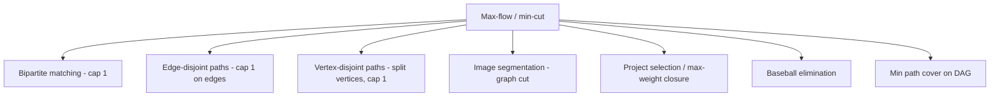

# Maximum Flow (Edmonds-Karp & Dinic) — Middle Level

> **Focus:** Why reverse edges make Ford-Fulkerson correct, how Dinic's level graph and blocking flow beat Edmonds-Karp, and how to bend max-flow to model matching, vertex capacities, and multi-source/sink problems.

---

## Table of Contents

1. [Introduction](#introduction)
2. [Deeper Concepts](#deeper-concepts)
3. [Comparison with Alternatives](#comparison-with-alternatives)
4. [Advanced Patterns](#advanced-patterns)
5. [Graph and Tree Applications](#graph-and-tree-applications)
6. [Algorithmic Integration](#algorithmic-integration)
7. [Code Examples](#code-examples)
8. [Error Handling](#error-handling)
9. [Performance Analysis](#performance-analysis)
10. [Best Practices](#best-practices)
11. [Visual Animation](#visual-animation)
12. [Summary](#summary)

---

## Introduction

At junior level max-flow is "find augmenting paths until you cannot." At middle level you ask the engineering and modeling questions:

- *Why* do reverse edges make a greedy method find the global optimum?
- Why is Edmonds-Karp `O(VE²)` and Dinic `O(V²E)` — what does the level graph actually buy?
- What is a **blocking flow**, and why does the **current-arc optimization** make Dinic's DFS amortize cleanly?
- How do you model vertex capacities, multiple sources, lower bounds, or a max-weight closure as a single flow instance?
- When should you reach for push-relabel instead?

These distinctions decide whether your bipartite matcher runs in milliseconds or times out, and whether you can even *express* the problem you are handed.

---

## Deeper Concepts

### Why reverse edges are not optional

Consider the diamond network `s → a → t` and `s → b → t` plus a cross edge `a → b`, all capacity 1, with `s→a`, `s→b`, `a→t`, `b→t` capacity 1 and `a→b` capacity 1. A naive greedy might push `s → a → b → t` first, saturating `a→b`. Now `s → a → t`? `a→t` still free, so push it. `s → b → t`? `b→t` still free — but `s→b` then must reach `t`, and `b→t` works. The point generalizes: a bad first augmenting path can route flow through a "crossbar" edge that *should* have stayed empty.

The **reverse edge** repairs this. When BFS later finds a path that wants to *undo* the crossbar usage, it traverses the reverse edge `b→a` (residual = the flow on `a→b`), effectively rerouting. Formally:

> **Claim.** A flow `f` is maximum **iff** the residual graph `G_f` contains no augmenting path.

The "only if" direction needs reverse edges: without them, you could be stuck at a *maximal* (locally stuck) but not *maximum* flow. The proof (via Max-Flow Min-Cut) is in `professional.md`. Intuitively, reverse edges turn the greedy method into an exchange argument: any committed flow can be re-traded.

### The residual graph, formally

For each original edge `(u,v)` with capacity `c` and flow `f`:

```
c_f(u,v) = c − f      (forward residual: spare room)
c_f(v,u) = f          (reverse residual: cancellable flow)
```

`G_f` contains exactly the edges with `c_f > 0`. Augmenting along a path `p` by its bottleneck `b = min_{(u,v)∈p} c_f(u,v)` preserves both capacity and conservation, and increases `|f|` by `b`.

### Edmonds-Karp: why `O(VE²)`

Edmonds-Karp = Ford-Fulkerson with **BFS** (shortest augmenting path by edge count). Two lemmas drive the bound:

1. **Monotonic distances.** The BFS distance `δ_f(s, v)` from `s` to any `v` in the residual graph *never decreases* across augmentations.
2. **Edge saturation count.** Each edge becomes the bottleneck (saturated) at most `O(V)` times, because between two saturations of `(u,v)` the distance `δ(s,u)` must increase by at least 2.

There are `O(E)` edges, each saturated `O(V)` times → `O(VE)` augmentations, each costing `O(E)` for the BFS → **`O(VE²)`**. Full proofs in `professional.md`.

### Dinic: the level graph and blocking flow

Dinic's insight: instead of finding *one* shortest path per BFS, find *all of them at once*.

1. **BFS builds a level graph.** Label each vertex with its BFS distance `level[v]` from `s`. Keep only edges `(u,v)` with `level[v] = level[u] + 1` (strictly forward). This is a DAG.
2. **DFS finds a blocking flow.** A **blocking flow** saturates at least one edge on *every* `s→t` path in the level graph. We find it with repeated DFS in the level graph, pushing bottleneck flow and removing saturated edges.
3. **Repeat.** After a blocking flow, the shortest `s→t` distance strictly increases. Distances range over `1..V`, so there are at most `V` **phases**.

The magic is the **current-arc optimization** (a.k.a. `iter[]` / `it[]` pointer): in each phase, for each vertex `u`, we keep an index into its adjacency list and *never revisit* an edge that proved useless (its target is blocked). Across one phase the DFS work is `O(VE)`, so total is **`O(V²E)`** — the `V²` comes from `V` phases × `O(VE)` per phase, but tightened the per-phase blocking-flow cost is `O(VE)` giving `O(V²E)` overall.

### Why Dinic is `O(E√V)` on unit-capacity / bipartite graphs

On graphs where every edge has capacity 1 (and the right degree structure), after `O(√V)` phases the remaining flow is at most `O(√V)`, and each remaining augmentation costs `O(E)`. So the total is `O(E√V)`. This is exactly the regime of **bipartite matching**, making Dinic competitive with the specialized Hopcroft-Karp algorithm (which is also `O(E√V)`). Proof sketch in `professional.md`.

---

## Comparison with Alternatives

| Algorithm | Path choice / strategy | Time | Practical notes |
|-----------|------------------------|------|-----------------|
| Ford-Fulkerson (arbitrary / DFS) | any augmenting path | `O(E·\|f*\|)` | Pseudo-polynomial; can blow up or loop on irrationals. Avoid in production. |
| Capacity scaling FF | augment along paths with cap ≥ Δ | `O(E² log U)` | Bounds the value dependence; rarely used vs Dinic. |
| **Edmonds-Karp** | BFS shortest path | `O(VE²)` | Simplest correct polynomial method; fine for small graphs. |
| **Dinic** | level graph + blocking flow | `O(V²E)` | The go-to. `O(E√V)` on unit-capacity / bipartite. |
| Dinic + scaling | level graph with capacity threshold | `O(VE log U)` | Best when capacities are huge and the graph is small/medium. |
| MPM (three-Indians) | blocking flow via potentials | `O(V³)` | Better than Dinic on dense graphs theoretically. |
| Push-Relabel (FIFO) | local push/relabel, no global paths | `O(V³)` | Often **fastest in practice** on dense graphs; no augmenting paths. |
| Push-Relabel (highest-label) | choose highest-labeled active node | `O(V²√E)` | Common in serious flow libraries. |
| Chen et al. (2022) | interior-point / dynamic trees | `O(E^{1+o(1)})` | Theoretical near-linear breakthrough; not yet practical. |

**Rule of thumb:** use **Dinic** by default. Use **push-relabel** if profiling shows you need more speed on dense graphs. Use **Edmonds-Karp** only for clarity on tiny inputs. Reserve scaling for huge capacities.

```mermaid
graph TD
    A[Max-flow needed] --> B{Graph type?}
    B -->|Unit-capacity / bipartite| C[Dinic O(E√V)]
    B -->|General, sparse| D[Dinic O(V²E)]
    B -->|General, dense| E[Push-relabel]
    B -->|Huge capacities| F[Dinic + scaling]
    B -->|Tiny / teaching| G[Edmonds-Karp]
```

---

## Advanced Patterns

### Pattern: Min-cut recovery

After max-flow, the set `S = {v : v reachable from s in G_f}` and `T = V \ S` form a minimum cut. Its capacity equals `|f*|`. DFS/BFS from `s` over positive-residual edges; report all original edges from `S` to `T`.

### Pattern: Vertex capacities by node-splitting

A vertex `v` with capacity `cap(v)` is modeled by splitting it: replace `v` with `v_in` and `v_out`, add an internal edge `v_in → v_out` of capacity `cap(v)`. Redirect all edges *into* `v` to `v_in` and all edges *out of* `v` from `v_out`. Now the internal edge enforces the vertex limit. This is also how vertex-disjoint paths (Menger, sibling topic 23) are modeled: split every vertex with capacity 1.

```
   in-edges → [ v_in ] --cap(v)--> [ v_out ] → out-edges
```

### Pattern: Multiple sources and sinks

Add a **super-source** `S*` with an edge `S* → s_i` of capacity `∞` (or the source's supply) to each real source `s_i`, and a **super-sink** `T*` with `t_j → T*` of capacity `∞` (or the sink's demand). Run max-flow from `S*` to `T*`.

### Pattern: Dinic with capacity scaling

Process capacities from the highest bit down. Maintain a threshold `Δ` (a power of two); only consider residual edges with capacity `≥ Δ` when building the level graph. Run Dinic, then halve `Δ`. Total `O(VE log U)`. Useful when `U` (max capacity) is astronomically large but `V, E` are modest.

### Pattern: Unit-capacity bound for matching

For bipartite matching, give every edge capacity 1; Dinic runs in `O(E√V)`. The integral max-flow corresponds one-to-one with a maximum matching (each saturated `L→R` edge is a matched pair). Min-vertex-cover follows from König's theorem on the same residual graph.

### Pattern: Max-weight closure / project selection

Given projects with profits and prerequisite dependencies (choosing a project requires choosing its prerequisites), the **maximum-weight closure** reduces to min-cut:

- Source `s → project p` with capacity = profit, for each profitable project.
- `project p → t` with capacity = cost, for each costly project.
- Prerequisite `p → q` (must pick `q` if you pick `p`) with capacity `∞`.
- Answer = (sum of positive profits) − min-cut.

This "project selection" reduction is a classic interview/contest favorite.

---

## Graph and Tree Applications



### Bipartite matching (most common)

Super-source → left (cap 1), left → right for allowed pairs (cap 1), right → super-sink (cap 1). Max-flow = maximum matching. Dinic's `O(E√V)` makes this fast. See sibling topic 19.

### Edge-disjoint and vertex-disjoint paths (Menger)

The maximum number of edge-disjoint `s→t` paths equals the max-flow with all edge capacities 1 (Menger's theorem). For vertex-disjoint paths, split every internal vertex with capacity 1 first. See sibling topic 23.

### Image segmentation

Pixels are nodes; `s` = foreground bias, `t` = background bias; neighbor edges encode smoothness. The min-cut separates foreground from background. This is the basis of the GrabCut family of algorithms.

### Baseball elimination

To test whether a team can still win the division, build a flow network of remaining games and win-capacity constraints; if max-flow saturates all game nodes, the team is alive, otherwise mathematically eliminated.

---

## Algorithmic Integration

Max-flow composes with other algorithmic ideas:

- **Min-cost max-flow** (sibling 18): replace BFS/level-graph with shortest-path-by-cost (Bellman-Ford / SPFA / Johnson potentials + Dijkstra) to find the cheapest augmenting path. Preview only here.
- **Binary search + feasibility-as-flow:** many "maximize the minimum" problems binary-search an answer and test feasibility by checking whether a flow saturates all demands.
- **LP duality:** max-flow/min-cut is the combinatorial face of linear-programming duality; the cut is the dual of the flow.
- **Parametric flow:** when capacities depend on a parameter `λ`, the min-cut changes monotonically, enabling efficient sweeps (Gallo-Grigoriadis-Tarjan).

---

## Code Examples

### Dinic's Algorithm (level graph + blocking flow + current-arc)

This is the reference implementation you should memorize. The `it[]` array is the current-arc optimization.

#### Go

```go
package main

import "fmt"

const INF = int(1 << 60)

type Dinic struct {
	n         int
	to, cap   []int
	head      [][]int
	level, it []int
}

func NewDinic(n int) *Dinic {
	return &Dinic{n: n, head: make([][]int, n)}
}

func (d *Dinic) AddEdge(u, v, c int) {
	d.head[u] = append(d.head[u], len(d.to))
	d.to = append(d.to, v)
	d.cap = append(d.cap, c)
	d.head[v] = append(d.head[v], len(d.to))
	d.to = append(d.to, u)
	d.cap = append(d.cap, 0)
}

// bfs builds the level graph; returns true if t is reachable.
func (d *Dinic) bfs(s, t int) bool {
	d.level = make([]int, d.n)
	for i := range d.level {
		d.level[i] = -1
	}
	d.level[s] = 0
	queue := []int{s}
	for len(queue) > 0 {
		u := queue[0]
		queue = queue[1:]
		for _, e := range d.head[u] {
			v := d.to[e]
			if d.cap[e] > 0 && d.level[v] < 0 {
				d.level[v] = d.level[u] + 1
				queue = append(queue, v)
			}
		}
	}
	return d.level[t] >= 0
}

// dfs pushes blocking flow along level-respecting edges using current-arc it[].
func (d *Dinic) dfs(u, t, f int) int {
	if u == t {
		return f
	}
	for ; d.it[u] < len(d.head[u]); d.it[u]++ {
		e := d.head[u][d.it[u]]
		v := d.to[e]
		if d.cap[e] > 0 && d.level[v] == d.level[u]+1 {
			pushed := d.dfs(v, t, min(f, d.cap[e]))
			if pushed > 0 {
				d.cap[e] -= pushed
				d.cap[e^1] += pushed
				return pushed
			}
		}
	}
	return 0
}

func (d *Dinic) MaxFlow(s, t int) int {
	flow := 0
	for d.bfs(s, t) {
		d.it = make([]int, d.n) // reset current-arc pointers each phase
		for {
			f := d.dfs(s, t, INF)
			if f == 0 {
				break
			}
			flow += f
		}
	}
	return flow
}

func min(a, b int) int {
	if a < b {
		return a
	}
	return b
}

func main() {
	d := NewDinic(6)
	edges := [][3]int{{0, 1, 16}, {0, 2, 13}, {1, 3, 12}, {2, 1, 4},
		{2, 4, 14}, {3, 2, 9}, {3, 5, 20}, {4, 3, 7}, {4, 5, 4}}
	for _, e := range edges {
		d.AddEdge(e[0], e[1], e[2])
	}
	fmt.Println(d.MaxFlow(0, 5)) // 23
}
```

#### Java

```java
import java.util.*;

public class Dinic {
    int n;
    int[] to, cap;
    List<List<Integer>> head;
    int[] level, it;
    int cnt = 0;

    Dinic(int n, int maxEdges) {
        this.n = n;
        to = new int[2 * maxEdges];
        cap = new int[2 * maxEdges];
        head = new ArrayList<>();
        for (int i = 0; i < n; i++) head.add(new ArrayList<>());
    }

    void addEdge(int u, int v, int c) {
        head.get(u).add(cnt); to[cnt] = v; cap[cnt] = c; cnt++;
        head.get(v).add(cnt); to[cnt] = u; cap[cnt] = 0; cnt++;
    }

    boolean bfs(int s, int t) {
        level = new int[n];
        Arrays.fill(level, -1);
        level[s] = 0;
        Deque<Integer> q = new ArrayDeque<>();
        q.add(s);
        while (!q.isEmpty()) {
            int u = q.poll();
            for (int e : head.get(u)) {
                int v = to[e];
                if (cap[e] > 0 && level[v] < 0) {
                    level[v] = level[u] + 1;
                    q.add(v);
                }
            }
        }
        return level[t] >= 0;
    }

    int dfs(int u, int t, int f) {
        if (u == t) return f;
        for (; it[u] < head.get(u).size(); it[u]++) {
            int e = head.get(u).get(it[u]);
            int v = to[e];
            if (cap[e] > 0 && level[v] == level[u] + 1) {
                int pushed = dfs(v, t, Math.min(f, cap[e]));
                if (pushed > 0) {
                    cap[e] -= pushed;
                    cap[e ^ 1] += pushed;
                    return pushed;
                }
            }
        }
        return 0;
    }

    int maxFlow(int s, int t) {
        int flow = 0;
        while (bfs(s, t)) {
            it = new int[n];
            int f;
            while ((f = dfs(s, t, Integer.MAX_VALUE)) > 0) flow += f;
        }
        return flow;
    }

    public static void main(String[] args) {
        Dinic d = new Dinic(6, 9);
        int[][] edges = {{0,1,16},{0,2,13},{1,3,12},{2,1,4},
                         {2,4,14},{3,2,9},{3,5,20},{4,3,7},{4,5,4}};
        for (int[] e : edges) d.addEdge(e[0], e[1], e[2]);
        System.out.println(d.maxFlow(0, 5)); // 23
    }
}
```

#### Python

```python
from collections import deque


class Dinic:
    def __init__(self, n):
        self.n = n
        self.to, self.cap = [], []
        self.head = [[] for _ in range(n)]

    def add_edge(self, u, v, c):
        self.head[u].append(len(self.to)); self.to.append(v); self.cap.append(c)
        self.head[v].append(len(self.to)); self.to.append(u); self.cap.append(0)

    def bfs(self, s, t):
        self.level = [-1] * self.n
        self.level[s] = 0
        q = deque([s])
        while q:
            u = q.popleft()
            for e in self.head[u]:
                v = self.to[e]
                if self.cap[e] > 0 and self.level[v] < 0:
                    self.level[v] = self.level[u] + 1
                    q.append(v)
        return self.level[t] >= 0

    def dfs(self, u, t, f):
        if u == t:
            return f
        while self.it[u] < len(self.head[u]):
            e = self.head[u][self.it[u]]
            v = self.to[e]
            if self.cap[e] > 0 and self.level[v] == self.level[u] + 1:
                pushed = self.dfs(v, t, min(f, self.cap[e]))
                if pushed > 0:
                    self.cap[e] -= pushed
                    self.cap[e ^ 1] += pushed
                    return pushed
            self.it[u] += 1
        return 0

    def max_flow(self, s, t):
        flow = 0
        while self.bfs(s, t):
            self.it = [0] * self.n
            while True:
                f = self.dfs(s, t, float("inf"))
                if f == 0:
                    break
                flow += f
        return flow


if __name__ == "__main__":
    d = Dinic(6)
    for u, v, c in [(0,1,16),(0,2,13),(1,3,12),(2,1,4),
                    (2,4,14),(3,2,9),(3,5,20),(4,3,7),(4,5,4)]:
        d.add_edge(u, v, c)
    print(d.max_flow(0, 5))  # 23
```

**What it does:** computes max flow = 23 on the CLRS network using Dinic's algorithm.
**Run:** `go run main.go` | `javac Dinic.java && java Dinic` | `python dinic.py`

---

## Error Handling

| Scenario | What goes wrong | Correct approach |
|----------|----------------|------------------|
| Forgot to reset `it[]` per phase | DFS skips valid edges in later phases; flow too small. | Allocate a fresh `it[] = [0]*n` after every successful `bfs`. |
| Recursion depth exceeded (Python) on deep level graphs | `RecursionError` on long chains. | Raise `sys.setrecursionlimit`, or convert DFS to an explicit stack. |
| Used `level[v] == level[u]+1` but built level graph wrong | Cycles or back-edges sneak in; non-termination. | Strictly require `level[v] == level[u] + 1` in DFS and rebuild via fresh BFS each phase. |
| Integer overflow in `INF` bottleneck | Negative residuals appear. | Use a large but safe `INF` (`1<<60`); never add `INF` to capacities. |
| Mixing original capacity and residual in min-cut | Reported cut capacity is wrong. | Keep original capacities separate, or store reverse edge so original cap = `cap[e] + cap[e^1]`. |

---

## Performance Analysis

| Scenario | Edmonds-Karp | Dinic |
|----------|--------------|-------|
| General sparse, `V=1000, E=5000` | `O(VE²)` ≈ slow | `O(V²E)` comfortably fast |
| Bipartite matching, `V=2000, E=10⁴` | `O(VE²)` may TLE | `O(E√V)` very fast |
| Dense, `V=500` complete | heavy | push-relabel often wins |
| Huge capacities `U=10⁹`, small graph | fine (capacity-independent) | Dinic + scaling shines |

The key practical takeaways:

- Edmonds-Karp and Dinic are both **capacity-independent** (no `|f*|` factor), unlike arbitrary-path FF.
- Dinic's per-phase blocking flow amortizes via current-arc; in practice it runs far below its worst case.
- For unit-capacity / bipartite inputs Dinic effectively becomes `O(E√V)` — memorize this; it is why Dinic is the contest default for matching.

```python
# Quick empirical check: build a bipartite matching instance and time Dinic.
import random, time
from collections import deque

def make_bipartite(L, R, edges):
    # nodes: 0..L-1 left, L..L+R-1 right, source = L+R, sink = L+R+1
    pass  # see tasks.md for a full benchmark harness
```

A full benchmark harness lives in `tasks.md`.

---

## Best Practices

- **Default to Dinic.** Only drop to Edmonds-Karp for teaching clarity or tiny inputs.
- **Reset current-arc pointers each phase**, never across phases — this is the heart of Dinic's complexity.
- **Keep `add_edge` as the single source of truth** for reverse edges; the `e^1` trick depends on paired insertion.
- **Model carefully:** for vertex limits split nodes; for many sources/sinks add super-nodes; verify capacities encode the real constraint.
- **Recover the min-cut** as a standard companion to the flow value — many problems want the cut, not the number.
- **Cross-check** with a second algorithm on random small graphs during testing.

---

## Visual Animation

> See [`animation.html`](./animation.html) for an interactive view.
>
> The middle-level animation includes:
> - Level-graph coloring for Dinic (each BFS phase recolors vertices by distance).
> - The current-arc pointer advancing during the blocking-flow DFS.
> - Saturated edges fading out within a phase.
> - The running flow value and the strictly-increasing shortest-path distance per phase.

---

## Summary

Reverse edges turn the greedy Ford-Fulkerson method into a correct, globally optimal algorithm: a flow is maximum exactly when no augmenting path remains. **Edmonds-Karp** picks the shortest path with BFS, giving a capacity-independent `O(VE²)`. **Dinic** batches all shortest paths into a level graph and pushes a blocking flow with a current-arc DFS, reaching `O(V²E)` in general and `O(E√V)` on unit-capacity and bipartite graphs. The real power of max-flow is modeling: node-splitting for vertex capacities, super-source/sink for many terminals, capacity-1 edges for matching and disjoint paths, and the min-cut reduction for project selection and segmentation. Master Dinic and these reductions and you can solve a large slice of combinatorial optimization with one engine.
