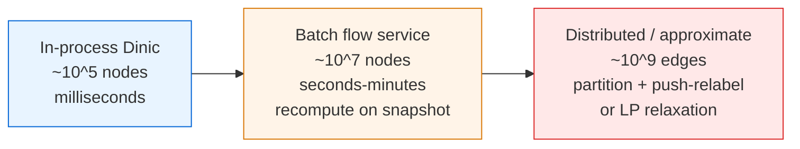
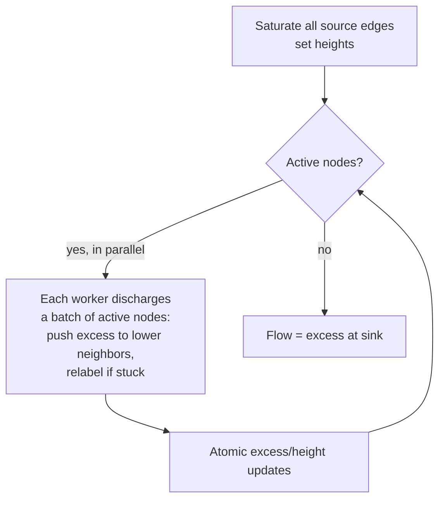
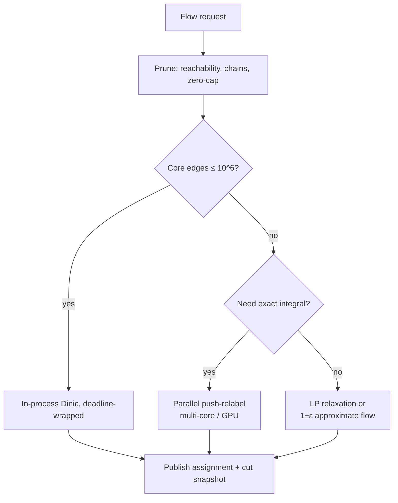

# Maximum Flow (Edmonds-Karp & Dinic) — Senior Level

> Max-flow is rarely the hard part in production — the hard parts are *recognizing* that a scheduling, matching, or provisioning problem is a flow problem, keeping the graph in sync with a changing world, and running flow on graphs too large for one machine. This file is about flow as a system component, not as a textbook algorithm.

## Table of Contents

1. [Introduction](#1-introduction)
2. [System Design with Max-Flow](#2-system-design-with-max-flow)
3. [Distributed and Large-Graph Max-Flow](#3-distributed-and-large-graph-max-flow)
4. [Concurrency](#4-concurrency)
5. [Comparison at Scale](#5-comparison-at-scale)
6. [Architecture Patterns](#6-architecture-patterns)
7. [Code Examples](#7-code-examples)
8. [Observability](#8-observability)
9. [Failure Modes](#9-failure-modes)
10. [Capacity Planning](#10-capacity-planning)
11. [Summary](#11-summary)

---

## 1. Introduction

At senior level the question shifts from "how does Dinic work" to "where does a flow computation sit in my system, and what breaks when the graph changes underneath it?". Max-flow is a *batch* computation over a snapshot of a graph. That single fact drives most of the engineering:

- The graph is a **snapshot**; the world keeps changing. You must decide on recompute-vs-incremental.
- A flow computation is **CPU- and memory-bound on one node**; very large graphs force partitioning or approximation.
- The output is an **assignment plus a cut**; downstream systems consume both, and they must agree on the snapshot.

The interesting senior decisions are therefore:

1. When is a problem actually max-flow, and when is a cheaper greedy/matching heuristic good enough?
2. How do you keep a flow-based assignment fresh as supply and demand drift?
3. How do you scale flow past one machine — partition, approximate, or push-relabel in parallel?
4. How do you make a flow service observable: which cut is binding, how saturated is the system?
5. How do you size hardware for the worst-case graph you will ever see?

This document answers those questions in production terms.

---

## 2. System Design with Max-Flow

### 2.1 Where flow shows up in real services

| Service | Flow model | What the cut/assignment means |
|---------|-----------|------------------------------|
| Ad / ride / order **matching engine** | bipartite matching, cap-1 edges | which rider ↔ driver pairs to commit |
| **Resource scheduler** (jobs → machines with capacities) | flow with machine vertex-capacities | feasible placement; binding capacity = min-cut |
| **Bandwidth / traffic engineering** | flow with link capacities | max routable demand; bottleneck links = cut |
| **Content moderation / segmentation** | graph cut | foreground/background or spam/ham partition |
| **Quota / fair-share allocation** | flow with lower bounds | feasible allocation satisfying minimums |
| **Project / feature selection** | max-weight closure → min-cut | profitable subset honoring dependencies |

### 2.2 Three tiers of flow computation



| Tier | When right | When wrong |
|------|-----------|-----------|
| In-process Dinic | Small graph, low latency, called per request (e.g., a matching round). | Graph too big for one process; you OOM. |
| Batch flow service | Periodic re-optimization over a large snapshot (every minute/hour). | You need sub-second freshness; the snapshot is stale. |
| Distributed / approximate | Graph does not fit one node; an approximate cut is acceptable. | You need an *exact* integral optimum and the graph is small enough for one node. |

The most common senior mistake is reaching for a distributed flow framework when an in-process Dinic on a well-pruned subgraph would have answered the actual question in 5 ms.

### 2.3 Snapshot discipline

A flow result is only valid for the graph it was computed on. Treat the snapshot like a transaction: pin a consistent view of supply, demand, and capacities, compute, then apply the assignment atomically. If supply changes mid-computation, either recompute or reconcile — never apply a flow computed on a graph that no longer exists.

### 2.4 A worked example: a ride-matching round

Consider an on-demand matching system that, every two seconds, matches waiting riders to nearby idle drivers. Each rider may be matched to at most one driver and vice versa; an edge exists only if the driver is within an ETA threshold of the rider. This is bipartite matching:

```
            cap 1                   cap 1
super-s ----------> rider_i ---------> driver_j ---------> super-t
                              (eligible pair, cap 1)
```

The max-flow value is the number of matched pairs; the saturated `rider→driver` edges are the matches. With `R` riders and `D` drivers and `E` eligible pairs, Dinic runs in `O(E√(R+D))` — easily under a millisecond for a metro-scale round of a few thousand on each side.

Three senior refinements turn the textbook reduction into a real system:

1. **Weighted matching.** If you want to *minimize total ETA*, plain max-flow is not enough — you need min-cost max-flow (sibling topic 18). Use unit-capacity edges with per-edge cost = ETA and find the min-cost maximum matching.
2. **Stability across rounds.** A rider who was "about to be matched" should not be perpetually starved because the optimum reshuffles every round. Bias the optimizer toward the previous round's assignment among equal-value optima (warm-start / lexicographic tie-break).
3. **Snapshot pinning.** Freeze the set of waiting riders and idle drivers at round start. A driver who goes offline mid-round must not be assigned; reconcile by dropping that edge and re-augmenting, or by discarding the round.

This single example exercises every senior theme: modeling, snapshotting, stability, and the choice between plain and min-cost flow.

---

## 3. Distributed and Large-Graph Max-Flow

### 3.1 The hard truth: max-flow does not shard cleanly

Unlike a hash map, max-flow has *global* structure — the binding min-cut can run anywhere. You cannot just split the graph by node id and combine. The realistic options:

- **Prune first.** Most large flow graphs have a small *relevant* core. Contract degree-2 chains, remove vertices unreachable from `s` or that cannot reach `t`, and merge zero-capacity edges. A 10⁸-edge graph often shrinks to a 10⁶-edge core where in-process Dinic is fine.
- **Parallel push-relabel.** Push-relabel is *local*: pushes and relabels touch only a vertex and its neighbors, so it parallelizes far better than augmenting-path methods. The Goldberg-Tarjan algorithm with FIFO/highest-label selection has GPU and multi-core implementations (`O(V²√E)` work, but high parallel throughput). This is the standard route to large exact flow.
- **Graph partitioning + flow-on-cuts.** Partition the graph (e.g., METIS), compute flow within parts, then resolve the inter-part cut iteratively. Works for segmentation-style flows with locality.
- **LP relaxation / approximation.** For truly massive graphs, a fractional LP or a `(1±ε)`-approximate max-flow (Sherman, Kelner-Lee-Orecchia-Sidford) trades exactness for near-linear time.

### 3.2 Incremental / dynamic flow

When the graph changes by a few edges, recomputing from scratch is wasteful. Techniques:

- **Warm-start:** keep the previous flow; if an edge capacity *increases*, the old flow is still feasible — just look for new augmenting paths. If it *decreases* below current flow, push the excess back (cancel along reverse edges) then re-augment.
- **Incremental min-cut:** dynamic-tree and parametric-flow techniques maintain a cut under monotone capacity changes (Gallo-Grigoriadis-Tarjan).
- **Periodic full recompute** as a correctness backstop, with incremental updates between recomputes.

### 3.3 Parallel push-relabel sketch



The win is that discharge is embarrassingly local; the challenge is contention on shared `excess[]` and `height[]`, handled with atomics or per-vertex locks.

### 3.4 Pruning: the highest-leverage optimization

Before any clever algorithm, prune. On real graphs the relevant flow core is often orders of magnitude smaller than the raw graph:

| Pruning step | What it removes | Typical impact |
|--------------|-----------------|----------------|
| Reachability trim | vertices not reachable from `s`, or that cannot reach `t` | removes dead regions of the graph entirely |
| Zero-capacity edge removal | edges that can never carry flow | shrinks `E` |
| Degree-2 chain contraction | series of single-in/single-out vertices | replaces a chain with one edge of `min` capacity |
| Parallel-edge merge (when safe) | duplicate `u→v` edges | sums capacities into one edge |
| Strongly-connected pre-contraction (segmentation) | regions on the same side of every cut | collapses to super-nodes |

A reachability trim alone frequently turns a 10⁸-edge ingested graph into a 10⁶-edge core that an in-process Dinic handles in tens of milliseconds. The discipline: *always run the flow on the smallest graph that preserves the answer.*

### 3.5 When to approximate

Exact integral max-flow is non-negotiable for matching and disjoint-paths (the answer is a discrete assignment). For segmentation, traffic engineering, and capacity planning, a `(1±ε)`-approximate flow is often acceptable and may be the only tractable option at 10⁹ edges. The decision rule: if a downstream consumer commits the assignment as a contract (a match, a placement), you need exact; if it feeds a control loop that self-corrects (admission control, provisioning), approximate is fine.

---

## 4. Concurrency

### 4.1 A single flow run is single-threaded by nature (augmenting-path)

Edmonds-Karp and Dinic are inherently sequential: each augmentation depends on the residual graph left by the previous one. You do *not* parallelize a single Dinic run easily. The realistic concurrency strategies:

- **Independent runs in parallel.** If you must solve many independent flow instances (one per shard, per region, per time bucket), run them on separate cores. This is the common and effective pattern.
- **Push-relabel for intra-run parallelism.** As above, push-relabel's locality enables real parallel speedups within one instance.
- **Read-mostly residual sharing is unsafe.** Two threads augmenting on the same residual graph race on `cap[e]` and `cap[e^1]`. Never share a mutable residual graph across threads without serialization.

### 4.2 Snapshotting for concurrent readers

Downstream consumers reading the assignment must see a consistent view. Publish the flow result as an immutable snapshot (copy-on-write); readers reference a version, writers build the next version and atomically swap a pointer. This avoids locking readers during a recompute.

### 4.3 Bounding compute time

A flow run can be slow on adversarial graphs. Wrap it with a deadline: if Dinic exceeds a budget, fall back to the previous (slightly stale) assignment or to a fast greedy matching. Never let an unbounded flow run block a request path. The cleanest place to check the deadline is between BFS phases — the algorithm is in a consistent state there, so you can return the partial flow accumulated so far as a feasible (sub-optimal) answer rather than aborting into an inconsistent residual graph.

### 4.4 The cost of false parallelism

Engineers frequently try to "speed up Dinic" by parallelizing the DFS that finds the blocking flow. This almost always fails: the blocking-flow DFS mutates shared residual capacities, so concurrent DFS branches race on `cap[e]` and `cap[e^1]`, and the current-arc pointers `it[]` become inconsistent. The result is either a corrupted flow or so much locking that you are slower than serial. The correct lesson: do not parallelize *within* an augmenting-path run. If you need intra-run parallelism, switch the entire algorithm to push-relabel, whose preflow model was designed for it. Otherwise extract parallelism *across* independent instances, where there is no shared mutable state at all.

---

## 5. Comparison at Scale

| Approach | Exactness | Parallel? | Best graph size | Notes |
|----------|-----------|-----------|-----------------|-------|
| In-process Dinic | exact, integral | no (single run) | ≤ ~10⁶ core edges | default; prune first |
| Edmonds-Karp | exact | no | small | teaching / tiny |
| Push-relabel (serial) | exact | no | dense, ≤ 10⁶ | often fastest on dense |
| Parallel push-relabel (multi-core/GPU) | exact | yes | 10⁷–10⁸ | best route to large exact flow |
| Graph partition + local flow | approximate/exact-ish | yes | 10⁸+ | segmentation-style locality |
| LP relaxation | fractional | yes (LP solvers) | huge | when integrality not required |
| `(1±ε)` approximate max-flow | approximate | yes | huge | near-linear; theory-heavy |

**Senior heuristic:** prune aggressively, run in-process Dinic, and only escalate to push-relabel/parallel/approximate when profiling on *real* graphs proves you must.

### 5.1 The decision flowchart



### 5.2 Why push-relabel scales where Dinic does not

Dinic's augmenting-path structure is inherently sequential: each augmentation reads the residual left by the last. Push-relabel maintains a *preflow* (excess allowed to accumulate at vertices) and makes purely **local** decisions — push to a lower neighbor, or relabel when stuck. Two non-adjacent active vertices can be discharged simultaneously. This locality is exactly what lets GPU and many-core implementations push 10⁷–10⁸-edge graphs that no single-threaded Dinic could touch in time. The cost is implementation complexity and tricky correctness around the global relabeling heuristic that keeps it fast.

---

## 6. Architecture Patterns

### 6.1 Flow-as-a-batch-job

A scheduled job pulls a consistent snapshot (supply, demand, capacities), builds the flow graph, runs Dinic, writes the assignment and the binding cut to a store, and emits metrics. Idempotent, restartable, easy to reason about. Most matching/allocation systems are this.

### 6.2 Flow-behind-an-API

A request supplies a small graph (e.g., a single matching round) and gets an assignment synchronously. Guarded by a size limit and a deadline. The graph must be small enough that worst-case Dinic fits the latency SLO.

### 6.3 Incremental optimizer

A long-lived service holds the residual graph and applies deltas (capacity changes) with warm-start re-augmentation, recomputing fully on a timer. Highest performance, highest complexity — only when freshness demands it.

### 6.4 Cut-driven control loop

For traffic engineering and quota systems, the *cut* (not the flow) is the actionable output: the binding constraints. A control loop recomputes the min-cut, identifies saturated links/quotas, and triggers capacity provisioning or admission control on exactly those.

### 6.5 Choosing among the patterns

| Pattern | Latency need | Graph change rate | Output consumed as |
|---------|-------------|-------------------|--------------------|
| Batch job | minutes acceptable | slow | assignment + report |
| Behind-an-API | sub-second | per-request graph | synchronous assignment |
| Incremental optimizer | sub-second freshness | continuous small deltas | live assignment |
| Cut-driven control loop | seconds-minutes | continuous | provisioning signal |

The progression in complexity is steep: batch < API < cut-loop < incremental. Start with the simplest pattern that meets the freshness SLO and only move right when measurements force you. An incremental optimizer that warm-starts the residual graph is the most powerful and the most error-prone — it carries mutable state across capacity deltas, so a single missed reverse-edge cancellation silently corrupts every subsequent answer. Guard it with a periodic full recompute that asserts the incremental result matches.

### 6.6 Idempotency and replay

Whatever pattern you choose, make the flow computation **idempotent on its input snapshot**: feeding the same `(graph, s, t)` always yields the same value and a deterministic assignment (break ties deterministically). This makes runs replayable for debugging, lets you A/B two algorithm versions on identical input, and means a retried batch job cannot double-apply an assignment.

---

## 7. Code Examples

### 7.1 Dinic wrapped with a deadline and min-cut reporting (Go)

```go
package main

import (
	"context"
	"errors"
	"fmt"
	"time"
)

const INF = int(1 << 60)

type Dinic struct {
	n         int
	to, cap   []int
	orig      []int // original capacity, for cut reporting
	head      [][]int
	level, it []int
}

func NewDinic(n int) *Dinic { return &Dinic{n: n, head: make([][]int, n)} }

func (d *Dinic) AddEdge(u, v, c int) {
	d.head[u] = append(d.head[u], len(d.to))
	d.to = append(d.to, v)
	d.cap = append(d.cap, c)
	d.orig = append(d.orig, c)
	d.head[v] = append(d.head[v], len(d.to))
	d.to = append(d.to, u)
	d.cap = append(d.cap, 0)
	d.orig = append(d.orig, 0)
}

func (d *Dinic) bfs(s, t int) bool {
	d.level = make([]int, d.n)
	for i := range d.level {
		d.level[i] = -1
	}
	d.level[s] = 0
	q := []int{s}
	for len(q) > 0 {
		u := q[0]
		q = q[1:]
		for _, e := range d.head[u] {
			if d.cap[e] > 0 && d.level[d.to[e]] < 0 {
				d.level[d.to[e]] = d.level[u] + 1
				q = append(q, d.to[e])
			}
		}
	}
	return d.level[t] >= 0
}

func (d *Dinic) dfs(u, t, f int) int {
	if u == t {
		return f
	}
	for ; d.it[u] < len(d.head[u]); d.it[u]++ {
		e := d.head[u][d.it[u]]
		v := d.to[e]
		if d.cap[e] > 0 && d.level[v] == d.level[u]+1 {
			if p := d.dfs(v, t, min(f, d.cap[e])); p > 0 {
				d.cap[e] -= p
				d.cap[e^1] += p
				return p
			}
		}
	}
	return 0
}

// MaxFlow runs Dinic but aborts if ctx is cancelled (deadline).
func (d *Dinic) MaxFlow(ctx context.Context, s, t int) (int, error) {
	flow := 0
	for d.bfs(s, t) {
		select {
		case <-ctx.Done():
			return flow, errors.New("flow deadline exceeded")
		default:
		}
		d.it = make([]int, d.n)
		for {
			f := d.dfs(s, t, INF)
			if f == 0 {
				break
			}
			flow += f
		}
	}
	return flow, nil
}

// MinCutEdges returns original edges crossing the min-cut after MaxFlow.
func (d *Dinic) MinCutEdges(s int) [][2]int {
	seen := make([]bool, d.n)
	stack := []int{s}
	seen[s] = true
	for len(stack) > 0 {
		u := stack[len(stack)-1]
		stack = stack[:len(stack)-1]
		for _, e := range d.head[u] {
			if d.cap[e] > 0 && !seen[d.to[e]] {
				seen[d.to[e]] = true
				stack = append(stack, d.to[e])
			}
		}
	}
	var cut [][2]int
	for e := 0; e < len(d.to); e++ {
		u := d.to[e^1] // tail
		v := d.to[e]
		if d.orig[e] > 0 && seen[u] && !seen[v] {
			cut = append(cut, [2]int{u, v})
		}
	}
	return cut
}

func min(a, b int) int {
	if a < b {
		return a
	}
	return b
}

func main() {
	d := NewDinic(6)
	for _, e := range [][3]int{{0, 1, 16}, {0, 2, 13}, {1, 3, 12}, {2, 1, 4},
		{2, 4, 14}, {3, 2, 9}, {3, 5, 20}, {4, 3, 7}, {4, 5, 4}} {
		d.AddEdge(e[0], e[1], e[2])
	}
	ctx, cancel := context.WithTimeout(context.Background(), 100*time.Millisecond)
	defer cancel()
	flow, err := d.MaxFlow(ctx, 0, 5)
	fmt.Println(flow, err)         // 23 <nil>
	fmt.Println(d.MinCutEdges(0))  // binding edges of the cut
}
```

### 7.2 Independent flow instances in parallel (Python)

```python
import concurrent.futures


def solve_instance(instance):
    # instance -> build Dinic, run, return (assignment, cut_value)
    from dinic import Dinic  # the middle-level implementation
    d = Dinic(instance["n"])
    for u, v, c in instance["edges"]:
        d.add_edge(u, v, c)
    return d.max_flow(instance["s"], instance["t"])


def solve_many(instances, workers=8):
    with concurrent.futures.ProcessPoolExecutor(max_workers=workers) as ex:
        return list(ex.map(solve_instance, instances))
```

Independent instances (per shard / region / time bucket) parallelize trivially; a single run does not.

### 7.3 Warm-start re-augmentation after a capacity change (Java)

When one edge's capacity changes, you usually do not need to recompute from scratch. If capacity *increases*, the old flow stays feasible and you simply look for new augmenting paths. If it *decreases below the current flow*, you must cancel the excess along reverse edges first, then re-augment.

```java
// Assumes a Dinic instance d with original capacities tracked separately.
// Returns the new max-flow value after changing edge e's capacity to newCap.
int updateCapacity(Dinic d, int e, int newCap, int s, int t) {
    int oldCap = d.origCap[e];
    int flowOnE = d.origCap[e] - d.cap[e];   // forward usage
    d.origCap[e] = newCap;
    if (newCap >= oldCap) {
        // Increase: residual grows, old flow still valid -> just re-augment.
        d.cap[e] += (newCap - oldCap);
        return d.continueMaxFlow(s, t);       // run more Dinic phases from current state
    } else if (newCap >= flowOnE) {
        // Decrease but still feasible: shrink residual room.
        d.cap[e] -= (oldCap - newCap);
        return d.currentFlowValue();          // no augmentation needed
    } else {
        // Decrease below current usage: cancel the excess along this edge first.
        int excess = flowOnE - newCap;
        d.cancelFlow(e, excess, s, t);        // push excess back via reverse edges
        d.cap[e] = 0;
        return d.continueMaxFlow(s, t);
    }
}
```

Warm-starting is the difference between a 5 ms incremental update and a full recompute every time a single capacity ticks.

---

## 8. Observability

A flow service should expose far more than "it ran." Key signals:

| Metric | Why it matters |
|--------|----------------|
| `flow_value` vs `total_demand` | Saturation ratio: how close to fully utilized is the system. |
| `min_cut_capacity` and the **binding edges** | Which constraints are limiting throughput — actionable for provisioning. |
| `augmentations` / `phases` per run | Anomalies signal a degenerate graph or a modeling bug. |
| `solve_latency` p50/p99 | Detect adversarial graphs blowing past the budget. |
| `graph_size` (V, E) after pruning | Catch graph blow-ups before they OOM. |
| `deadline_exceeded` count | How often you fall back to stale/greedy. |
| Assignment churn between runs | High churn destabilizes downstream (e.g., re-matching every cycle). |

Log the **binding cut** on every run — when an on-call engineer asks "why aren't more jobs scheduled?", the answer is almost always "the cut is here," and you want it in the logs already.

### 8.1 Saturation as the headline SLI

The single most useful service-level indicator for a flow system is the **saturation ratio** `flow_value / total_demand`. Interpretation:

- **≈ 1.0** — the system is keeping up; demand is fully routable.
- **0.8–0.95** — approaching a binding constraint; watch the cut and provision ahead.
- **< 0.8 and stable** — a structural bottleneck; the min-cut edges are your provisioning shopping list.
- **Volatile** — demand or supply is thrashing; consider stabilization or a coarser cadence.

Pair the ratio with a **cut histogram**: how often each edge appears in the binding cut across runs. Edges that are *always* in the cut are permanent bottlenecks worth engineering away; edges that appear transiently indicate load spikes.

### 8.2 Tracing a single run

For debugging, emit a per-run trace: number of BFS phases, augmentations per phase, the largest bottleneck pushed, and the time per phase. A run that suddenly takes 50 phases where it normally takes 5 is a strong signal of a graph-shape regression (e.g., a modeling change introduced long augmenting chains).

---

## 9. Failure Modes

| Failure | Symptom | Mitigation |
|---------|---------|------------|
| Stale snapshot | Assignment references supply that no longer exists. | Pin a consistent snapshot; apply atomically; recompute on drift. |
| Graph blow-up | OOM / latency spike when input graph unexpectedly large. | Cap V/E after pruning; reject/queue oversized instances. |
| Adversarial graph | Dinic hits near-worst-case `O(V²E)`; latency explodes. | Deadline + fallback to greedy or previous assignment. |
| Modeling bug (missing reverse edge) | Flow systematically too small; "phantom" infeasibility. | Single `add_edge` source of truth; cross-check vs second algorithm in tests. |
| Assignment thrash | Tiny supply changes flip many matches each cycle. | Stabilize: prefer the previous assignment among equal-value optima (lexicographic tie-break / warm-start). |
| Integer overflow | Negative residuals; nonsense cut. | 64-bit residuals; bounded `INF`; validate capacities on ingest. |
| Non-termination (irrational caps) | Run never finishes. | Use BFS/Dinic only with integer/rational caps; never arbitrary-path FF. |

---

## 10. Capacity Planning

Sizing a flow service is about the **worst graph you will ever build**, not the average:

- **Memory:** the paired-edge representation uses ~2 ints per directed edge for `cap`, plus `to`, plus adjacency lists. Budget roughly `O(V + E)` ints; for `E = 10⁷` that is hundreds of MB — fits one node, but watch GC.
- **CPU / latency:** Dinic's practical cost is far below `O(V²E)`, but plan for the worst case on adversarial inputs. Benchmark on your largest real graph and the nastiest synthetic one (layered graphs are Dinic's worst case).
- **Throughput:** if you run many independent instances, throughput scales with cores. Size the pool to `cores − headroom` and bound per-instance memory so a fleet of large instances cannot collectively OOM.
- **Freshness budget:** decide the recompute interval from how fast supply/demand drift. If drift is fast, invest in incremental warm-start; otherwise periodic full recompute is simpler and safer.
- **Headroom for pruning:** pruning is cheap and shrinks the core dramatically — always budget a pruning pass before the flow itself.

A practical sizing rule: if your largest pruned graph runs Dinic in `T` ms on one core, and you need `Q` instances/sec with `p99` under `L`, you need at least `Q·T/1000` cores plus headroom, and `L` must exceed worst-case `T` or you need a fallback.

### 10.1 A worked sizing example

Suppose a matching service runs a round every 2 seconds across 50 regions, each region a bipartite graph with up to `~5000` nodes per side and `~50 000` eligible edges after pruning.

| Quantity | Estimate |
|----------|----------|
| Per-region Dinic time (unit-cap, `O(E√V)`) | ~3 ms typical, ~15 ms worst-case |
| Rounds per second | 50 regions / 2 s = 25 instances/sec |
| Core-seconds/sec at worst case | 25 × 0.015 = ~0.4 cores |
| Memory per instance (paired edges) | 50 000 × 2 × ~16 B ≈ ~1.6 MB |
| Fleet memory if all 50 run at once | ~80 MB — negligible |

The compute is trivially small; the real risks are **tail latency on an adversarial region** (one metro with a pathological eligibility graph) and **freshness** (a 2-second round means up to 2 seconds of staleness). The sizing decision is dominated by the deadline-and-fallback policy, not raw core count.

### 10.2 The adversarial-graph budget

Always benchmark against Dinic's worst case — a layered graph with many parallel short augmenting paths — not just your average input. A graph that is innocuous in production today can become adversarial after a modeling change (e.g., adding intermediate "hub" vertices that lengthen augmenting paths). Keep a synthetic worst-case fixture in your benchmark suite and gate deploys on its latency, so a graph-shape regression is caught before it pages you.

---

## 11. Summary

In production, max-flow is a batch optimization over a graph snapshot whose answer is an assignment *plus* a binding min-cut. The senior skills are: recognizing when a problem is flow, pruning the graph to a small relevant core, keeping the snapshot consistent and the assignment fresh (recompute vs warm-start), scaling past one node via parallel push-relabel or approximation only when profiling demands it, bounding every run with a deadline and a fallback, and exposing the binding cut as the headline observability signal. A single Dinic run is sequential and CPU-bound; you scale by running independent instances in parallel and by making the graph small before you make the algorithm fast.
