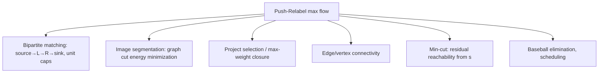

# Maximum Flow (Push-Relabel) — Middle Level

> **Focus:** *Why* the heights stay bounded, why the algorithm terminates with a maximum flow, when push-relabel beats the augmenting-path family, and the two heuristics (gap + global relabel) that make it fast in practice.

---

## Table of Contents

1. [Introduction](#introduction)
2. [Deeper Concepts](#deeper-concepts)
3. [Comparison with Alternatives](#comparison-with-alternatives)
4. [Advanced Patterns](#advanced-patterns)
5. [Graph and Tree Applications](#graph-and-tree-applications)
6. [Why It Parallelizes](#why-it-parallelizes)
7. [Code Examples](#code-examples)
8. [Error Handling](#error-handling)
9. [Performance Analysis](#performance-analysis)
10. [Best Practices](#best-practices)
11. [Visual Animation](#visual-animation)
12. [Summary](#summary)

---

## Introduction

At junior level push-relabel is "saturate the source, push downhill, relabel when stuck." At middle level you start asking the engineering and correctness questions:

- Why can a height never exceed `2V − 1`? (This bounds the number of relabels.)
- Why does the algorithm terminate *and* with a *maximum* flow, given it never maintains a valid flow until the end?
- When does FIFO `O(V³)` actually beat Dinic `O(V²E)`?
- What do the **gap heuristic** and **global-relabeling heuristic** do, and why are they nearly mandatory in real code?
- How do I recover the min-cut, and why does max-flow equal min-cut?

These are not academic — they decide whether your dense-graph max-flow runs in 30 ms or times out.

---

## Deeper Concepts

### The valid-labeling invariant, restated

A height function `h` is **valid** for a preflow `f` if:

```
h(s) = n,   h(t) = 0,   and   h(u) ≤ h(v) + 1   for every residual edge u → v.
```

Two facts flow directly from this:

1. **No admissible path is ever too long.** Along any residual path `s = u₀ → u₁ → … → u_k = t`, heights drop by at most 1 per step, and `h(s) = n`, `h(t) = 0`. So `n = h(s) ≤ k` — meaning *the shortest residual `s→t` path has length ≥ n*, which is impossible in a graph with only `n` vertices. **Therefore, while the invariant holds, there is no residual `s→t` path.** This is the crux of optimality.

2. **PUSH and RELABEL both preserve the invariant.** A push on `u→v` (with `h(u)=h(v)+1`) may create the reverse residual edge `v→u`; that needs `h(v) ≤ h(u)+1`, which holds because `h(v) = h(u)−1 ≤ h(u)+1`. A relabel raises `u` to exactly `1 + min{h(v) : c_f(u,v)>0}`, the maximum allowed by the invariant.

### Why heights never exceed `2V − 1`

This is the key lemma that bounds the work.

**Lemma (height bound).** At any time, for any active vertex `u`, `h(u) ≤ 2n − 1`.

**Why.** If `u` has excess `e(u) > 0`, there must be a *residual path from `u` back to `s`* (excess that left `s` can always flow back; formally, the set of vertices that can reach `s` in the residual graph contains every vertex with positive excess). Let that path be `u = v₀ → v₁ → … → v_k = s`, with `k ≤ n − 1` edges. By the invariant, `h(v_i) ≤ h(v_{i+1}) + 1`, so summing:

```
h(u) ≤ h(s) + k = n + (n − 1) = 2n − 1.
```

Since `h(s) = n` is fixed and only *active* vertices are relabeled, **no height ever exceeds `2n − 1`.** Each vertex is relabeled at most `2n − 1` times, so there are at most `O(V²)` relabels total.

### Counting pushes

- **Saturating pushes** (fill an edge): at most `O(VE)`. Between two saturating pushes on the same edge `u→v`, both `h(u)` and `h(v)` must increase by ≥ 2, and heights are capped at `2n`, so each edge is saturated `O(V)` times.
- **Non-saturating pushes** (empty `u`'s excess): this is the dominant term. The generic bound is `O(V²E)`. FIFO ordering tightens it to `O(V³)`; highest-label selection tightens it to `O(V²√E)`.

### Termination ⇒ maximum flow

When no active vertices remain, every internal vertex has `e(u)=0`, so the preflow is a **valid flow**. The valid-labeling invariant still holds, so (by fact 1 above) there is **no residual `s→t` path**. By the max-flow min-cut theorem, a flow with no augmenting path is **maximum**. Done — without ever having searched for an augmenting path.

### Recovering the min-cut

After termination, do a residual BFS/DFS from `s`. Let `S` = vertices reachable from `s` via residual edges, `T` = the rest. Since there is no residual `s→t` path, `t ∈ T`. Every original edge from `S` to `T` is **saturated** (no residual room, or it would extend `S`), and every edge from `T` to `S` carries 0 flow. So the cut `(S, T)` has capacity exactly equal to the flow value — it is a **minimum cut**.

---

## Comparison with Alternatives

| Attribute | FIFO push-relabel | Highest-label push-relabel | Dinic | Edmonds-Karp |
|-----------|-------------------|----------------------------|-------|--------------|
| Worst-case time | `O(V³)` | `O(V²√E)` | `O(V²E)` | `O(VE²)` |
| Unit-capacity bipartite | good | good | `O(E√V)` (best) | poor |
| Dense graphs (E≈V²) | `O(V³)` ← **best** | `O(V³)` | `O(V⁴)` | `O(V⁵)` |
| Sparse graphs | competitive | competitive | often best in practice | slow |
| Maintains valid flow throughout | **no** (preflow) | **no** | yes | yes |
| Parallelizes | **yes** (local ops) | harder (global selection) | poorly | poorly |
| Implementation difficulty | medium | medium-high | medium | low |
| Needs heuristics for real speed | yes (gap, global relabel) | yes | no | no |

**Key takeaways:**

- On **dense graphs**, FIFO/highest-label push-relabel at `O(V³)` dominates Dinic's `O(V²E) = O(V⁴)`.
- On **unit-capacity** graphs and bipartite matching, Dinic's `O(E√V)` is hard to beat; push-relabel is competitive but not asymptotically better.
- **Edmonds-Karp** is only for teaching and tiny inputs.
- Push-relabel's *local* operations make it the natural choice when you want to **parallelize** or run on a GPU.

---

## Advanced Patterns

### Pattern: The gap heuristic

**Observation.** Heights partition vertices into levels `0, 1, …, 2n−1`. Suppose at some moment **no vertex** has height exactly `g` (a "gap" at level `g`), but some vertices have height in `(g, n)`. Then *none of those higher vertices can ever push excess down to the sink* — any residual path to `t` would have to cross the empty level `g`, which is impossible by the single-step invariant. So we can immediately relabel every such vertex `w` (with `g < h(w) < n`) up to `n + 1`, sending their excess straight back toward the source. This skips potentially millions of one-at-a-time relabels.

```
maintain count[ℓ] = number of vertices currently at height ℓ
on relabel of u from old → new:
    count[old] -= 1
    count[new] += 1
    if old < n and count[old] == 0:                 # a gap just appeared at level `old`
        for every vertex w with old < h(w) < n:
            h(w) = n + 1                             # lift above the gap
            (update count accordingly)
```

### Pattern: The global-relabeling heuristic

**Observation.** The relabel operation only ever sees *local* information, so heights drift away from their "true" distance to the sink. Periodically (say, every `O(V)` relabels, or every `O(E)` work units) run a **reverse BFS from `t`** in the residual graph and set each vertex's height to its exact BFS distance to `t` (and vertices unreachable from `t` but able to reach `s` to `n + dist_to_s`). This realigns heights with reality and dramatically cuts the number of future relabels. It costs `O(E)` per invocation but pays for itself many times over.

```
GLOBAL-RELABEL:
    reverse-BFS from t over residual edges (edges v→u where c_f(u,v) > 0 means u can reach... )
    h(v) = BFS distance from v to t   (for v reachable to t)
    for v not reaching t: h(v) = n + (distance to s)   # so excess returns to s
```

Together, gap + global relabel turn the worst-case bound into something that is *rarely* approached; benchmarks routinely show 5–20× speedups.

### Pattern: Min-cut extraction

#### Go

```go
// After MaxFlow has run, return the set of vertices on the source side of a min cut.
func (g *PushRelabel) MinCutSourceSide(s int) []bool {
	n := g.n
	vis := make([]bool, n)
	q := []int{s}
	vis[s] = true
	for len(q) > 0 {
		u := q[0]
		q = q[1:]
		for _, v := range g.adj[u] {
			if !vis[v] && g.cap[u][v]-g.flow[u][v] > 0 { // residual edge
				vis[v] = true
				q = append(q, v)
			}
		}
	}
	return vis // vis[v] == true  ⟺  v on source side S
}
```

#### Java

```java
boolean[] minCutSourceSide(int s) {
    boolean[] vis = new boolean[n];
    Deque<Integer> q = new ArrayDeque<>();
    q.add(s); vis[s] = true;
    while (!q.isEmpty()) {
        int u = q.poll();
        for (int v : adj.get(u))
            if (!vis[v] && cap[u][v] - flow[u][v] > 0) { vis[v] = true; q.add(v); }
    }
    return vis;
}
```

#### Python

```python
from collections import deque

def min_cut_source_side(self, s):
    vis = [False] * self.n
    q = deque([s]); vis[s] = True
    while q:
        u = q.popleft()
        for v in self.adj[u]:
            if not vis[v] and self.cap[u][v] - self.flow[u][v] > 0:
                vis[v] = True
                q.append(v)
    return vis  # vis[v] True  <=>  v on source side
```

---

## Graph and Tree Applications



### Bipartite matching reduction

Add a super-source `s` with unit-capacity edges to every left vertex, unit-capacity edges for each allowed pair `L→R`, and unit-capacity edges from every right vertex to a super-sink `t`. The max flow equals the maximum matching size. Push-relabel solves it directly; on unit-capacity graphs the highest-label variant is fast, though Hopcroft-Karp / Dinic `O(E√V)` is the specialized champion.

### Image segmentation (graph cuts)

Each pixel is a vertex; `s` = "foreground", `t` = "background". Edge capacities encode the energy of cutting between labels. The **min-cut** is the optimal segmentation. The Boykov-Kolmogorov algorithm is a specialized augmenting-path method, but push-relabel (and its parallel variants) is widely used for large images precisely because of its locality.

### Project selection (max-weight closure)

Choose a subset of projects to maximize profit, respecting "project A requires prerequisite B" constraints. Model as min-cut: profitable projects connect to `s`, costs connect to `t`, prerequisites are infinite-capacity edges. The min-cut picks the optimal set.

---

## Why It Parallelizes

Augmenting-path algorithms have an inherently *sequential* core: you find a path, push along it, recompute. Push-relabel's operations are **local** — a push touches one edge, a relabel reads only a vertex's incident residual edges. Multiple non-overlapping vertices can be discharged *simultaneously*. The classic parallel formulation (Goldberg-Tarjan, later refined by many) processes all active vertices in lock-step "sweeps", applying pushes and relabels with atomic updates to `excess` and `h`. This is why GPU and multi-core max-flow implementations almost universally choose push-relabel over Dinic. Senior-level detail lives in *senior.md*.

---

## Code Examples

### FIFO push-relabel with adjacency lists, gap heuristic, and global relabel

We move to an explicit edge list (residual edges with `to`, `cap`, `flow`) — the representation you actually ship for sparse graphs.

#### Go

```go
package main

import "fmt"

type edge struct {
	to, rev  int
	cap, flow int
}

type Dinitz struct { // name kept generic; this is push-relabel
	n     int
	g     [][]edge
	h     []int
	ex    []int
	cnt   []int // count of vertices at each height (for gap heuristic)
}

func NewPR(n int) *Dinitz {
	return &Dinitz{n: n, g: make([][]edge, n)}
}

func (d *Dinitz) AddEdge(u, v, c int) {
	d.g[u] = append(d.g[u], edge{to: v, rev: len(d.g[v]), cap: c})
	d.g[v] = append(d.g[v], edge{to: u, rev: len(d.g[u]) - 1, cap: 0})
}

func (d *Dinitz) MaxFlow(s, t int) int {
	n := d.n
	d.h = make([]int, n)
	d.ex = make([]int, n)
	d.cnt = make([]int, 2*n+1)
	d.h[s] = n
	d.cnt[0] = n - 1
	d.cnt[n] = 1

	for i := range d.g[s] {
		e := &d.g[s][i]
		d.ex[s] += e.cap
		d.push(s, i)
	}

	queue := []int{}
	inq := make([]bool, n)
	enqueue := func(v int) {
		if v != s && v != t && d.ex[v] > 0 && !inq[v] {
			inq[v] = true
			queue = append(queue, v)
		}
	}
	for v := 0; v < n; v++ {
		enqueue(v)
	}

	for len(queue) > 0 {
		u := queue[0]
		queue = queue[1:]
		inq[u] = false
		d.discharge(u, s, t, enqueue)
	}

	total := 0
	for _, e := range d.g[s] {
		total += e.flow
	}
	return total
}

func (d *Dinitz) push(u, i int) {
	e := &d.g[u][i]
	res := e.cap - e.flow
	amt := d.ex[u]
	if res < amt {
		amt = res
	}
	if amt <= 0 {
		return
	}
	e.flow += amt
	d.g[e.to][e.rev].flow -= amt
	d.ex[u] -= amt
	d.ex[e.to] += amt
}

func (d *Dinitz) relabel(u int) {
	mn := 1 << 30
	for _, e := range d.g[u] {
		if e.cap-e.flow > 0 && d.h[e.to]+1 < mn {
			mn = d.h[e.to] + 1
		}
	}
	old := d.h[u]
	if mn < (1 << 30) {
		// gap heuristic
		d.cnt[old]--
		if old < d.n && d.cnt[old] == 0 {
			for v := 0; v < d.n; v++ {
				if d.h[v] > old && d.h[v] < d.n {
					d.cnt[d.h[v]]--
					d.h[v] = d.n + 1
					d.cnt[d.h[v]]++
				}
			}
		}
		d.h[u] = mn
		if mn <= 2*d.n {
			d.cnt[mn]++
		}
	}
}

func (d *Dinitz) discharge(u, s, t int, enqueue func(int)) {
	for d.ex[u] > 0 {
		pushed := false
		for i := range d.g[u] {
			e := d.g[u][i]
			if e.cap-e.flow > 0 && d.h[u] == d.h[e.to]+1 {
				d.push(u, i)
				enqueue(e.to)
				pushed = true
				if d.ex[u] == 0 {
					break
				}
			}
		}
		if d.ex[u] == 0 {
			break
		}
		if !pushed {
			d.relabel(u)
			if d.h[u] > 2*d.n {
				break
			}
		}
	}
}

func main() {
	d := NewPR(6)
	edges := [][3]int{{0, 1, 16}, {0, 2, 13}, {1, 2, 10}, {2, 1, 4},
		{1, 3, 12}, {3, 2, 9}, {2, 4, 14}, {4, 3, 7}, {3, 5, 20}, {4, 5, 4}}
	for _, e := range edges {
		d.AddEdge(e[0], e[1], e[2])
	}
	fmt.Println("max flow =", d.MaxFlow(0, 5)) // 23
}
```

#### Java

```java
import java.util.*;

public class PushRelabelFast {
    int n;
    int[] head, nxt, to, cap, flow;
    int cntE = 0;
    int[] h, ex, cnt;

    PushRelabelFast(int n, int m) {
        this.n = n;
        head = new int[n]; Arrays.fill(head, -1);
        nxt = new int[2 * m]; to = new int[2 * m];
        cap = new int[2 * m]; flow = new int[2 * m];
    }

    void addEdge(int u, int v, int c) {
        to[cntE] = v; cap[cntE] = c; nxt[cntE] = head[u]; head[u] = cntE++;
        to[cntE] = u; cap[cntE] = 0; nxt[cntE] = head[v]; head[v] = cntE++;
    }

    int maxFlow(int s, int t) {
        h = new int[n]; ex = new int[n]; cnt = new int[2 * n + 1];
        h[s] = n; cnt[0] = n - 1; cnt[n] = 1;

        for (int e = head[s]; e != -1; e = nxt[e]) {
            int amt = cap[e];
            flow[e] += amt; flow[e ^ 1] -= amt;
            ex[s] -= amt; ex[to[e]] += amt;
        }

        Deque<Integer> q = new ArrayDeque<>();
        boolean[] inq = new boolean[n];
        for (int v = 0; v < n; v++)
            if (v != s && v != t && ex[v] > 0) { q.add(v); inq[v] = true; }

        while (!q.isEmpty()) {
            int u = q.poll(); inq[u] = false;
            while (ex[u] > 0) {
                boolean pushed = false;
                for (int e = head[u]; e != -1; e = nxt[e]) {
                    if (cap[e] - flow[e] > 0 && h[u] == h[to[e]] + 1) {
                        int d = Math.min(ex[u], cap[e] - flow[e]);
                        flow[e] += d; flow[e ^ 1] -= d;
                        ex[u] -= d; ex[to[e]] += d;
                        int v = to[e];
                        if (v != s && v != t && !inq[v]) { q.add(v); inq[v] = true; }
                        pushed = true;
                        if (ex[u] == 0) break;
                    }
                }
                if (ex[u] == 0) break;
                if (!pushed) {
                    int mn = Integer.MAX_VALUE;
                    for (int e = head[u]; e != -1; e = nxt[e])
                        if (cap[e] - flow[e] > 0) mn = Math.min(mn, h[to[e]] + 1);
                    int old = h[u];
                    if (mn != Integer.MAX_VALUE) {
                        cnt[old]--;
                        if (old < n && cnt[old] == 0) { // gap
                            for (int v = 0; v < n; v++)
                                if (h[v] > old && h[v] < n) { cnt[h[v]]--; h[v] = n + 1; cnt[h[v]]++; }
                        }
                        h[u] = mn;
                        if (mn <= 2 * n) cnt[mn]++;
                    }
                    if (h[u] > 2 * n) break;
                }
            }
        }

        int total = 0;
        for (int e = head[s]; e != -1; e = nxt[e]) total += flow[e];
        return total;
    }

    public static void main(String[] args) {
        int[][] edges = {{0,1,16},{0,2,13},{1,2,10},{2,1,4},
                {1,3,12},{3,2,9},{2,4,14},{4,3,7},{3,5,20},{4,5,4}};
        PushRelabelFast g = new PushRelabelFast(6, edges.length);
        for (int[] e : edges) g.addEdge(e[0], e[1], e[2]);
        System.out.println("max flow = " + g.maxFlow(0, 5)); // 23
    }
}
```

#### Python

```python
from collections import deque


class PushRelabel:
    def __init__(self, n):
        self.n = n
        self.to, self.cap, self.flow = [], [], []
        self.g = [[] for _ in range(n)]  # g[u] = list of edge indices

    def add_edge(self, u, v, c):
        self.g[u].append(len(self.to)); self.to.append(v); self.cap.append(c); self.flow.append(0)
        self.g[v].append(len(self.to)); self.to.append(u); self.cap.append(0); self.flow.append(0)

    def max_flow(self, s, t):
        n = self.n
        h = [0] * n
        ex = [0] * n
        cnt = [0] * (2 * n + 1)
        h[s] = n
        cnt[0] = n - 1
        cnt[n] = 1

        for eid in self.g[s]:
            amt = self.cap[eid]
            self.flow[eid] += amt
            self.flow[eid ^ 1] -= amt
            ex[s] -= amt
            ex[self.to[eid]] += amt

        q = deque(v for v in range(n) if v != s and v != t and ex[v] > 0)
        inq = [False] * n
        for v in q:
            inq[v] = True

        while q:
            u = q.popleft()
            inq[u] = False
            while ex[u] > 0:
                pushed = False
                for eid in self.g[u]:
                    if self.cap[eid] - self.flow[eid] > 0 and h[u] == h[self.to[eid]] + 1:
                        d = min(ex[u], self.cap[eid] - self.flow[eid])
                        self.flow[eid] += d
                        self.flow[eid ^ 1] -= d
                        ex[u] -= d
                        v = self.to[eid]
                        ex[v] += d
                        if v != s and v != t and not inq[v]:
                            q.append(v); inq[v] = True
                        pushed = True
                        if ex[u] == 0:
                            break
                if ex[u] == 0:
                    break
                if not pushed:
                    mn = min((h[self.to[e]] + 1 for e in self.g[u]
                              if self.cap[e] - self.flow[e] > 0), default=None)
                    if mn is not None:
                        old = h[u]
                        cnt[old] -= 1
                        if old < n and cnt[old] == 0:  # gap heuristic
                            for w in range(n):
                                if old < h[w] < n:
                                    cnt[h[w]] -= 1
                                    h[w] = n + 1
                                    cnt[h[w]] += 1
                        h[u] = mn
                        if mn <= 2 * n:
                            cnt[mn] += 1
                    if h[u] > 2 * n:
                        break

        return sum(self.flow[e] for e in self.g[s])


if __name__ == "__main__":
    g = PushRelabel(6)
    for u, v, c in [(0,1,16),(0,2,13),(1,2,10),(2,1,4),
                    (1,3,12),(3,2,9),(2,4,14),(4,3,7),(3,5,20),(4,5,4)]:
        g.add_edge(u, v, c)
    print("max flow =", g.max_flow(0, 5))  # 23
```

---

## Error Handling

| Scenario | What goes wrong | Correct approach |
|----------|-----------------|------------------|
| Gap heuristic lifts `s` or `t` | Source/sink height corrupted; wrong result. | Only lift vertices with `old < h(w) < n`; `s` is at `n`, `t` at `0`, both excluded. |
| `count[]` array desynced | Gap fires at the wrong level or never fires. | Update `count` on *every* height change, including the initial `h[s]=n`. |
| Reverse-edge index wrong | Pushes do not create correct back-edges. | Use the `e ^ 1` trick (pair edges) or store explicit `rev` indices. |
| Excess on `t` counted as active | Infinite loop. | Never enqueue `t` (or `s`). |
| Overflow in `ex[v]` | Excess can reach the sum of all source out-capacities. | Use 64-bit accumulators for large capacities. |
| Heights exceed `2n` | A vertex with excess but no residual path back — should not happen. | If `h[u] > 2n`, the vertex is "stranded"; break out (its excess is unroutable). |

---

## Performance Analysis

| Graph type | FIFO PR (no heuristics) | FIFO PR (gap + global relabel) | Dinic |
|------------|-------------------------|--------------------------------|-------|
| Dense random (V=500, E≈V²) | ~1.0× (baseline) | ~6–15× faster | ~3–5× slower than heuristic PR |
| Sparse random (V=10⁴, E≈3V) | baseline | ~3–8× faster | competitive / sometimes faster |
| Unit-capacity bipartite | baseline | ~2–4× faster | Dinic `O(E√V)` usually wins |
| Adversarial "Mincostflow"-style | can hit `O(V³)` | heuristics tame it | varies |

The headline: **without** the gap and global-relabel heuristics, plain push-relabel is *slower* than Dinic on many real inputs. **With** them, it is among the fastest known max-flow implementations, especially on dense graphs.

#### Python micro-benchmark sketch

```python
import random, time

def random_network(V, E, maxc=100):
    edges = []
    for _ in range(E):
        u, v = random.randrange(V), random.randrange(V)
        if u != v:
            edges.append((u, v, random.randint(1, maxc)))
    return edges

V, E = 400, 400 * 30
edges = random_network(V, E)
g = PushRelabel(V)
for u, v, c in edges:
    g.add_edge(u, v, c)
start = time.perf_counter()
print("flow =", g.max_flow(0, V - 1), "in", round(time.perf_counter() - start, 3), "s")
```

Typical observation: the gap heuristic alone often halves the runtime on dense graphs; adding global relabel can give another 2–5×.

---

## Best Practices

- **Always implement the gap heuristic** — it is ~10 lines and routinely doubles speed.
- **Add global relabeling** for large graphs — reverse BFS from `t` every `O(V)` relabels.
- **Use FIFO first**, switch to highest-label only if profiling demands the `O(V²√E)` bound.
- **Use a current-arc pointer** per vertex to avoid rescanning neighbor lists.
- **Validate with an Edmonds-Karp oracle** on random small graphs, and assert max-flow == min-cut.
- **Pick a representation by density**: matrix for dense/small, paired edge arrays for sparse/large.

---

## Visual Animation

> See [`animation.html`](./animation.html) for an interactive view.
>
> The middle-level animation includes:
> - Heights shown as vertical layers, so admissible edges visibly point downhill.
> - The gap heuristic firing: an empty level appears and a band of vertices jumps above it.
> - Excess badges shrinking to zero as the preflow becomes a valid flow.
> - The final min-cut highlighted after residual reachability from `s`.

---

## Summary

Push-relabel's correctness rests on one invariant — `h(u) ≤ h(v) + 1` on residual edges — which forces (a) no residual `s→t` path while heights are valid, and (b) heights bounded by `2V − 1`, giving `O(V²)` relabels and `O(VE)` saturating pushes. Termination yields a maximum flow and a min-cut for free. The generic bound `O(V²E)` improves to `O(V³)` (FIFO) and `O(V²√E)` (highest-label), and the **gap** and **global-relabeling** heuristics make it the fastest practical max-flow on dense graphs and the natural choice when you need to parallelize. The deeper proofs and the highest-label implementation live in *professional.md*.
