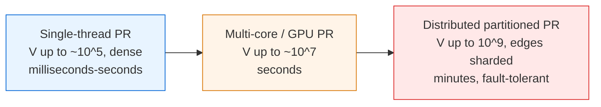
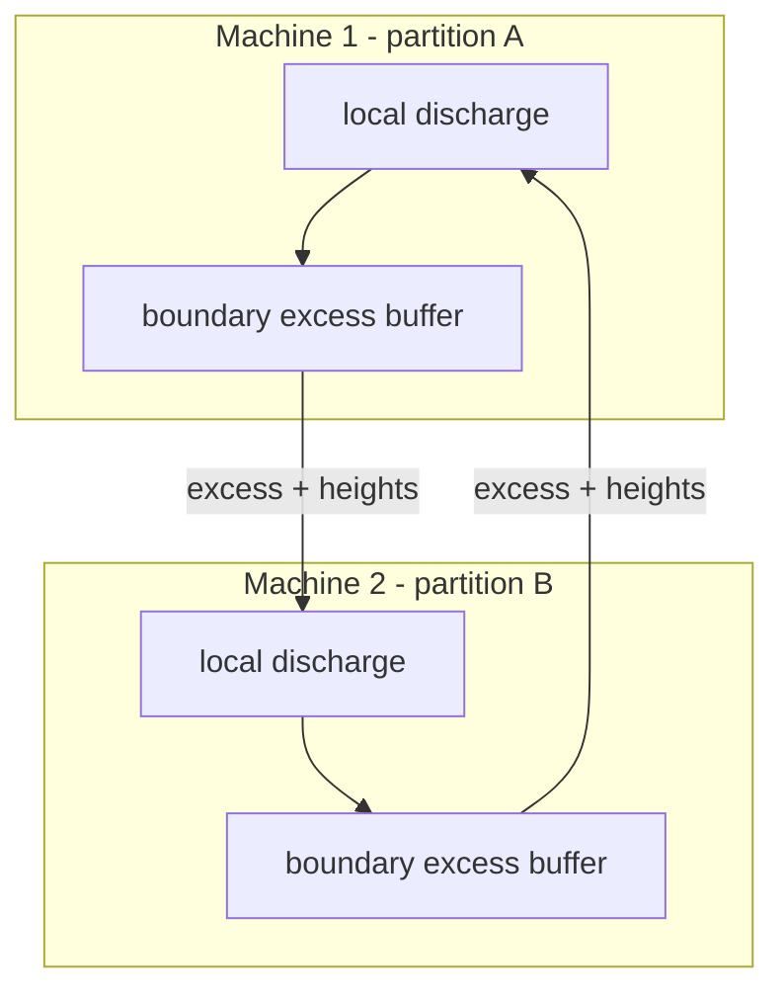

# Maximum Flow (Push-Relabel) — Senior Level

> Push-relabel is the max-flow algorithm you reach for when the graph is dense, the flow values are enormous, or you need to spread the work across cores or a GPU. Its operations are *local*, which is exactly what makes it the backbone of parallel and distributed max-flow — and exactly what makes its failure modes (excess accounting, height drift, overflow, non-determinism under concurrency) subtle in production.

## Table of Contents
1. [Introduction](#1-introduction)
2. [System Design with Push-Relabel](#2-system-design-with-push-relabel)
3. [Distributed and Parallel Push-Relabel](#3-distributed-and-parallel-push-relabel)
4. [Concurrency and Synchronization](#4-concurrency-and-synchronization)
5. [Comparison with Alternatives at Scale](#5-comparison-with-alternatives-at-scale)
6. [Architecture Patterns](#6-architecture-patterns)
7. [Code Examples](#7-code-examples)
8. [Observability](#8-observability)
9. [Failure Modes](#9-failure-modes)
10. [Capacity Planning](#10-capacity-planning)
11. [Summary](#11-summary)

---

## 1. Introduction

At the senior level the question is not "how does relabel work" but "where does max-flow sit in my system, what is its failure surface, and how do I run it at the scale the business needs?". Push-relabel matters here for one structural reason: **its core operations touch only a vertex and its incident edges.** There is no global path to find, no BFS layering that must complete before the next push. That locality is the single most important property when you move from a single-threaded textbook run to:

- a multi-core implementation discharging many active vertices at once,
- a GPU kernel where thousands of vertices are processed per sweep,
- a distributed graph partitioned across machines where each partition pushes locally and exchanges excess at the boundary.

The interesting senior-level decisions are therefore architectural:

1. Is max-flow a *batch* computation (segment this image, select this project set) or an *online* one (recompute as edges change)?
2. Single-node multi-core, or partitioned across machines?
3. How do you synchronize `excess` and `h` without serializing the whole thing behind one lock?
4. How do you make the result *deterministic* and *reproducible* when push order is nondeterministic?
5. How do you observe progress on a computation that has no notion of "percent done" until it suddenly finishes?

This document answers those in production terms.

---

## 2. System Design with Push-Relabel

### 2.1 Three deployment tiers



| Tier | When right | When wrong |
| --- | --- | --- |
| Single-thread push-relabel (with gap + global relabel) | Most batch jobs; graph fits in RAM; dense; needs to finish in seconds. | Graph does not fit in RAM, or latency budget demands parallelism. |
| Multi-core / GPU push-relabel | Large dense graphs (image segmentation on 4K frames, large bipartite). | Sparse graphs where a tuned single-thread Dinic is already fast enough. |
| Distributed partitioned push-relabel | Graph exceeds one machine's memory; web-scale connectivity. | Graph fits on one box — the coordination overhead is not worth it. |

The most expensive mistake is jumping to a distributed flow engine when a single-node push-relabel with the two heuristics would have solved the problem in 200 ms.

### 2.2 What push-relabel actually buys you over Dinic

Dinic alternates two *global* phases — a BFS to build the level graph, then a blocking-flow DFS. Both phases must complete before the next begins, which is hard to parallelize. Push-relabel has no phases: every active vertex can, in principle, be worked on independently. On dense graphs push-relabel is also asymptotically better (`O(V³)` / `O(V²√E)` vs Dinic's `O(V²E) = O(V⁴)`). Senior design exploits the locality; the asymptotics are a bonus.

---

## 3. Distributed and Parallel Push-Relabel

### 3.1 Why it parallelizes and Dinic does not

The unit of work in push-relabel is `discharge(u)`: push `u`'s excess along admissible edges, relabel when stuck. Two vertices `u` and `w` that do not share an edge can be discharged simultaneously as long as updates to shared neighbors' `excess` are atomic. There is no global structure that must be consistent mid-sweep — only the per-vertex `h` and `excess`. Contrast Dinic, whose blocking-flow phase is a single DFS that is inherently sequential.

### 3.2 The synchronous (lock-step) parallel formulation

The Goldberg-Tarjan parallel algorithm, refined by Anderson-Setubal and later by GPU implementations (Hong, He-Hong, and others), runs in sweeps:

```
repeat until no active vertices:
    PHASE 1 (push):   for all active u in parallel:
                          for each admissible edge (u,v): tentatively push
    PHASE 2 (relabel): for all active u with excess but no admissible edge in parallel:
                          compute new height from a snapshot of neighbor heights
    apply all pushes and relabels atomically
```

Key engineering points:

- Heights are read from the *previous* sweep's snapshot to avoid races; this can cause a vertex to be relabeled "too high" occasionally, which is harmless (still valid) and self-corrects.
- `excess` updates use atomic fetch-and-add.
- The number of sweeps is `O(V²)` in the worst case but far fewer in practice with global relabeling applied periodically by a single thread.

### 3.3 Distributed partitioned push-relabel

Partition vertices across machines (by graph partitioner, e.g., METIS, to minimize cut edges). Each machine runs local discharges. Excess that must cross a partition boundary is sent as a message to the owning machine, which applies it to the boundary vertex's `excess`. Heights are exchanged at boundaries each round. This is the model used by large-scale graph-cut systems and by frameworks like the distributed max-flow in some computer-vision pipelines.



Trade-offs: communication is proportional to the *edge cut* between partitions, so partition quality dominates performance. Global relabeling becomes a distributed reverse-BFS — expensive but occasionally essential to prevent height drift across the whole graph.

---

## 4. Concurrency and Synchronization

### 4.1 The shared state

Three arrays are shared: `h[]` (heights), `excess[]`, and the residual `flow[]` per edge. A push on `u→v` reads `h[u], h[v]`, mutates `flow` on the edge pair, and mutates `excess[u], excess[v]`.

### 4.2 Synchronization strategies

| Strategy | Pros | Cons |
| --- | --- | --- |
| Single global lock | trivially correct | serializes everything; no speedup |
| Per-vertex locks (lock `u` then the lower-id neighbor) | fine-grained | deadlock risk; lock ordering required |
| Atomic excess + snapshot heights (lock-free) | scales on many cores | relabels may overshoot; needs careful memory ordering |
| Asynchronous (each thread owns a region, steals work) | best throughput | hardest to reason about; nondeterministic |

The lock-free atomic approach is the standard for high-performance CPU and GPU implementations. The trick that makes it safe: pushes only move excess *downhill* (`h[u] = h[v]+1`), and even if a concurrent relabel changes `h[v]`, the worst case is a wasted push attempt that fails its condition check — never a corrupted invariant, because each push re-validates `h[u] == h[v]+1` atomically (e.g., via compare-and-swap on the edge).

### 4.3 Determinism

Parallel push-relabel computes the *same max-flow value* every time (it is unique), but the *flow assignment* and the discovered min-cut can differ run to run because push order differs. If downstream consumers depend on a specific flow decomposition (e.g., which augmenting routes were used), you must canonicalize: sort edges deterministically and prefer lowest-index admissible edge, or post-process the flow into a canonical decomposition.

### 4.4 Work stealing

Active vertices are the work items. A per-thread queue of active vertices with work stealing (idle thread steals from the busiest queue) keeps cores busy. This mirrors the runtime-scheduler pattern (Go's per-P run queues, Tokio multi-thread). The active set shrinks toward the end, so stealing matters most in the tail.

---

## 5. Comparison with Alternatives at Scale

| Algorithm | Worst case | Parallelizable | Dense graphs | Online/dynamic | Notes |
| --- | --- | --- | --- | --- | --- |
| FIFO push-relabel | `O(V³)` | **yes** | **best** | partial | Default for dense batch. |
| Highest-label push-relabel | `O(V²√E)` | harder (global selection) | best | partial | Fastest single-thread on many inputs. |
| Dinic | `O(V²E)` | poorly | weak | no | Best on unit-capacity / bipartite (`O(E√V)`). |
| Boykov-Kolmogorov | exponential worst case, fast in practice | poorly | great on vision graphs | no | Vision-specific augmenting paths. |
| Parallel/GPU push-relabel | `O(V²)` sweeps | **yes** | great | no | The reason PR dominates large segmentation. |
| Incremental max-flow | depends | partial | — | **yes** | Recompute after small capacity changes. |

Push-relabel wins on **dense graphs**, on **parallel hardware**, and as the engine behind **graph-cut segmentation** at scale. Dinic still wins on unit-capacity bipartite matching. For *dynamic* graphs (capacities changing online), specialized incremental methods reuse the previous flow and only re-discharge affected regions — push-relabel's locality helps here too.

---

## 6. Architecture Patterns

### 6.1 Batch max-flow as a service

```
   request (graph spec)        +----------------+        result (flow value,
 ───────────────────────────►  |  Flow worker   |  ────► min-cut, flow edges)
                               |  push-relabel  |
                               |  + heuristics  |
                               +----------------+
                                       |
                                       v
                                checkpoint/metrics
```

Stateless workers pull jobs from a queue, run push-relabel, write the result. Bound input size; reject graphs that will not fit in the worker's memory budget. Cache results keyed by a hash of the (graph, source, sink) tuple — identical segmentation requests recur.

### 6.2 Incremental recomputation

When only a few capacities change (e.g., a user nudges a segmentation seed), do **not** recompute from scratch. Keep the previous flow and heights, adjust the changed edges' residuals, re-mark affected vertices as active, and re-discharge. This is orders of magnitude faster than a cold run and is the standard pattern in interactive graph-cut tools.

### 6.3 GPU offload

For very large dense graphs (4K/8K image segmentation, dense bipartite), offload the discharge sweeps to a GPU kernel. The CPU periodically runs the global-relabel reverse-BFS (hard to do well on GPU) and ships updated heights back. This CPU-orchestrates-GPU pattern is the workhorse of production vision pipelines.

### 6.4 Streaming / external-memory

If the graph exceeds RAM, partition it and stream partitions through memory, keeping boundary excess and heights resident. This trades I/O for capacity; push-relabel's locality means a partition can make progress with only its own vertices and boundary state loaded.

---

## 7. Code Examples

### 7.1 Go — parallel discharge with atomics (sketch)

```go
package prparallel

import (
	"sync"
	"sync/atomic"
)

type Graph struct {
	n    int
	g    [][]Edge
	h    []int64 // atomic heights
	ex   []int64 // atomic excess
}

type Edge struct {
	to, rev int
	cap     int64
	flow    int64 // protected by atomic ops on residual via CAS in real code
}

// Sweep discharges all currently-active vertices using a worker pool.
// Heights are read from a snapshot taken at the start of the sweep.
func (gr *Graph) Sweep(s, t int, active []int, workers int) []int {
	snap := make([]int64, gr.n)
	for i := range snap {
		snap[i] = atomic.LoadInt64(&gr.h[i])
	}

	var mu sync.Mutex
	nextActive := []int{}
	var wg sync.WaitGroup
	ch := make(chan int, len(active))
	for _, v := range active {
		ch <- v
	}
	close(ch)

	for w := 0; w < workers; w++ {
		wg.Add(1)
		go func() {
			defer wg.Done()
			local := []int{}
			for u := range ch {
				gr.discharge(u, s, t, snap, &local)
			}
			mu.Lock()
			nextActive = append(nextActive, local...)
			mu.Unlock()
		}()
	}
	wg.Wait()
	return dedup(nextActive)
}

// discharge pushes along admissible edges using snapshot heights and atomic excess.
func (gr *Graph) discharge(u, s, t int, snap []int64, newlyActive *[]int) {
	for atomic.LoadInt64(&gr.ex[u]) > 0 {
		pushed := false
		for i := range gr.g[u] {
			e := &gr.g[u][i]
			res := e.cap - atomic.LoadInt64(&e.flow)
			if res > 0 && snap[u] == snap[e.to]+1 {
				amt := atomic.LoadInt64(&gr.ex[u])
				if res < amt {
					amt = res
				}
				if amt <= 0 {
					continue
				}
				atomic.AddInt64(&e.flow, amt)
				atomic.AddInt64(&gr.g[e.to][e.rev].flow, -amt)
				atomic.AddInt64(&gr.ex[u], -amt)
				atomic.AddInt64(&gr.ex[e.to], amt)
				if e.to != s && e.to != t {
					*newlyActive = append(*newlyActive, e.to)
				}
				pushed = true
			}
		}
		if !pushed {
			// relabel using snapshot; safe but may overshoot — corrected next sweep
			mn := int64(1) << 40
			for i := range gr.g[u] {
				e := &gr.g[u][i]
				if e.cap-atomic.LoadInt64(&e.flow) > 0 && snap[e.to]+1 < mn {
					mn = snap[e.to] + 1
				}
			}
			if mn < (int64(1) << 40) {
				atomic.StoreInt64(&gr.h[u], mn)
			}
			*newlyActive = append(*newlyActive, u)
			return
		}
	}
}

func dedup(in []int) []int {
	seen := map[int]bool{}
	out := in[:0]
	for _, x := range in {
		if !seen[x] {
			seen[x] = true
			out = append(out, x)
		}
	}
	return out
}
```

This is a *sketch* — production code uses CAS on the edge to validate `h[u]==h[v]+1` atomically with the push, and a lock-free active set. The point is that the structure is a parallel loop over active vertices, not a sequential path search.

### 7.2 Java — bounded worker pool driving sweeps

```java
import java.util.*;
import java.util.concurrent.*;
import java.util.concurrent.atomic.*;

public final class ParallelPushRelabel {
    final int n;
    final AtomicIntegerArray h, ex;
    // edge arrays omitted for brevity (paired residual edges)
    final ExecutorService pool;

    ParallelPushRelabel(int n, int threads) {
        this.n = n;
        this.h = new AtomicIntegerArray(n);
        this.ex = new AtomicIntegerArray(n);
        this.pool = Executors.newFixedThreadPool(threads);
    }

    // One synchronous sweep: discharge every active vertex with snapshot heights.
    List<Integer> sweep(int s, int t, List<Integer> active) throws Exception {
        int[] snap = new int[n];
        for (int i = 0; i < n; i++) snap[i] = h.get(i);

        Queue<Integer> next = new ConcurrentLinkedQueue<>();
        List<Callable<Void>> tasks = new ArrayList<>();
        for (int u : active) {
            final int uu = u;
            tasks.add(() -> { discharge(uu, s, t, snap, next); return null; });
        }
        pool.invokeAll(tasks);
        return new ArrayList<>(new LinkedHashSet<>(next)); // dedup, preserve order
    }

    void discharge(int u, int s, int t, int[] snap, Queue<Integer> next) {
        // push along admissible edges (snap[u] == snap[v]+1) using atomic excess;
        // relabel with snapshot heights when stuck; enqueue newly active vertices.
        // (edge iteration omitted; identical structure to single-thread version)
    }

    void shutdown() { pool.shutdown(); }
}
```

### 7.3 Python — orchestration loop (single-thread engine, batched sweeps)

Python's GIL makes true thread parallelism pointless for CPU work, so the realistic Python pattern is a clean *single-thread engine* exposed as a service, with `global_relabel` available as a standalone realignment step; heavy lifting is delegated to a native extension or to multiprocessing over partitions.

Note on interleaving: applying a global relabel *mid-discharge* of one vertex is fiddly (it can leave the discharge loop chasing a height that just moved). The robust pattern is to run global relabel **between full FIFO passes** — recompute heights from a residual reverse-BFS, then rebuild the active set from scratch. The engine below keeps the inner loop simple (FIFO push/relabel, verified to return 23 on the CLRS network) and exposes `global_relabel` as a separately-callable method.

```python
from collections import deque


class PushRelabelEngine:
    """Single-thread FIFO push-relabel engine.
    In production, the inner loop is a C/Cython/Rust extension; this is the contract.
    `global_relabel` is exposed for callers that want to realign heights between passes."""

    def __init__(self, n):
        self.n = n
        self.to, self.cap, self.flow = [], [], []
        self.g = [[] for _ in range(n)]

    def add_edge(self, u, v, c):
        self.g[u].append(len(self.to)); self.to.append(v); self.cap.append(c); self.flow.append(0)
        self.g[v].append(len(self.to)); self.to.append(u); self.cap.append(0); self.flow.append(0)

    def global_relabel(self, s, t, h):
        """Reverse BFS from t over residual edges; pin source at n.
        Vertices that cannot reach t keep a safe height (>= n) so their excess drains to s."""
        n = self.n
        INF = 2 * n
        old = h[:]
        for v in range(n):
            h[v] = INF
        h[t] = 0
        dq = deque([t])
        while dq:
            v = dq.popleft()
            for eid in self.g[v]:
                u = self.to[eid]
                if self.cap[eid ^ 1] - self.flow[eid ^ 1] > 0 and h[u] == INF:
                    h[u] = h[v] + 1
                    dq.append(u)
        h[s] = n
        for v in range(n):
            if h[v] == INF:
                h[v] = max(old[v], n)

    def max_flow(self, s, t):
        n = self.n
        h = [0] * n
        ex = [0] * n
        h[s] = n
        for eid in self.g[s]:
            amt = self.cap[eid]
            self.flow[eid] += amt; self.flow[eid ^ 1] -= amt
            ex[s] -= amt; ex[self.to[eid]] += amt
        q = deque(v for v in range(n) if v != s and v != t and ex[v] > 0)
        inq = [False] * n
        for v in q:
            inq[v] = True
        while q:
            u = q.popleft(); inq[u] = False
            while ex[u] > 0:
                pushed = False
                for eid in self.g[u]:
                    if self.cap[eid] - self.flow[eid] > 0 and h[u] == h[self.to[eid]] + 1:
                        d = min(ex[u], self.cap[eid] - self.flow[eid])
                        self.flow[eid] += d; self.flow[eid ^ 1] -= d
                        ex[u] -= d; v = self.to[eid]; ex[v] += d
                        if v != s and v != t and not inq[v]:
                            q.append(v); inq[v] = True
                        pushed = True
                        if ex[u] == 0:
                            break
                if ex[u] == 0:
                    break
                if not pushed:
                    mn = min((h[self.to[e]] + 1 for e in self.g[u]
                              if self.cap[e] - self.flow[e] > 0), default=None)
                    if mn is None:
                        break
                    h[u] = mn
        return sum(self.flow[e] for e in self.g[s])
```

---

## 8. Observability

A max-flow run is opaque until it finishes. Instrument it.

| Metric | Type | Why |
| --- | --- | --- |
| `pr_active_vertices` | gauge | Size of the active set; should trend to 0. A plateau means stalling. |
| `pr_relabels_total` | counter | Approaching `2V²` worst case ⇒ heuristics not firing. |
| `pr_saturating_pushes_total` | counter | Bounded by `O(VE)`; growth tells you about edge churn. |
| `pr_nonsaturating_pushes_total` | counter | The dominant term; watch for blowup. |
| `pr_global_relabels_total` | counter | How often the reverse-BFS ran. |
| `pr_max_height` | gauge | Approaching `2V` ⇒ stranded excess returning to source. |
| `pr_flow_value` | gauge | Final answer; for online graphs, current best. |
| `pr_runtime_seconds` | histogram | Per-job latency; alert on tail. |

The single most useful signal is `pr_active_vertices` over time. A healthy run shows it climbing after the source saturation, then decaying. A flat or oscillating plot means height drift — fire a global relabel.

Trace tags per job: `V`, `E`, `density`, `source`, `sink`, `variant`, `heuristics_on`.

---

## 9. Failure Modes

### 9.1 Integer overflow on excess

Excess at a vertex can transiently equal the **sum of all source out-capacities**. With many high-capacity edges this overflows 32-bit accumulators silently, producing a wrong (often negative) flow. Mitigation: 64-bit excess and flow accumulators; validate `sum(cap out of s)` fits the type.

### 9.2 Height drift / stalling

Without periodic global relabeling, local relabels let heights diverge from true distances, and the active set stops shrinking efficiently — runtime balloons toward the `O(V³)` worst case. Mitigation: global relabel every `O(V)` relabels; alert when `pr_relabels_total` outpaces the model.

### 9.3 Non-determinism under parallelism

Different push orders yield different flow decompositions and different min-cuts (the value is unique, the witness is not). Downstream consumers that assume a stable cut break. Mitigation: canonicalize the cut (prefer lowest-index reachable set) or pin to single-thread for reproducible runs.

### 9.4 Lost pushes under bad synchronization

A racing push and relabel can both read a stale height and apply an inconsistent update, corrupting `excess` so total excess no longer conserves. Mitigation: CAS-validate `h[u]==h[v]+1` atomically with the residual update; assert global excess conservation in tests (`sum(ex over internal) + flow_to_t == flow_out_of_s`).

### 9.5 Boundary deadlock in distributed runs

Two partitions each wait for the other to send boundary excess before progressing. Mitigation: asynchronous message passing with no blocking waits; each partition makes whatever local progress it can each round.

### 9.6 Memory blowup on dense matrices

The adjacency-matrix representation is `O(V²)`. At `V = 10⁵` that is `10¹⁰` cells — impossible. Mitigation: always use adjacency lists / paired edge arrays for large graphs; matrices only for `V ≲ 2000`.

### 9.7 Pathological adversarial inputs

Crafted networks can force near-worst-case relabel counts even with heuristics. Mitigation: cap runtime, fall back to a different algorithm (Dinic) on timeout, and log the offending graph for analysis.

---

## 10. Capacity Planning

### 10.1 Memory

- Paired edge arrays: `~4` ints per directed edge (`to`, `cap`, `flow`, plus list overhead) → `~32` bytes per undirected pair on a 64-bit build.
- Per-vertex: `h`, `excess`, current-arc pointer, queue membership → `~32` bytes.
- For `V = 10⁷`, `E = 5×10⁷`: vertices ~0.3 GB, edges ~3.2 GB → fits in a 8–16 GB box. Beyond that, partition.

### 10.2 Time

- Single-thread, dense, with heuristics: empirically near-linear in `E` for many real graphs; expect `~10⁷–10⁸` edge-relaxations/sec in a compiled language.
- `V = 10⁴` dense (`E ≈ 10⁸`): sub-second to a few seconds compiled; tens of seconds in pure Python (use a native engine).
- GPU: `10×–50×` over single CPU thread on large dense segmentation graphs.

### 10.3 Sizing example

Interactive 4K image segmentation: `V ≈ 8.3M` pixels, `E ≈ 4V ≈ 33M` (4-neighbor grid) plus terminal edges. Single-thread compiled push-relabel with heuristics: ~1–3 s cold. With incremental recomputation on a seed nudge: ~50–200 ms. GPU: real-time. Pick GPU for live editing, single-thread incremental for batch refinement.

### 10.4 When to leave the single node

Move to partitioned/distributed when:

- `V·constant + E·constant` exceeds RAM (roughly `E > 10⁹`).
- You need to segment many large graphs concurrently beyond one box's throughput.
- Latency budget demands more parallelism than one node's cores provide and a GPU is unavailable.

Until then, a single-node push-relabel with gap + global relabel is the right answer.

---

## 11. Summary

- Push-relabel's value at scale is its **locality**: discharge touches one vertex and its edges, so it parallelizes across cores, GPUs, and machines where Dinic's phased global structure cannot.
- Start single-thread with gap + global relabel; it solves most batch jobs in seconds. Move to GPU for large dense (segmentation) work, and to partitioned/distributed only when the graph exceeds one machine.
- Parallel correctness hinges on atomic `excess` updates and CAS-validated pushes; stale-height relabels are harmless and self-correct.
- The flow *value* is unique and deterministic; the flow *assignment* and min-cut are not under parallelism — canonicalize if downstream depends on the witness.
- Watch `active_vertices`, `relabels_total`, and `max_height`. Fire global relabeling on drift. Use 64-bit accumulators to avoid silent overflow.
- Plan memory by edge count; use paired edge arrays, never matrices, for large graphs; partition past one machine's RAM.

References to study further: Goldberg-Tarjan (1988); Cherkassky-Goldberg experimental study of push-relabel heuristics (1997); Anderson-Setubal parallel push-relabel; He-Hong GPU push-relabel; Boykov-Kolmogorov for the vision contrast; Galil-Tardos and the lineage of theoretical max-flow bounds.
