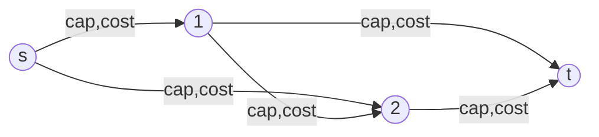

# Min-Cost Max-Flow — Junior Level

> **One-line summary:** Min-Cost Max-Flow (MCMF) finds, among *all* maximum flows from a source `s` to a sink `t`, the one whose total cost is smallest, where every edge has both a capacity (how much can flow) and a cost-per-unit (what each unit of flow pays). The classic algorithm is **Successive Shortest Paths (SSP)**: repeatedly push flow along the *cheapest* `s→t` path in the residual graph until no augmenting path remains.

---

## Table of Contents

1. [Introduction](#introduction)
2. [Prerequisites](#prerequisites)
3. [Glossary](#glossary)
4. [Core Concepts](#core-concepts)
5. [Big-O Summary](#big-o-summary)
6. [Real-World Analogies](#real-world-analogies)
7. [Pros & Cons](#pros--cons)
8. [Step-by-Step Walkthrough](#step-by-step-walkthrough)
9. [Code Examples](#code-examples)
10. [Coding Patterns](#coding-patterns)
11. [Error Handling](#error-handling)
12. [Performance Tips](#performance-tips)
13. [Best Practices](#best-practices)
14. [Edge Cases & Pitfalls](#edge-cases--pitfalls)
15. [Common Mistakes](#common-mistakes)
16. [Cheat Sheet](#cheat-sheet)
17. [Visual Animation](#visual-animation)
18. [Summary](#summary)
19. [Further Reading](#further-reading)

---

## Introduction

Imagine you run a delivery company. You have a network of roads. Each road has a **capacity** — how many trucks per hour it can carry — and a **cost** — the toll plus fuel per truck. You want to move as many trucks as possible from the warehouse (`s`) to the city (`t`). That is the classic **maximum-flow** problem, covered in the sibling topic *Max-Flow (Edmonds–Karp / Dinic)*.

But here is the twist: usually there are **many different ways** to achieve the same maximum number of trucks per hour. Some routes are cheap, some are expensive. Among all the ways to ship the maximum amount, **which one costs the least?** That is the **Min-Cost Max-Flow** problem.

So MCMF answers two questions *at once*:

1. **How much** can I push from `s` to `t`? (the max-flow value)
2. **What is the cheapest** way to push that maximum amount? (the min cost)

A close variant — and the one that shows up most in practice — is **min-cost flow of a target value `k`**: instead of pushing the maximum, you only need `k` units, and you want the cheapest way to move exactly `k` units. The same algorithm solves it: you just stop once `k` units have been shipped.

MCMF is the engine behind the **Assignment Problem** (match `n` workers to `n` jobs at minimum total cost — the Hungarian algorithm is a specialised version), **transportation and logistics** (warehouses → stores), **min-cost bipartite matching**, and many scheduling problems. It is one of the most powerful "modeling hammers" in competitive programming and operations research: a surprising number of optimization problems become trivial once you spot that they are secretly a min-cost flow.

The most common algorithm — and the one this file teaches — is **Successive Shortest Paths (SSP)**. The idea is beautifully simple:

> Repeatedly find the **cheapest** path from `s` to `t` in the residual graph (using a shortest-path algorithm where *cost* plays the role of *distance*), and push as much flow as possible along it. Repeat until no `s→t` path remains.

Because we always extend the flow along the cheapest available path, the total cost stays minimal at every step. The shortest-path subroutine can be **Bellman-Ford / SPFA** (which tolerates the negative-cost edges that appear in the residual graph) — that is what we use in this junior file. More advanced versions use **Dijkstra with potentials**, covered in [`middle.md`](./middle.md).

---

## Prerequisites

Before reading this file you should be comfortable with:

- **Maximum flow basics** — the residual graph, augmenting paths, and the idea of a reverse edge. See the sibling topic *Max-Flow (Edmonds–Karp / Dinic)*. This is the single most important prerequisite.
- **Shortest paths** — both **BFS** (unweighted), **Dijkstra** (non-negative weights), and especially **Bellman-Ford** (handles negative weights). MCMF leans on shortest paths heavily.
- **Graph representation** — adjacency lists, ideally an **edge list with paired reverse edges** (the `e ^ 1` trick).
- **Big-O notation** — you should read `O(V·E·F)` without flinching.

Optional but helpful:

- Familiarity with the **Ford–Fulkerson / Edmonds–Karp** framework, since SSP is literally Ford–Fulkerson where "find any augmenting path" becomes "find the *cheapest* augmenting path."
- Awareness of **bipartite matching** (sibling topic 19) — many MCMF applications reduce to weighted matching.

---

## Glossary

| Term | Meaning |
|------|---------|
| **Flow network** | A directed graph with a source `s`, a sink `t`, and per-edge capacities. |
| **Capacity `cap(u,v)`** | The maximum number of units of flow edge `(u,v)` can carry. |
| **Cost `cost(u,v)`** | The price paid *per unit of flow* sent along edge `(u,v)`. |
| **Flow `f(u,v)`** | How many units currently travel along `(u,v)`; `0 ≤ f ≤ cap`. |
| **Total cost** | `Σ f(u,v) · cost(u,v)` over all edges. The quantity MCMF minimizes. |
| **Max flow** | The largest total amount that can travel from `s` to `t`. |
| **Residual graph** | The "what moves are still legal" graph: forward residual = `cap − f`, plus reverse edges with residual = `f`. |
| **Reverse / back edge** | A virtual edge `(v,u)` with capacity equal to current flow and **negated cost** `−cost(u,v)`; pushing flow on it *cancels* prior flow. |
| **Augmenting path** | An `s→t` path in the residual graph with positive capacity on every edge. |
| **Successive Shortest Paths (SSP)** | The algorithm: repeatedly augment along the cheapest `s→t` residual path. |
| **Potential `h[v]`** | A per-vertex value used to keep edge costs non-negative so Dijkstra can be used (covered in `middle.md`). |
| **Bottleneck** | The minimum residual capacity along an augmenting path — how much you can push. |
| **Negative cycle** | A cycle whose total cost is negative; its existence in the residual graph means the flow is *not* min-cost. |

---

## Core Concepts

### 1. Two numbers per edge: capacity AND cost

In plain max-flow each edge carries one number, its capacity. In MCMF each edge carries **two**: a capacity `cap` and a per-unit cost `cost`. If you send `f` units along an edge, you pay `f · cost` and you consume `f` of its capacity.

```
edge (u → v):  cap = 3,  cost = 2
send 2 units:  uses 2 of the 3 capacity, pays 2 × 2 = 4
```

### 2. The residual graph and the negated reverse edge

Just like in max-flow, every edge `(u,v)` gets a paired **reverse edge** `(v,u)`. The key MCMF detail: the reverse edge has **negated cost**.

```
forward edge (u→v): residual cap = cap − f,  cost = +c
reverse edge (v→u): residual cap = f,        cost = −c
```

Why negate? Pushing flow on the reverse edge *undoes* one unit of flow on the forward edge — so it should *refund* the cost `c`, i.e. add `−c`. This negation is exactly what lets the algorithm "reroute" flow more cheaply later, and it is why the residual graph can contain **negative-cost edges** even when all original costs are positive. That is the reason we cannot use plain Dijkstra directly and instead use **Bellman-Ford / SPFA** (or potentials).

### 3. Successive Shortest Paths (SSP)

The whole algorithm in pseudo-code:

```
total_flow = 0
total_cost = 0
while there is an s→t path in the residual graph:
    find the CHEAPEST s→t path  (shortest path using cost as distance)
    f = min residual capacity along that path   # bottleneck
    push f units along the path (subtract from forward, add to reverse)
    total_flow += f
    total_cost += f × (cost of that path)
return total_flow, total_cost
```

The only difference from Edmonds–Karp is the words **CHEAPEST** — Edmonds–Karp finds *any* augmenting path (shortest by edge count via BFS); SSP finds the one of **minimum cost** (via Bellman-Ford/SPFA/Dijkstra).

### 4. Why "cheapest path first" gives the global minimum

A foundational theorem: if your current flow has value `F` and is the **minimum cost among all flows of value `F`**, then augmenting along the **cheapest** residual `s→t` path produces a flow of value `F + f` that is again the minimum cost among all flows of value `F + f`. Starting from the zero flow (trivially optimal at value 0) and applying this repeatedly, the final maximum flow is min-cost. The full proof lives in [`professional.md`](./professional.md); the intuition is: you never "waste money" because you always extend along the cheapest legal option, and the negated reverse edges let you correct earlier suboptimal choices for free.

### 5. Min-cost flow of a target value `k`

If you only need `k` units (not the maximum), run SSP but **stop early**: when the next augmenting path would push more than the remaining `k`, cap the bottleneck at `k − total_flow`. This gives the cheapest way to ship exactly `k` units.

---

## Big-O Summary

Let `V` = vertices, `E` = edges, `F` = the value of the maximum flow (or target `k`).

| Variant | Time | Notes |
|---------|------|-------|
| SSP with **Bellman-Ford / SPFA** | **O(V · E · F)** | One BF run is `O(V·E)`; each augmentation raises flow by ≥1 (integer caps), so ≤ `F` augmentations. SPFA is often much faster in practice but the same worst case. |
| SSP with **Dijkstra + potentials** | **O(F · (E + V log V))** | Faster per iteration; needs a Bellman-Ford pre-pass if negative edges exist. See `middle.md`. |
| Cycle-canceling | **O(V · E² · C · U)** range | Start from any max flow, cancel negative cycles. Simple but usually slow; see `middle.md`. |
| Space | **O(V + E)** | Adjacency lists + the residual edge arrays. |

A crucial caveat: complexity depends on `F`, which can be large. For unit-capacity graphs (matching), `F ≤ V`, so SSP is efficient: `O(V · V · E)` worst case, far better in practice with potentials.

---

## Real-World Analogies

| Concept | Analogy |
|---------|---------|
| Capacity + cost per edge | Each road has a **lane limit** (capacity) and a **per-truck toll** (cost). |
| Max-flow | The most trucks per hour you can push from the warehouse to the city. |
| Min-cost max-flow | Among all ways to push that maximum, the route plan with the **smallest total toll bill**. |
| Cheapest augmenting path | Each round you add trucks along the **currently cheapest unused route**. |
| Reverse (negated) edge | Re-routing a truck off an expensive road **refunds** that road's toll, lowering the bill. |
| Min-cost flow of value `k` | "I only need to deliver `k` packages — what's the cheapest plan?" |
| Negative cycle | A loop of re-routings that would *lower* the total bill — if one exists, you are not yet optimal. |

Where the analogy breaks: real tolls are not refundable, but the *mathematical* reverse edge is. The refund models the freedom to reconsider an earlier shipping decision; it is bookkeeping, not real money changing hands.

---

## Pros & Cons

| Pros | Cons |
|------|------|
| Solves a huge family of optimization problems via reduction (assignment, transportation, weighted matching, scheduling). | Slower than plain max-flow; complexity scales with `F`. |
| SSP is conceptually simple — it is just "Ford–Fulkerson with cheapest paths." | Naive SSP uses Bellman-Ford, which is `O(V·E)` per augmentation. |
| Always integral when capacities and costs are integers (no fractional flow). | Negative-cost edges in the residual graph forbid plain Dijkstra; you need SPFA or potentials. |
| Min-cost-of-value-`k` falls out for free by stopping early. | Modeling mistakes (capacity vs cost confusion) are easy and silent. |
| Handles negative *original* costs with a Bellman-Ford initialization. | True **negative cycles** in the input must be handled separately (cycle-canceling) or forbidden. |

**When to use:** assignment / min-cost matching, transportation, "ship `k` units cheapest," scheduling with per-unit penalties, any "max amount AND minimum price" problem.

**When NOT to use:** if you only need the maximum *amount* and cost is irrelevant — use plain max-flow (Dinic), it is faster. If costs can be arbitrary reals with negative cycles, you need specialized handling.

---

## Step-by-Step Walkthrough

Network with 4 nodes: `s = 0`, two middle nodes `1` and `2`, sink `t = 3`. Edges are written `(u → v, cap, cost)`:

```
(0 → 1, cap 3, cost 1)
(0 → 2, cap 2, cost 2)
(1 → 2, cap 1, cost 1)
(1 → 3, cap 2, cost 3)
(2 → 3, cap 3, cost 1)
```

**Goal:** push the maximum flow `0 → 3` at minimum total cost.

**Round 1 — cheapest path.** Candidate paths and their per-unit costs:

```
0→1→3 : 1 + 3 = 4
0→1→2→3 : 1 + 1 + 1 = 3      ← cheapest
0→2→3 : 2 + 1 = 3            ← also 3
```

Pick `0→1→2→3` (cost 3). Bottleneck = min(cap 3, cap 1, cap 3) = **1**. Push 1 unit.
`total_flow = 1`, `total_cost = 1 × 3 = 3`.
Residuals: edge `1→2` now full (cap 1 used), gains a reverse edge `2→1` with cost `−1`.

**Round 2 — next cheapest path.** With `1→2` saturated:

```
0→2→3 : 2 + 1 = 3            ← cheapest
0→1→3 : 1 + 3 = 4
```

Pick `0→2→3` (cost 3). Bottleneck = min(cap 2, residual 3−1=2) = **2**. Push 2 units.
`total_flow = 3`, `total_cost = 3 + 2 × 3 = 9`.
Now `0→2` is full and `2→3` has 3 units (1 + 2), full.

**Round 3 — next cheapest path.** `0→2` and `2→3` are saturated. The only way out of `1` toward `t` is `1→3`:

```
0→1→3 : 1 + 3 = 4            ← only remaining path
```

Bottleneck = min(residual `0→1` = 3−1 = 2, `1→3` cap 2) = **2**. Push 2 units.
`total_flow = 5`, `total_cost = 9 + 2 × 4 = 17`.

**Round 4 — no more paths.** `0→1` has 1 left but `1→3` is full and `1→2` is full, so no `s→t` path remains.

**Result: max flow = 5, min cost = 17.** (Verified by the code below — all three languages print `flow=5 cost=17`.)

---

## Code Examples

The implementation below is **SSP using Bellman-Ford / SPFA**, which correctly handles the negative-cost reverse edges. We store edges in parallel arrays so that edge `e` and its reverse `e ^ 1` are paired (the XOR trick: even index = forward, odd = reverse).

### Go

```go
package main

import "fmt"

const INF = int(1e18)

type MCMF struct {
	n             int
	to, cap, cost []int
	head          [][]int
}

func NewMCMF(n int) *MCMF { return &MCMF{n: n, head: make([][]int, n)} }

func (g *MCMF) AddEdge(u, v, cap, cost int) {
	g.head[u] = append(g.head[u], len(g.to))
	g.to = append(g.to, v); g.cap = append(g.cap, cap); g.cost = append(g.cost, cost)
	g.head[v] = append(g.head[v], len(g.to))
	g.to = append(g.to, u); g.cap = append(g.cap, 0); g.cost = append(g.cost, -cost)
}

// SSP via SPFA (queue-based Bellman-Ford); tolerates negative residual costs.
func (g *MCMF) Run(s, t int) (flow, cost int) {
	for {
		dist := make([]int, g.n)
		inQ := make([]bool, g.n)
		pe := make([]int, g.n) // parent edge id reaching each vertex
		for i := range dist {
			dist[i] = INF
			pe[i] = -1
		}
		dist[s] = 0
		queue := []int{s}
		inQ[s] = true
		for len(queue) > 0 {
			u := queue[0]
			queue = queue[1:]
			inQ[u] = false
			for _, e := range g.head[u] {
				v := g.to[e]
				if g.cap[e] > 0 && dist[u]+g.cost[e] < dist[v] {
					dist[v] = dist[u] + g.cost[e]
					pe[v] = e
					if !inQ[v] {
						queue = append(queue, v)
						inQ[v] = true
					}
				}
			}
		}
		if dist[t] == INF { // no augmenting path left
			break
		}
		// find bottleneck along the path
		push := INF
		for v := t; v != s; {
			e := pe[v]
			if g.cap[e] < push {
				push = g.cap[e]
			}
			v = g.to[e^1]
		}
		// apply the flow
		for v := t; v != s; {
			e := pe[v]
			g.cap[e] -= push
			g.cap[e^1] += push
			v = g.to[e^1]
		}
		flow += push
		cost += push * dist[t]
	}
	return
}

func main() {
	g := NewMCMF(4)
	edges := [][4]int{{0, 1, 3, 1}, {0, 2, 2, 2}, {1, 2, 1, 1}, {1, 3, 2, 3}, {2, 3, 3, 1}}
	for _, e := range edges {
		g.AddEdge(e[0], e[1], e[2], e[3])
	}
	flow, cost := g.Run(0, 3)
	fmt.Printf("flow=%d cost=%d\n", flow, cost) // flow=5 cost=17
}
```

### Java

```java
import java.util.*;

public class MinCostMaxFlow {
    static final int INF = Integer.MAX_VALUE / 2;
    int n;
    List<int[]> edges = new ArrayList<>();   // each edge: {to, cap, cost}
    List<List<Integer>> head;

    MinCostMaxFlow(int n) {
        this.n = n;
        head = new ArrayList<>();
        for (int i = 0; i < n; i++) head.add(new ArrayList<>());
    }

    void addEdge(int u, int v, int cap, int cost) {
        head.get(u).add(edges.size());
        edges.add(new int[]{v, cap, cost});
        head.get(v).add(edges.size());
        edges.add(new int[]{u, 0, -cost});   // reverse edge: 0 cap, negated cost
    }

    // returns {flow, cost}
    long[] run(int s, int t) {
        long flow = 0, cost = 0;
        while (true) {
            int[] dist = new int[n];
            boolean[] inQ = new boolean[n];
            int[] pe = new int[n];
            Arrays.fill(dist, INF);
            Arrays.fill(pe, -1);
            dist[s] = 0;
            Deque<Integer> q = new ArrayDeque<>();
            q.add(s); inQ[s] = true;
            while (!q.isEmpty()) {
                int u = q.poll(); inQ[u] = false;
                for (int eid : head.get(u)) {
                    int[] e = edges.get(eid);
                    if (e[1] > 0 && dist[u] + e[2] < dist[e[0]]) {
                        dist[e[0]] = dist[u] + e[2];
                        pe[e[0]] = eid;
                        if (!inQ[e[0]]) { q.add(e[0]); inQ[e[0]] = true; }
                    }
                }
            }
            if (dist[t] == INF) break;
            int push = INF;
            for (int v = t; v != s; ) {
                int e = pe[v];
                push = Math.min(push, edges.get(e)[1]);
                v = edges.get(e ^ 1)[0];
            }
            for (int v = t; v != s; ) {
                int e = pe[v];
                edges.get(e)[1] -= push;
                edges.get(e ^ 1)[1] += push;
                v = edges.get(e ^ 1)[0];
            }
            flow += push;
            cost += (long) push * dist[t];
        }
        return new long[]{flow, cost};
    }

    public static void main(String[] args) {
        MinCostMaxFlow g = new MinCostMaxFlow(4);
        int[][] es = {{0, 1, 3, 1}, {0, 2, 2, 2}, {1, 2, 1, 1}, {1, 3, 2, 3}, {2, 3, 3, 1}};
        for (int[] e : es) g.addEdge(e[0], e[1], e[2], e[3]);
        long[] r = g.run(0, 3);
        System.out.println("flow=" + r[0] + " cost=" + r[1]); // flow=5 cost=17
    }
}
```

### Python

```python
from collections import deque

INF = float("inf")


class MCMF:
    def __init__(self, n):
        self.n = n
        self.to, self.cap, self.cost = [], [], []
        self.head = [[] for _ in range(n)]

    def add_edge(self, u, v, cap, cost):
        self.head[u].append(len(self.to))
        self.to.append(v); self.cap.append(cap); self.cost.append(cost)
        self.head[v].append(len(self.to))
        self.to.append(u); self.cap.append(0); self.cost.append(-cost)

    def run(self, s, t):
        flow = cost = 0
        while True:
            dist = [INF] * self.n
            in_q = [False] * self.n
            pe = [-1] * self.n
            dist[s] = 0
            q = deque([s]); in_q[s] = True
            while q:
                u = q.popleft(); in_q[u] = False
                for e in self.head[u]:
                    v = self.to[e]
                    if self.cap[e] > 0 and dist[u] + self.cost[e] < dist[v]:
                        dist[v] = dist[u] + self.cost[e]
                        pe[v] = e
                        if not in_q[v]:
                            q.append(v); in_q[v] = True
            if dist[t] == INF:
                break
            push = INF
            v = t
            while v != s:
                e = pe[v]; push = min(push, self.cap[e]); v = self.to[e ^ 1]
            v = t
            while v != s:
                e = pe[v]; self.cap[e] -= push; self.cap[e ^ 1] += push; v = self.to[e ^ 1]
            flow += push
            cost += push * dist[t]
        return flow, cost


if __name__ == "__main__":
    g = MCMF(4)
    for u, v, c, w in [(0, 1, 3, 1), (0, 2, 2, 2), (1, 2, 1, 1), (1, 3, 2, 3), (2, 3, 3, 1)]:
        g.add_edge(u, v, c, w)
    print("flow={} cost={}".format(*g.run(0, 3)))   # flow=5 cost=17
```

**What it does:** builds the 4-node example network and computes max flow = 5 at min cost = 17.
**Run:** `go run main.go` | `javac MinCostMaxFlow.java && java MinCostMaxFlow` | `python mcmf.py`

---

## Coding Patterns

### Pattern 1: The paired-edge (`e ^ 1`) representation

Store every directed edge immediately followed by its reverse. Then edge `e`'s reverse is `e ^ 1` (XOR flips the lowest bit: 0↔1, 2↔3, …). This makes "push flow forward, add to reverse" a one-liner: `cap[e] -= f; cap[e^1] += f`. It is the standard flow idiom and you will reuse it from plain max-flow.

### Pattern 2: Modeling the Assignment Problem

To match `n` workers to `n` jobs at minimum total cost:

```
build a node s, a node t
for each worker w:  add_edge(s, w, cap=1, cost=0)
for each job j:     add_edge(j, t, cap=1, cost=0)
for each pair (w,j): add_edge(w, j, cap=1, cost=cost[w][j])
run MCMF(s, t)  →  flow = n (perfect matching), cost = minimum total assignment cost
```

The unit capacities force each worker and job to be used at most once; the max flow of `n` forces a perfect matching. See [`middle.md`](./middle.md) for a full assignment example. This is the same skeleton as unweighted bipartite matching (sibling topic 19) but with costs on the middle edges.

### Pattern 3: Min-cost flow of exactly `k` units

Wrap the SSP loop with an early stop:

```python
def run_k(self, s, t, k):
    flow = cost = 0
    while flow < k:
        # ... find cheapest path as usual ...
        if dist[t] == INF:
            break                       # cannot reach k units
        push = min(bottleneck, k - flow)  # do not overshoot k
        # ... apply push ...
        flow += push
        cost += push * dist[t]
    return flow, cost
```



---

## Error Handling

| Error | Cause | Fix |
|-------|-------|-----|
| Infinite loop / never terminates | Negative-cost cycle reachable in the residual graph, or non-integer capacities so flow never reaches an integer fixpoint. | Use integer capacities; if input has negative cycles, run cycle-canceling first (see `middle.md`). |
| Wrong (too-high) cost | Forgot to **negate** the reverse edge cost. | Reverse edge cost must be `−cost`, not `+cost` or `0`. |
| Dijkstra gives wrong path | Used plain Dijkstra on residual graph with negative reverse-edge costs. | Use Bellman-Ford / SPFA, or Dijkstra **with potentials** (`middle.md`). |
| Overflow on `cost += push * dist[t]` | Costs and flow large; 32-bit overflow. | Use 64-bit (`long` / `int64`); Python is unbounded. |
| Path reconstruction crashes | `pe[]` not reset to `-1` each iteration, or reverse-edge endpoint computed wrong. | Reset `pe` each round; the previous vertex on the path is `to[e ^ 1]`. |
| Reports flow but cost is `0` | All `cost` fields left at default `0`. | Pass real per-unit costs to `add_edge`. |

---

## Performance Tips

- **Prefer SPFA over textbook Bellman-Ford** — the queue-based variant skips vertices whose distance did not change and is dramatically faster on typical graphs (same worst case, much better average).
- **Switch to Dijkstra + potentials** when all original costs are non-negative (or after a one-time Bellman-Ford init). It turns each iteration into `O(E + V log V)`. See `middle.md`.
- **Use the `e ^ 1` array layout**, not per-edge objects with pointers — it is cache-friendlier and avoids allocation in the hot loop.
- **Stop early** when you only need `k` units; do not push the full maximum if you do not have to.
- **Push the full bottleneck** each round (not one unit at a time) — SSP is correct pushing the entire bottleneck, and it cuts the number of iterations.

---

## Best Practices

- Always test your MCMF against a **brute-force** baseline on small random graphs (try all flows, or all permutations for assignment). Correctness bugs in flow code are silent.
- Document the **direction of optimization** at the top: are you minimizing cost of the *maximum* flow, or of a *target* flow `k`? They differ.
- Keep capacities and costs **integers**; convert rationals by scaling.
- Reuse the same battle-tested template; do not rewrite flow code from scratch under time pressure.
- When modeling, write down the reduction explicitly (what is a node, what is an edge, what is the cost) before coding.

---

## Edge Cases & Pitfalls

- **No `s→t` path at all** — algorithm returns `flow = 0, cost = 0`. That is correct, not a bug.
- **Zero-cost edges** — perfectly fine; they just do not contribute to the bill.
- **Negative original costs** — SSP with Bellman-Ford handles them as long as there is **no negative cycle**. Dijkstra needs a Bellman-Ford potential init first (`middle.md`).
- **Negative cycles in the input** — break the "cheapest path" assumption; you must use cycle-canceling or remove them by reformulation.
- **Multiple cheapest paths** — any of them is fine; the final cost is the same.
- **Parallel edges / self-loops** — parallel edges are fine (add each separately); self-loops are pointless, drop them.
- **Disconnected sink** — same as "no path": flow 0.

---

## Common Mistakes

1. **Forgetting to negate the reverse-edge cost.** The reverse edge must cost `−c`. Without it, re-routing cannot refund and the answer is wrong.
2. **Using Dijkstra without potentials** on the residual graph. Negative reverse edges make plain Dijkstra incorrect.
3. **Confusing capacity with cost.** Capacity limits *how much*; cost prices *each unit*. Swapping them is a classic, silent bug.
4. **Pushing one unit per iteration** when you could push the whole bottleneck — correct but needlessly slow.
5. **Not resetting `dist` / `pe` arrays** each iteration, leaking state between augmentations.
6. **32-bit overflow** on `cost`: total cost can be `F × maxCost`, which overflows `int` quickly.
7. **Assuming max-flow alone gives min cost.** Max-flow finds *a* maximum; only MCMF finds the *cheapest* maximum.

---

## Cheat Sheet

| Concept | Rule |
|---------|------|
| Edge data | `(cap, cost)` per directed edge |
| Reverse edge | cap `0`, cost `−cost`, paired at index `e ^ 1` |
| Algorithm | SSP: repeatedly augment along **cheapest** `s→t` residual path |
| Shortest-path subroutine | Bellman-Ford / SPFA (negative edges) or Dijkstra+potentials |
| Push amount | full bottleneck = min residual cap on the path |
| Total cost update | `cost += push × dist[t]` |
| Stop condition (max flow) | no `s→t` path in residual graph |
| Stop condition (value `k`) | `flow == k` (cap each push at `k − flow`) |
| Complexity (BF) | `O(V · E · F)` |
| Complexity (Dijkstra+pot.) | `O(F · (E + V log V))` |

Pseudo-code core:

```
while cheapest s→t path exists:
    f = bottleneck(path)
    apply f                  # cap[e]-=f; cap[e^1]+=f
    total_flow += f
    total_cost += f * pathCost
```

---

## Visual Animation

> See [`animation.html`](./animation.html) for an interactive visual animation of Min-Cost Max-Flow via Successive Shortest Paths.
>
> The animation demonstrates:
> - Each edge labelled with `(cost, flow/cap)`
> - The residual graph including negated reverse edges
> - The current **cheapest augmenting path** highlighted
> - Vertex **potentials** updating each round
> - Running **total flow** and **total cost**
> - Step / Run / Reset controls

---

## Summary

Min-Cost Max-Flow finds the cheapest of all maximum flows (or the cheapest flow of a target value `k`). Each edge has a capacity and a per-unit cost; reverse edges carry **negated** cost so flow can be re-routed and "refunded." The **Successive Shortest Paths** algorithm repeatedly augments along the cheapest `s→t` residual path — Ford–Fulkerson with "cheapest" instead of "any" — and because the cheapest extension preserves optimality at every flow value, the final flow is min-cost. Use Bellman-Ford / SPFA to tolerate negative residual edges, and switch to Dijkstra-with-potentials for speed. MCMF is a master key: assignment, transportation, weighted matching, and many scheduling problems all reduce to it.

---

## Further Reading

- *Network Flows: Theory, Algorithms, and Applications* — Ahuja, Magnanti, Orlin — the definitive flow textbook.
- *Introduction to Algorithms* (CLRS), Chapter 24–26 — shortest paths and maximum flow foundations.
- cp-algorithms.com — "Minimum-cost flow — Successive Shortest Path algorithm."
- Sibling topic *Max-Flow (Edmonds–Karp / Dinic)* — the max-flow foundation MCMF builds on.
- Sibling topic *Bipartite Matching* — many MCMF applications reduce to weighted matching.
- See [`middle.md`](./middle.md) for potentials and Dijkstra; [`professional.md`](./professional.md) for the correctness proofs.
