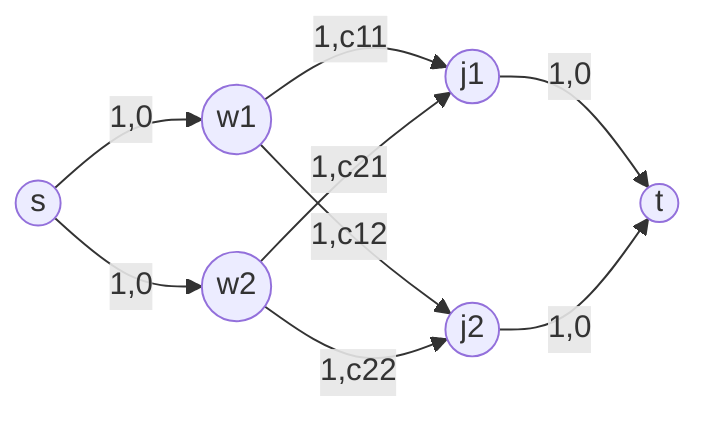

# Min-Cost Max-Flow — Middle Level

> **One-line summary:** At the middle level we move past naive Bellman-Ford SSP and learn the **reduced-cost / Johnson-potential** technique — assign each vertex a potential `h[v]`, replace each edge cost with the *reduced cost* `cost + h[u] − h[v]`, which stays **non-negative**, so we can run **Dijkstra** (with a heap) for the cheapest-path step instead of slow Bellman-Ford. We also compare SSP-BF vs SSP-Dijkstra vs cycle-canceling, model the assignment problem, handle negative edges, and analyze performance.

---

## Table of Contents

1. [Introduction](#introduction)
2. [Deeper Concepts](#deeper-concepts)
3. [Comparison with Alternatives](#comparison-with-alternatives)
4. [Advanced Patterns](#advanced-patterns)
5. [Graph and Tree Applications](#graph-and-tree-applications)
6. [Dynamic Programming Integration](#dynamic-programming-integration)
7. [Code Examples](#code-examples)
8. [Error Handling](#error-handling)
9. [Performance Analysis](#performance-analysis)
10. [Best Practices](#best-practices)
11. [Visual Animation](#visual-animation)
12. [Summary](#summary)

---

## Introduction

The junior file taught SSP with Bellman-Ford / SPFA. It is correct, but each augmentation costs `O(V·E)`, and on dense graphs or large flows that is painful. The whole point of the middle level is one idea:

> **Make Dijkstra usable on the residual graph**, even though the residual graph contains negative-cost reverse edges.

Dijkstra requires **non-negative** edge weights. The residual graph violates this. The fix — due to **Johnson** (1977), generalizing **Edmonds–Karp's** original MCMF idea — is the **potential** (or "node price") method. We attach a number `h[v]` to each vertex and work with **reduced costs** instead of raw costs. With the right potentials, every reduced cost is `≥ 0`, Dijkstra works, and the shortest path under reduced costs is also the shortest path under real costs. After each augmentation we update the potentials so the invariant is maintained for the *next* round.

This turns SSP from `O(V·E·F)` into `O(F · (E + V log V))` — a major speedup when `F` is moderate and the graph is sparse. It is the version used in serious competitive-programming templates and production solvers.

We will also survey the **cycle-canceling** algorithm (start from any max flow, then repeatedly cancel negative-cost cycles), see how the **assignment problem** maps onto MCMF, and learn to handle **negative original costs** correctly.

---

## Deeper Concepts

### Reduced costs and the potential invariant

Give every vertex a potential `h[v]`. For an edge `(u → v)` with real cost `c(u,v)`, define its **reduced cost**:

```
c'(u, v) = c(u, v) + h[u] − h[v]
```

**Telescoping property.** Along any path `s = v0 → v1 → … → vk = t`, the reduced-cost length telescopes:

```
Σ c'(vi, vi+1) = Σ [c(vi,vi+1) + h[vi] − h[vi+1]]
              = (Σ c(vi,vi+1)) + h[s] − h[t]
```

The `h[s] − h[t]` term is the **same constant** for *every* `s→t` path. Therefore **the path that minimizes reduced cost also minimizes real cost** — minimizing one minimizes the other. Dijkstra run on reduced costs returns the correct cheapest path; we recover its real cost by adding back `h[t] − h[s]`.

**Non-negativity invariant.** We want `c'(u,v) ≥ 0` for every edge with residual capacity. Set `h[v]` = shortest real-cost distance from `s` to `v`. Then for any residual edge on the graph, `h[v] ≤ h[u] + c(u,v)` (the triangle inequality for shortest paths), which rearranges to exactly `c(u,v) + h[u] − h[v] ≥ 0`. So **shortest-path distances are valid potentials.**

### Maintaining potentials across iterations

After we run Dijkstra and obtain `dist[v]` (the reduced-cost shortest distance from `s` to `v`), we update:

```
h[v] += dist[v]      (for every reachable v)
```

**Why this keeps the invariant.** Pushing flow saturates some edges and *creates* reverse edges. A new reverse edge `(v → u)` appears only when `(u → v)` was on a shortest path, meaning `dist[v] = dist[u] + c'(u,v)`, i.e. the reduced cost of `(u,v)` was `0`. Its reverse has reduced cost `−0 = 0 ≥ 0` after the update. All other edges keep `c' ≥ 0` because Dijkstra's `dist` satisfies `dist[v] ≤ dist[u] + c'(u,v)`. So after `h[v] += dist[v]`, every residual edge again has non-negative reduced cost. The invariant is **self-perpetuating** — established once, maintained forever. The full proof is in [`professional.md`](./professional.md).

### Initialization when negative edges exist

If all original costs are `≥ 0`, the zero flow has no negative edges, so `h[v] = 0` for all `v` is a valid start (every `c' = c ≥ 0`). If the input has **negative-cost edges** (but no negative cycle), `h = 0` is *not* valid, so we **initialize potentials with one Bellman-Ford pass** computing real shortest distances from `s`. After that single `O(V·E)` pre-pass, every later iteration uses fast Dijkstra. This is the standard "Bellman-Ford init, then Dijkstra loop" structure.

### The path-cost recovery

With potentials, `dist[t]` is the *reduced* cost. The *real* cost of the augmenting path is `dist[t] + h[t] − h[s]`. The cleanest bookkeeping: update `h` first (`h[t] += dist[t]`), then the real cumulative cost of the cheapest path equals the new `h[t] − h[s]`, and you add `push * (h[t] - h[s])` (with `h[s]` typically 0). The code below uses `cost += push * h[t]` after the update, taking `h[s] = 0`.

---

## Comparison with Alternatives

| Algorithm | Cheapest-path subroutine | Time complexity | Negative edges? | Negative cycles? | When to use |
|-----------|--------------------------|-----------------|-----------------|------------------|-------------|
| **SSP + Bellman-Ford / SPFA** | Bellman-Ford / SPFA | `O(V · E · F)` | Yes (handled directly) | No (must be absent) | Simplest correct version; small graphs; presence of negative edges. |
| **SSP + Dijkstra + potentials** | Dijkstra (binary heap) | `O(F · (E + V log V))` | Yes, with BF init pre-pass | No | The workhorse: sparse graphs, moderate `F`, production templates. |
| **Cycle-canceling** | Negative-cycle detection (Bellman-Ford / SPFA) | `O(V · E² · C · U)`-ish (pseudo-polynomial) | Yes | **Handles them** | Conceptually elegant; start from a known max flow; rarely fastest. |
| **Cost-scaling / push-relabel MCMF** | Scaling on `ε`-optimality | `O(V² · E · log(V·C))` | Yes | — | Large dense instances; the asymptotically strong choice (advanced). |

Notation: `F` = total flow value, `C` = max edge cost, `U` = max capacity.

**Key contrasts:**

- **BF vs Dijkstra:** Same answer, different cheapest-path engine. BF tolerates negative edges natively but is slow per iteration; Dijkstra is fast but needs the potential trick to handle the residual graph's negatives.
- **SSP vs cycle-canceling:** SSP builds optimality *incrementally* (every intermediate flow is min-cost for its value); cycle-canceling reaches *max* flow first by any means, then *repairs* cost by destroying negative cycles. SSP is usually preferred; cycle-canceling shines when you already have a max flow or want to handle negative cycles.

---

## Advanced Patterns

### Pattern 1: Min-cost flow of value `k` (not the maximum)

Run SSP but cap each push so the running flow never exceeds `k`:

```
push = min(bottleneck, k - flow)
```

Stop when `flow == k` or no path remains (then `k` units are infeasible). This is the most common real form: "ship exactly `k` units as cheaply as possible."

### Pattern 2: The Assignment Problem (min-cost perfect matching)

Given an `n × n` cost matrix, assign each worker to exactly one distinct job minimizing total cost. Build:

```
s → each worker      : cap 1, cost 0
each worker → each job: cap 1, cost = cost[w][j]
each job → t         : cap 1, cost 0
MCMF(s, t)  →  flow = n, cost = optimal assignment cost
```

The **Hungarian algorithm** is a specialized `O(n³)` MCMF for exactly this case (it is essentially SSP with potentials on the complete bipartite graph). See sibling topic *Bipartite Matching* for the unweighted analogue; the *weighted* version is precisely this assignment MCMF.

### Pattern 3: Handling negative-cost edges

If an edge can have negative cost (e.g., a profit modeled as negative cost), initialize potentials with Bellman-Ford. If a **negative cycle** exists, SSP's premise breaks; either reformulate to remove it, or switch to **cycle-canceling** which is built to cancel exactly those cycles.

### Pattern 4: Lower bounds on edges (must-use flow)

Edges with a minimum required flow `lo ≤ f ≤ hi` are modeled by the standard **lower-bound transform**: subtract `lo` from capacity, add `lo · cost` to a base cost, and route the forced flow via a super-source/super-sink. Combine with MCMF to get min-cost feasible circulation.

### Pattern 5: Converting maximization to minimization

To *maximize* profit, negate costs and minimize. After a Bellman-Ford potential init this is routine, provided no positive-profit cycle (= negative-cost cycle) exists.

---

## Graph and Tree Applications

- **Transportation problem:** `m` suppliers with supplies, `n` consumers with demands, shipping cost `c(i,j)`. Source → suppliers (cap = supply, cost 0), suppliers → consumers (cap ∞, cost `c`), consumers → sink (cap = demand, cost 0). MCMF gives the cheapest shipping plan.
- **Transshipment:** transportation with intermediate warehouse nodes — just more middle vertices.
- **Min-cost bipartite matching:** the assignment pattern, possibly with `flow < n` (maximum-cardinality min-cost matching).
- **Scheduling with costs:** jobs → machines/time-slots, each pairing carrying a penalty; MCMF picks the cheapest feasible schedule.
- **Min-cost edge-disjoint paths:** unit-capacity edges, cost = length; MCMF of value `k` finds the `k` cheapest edge-disjoint `s→t` paths combined.



---

## Dynamic Programming Integration

MCMF and DP overlap where a problem has an optimal-substructure flavor but **global resource constraints** that pure DP cannot express:

- **K-disjoint-paths / "pick k non-overlapping intervals with max value":** A 1-D DP solves the single-pick case, but "pick exactly `k` disjoint, maximize value" is cleanly a min-cost flow of value `k` on an interval graph. The flow's capacity-1 edges enforce disjointness; costs encode (negated) values.
- **Assignment-style DP:** Bitmask DP solves assignment in `O(2ⁿ · n)`; MCMF/Hungarian solves it in `O(n³)` — for `n > 20` the flow formulation wins decisively.
- **Why reach for flow over DP:** when constraints are "each resource used at most once" *and* "exactly `k` selected" *and* "minimize sum," the combination is exactly what a capacitated, costed network expresses, while DP state would blow up.

The mental switch: if you find yourself wanting a DP whose state must track a *set* of used resources, ask whether unit-capacity edges in an MCMF model the same constraint in polynomial time.

---

## Code Examples

Below is **SSP with Johnson potentials + Dijkstra**, including the Bellman-Ford initialization so it works even with negative original costs. All three print `flow=5 cost=17` on the junior example and solve the assignment example to cost 9.

### Go

```go
package main

import (
	"container/heap"
	"fmt"
)

const INF = int(1e18)

type MCMF struct {
	n             int
	to, cap, cost []int
	head          [][]int
}

func NewMCMF(n int) *MCMF { return &MCMF{n: n, head: make([][]int, n)} }

func (g *MCMF) AddEdge(u, v, cap, cost int) {
	g.head[u] = append(g.head[u], len(g.to))
	g.to = append(g.to, v); g.cap = append(g.cap, cap); g.cost = append(g.cost, cost)
	g.head[v] = append(g.head[v], len(g.to))
	g.to = append(g.to, u); g.cap = append(g.cap, 0); g.cost = append(g.cost, -cost)
}

type item struct{ d, v int }
type pq []item

func (p pq) Len() int            { return len(p) }
func (p pq) Less(i, j int) bool  { return p[i].d < p[j].d }
func (p pq) Swap(i, j int)       { p[i], p[j] = p[j], p[i] }
func (p *pq) Push(x interface{}) { *p = append(*p, x.(item)) }
func (p *pq) Pop() interface{}   { o := *p; n := len(o); it := o[n-1]; *p = o[:n-1]; return it }

func (g *MCMF) Run(s, t int) (flow, cost int) {
	h := make([]int, g.n)
	// Bellman-Ford potential initialization (handles negative edges, no neg cycle)
	for i := range h {
		h[i] = INF
	}
	h[s] = 0
	for it := 0; it < g.n-1; it++ {
		upd := false
		for u := 0; u < g.n; u++ {
			if h[u] == INF {
				continue
			}
			for _, e := range g.head[u] {
				v := g.to[e]
				if g.cap[e] > 0 && h[u]+g.cost[e] < h[v] {
					h[v] = h[u] + g.cost[e]
					upd = true
				}
			}
		}
		if !upd {
			break
		}
	}
	for i := range h {
		if h[i] == INF {
			h[i] = 0
		}
	}

	for {
		dist := make([]int, g.n)
		pe := make([]int, g.n)
		for i := range dist {
			dist[i] = INF
			pe[i] = -1
		}
		dist[s] = 0
		q := &pq{{0, s}}
		for q.Len() > 0 {
			it := heap.Pop(q).(item)
			if it.d > dist[it.v] {
				continue
			}
			u := it.v
			for _, e := range g.head[u] {
				v := g.to[e]
				if g.cap[e] > 0 {
					nd := dist[u] + g.cost[e] + h[u] - h[v] // reduced cost
					if nd < dist[v] {
						dist[v] = nd
						pe[v] = e
						heap.Push(q, item{nd, v})
					}
				}
			}
		}
		if dist[t] == INF {
			break
		}
		for i := 0; i < g.n; i++ {
			if dist[i] < INF {
				h[i] += dist[i] // maintain potentials
			}
		}
		push := INF
		for v := t; v != s; {
			e := pe[v]
			if g.cap[e] < push {
				push = g.cap[e]
			}
			v = g.to[e^1]
		}
		for v := t; v != s; {
			e := pe[v]
			g.cap[e] -= push
			g.cap[e^1] += push
			v = g.to[e^1]
		}
		flow += push
		cost += push * h[t] // real cost = h[t] - h[s], with h[s]=0
	}
	return
}

func main() {
	g := NewMCMF(4)
	for _, e := range [][4]int{{0, 1, 3, 1}, {0, 2, 2, 2}, {1, 2, 1, 1}, {1, 3, 2, 3}, {2, 3, 3, 1}} {
		g.AddEdge(e[0], e[1], e[2], e[3])
	}
	flow, cost := g.Run(0, 3)
	fmt.Printf("flow=%d cost=%d\n", flow, cost) // flow=5 cost=17
}
```

### Java

```java
import java.util.*;

public class MinCostMaxFlowPot {
    static final int INF = Integer.MAX_VALUE / 2;
    int n;
    List<int[]> edges = new ArrayList<>(); // {to, cap, cost}
    List<List<Integer>> head;

    MinCostMaxFlowPot(int n) {
        this.n = n;
        head = new ArrayList<>();
        for (int i = 0; i < n; i++) head.add(new ArrayList<>());
    }

    void addEdge(int u, int v, int cap, int cost) {
        head.get(u).add(edges.size());
        edges.add(new int[]{v, cap, cost});
        head.get(v).add(edges.size());
        edges.add(new int[]{u, 0, -cost});
    }

    long[] run(int s, int t) {
        int[] h = new int[n];
        Arrays.fill(h, INF);
        h[s] = 0;
        // Bellman-Ford potential init
        for (int it = 0; it < n - 1; it++) {
            boolean upd = false;
            for (int u = 0; u < n; u++) {
                if (h[u] == INF) continue;
                for (int eid : head.get(u)) {
                    int[] e = edges.get(eid);
                    if (e[1] > 0 && h[u] + e[2] < h[e[0]]) { h[e[0]] = h[u] + e[2]; upd = true; }
                }
            }
            if (!upd) break;
        }
        for (int i = 0; i < n; i++) if (h[i] == INF) h[i] = 0;

        long flow = 0, cost = 0;
        while (true) {
            int[] dist = new int[n];
            int[] pe = new int[n];
            Arrays.fill(dist, INF);
            Arrays.fill(pe, -1);
            dist[s] = 0;
            PriorityQueue<int[]> pq = new PriorityQueue<>((a, b) -> a[0] - b[0]);
            pq.add(new int[]{0, s});
            while (!pq.isEmpty()) {
                int[] cur = pq.poll();
                int d = cur[0], u = cur[1];
                if (d > dist[u]) continue;
                for (int eid : head.get(u)) {
                    int[] e = edges.get(eid);
                    if (e[1] > 0) {
                        int nd = dist[u] + e[2] + h[u] - h[e[0]]; // reduced cost
                        if (nd < dist[e[0]]) {
                            dist[e[0]] = nd; pe[e[0]] = eid;
                            pq.add(new int[]{nd, e[0]});
                        }
                    }
                }
            }
            if (dist[t] == INF) break;
            for (int i = 0; i < n; i++) if (dist[i] < INF) h[i] += dist[i];
            int push = INF;
            for (int v = t; v != s; ) { int e = pe[v]; push = Math.min(push, edges.get(e)[1]); v = edges.get(e ^ 1)[0]; }
            for (int v = t; v != s; ) { int e = pe[v]; edges.get(e)[1] -= push; edges.get(e ^ 1)[1] += push; v = edges.get(e ^ 1)[0]; }
            flow += push;
            cost += (long) push * h[t];
        }
        return new long[]{flow, cost};
    }

    public static void main(String[] args) {
        MinCostMaxFlowPot g = new MinCostMaxFlowPot(4);
        for (int[] e : new int[][]{{0, 1, 3, 1}, {0, 2, 2, 2}, {1, 2, 1, 1}, {1, 3, 2, 3}, {2, 3, 3, 1}})
            g.addEdge(e[0], e[1], e[2], e[3]);
        long[] r = g.run(0, 3);
        System.out.println("flow=" + r[0] + " cost=" + r[1]); // flow=5 cost=17
    }
}
```

### Python

```python
import heapq

INF = float("inf")


class MCMF:
    def __init__(self, n):
        self.n = n
        self.to, self.cap, self.cost = [], [], []
        self.head = [[] for _ in range(n)]

    def add_edge(self, u, v, cap, cost):
        self.head[u].append(len(self.to)); self.to.append(v); self.cap.append(cap); self.cost.append(cost)
        self.head[v].append(len(self.to)); self.to.append(u); self.cap.append(0); self.cost.append(-cost)

    def run(self, s, t):
        n = self.n
        # Bellman-Ford potential init
        h = [INF] * n
        h[s] = 0
        for _ in range(n - 1):
            upd = False
            for u in range(n):
                if h[u] == INF:
                    continue
                for e in self.head[u]:
                    v = self.to[e]
                    if self.cap[e] > 0 and h[u] + self.cost[e] < h[v]:
                        h[v] = h[u] + self.cost[e]; upd = True
            if not upd:
                break
        h = [0 if x == INF else x for x in h]

        flow = cost = 0
        while True:
            dist = [INF] * n
            pe = [-1] * n
            dist[s] = 0
            pq = [(0, s)]
            while pq:
                d, u = heapq.heappop(pq)
                if d > dist[u]:
                    continue
                for e in self.head[u]:
                    v = self.to[e]
                    if self.cap[e] > 0:
                        nd = d + self.cost[e] + h[u] - h[v]   # reduced cost
                        if nd < dist[v]:
                            dist[v] = nd; pe[v] = e
                            heapq.heappush(pq, (nd, v))
            if dist[t] == INF:
                break
            for i in range(n):
                if dist[i] < INF:
                    h[i] += dist[i]
            push = INF
            v = t
            while v != s:
                e = pe[v]; push = min(push, self.cap[e]); v = self.to[e ^ 1]
            v = t
            while v != s:
                e = pe[v]; self.cap[e] -= push; self.cap[e ^ 1] += push; v = self.to[e ^ 1]
            flow += push
            cost += push * h[t]
        return flow, cost


if __name__ == "__main__":
    g = MCMF(4)
    for u, v, c, w in [(0, 1, 3, 1), (0, 2, 2, 2), (1, 2, 1, 1), (1, 3, 2, 3), (2, 3, 3, 1)]:
        g.add_edge(u, v, c, w)
    print("flow={} cost={}".format(*g.run(0, 3)))   # flow=5 cost=17

    # Assignment problem demo: 3 workers x 3 jobs
    costm = [[9, 2, 7], [6, 4, 3], [5, 8, 1]]
    a = MCMF(8)  # 0=s, 1..3 workers, 4..6 jobs, 7=t
    for w in range(3):
        a.add_edge(0, 1 + w, 1, 0)
    for j in range(3):
        a.add_edge(4 + j, 7, 1, 0)
    for w in range(3):
        for j in range(3):
            a.add_edge(1 + w, 4 + j, 1, costm[w][j])
    print("assign flow={} cost={}".format(*a.run(0, 7)))  # flow=3 cost=9
```

**What it does:** SSP with potentials; the Python file also solves a 3×3 assignment instance (optimal cost 9).
**Run:** `go run main.go` | `javac MinCostMaxFlowPot.java && java MinCostMaxFlowPot` | `python mcmf_pot.py`

---

## Error Handling

| Error | Cause | Fix |
|-------|-------|-----|
| Wrong cheapest path with Dijkstra | Forgot reduced-cost formula `cost + h[u] − h[v]`. | Always compute the *reduced* cost in the relaxation. |
| Dijkstra encounters negative reduced cost | Potentials not maintained (`h[i] += dist[i]` skipped) or stale after augmentation. | Update `h` every iteration for reachable vertices. |
| Negative edges break the first Dijkstra | Skipped the Bellman-Ford init when negative edges exist. | Always run the BF init; it is cheap and a no-op (`h=0`) if costs are non-negative. |
| Unreachable vertices poison potentials | `h[v] = INF` left in place, then used in `h[u] − h[v]`. | After BF init, set unreachable `h[v] = 0` (they cannot lie on a path anyway). |
| Cost off by a constant | Used `dist[t]` (reduced) as real path cost. | Real path cost is `h[t] − h[s]` after the update; or `dist[t] + h[t]_old − h[s]_old`. |
| Non-termination | Negative cycle in input. | Detect with a full Bellman-Ford; if found, use cycle-canceling instead of SSP. |

---

## Performance Analysis

**Per-iteration cost.** BF/SPFA: `O(V·E)`. Dijkstra (binary heap): `O(E log V)` or `O(E + V log V)` with a Fibonacci heap. The number of iterations equals the number of augmentations, ≤ `F` (each pushes ≥ 1 unit of integer flow).

**Total.**

| Version | Total time |
|---------|-----------|
| SSP-BF | `O(V · E · F)` |
| SSP-Dijkstra (binary heap) | `O(F · E · log V)` |
| SSP-Dijkstra (Fibonacci) | `O(F · (E + V log V))` |

**Practical notes:**

- For **unit-capacity** graphs (matching), `F ≤ V`, so SSP-Dijkstra is `O(V · E log V)` — very fast.
- **SPFA** has excellent average behavior but adversarial worst cases; potentials+Dijkstra has predictable worst-case bounds.
- The **Bellman-Ford init is one-time** `O(V·E)`, negligible against the main loop.
- Memory is `O(V + E)`; the heap adds `O(E)` transient entries.
- Cache behavior favors the **parallel-array `e ^ 1`** layout over pointer-linked edge objects.

**Number-of-augmentations bound.** With potentials, each Dijkstra increases `h[t]` monotonically, so successive augmenting-path costs are non-decreasing — a useful invariant for early-stopping in min-cost-of-value-`k`.

---

## Best Practices

- **Default to SSP + potentials.** Keep one tested template; only fall back to plain BF for tiny graphs or quick prototypes.
- **Always include the Bellman-Ford init** so the template is correct whether or not negative edges appear; it self-disables (`h = 0`) on non-negative input.
- **Use 64-bit accumulators** for cost; flow × maxCost overflows 32-bit quickly.
- **Verify with a brute force** on small random graphs (enumerate flows / permutations); flow bugs are silent and cost bugs even more so.
- **Model deliberately:** write down node meaning, edge meaning, capacity, and cost before coding. Most MCMF bugs are modeling bugs, not algorithm bugs.
- **For value-`k`**, cap each push at `k − flow` and stop early.

---

## Visual Animation

> See [`animation.html`](./animation.html) for an interactive visual animation.
>
> The animation highlights, per round: the **reduced costs**, the **vertex potentials** updating, the **cheapest augmenting path** found by Dijkstra, and the running **flow / cost** — making the potential mechanism concrete.

---

## Summary

The middle-level leap is the **potential / reduced-cost** trick. By keeping `h[v]` equal to shortest-path distances and relaxing on `c + h[u] − h[v]`, every residual edge stays non-negative, so **Dijkstra replaces Bellman-Ford** in the inner loop, taking SSP from `O(V·E·F)` to `O(F·(E + V log V))`. A one-time Bellman-Ford pass initializes potentials when negative edges exist. We compared SSP-BF, SSP-Dijkstra, and cycle-canceling; modeled the assignment and transportation problems; and saw where MCMF beats DP — whenever constraints combine "each resource at most once," "exactly `k` chosen," and "minimize sum." Next, [`senior.md`](./senior.md) scales these ideas to real systems and [`professional.md`](./professional.md) proves them.
