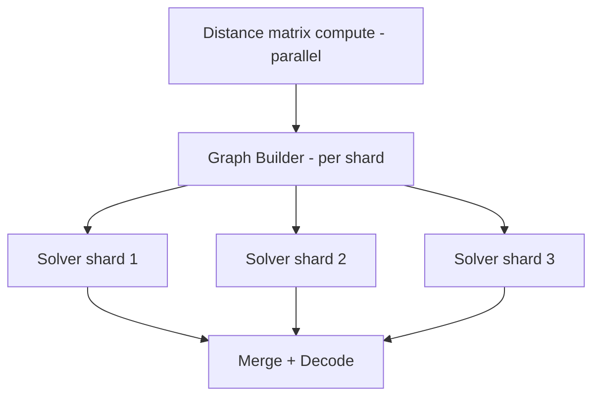

# Min-Cost Max-Flow — Senior Level

> **One-line summary:** At senior level MCMF stops being a contest trick and becomes an optimization *engine* you embed in real systems — assignment/matching services, logistics and supply-chain planners, ad/bid allocators, scheduling backends. This file covers how to design, scale, parallelize, observe, and operate MCMF-backed services, including when to swap the in-memory SSP for a distributed or LP-based solver.

---

## Table of Contents

1. [Introduction](#1-introduction)
2. [System Design with MCMF](#2-system-design-with-mcmf)
3. [Distributed and Large-Scale MCMF](#3-distributed-and-large-scale-mcmf)
4. [Concurrency and Parallelism](#4-concurrency-and-parallelism)
5. [Comparison with Alternatives at Scale](#5-comparison-with-alternatives-at-scale)
6. [Architecture Patterns](#6-architecture-patterns)
7. [Code: A Production-Shaped MCMF Service Core](#7-code-a-production-shaped-mcmf-service-core)
8. [Observability](#8-observability)
9. [Failure Modes](#9-failure-modes)
10. [Capacity Planning](#10-capacity-planning)
11. [Summary](#11-summary)

---

## 1. Introduction

MCMF is the polynomial-time hammer for a recurring business question: **"Match supply to demand at minimum cost, respecting capacities."** Whenever that sentence describes your domain — drivers to riders, ads to impressions, shipments to routes, tasks to workers, organs to recipients — there is a good chance the core is a min-cost flow.

At senior level the algorithm itself (SSP + potentials, from [`middle.md`](./middle.md)) is settled. The interesting problems are now *systemic*:

- How do I turn a stream of business entities into a flow network **repeatedly, cheaply, correctly**?
- What happens when the network is **too large for one machine**, or must be **recomputed every few seconds** as supply/demand shift?
- How do I keep the solver **observable** — knowing *why* an assignment came out a certain way?
- What are the **failure modes** (infeasibility, negative cycles from bad data, overflow, timeout) and how do I degrade gracefully?

The recurring senior insight: the *graph construction layer* and the *operational envelope* are usually harder than the solve. The solver is a library; the system around it is the engineering.

---

## 2. System Design with MCMF

A typical MCMF-backed service has four layers:

```
[ Domain events ] → [ Graph Builder ] → [ MCMF Solver ] → [ Assignment Decoder ] → [ Actions ]
   riders/drivers      nodes & edges        SSP+pot.         read flow on edges      dispatch
```

1. **Graph Builder** — translates domain objects into `(node, edge, cap, cost)`. This is the part that changes per product. Costs encode business preference (distance, ETA, fairness penalty, SLA risk); capacities encode hard limits (one driver = one ride).
2. **Solver** — a stateless, deterministic function `solve(graph) → flow`. Keep it pure: same input → same output, no I/O. This makes it testable and cacheable.
3. **Decoder** — reads which edges carry flow and reconstructs business decisions ("driver 7 → rider 12").
4. **Action layer** — dispatches, persists, notifies.

**Design rules of thumb:**

- **Keep the solver pure and in-process.** MCMF on tens of thousands of edges runs in milliseconds; do not turn it into a network RPC unless the graph is huge.
- **Costs are policy.** Treat the cost function as configuration, not code, so product can tune fairness vs efficiency without redeploying the solver.
- **Bound the problem size** at the builder (prune edges that can never be optimal — e.g., driver-rider pairs beyond a max radius). Pruning is the single biggest scaling lever.
- **Recompute on a cadence** (batch matching every N seconds) rather than per-event when arrivals are dense; batching yields globally cheaper assignments than greedy per-event matching.

**Designing the cost function.** The cost on each `worker→job` edge is where business policy lives, and it is usually a weighted sum of competing objectives:

```
cost(w, j) = α · eta(w, j)            // efficiency: minimize total travel/wait
           + β · fairness_penalty(w)  // fairness: avoid starving idle workers
           + γ · sla_risk(j)          // reliability: prioritize at-risk demand
           − δ · revenue(w, j)        // profit: subtract (negate) expected value
```

Three senior-level cautions when building this sum:

1. **Keep it integral.** SSP wants integer costs; scale floating-point terms by a fixed factor (e.g., ×100) and round. Inconsistent rounding across edges introduces silent bias.
2. **Watch for negative cycles.** The `−δ · revenue` term can make some edges negative. That is fine for SSP *as long as no negative cycle forms*; a fairness bonus plus a revenue subtraction can accidentally create a profitable loop, which makes the solve loop forever (see Section 9). Validate.
3. **Make the weights config, not code.** Product tunes `α, β, γ, δ` constantly. Shipping them as configuration (with the shadow-evaluation pattern in Section 6) lets you change policy without redeploying the solver, and keeps the solver itself a stable, pure, well-tested component.

The cost function is the single highest-leverage and highest-risk part of an MCMF service: it encodes the entire product objective, and a one-line change to it can swing every assignment.

---

## 3. Distributed and Large-Scale MCMF

MCMF does not parallelize as naturally as, say, map-reduce, because SSP is inherently sequential (each augmentation depends on the residual graph left by the previous). Strategies when one machine is not enough:

- **Geographic / temporal sharding.** Split the network into weakly-coupled regions (city zones, time windows) and solve each independently. The optimality loss is small when cross-region edges are rare and high-cost anyway. This is how ride-hailing platforms scale matching — they do not solve one global flow.
- **Decomposition (Dantzig–Wolfe / Lagrangian).** For coupled subproblems, relax the linking constraints with Lagrange multipliers and solve subproblems independently, iterating on the multipliers. Heavyweight; used in OR, not typical backends.
- **LP/MIP offload.** Min-cost flow is a linear program with a totally-unimodular constraint matrix, so its LP relaxation is integral. For very large or constraint-rich instances, hand the model to a battle-tested LP solver (HiGHS, OR-Tools, Gurobi) which has parallel simplex/barrier and decades of numerical hardening.
- **Auction algorithms.** For assignment specifically, the **auction algorithm** (Bertsekas) is naturally parallelizable across bidders and is used in distributed settings; it is an alternative to SSP/Hungarian.
- **Incremental re-solve.** When supply/demand changes slightly, *warm-start* from the previous flow and potentials rather than solving from scratch — re-route only the affected augmenting paths.

The honest senior position: **shard or offload to an LP solver** before attempting a hand-rolled distributed SSP. Distributed exact min-cost flow is a research-grade undertaking; sharded near-optimal flow is a Tuesday.

---

## 4. Concurrency and Parallelism

The SSP inner loop is sequential, but a service has plenty of concurrency to exploit *around* it:

- **Parallel graph construction.** Building edges (e.g., computing pairwise costs via a distance matrix) is embarrassingly parallel — fan out across goroutines/threads, then assemble the immutable graph.
- **Parallel independent solves.** Sharded regions solve concurrently; this is the main parallel win.
- **Solver isolation.** Run each solve on an immutable input so multiple requests share no mutable state — no locks needed inside the solver. The residual graph is per-solve scratch.
- **Pipeline parallelism.** While shard A's solver runs, shard B's builder runs; overlap stages.
- **What NOT to parallelize:** the augmenting-path loop itself. Attempts to push multiple paths concurrently corrupt the residual graph and the potential invariant. Parallel min-cost flow uses different algorithms (auction, cost-scaling with parallel relabel), not parallel SSP.



---

## 5. Comparison with Alternatives at Scale

| Approach | Best for | Scale ceiling | Parallel? | Notes |
|----------|----------|---------------|-----------|-------|
| **In-memory SSP + potentials** | ≤ ~10⁵ edges, sub-second | Single node | No (sequential core) | The default; warm-start for incremental updates. |
| **Hungarian `O(n³)`** | Dense square assignment, `n ≤ ~few thousand` | Single node | Partially | Specialized; great constants for pure assignment. |
| **Auction algorithm** | Assignment, distributed | Multi-node | Yes | Tunable ε precision; good for streaming. |
| **LP/MIP solver (HiGHS/OR-Tools/Gurobi)** | Huge or constraint-rich models | Very large | Yes (parallel barrier/simplex) | Offload when you outgrow hand-rolled flow or need side constraints. |
| **Geographic sharding + per-shard SSP** | Spatial matching (rides, delivery) | Horizontally scalable | Yes (across shards) | Near-optimal; the practical web-scale answer. |
| **Greedy / heuristic matching** | Ultra-low-latency, approximate OK | Unlimited | Yes | Drops optimality; use when latency budget < solve time. |

The scaling story: **start in-memory, prune aggressively, shard spatially, offload to an LP solver only when constraints exceed pure flow.**

---

## 6. Architecture Patterns

### Pattern A: Batch matching loop

A control loop runs every `Δt`: snapshot open supply and demand, build the graph, solve MCMF, dispatch. Used by ride-hailing, delivery batching, ad pacing. Tunable `Δt` trades latency for assignment quality (bigger batches → cheaper global cost).

### Pattern B: Solver as a sidecar / library

Embed the solver as a library in the matching service (no extra hop). Expose cost policy via config. Keep the solver versioned and deterministic so results are reproducible and auditable.

### Pattern C: Warm-started incremental re-solve

Persist the last flow + potentials. On a small delta (one driver goes offline), invalidate only affected edges and run a few augmentation/cancellation steps from the warm state. Orders of magnitude faster than cold solves for high-frequency updates.

### Pattern D: Shadow / canary cost functions

Run a candidate cost function in shadow alongside production, compare the resulting assignments offline (total cost, fairness metrics), and roll out only if the new policy improves the objective without regressions.

### Pattern E: Feasibility guard + fallback

Before solving, check that demand ≤ supply (or handle the shortfall explicitly). On infeasibility or timeout, fall back to a greedy assignment so the system never stalls.

---

## 7. Code: A Production-Shaped MCMF Service Core

A reusable solver with: 64-bit cost, potentials, optional value-`k` cap, a returned *flow assignment* (which original edges carry flow), and a deterministic interface. Shown in three languages.

### Go

```go
package mcmf

import "container/heap"

const INF = int64(1) << 60

type Edge struct {
	To, Rev   int
	Cap, Cost int64
	OrigID    int // -1 for reverse edges
}

type Solver struct {
	N     int
	G     [][]Edge
	edges int
}

func New(n int) *Solver { return &Solver{N: n, G: make([][]Edge, n)} }

// AddEdge returns the original edge id; query Flow(id) after solving.
func (s *Solver) AddEdge(u, v int, cap, cost int64) int {
	id := s.edges
	s.edges++
	s.G[u] = append(s.G[u], Edge{To: v, Rev: len(s.G[v]), Cap: cap, Cost: cost, OrigID: id})
	s.G[v] = append(s.G[v], Edge{To: u, Rev: len(s.G[u]) - 1, Cap: 0, Cost: -cost, OrigID: -1})
	return id
}

type pqi struct{ d int64; v int }
type pq []pqi
func (p pq) Len() int            { return len(p) }
func (p pq) Less(i, j int) bool  { return p[i].d < p[j].d }
func (p pq) Swap(i, j int)       { p[i], p[j] = p[j], p[i] }
func (p *pq) Push(x interface{}) { *p = append(*p, x.(pqi)) }
func (p *pq) Pop() interface{}   { o := *p; n := len(o); it := o[n-1]; *p = o[:n-1]; return it }

// Solve computes min-cost flow up to maxFlow (use INF for max flow).
func (s *Solver) Solve(src, snk int, maxFlow int64) (flow, cost int64) {
	h := make([]int64, s.N)
	// Bellman-Ford potential init.
	for i := range h {
		h[i] = INF
	}
	h[src] = 0
	for it := 0; it < s.N-1; it++ {
		upd := false
		for u := 0; u < s.N; u++ {
			if h[u] == INF {
				continue
			}
			for _, e := range s.G[u] {
				if e.Cap > 0 && h[u]+e.Cost < h[e.To] {
					h[e.To] = h[u] + e.Cost
					upd = true
				}
			}
		}
		if !upd {
			break
		}
	}
	for i := range h {
		if h[i] == INF {
			h[i] = 0
		}
	}
	prevV := make([]int, s.N)
	prevE := make([]int, s.N)
	for flow < maxFlow {
		dist := make([]int64, s.N)
		for i := range dist {
			dist[i] = INF
		}
		dist[src] = 0
		q := &pq{{0, src}}
		for q.Len() > 0 {
			it := heap.Pop(q).(pqi)
			if it.d > dist[it.v] {
				continue
			}
			u := it.v
			for i, e := range s.G[u] {
				if e.Cap > 0 {
					nd := dist[u] + e.Cost + h[u] - h[e.To]
					if nd < dist[e.To] {
						dist[e.To] = nd
						prevV[e.To] = u
						prevE[e.To] = i
						heap.Push(q, pqi{nd, e.To})
					}
				}
			}
		}
		if dist[snk] == INF {
			break
		}
		for i := 0; i < s.N; i++ {
			if dist[i] < INF {
				h[i] += dist[i]
			}
		}
		push := maxFlow - flow
		for v := snk; v != src; v = prevV[v] {
			if c := s.G[prevV[v]][prevE[v]].Cap; c < push {
				push = c
			}
		}
		for v := snk; v != src; v = prevV[v] {
			e := &s.G[prevV[v]][prevE[v]]
			e.Cap -= push
			s.G[v][e.Rev].Cap += push
		}
		flow += push
		cost += push * h[snk]
	}
	return
}
```

### Java

```java
import java.util.*;

public class MCMFSolver {
    static final long INF = Long.MAX_VALUE / 4;
    int n;
    long[][] cap;            // dense for clarity; use lists for sparse
    long[][] cost;
    List<int[]>[] adj;       // adjacency: index into edge arrays

    int[] eto; long[] ecap, ecost; int[] head, nxt; int ecnt = 0;

    @SuppressWarnings("unchecked")
    MCMFSolver(int n, int m) {
        this.n = n;
        eto = new int[2 * m]; ecap = new long[2 * m]; ecost = new long[2 * m];
        nxt = new int[2 * m]; head = new int[n];
        Arrays.fill(head, -1);
    }

    void addEdge(int u, int v, long c, long w) {
        eto[ecnt] = v; ecap[ecnt] = c; ecost[ecnt] = w; nxt[ecnt] = head[u]; head[u] = ecnt++;
        eto[ecnt] = u; ecap[ecnt] = 0; ecost[ecnt] = -w; nxt[ecnt] = head[v]; head[v] = ecnt++;
    }

    long[] solve(int s, int t, long maxFlow) {
        long[] h = new long[n];
        Arrays.fill(h, INF); h[s] = 0;
        for (int it = 0; it < n - 1; it++) {
            boolean upd = false;
            for (int u = 0; u < n; u++) {
                if (h[u] == INF) continue;
                for (int e = head[u]; e != -1; e = nxt[e])
                    if (ecap[e] > 0 && h[u] + ecost[e] < h[eto[e]]) { h[eto[e]] = h[u] + ecost[e]; upd = true; }
            }
            if (!upd) break;
        }
        for (int i = 0; i < n; i++) if (h[i] == INF) h[i] = 0;

        long flow = 0, cost = 0;
        long[] dist = new long[n];
        int[] pe = new int[n];
        while (flow < maxFlow) {
            Arrays.fill(dist, INF); Arrays.fill(pe, -1);
            dist[s] = 0;
            PriorityQueue<long[]> pq = new PriorityQueue<>((a, b) -> Long.compare(a[0], b[0]));
            pq.add(new long[]{0, s});
            while (!pq.isEmpty()) {
                long[] cur = pq.poll();
                long d = cur[0]; int u = (int) cur[1];
                if (d > dist[u]) continue;
                for (int e = head[u]; e != -1; e = nxt[e]) {
                    if (ecap[e] > 0) {
                        long nd = dist[u] + ecost[e] + h[u] - h[eto[e]];
                        if (nd < dist[eto[e]]) { dist[eto[e]] = nd; pe[eto[e]] = e; pq.add(new long[]{nd, eto[e]}); }
                    }
                }
            }
            if (dist[t] == INF) break;
            for (int i = 0; i < n; i++) if (dist[i] < INF) h[i] += dist[i];
            long push = maxFlow - flow;
            for (int v = t; v != s; v = eto[pe[v] ^ 1]) push = Math.min(push, ecap[pe[v]]);
            for (int v = t; v != s; v = eto[pe[v] ^ 1]) { ecap[pe[v]] -= push; ecap[pe[v] ^ 1] += push; }
            flow += push;
            cost += push * h[t];
        }
        return new long[]{flow, cost};
    }
}
```

### Python

```python
import heapq

INF = float("inf")


class MCMFSolver:
    """Production-shaped: 64-bit (native int), potentials, value-k cap, edge-flow query."""

    def __init__(self, n):
        self.n = n
        self.to, self.cap, self.cost = [], [], []
        self.head = [[] for _ in range(n)]
        self._orig = []  # (edge_id) -> forward array index

    def add_edge(self, u, v, cap, cost):
        eid = len(self._orig)
        self._orig.append(len(self.to))
        self.head[u].append(len(self.to)); self.to.append(v); self.cap.append(cap); self.cost.append(cost)
        self.head[v].append(len(self.to)); self.to.append(u); self.cap.append(0); self.cost.append(-cost)
        return eid

    def flow_on(self, eid):
        fwd = self._orig[eid]
        return self.cap[fwd ^ 1]  # reverse residual == flow pushed forward

    def solve(self, s, t, max_flow=INF):
        n = self.n
        h = [INF] * n
        h[s] = 0
        for _ in range(n - 1):
            upd = False
            for u in range(n):
                if h[u] == INF:
                    continue
                for e in self.head[u]:
                    v = self.to[e]
                    if self.cap[e] > 0 and h[u] + self.cost[e] < h[v]:
                        h[v] = h[u] + self.cost[e]; upd = True
            if not upd:
                break
        h = [0 if x == INF else x for x in h]

        flow = cost = 0
        while flow < max_flow:
            dist = [INF] * n
            pe = [-1] * n
            dist[s] = 0
            pq = [(0, s)]
            while pq:
                d, u = heapq.heappop(pq)
                if d > dist[u]:
                    continue
                for e in self.head[u]:
                    v = self.to[e]
                    if self.cap[e] > 0:
                        nd = d + self.cost[e] + h[u] - h[v]
                        if nd < dist[v]:
                            dist[v] = nd; pe[v] = e; heapq.heappush(pq, (nd, v))
            if dist[t] == INF:
                break
            for i in range(n):
                if dist[i] < INF:
                    h[i] += dist[i]
            push = max_flow - flow
            v = t
            while v != s:
                push = min(push, self.cap[pe[v]]); v = self.to[pe[v] ^ 1]
            v = t
            while v != s:
                self.cap[pe[v]] -= push; self.cap[pe[v] ^ 1] += push; v = self.to[pe[v] ^ 1]
            flow += push
            cost += push * h[t]
        return flow, cost
```

These cores plug into the Builder/Decoder layers of Section 2: `add_edge` returns an id, and `flow_on(id)` (Python) / reading the reverse cap (Go/Java) decodes which assignments were made.

---

## 8. Observability

What to emit from an MCMF service:

- **Solve metrics:** number of augmentations, total iterations, wall-clock per phase (build / solve / decode), final flow value, final total cost.
- **Network size:** `|V|`, `|E|` after pruning — track to catch graph blowups early.
- **Feasibility:** did we reach the target flow? Emit `requested_flow` vs `achieved_flow`; an unexpected shortfall signals supply/demand imbalance or modeling bugs.
- **Cost breakdown / explainability:** for each carried edge, log `(from, to, units, unit_cost)`. This is the audit trail that answers "why was driver 7 sent to rider 12?" — essential for trust, disputes, and fairness reviews.
- **Potential drift:** in warm-started incremental solves, track how far potentials moved; large jumps indicate a structural change worth alerting on.
- **Distribution histograms:** assignment cost per unit, match distance, wait time — to monitor *quality*, not just feasibility.

Dashboards should show solve latency p50/p99, edges per solve, and objective value over time. A sudden objective spike with stable inputs usually means a cost-policy or data bug.

**Suggested SLOs and the metrics that back them:**

| SLO | Metric | Typical target |
|-----|--------|----------------|
| Matching is fresh | solve end-to-end latency p99 | < batch window `Δt` |
| Demand is served | `achieved_flow / requested_flow` | > 99% (else alert) |
| Solver is healthy | augmentations per solve | within historical band |
| Cost is stable | objective per unit flow, rolling | no step changes without a config change |
| Fallback is rare | fraction of solves served by greedy | < 1% |

**Explainability as a first-class feature.** The per-edge cost-breakdown log is not just debugging — it is the product surface for trust. When a worker asks "why did I not get that job," the answer is reconstructable: the chosen assignment had a lower *total* objective across everyone, and you can show the marginal cost of the alternative. Persist these breakdowns for a retention window sized to your dispute-resolution and audit needs, and make them queryable by entity id, not just by solve id.

---

## 9. Failure Modes

| Failure | Symptom | Mitigation |
|---------|---------|------------|
| **Infeasibility** (demand > supply) | Achieved flow < requested; some demand unmatched. | Model unmet demand explicitly (a high-cost "dummy" sink edge) so the solve always completes and you can see the shortfall. |
| **Negative cycle from bad data** | Solver loops / never terminates. | Validate input; run a full Bellman-Ford cycle check before solving; reject or repair. |
| **Cost/flow overflow** | Garbage negative totals. | 64-bit accumulators; bound `F × maxCost` at validation time. |
| **Graph blowup** | Latency spikes, OOM. | Prune dominated edges at the builder; cap `|E|`; alert on size. |
| **Timeout under load** | Solve exceeds budget during peaks. | Fall back to greedy assignment; shard; warm-start. |
| **Non-determinism** | Same input, different output (tie-breaking). | Make tie-breaking deterministic (stable edge order); critical for reproducibility/audits. |
| **Stale warm state** | Incremental solve gives stale assignments. | Invalidate affected edges precisely; periodically do a full cold re-solve as ground truth. |

The defining senior discipline: **the solve must always return something** within the latency budget — exact when possible, a documented fallback otherwise. A matching service that stalls is worse than one that occasionally returns a slightly costlier assignment.

### Incident runbook (worked example)

A concrete on-call sequence when the matching service alerts on rising p99 latency:

1. **Confirm scope.** Check the `|E|` and augmentation-count dashboards. If `|E|` jumped, the builder is emitting too many candidate edges (e.g., the radius prune was loosened by a config change). Roll back the config; that is usually the whole fix.
2. **Check feasibility shifts.** If `requested_flow` rose sharply (a surge in demand), the solve is simply bigger. Confirm the greedy fallback is engaging on timeouts so users still get matched.
3. **Inspect potential drift.** In warm-started solves, a spike in potential movement means a structural change (a region went offline). Force a cold re-solve for that shard as ground truth and compare.
4. **Validate input.** A non-terminating solve (CPU pinned, no result) almost always means a **negative cycle from bad cost data** — e.g., a fairness bonus that overcorrected into a negative loop. Run the Bellman-Ford cycle check on the offending shard's graph; reject or clamp the bad costs.
5. **Shed load if needed.** If many shards are hot simultaneously (rush hour), temporarily widen the batch window `Δt` — fewer, larger solves cost less total CPU and yield cheaper assignments, at the price of slightly higher match latency. This is the lever that trades quality-of-experience for stability.
6. **Post-incident.** Add an alert on the specific signal that fired first (usually `|E|` or potential drift), and add a unit test reproducing the bad-cost negative cycle so it cannot regress.

The thread through all six steps: the *solver* is rarely the culprit. Latency and correctness incidents almost always trace to the **graph the builder produced** — its size, its costs, or its feasibility — which is why the observability in Section 8 instruments the builder's output as heavily as the solver itself.

---

## 10. Capacity Planning

- **Latency model:** SSP-Dijkstra ≈ `F` augmentations × `O(E log V)`. For matching, `F ≤ V`. Benchmark on representative graphs; latency is dominated by `|E|` and `F`, so **pruning edges and bounding `F` are your main levers.**
- **Memory:** `O(V + E)` for the residual graph; the dense Java variant is `O(V²)` — switch to sparse for large `V`.
- **Throughput:** if each solve is `T` ms and arrivals demand `Q` solves/sec, you need `⌈Q · T / 1000⌉` solver workers (solves are independent, so workers scale linearly). Sharding multiplies effective throughput.
- **Batch sizing:** larger batch windows → bigger graphs (slower solves) but cheaper global cost. Tune `Δt` against the latency SLA and the marginal cost improvement curve (diminishing returns).
- **Headroom:** size for p99 graph size, not average; assignment graphs are bursty (rush hour). Keep ~2× headroom on solver workers.
- **Warm-start savings:** incremental re-solves can cut per-update cost by 10–100× when changes are local; budget for cold-solve fallbacks at a low rate.

---

## 11. Summary

At senior level the MCMF *algorithm* is a solved library; the *system* is the work. Design a clean Builder → pure Solver → Decoder pipeline; treat cost as tunable policy; **prune edges** to control size. Scale by **geographic/temporal sharding** and, when constraints outgrow pure flow, **offload to an LP solver** — distributed exact SSP is rarely worth it because SSP's core is sequential. Parallelize construction and independent solves, never the augmenting loop. Make solves deterministic and explainable for auditing, guard against infeasibility and overflow, and always return *something* within budget via greedy fallback. The proofs behind why SSP is correct and optimal live in [`professional.md`](./professional.md); the interview drills in [`interview.md`](./interview.md).

**The senior checklist, distilled:**

- Builder produces a *pruned, validated, integral-cost* graph — instrument it more than the solver.
- Solver is pure, deterministic, warm-startable, and version-pinned.
- Cost weights are configuration; ship policy changes through shadow evaluation, not redeploys.
- Every solve returns within the batch window or degrades to greedy — never stalls.
- Validate against negative cycles before solving; clamp or reject bad cost data.
- Shard spatially to scale out; reach for an LP/network-simplex solver only when side constraints break pure flow.
- Persist per-edge cost breakdowns so any assignment is explainable to a human after the fact.
- Define SLOs on freshness, served-demand ratio, and fallback rate; alert on the *earliest* signal (graph size, potential drift).
- Capacity-plan for the p99 burst, not the average, and keep ~2× solver-worker headroom for rush-hour spikes.
- Keep a brute-force / LP oracle in CI to catch silent correctness regressions in the solver or builder.

Internalize these and MCMF becomes a dependable optimization primitive you can run thousands of times a second under a tight SLA, not just a clever algorithm on a whiteboard.
